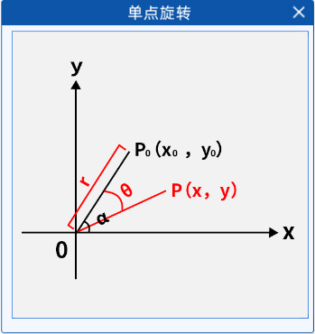
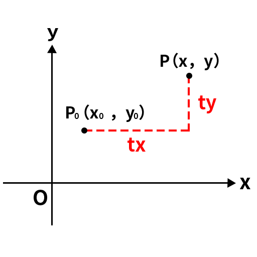

# 图像仿射变换

**仿射变换是一种二维坐标到二维坐标之间的线性变换，也就是只涉及一个平面内二维图形的线性变换**

**仿射变换的性质：**

1. **保持平行性**：原来平行的直线在变换后仍然保持平行
2. **保持共线性**：共线的点在仿射变换后仍然共线
3. **保持比例关系**：仿射变换会保持同一条直线上线段的比例关系
4. **变换可逆**：如果对图像进行了一次仿射变换(变换矩阵为M)，那么可以通过其**逆变换(使用M的逆矩阵进行仿射变换)**将图像恢复到原来的状态

在这一部分中我们会使用的核心函数是cv2.warpAffine

下面只介绍最基本的原理，有关API的使用会在.py文件中提及

## 图像旋转

图像旋转是指图像以某一点为旋转中心，将图像中的所有像素点都围绕该点旋转一定的角度，并且旋转后的像素点组成的图像与原图像相同。

图像旋转是仿射变换的一种。它保持了二维图形的两种性质：

1. **平直性**：直线经过变换后依然是直线。
2. **平行性**：平行线经过变换后依然是平行线。

### 一、单点旋转

首先我们以最简单的一个点的旋转为例子，且以最简单的情况举例，令旋转中心为坐标系中心O（0，0），假设有一点$P_{0}(x_{0},y_{0})$，$P_{0}$离旋转中心O的距离为r，$OP_{0}$与坐标轴x轴的夹角为$\alpha$，$P_{0}$绕O顺时针旋转$\theta$角后对应的点为$P(x,y)$，如下图所示：




那么我们可以得到如下关系：
$$
x_{0}=r\times\cos\alpha
$$

$$
y_{0}=r\times\sin\alpha
$$

$$
x=r\times\cos(\alpha-\theta)=r\cos\alpha\cos\theta+r\sin\alpha\sin\theta=x_{0}\cos\theta+y_{0}\sin\theta
$$

$$
y=r\times\sin(\alpha-\theta)=r\sin\alpha\cos\theta-r\cos\alpha\sin\theta=-x_{0}\sin\theta+y_{0}\cos\theta
$$

用矩阵来表示就是
$$
\left[\begin{array}{l  l}{{x}}\\{{y}}\end{array}\right]=\left[\begin{array}{l  l}{{\cos\theta~~~~\sin\theta}}\\{{-\sin\theta~~~~\cos\theta}}\\
\end{array}\right]*\left[\begin{array}{c}{{x_{0}}}\\{{y_{0}}}\end{array}\right]
$$
然而，**在OpenCV中，旋转时是以图像的左上角为旋转中心，且以逆时针为正方向**，因此上面的例子中其实是个负值，那么该矩阵可写为：
$$
\left[\begin{array}{l  l}{{x}}\\{{y}}\end{array}\right]=\left[\begin{array}{l  l}{{\cos\theta~~~~-\sin\theta}}\\{{\sin\theta~~~~\cos\theta}}\\
\end{array}\right]*\left[\begin{array}{c}{{x_{0}}}\\{{y_{0}}}\end{array}\right]
$$
其中，
$$
\left[\begin{array}{l  l}{{\cos\theta~~~~-\sin\theta}}\\{{\sin\theta~~~~\cos\theta}}\\
\end{array}\right]
$$
也被称作**旋转矩阵(相对于原点的)**。然而我们所要的不仅仅是可以围绕图像左上角进行旋转，而是可以围绕任意点进行旋转。那么我们可以将其转化成绕原点的旋转，其过程为：

1. 首先将旋转点移到原点
2. 按照上面的旋转矩阵进行旋转得到新的坐标点
3. 再将得到的旋转点移回原来的位置

也就是说，在以任意点为旋转中心时，除了要进行旋转之外，还要进行平移操作。那么当点经过平移后得到P点时，如下图所示：



那么我们就可以得到：
$$
x=x_{0}+t_{x}
$$

$$
y=y_{0}+t_{y}
$$

写成矩阵的形式为：
$$
\left[\begin{array}{l  l  l}{{x}}\\{{y}}\\{1}\end{array}\right]=\left[\begin{array}{c}{{1~~~~0~~~~t_{x}}}\\{{0~~~~1~~~~t_{y}}}\\{{0~~~~0~~~~1}}
\end{array}\right]*\left[\begin{array}{c}{{x_0}}\\{{y_0}}\\{1}\end{array}\right]
$$
于是
$$
\left[\begin{array}{l  l  l}{{1~~~~0~~~~t_{x}}}\\{{0~~~~1~~~~t_{y}}}\\{{0~~~~0~~~~1}}
\end{array}\right]
$$
也被叫做**平移矩阵**，相反的，从P移到点时，其平移矩阵为：
$$
\left[\begin{array}{l l l}{1}&{0}&{-\,t_{x}}\\ {0}&{1}&{-\,t_{y}}\\ {0}&{0}&{1}\end{array}\right]
$$
我们将原始的旋转矩阵也扩展到3\*3的形式：
$$
\begin{array}{l l l}{{\left[\begin{array}{c}{{x}}\\{{y}}\\{1} \end{array}\right]=\left[\begin{array}{c c c}{{\cos\theta}}&{{-\sin\theta}}&{{0}}\\ {{\sin\theta}}&{{\cos\theta}}&{{0}}\\ {{0}}&{{0}}&{{1}}\end{array}\right]*\left[\begin{array}{c}{{x_{0}}}\\{{y_{0}}}\\{{1}}\end{array}\right]}}\end{array}
$$
从平移和旋转的矩阵可以看出，3x3矩阵的前2x2部分是和旋转相关的，第三列与平移相关。有了上面的表达式之后，我们就可以得到二维空间中绕任意点旋转的旋转矩阵了，只需要将旋转矩阵先左乘
$$
\left[\begin{array}{l  l  l}{{1~~~~0~~~~t_{x}}}\\{{0~~~~1~~~~t_{y}}}\\{{0~~~~0~~~~1}}
\end{array}\right]
$$
，再右乘
$$
\left[\begin{array}{l l l}{1}&{0}&{-\,t_{x}}\\ {0}&{1}&{-\,t_{y}}\\ {0}&{0}&{1}\end{array}\right]
$$
即可得到最终的矩阵，其结果为：
$$
M=\left[\begin{array}{l  l  l}{{\cos\theta~~-\sin\theta~~(1-\cos\theta)t_{x}+t_{y}*\sin\theta}}\\{{\sin\theta~~~\cos\theta~~~~~(1-\cos\theta)t_{y}+t_{x}*\sin\theta}}\\{{0~~~~~~~~~~~~~0~~~~~~~~~~~~~1}}
\end{array}\right]
$$
于是我们就可以根据这个矩阵计算出图像中任意一点绕某点旋转后的坐标了，这个矩阵学名叫做**仿射变换矩阵(齐次坐标矩阵)**

而我们实际用到的**仿射变换矩阵**是它的前两排：
$$
M=\left[\begin{array}{l  l  l}{{\cos\theta~~-\sin\theta~~(1-\cos\theta)t_{x}+t_{y}*\sin\theta}}\\{{\sin\theta~~~\cos\theta~~~~~(1-\cos\theta)t_{y}+t_{x}*\sin\theta}}
\end{array}\right]
$$

**注意：仿射变换矩阵的齐次坐标矩阵仅用于复合变换(比如同时平移和旋转)做矩阵乘法**

### 二、图片旋转

明白了单个点的旋转过程之后，其实图像旋转也很好理解，就是将图像里的每个像素点都带入仿射变换矩阵里，从而得到旋转后的新坐标。在OpenCV中，要得到仿射变换矩阵可以使用**cv2.getRotationMatrix2D**，通过这个函数即可直接获取到上面的旋转矩阵。


## 放射变换矩阵详解  


### 一、仿射变换矩阵的核心参数  
仿射变换通过一个 **2×3 矩阵** 实现对图像的线性变换（缩放、剪切、旋转和平移），其通用形式为：  
$$
M = \begin{bmatrix} 
a & b & c \\  % 第一行：x 方向变换（缩放、剪切、平移）
d & e & f \\  % 第二行：y 方向变换（缩放、剪切、平移）
\end{bmatrix}
$$

- **缩放参数**：  	
  - `a`：控制 x 轴缩放比例（水平方向），  
  - `e`：控制 y 轴缩放比例（垂直方向）。  
- **剪切参数**：  
  - `b`：x 方向剪切因子（图像沿 y 轴倾斜），  
  - `d`：y 方向剪切因子（图像沿 x 轴倾斜）。  
- **平移参数**：  
  - `c`：x 方向平移量（向右为正），  
  - `f`：y 方向平移量（向下为正）。  
- **旋转参数**：
  - 绕原点旋转时会用到 `a` `b` `d` `e` 四个参数
  - 绕某一指定点旋转时则涉及所有的6个参数


### 二、仿射变换矩阵的单位矩阵

当图像不进行任何变换时，仿射变换矩阵为单位矩阵：
$$
M = \begin{bmatrix} 
1 & 0 & 0 \\  
0 & 1 & 0 \\ 
\end{bmatrix}
$$
将其转换为齐次坐标形式：
$$
M=\begin{bmatrix} 
1 & 0 & 0 \\  
0 & 1 & 0 \\ 
0 & 0 & 1
\end{bmatrix}
$$
在后续我们进行的一系列操作(缩放、剪切、旋转和平移)，都是在 **M** 矩阵的基础上对个别参数进行调整


### 三、从原始矩阵构建常见变换矩阵

#### 1. **平移**

- **二维矩阵**：在原始矩阵基础上修改第三列

  ​
  $$
  \begin{bmatrix} 
  1 & 0 & t_x \\  
  0 & 1 & t_y \\ 
  \end{bmatrix}
  $$
  ​

- **齐次矩阵**：

  ​
  $$
  \begin{bmatrix} 
  1 & 0 & t_x \\  
  0 & 1 & t_y \\ 
  0 & 0 & 1
  \end{bmatrix}
  $$
  ​

#### 2. **旋转**

- **二维矩阵**：通过三角函数修改前两列，原始矩阵的 1 和 0 被替换为旋转系数

  ​
  $$
  \left[\begin{array}{l  l}{{\cos\theta~~-\sin\theta}}~~~~0\\{{\sin\theta~~~~\cos\theta}}~~~~~~0\\
  \end{array}\right]
  $$

- **齐次矩阵**：
  $$
  \begin{array}{l l l}{{\left[\begin{array}{c c c}{{\cos\theta}}&{{-\sin\theta}}&{{0}}\\ {{\sin\theta}}&{{\cos\theta}}&{{0}}\\ {{0}}&{{0}}&{{1}}\end{array}\right]}}\end{array}
  $$


#### 3. **缩放**

- **二维矩阵**：修改对角线元素（原始为 1，缩放后为 $s_x$,$s_y$）

  ​
  $$
  \begin{bmatrix} 
  s_x & 0 & 0 \\  
  0  & s_y & 0 \\ 
  \end{bmatrix}
  $$

- **齐次矩阵**：
  $$
  \begin{bmatrix} 
  s_x & 0 & 0 \\  
  0 & s_y  & 0 \\ 
  0 & 0 & 1
  \end{bmatrix}
  $$


#### 4. 剪切

- **二维矩阵**：修改副对角线元素（原始为 0，剪切后为 $S_x$,$S_y$）

  ​
  $$
  \begin{bmatrix} 
  0 & S_x & 0 \\  
  S_y  &0 & 0 \\ 
  \end{bmatrix}
  $$

- **齐次矩阵**：

$$
\begin{bmatrix} 
0 & S_x & 0 \\  
S_y  &0 & 0 \\ 
0 & 0 & 1
\end{bmatrix}
$$


#### 5. 复合矩阵

在处理复合变换（如剪切 + 平移 + 旋转）时，我们不需要进行多次仿射变换(那样太麻烦)，我们的通常做法是将所有涉及的仿射变换的仿射变换矩阵的齐次坐标矩阵进行矩阵乘法(**右乘先发生，左乘后发生**)，使用得到的最终矩阵的前两行进行仿射变换


举例：(剪切 + 平移 + 旋转)

​	**M = 旋转矩阵 · 平移矩阵 · 剪切矩阵**

​	**(根据这个矩阵，图像会先剪切，再平移，最后再旋转)**


举例：(围绕某一点进行旋转)

​	**M = 原点相对于那一点构建的平移矩阵 · 旋转矩阵 · 原点相对于那一点构建的平移矩阵的逆矩阵**

​	**(OpenCV中使用cv2.warpAffine函数对图像进行仿射变换时一切的变换都是针对于原图像原点而言)**


**注意：齐次矩阵相乘的结果也是一个 3x3 矩阵，且这个矩阵的最后一行必定是 [0   0   1]**


## cv2.warpAffine函数运行原理


### **一、参数解析与初始化**  
1. **输入参数校验**：  
   - **输入图像（`src`）**：支持单/三通道，数据类型为 `uint8` 或 `float32`，尺寸为 `(height, width)`。  
   - **变换矩阵（`M`）**：必须是 **2×3 矩阵**，前两列控制线性变换（旋转、缩放、剪切），第三列控制平移。  
   - **输出尺寸（`dsize`）**：指定输出图像的宽度和高度 `(w, h)`
   - **可选参数**：插值方法（默认双线性）、边界模式（默认黑色填充）、边界值（默认0）。    


### **二、反向坐标映射（核心步骤）**  

1. **创建一个宽度和高度为 (w, h) 的输出图像**

2. **遍历输出图像像素**：  

   对输出图像每个像素坐标 `(x', y')`（范围：`0 ≤ x' < w`, `0 ≤ y' < h`），通过 **逆变换矩阵 `M⁻¹`** 计算其在输入图像中的对应坐标 `(x, y)`

3. **亚像素坐标处理**：  

   `(x, y)` 可能为浮点数（亚像素级），需通过插值方法计算该位置的像素值（如双线性插值利用周围4像素加权平均）。  

### **三、插值计算像素值**  
1. **插值方法选择**：  
   - **最近邻插值**：取最近整数坐标像素值，速度快但锯齿明显。  
   - **双线性插值**：平衡速度与精度，默认方法，利用周围4像素加权平均。  
   - **双三次插值**：利用周围16像素，效果平滑但计算耗时。  
   - ...


### **四、边界处理与填充**  
1. **越界坐标处理**：  
   - 若 `(x, y)` 超出输入图像范围（如 `x < 0` 或 `y ≥ height`），按 `borderMode` 填充：  
     - `BORDER_CONSTANT`：默认填充黑色（`borderValue=0`），可自定义颜色。  
     - `BORDER_REPLICATE`：复制最近边界像素（如边缘为 `[10, 20]`，越界填 `20`）。  
     - 其他模式（镜像、反射等）需显式指定。  

2. **输出尺寸适配**：  
   - 若 `dsize` 小于变换后的最小包围盒，图像边缘被截断并填充边界值；若大于，空白区域按边界模式填充。     


# 图像透视变换(图像矫正)

听名字有点熟，我们在图像旋转里接触过仿射变换，知道仿射变换是把一个二维坐标系转换到另一个二维坐标系的过程，转换过程坐标点的相对位置和属性不发生变换，是一个线性变换，该过程只发生旋转和平移过程。因此，一个平行四边形经过仿射变换后还是一个平行四边形。


而透视变换是把一个图像投影到一个新的视平面的过程，在现实世界中，我们观察到的物体在视觉上会受到透视效果的影响，即远处的物体看起来会比近处的物体小。透视投影是指将三维空间中的物体投影到二维平面上的过程，这个过程会导致物体在图像中出现形变和透视畸变。透视变换可以通过数学模型来校正这种透视畸变，使得图像中的物体看起来更符合我们的直观感受。通俗的讲，透视变换的作用其实就是改变一下图像里的目标物体的被观察的视角。

  

​								图1


 
​								图2

如上图所示，图1在经过透视变换后得到了图2的结果，带入上面的话就是图像中的车道线（目标物体）的被观察视角从平视视角变成了俯视视角，这就是透视变换的作用。

与仿射变换一样，透视变换也有自己的透视变换矩阵：
$$
\begin{array}{l l l}{{\left[\begin{array}{c}{{X}}\\{{Y}}\\{Z} \end{array}\right]=\left[\begin{array}{c c c}{{a_{11}}}&{{a_{12}}}&{{a_{13}}}\\ {{a_{21}}}&{{a_{22}}}&{{a_{23}}}\\ {{a_{31}}}&{{a_{32}}}&{{a_{33}}}\end{array}\right]*\left[\begin{array}{c}{{x}}\\{{y}}\\{{1}}\end{array}\right]}}\end{array}
$$
即
$$
X=a_{11}\cdot x+a_{12}\cdot y+a_{13}
$$

$$
Y=a_{21}\cdot x+a_{22}\cdot y+a_{23}
$$

$$
Z=a_{31}\cdot x+a_{32}\cdot y+a_{33}
$$

由此可得新的坐标的表达式为：
$$
x^{\prime}={\frac{X}{Z}}={\frac{a_{11}\cdot x+a_{12}\cdot y+a_{13}}{a_{31}\cdot x+a_{32}\cdot y+a_{33}}}
$$

$$
y^{\prime}={\frac{Y}{Z}}={\frac{a_{21}\cdot x+a_{22}\cdot y+a_{23}}{a_{31}\cdot x+a_{32}\cdot y+a_{33}}}
$$

其中x、y是原始图像点的坐标，$x^{\prime}$、$y^{\prime}$是变换后的坐标，a11，a12，…,a33则是一些旋转量和平移量，由于透视变换矩阵的推导涉及三维的转换，所以这里不具体研究该矩阵，只要会使用就行，而OpenCV里也提供了getPerspectiveTransform()函数用来生成该3\*3的透视变换矩阵。


**getPerspectiveTransform(src,dst)**

在该函数中，需要提供两个参数：

src：原图像上需要进行透视变化的四个点的坐标，这四个点用于定义一个原图中的四边形区域。

dst：透视变换后，src的四个点在新目标图像的四个新坐标。

该函数会返回一个透视变换矩阵，得到透视变化矩阵之后，使用warpPerspective()函数即可进行透视变化计算，并得到新的图像。该函


**cv2.warpPerspective(src, M, dsize, flags, borderMode)**

数需要提供如下参数：

src：输入图像。

M：透视变换矩阵。这个矩阵可以通过getPerspectiveTransform函数计算得到。

dsize：输出图像的大小。它可以是一个Size对象，也可以是一个二元组。视口

flags：插值方法的标记。

borderMode：边界填充的模式。

```python
import cv2
import numpy as np

if __name__ == "__main__":
    path = "./3.png"
    image_np = cv2.imread(path)
    img_shape = image_np.shape
    # 原图中卡片的四个角点
    pts1 = np.float32([[178, 100], [487, 134], [124, 267], [473, 308]])
    img_line = image_np
    cv2.line(img_line, pts1[0].astype(np.int64).tolist(), pts1[1].astype(np.int64).tolist(), (0, 0, 255), 2,
             cv2.LINE_AA)
    cv2.line(img_line, pts1[0].astype(np.int64).tolist(), pts1[2].astype(np.int64).tolist(), (0, 0, 255), 2,
             cv2.LINE_AA)
    cv2.line(img_line, pts1[3].astype(np.int64).tolist(), pts1[1].astype(np.int64).tolist(), (0, 0, 255), 2,
             cv2.LINE_AA)
    cv2.line(img_line, pts1[3].astype(np.int64).tolist(), pts1[2].astype(np.int64).tolist(), (0, 0, 255), 2,
             cv2.LINE_AA)
    # 变换后分别在左上、右上、左下、右下四个点
    pts2 = np.float32([[0, 0], [img_shape[1], 0], [0, img_shape[0]], [img_shape[1], img_shape[0]]])
    pts = cv2.getPerspectiveTransform(pts1, pts2)  # 生成透视变换矩阵
    correct_image = cv2.warpPerspective(image_np, pts, (img_shape[1], img_shape[0]), flags=cv2.INTER_LINEAR, borderMode=cv2.BORDER_REFLECT_101)  # 进行透视变换
    # 返回处理正确后的内容
    cv2.imshow("image_np", image_np)
    cv2.imshow('img_line', img_line)
    cv2.imshow("correct_image", correct_image)
    cv2.waitKey(0)
```

# 