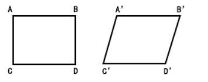
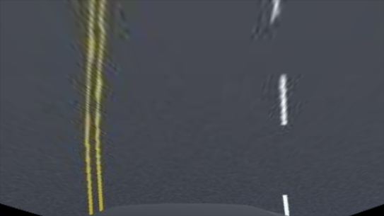

# 图像透视变换(图像矫正)

听名字有点熟，我们在图像旋转里接触过仿射变换，知道仿射变换是把一个二维坐标系转换到另一个二维坐标系的过程，转换过程坐标点的相对位置和属性不发生变换，是一个线性变换，该过程只发生旋转和平移过程。因此，一个平行四边形经过仿射变换后还是一个平行四边形。



而 **透视变换** 是一种将图像投影到新的视平面的几何变换，用于纠正图像的透视畸变（如近大远小的变形）或实现视角转换（如从斜视图转换为正视图）。其核心原理基于**射影几何**，通过矩阵运算实现平面到平面的一一映射。

  

​								图1


 
​								图2

如上图所示，图1在经过透视变换后得到了图2的结果，带入上面的话就是图像中的车道线（目标物体）的被观察视角从平视视角变成了俯视视角，这就是透视变换的作用。

与仿射变换一样，透视变换也有自己的透视变换矩阵：
$$
\begin{array}{l l l}{{\left[\begin{array}{c}{{X}}\\{{Y}}\\{Z} \end{array}\right]=\left[\begin{array}{c c c}{{a_{11}}}&{{a_{12}}}&{{a_{13}}}\\ {{a_{21}}}&{{a_{22}}}&{{a_{23}}}\\ {{a_{31}}}&{{a_{32}}}&{{a_{33}}}\end{array}\right]*\left[\begin{array}{c}{{x}}\\{{y}}\\{{1}}\end{array}\right]}}\end{array}
$$
即
$$
X=a_{11}\cdot x+a_{12}\cdot y+a_{13}
$$

$$
Y=a_{21}\cdot x+a_{22}\cdot y+a_{23}
$$

$$
Z=a_{31}\cdot x+a_{32}\cdot y+a_{33}
$$

由此可得新的坐标的表达式为：
$$
x^{\prime}={\frac{X}{Z}}={\frac{a_{11}\cdot x+a_{12}\cdot y+a_{13}}{a_{31}\cdot x+a_{32}\cdot y+a_{33}}}
$$

$$
y^{\prime}={\frac{Y}{Z}}={\frac{a_{21}\cdot x+a_{22}\cdot y+a_{23}}{a_{31}\cdot x+a_{32}\cdot y+a_{33}}}
$$

其中x、y是原始图像点的坐标，$x^{\prime}$、$y^{\prime}$是变换后的坐标，a11，a12，…,a33则是一些旋转量和平移量，由于透视变换矩阵的推导涉及三维的转换，所以这里不具体研究该矩阵，只要会使用就行，而OpenCV里也提供了getPerspectiveTransform()函数用来生成该3\*3的透视变换矩阵。


**getPerspectiveTransform(src,dst)**

在该函数中，需要提供两个参数：

src：原图像上需要进行透视变化的四个点的坐标，这四个点用于定义一个原图中的四边形区域。

dst：透视变换后，src的四个点在新目标图像的四个新坐标。

该函数会返回一个透视变换矩阵


得到透视变化矩阵之后，使用warpPerspective()函数即可进行透视变化计算，并得到新的图像。该函数需要提供如下参数：

**cv2.warpPerspective(src, M, dsize, flags, borderMode)**

src：输入图像。

M：透视变换矩阵。这个矩阵可以通过getPerspectiveTransform函数计算得到。

dsize：输出图像的大小。它可以是一个Size对象，也可以是一个二元组。视口

flags：插值方法的标记。

borderMode：边界填充的模式。


```python
import cv2
import numpy as np

if __name__ == "__main__":
    path = "./3.png"
    image_np = cv2.imread(path)
    img_shape = image_np.shape
    # 原图中卡片的四个角点
    pts1 = np.float32([[178, 100], [487, 134], [124, 267], [473, 308]])
    img_line = image_np
    cv2.line(img_line, pts1[0].astype(np.int64).tolist(), pts1[1].astype(np.int64).tolist(), (0, 0, 255), 2, cv2.LINE_AA)
    cv2.line(img_line, pts1[0].astype(np.int64).tolist(), pts1[2].astype(np.int64).tolist(), (0, 0, 255), 2, cv2.LINE_AA)
    cv2.line(img_line, pts1[3].astype(np.int64).tolist(), pts1[1].astype(np.int64).tolist(), (0, 0, 255), 2, cv2.LINE_AA)
    cv2.line(img_line, pts1[3].astype(np.int64).tolist(), pts1[2].astype(np.int64).tolist(), (0, 0, 255), 2, cv2.LINE_AA)
    # 变换后分别在左上、右上、左下、右下四个点
    pts2 = np.float32([[0, 0], [img_shape[1], 0], [0, img_shape[0]], [img_shape[1], img_shape[0]]])
    pts = cv2.getPerspectiveTransform(pts1, pts2)  # 生成透视变换矩阵
    correct_image = cv2.warpPerspective(image_np, pts, (img_shape[1], img_shape[0]), flags=cv2.INTER_LINEAR, borderMode=cv2.BORDER_REFLECT_101)  # 进行透视变换
    # 返回处理正确后的内容
    cv2.imshow("image_np", image_np)
    cv2.imshow('img_line', img_line)
    cv2.imshow("correct_image", correct_image)
    cv2.waitKey(0)
```

# 