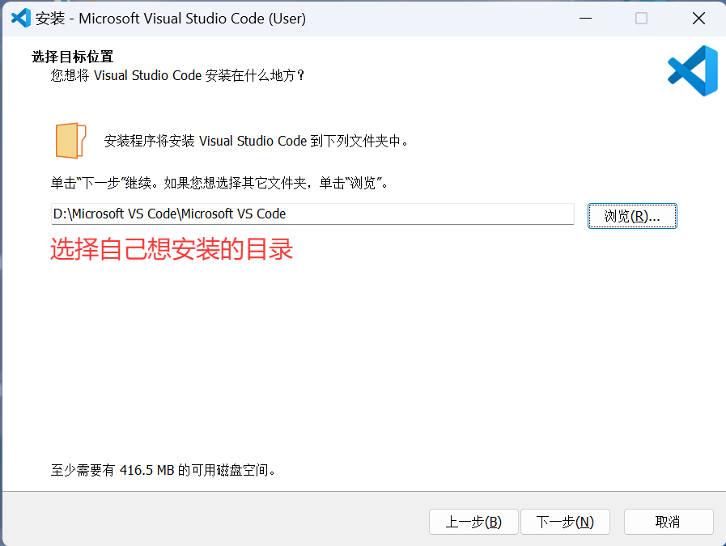
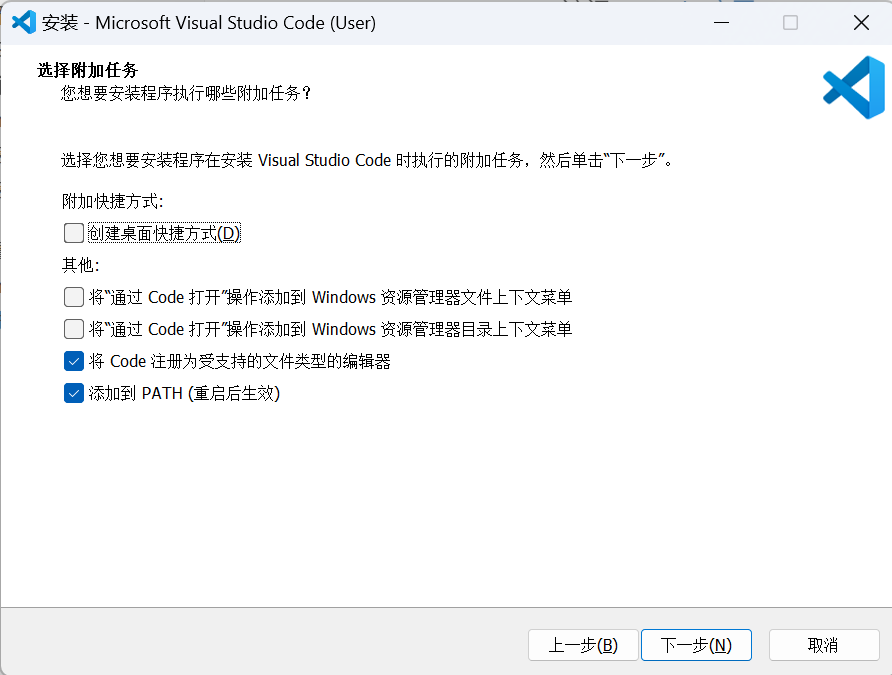

# 配置 Visual Studio Code (VSCode) 中文界面和 Python 环境

---

### **1. 下载安装 VSCode**
1. 访问 [VSCode 官网](https://code.visualstudio.com/)

2. 下载对应操作系统的安装包（Windows/macOS/Linux）

3. 运行安装程序，按提示完成安装（勾选 **"添加到 PATH"** 选项）

   

   

---


### 2. 配置中文界面

1. 左侧栏点击 **Extensions** 图标（或按 `Ctrl+Shift+X`）
2. 搜索 `Chinese (Simplified) Language Pack`
3. 点击 **Install** → 重启 VSCode

> 如果界面未切换：按 `Ctrl+Shift+P` → 输入 `language` → 选择 **Configure Display Language** → 设置为 `zh-cn`

---

### **3. 配置 Python 环境**
#### 步骤 1：安装 Python 解释器

- **方法一：直接安装python环境（不推荐）**


- - **Windows/macOS**：

  1. 访问 [Python 官网](https://www.python.org/downloads/)
  2. 下载最新版（**勾选 `Add Python to PATH`**）
  3. 运行安装程序

- - **Linux**：

  ```bash
  sudo apt update && sudo apt install python3  # Ubuntu/Debian
  ```

  验证安装：

  `python --version  # 或 python3 --version`
  ​

- **方法二：安装anaconda，通过conda统一管理python环境（推荐）**

  在这个文件的上级目录的conda文件中有详细讲解


#### 步骤 2：安装 VSCode Python 扩展

1. 在 VSCode 中打开 **Extensions**（`Ctrl+Shift+X`）
2. 搜索 `Python`（Microsoft 官方扩展）
3. 点击 **Install**

#### 步骤 3：配置 Python 解释器
1. 打开一个 Python 文件（如 `test.py`）
2. 点击右下角状态栏的 **Python 版本号**（或按 `Ctrl+Shift+P` 输入 `Python: Select Interpreter`）
3. 选择已安装的 Python 解释器（如 `Python 3.x.x`）

---

### **4. 验证 Python 环境**
1. 新建文件 `hello.py`
2. 输入代码：
   ```python
   print("你好，世界！")
   print(1 + 2)
   ```
3. 运行方式：
   - **方法一**：右键 → **"在终端中运行 Python 文件"**
   - **方法二**：按 `F5` 启动调试（首次需选择 **Python 调试器**）
   - **方法三**：点击右上角 **▶** 按钮

> 终端应输出：
> ```
> 你好，世界！
> 3
> ```

---

### **5. 推荐安装的扩展**
|        扩展名称         |            功能             |
| :-----------------: | :-----------------------: |
|     **Jupyter**     |       允许使用jupyter文件       |
| **Black Formatter** | `Shift+Alt+F`一键规范Python代码 |
|   **Code Runner**   |      快速运行代码片段或整个代码文件      |
---

### **常见问题解决**

**问题1：Conda环境激活脚本与VSCode的终端集成存在冲突。**（运行代码时终端在powershell和conda来回切换，输出结果不能正常显示，输出结果错位）

- 安装 **Code Runner** 插件，再次运行文件一般就正常了
- - 但此时终端输出中文会出现乱码
  - 并且运行代码的环境只会使用默认环境（无论编译器选择的环境是哪一个）

**问题2：** 输出终端出现**中文乱码**、只使用默认编译器**无法使用conda环境**。(针对安装了 **Code Runner**)

- `Shift + Ctrl + P ` 然后输入 ` Open User Settings(JSON)` ，在打开的全局文件中加入一下内容（最后一行可以根据需要进行修改）

```
{
    "python.defaultInterpreterPath": "c:\\python environment\\python.exe",
    // 设置 VS Code 集成终端的编码格式为 UTF-8。
    "terminal.integrated.encoding": "utf8",     
    // 指定 Windows 系统下 VS Code 默认使用的终端类型为 CMD（Command Prompt）。
    "terminal.integrated.defaultProfile.windows": "Command Prompt", 
    // 自定义 Windows 终端的启动参数（这里针对 CMD 终端）。
    "terminal.integrated.profiles.windows": {
        "Command Prompt": {
            "path": ["${env:windir}\\System32\\cmd.exe"],
            "args": ["/K", "chcp 65001"]
        }
    },

    // 自定义 Python 代码的运行命令（针对 Code Runner 扩展）。
    "code-runner.executorMap": {
    	// 设置输出面板使用utf-8 && 设置运行时使用编译器选择的环境(**极其重要**)
        "python": "set PYTHONIOENCODING=utf8 && $pythonPath -u $fullFileName"
    },

    // 设置 Code Runner 运行代码的地方：true——终端；false——输出面板
    "code-runner.runInTerminal": true,
    "Lingma.cloudModelAutoTriggerGenerateLength": "medium",

	"code-runner.saveFileBeforeRun": true,  // 运行前自动保存
    "code-runner.clearPreviousOutput": true  // 每次运行前清空上次输出
}

```


