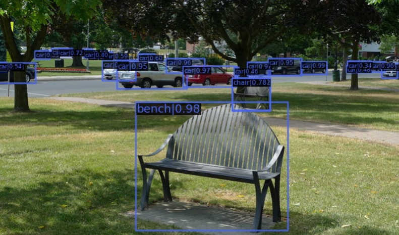
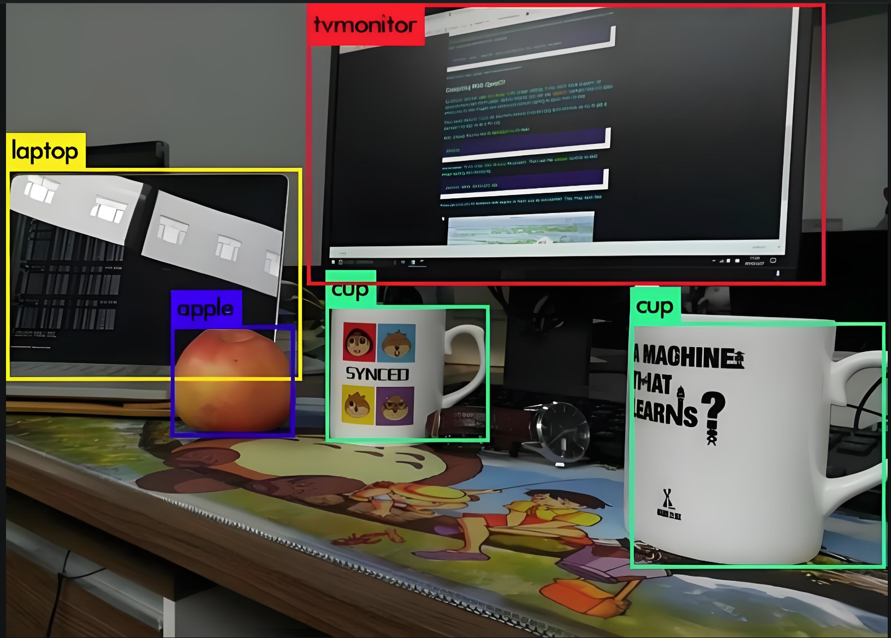
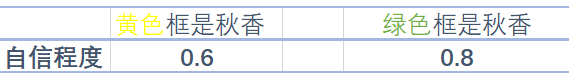

# 一、目标检测基础

## 1、概念

- **目标检测（Object Detection）**是计算机视觉中的一个重要领域，它涉及到识别图片或视频某一帧中的**物体是什么类别，并确定它们的位置**。通常用于多个物体的识别，可以同时处理图像中的多个实例，并为每个实例提供一个边界框和类别标签
- 目标检测面临到的问题：
  - 目标种类和数量问题
  - 目标尺度问题
  - 环境干扰问题



## 2、标注 

- 在目标检测任务中，标注主要涉及的是边界框标注，即为图像中的每一个需要检测的目标物体画出一个边界框，并给定类别标签
- 在训练目标检测模型的时候，我们就需要先为数据集做标注



## 3、本质

- 对于目标检测，主要是关注两个问题：
  - 目标在哪里？where
  - 目标是什么？what
- 以下图为例说明：


## 4、目标检测、图像分类、图像分割

- **目标检测**是指在图像中找到特定类别的物体，并用边界框（Bounding Boxes）标出它们的位置。除了识别图像中的物体外，目标检测还需要确定这些物体的具体位置
- **图像分类**是指识别图像中的主要物体或类别。它只关心图像属于哪个类别，而不关心物体的具体位置
- **图像分割**是指在图像中识别特定类别的物体，并用像素级别的标签来表示这些物体的位置。它不仅需要识别物体是什么，还需要精确地描绘物体的轮廓，目标分割为了了两类
  - 语义分割（Semantic Segmentation）：仅识别物体的类别，不区分不同的实例，即为整个图像中的每个像素分配一个类别标签
  - 实例分割（Instance Segmentation）：不仅识别物体的类别，还区分不同的实例（个体），即为每个物体提供一个精确的分割掩码
  - 目标检测和图像分类的区别图示：


- 目标检测和目标分割的区别图示：
  - 目标检测：识别图像中存在的内容和检测其位置，如下图，以识别和检测人（person）为例
  - 语义分割：对图像中的每个像素打上类别标签，如下图，把图像分为人（红色）、树木（深绿）、草地（浅绿）、天空（蓝色）标签
  - 实例分割：目标检测和语义分割的结合，在图像中将目标检测出来（目标检测），然后对每个像素打上标签（语义分割）。对比上图、下图，如以人（person）为目标，语义分割不区分属于相同类别的不同实例（所有人都标为红色），实例分割区分同类的不同实例（使用不同颜色区分不同的人）


## 5、应用场景

- 自动驾驶：检测周围的车辆、行人、交通灯、道路标志等
- 安防监控：监控公共场，发现异常行为，保障公共安全
- 人脸检测
- 医学影像分析：在医学影像方面可以识别肿瘤、组织变异等，用于医疗辅助
- 无人机应用：识别特定目标，引导无人机飞行，比如监测天气、线路检测、搜寻救援、军事等
- 缺陷检测：工业


- 更多场景：
  - 【https://blog.csdn.net/wcl291121957/article/details/138313404】
  - 【https://blog.csdn.net/wcl291121957/article/details/138318995】

## 6、技术架构

- 目标检测方法可以根据其架构和技术特点进行分类。目前主流的目标检测方法可以分为两大类：两阶段检测方法（Two-stage Detection Methods）和单阶段检测方法（One-stage Detection Methods）
- 分类信息如下表：

|      | one-stage         | two-stage                     |
| :--- | :---------------- | :---------------------------- |
| 主要算法 | **YOLO系列**、SSD    | R-CNN、Fast R-CNN、Faster R-CNN |
| 检测精度 | 较低（版本不断更新，精度不断增加） | 较高                            |
| 检测速度 | 较快（达到视频流检测级别）     | 较慢                            |

### 6.1 two-stage

- 两阶段检测开始于 2014 年左右，是目标检测领域中非常重要的一类方法，这类方法通常因为其高检测精度和可靠性而被广泛应用于各种复杂的目标检测任务中
- 两阶段检测方法将目标检测任务分为两个连续的阶段：
  - 第一阶段：第一阶段是生成候选区域（Region Proposals），即可能包含目标的区域，通常通过区域提议网络（RPN）或其他方法实现
  - 第二阶段：对生成的候选区域进行分类和边界框回归，即确定候选区域中的物体类别以及调整候选区域的位置，以更精确地框中目标

- 基本流程如下：

  - 第一步 Input：输入一张图像
  - 第二步 Conv&pooling：使用卷积神经网络做深度特征提取，通过称这个卷积神经网络为主干神经网
  - 第三步 Conv-proposal：使用 RPN 网络生成候选区域，并对这些区域进行初步的分类（区分背景和目标）以及位置预测‌
  - 第四步 roi pooling：候选区域进一步精确进行位置回归和修正，对不同大小的候选区域提取固定尺寸的特征图
  - 第五步 fc：全连接层，对候选区域的特征进行表示
  - 第六步 Lcls、Lreg：通过分类和回归来分别完成对候选目标的类别的预测以及候选目标位置的优化，这里的类别不同于 RPN 网络的类别，这里通常会得到物体真实的类别，回归主要得到当前目标具体的坐标位置，通常表示为一个矩形框，即四个值(x,y,w,h)

  

- 比如猫狗混合图：


### 6.2 one-stage

- 单阶段目标检测开始于 2016 年左右，没有像 two-stage 那样先生成候选框，而是直接回归物体的类别概率和位置坐标值

- 基本流程图如下：

  - 第一步 Input：输入一张图像
  - 第二步 CNN：使用卷积神经网络做深度特征提取，通过称这个卷积神经网络为主干网络
  - 第三步 Lcls、Lreg：通过分类和回归来分别完成对候选目标的类别的预测以及候选目标位置的优化

  

- 比如猫狗混合图：


## 7、指标

### 7.1 边界框

- 在**目标检测**任务中，**Bounding Box（边界框）** 是用来**定位图像中检测到的物体位置**的一个矩形框。每个检测出的物体都会被分配一个边界框，用来表示该物体在图像中的**位置**和**大小**
- 边界框通常由以下信息表示：
  - **类别标签（Class Label）**：表示这个物体是什么，例如“猫”、“车”、“人”等
  - **置信度分数（Confidence Score）**：表示模型对该检测结果的置信程度，通常是一个 0 到 1 之间的值
  - **边界框坐标（Bounding Box Coordinates）**：表示矩形框的位置和大小

### 7.2 交并比

- 在**目标检测**任务中，IoU（Intersection over Union，交并比）是一个非常关键的**评估指标**，用于衡量**模型预测的边界框（Predicted Bounding Box）与真实边界框（Ground Truth Bounding Box）之间的重合程度**
- IoU 的计算方式是两个边界框的**交集面积**除以它们的**并集面积**，公式如下：

$$
IoU=\frac{Area\,of\,Overlap}{Area\,of\,Union}=\frac{A∩B}{A∪B}
$$

- IoU 计算公式图形表示如下：


- IoU 值是介于 [0,1] 之间的，以下是对不同取值的一个说明：

| IoU 值         | 含义说明                             |
| ------------- | -------------------------------- |
| IoU = 0       | 两个框完全不重合，预测框与真实框没有任何交集           |
| 0 < IoU < 0.5 | 有一定重合，但重合度较低，预测效果一般              |
| 0.5 ≤ IoU < 1 | 重合度较高，预测框接近真实框，效果较好              |
| IoU = 1       | 完全重合，预测框与真实框完全一致，可能是理想情况或存在过拟合风险 |

- 图示：红框是预测框，绿色框是真实框


### 7.3 置信度


- 想象一下，你就是唐伯虎，在茫茫人海中寻找梦中情人——秋香。你终于看到了一个人，五官端正、气质出众，你觉得她就是秋香，并且非常自信地画了一个绿色框框把她圈了出来：“**就是她！秋香！**”，但计算机可不像你这么有“直觉”，它只能通过算法生成多个红色框框（预测框），并为每个框打一个“自信分”，这个分数就叫做——**置信度（Confidence Score）**



- 在目标检测中，**置信度**是模型对预测框是否包含目标物体、以及框的位置是否准确的“信心值”，取值范围 0 到 1 之间的数值
- 在一些经典的目标检测模型中（如 YOLO），置信度通常由两个部分组成：置信度 = Pr(Object) × 预测的 IOU
  - Pr(Object)=1：边界框内有对象
  - Pr(Object)=0：边界框内没有对象
- **预测的 IoU**：不是真实计算出来的，而是模型自己“估计”的，表示它认为这个框和真实框有多接近
- 在深度学习的目标检测任务中，置信度是由网络的输出层（通常包括卷积层、池化层和全连接层等）共同作用的结果
- 在目标检测任务中，通常涉及到三种类型的置信度：目标存在置信度、类别置信度、综合置信度

| 类型          | 含义                                |
| ----------- | --------------------------------- |
| **目标存在置信度** | 表示当前预测框中存在目标物体的概率（不管是什么类别）        |
| **类别置信度**   | 表示当前框中的物体属于某个类别的概率（如“猫”、“狗”、“人”等） |
| **综合置信度**   | 最终输出的置信度，等于目标存在置信度 × 类别置信度        |

- 总结：

| 阶段        | 置信度的计算方式                  | 说明                                     |
| --------- | ------------------------- | -------------------------------------- |
| **训练阶段 ** | 使用真实框（Ground Truth）计算 IoU | 模型通过对比预测框与真实框，学习如何提升置信度                |
| **预测阶段**  | 模型无法访问真实框，置信度完全由网络直接输出    | 通过设置置信度阈值（如 0.5）过滤低质量预测框，再通过 NMS 去除重复框 |

### 7.4 混淆矩阵

- 混淆矩阵是一种**用于评估分类模型性能**的表格形式，特别适用于监督学习中的分类任务。它通过将模型的预测结果与真实标签进行对比，帮助我们直观地理解模型在各个类别上的表现
- 在混淆矩阵中：
  - **列（Columns）**：表示**真实类别（True Labels）**
  - **行（Rows）**：表示**预测类别（Predicted Labels）**
  - **单元格中的数值**：表示在该真实类别与预测类别组合下的样本数量
- 在目标检测任务中，**混淆矩阵的构建依赖于 IoU 阈值**，因为 IoU 决定了哪些预测被认为是“正确检测”，从而影响 TP、FP、FN 的统计，最终影响混淆矩阵的结构和数值

|           | 实际为正类   | 实际为负类   |
| --------- | ------- | ------- |
| **预测为正类** | TP（真正例） | FP（假正例） |
| **预测为负类** | FN（假反例） | TN（真反例） |

### 7.5 精确度和召回率

- 精确度（Precision）：在所有预测为正类的样本中，预测正确的比例，也称为**查准率**
- 召回率（Recall）：在所有实际为正类的样本中，预测正确的比例，也称为**查全率**
- 准确度、精确度、召回率、F1 分数在机器学习中已经讲过，定义和公式如下图：


- 混淆矩阵在目标检测中的 TP、FP、FN、TN 的含义：

| 类型                            | 定义                                       | 通俗解释               | 示例                                       |
| ----------------------------- | ---------------------------------------- | ------------------ | ---------------------------------------- |
| **TP（True Positive）<br>真正例**  | 预测类别正确，且预测框与真实框的 IoU ≥ 阈值                | 模型正确识别了目标，位置也大致准确  | 模型预测这是一个“猫”，IoU=0.85，确实是一只猫              |
| **FP（False Positive）<br>假正例** | 两种情况：<br>1. 类别错误：预测类别错误，即使 IoU ≥ 阈值<br>2. 类别正确，但 IoU < 阈值 | 模型误以为检测到了目标，但实际上错了 | 模型预测该物体为“猫”，且预测框与真实框的 IoU 为 0.4，但实际类别为“狗”；或者模型预测为“猫”，IoU 为 0.3，类别虽然正确，但定位精度未达到设定的阈值 |
| **FN（False Negative）<br>假反例** | 真实存在目标，但模型没有检测出来                         | 模型漏掉了真实目标          | 图片里有一只猫，但模型没检测到                          |
| **TN（True Negative）<br>真反例**  | 图像背景区域被正确识别为“无目标”                        | 模型没有把背景误认为是目标      | 图像背景区域没有预测框，模型正确识别为“无物体”                 |

### 7.6 mAP

#### 7.6.1 PR 曲线

- PR曲线，即**精确率（Precision）- 召回率（Recall）曲线**，是评估分类模型性能的重要工具之一，尤其是在类别不平衡问题中。它通过展示不同阈值下的精确率和召回率之间的关系，帮助我们理解模型在不同决策边界上的表现
- PR 曲线的生成过程：
  - 对于每个样本，模型会输出一个预测分数或置信度，表示该样本属于某一类别的概率
  - 设定多个置信度阈值：通常会设定一系列的置信度阈值，比如从 0 到 1，每隔 0.1 设置一个阈值，这些阈值将用于决定哪些预测被视为“正例”（Positive），哪些被视为“负例”（Negative）
  - 对于每一个阈值，根据预测分数与该阈值的比较结果，我们可以计算出当前阈值下的**精确率（Precision）和召回率（Recall）**
  - 将每个阈值下的精确率和召回率作为坐标点，绘制在二维平面上，横轴为**召回率**，纵轴为**精确率**，从而形成一条曲线


#### 7.6.2 AP

- 在 PR 曲线中，曲线上每个点表示了在对应召回率下的最大精确率值。当 P＝R 时成为平衡点（BEP），如果这个值较大，则说明学习器的性能较好。所以 PR 曲线越靠近右上角性能越好。即 PR 曲线的面积越大，表示分类模型在精确率和召回率之间有更好的权衡，性能越好
- 常用的评估指标是 PR 曲线下的面积，即 AP（Average Precision），通过 PR 曲线下的面积来计算 AP，从而综合评估模型在不同置信度阈值下的性能，值越接近 1 越好
- 平均精度（Average Precision, AP）通过计算每个类别在不同置信度阈值下的 Precision（查准率）和 Recall（查全率）的平均值来综合评估模型的性能。AP 被广泛应用于评估模型在不同置信度阈值下的表现，并且是计算 mAP（平均平均精度）的基础
- AP 就是用来衡量一个训练好的模型在识别每个类别时的表现好坏。AP 越高，说明模型在这个类别上的识别能力越强

#### 7.6.3 AP 计算

- 11 点插值法：只需要选取当 Recall >= 0, 0.1, 0.2, …, 1 共11个点，找到所有大于等于该 Recall 值的点，并选取这些点中最大的 Precision 值作为该 Recall 下的代表值，然后 AP 就是这 11 个 Precision 的平均值
  $$
  \mathrm{AP}=\frac{1}{11}\sum_{r\in\{0,0.1,...,1\}}p_{interp(r)}\\ 
  p_{interp(r)}=\max_{\tilde{r}:\tilde{r}\geq r}p(\tilde{r}) \\
  \tilde{r}表示大于或等于r实际召回率，并选择这些召回率对应的精确率中的最大值作为插值精确率 
  $$
  

- 面积法：需要针对每一个不同的Recall值（包括0和1），选取其大于等于这些 Recall 值时的 Precision 最大值，然后计算 PR 曲线下面积作为 AP 值，假设真实目标数为 M，recall 取样间隔为 [0, 1/M, …, M/M]，假设有 8 个目标，recall 取值 = [0, 0.125, 0.25, 0.375, 0.5, 0.625, 0.75, 0.875, 1.0]

  

- 把各块面积加起来就是 AP 值


#### 7.6.4 绘制图形

- 绘制 PR 曲线，计算 AP 值

```python
import numpy as np
import matplotlib.pyplot as plt
from sklearn.metrics import precision_recall_curve, average_precision_score

# 真实标签，表示每个样本的实际类别
y_true = np.array([1, 1, 0, 1, 0, 1, 0, 0, 1, 1])
# 模型预测的概率分数，表示每个样本属于正类的可能性
probas_pred = np.array([0.9, 0.8, 0.7, 0.6, 0.55, 0.54, 0.53, 0.52, 0.51, 0.50])
# 计算精确度和召回率
precision, recall, thresholds = precision_recall_curve(y_true=y_true, probas_pred=probas_pred)
# 计算平均精确度
AP = average_precision_score(y_true=y_true, y_score=probas_pred)
print("平均精确度：", AP)
# 绘制PR曲线
plt.figure(figsize=(8, 6))
plt.plot(recall, precision, marker='o', label='PR curve')
plt.xlabel('Recall')
plt.ylabel('Precision')
plt.title('Precision-Recall Curve')
plt.legend()
plt.grid(True)
plt.show()
```

- 运行结果：


#### 7.6.5 mAP

- 平均平均精度（mean Average Precision，mAP）  是在不同置信度阈值下计算的平均精确度（Average Precision, AP）的平均值AP 是在不同召回率水平下的精确度平均值，而 mAP 则是多个类别上的 AP 的平均值

| 名称                              | 含义                 | 说明                                       |
| ------------------------------- | ------------------ | ---------------------------------------- |
| **AP（Average Precision）**       | 衡量模型在某一类别上的检测或分类性能 | 通过 Precision-Recall 曲线下的面积来计算，值越高表示模型在该类别上的性能越好 |
| **mAP（mean Average Precision）** | 模型在所有类别上的 AP 的平均值  | 衡量模型整体性能的综合指标，值越高表示模型在所有类别上的平均表现越好       |

- mAP 计算步骤：
  - 计算每个类别的 AP：对于数据集中包含的每个类别，分别计算 AP
  - 计算 mAP：将所有类别的 AP 取平均值，得到 mAP

## 8、NMS 后处理技术

- **非极大值抑制（Non-Maximum Suppression，NMS）** 是目标检测任务中常用的**后处理技术**，用于**去除冗余的边界框（Bounding Boxes）**，保留**最有可能的检测结果**
- 在目标检测中，模型通常会对同一目标生成多个边界框（预测框），这些边界框之间可能高度重叠。NMS 的作用就是**筛选出置信度高、位置准确的边界框**，抑制其他冗余的预测框
- NMS 的基本思想是：对于每一个预测的类别，按照预测边界框的置信度（Confidence Score）对所有边界框进行排序，然后依次考虑每个边界框，将其与之前的边界框进行比较，如果重叠度过高，则丢弃当前边界框，保留置信度更高的那个，对于每个类别会独立进行操作
- NMS 的步骤：
  - 设定目标框置信度阈值，常设置为 0.5，小于阈值的目标框被过滤掉
  - 将所有预测的满足置信度范围的边界框按照它们的置信度从高到低排序
  - 选取置信度最高的框（不同类型分开处理）添加到输出列表，并将其从候选框列表中删除
  - 对于当前正在考虑的边界框，计算其与前面已选定的边界框的重叠程度（IoU），如果当前边界框与已选定边界框的 IoU 大于某个阈值（如 0.5），则将其抑制（即不保留，重合度过高）；否则保留当前边界框，并继续处理下一个边界框
  - 重复上述步骤，直到所有边界框都被处理完毕
  - 输出列表就是最后留下来的目标框


## 9、检测速度

### 9.1 前向传播耗时

-  前向传播耗时是指从**输入图像到输出最终检测结果**所消耗的总时间（单位：毫秒 ms），包括以下三个阶段：
   1. **前处理耗时（Preprocessing）**：
      - 图像归一化（如 0~255 → 0~1）
      - 图像缩放、填充、通道转换（如 BGR → RGB）
      - 张量格式转换（如 NHWC → NCHW）
   2. **网络前向传播耗时（Forward Pass）**：
      - 模型推理过程，即从输入图像经过网络各层计算得到输出结果的时间
   3. **后处理耗时（Postprocessing）**：
      - 应用非极大值抑制（NMS）
      - 置信度过滤、类别筛选等

### 9.2 FPS

- FPS（每秒帧数）是指模型每秒钟可以处理的图像帧数，是衡量**实时性**的重要指标，计算公式

$$
FPS = \frac{1}{Total \quad Inference  \quad Time(s)}
$$

-  实时性要求：
  - **实时检测**：通常要求 FPS ≥ 30
  - **低延迟场景**（如无人机、自动驾驶）：要求 FPS ≥ 60
  - **移动端/嵌入式设备**：常要求在 15~25 FPS 之间达到可用性

### 9.3 FLOPS

- FLOPS（Floating Point Operations Per Second，每秒浮点运算次数）是衡量计算设备性能的一个重要指标，特别是在高性能计算和深度学习领域。它表示设备在一秒内可以执行的浮点运算次数

| 单位         | 全称               | 中文含义       | 数值表示           |
| ---------- | ---------------- | ---------- | -------------- |
| KFLOPS     | Kilo FLOPS       | 千次浮点运算每秒   | $10^3$FLOPS    |
| MFLOPS     | Mega FLOPS       | 百万次浮点运算每秒  | $10^6$FLOPS    |
| **GFLOPS** | Giga FLOPS（常用单位） | 十亿次浮点运算每秒  | $10^9$FLOPS    |
| TFLOPS     | Tera FLOPS       | 万亿次浮点运算每秒  | $10^{12}$FLOPS |
| PFLOPS     | Peta FLOPS       | 千万亿次浮点运算每秒 | $10^{15}$FLOPS |


## 10、YOLO 整体网络结构

- YOLO（You Only Look Once）是一类**单阶段目标检测器（One-stage Detector）**，其核心特点是**速度快、端到端推理**。其网络结构通常由以下 **三个主要模块** 组成：Backbone（主干网络）、Neck（颈部网络）、Detection Head（检测头）
- 网络结构图：
- 内部结构图：


### 10.1 Backbone network

- 描述：
  - Backbone network，即主干网络（骨干网络），目标检测网络最为核心的部分，主要是使用不同的卷积神经网络构建
- 任务：
  - 特征提取：从输入图像中提取特征信息，这些特征通常包含丰富的信息，能够帮助后续模块进行目标检测

### 10.2 Neck network

- 描述：
  - Neck network，即颈部网络，主要对主干网络输出的特征进行整合
- 任务：
  - 特征融合：将主干网络提取的多尺度特征进行融合，以增强特征的表达能力和鲁棒性

### 10.3 Detection head

- 描述：
  - Detection head，即检测头，在特征之上进行预测，包括物体的类别和位置
- 任务：
  - 目标检测：检测头的主要任务是基于融合后的特征图，通过回归任务预测边界框的坐标，通过分类任务预测目标的类别，生成最终的检测结果，包括边界框和类别

### 10.4 总结

- YOLOV1-YOLOV4：学习掌握 YOLO 作者的涉及思路和优化方式【理论】
- YOLOV5 和 **YOLO11**：学习掌握使用 YOLO 开源算法完成模型的训练、应用、优化等【实践】

| Model | Backbone      | Neck              | Head                                     |
| ----- | ------------- | ----------------- | ---------------------------------------- |
| v1    | GoogLeNet     | None              | FC → 7×7×(2x5+20)                        |
| v2    | Darknet19     | Passthrough       | 13×13×5×(5+20)                           |
| v3    | Darknet53     | FPN               | 13×13×3×(5+80), 26×26×3×(5+80), 52×52×3×(5+80) |
| v4    | Darknet53_CSP | SPP、FPN、PAN       | 13×13×3×(5+80), 26×26×3×(5+80), 52×52×3×(5+80) |
| v5    | Darknet53_CSP | SPP、cspFPN、cspPAN | 13×13×3×(5+80), 26×26×3×(5+80), 52×52×3×(5+80) |
