# 一、图像分类和数据集

## 1、概念

- 图像分类是计算机视觉中的一个基本任务，它是指给定一张图像，通过计算和分析，确定该图像属于预定义类别中的哪一个。简单来说，就是让机器理解一张图片的内容，并将其归入特定的类别，常见的分类场景有：

  - 数字场景分类
- 人脸属性分类
  - 动植物分类
- 车型分类
  - 食物分类
- 艺术品分类
- 案例：假定一个类别集 categories={dog,cat,bird}，然后提供一张图像给分类系统，分类系统会返回一个属于该图像的类别标签


## 2、业务场景

- 拍照识别应用、以图搜图检索引擎、自动驾驶、医学图像分析、农业、安全监控等


## 3、图像分类粒度

- 图像分类顾名思义就是一个分类问题，它的目标是将不同的图像，划分到不同的类别，实现最小的分类误差。总体来说，对于图像分类问题的细粒度，可以分为跨物种语义级别的图像分类，子类细粒度图像分类，以及实例级图像分类三大类别

### 3.1 跨物种语义级别的图像分类

- 通用图像分类通常指的是识别图像中的大类别，例如识别出图像中的是猫还是狗，或者是汽车、飞机等大类别的对象

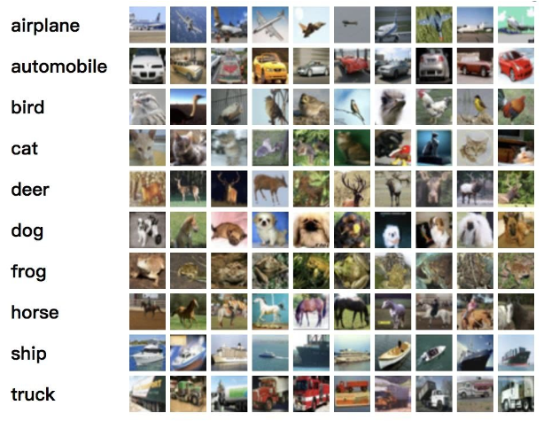

### 3.2 子类细粒度图像分类

- 在区分出基本类别的基础上，进行更精细的子类划分，例如区分鸟的种类、车的款式、狗的品种等


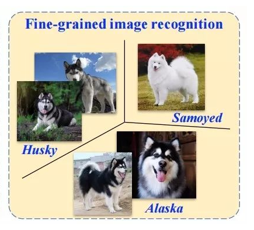

### 3.3 实例级图像分类

- 更细粒度上进行分类，例如识别同一物种中的不同个体


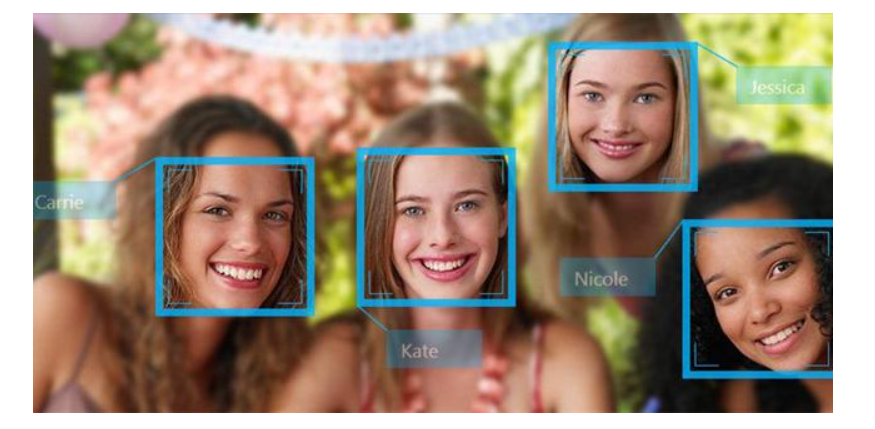

## 4、经典数据集

### 4.1 MNIST

- 描述：用于手写数字识别的经典机器学习数据集，最初用于研究手写数字识别算法
- 规模：包含 60000 个训练数据，10000 个测试数据，图像均为灰度图，通用的版本大小为 28×28
- 特点：相对简单，常作为初学者入门深度学习和计算机视觉项目的第一个练习数据集
- 网址：【https://yann.lecun.com/exdb/mnist/?spm=5176.28103460.0.0.359a5d27w8mrLv】

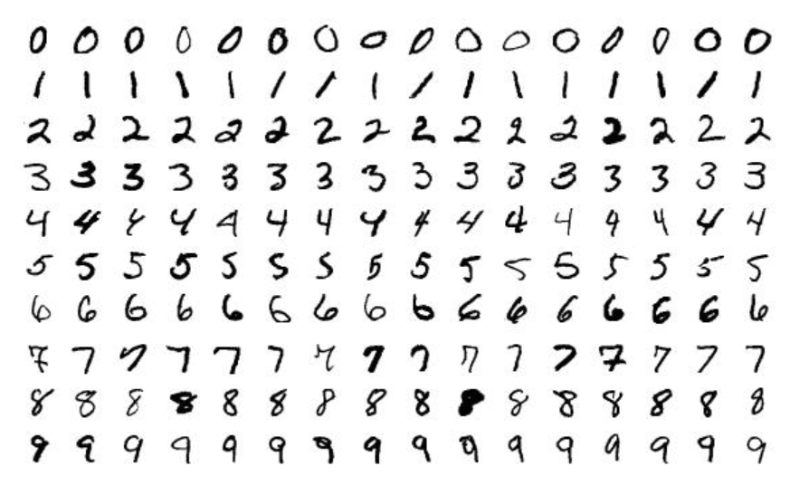

### 4.2 CIFAR10

- 描述：用于图像分类的计算机视觉数据集
- 规模：包含 50000 张训练图像和 10000 张测试图像，每个样本都是 32x32 像素大小的彩色图像，共有 10 个类别
- 特点：涵盖了飞机、汽车、鸟类、猫、鹿、狗、青蛙、马、船、卡车 10 个类别物体
- 网址：【http://host.robots.ox.ac.uk/pascal/VOC/?spm=5176.28103460.0.0.359a5d27w8mrLv】

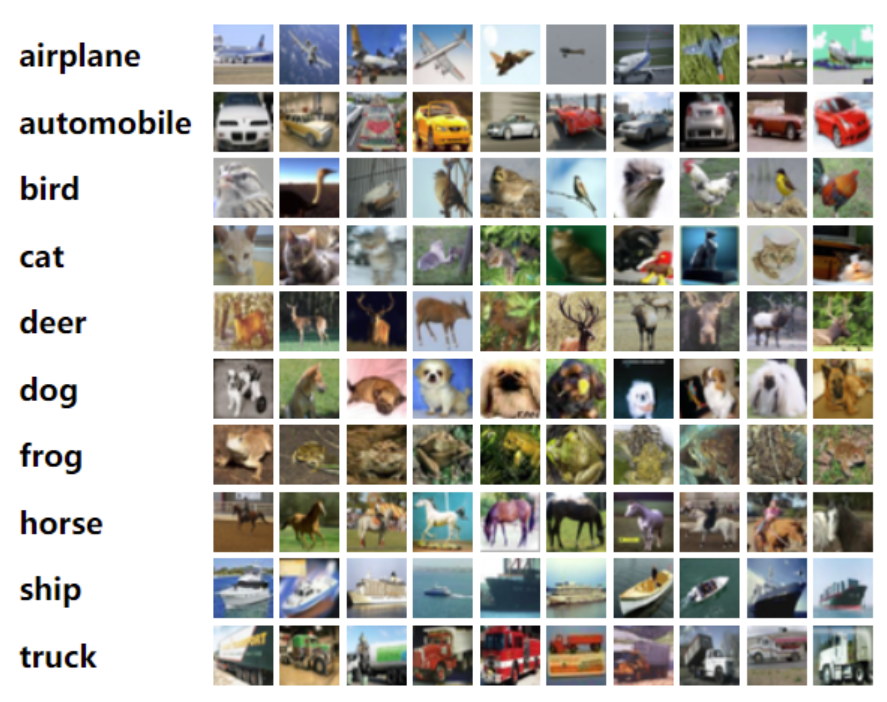

### 4.3 CIFAR100

- 描述：用于图像分类的计算机视觉数据集
- 规模：与 CIFAR-10 相同，包含 50,000 张训练图像和 10,000 张测试图像，每个样本都是 32x32 像素大小的彩色图像，但有 100 个类别
- 特点：每个类别下包含 600 张图像，细分为 20 个超类，每个超类中有 5 个子类
- 网址：【http://host.robots.ox.ac.uk/pascal/VOC/?spm=5176.28103460.0.0.359a5d27w8mrLv】

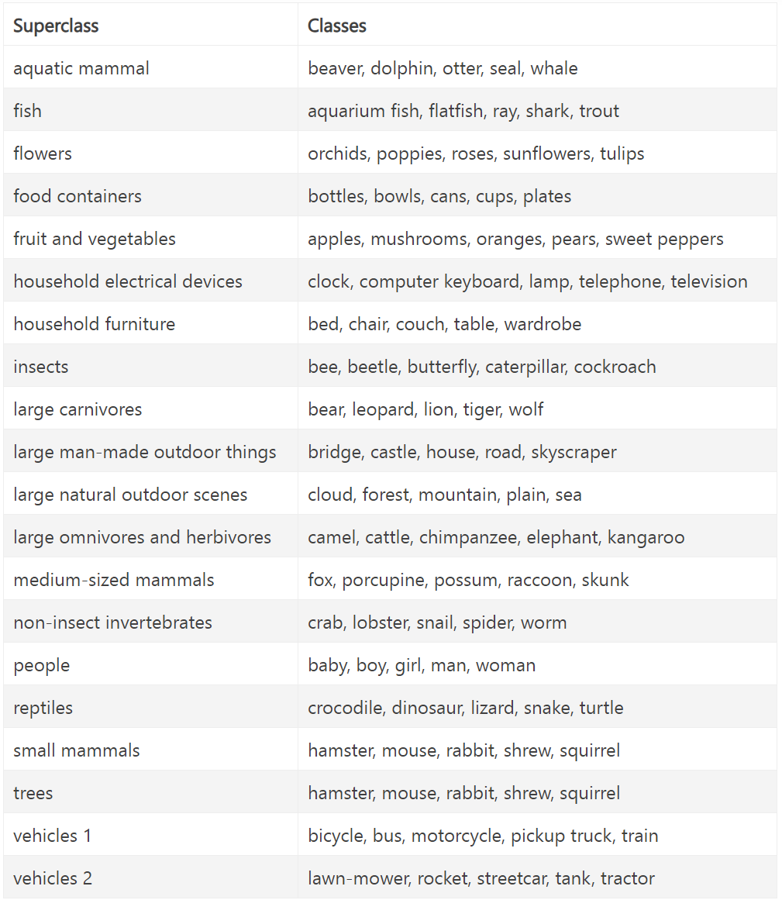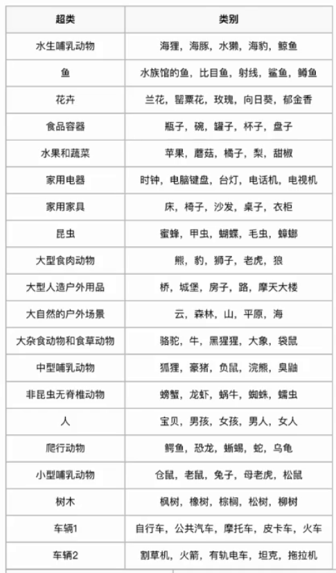

### 4.4 PASCAL VOC【重点】

- 描述：主要用于目标检测、图像分割、物体分类等任务，该数据集自 2005 年开始发布，每年都会更新新的版本，直到 2012 年后不再更新新的数据集，是一个 20 分类数据集，在 YOLO 系列中大量的实验都用了这个数据集
- 规模：包含多个版本，其中最常用的是 2007 年和 2012 年的版本，VOC 2007 与 2012 数据集及二者的并集数据量对比如下图：

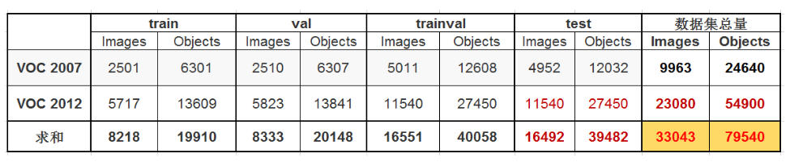

- 特点：除了图像分类之外，还包括了物体边界框的标注，适用于物体检测任务
- 网址：【http://host.robots.ox.ac.uk/pascal/VOC/?spm=5176.28103460.0.0.359a5d27w8mrLv】

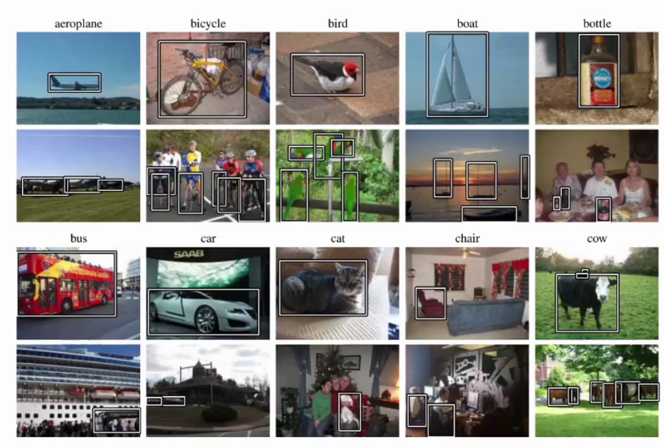

**分类结构如下：**


### 4.5 ImageNet

- 描述：由 Princeton University 和 Stanford University 的研究人员于 2009 年创建，是计算机视觉领域中规模最大、最著名的数据集之一，推进图像识别和计算机视觉技术的发展
- 规模：包含超过 1400 万张图像，覆盖了 21841 个类别，其中有 1000 个类别被用于 ILSVRC 竞赛
- 特点：是迄今为止最大的公开图像分类数据集之一，涵盖了极为广泛的物体类别
- 网站：【https://image-net.org/】

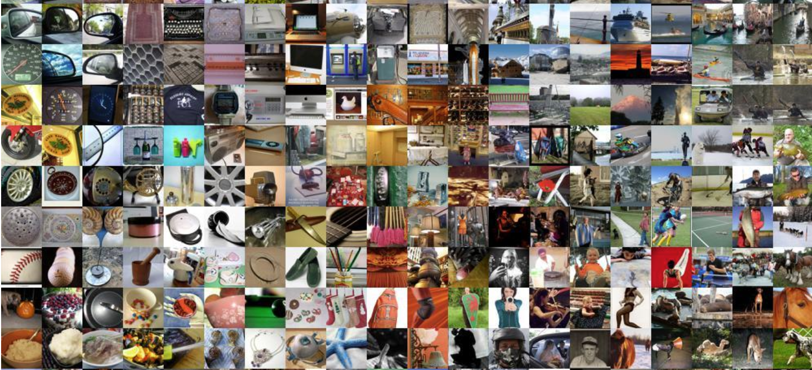

### 4.6 MS COCO【重点】

- MS COCO数据集，全称是 Microsoft Common Objects in Context

- 80 分类数据集，在 YOLO 系列中大量使用来做性能验证

- 网站：【https://www.kaggle.com/datasets/awsaf49/coco-2017-dataset】

  - 80分类、20万个图像、超过50万目标标注

  - 可用来图像识别、目标检测和分割等任务

  - 数据集分为训练集、验证集和测试集


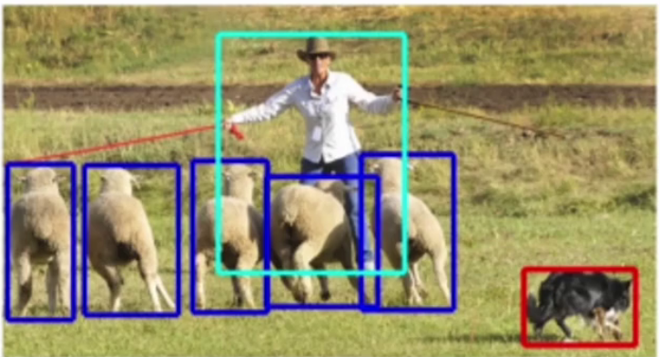

## 5、其他数据集

### 5.1 开源数据集


- PyTorch：【https://pytorch.org/vision/stable/datasets.html】

- 开源数据集 Imagenet：【https://image-net.org/】

- Hugging Face 数据集：【https://huggingface.co/datasets】

- kaggle 数据集下载网址：【https://www.kaggle.com/datasets】

- MS COCO 数据集：【https://www.kaggle.com/datasets/awsaf49/coco-2017-dataset】

- 其他网站：
  - 【https://public.roboflow.com/】
  - 【https://zhuanlan.zhihu.com/p/648720525】
  - 【https://www.cvmart.net/dataSets】
- 如果明确自己的项目需要使用的数据集是什么，可以直接百度关于这个数据集的百度硬盘下载


### 5.2 外包平台

- 外包平台，比如 Amazon Mechanical Turk、阿里众包、百度数据众包、京东微工等

### 5.3 自己采集和标注

- 通过忘了爬虫获取数据集，然后使用 labelimg、labelme 工具标注数据集

**labelimg使用方法：**

- 第一步：创建一个虚拟环境，专用于安装 labelimg 工具，完成yolo阶段的数据集的标注，labelimg 工具的源码有一些 bug，需要修改源码中的内容

```bash
conda create -n 环境名字 python=3.12
```

- 第二步：激活虚拟环境，下载 labelimg 工具

```bash
conda activate 环境名称

pip install labelimg
```

- 第三步：输入命令 labelimg 启动程序

```bash
labelimg
```

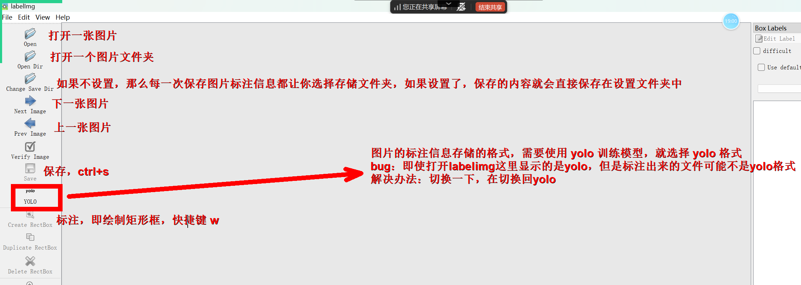

#### 重点【yolo 数据集标注的格式，满足以下文件夹格式】

- datasets：存储所有的需要训练的模型的数据集
  - helmet：头盔模型对应的数据集
    - train：训练数据集
      - images：训练数据集图片
      - labels：训练数据集图片的标注信息
    - val：验证数据集
      - images：验证数据集图片
      - labels：验证数据集图片的标注信息

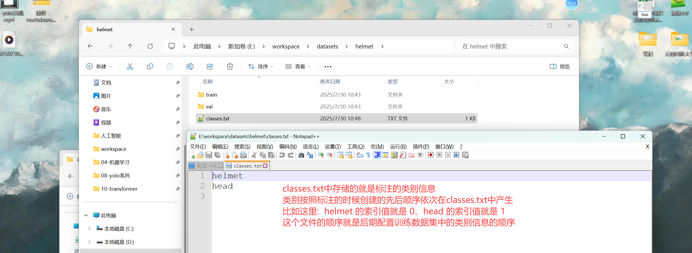

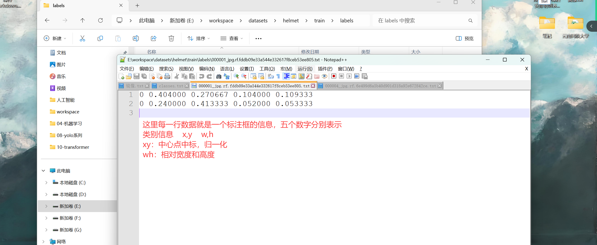

