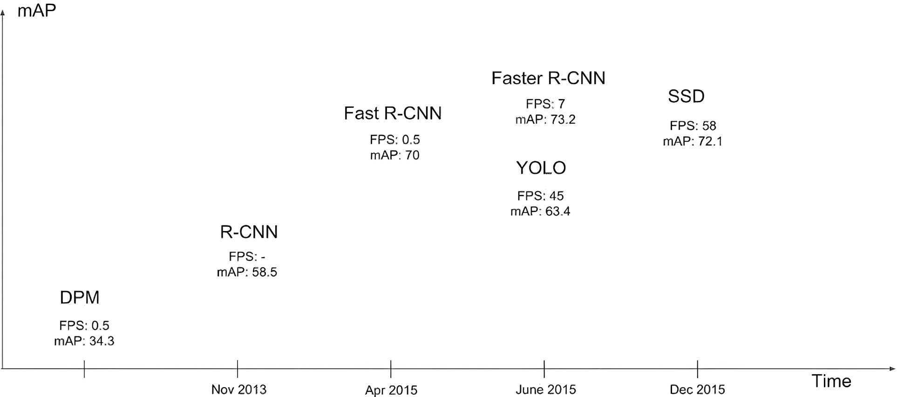
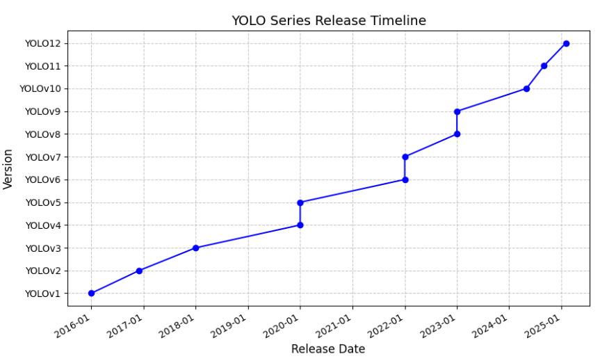

# 一、YOLO系列发展史

## 1、YOLO 介绍

- **YOLO（You Only Look Once）** 是一种革命性的**单阶段目标检测方法**，它将目标检测视为一个**回归问题**，直接从完整图像中预测边界框及其对应的类别概率。与传统的两阶段目标检测器（如 R-CNN 系列）不同，YOLO 在一次评估过程中即可完成所有任务，因此具有显著的速度优势，能够实现实时检测
- 核心思想：
  - **回归框架**：YOLO 将目标检测任务视为一个单一的回归问题，直接从输入图像中预测边界框的位置和类别。、
  - **端到端优化**：由于整个检测流程是由一个单一神经网络完成的，因此可以对整个检测流水线进行**端到端的优化**，从而提高检测性能
  - **实时检测**：YOLO 能够在一次前向传播中同时预测多个边界框及其对应的类别，这使得它在速度上具有显著优势，特别适合于**实时应用**

## 2、发展史

- Fast R-CNN 效果很好，但是速度太慢，距离实时检测差得远

- YOLO 发展时间图：

- YOLOv1 到 YOLO12 的主要贡献者列表：

  - YOLOv1：主要由 Joseph Redmon、Santosh Divvala、Ross Girshick 和 Ali Farhadi 共同开发

  - YOLOv2：主要由 Joseph Redmon 和 Ali Farhadi 共同开发

  - YOLOv3：主要由 Joseph Redmon 和 Ali Farhadi 共同开发

  - YOLOv4：主要由 Alexey Bochkovskiy、Chien-Yao Wang 和 Hong-Yuan Mark Liao 开发

  - YOLOv5：主要由 Ultralytics 团队开发

  - YOLOv6：主要由美团团队开发

  - YOLOv7：主要由 I-Hau Yeh、Chien-Yao Wang 和 Hong-Yuan Mark Liao 开发

  - YOLOv8：主要由 Ultralytics 团队开发，被 YOLO11 覆盖了
  - YOLOv9：主要由 Alexey Bochkovskiy、Chien-Yao Wang 和 Hong-Yuan Mark Liao 开发
  - YOLOv10：主要由清华大学团队开发
  - **YOLO11：主要由 Ultralytics 团队开发，2024 年 9 月 30 日发布**
  - **YOLO12：由纽约州立大学布法罗分校的田运杰，David Doermann 和中国科学院大学的叶齐祥合作完成，2025 年 2 月 18 日发布**
  - **YOLO13：清华大学联合太原理工大学、北京理工大学等高校团队于2025年6月26日正式发布**

