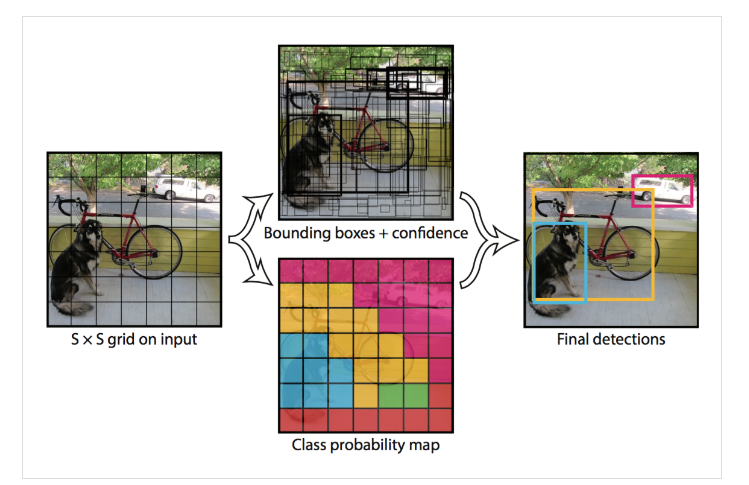

# 一、YOLOv1

- [YOLOV1 论文地址](https://www.cv-foundation.org/openaccess/content_cvpr_2016/papers/Redmon_You_Only_Look_CVPR_2016_paper.pdf?spm=5176.28103460.0.0.359a5d27d0cimU&file=Redmon_You_Only_Look_CVPR_2016_paper.pdf)
- [YOLOV1 论文中文翻译地址](https://blog.csdn.net/muye_IT/article/details/124612829)

## 1、模型介绍

- YOLOv1 的设计灵感来自用于 GoogLeNet 模型
- 2016年，Joseph Redmon、Santosh Divvala、Ross Girshick 等人提出了一种单阶段的目标检测网络。它的检测速度非常快，以 45 帧/秒的速度实时处理图像。由于其速度之快和其使用的特殊方法，作者将其取名为：**You Only Look Once**，并将该成果发表在 CVPR2016（计算机视觉和模式识别领域顶级学术会议），从而引起了广泛地关注
- YOLO 的核心思想就是把目标检测转变成一个回归问题，利用整张图作为网络的输入，仅仅经过一个神经网络，就得到边界框的位置及其所属的类别，整个过程图示如下：
  - Resize image：将输入图像调整满足神经网络的尺寸（448 x 448）
  - Run convolutional network：在图像上运行单个卷积网络
  - Non-max suppression：根据模型设置的置信度阈值对检测得到的边界框进行 NMS 处理

## 2、网络结构

- 卷积（conv layer）之后，计算输出尺寸：向下取整
  $$
  Output\,Size=\frac{Input\,Size+2×Padding−Filter\,Size}{Stride}+1
  $$

- 最大池化（Max Pooling）之后，，计算输出尺寸：向下取整

$$
Output\,Size=\frac{Input\,Size+2×Padding−Filter\,Size}{Stride}+1
$$

- 结构：24 个卷积层、4 个池化层、2 个全连接层

- 根据论文中的网络结构（上图），复原网络结构参数：

|   layer    | output size |         module          |
| :--------: | :---------: | :---------------------: |
|            |  448x448x3  |                         |
|     1      | 224x224x64  |  Conv 7x7x64, s-2, p-3  |
|            | 112x112x64  |  Maxpool 2x2, s-2, p-0  |
|     2      | 112x112x192 | Conv 3x3x192, s-1, p-1  |
|            |  56x56x192  |  Maxpool 2x2, s-2, p-0  |
|     3      |  56x56x128  | Conv 1x1x128, s-1, p-0  |
|     4      |  56x56x256  | Conv 3x3x256, s-1, p-1  |
|     5      |  56x56x256  | Conv 1x1x256, s-1, p-0  |
|     6      |  56x56x512  | Conv 3x3x512, s-1, p-1  |
|            |  28x28x512  |  Maxpool 2x2, s-2, p-0  |
| 7,9,11,13  |  28x28x256  | Conv 1x1x256, s-1, p-0  |
| 8,10,12,14 |  28x28x512  | Conv 3x3x512, s-1, p-1  |
|     15     |  28x28x512  | Conv 1x1x512, s-1, p-0  |
|     16     | 28x28x1024  | Conv 3x3x1024, s-1, p-1 |
|            | 14x14x1024  |  Maxpool 2x2, s-2, p-0  |
|   17,19    |  14x14x512  | Conv 1x1x512, s-1, p-0  |
|   18,20    | 14x14x1024  | Conv 3x3x1024, s-1, p-1 |
|     21     | 14x14x1024  | Conv 3x3x1024, s-1, p-1 |
|     22     |  7x7x1024   | Conv 3x3x1024, s-2, p-1 |
|     23     |  7x7x1024   | Conv 3x3x1024, s-1, p-1 |
|     24     |  7x7x1024   | Conv 3x3x1024, s-1, p-1 |
|     25     |   4096x1    |           FC1           |
|     26     |   1470x1    |           FC2           |
|            |   7x7x30    |         reshape         |

## 3、核心思想

- YOLOv1 采用的是将一张图片平均分成为 S x S 的网格（论文中的设置是 7 x 7），每个网格分别负责预测中心点落在该网格内的目标

  - 每个网格的大小取决于输入图像的分辨率（如 448×448，则每个网格约为 64×64 像素）

  - 每个网格负责检测**中心点落在该网格内的目标**【只有当目标的**中心点坐标落在某个网格中时，该网格才负责预测该目标**】

- YOLOv1 算法思想步骤如下：

  

  - 将图像划分为 S x S 的网格（论文中的设置是 7 x 7 的网格）。如果某个物体的中心落在这个网格中，那么这个网格就负责预测这个物体
  - 然后每个网格预测 B 个边框（论文中的设置是 2 个边框），即预测出 7 x 7 x 2 个边框，每个边框都要预测（x,y,w,h）+ confidence

  | 项目         | 含义                                       |
  | ---------- | ---------------------------------------- |
  | x, y       | 边界框中心点相对于该网格左上角的偏移量（归一化到 [0, 1]）         |
  | w, h       | 边界框的宽和高，相对于整张图像的宽高进行归一化                  |
  | confidence | 该边界框的置信度，表示框中存在目标的可能性（confidence = Pr(Object) × IoU） |

  - 除了边界框信息，每个网格还会预测 **C 个类别概率**（C 是类别数量，如 VOC 数据集为 20 类），这些概率是**基于网格的**，也就是说：**不管预测几个边界框，每个网格只预测一套类别概率**
  - 最终输出的边界框类别概率 = 网格类别概率 × 边界框置信度
  - 总体而言，S x S 个网格，每个网格要预测 B 个边框，还要预测 C 个类。输出的维度是 S x S x (5 x B + C)，对于 VOC 数据集来说，最后输出就是 7 x 7 x (5 x 2 + 20)，即 7 x 7 x 30

  

## 4、网络结构和预测结合

- 7 × 7：把图片分成7 × 7，共 49 个网格
- 30：每个网格有 30 个参数：20 +2 × (1+4) = 30
- 每个网格单元还预测 C 个条件类别概率 Pr(Classi|Object)。这些概率以包含目标的网格单元为条件。每个网格单元只预测的一组类别概率，而不管边界框的的数量 B 是多少
- 参数归一化
  - $$x、y$$ 是相对于网格单元边界框的中心坐标，归一化到 0 到 1 之间
  - $$w、h$$ 是 bb 相对于图片宽高的比例，归一化到 0 到 1 之间

## 5、损失函数

- YOLOv1 中的损失函数=定位损失+置信度损失+分类损失，由 5 个部分组成，公式：

$$
\begin{gathered}
\lambda_{\mathbf{coord}}\sum_{i=0}^{S^{2}}\sum_{j=0}^{B}\mathbb{1}_{ij}^{\mathrm{obj}}\left[\left(x_{i}-\hat{x}_{i}\right)^{2}+\left(y_{i}-\hat{y}_{i}\right)^{2}\right]【注解：边框中心点误差】 \\
+\lambda_{\mathbf{coord}}\sum_{i=0}^{S^{2}}\sum_{j=0}^{B}\mathbb{1}_{ij}^{\mathrm{obj}}\left[\left(\sqrt{w_{i}}-\sqrt{\hat{w}_{i}}\right)^{2}+\left(\sqrt{h_{i}}-\sqrt{\hat{h}_{i}}\right)^{2}\right] 【注解：边框宽高误差】\\
+\sum_{i=0}^{S^2}\sum_{j=0}^B\mathbb{1}_{ij}^{\mathrm{obj}}\left(C_i-\hat{C}_i\right)^2 【注解：有物体时置信度误差】\\
+\lambda_\text{noobj}\sum_{i=0}^{S^2}\sum_{j=0}^B\mathbb{1}_{ij}^\text{noobj}\left(C_i-\hat{C}_i\right)^2 【注解：无物体时置信度误差】\\
+\sum_{i=0}^{S^2}\mathbb{1}_i^\mathrm{obj}\sum_{c\in\mathrm{classes}}\left(p_i(c)-\hat{p}_i(c)\right)^2 【注解：网格内有物体时的分类误差】  \\
\end{gathered}
$$

- 公式图示：

- 公式解释：
  - $\lambda_{coord}$是一个权重系数，用于平衡坐标损失与其他损失项，论文中设置的值为 5
  - $S^2$表示有多少个 grid，
  - B 表示框的个数，在 YOLOv1 中是 2 种，即 B 为 2
  - obj 表示有物体时的情况
  - noobj 表示没有物体时的情况
  - $i j$ 表示第 i 个 的第 j 个框
  - $1_{ij}^{obj}$是一个指示函数，当某个边界框负责某个对象时为 1，否则为 0
  - $x_i和y_i$表示实际的坐标，$\hat{x_i}和\hat{y_i}$表示预测的坐标
  - $w_i和h_i$表示实际的宽高，$\hat{w_i}和\hat{h_i}$表示预测的宽高
  - $C_i$表示实际的置信度分数（$C_i=Pr(obj)*IoU$），$\hat{C_i}$表示预测的置信度分数
  - $\lambda_{noobj}$一个较小的权重系数，用来减少无对象区域的置信度损失的影响，论文中设置的值为 0.5
  - $1_{ij}^{noobj}$是一个指示函数，当某个边界框负责某个对象时为 0，否则为 1
  - $p_i(c)$是第 i 个网格单元格中对象的真实类别分布，$\hat{p_i}(c)$是预测的类别概率分布

### 5.1 公式解读

- 公式部分非常规操作详解：

  - 关于开根号：如果直接对 w 和 h 做 MSE，大框的误差会远大于小框，导致模型更关注大目标，使用平方根可以缓解这种尺度不均衡问题，使得**小目标和大目标在损失中权重更均衡**

  $$
  \begin{gathered}

  \lambda_{\mathbf{coord}}\sum_{i=0}^{S^{2}}\sum_{j=0}^{B}\mathbb{1}_{ij}^{\mathrm{obj}}\left[\left(\sqrt{w_{i}}-\sqrt{\hat{w}_{i}}\right)^{2}+\left(\sqrt{h_{i}}-\sqrt{\hat{h}_{i}}\right)^{2}\right]
  \end{gathered}
  $$

  - 关于 S 的平方以及 i 和 j

  $$
  \begin{gathered}
  +\sum_{i=0}^{S^2}\sum_{j=0}^B\mathbb{I}_{ij}^{\mathrm{obj}}\left(C_i-\hat{C}_i\right)^2 \\
  +\lambda_\text{noobj}\sum_{i=0}^{S^2}\sum_{j=0}^B\mathbb{1}_{ij}^\text{noobj}\left(C_i-\hat{C}_i\right)^2 \\
  \\
  这里的i和j表示第i个Grid的第j个框，训练时只有一个匹配\\
  {S^2}则表示共有7 * 7 共49个Grid Cell
  \end{gathered}
  $$

  - 关于权重系数

  $$
  \begin{gathered}

  \lambda_{\mathbf{coord}} \\
  \\
  \lambda_{\mathbf{coord}} 表示调高位置（坐标和宽高都加入了该系数）误差的权重，毕竟这玩意很重要，设置为5
  \end{gathered}
  $$

  - 关于 noobj

  $$
  \begin{gathered}
  \lambda_\text{noobj}\sum_{i=0}^{S^2}\sum_{j=0}^B\mathbb{1}_{ij}^\text{noobj}\left(C_i-\hat{C}_i\right)^2 \\
  \\
  \text{noobj}表示没有物体时的情况
  \\
  \lambda_\text{noobj}=0.5用于调整没有目标时的权重系数
  \end{gathered}
  $$

  ​

## 6、NMS处理

## 7、算法性能对比

- **Fast R-CNN**：
  - **Correct**：71.6%的检测结果是正确的
  - **Loc**：8.6%的错误是由于定位不准确
  - **Sim**：4.3%的错误是由于相似类别的误分类
  - **Other**：1.9%的错误是由于其他原因。
  - **Background**：13.6%的错误是将背景误判为对象
- **YOLO**：
  - **Correct**：65.5%的检测结果是正确的
  - **Loc**：19.0%的错误是由于定位不准确
  - **Sim**：6.75%的错误是由于相似类别的误分类
  - **Other**：4.0%的错误是由于其他原因
  - **Background**：4.75%的错误是将背景误判为对象

## 8、优缺点

### 8.1 优点

- 实时处理：可达到 45 fps，远高于 Faster R-CNN 系列，轻松满足视频目标检测
- 避免产生背景错误：YOLO 的区域选择阶段是对整张图进行输入，上下文信息利用更充分，不容易出现错误背景信息

### 8.2 缺点

- 定位精度不够高：由于输出层为全连接层，在检测时只支持与训练图像相同的输入分辨率
- 小物体和密集物体检测效果不佳：每个网格单元只能预测两个框，并且只能有一个类，这使得它难以处理成群出现的小对象，例如鸟群
- 召回率低：会错过一些实际存在的目标
