# 一、YOLOv2

- YOLOv2 是 Joseph Redmon 和 Ali Farhadi 发表在 CVPR 2017，对原始 YOLOV1 的一些改进
- YOLOv2 主要是在 COCO 和 ImageNet 数据集上进行训练，由于 YOLOv2 能够检测 9000 个类别，所以 YOLOv2 也被称之为 YOLO9000：**Better、Faster、Stronger**
- [YOLOv2 论文地址](https://arxiv.org/pdf/1612.08242#page=4.24)
- [YOLOv2 论文中文对照地址](https://blog.csdn.net/qq_42755230/article/details/125820723)

## 1、整体网络结构

- DarkNet-19 是 YOLOv2 的主干网络（Backbone），由 Joseph Redmon 等人在 YOLOv2 中提出，用于替代 YOLOv1 中的 GoogLeNet-like 网络。它的主要特点是：
  - 轻量、高效
  - 使用 BatchNorm（BN）
  - 没有全连接层（FC）
  - 使用全局平均池化（Global Average Pooling, GAP）代替 FC 层进行分类或检测
  - **总共有 19 个卷积层（conv 层） + 5 个 max pooling 层，不包含全连接层（FC）**

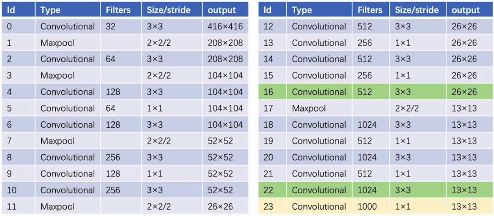

## 2、优化策略

- YOLOv2 作者通过实验得出通过以下方式，提升模型的 mAP 值

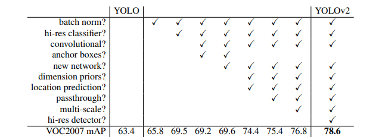

## 3、输入端优化

### 3.1 多尺度训练

- YOLOv1 使用 448×448 的输入分辨率。YOLOv2 通过添加锚框，我们将分辨率改为 416×416，由于我们的模型只使用卷积层和池化层，因此可以实时调整大小，我们希望 YOLOv2 能够鲁棒地运行在不同尺寸的图像上，所以我们将多尺度训练应用到模型中，我们不需要修改输入图像的大小，而是每隔几个迭代就改变网络。每10个批次，我们的网络就会随机选择一个新的图像尺寸。由于我们的模型缩减了 32 倍，我们从以下 32 的倍数中抽取：{320, 352, …, 608}。因此，最小的选项是 320 × 320，最大的是 608 × 608。我们将调整网络的尺寸，然后继续训练

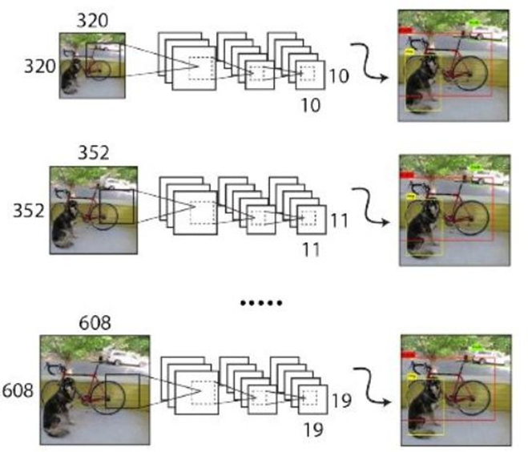

### 3.2 高分辨率分类器

-  高分辨率分类器的思路如下：对于 YOLOv2，我们首先在 ImageNet 上以 448×448 的完整分辨率对分类网络进行微调，并进行 10 个 epoch 的预训练。这让网络有时间调整其滤波器，以便在更高的分辨率输入下更好地工作。然后，我们再对检测网络的结果微调。这个高分辨率的分类网络使我们的 mAP 增加了近 4%	
-  流程如下：
   -  **ImageNet 分类预训练**
      -  使用 224×224 的图像进行分类预训练（与 YOLOv1 一致）

   -  **高分辨率微调（High-Resolution Finetuning）**
      -  将网络输入分辨率调整为 **448×448**
      -  在 ImageNet 上继续微调 **10 个 epoch**
      -  目标是让网络的卷积滤波器适应更高分辨率的输入

   -  **目标检测微调**
      -  将微调后的主干网络用于 YOLOv2 的检测任务
      -  在目标检测数据集（如 VOC）上进行微调

## 4、主干网络优化

### 4.1 新网络结构

- YOLOv2 用 DarkNet-19 作为骨干网络架构：包含 19 个 conv 层、5 个 max pooling 层，每个 conv 层后接入 BN 层，没有 FC 层，用了一个全局平均池化层来替换全连接层
- Darknet-19 只需要 55.8 亿次操作来处理一幅图像，却在 ImageNet 上达到了 72.9% 的最高准确率和 91.2% 的 top-5 准确率

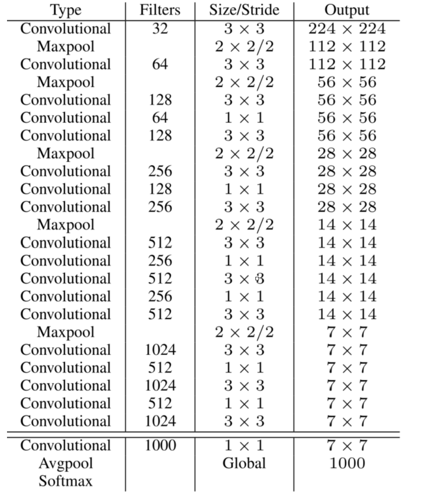

### 4.2 Batch Normalization

- Batch Normalization 导致收敛性显著改善，同时消除了对其他形式的规范化的需求。通过在所有卷积层后加 Batch Normalization，mAP 增加了 2%
- 批量规范化也有助于规范化模型。有了批量归一化，我们可以在不过拟合的情况下去除模型中的 dropout

### 4.3 分类训练

- 我们使用随机梯度下降法在标准的 ImageNet 1000 类分类数据集上训练网络 160 次，使用 Darknet 神经网络框架，起始学习率为0.1，多项式速率衰减为 4 次方，权重衰减为 0.0005，动量为 0.9。在训练过程中，我们使用标准的数据增强技巧，包括随机作物、旋转、色调、饱和度和曝光度的转变
- 如上所述，在对 224×224 的图像进行初始训练后，我们在更大的尺寸（448）上对我们的网络进行微调。在这种微调中，我们用上述参数进行训练，但只用了 10 个epoch，并以$1×10^{-3}$ 的学习率开始。在这个更高的分辨率下，我们的网络达到了 76.5% 的最高准确率和93.3% 的 Top-5 准确率

## 5、检测头优化

### 5.1 检测训练

- 对网络进行了修改，去掉了最后一个卷积层，而是增加了三个 3×3 的卷积层，每个卷积层有 1024 个过滤器，然后是最后一个 1×1 的卷积层，输出的数量是我们检测所需的。对于 VOC，我们预测 5 个框的 5 个坐标，每个框有 20 个类别，所以有 125 个过滤器。我们还从最后的 3×3×512 层向第二个卷积层添加了一个直通层，以便我们的模型可以使用细粒度的特征

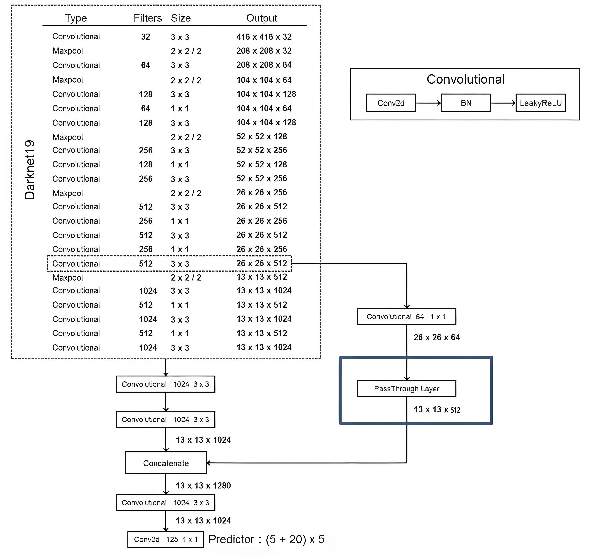

### 5.2 Convolutional With Anchor Boxes

- YOLOv1 中每个网格预测两个检测框，并让最合适的检测框向 ground truth 框进行回归修正。在 YOLOv2 中，将检测框与 Anchor Box 的偏差（offset）进行回归，并且每个网格指定 5 个 Anchor Box。在训练时，只有最接近 ground truth 的检测框进行损失的计算。在引入 Anchor Box 后，mAP 由 69.5 下降至 69.2，原因在于每个网格预测的物体变多之后，召回率大幅上升，准确率有所下降，总体 mAP 略有下降，召回率的提升意味着模型有更高的提升空间
- precision：预测框中包含目标的比例
- recall：真正目标被检测出来的比例
- 引入锚框后，我们将类别预测机制与空间位置分开处理，单独预测每个锚框的类和目标。和原来的YOLO一样，目标预测仍然预测先验框和真实框的IOU，而类别预测则预测在有目标存在下，该类别的条件概率

#### 5.2.1 移除全连接层

- YOLOv2 中移除了最后的全连接层，用了一个全局平均池化层来替换全连接层

#### 5.2.2 Achor Boxes

- 在目标检测任务中，边界框回归的任务是从图像中预测出目标的位置。这通常涉及到预测边界框的中心坐标、宽度和高度。YOLOv2通过引入 Anchor Boxes（锚框）来辅助这一过程
- 在 YOLO2 中引入了 Anchor Boxes（先验框、锚框、候选框）的思想来替代 YOLOv1 中的直接预测 bounnding box 的方式

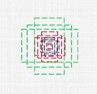

- 上图中，每个格子会预设多个 Anchor Boxes（YOLOV2 论文中设置 5 个）， 他们分别具有不同的尺寸，作为预测边界框的参考模板，YOLOv2 基于 Anchor Boxes 预测相对偏移量并对宽高做调整，使得预测更加灵活，它被用来帮助模型更好地预测不同大小和长宽比的目标

#### 5.2.3 Dimension Clusters

- YOLOv2 使用了 Dimension Clusters 操作初始化锚框的尺寸
- 在标准的 K-means 聚类算法中，通常使用欧几里得距离作为距离度量。然而，对于边界框的聚类，YOLOv2 采用了一种不同的距离度量方法——IoU距离，IoU度量了两个边界框之间的重叠程度

$$
d(box,centroids)=1-IoU(box,centroids)
\\注解：centroids为聚类中心边框，box是gt的边框
$$

- 计算步骤：
  1. 数据准备：从训练数据集中提取所有目标的真实边界框，这些边界框通常以坐标（x, y, w, h）的形式表示，其中（x, y）是边界框中心的坐标，w 和 h 是边界框的宽度和高度
  2. 初始化：随机选择k个边界框作为初始的聚类中心（centroids），YOLOv2 选择的是 5
  3. 分配簇：对于每个训练样本中的边界框，计算它与所有聚类中心的IoU，并根据1 - IoU的值将其分配到最近的簇中（即IoU最大的那个簇）
  4. 更新聚类中心：对于每个簇，重新计算其聚类中心（centroid），通常是取簇内所有边界框的平均值或中位数
  5. 迭代优化：重复步骤2和3，直到聚类中心不再显著变化或达到预定的最大迭代次数
- K 取值很关键：太小特征差距大，太大特征差距太小，随着聚类先验框个数的增加，平均 IOU 也在逐渐增加，可以明显看到当个数大于 5 之后增加逐渐缓慢，所以选择 5 个已经可以满足基本需求了

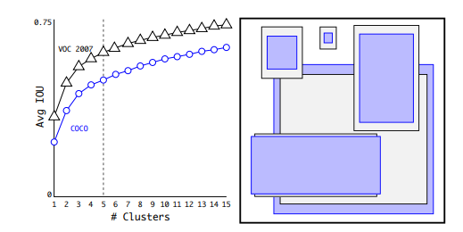

- 在没有锚框的情况下，我们的中间模型mAP为69.5，召回率为81%。有了锚框，我们的模型 mAP 为 69.2，召回率为 88%。即使mAP 下降了，平均召回率的增加意味着我们的模型有更大的改进空间

### 5.3 Direct location prediction

- YOLOv2 不是直接预测边界框的位置，而是预测相对于 Anchor Boxes 的偏移量。这意味着每个 Anchor Box 会预测一个小的偏移量，用以调整 Anchor Box 的位置和大小，使之更接近真实的目标框

#### 5.3.1 位置偏移量

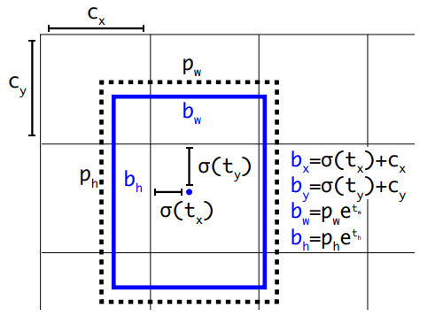

- 计算公式如下：
  - $t_x、t_y$是网络预测的中心坐标偏移量
  - $c_x、c_y$是单元格与图像左上角的偏移量
  - $\sigma$是 Sigmoid 函数，用于将$t_x和t_y$映射到 [0,1] 区间内
  - $b_x、b_y$是最终预测的边界框中心坐标
  - $b_w和b_h$是最终预测编辑框的大小
  - $p_w和p_h$是 Anchor Box 的宽度和高度
  - $t_w和t_h$是宽度、高度的相对偏移量

$$
\begin{aligned}
&b_{x} =\sigma\left(t_x\right)+c_x \\
&b_{y} =\sigma\left(t_y\right)+c_y \\
&b_{w} =p_we^{t_w} \\
&b_{h} =p_he^{t_h} 
\end{aligned}
$$

- 除了上述的边界框坐标和尺寸外，YOLOv2 还会输出一个置信度分数，$confidence = Pr(object)∗IOU(b,object)$

| 项            | 含义                                       |
| ------------ | ---------------------------------------- |
| Pr(object)   | 表示当前边界框中是否包含一个目标对象的概率（即“有物体”的概率）         |
| IOU(b,truth) | 表示预测框 b 与真实框（ground truth）之间的交并比（Intersection over Union） |

- 所有上述计算都是基于归一化的坐标和尺寸（即相对于图像宽度和高度的比例），因此，在实际应用中，需要将这些归一化的值转换为像素单位的实际坐标和尺寸。例如，如果图像的宽度和高度分别是 W 和 H，则实际的边界框坐标可以通过以下方式计算：
  - 实际的 x 坐标：$X=b_x×W$
  - 实际的 y 坐标：$Y=b_y×H$
  - 实际的宽度：$Width=b_w×W$
  - 实际的高度：$Height=b_h×H$

**案例：**

- 假设有一个网络单元格$(c_x,c_y)=(2,3)$，预测的中心坐标偏移量为$(t_x,t_y)=(0.6,0.4)$，对应的 Anchor Box 大小为$(p_w,p_h)=(2.0,3.0)$，宽度和高度的偏移量为$(t_w,t_h)=(-0.5,0.2)$
- 最终预测的特征图中心坐标和大小为：

$$
\begin{aligned}
&b_x=\sigma(0.6)+2\approx{2.88}\\
&b_y=\sigma(0.4)+3\approx{3.5}\\
&b_w=2.0*e^{-0.5}\approx{1.213}\\
&b_h=3.0*e^{0.2}\approx{3.6642}
\end{aligned}
$$

#### 5.3.2 真实坐标

- 在YOLOv2中，当输入图像的大小被调整为 416x416 像素时，整个图像被划分为 13x13 个网格单元格。这意味着每个网格单元格的大小为 32x32 像素（416 / 13 = 32）。这个 32 的因子是由于输入图像的大小和网格单元格的数量之间的关系决定的

- 上述案例中，结果 * 32 才能得到原位置，这是因为每个网格单元格的大小为 32x32 像素：

$$
\begin{aligned}
&b_x=2.88*32=92.16\\
&b_y=3.5*32=112\\
&b_w=1.213*32=38.816\\
&b_h=3.6642*32=117.2544
\end{aligned}
$$

## 6、passthrough

- 在不断执行卷积的过程中，感受野会越来越大，所以最后一层感受野太大，小目标可能会丢失，于是需要融合之前的特征
- YOLOv2 通过直通层（ passthrough ），将相邻特征堆叠到不同通道上，将高分辨率特征和低分辨率特征串联起来
- 具体的做法就是将输出的 13x13 的特征图融合了中间的 26x26 的特征图
- 过程如下：可以把前面的特征图拆分成和后面特征图大小相同然后和后面的特征相加，这个相加指的是沿通道维度进行拼接（concatenation），形成一个$\frac{H}{2}×\frac{W}{2}×(4C+N)$的特征图

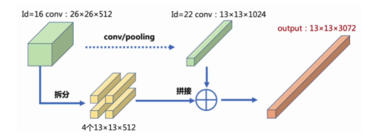

- 26x26x512 的特征图分别按行和列隔点采样，可以得到 4 个 13x13x512 的特征，把这 4 张特征按 channel 串联起来，就是最后的 13x13x1024 的特征图	

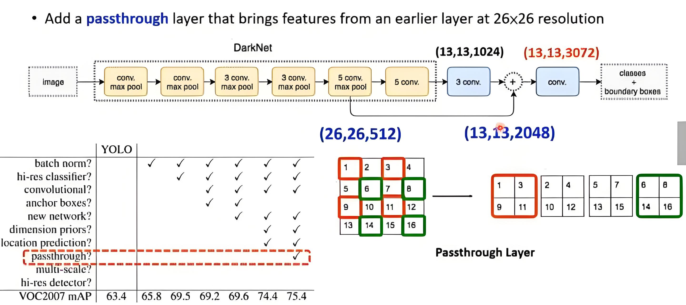

## 7、输出特征维度

- 在YOLOv1里面没有用 anchor，而是直接划分成7 × 7个网格，每个网格输出两个边界框，每个边界框有 4 个位置参数和 1 个置信度，以及每个网格还预测出了 20 个类别的条件类别概率 ---- 7x7x(2x5+20)

- 在 YOLOv2 中，类别变成由 anchor 负责了，每个网格产生 5 个 anchor，每个 anchor 除了产生 4 个定位参数和 1 个置信度参数之外还有 20个类别的条件类别概率，所以在 YOLOv2 里面每个 anchor 都会产生 25 个数，总共输出 5 × 25 = 125 个数。即 YOLOv2 总共输出 13 × 13 × 125 = 21125 个数。最终的目标检测结果就是从这 21125个数里面提取出来的，每个 anchor box 都有位置信息 + 置信度信息 + 类别概率信息
- 输出的维度：$S \times S \times B \times (4 + 1 + C)$
  - S 表示图像分成什么样的像素，比如 13 x 13
  - VOC 数据集 20 类、COCO 数据集 80 类

## 8、性能对比

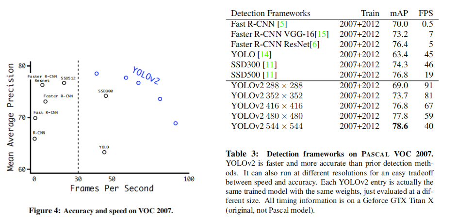
