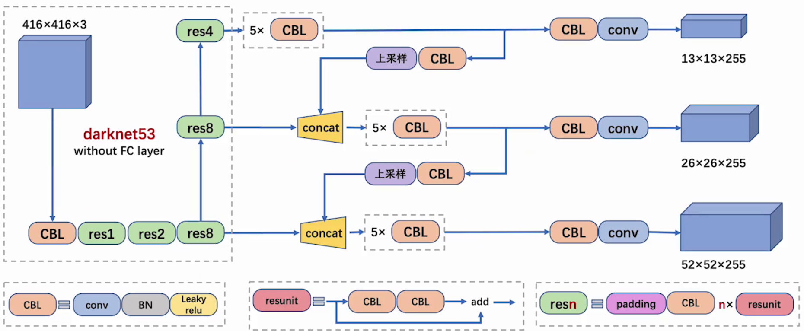

# 一、YOLOV3

- [YOLOV3 论文地址](https://arxiv.org/pdf/1804.02767)
- [YOLOV3 论文中文翻译地址](https://blog.csdn.net/yegeli/article/details/109751358)
- YOLOv3 在实时性和精确性在当时都是做的比较好的，并在工业界得到了广泛应用
- YOLOv3 改进网络结构，使其更适合小目标检测，改进 softmax，预测多标签任务
- YOLOv3 最显著的改进就是在 3 个尺度上以相同的方式进行目标的检测，每种 3 个锚框，共 9 个。这使其可以检测到不同规模的目标

## 1、网络结构【掌握】

### 1.1 整体结构

- **CBL：**CBL（Convolutional + Batch Normalization + Leaky ReLU）是 Yolov3 网络结构中的最小组件，组成如下：
  - 卷积层（Convolutional Layer）
  - 批量归一化层（Batch Normalization Layer）
  - 激活函数（Leaky ReLU）

- **resunit：**含有多个 CBL，残差模块中含有一个或多个残差单元。输入通过两个 CBL 后，再与原输入进行 add；这是一种常规的残差单元。残差单元的目的是为了让网络可以提取到更深层的特征，同时避免出现梯度消失或爆炸
  - 梯度消失是指在反向传播过程中，梯度值变得非常小，以至于权重更新几乎停滞不前
  - 梯度爆炸是指在反向传播过程中，梯度值变得非常大，导致权重更新幅度过大，从而使模型的训练不稳定甚至发散

- **resn：**resn 是 Yolov3 中的大组件，n 表示这个 Res-block 里含有多少个 Res-unit，组成如下：
  - 一个 padding
  - 一个 CBL
  - N 个残差组件

- **concat：**将 Darknet-53 的中间层和后面的某一层的上采样进行张量拼接，达到多尺度特征融合的目的。这与残差层的 add 操作是不一样的，拼接会扩充张量维度，而 add 直接相加不会导致张量维度的改变，例如 104×104×128 和 104×104×128 拼接，结果是 104×104×256
- **add**：张量相加，张量直接相加，不会扩充维度，例如 104×104×128 和 104×104×128 相加，结果还是 104×104×128
- **上采样**：上采样（Upsampling）是一个关键的技术，用于实现多尺度特征融合，从而提高模型对不同尺度目标的检测能力
  - 多尺度特征融合：YOLOv3 在多个尺度上进行目标检测，通过上采样将低分辨率的特征图放大到高分辨率，与更高分辨率的特征图进行融合，从而捕捉到更多的细节信息，有助于模型更好地检测不同尺度的目标，尤其是小目标

- 255 = 3 x (4+1+80)

- 最后面的蓝色立方体表示三种尺度的输出

### 1.2 主干网络

- YOLOV3 主干结构采用 darknet-53，没有池化和全连接层，尺寸变换是通过 Stride 实现的
- 整个网络主要包括`5`组残差块，如下：
  - 以`256x256`输入为例，首先经过一个`3x3x32`的卷积层输出为`256x256x32`
  - 接着经过一个`3x3x64 stride=2`的卷积层输出为`128x128x64`
  - 接着经过一个残差块，输出为`128x128x64`
  - 再经过一个`3x3x128 stride=2`的卷积层输出为`64x64x128`
  - 经过`2`个残差块后输出为`64x64x128`
  - 接着经过一个`3x3x256 stride=2`的卷积层输出为`32x32x256`
  - 接着经过`8`个残差块，输出为`32x32x256`
  - 再经过一个`3x3x512 stride=2`的卷积层输出为`16x16x512`
  - 接着经过`8`个残差块后输出为`16x16x512`
  - 接着经过一个`3x3x1024 stride=2`的卷积层输出为`8x8x1024`
  - 接着经过`4`个残差块后输出为`8x8x1024`
  - 最后经过池化全连接层以及`softmax`输出

### 1.3 特征输出【掌握】

- 特征图尺寸越小，感受野越大，他们分别适配不同大小的目标：

  - 52 × 52 感受野小，更适合检测小型目标
  - 26 X26 感受野中等，更适合检测中小型目标

    - 13 × 13 感受野大，更适合检测大型目标

### 1.4 特征融合

#### 1.4.1 FPN 思想

- 在目标检测任务中，不同尺度的目标（如远处的小人和近处的大车）对特征提取的要求不同：
  - **大目标**：需要高层语义信息（如类别、整体形状）
  - **小目标**：需要低层细节信息（如边缘、纹理）
- 传统的单尺度特征提取网络（如 YOLOv2）往往只使用最后一层特征图进行预测，**对小目标检测效果较差**
- FPN（Feature Pyramid Network），就是特征金字塔网络，目标是：融合多尺度特征，使每个尺度的特征图都具备丰富的语义信息，从而提升对不同尺度目标的检测能力，尤其是小目标
- FPN 的主要思想如下：
  - 特征提取：使用骨干网络（如 ResNet、Darknet-53 等）提取不同尺度的特征图。这些特征图通常有不同的分辨率，例如 13x13、26x26 和 52x52
  - 自顶向下路径：从最高层的特征图开始，逐层进行上采样，并与下一层的特征图进行拼接，通过 CBL 模块对拼接后的特征图进行进一步处理，作用是将高层语义信息“传递”到低层，增强低层特征的语义表达能力
  - 横向连接：在每个尺度上，将**自顶向下路径的特征图**与**同尺度的骨干网络输出特征图**进行**通道拼接（Concatenate）**，作用是融合低层的细节信息 + 高层的语义信息，提升多尺度检测能力
  - 特征融合：在每个尺度的横向连接后，使用一个 **CBL 模块（Conv + BN + Leaky ReLU）** 或普通卷积层，对拼接后的特征图进行进一步处理，通常使用 3×3 卷积进行特征融合，作用是增强特征表达能力，减少信息冗余
- 观察下面四张图：

- 图 a：特征化图像金字塔
  - 当我们要检测不同的尺度目标时，需要把图像送入不同的尺度

  - 需要根据不同的尺度图片一次进行预测

  - 需要多少个不同尺度就需要预测多少次，效率较低

- 图 b：单特征映射
  - 得到一个特征图并进行预测

  - 特征丢失，对于小目标效果不好

- 图 c：金字塔特征层次结构
  - 把图像传给 backbone，在传播的过程中分别进行预测

  - 相互之间独立，特征没有得到充分利用

- 图 d：特征金字塔网络
  - 不是简单的在不同特征图上进行预测
  - 会对不同的特征图进行融合后再进行预测

#### 1.4.2 FPN 融合

- 和前面描述的一样，为了进一步降低模型的复杂度进而提升速度，YOLOv3 选择了重用主干网络所提取的不同尺寸的特征图，主要是 8 倍、16 倍以及 32 倍下采样的特征图，同时采用了 FPN 的设计思想，分别对 16 倍、32 倍以及各自上采样后的结果进行了融合，但是也对其进行了一定的改进，在传统的 FPN 中，特征图通常是通过 **加法（Add）** 来进行融合的。但在 YOLOv3 中，作者选择使用 **通道拼接（Concatenate）** 来代替加法操作，这是为了：
  - **增加特征图的通道数**：使得模型能够捕捉到更多的信息
  - **避免信息丢失**：加法操作可能会导致某些重要信息被掩盖，而拼接则保留了所有原始信息
- 1×1 卷积完成通道的一致性
- 2×up（上采样）完成尺寸的一致性

#### 1.4.3 上采样融合

- 特征融合更有利于检测各种尺寸的物体，下图是特征融合架构图：

## 2、多尺度预测

- 如果输入的是 416×416x3 的图像，YOLOv3 会产生 3 个尺度的特征图，分别为：13×13、26×26、52×52，也对应着网格个数，即总共产生 13×13+26×26+52×52 个网格。对于每个网格，对应 3 个锚框，于是，最终产生了(13×13+26×26+52×52)×3=10647 个预测框，利用阈值过滤掉置信度低于阈值的预选框，每个网格同样最终只预测一个结果，取置信度最大的

- 在 COCO 数据集上，YOLOv3 使用了 9 种不同形状的 Anchor Box，这 9 个 Anchor Box 被分配到三个不同的尺度中，每个尺度使用其中的 3 个来匹配适合该尺度的目标大小。具体来说：

  - **13×13 特征图**：适用于较大的目标，因为这个尺度的特征图感受野较大，能够捕捉到更全局的信息
  - **26×26 特征图**：适用于中等大小的目标
  - **52×52 特征图**：适用于较小的目标，因为这个尺度的特征图分辨率更高，能捕捉到更多细节

  

- 对于每个网格，其都对应一个 85 维度的 Tensor（80 + 5）

  - 5=4+1：中心点坐标、宽、高，置信度
  - 80：80 个类别的类别概率（COCO数据集的类别是80个）

## 3、类别预测

- 在有的数据集中，一个目标可能同时具有多个标签（如“女性”和“人”）。使用 softmax 会隐式地假设每个边界框只属于一个类别，而现实中这种情况并不总是成立。因此，多标签分类的方式更符合实际数据分布，能够更好地建模多类别共存的场景
- YOLOv3 使用独立的逻辑回归分类器代替 softmax，采用多标签分类方式处理类别预测，这种设计更适合现实场景中目标类别重叠的情况，提升了模型对复杂任务的适应能力

## 4、损失函数

- YOLOv3 的损失函数由三个主要部分组成：定位损失（Localization Loss）、置信度损失（Confidence Loss）和分类损失（Classification Loss）
  - 定位误差损失：对于每一个与真实边界框（ground truth）匹配的先验框（anchor box），YOLOv3 会计算其在位置（x, y）和尺寸（w, h）上的预测误差。该部分损失采用**均方误差（Mean Squared Error, MSE）**进行计算。需要注意的是，YOLOv3 仅对负责预测目标的 anchor box 计算定位损失，其余框不参与该部分损失的计算
  - 置信度误差损失：YOLOv3 使用**二元交叉熵损失（Binary Cross Entropy, BCE）**来计算置信度损失。该损失分为两个部分：
    - 对于负责预测目标的 anchor box，置信度的目标值为预测框与真实框之间的 IOU
    - 对于不负责预测的 anchor box，目标值为 0。 这种设计有助于模型学习区分包含目标与不包含目标的边界框
  - 分类误差损失‌：与早期版本不同，YOLOv3 放弃了使用 softmax 的多类分类方式，转而采用**独立的二元分类器**，并对每个类别使用**二元交叉熵损失（Binary Cross-Entropy Loss）**。这种多标签分类的设计允许一个边界框同时属于多个类别（如“女性”和“人”），从而更好地建模现实世界中复杂的标签重叠情况

## 5、性能对比

- AP50：IoU 阈值为 0.5 时的 AP 测量值
- AP75：IoU 阈值为 0.75 时的 AP 测量值
- APs：对于小目标的 AP 值
- APm：对于中等目标的 AP 值
- APL：对于大目标的 AP 值

