# 一、YOLOv4

- YOLOv4 论文地址：：【https://arxiv.org/pdf/2004.10934】
- YOLOv4  论文中文翻译地址：【https://blog.csdn.net/muye_IT/article/details/125294973】
- YOLOv4 是一种高效且准确的目标检测模型，它在 YOLOv3 的基础上引入了多项改进，旨在提高模型的检测速度和精度，自诩为Optimal Speed and Accuracy of Object Detection（目标检测的最佳速度和最佳精度）

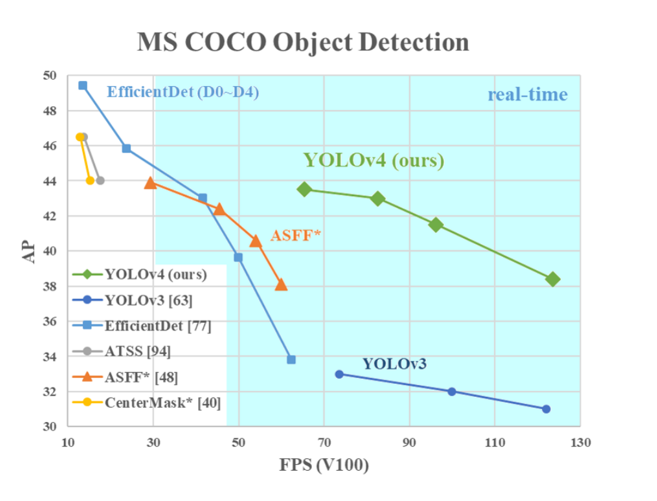

## 1、改进点和贡献

- YOLOv4 主要涉及的改进内容如下：
  - 输入端改进：CutMix、Mosaic 数据增强
  - 主干网络：CSPDarknet53 为 backbone、 SPP 额外添加模块
  - 颈部网络：SPP（Spatial Pyramid Pooling）、PANet（Path Aggregation Network）
  - 检测头：YOLOv3（基于 anchor 的）
  - 损失函数：CIOU（Complete Intersection over Union ）损失
  - 激活函数：Mish 激活函数
  - 样本匹配：增加了匹配样本的数量
- YOLOv4 贡献主要内容如下：
  - 算力要求低，单 GPU 就能训练好
  - 从数据层面（数据增强等）和网络设计层面（网络结构）来进行改善
  - 融合各种神经网络论文的先进思想

## 2、数据增强策略

### 2.1 Bag of freebies

- 通常情况下，传统的目标检测器的训练都是在线下进行的。因此， 研究者们总是喜欢利用纯线下训练的好处而研究更好的训练方法，使得目标检测器在不增加测试成本的情况下达到更好的精度。我们将这些只需改变训练策略或只增加训练成本的方法称为 bag of freebies。目标检测经常采用并符合这个定义的就是数据增强。数据增强的目的是增加输入图像的多样性，从而使设计的目标检测模型对来自不同环境的图片具有较高的鲁棒性
- 使用场景：Mosaic 数据增强、标签平滑、自对抗训练、损失函数 CIOU、CmBN

### 2.2 Bag of specials

- 对于那些只会增加少量的推理成本的插入模块和后期处理方法， 但可显著提高目标检测的准确性，我们称其为 Bag of specials。一 般来说，这些插入模块是用来增强模型的某些属性的，如扩大感受野、 引入注意力机制、增强特征整合能力等，而后处理是一种筛选模型预测结果方法
- 使用场景：Mish 激活函数、CSP 结构

### 2.3 CutMix 数据增强

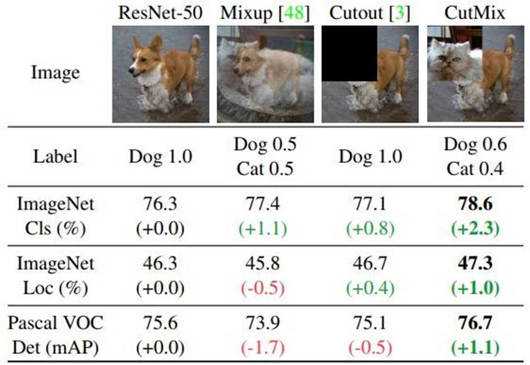

- 增强局部特征的学习：通过将不同图像的局部特征混合在一起，模型可 以学习到更多的局部信息
- 提高训练效率：高价值信息增多，提升训练效率，优化算法性能
- 防止模型过拟合：通过引入更多样的训练样本，CutMix 能够提高模型的泛化能力，减少过拟合现象
- 数据稳定：由于采用填充的形式，不会有图像混合后不自然的情形，能够提升模型分类的表现

### 2.4 Mosaic 数据增强

- Mosaic 数据增强则利用了 4 张图片，对 4 张图片进行拼接，每一张图片都有其对应的框，将 4 张图片拼接之后就获得一张新的图片，同时也获得这张图片对应的框，然后将这样一张新的图片传入到神经网络当中去学习，这极大丰富了检测物体的背景
- Mosaic数据增强的具体步骤如下：
  - 首先随机取 4 张图片
  - 分别对 4 张图片进行基本的数据增强操作，并分别粘贴至与最终输出图像大小相等掩模的对应位置
  - 进行图片的组合和框的组合
- 注意：
  - 基本的数据增强包括：翻转、缩放以及色域变化（明亮度、饱和度、色调）等操作

- 图示：先对单张图片做调整亮度、对比度、色调、随机缩放、剪切、翻转、旋转等基本数据增强，后把 4 张图片拼接在一起

- 优点：
  - 增加数据多样性：通过将多张图像混合在一起，生成更多不同的训练样 本
  - 提升模型的鲁棒性：模型在训练过程中见过更多样的图像组合，能够更 好地应对不同场景下的目标检测任务
  - 减少过拟合：通过增加数据的多样性，有助于防止模型过拟合，提升泛化能力
  - 减少训练算力：由于一次性可以计算 4 张图片，所以 **Batch Size** 可以不用 很大，也为 YOLOv4 在一张 GPU 卡上完成训练奠定了数据基础

### 2.5 DropBlock 正则化

- DropBlock 是一种用于卷积神经网络的正则化技术，旨在防止过拟合。它通过在训练过程中随机丢弃特征图中的连续区域（块）来增加模型的泛化能力。与传统的 Dropout 不同，Dropout 随机丢弃独立的神经元，而 DropBlock 丢弃的是特征图中的连续相邻区域，这样可以更有效地移除某些语义信息，从而提高正则化的效果
- 图示：图（b) 表示 Dropout 、图（c）表示 DropBlock 

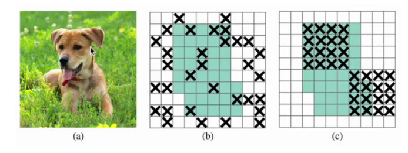

### 2.6 Class label smoothing

- 标签平滑（Label Smoothing）是一种正则化技术，用于减少模型在训练过程中对训练数据的过拟合，提高模型的泛化能力。标签平滑的基本思想是通过在训练过程中对标签进行平滑处理，减少模型对单一类别的过度自信，从而使得模型更加鲁棒

- 独热编码（One-Hot Encoding）是一种将分类变量转换为二进制向量的编码方法，通过 One-Hot 编码，可以将分类变量转换为数值形式，假设有一个分类变量，它有 𝐾 个不同的类别。One-Hot 编码会将每个类别映射到一个长度为 𝐾 的二进制向量，其中只有一个位置为 1，其余位置为 0。这个位置对应于该类别的索引

- 标签平滑的工作原理：

  - 在传统的分类任务中，标签通常是以 one-hot 编码的形式给出的。例如，对于一个三分类任务，标签可能是 `[1, 0, 0]`、`[0, 1, 0]` 或 `[0, 0, 1]`。标签平滑通过将这些硬标签平滑为软标签，使得每个类别的概率不再是 0 或 1，而是一个介于 0 和 1 之间的值
  - 公式：
    - $y_{true}$是原始的 one-hot 编码标签
    - $y_{smoothed}$是平滑后的标签
    - $\epsilon$是平滑系数，通常是一个较小的正数（例如 0.1）
    - K 是类别的总数

  $$
  y_{smoothed}=(1-\epsilon)·y_{true}+\frac{\epsilon}{K}
  $$

- 案例：假设我们有一个三分类任务，原始的 one-hot 编码标签是 `[1, 0, 0]`，平滑系数 𝜖=0.1，类别总数 𝐾=3。那么平滑后的标签计算如下：

$$
\begin{aligned}
&y_{1}=(1-0.1)*[1,0,0]+\frac{0.1}{3}=[0.9,0,0]+0.0333=[0.9333,0.0333,0.0333] \\ 
\end{aligned}
$$

### 2.7 CmBN

- 交叉小批量归一化（Cross mini-Batch Normalization，CmBN） 是 CBN 的修改版。CmBN会跨多个小批量对均值和方差进行积累和计算，逐渐形成一个全局的均值和方差，从而提升了统计量的稳定性和准确性，减少训练震荡

| 方法 | 均值/方差计算方式                   | 是否跨 batch | 是否引入条件信息 | 适用场景         | 主要优势       |
| ---- | ----------------------------------- | ------------ | ---------------- | ---------------- | -------------- |
| BN   | 当前 batch 内                       | 否           | 否               | 通用             | 简单高效       |
| CBN  | 当前 batch + 条件信息               | 否           | 是               | 多任务、生成模型 | 控制特征分布   |
| CmBN | 当前 batch + 历史 batch（滑动平均） | 是           | 否               | 小 batch size    | 提升统计稳定性 |

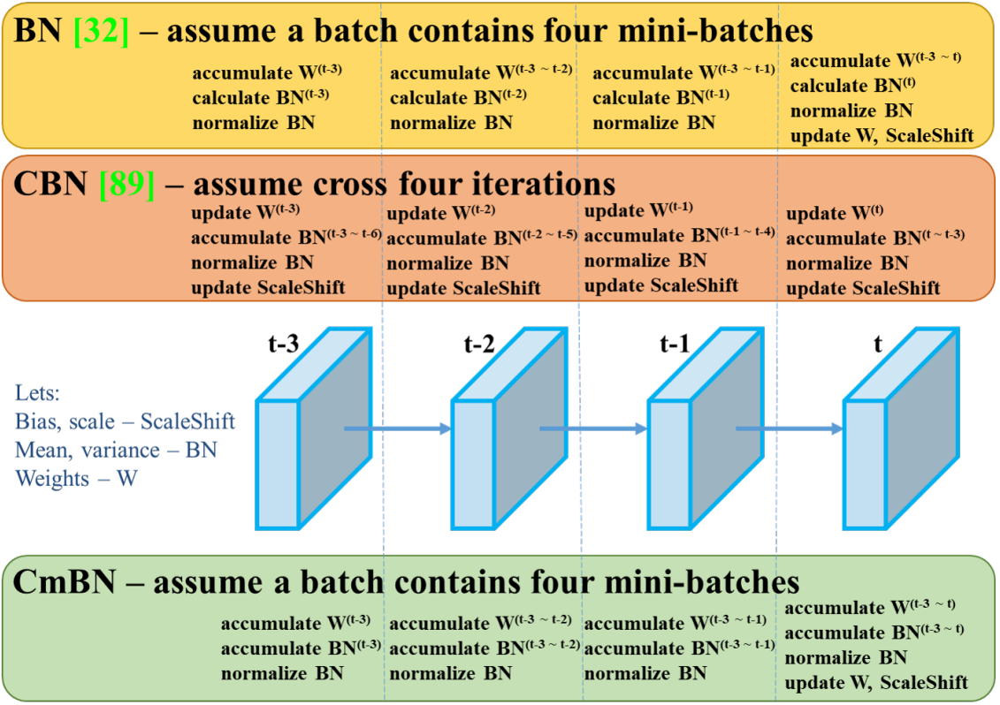

### 2.8 Mish 激活函数

- 与 ReLU 等非平滑激活函数相比，Mish 具有更好的平滑性，平滑的激活函数能够让模型获得更好的非线性，从而得到更好的准确性和泛化，Mish 激活函数的数学表达式为：

$$
Mish(x)=x*tanh(ln(1+e^x))
$$

- Mish 函数和 ReLU 一样都是无正向边界的，可以避免梯度饱和

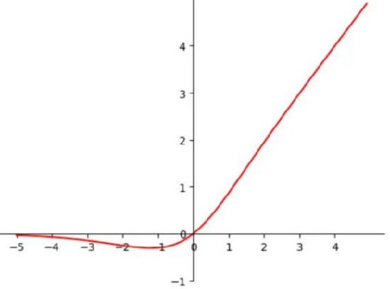

- 使用了Mish激活函数的 TOP-1 和 TOP-5 的精度比没有使用时都略高一些：

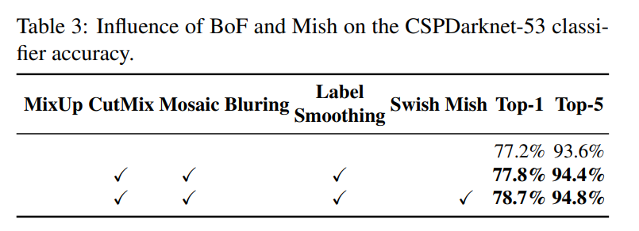

## 3、损失函数

- MSE Loss 主要问题就是导数变化不稳定，尤其是在早期阶段（损失越大，导数越大），随着导数越来越小， 训练速度变得越来越慢。也因此有学者提出了 IOU 一系列的损失函数，IOU 损失函数演变的过程如下：IOU => GIOU => DIOU =>CIOU 损失函数，每一种损失函数都较上一种损失函数有所提升

### 3.1 IoU Loss 

- IoU 损失定义如下：交集越大，损失越小

$$
\mathcal{L}_{IoU}=1-\frac{|B\cap B^{gt}|}{|B\cup B^{gt}|}
$$

- 不适合的情况：
  - 情况 1 ，当预测框和目标框不相交时，IoU=0，无法反映两个框距离的远近，此时**损失函数不可导**
  - 情况 2 和情况 3 的情况，当 2 个预测框大小相同，2 个 IoU 也相同，IOU Loss **无法区分两者位置的差异**

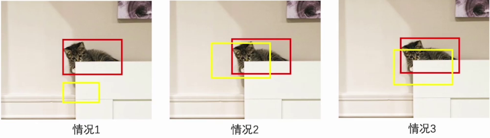

### 3.2 GIoU Loss 

- GIoU（Generalized loU）是对 IoU 的改进版本

- 图中最大外接矩形为 C，红色区域为差集 A（C-并集），那么给出 GIoU Loss 的表达式如下：

$$
\mathcal{L}_{GIoU}=1-|IoU|+\frac{|A|}{|C|}
$$

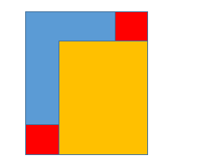

- 优点：
  - 在 GIoU 不仅关注重叠区域，还关注其他的非重合区域，能够更好的反映两者的重合度，即添加了惩罚因子，缓解了 IoU Loss 不可导的问题

- 缺点：
  - 下面 3 种情况差集均相等，这个时候 GIoU Loss 就退化为了 IoU Loss，GIoU Loss 也无法反映 3 种情况的好坏，即**无法区分相对位置关系**

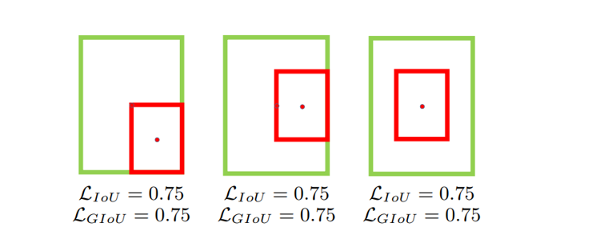

### 3.3 DIoU Loss 

- 为了解决 GIoU 遇到的问题，DIoU（Distance loU）就诞生了。DIoU 作者认为好的目标框回归函数应该考虑 3 个重要几何因素：重叠面积、中心点距离，长宽比
- 针对 IoU 和 GIoU 存在的问题，DIoU 作者从两个方面进行考虑
  - 如何最小化预测框和目标框之间的归一化距离？
  - 如何在预测框和目标框重叠时，回归的更准确？
- 针对第一个问题，提出了 DIoU Loss（Distance IoU Loss），DIoU Loss 考虑了重叠面积和中心点距离，当目标框包裹预测框的时候，直接计算 2 个框的距离，因此 DIoU Loss 收敛的更快
- 公式：

$$
\begin{aligned}
&\mathcal{L}_{DIoU}=1-\text{|DIoU|}=1-\text{|IoU|}+\frac{\rho^2(B,B^{gt})}{l_c^2}
\\
&\rho(B,B^{gt})\text{表示检测框中心点和真实框中点之间的欧式距离，}l_c\text{表示最小外接矩形的对角}\\&\text{线距离}\end{aligned}
$$

- 图示：

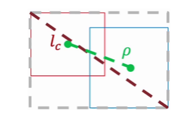

- 效果图：

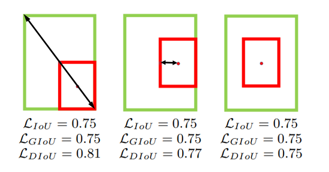

- 缺点：
  - 如下图所示的 3 种状态预测框和真实目标框的中心点距离是相同的，DIoU Loss 也退化成了 IoU Loss。如上面提到的目标检测回归函数需要考虑到的 3 种因素，DIoU Loss 没有引入长宽比的衡量

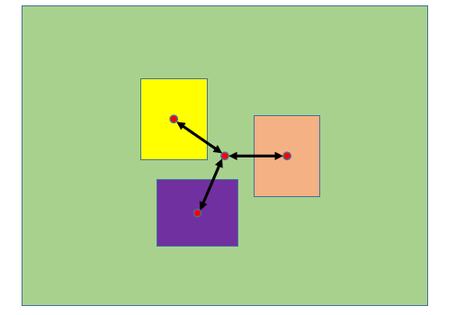

### 3.4 CIoU Loss 

- 为了解决 DIoU 遇到的问题，CIoU（Complete loU） Loss 被提出来，CIoU 在 DIoU 基础上把目标框长宽比的相似程度考虑进去，利用惩罚因子进行约束
- YOLOv4 采用 CIoU Loss 做回归损失函数，而分类损失和目标损失都使用的是交叉熵损失。对于回归损失，其数学表达式如下：

$$
\begin{aligned}
&\mathcal{L}_{CIoU}=1-|CloU|=1-|IoU|+\frac{\rho^2(B,B^{gt})}{l_c^2}+\alpha{v}
\\
&v=\frac4{\pi^2}\left(arctan\frac{w^{gt}}{h^{gt}}-arctan\frac{w^p}{h^p}\right)^2
\\
&\rho^2(B,B^{gt})，l_c^2 分别表示预测结果与标注结果中心点的欧氏距离和框的对角线距离，w和h表示预测框的宽高
\\
&v\text{是衡量长宽比一致性的参数,}w^{gt},h^{gt}\text{为真实框的宽高,}w^p,h^p\text{为检测框的宽高}\\
&\alpha是平衡因子，计算公式为\frac{v}{(1-IoU)+v}
\end{aligned}
$$

- CIoU Loss 将目标框回归函数应该考虑的 3 个重要几何因素都考虑进去了：重叠面积、中心点距离、长宽比

## 4、网络结构

### 4.1 整体网络结构

- YOLOv4 采用了称为 CSPDarknet-53 的新的主干网络结构，它基于 Darknet-53，并通过使用 CSP（Cross Stage Partial）模块来提高特征表示的能力
- YOLOv4 = CSPDarknet53（骨干） + SPP 附加模块PANet 路径聚合（颈） + Yolov3（检测头）

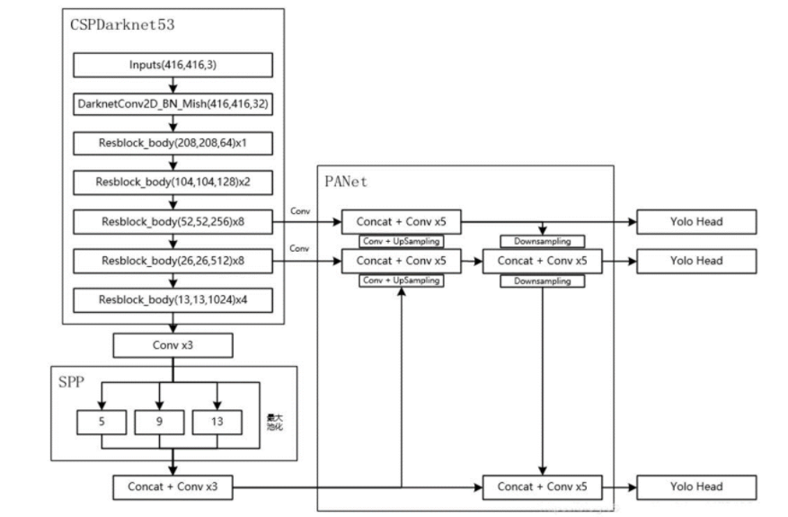

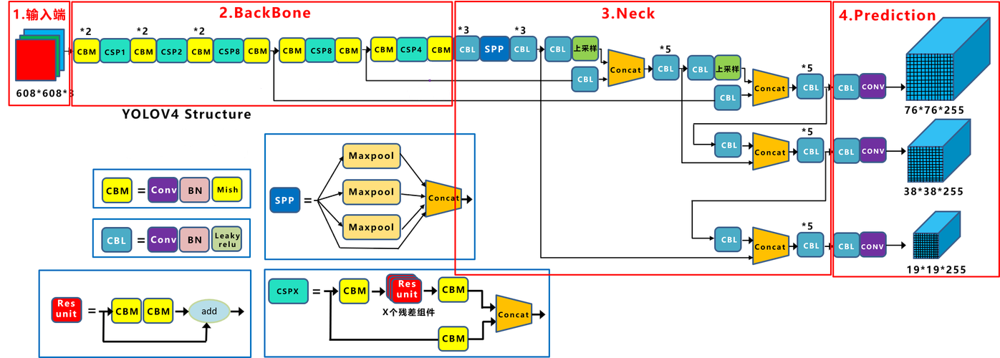

### 4.2 CSPNet

- CSPNet（Cross Stage Partial Network）：跨阶段局部网络，主要从网络结构设计的角度解决推理中计算量很大的问题

- CSPNet 的作者认为推理计算过高的问题是由于网络优化中的梯度信息重复导致的。因此采用 CSP（Cross Stage Partial）模块先将基础层的特征按照通道划分为两部分，一部分直接传递到下一个阶段，另一部分则通过一些卷积层进行处理后再传递到下一个阶段，然后通过跨阶段层次结构将它们合并，在减少了计算量的同时可以保证准确率

- CSP 在论文《CSP:A New Backbone that can Enhance Learning Capability of CNN 》提出，把 CSP 应用到 ResNe(X)t，模型结构如下图所示：

  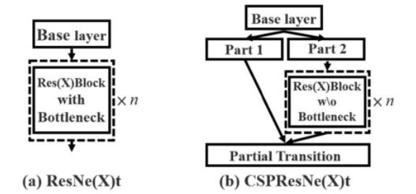

- Bottleneck 层通常由三个卷积层组成：

  - 第一个 1×1 卷积层：用于降低输入的通道数，以减少后续卷积层的计算量
  - 第二个 3×3 卷积层：在降维后的特征图上进行卷积操作，提取特征
  - 第三个 1×1 卷积层：将通道数恢复到原始维度，以供下一层使用

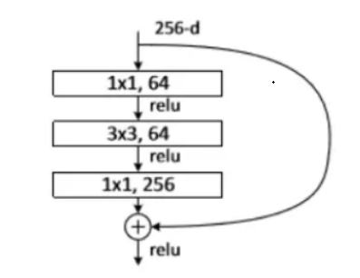

- 优点：
  - 增强 CNN 的学习能力，使得在轻量化的同时保持准确性
  - 降低计算成本、内存成本

### 4.3 YOLOV4 的 CSP

- CSPNet 通过通道划分与跨阶段融合机制，有效减少了冗余计算，提升了模型的学习能力与推理效率，是现代高性能目标检测模型（如 YOLOv4 及其后续版本）中广泛采用的主干网络设计思想

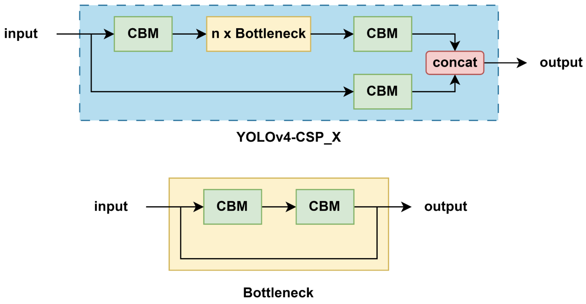

- **通道划分（Split）**
  - 输入特征图的通道被平均分成两个部分（通常是 1: 1）：
    - **Part A**：不做任何处理，直接跳过当前模块，传递到最终的拼接层
    - **Part B**：通过一系列卷积操作（如 Conv + Bottleneck）进行特征提取

- **特征处理（Transform）**

  - **Part B** 会经过多个标准的 **Darknet Bottleneck 模块**（类似 ResNet 的残差块）

  - 通常包括：
    - 1×1 卷积降维
    - 3×3 卷积提取特征
    - 可选的残差连接（Residual）

- **跨阶段融合（Merge）**

  - 将 **Part A** 和 **Part B 的输出** 在通道维度上进行 **拼接（Concatenate）**

  - 然后通过一个 **1×1 卷积** 进一步融合特征，输出到下一个阶段

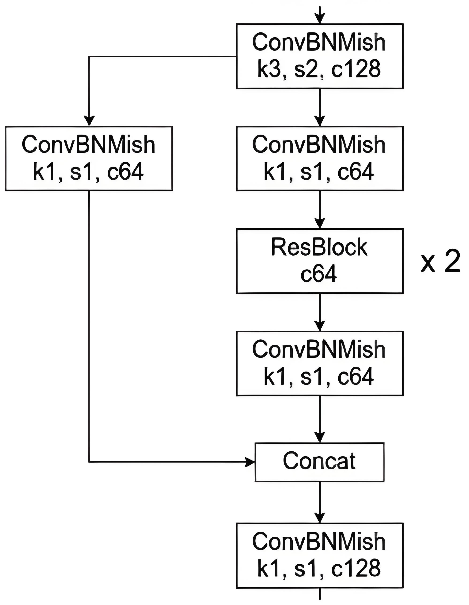

### 4.4 SPPNet

- 空间金字塔池化网络（Spatial Pyramid Pooling Network，SPPNet）主要目的是解决图像在输入到卷积神经网络时尺寸不一的问题。通过将不同大小的输入映射到固定长度的输出，SPP 模块使得神经网络能够处理任意大小的输入，从而大大提高了模型的灵活性和泛化能力

  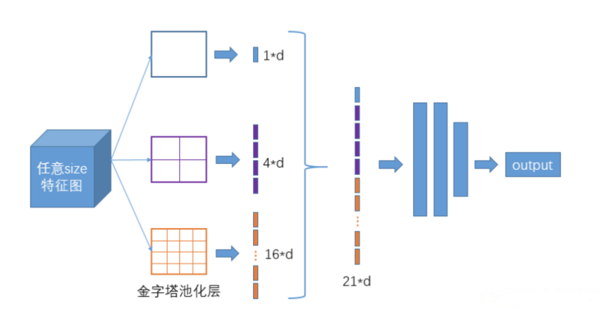

- YOLOv4 借鉴了 SPP 的思想，SPP 模块被集成在主干网络之后，用于增强模型对多尺度目标的感知能力。

- 将经过不同尺度池化后的特征图沿通道维度进行拼接。由于每个池化操作的结果都是 13×13×256，而我们进行了 4 次不同的池化操作（包括原特征图），最终得到的是一个 13×13×(4×256)=13×13×1024 的特征图，在这个过程中，虽然我们改变了特征图的处理方式，但我们并没有改变其空间分辨率（仍然是 13×13），而是增加了通道数（从 256 增加到 1024）。这样做可以有效地增加网络的感受野，并结合了不同尺度的信息，有助于提高模型对于各种大小目标的检测性能

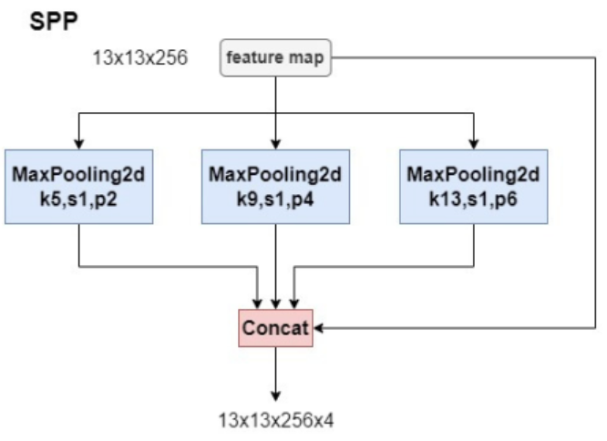

### 4.5 FPN+PAN

- 路径聚合网络（Path Aggregation Network，PAN），在 FPN 的基础之上进一步优化而来，用于在不同尺度的特征图之间进行信息传递和融合，以获取更好的多尺度特征表示
- 在 YOLOv4 中，PANet（Path Aggregation Network）是一种用于特征金字塔网络（Feature Pyramid Network, FPN）的改进版本，旨在增强特征的多尺度融合能力，从而提高目标检测的精度。PANet 通过自底向上的路径增强机制，进一步加强了特征图的跨尺度信息传递，这对于检测不同大小的目标尤其重要
- YOLOV4 中的 PANet 主要由两部分组成：
  - 自顶向下的路径（FPN)：这部分与传统的 FPN 类似，从高层（语义信息丰富但空间信息较少）到低层（空间信息丰富但语义信息较少）逐步上采样，并与低层特征图进行融合，生成多尺度的特征图，作用就是负责将深层的强语义特征传递到底层特征图中，增强低层特征图的语义表达能力，有助于检测大目标
  - 自底向上的路径（PAN）：这是 PANet 相对于传统 FPN 的一个重要改进，它从低层到高层逐步下采样，并与高层特征图进行融合，进一步增强特征图的跨尺度信息传递，作用就是负责将浅层的精确定位特征传递到高层特征图中，增强高层特征图的定位能力，有助于检测小目标
- 改进：YOLOv4在原始PAN结构的基础上进行了改进。原本的 PANet 网络的 PAN 结构中，特征层之间融合时是直接通过加法（addition）的方式进行融合的，而 YOLOv4 中则采用在通道方向上进行拼接（Concat）的方式进行融合

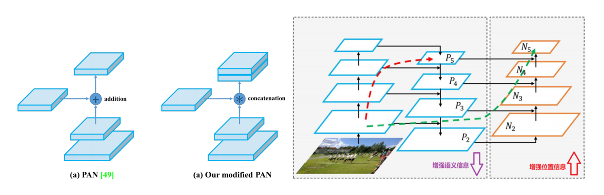

## 5、模型性能

### 5.1 数据增强性能影响

- 选型：CutMix + Mosaic + Label Smoothing + Mish

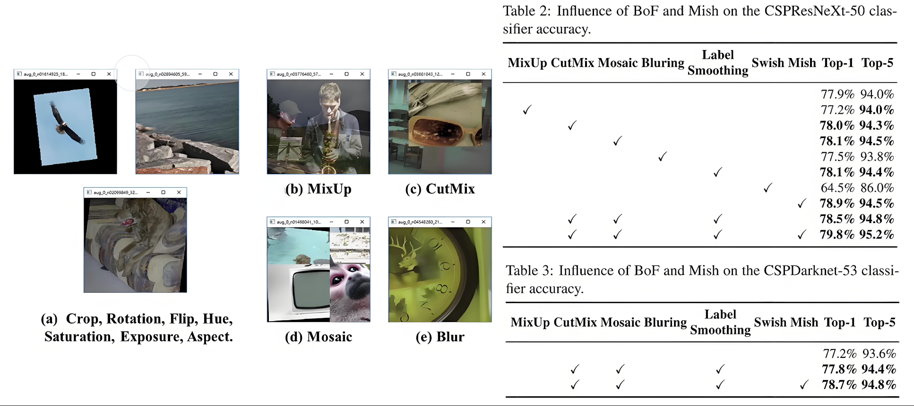

### 5.2 增强对检测的效果

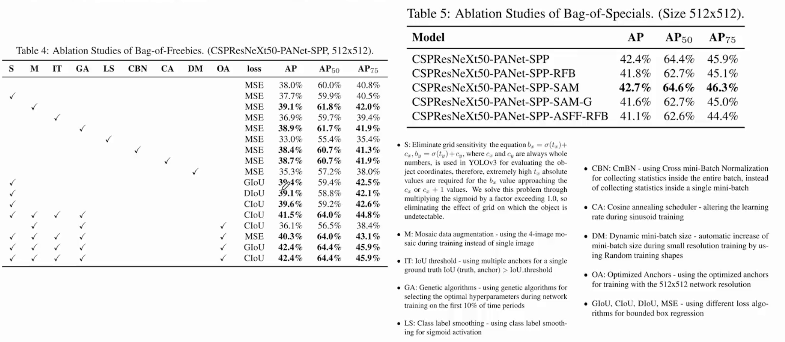

### 5.3 Backbone性能影响

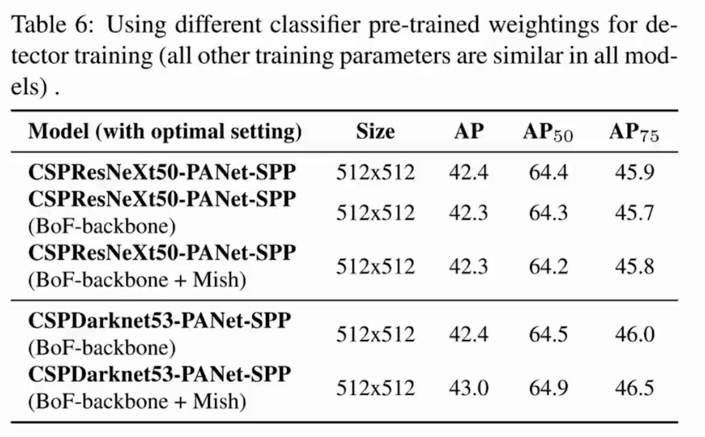

### 5.4 mini-batch性能影响

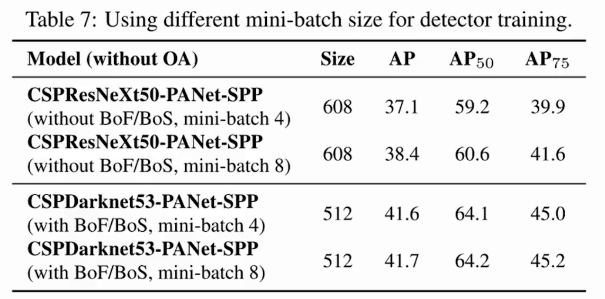

### 5.5 推理时间和精度

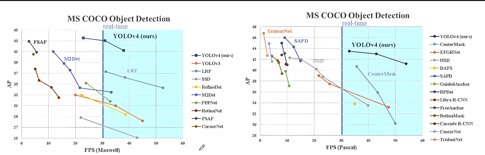

### 5.6 COCO 数据集性能对比

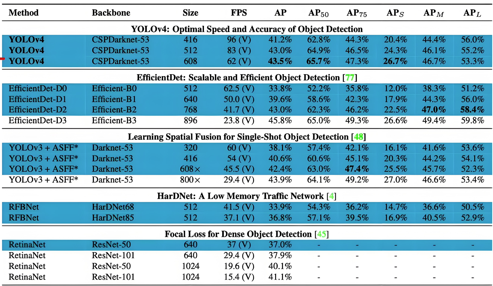

