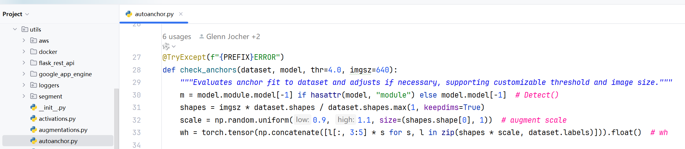
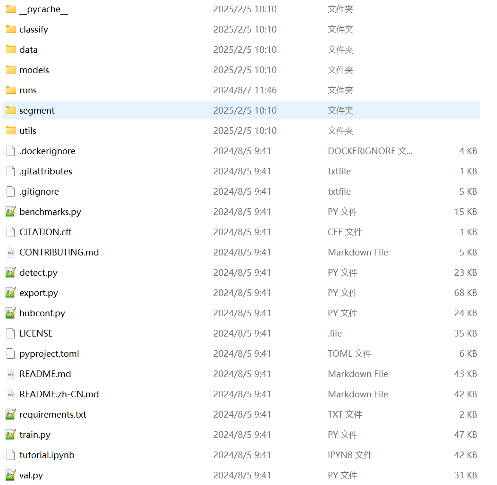

# 一、YOLOv5

- YOLOv5（You Only Look Once version 5）是一个开源的目标检测框架，由 Glenn Jocher 及其团队开发，属于 Ultralytics 公司，在 GitHub 上发布
- 它是 YOLO 系列算法的第五代版本，旨在提供高效、灵活且易于使用的物体检测解决方案。相比于之前的版本，YOLOv5 引入了许多改进，使其成为工业界和学术界广泛采用的选择
- YOLOv5 有 YOLOv5n、YOLOv5s、YOLOv5m、YOLOv5l、YOLOv5x 五个版本。这几个模型的结构基本一样，不同的是depth_multiple 模型深度和 width_multiple 模型宽度这两个参数。就和我们买衣服的尺码大小排序一样，YOLOv5n 网络是 YOLOv5系列中深度最小、特征图的宽度最小的网络。其他三种都是在此基础上不断加深，不断加宽其参数量依次上升，当然了其效果也是越来越好


- YOLOv5n 是 YOLOv5 系列中的一个轻量化版本，专门针对资源受限的设备（如移动设备、嵌入式系统等）进行了优化
- YOLOv5 框架能够完成生活中绝大多数的目标检测任务，性能图：


- 主要特点：
  - 高性能：
    - YOLOv5 在多种硬件平台上表现出色，特别适合实时目标检测任务
    - 通过优化网络结构和训练流程，YOLOv5 在多种数据集上达到了较高的精度和较快的推理速度
  - 易于使用：
    - YOLOv5 提供了简洁的 API 和详细的文档，使得用户可以轻松地进行模型训练、评估和部署
    - 支持多种框架和语言，包括 PyTorch、ONNX、TensorRT 等
  - 模块化设计：
    - YOLOv5 采用了模块化的设计理念，使得用户可以方便地进行模型定制和扩展
    - 支持多种预训练模型和配置文件，用户可以根据自己的需求选择合适的模型


## 1、改进点

- 主干网络是修改后的 CSPDarknet53，后面跟了 SPPF 模块
- 网络最开始增加 Focus 结构
- 颈部网络采用 PANet、FPN
- 激活函数换成了 SiLU、Swish
- 采用 CloU 损失

## 2、Focus 模块

- YOLOv5 刚推出时，为了提升模型效率，采用了 **Focus 模块** 作为网络的**初始特征提取层**，传统卷积下采样会丢失部分空间信息，Focus 模块旨在**在不丢失信息的前提下进行高效下采样**

- **核心目标：**将高分辨率图像的空间信息通过切片操作转换为通道信息，从而实现高效、无信息损失的下采样

- Focus 模块是一种用于特征提取的卷积神经网络层，用于将输入特征图中的信息进行压缩和组合，从而提取出更高层次的特征表示，它被用作网络中的第一个卷积层，用于对输入特征图进行下采样，以减少计算量和参数量

- Focus 层在 YOLOv5 中是图片进入主干网络前，对图片进行切片操作，原理与 Yolov2 的 passthrough 层类似，采用切片操作把高分辨率的图片（特征图）拆分成多个低分辨率的图片（特征图），即隔列采样+拼接

- 具体操作是在一张图片中每隔一个像素拿到一个值，类似于邻近下采样，这样就拿到了 4 张图片，4 张图片互补，但是没有信息丢失，这样一来，将空间信息就集中到了通道空间，输入通道扩充了 4 倍，即拼接起来的图片相对于原先的 RGB 3 通道模式变成了 12 个通道，最后将得到的新图片再经过卷积操作，最终得到了没有信息丢失情况下的二倍下采样特征图

- 案例：假设输入一张图像大小为 640x640x3

  - 第一步：640 x 640 x 3的图像输入Focus结构，采用切片操作

  

  - 第二步：然后进行一个连接（concat），变成 320 x 320 x 12 的特征图

  - 第三步：经过一次 32 个卷积核的卷积操作，最终输出 320 x 320 x 32 的特征图

- 在 YOLOv5 刚提出来的时候，有 Focus 结构，从 YOLOv5 第六版开始， 就舍弃了这个结构，改用 k=6×6，stride＝2 的常规卷积


## 3、网络结构


### 3.1 CSP1_X 与 CSP2_X

- CSP1_X：
  - **定义**：带 shortcut（残差连接）的 CSP 模块
  - **结构特点**：内部包含带有 shortcut 的 Bottleneck 结构
  - **应用场景**：主要用于 backbone 部分，如 CSPDarknet53，增强特征提取能力
  - **X 的含义**：表示 bottleneck 的数量
  
- CSP2_X：
  - **定义**：不带 shortcut 的 CSP 模块
  - **结构特点**：内部没有 shortcut 连接，仅通过卷积操作进行特征提取
  - **应用场景**：主要用于 neck 部分，如 PANet（Path Aggregation Network），进行特征聚合
  - **X 的含义**：表示 bottleneck 或其他卷积模块的数量


### 3.2 自适应Anchor的计算

- 在 YOLOv3、YOLOv4 中，训练不同的数据集时，计算初始 Anchor 的值是通过单独的程序运行的。但 YOLOv5 中将此功能嵌入到代码中，每次训练时会自适应的计算不同训练集中的最佳 Anchor 值
- 实现方式：
  - 在训练开始前，YOLOv5 会自动加载训练集中的标注框
  - 使用 K-Means 聚类算法计算 Anchor
  - 将结果作为初始 Anchor 值用于模型初始化

- 源码位置：`utils/autoanchor.py/check_anchors()`



### 3.3 激活函数

- 激活函数：使用了 SiLU 激活函数、Swish 激活函数两种激活函数

#### 3.3.1 SiLU 

- YOLOv5 的 Backbone 和 Neck 模块和 YOLOv4 中大致一样，都采用 CSPDarkNet 和 FPN+PAN 的结构，但是网络中其他部分进行了调整，其中 YOLOv5 使用的激活函数是 SiLU
- $SiLU(x) = x·\sigma(x)$，具备无上界有下届、平滑、非单调的特性


#### 3.3.2 Swish

- Swish 激活函数是一个近似于 SiLU 函数的非线性激活函数，具有以下形式：
  - $\beta$是一个可调节的参数，通常设定为 1


### 3.4 Bottleneck 

- Bottleneck 是用于减少参数和计算量的结构，其设计灵感来自于ResNet，结构如下：

  - 1x1卷积：用于减少特征图的通道数
  - 3x3卷积：用于提取特征，后接一个 Batch Normalization 层和 ReLU 激活函数
  - 1x1卷积：用于恢复特征图的通道数，后接一个BN层
  - 跳跃连接（Shortcut）：将输入直接加到输出上，以形成残差连接


### 3.5 C3

- YOLOv5 中的 C3 模块在 CSP上进行了优化，非常相似但略有不同：
- YOLOv5 一共使用过两种 CSP 模块
  - v4.0 版本之前的 BottleneckCSP，用的 LeakyReLU 作为激活函数
  - v4.0 版本之后的 C3，用的 SiLU 作为激活函数

#### 3.5.1 BottleneckCSP

- **结构特点：**
  - 包含多个带 shortcut 的 Bottleneck
  - 输入通道被划分，一部分直接传递，一部分经过 Bottleneck 块
- **激活函数**：LeakyReLU
- **用途**：主要用于早期 YOLOv5 的 backbone


#### 3.5.2 C3

- **结构特点：**
  - 不再使用 shortcut（即 Bottleneck 不带残差连接）
  - 更加简洁，更适合部署
- **激活函数**：SiLU
- **用途**：广泛用于 backbone 和 neck（如 PANet）


### 3.6 SPPF

- 将卷积核大小变成相同，然后将并行变成了串行+并行，2个K5池化=1个K9池化，3个K5池化=1个K13池化，也就是结果相同的基础上，速度更快，计算量更小
- 对于连续堆叠 n 层，每层使用大小为 k 的核的操作（例如卷积或池化），其等效感受野大小可以通过以下公式计算：$K_{等效}=1+n(k−1)$

| 层数 n | 卷积核大小 k | 等效感受野   |
| ------ | ------------ | ------------ |
| 1      | 5            | 1+1×(5−1)=5  |
| 2      | 5            | 1+2×(5−1)=9  |
| 3      | 5            | 1+3×(5−1)=13 |


#### 3.6.1 SPP 和 SPPF 区别


## 4、 输出头

- 灵活度较高，支持多种尺寸：

  - 输入图像尺寸：通常为 640x640（或者其它尺寸，如 416x416 等）

  - 输出特征图：YOLOv5 使用大、中、小三个尺寸

  - 输出尺寸:

    - 大目标: 通常是输入图像尺寸的 1/32

    - 中目标: 通常是输入图像尺寸的 1/16

    - 小目标: 通常是输入图像尺寸的 1/8


- 假设输入图像尺寸为640x640，具体的特征图尺寸如下：

$$
\text{大目标:}\frac{640}{32}\times\frac{640}{32}=20\times20\\\text{中目标:}\frac{640}{16}\times\frac{640}{16}=40\times40\\\text{小目标:}\frac{640}8\times\frac{640}8=80\times80
$$

## 5、开源项目

### 5.1 项目介绍

- YOLOV5并没有学术论文，是一个开源项目，是 Ultralytics 公司于 2020 年6月9 日发布的

- 项目可以在 github 搜到：【https://github.com/ultralytics/yolov5】


- 预训练模型：这些模型的结构是一样的，区别在于网络的深度和宽度，网络的深度指的就是 C3 模块中 Bottleneck 的数量，网络的宽度是指网络每层输出的通道数


| Model                                                        | size (pixels) | mAPval 50-95 | mAPval 50   | Speed CPU b1 (ms) | Speed V100 b1 (ms) | Speed V100 b32 (ms) | params (M)        | FLOPs @640 (B)    |
| ------------------------------------------------------------ | ------------- | ------------ | ----------- | ----------------- | ------------------ | ------------------- | ----------------- | ----------------- |
| [YOLOv5n](https://github.com/ultralytics/yolov5/releases/download/v7.0/yolov5n.pt) | 640           | 28.0         | 45.7        | 45                | 6.3                | 0.6                 | **1.9**           | 4.5               |
| [YOLOv5s](https://github.com/ultralytics/yolov5/releases/download/v7.0/yolov5s.pt) | 640           | 37.4         | 56.8        | 98                | 6.4                | 0.9                 | 7.2               | 16.5              |
| [YOLOv5m](https://github.com/ultralytics/yolov5/releases/download/v7.0/yolov5m.pt) | 640           | 45.4         | 64.1        | 224               | 8.2                | 1.7                 | 21.2              | 49.0              |
| [YOLOv5l](https://github.com/ultralytics/yolov5/releases/download/v7.0/yolov5l.pt) | 640           | 49.0         | 67.3        | 430               | 10.1               | 2.7                 | 46.5              | 109.1             |
| [YOLOv5x](https://github.com/ultralytics/yolov5/releases/download/v7.0/yolov5x.pt) | 640           | 50.7         | 68.9        | 766               | 12.1               | 4.8                 | 86.7              | 205.7             |
| [YOLOv5n6](https://github.com/ultralytics/yolov5/releases/download/v7.0/yolov5n6.pt) | 1280          | 36.0         | 54.4        | 153               | 8.1                | 2.1                 | 3.2               | 4.6               |
| [YOLOv5s6](https://github.com/ultralytics/yolov5/releases/download/v7.0/yolov5s6.pt) | 1280          | 44.8         | 63.7        | 385               | 8.2                | 3.6                 | 12.6              | 16.8              |
| [YOLOv5m6](https://github.com/ultralytics/yolov5/releases/download/v7.0/yolov5m6.pt) | 1280          | 51.3         | 69.3        | 887               | 11.1               | 6.8                 | 35.7              | 50.0              |
| [YOLOv5l6](https://github.com/ultralytics/yolov5/releases/download/v7.0/yolov5l6.pt) | 1280          | 53.7         | 71.3        | 1784              | 15.8               | 10.5                | 76.8              | 111.4             |
| [YOLOv5x6](https://github.com/ultralytics/yolov5/releases/download/v7.0/yolov5x6.pt) + [TTA](https://docs.ultralytics.com/yolov5/tutorials/test_time_augmentation) | 1280 1536     | 55.0    55.8 | 72.7   72.7 | 3136           -  | 26.2            -  | 19.4             -  | 140.7           - | 209.8           - |

### 5.2 项目构建

1. 项目需要使用 yolov5 来实现，所以需要得到 yolov5 官方提供的开源代码，通过地址【https://github.com/ultralytics/yolov5】可以获取到（通过 git 获取到的源码和 gitee 获取的不一样，选择 git 获取的）

   

2. 由于 git 走外网，访问速度慢，所以找到 gitee 中的同步更新官方最新版 Yolov5 来查看后面需要执行的命令，地址：【https://gitee.com/monkeycc/yolov5#%E6%96%87%E6%A1%A3】


3. 把获取到的 yolov5 源码复制一份到存放项目开发的文件夹中，比如：


4. 通过 pycharm 打开项目


### 5.3 配置项目

1. 配置 Python 解释器，Python 解释器就是刚才通过 Anaconda 创建的虚拟环境（环境中已经安装好了 pytorch 框架库）

   

   


### 5.4 快速入门

- 第一步：下载 yolov5 源码，前面的步骤已经完成

- 第二步：在 Python>=3.8.0 环境中安装 requirements.txt，且要求 PyTorch>=1.8，命令`pip install -r requirements.txt`，可以加上镜像地址提高下载速度，命令：`pip install -r requirements.txt -i https://pypi.tuna.tsinghua.edu.cn/simple`

  

  - 详细安装的内容信息可以打开 yolov5 源码中的 requirements.txt 文件查看
  - **注意：**因为 pytorch 框架对应的内容，我们事先已经通过命令的方式安装好了，所以在安装 requirements.txt 内容之前，我们需要把安装 pytorch 框架相关的内容注释掉，如下：


- 第三步：下载 yolov5 推理模型，地址【https://github.com/ultralytics/yolov5/tree/master/models】
  - YOLOv5的一些主要模型变体：
    1. YOLOv5n：
       - 这是最小的变体，适用于嵌入式设备或资源受限的环境
       - 牺牲了一定的准确性以换取更快的速度
    2. **YOLOv5s**：选择
       - 较小的模型，适合在边缘设备上使用
       - 相比于更大的模型，它提供了更好的速度，但在精度上有所降低
    3. YOLOv5m：
       - 中等大小的模型，平衡了速度和精度
       - 适用于大多数常规硬件
    4. YOLOv5l：
       - 较大的模型，提供了更高的检测精度
       - 在高端硬件上可以运行良好，但速度较慢
    5. YOLOv5x：
       - 最大的模型，具有最高的精度
       - 需要高性能的硬件来保证实时处理速度
  - 各个模型测试速度参数：


- 第四步：把下载好模型，复制一份到项目中，如下：


- 第五步：执行命令`python detect.py --weights <weights_path> --source <source>`，完成推理，结果默认保存到 `runs/detect`

  - 命令参数详细说明：

    - `detect.py` ：是YOLOv5提供的用于目标检测的脚本
    - `--weights <weights_path>`：指定模型权重文件的路径。例如 `yolov5s.pt` 表示使用YOLOv5s模型的预训练权重
    - `--source <source>`: 指定输入源。可以是以下类型之一：
      - `0`: 表示使用默认摄像头（通常是内置摄像头）
      - `img.jpg`: 指定图像文件作为输入
      - `vid.mp4`: 指定视频文件作为输入
      - `screen`: 使用屏幕截图作为输入源，需要注意是否所有的YOLOv5版本都支持此选项
      - `path/`: 指定一个目录，该目录下的所有支持的媒体文件都将作为输入
      - `list.txt`: 一个文本文件，其中每一行是一个输入源（可以是图像路径或视频路径）
      - `list.streams`: 类似于 `list.txt`，但每一行是一个流媒体链接
      - `'path/*.jpg'`: 使用glob模式匹配文件，此处表示所有`.jpg`格式的图像文件
      - `'https://youtu.be/LNwODJXcvt4'`: 从YouTube URL读取视频流
      - `'rtsp://example.com/media.mp4'`: 从RTSP、RTMP或HTTP流读取视频

  - 执行推理命令和结果图示：

    

- 第六步：查看推理的结果


### 5.5 数据集获取


- 安全帽数据集：【https://www.kaggle.com/datasets/snehilsanyal/construction-site-safety-image-dataset-roboflow】

### 5.6 数据集标注

- 模型训练的数据、验证的数据都是由专门的人标注制作的，常用的标注工具labelImg、labelme。 这里介绍 labelImg 的使用
- 新建虚拟环境，略
- 激活环境，输入命令`pip install labelimg -i https://pypi.tuna.tsinghua.edu.cn/simple`安装 labelimg 库
- 在激活环境下，执行命令`labelimg`打开 labelimg


- 功能介绍：


- 快捷键：

| 快捷键        | 含义           |
| ------------- | -------------- |
| **w**         | **绘制矩形框** |
| **d**         | **下一张图片** |
| **a**         | **上一张图片** |
| Del           | 删除标注框     |
| Ctrl+鼠标滚轮 | 放大/缩小图片  |
| Ctrl + +      | 放大图片       |
| Ctrl + -      | 缩小图片       |
| Ctrl + s      | 保存           |

- 使用案例：

  - 选择YOLO模式创建标签

  

  - 标注完成之后，可以得到两种类型文件：

    - xx.txt：存储每一张图片的标注信息

    

    - classes.txt：类别信息

- 标注完成后的数据集，图示：

  - images：存放需要被标注的图片信息
  - labels：存放标注的图片的位置、类型信息


### 5.7 数据集配置

- 第一步：在 yolov5 项目中，创建一个文件夹，命名为`datasets`，用于存放自定义数据集


- 第二步：在 datasets 文件夹中在创建一个子文件夹，命名为`helmet`，把自定义数据集导入到 helmet文件夹中，如下：


- 第三步：复制一份 yolov5 源码中 data/coco128.yaml 文件，名字改为`helmet.yaml`，如下：


- 第四步：修改 helmet.yaml 文件内容，如下：

```yaml
# Ultralytics YOLOv5 🚀, AGPL-3.0 license
# COCO128 dataset https://www.kaggle.com/ultralytics/coco128 (first 128 images from COCO train2017) by Ultralytics
# Example usage: python train.py --data coco128.yaml
# parent
# ├── yolov5
# └── datasets
#     └── coco128  ← downloads here (7 MB)

# Train/val/test sets as 1) dir: path/to/imgs, 2) file: path/to/imgs.txt, or 3) list: [path/to/imgs1, path/to/imgs2, ..]
path: ./datasets/helmet # dataset root dir
train: train/images # train images (relative to 'path') 128 images
val: val/images # val images (relative to 'path') 128 images
test: # test images (optional)

# Classes
names:
  0: head
  1: helmet
  2: person
```

- 第五步：修改 model\yolov5s.yaml 文件内容，默认是 80 分类，我们这里只有 3 分类，修改为 3 分类


### 5.8 训练

- 执行以下命令训练模型，结果默认保存到 `runs/train`

```bash
python train.py --data .\data\coco.yaml --img 640 --epochs 25 --weights .\yolov5s.pt --cfg .\models\yolov5s.yaml --batch-size 2 --device 0
```

- 命令参数详细说明：
  - `train.py`：这是一个 Python 脚本，它负责加载数据、构建模型、设置优化器、定义损失函数，并执行训练循环
  - `--data coco.yaml`：用来指定数据集配置文件的路径，在这个例子中，`coco.yaml` 文件包含了训练数据集的详细信息，如训练集、验证集的路径，类别数量等，我们需要把这个`coco.yaml`替换成我们的数据集对应的`.yaml`文件路径
  - `--img 640`：指定样本尺寸
  - `--epochs 25`：用来指定训练的周期数，这里的值 `25` 表示整个训练过程将在数据集上重复 25 次
  - `--weights .\yolov5s.pt`：用于指定初始权重文件的路径。值`yolov5s`表示在 yolov5 提供的模型基础上继续训练，当路径为空字符串 `''` 时，意味着训练从零开始，没有预训练的权重
  - `--cfg yolov5s.yaml`：用于指定模型配置文件的路径。配置文件定义了模型的架构细节，如卷积层的数量、尺寸等，在这个例子中，`yolov5s.yaml` 指定了YOLOv5 小型版本模型配置文件
  - `--batch-size 2`：用于设置每次梯度更新时使用的样本数量。批量大小越大，每次迭代所用的时间越长，但同时可能会得到更稳定的梯度，注意虚拟内存问题
  - **`--device 0`：**于指定训练过程中使用的设备，通常是 GPU 或 CPU。这个参数可以帮助你控制模型训练是在 CPU 上还是在 GPU 上进行，在这个例子中 0 表示第 0 号 GPU，如果计算机没有 GPU，参数设置为 CPU 即可，如果想让计算机自动选择可用的 GPU，把值设置为 -1 即可
- 执行过程：


- 训练过程，介绍如下：
  - Epoch：一个 epoch 指的是模型在整个训练数据集上完成一次正向传播和反向传播的过程，用于衡量训练的进度
  - Gpu_mem：表示当前GPU的内存使用情况，监控GPU内存使用情况，确保没有超过显存限制，避免出现内存溢出错误
  - box_loss：表示边界框回归损失，用于衡量预测框与真实框之间的偏差，用于优化预测框的位置，使其更加接近真实框的位置
  - obj_loss：表示对象存在性损失，用于衡量预测框是否包含对象，用于判断预测框是否真正包含了目标对象，提高模型识别目标的能力
  - cls_loss：表示分类损失，用于衡量预测框内对象的分类准确性，用于优化模型对目标对象的分类准确性，使其能够正确识别不同类别的对象
  - Instances：训练批次中检测到的目标实例数量
  - Size：表示输入到模型中的图像大小


- 训练结果，这个文件夹中包含了很多文件，重要内容如下：

  - weights 文件夹下，有两个后缀名为`.pt`的文件
    - `best.pt`：表示在整个训练过程中性能最佳的模型权重，用于推理
    - `last.pt`：表示训练结束时的最后一个模型权重，用于设置下次训练基于这个基础上继续训练，但是需要修改很多参数


### 5.9 恢复训练		

- 如果训练过程中意外停止，在训练指令后面加上 `--resume` 参数可以恢复训练，并且不需要同时指定 `--weights` 参数。`--resume` 会自动加载最近一次保存的检查点（包括模型权重、优化器状态等）


```python
python train.py --weights runs/train/exp/weights/last.pt --resume	
```

### 5.10 导出 ONNX

```bash
python export.py --weights yolov5s.pt --img 640 --batch 1 --device 0 --include onnx
```

### 5.11 推理

#### 5.11.1 YOLO

- 使用 detect.run 进行推理：


```python
from yolov5 import detect
detect.run(
    weights='yolov5s.onnx',  # 权重文件路径
    source='data/images',  # 输入源路径
    img_size=640,  # 输入图像尺寸
    conf_thres=0.25,  # 置信度阈值
    iou_thres=0.45,  # IoU阈值
    max_det=1000,  # 最大检测数量
    device='0',  # 设备
    view_img=False,  # 显示检测结果
    save_txt=False,  # 保存检测结果为txt文件
    save_conf=False,  # 保存置信度到txt文件
    save_crop=False,  # 裁剪并保存检测到的对象
    nosave=False,  # 保存图像/视频
    classes=None,  # 检测所有类
    agnostic_nms=False,  # 类无关的非极大值抑制
    augment=False,  # 推理增强
    visualize=False,  # 可视化特征图
    update=False,  # 更新所有模型
    project='runs/detect',  # 结果保存目录
    name='exp',  # 结果保存子目录
    exist_ok=False,  # 允许现有目录
    line_thickness=3,  # 画框线条粗细
    hide_labels=False,  # 隐藏标签
    hide_conf=False,  # 隐藏置信度
    half=False,  # 半精度推理
    dnn=False  # 使用OpenCV DNN模块
)
```

#### 5.11.2 ONNX


```python
import onnxruntime as ort
import numpy as np
import cv2

# 创建ONNX Runtime推理会话
providers = ['CUDAExecutionProvider']  # ['CPUExecutionProvider'] 这是指定CPU
session = ort.InferenceSession('yolov5s.onnx', providers=providers)
# 读取输入图像
img = cv2.imread('data/images/bus.jpg')
img = cv2.resize(img, (640, 640))
img = img.transpose((2, 0, 1))  # HWC to CHW
img = np.expand_dims(img, axis=0).astype(np.float32) / 255.0
# 进行推理
outputs = session.run(None, {'images': img})
print(outputs[0].shape)
```

## 6、项目结构

### 6.1 源码目录结构



- 各个文件夹和文件的介绍：

  - 一切带有 GitHub 的文件或者文件夹，都是关于 GitHub 的相关设置
  - data 文件夹：主要是存放一些超参数的配置文件（如.yaml文件），是用来配置训练集、测试集、验证集的路径的，其中还包括目标检测的种类数和种类的名称、一些官方提供测试的图片。YOLOv5 有大约 30 个超参数用于各种训练设置。更好的初始猜测会产生更好的最终结果，因此在演化之前正确初始化这些值很重要。如果是训练自己的数据集的话，那么就需要修改其中的 yaml 文件（配置自己训练模型的数据集 yaml 文件）。数据集不建议放在这个文件夹中，一般选择在根目录下创建一个 datasets 文件夹，分别存放模型训练的数据集文件
    - hyps 文件夹：存放 yaml 格式的超参数配置文件
      - hyps.scratch-high.yaml：数据增强高，适用于大型型号，即 v5l、v5x
      - hyps.scratch-med.yaml：数据增强中，适用于中型型号，即 v5m
      - hyps.scratch-low.yaml：数据增强低，适用于较小型号，即 v5n、v5s
    - images 文件夹：存放了官方提供的两张测试图片
    - scripts 文件夹：存放数据集和权重下载 shell 脚本
    - *.yaml 文件：每个 *.yaml 文件都对应一种标准数据集格式的数据

  - models 文件夹：主要是一些网络构建的配置文件和函数，其中包含了该项目的四个不同的版本，分别为是 s、m、l、x
    - common.py：放的是一些网络结构的定义通用模块，包括 autopad、Conv、DWConv等
    - experimental.py：实验性质的代码
    - tf.py：YOLOv5 的 TensorFlow、Keras 和 TFLite 版本
    - yolo.py：yolo 的特定模块，包括 BaseModel，DetectionModel，ClassificationModel，parse_model 等
    - 剩余几个.yaml：yolo 的几个版本网络模型配置文件，如果训练自己的数据集的话，就需要修改这里面相对应的 yaml 文件来训练自己模型
  - utils 文件夹：工具文件夹。存放的是工具类的函数，里面有 loss 函数，metrics 函数，plots 函数等
    - activations.py：激活函数
    - augmentations.py：存放各种图像增强技术
    - autoanchor.py：自动生成锚框
    - autobatch.py：自动生成批量大小
    - benchmarks.py：对模型进行性能评估（推理速度和内存占用上的评估
    - dateloader.py：dateset 和 dateloader 定义代码
    - loss.py：损失函数
    - metrics.py：模型验证指标，包括 ap，混淆矩阵等
    - plots.py：绘图函数
  - detect.py：目标检测预测脚本
  - train.py：目标检测训练脚本
  - val.py：目标检测验证脚本
  - requirements.txt： 依赖环境，构建项目的时候需要安装这个文件中的内容，命令在文件中

### 6.2 项目结构补充

- 根目录下创建 datasets 文件夹，存放数据集
  - helmet：其中一个数据集的名字
    - test：测试数据集（可选）
      - images：图片
    - train：训练数据集
      - images：图片
      - labels：图片标注信息
    - valid：验证数据集
      - images：图片
      - labels：图片标注信息


- 第一次执行训练或者验证或者推理的过程中，会在根目录下产生一个文件夹叫做 runs
  - detect：推理结果存放文件夹
    - exp：每一次推理的结果，第二次 exp2.....依次往上加
  - train：训练结果存放文件夹
    - exp：每一次训练的结果，第二次 exp2.....依次往上加
      - weights：训练得到的模型
        - best.pt：最好一次权重
        - last.pt：最后一次权重


### 6.3 训练数据配置

- 训练数据配置文件放在data目录下：建议统一放在这里


#### 6.3.1文件解读

- 主要配置的信息

  - 路径配置：数据根路径、训练数据路径、验证数据路径、测试数据路径（可选）

  - 类别和标签名称


### 6.4 训练参数配置

- 训练参数配置文件放在 data/hyps 目录下：


- 文件内容如下：


#### 6.4.1 参数解读

```python
# Ultralytics YOLOv5 🚀, AGPL-3.0许可证
# 从头开始进行高增强度的COCO训练的超参数配置
# python train.py --batch 32 --cfg yolov5m6.yaml --weights '' --data coco.yaml --img 1280 --epochs 300
# 查看超参数演化的教程 https://github.com/ultralytics/yolov5#tutorials
lr0: 0.01  # 初始学习率 (SGD=1E-2, Adam=1E-3)，模型训练开始时的学习率。
lrf: 0.1  # 最终的OneCycleLR学习率 (lr0 * lrf)，通过OneCycle策略调整学习率的最终倍数。
mometum: 0.937  # SGD动量/Adam beta1，优化算法中的动量参数，用于加速收敛。
weight_decay: 0.0005  # 优化器权重衰减，用于控制模型参数的正则化强度，减少过拟合。
warmup_epochs: 3.0  # 热身周期 (可以使用分数)，训练开始阶段用较小的学习率逐步增加到设定值的训练周期数。
warmup_momentum: 0.8  # 热身初始动量，训练开始时的动量值，用于加速模型收敛。
warmup_bias_lr: 0.1  # 热身初始偏置学习率，训练开始时用于偏置参数的学习率。
box: 0.05  # 边界框损失增益，用于调整边界框损失在总损失中的权重。
cls: 0.3  # 分类损失增益，用于调整分类损失在总损失中的权重。
cls_pw: 1.0  # 分类交叉熵损失正权重，用于平衡正负样本在分类损失中的影响。
obj: 0.7  # 目标检测损失增益 (随图像像素缩放)，用于调整目标检测损失在总损失中的权重，与图像像素相关。
obj_pw: 1.0  # 目标检测交叉熵损失正权重，用于平衡正负样本在目标检测损失中的影响。
iou_t: 0.20  # IoU训练阈值，用于确定正负样本的IoU阈值。
anchor_t: 4.0  # 锚点倍数阈值，用于过滤锚点，只保留符合倍数条件的锚点。
fl_gamma: 0.0  # 焦点损失Gamma (EfficientDet默认为1.5)，用于调整焦点损失函数中的聚焦参数。
hsv_h: 0.015  # 图像HSV-Hue增强 (分数)，用于调整图像色调增强的程度。
hsv_s: 0.7  # 图像HSV-Saturation增强 (分数)，用于调整图像饱和度增强的程度。
hsv_v: 0.4  # 图像HSV-Value增强 (分数)，用于调整图像明度增强的程度。
degrees: 0.0  # 图像旋转 (+/-度)，用于随机旋转图像的角度范围。
translate: 0.1  # 图像平移 (+/-分数)，用于随机平移图像的位置范围。
scale: 0.9  # 图像缩放 (+/-增益)，用于随机缩放图像的尺寸。
shear: 0.0  # 图像剪切 (+/-度)，用于随机剪切图像的角度范围。
perspective: 0.0  # 图像透视 (+/-分数)，用于随机应用透视变换到图像中，范围在0到0.001之间。
flipud: 0.0  # 图像上下翻转 (概率)，以指定的概率随机上下翻转图像。
fliplr: 0.5  # 图像左右翻转 (概率)，以指定的概率随机左右翻转图像。
mosaic: 1.0  # 图像马赛克 (概率)，以指定的概率随机应用图像马赛克增强。
mixup: 0.1  # 图像mixup (概率)，以指定的概率随机应用图像混合增强。
copy_paste: 0.1  # 分段复制-粘贴 (概率)，以指定的概率随机应用分段复制-粘贴增强。
```

### 6.5 模型结构参数

- models 目录下 yolov5*.yaml 等文件


```python
# Ultralytics YOLOv5 🚀, AGPL-3.0 license

# Parameters
# 训练的模型的类别数，默认 80
nc: 80 # number of classes
# 控制模型层数的因子，实际上就是控制 Bottleneck 个数  --- 在 yolo.py 中 parse_model 函数中体现
depth_multiple: 0.33 # model depth multiple
# 控制每个卷积层的通道数因子，实际上就是控制输出通道数  --- 在 yolo.py 中 parse_model 函数中体现
width_multiple: 0.50 # layer channel multiple
# 锚框配置，默认 9 个尺寸。其中 p 表示特征图层级，比如 P3/8 表示该层特征图缩放为 1/8，是第三层特征
anchors:
  - [10, 13, 16, 30, 33, 23] # P3/8 较高的分辨率，适合检测较小的对象
  - [30, 61, 62, 45, 59, 119] # P4/16 中等分辨率，适合检测中等大小的对象
  - [116, 90, 156, 198, 373, 326] # P5/32 较低的分辨率，适合检测较大的对象

# YOLOv5 v6.0 backbone
# 主干网络
backbone:
  # from：表示当前模块的输入来自那一层的输出，-1表示将上一层的输出当做自己的输入（第0层的-1表示输入的图像）
  # number：表示当前模块的重复次数，实际的重复次数还要由上面的参数depth_multiple共同决定，决定网络模型的深度
  # module：表示该层模块的名称，这些模块写在common.py中，进行模块化的搭建网络
  # args：表示类的初始化参数，用于解析作为 module 的传入参数，会在网络搭建过程中根据不同层进行改变
  # [from, number, module, args]
  [
    [-1, 1, Conv, [64, 6, 2, 2]], # 0-P1/2
    [-1, 1, Conv, [128, 3, 2]], # 1-P2/4
    [-1, 3, C3, [128]],
    [-1, 1, Conv, [256, 3, 2]], # 3-P3/8
    [-1, 6, C3, [256]],
    [-1, 1, Conv, [512, 3, 2]], # 5-P4/16
    [-1, 9, C3, [512]],
    [-1, 1, Conv, [1024, 3, 2]], # 7-P5/32
    [-1, 3, C3, [1024]],
    [-1, 1, SPPF, [1024, 5]], # 9
  ]

# YOLOv5 v6.0 head
head: [
    [-1, 1, Conv, [512, 1, 1]],
    [-1, 1, nn.Upsample, [None, 2, "nearest"]],
    [[-1, 6], 1, Concat, [1]], # cat backbone P4
    [-1, 3, C3, [512, False]], # 13

    [-1, 1, Conv, [256, 1, 1]],
    [-1, 1, nn.Upsample, [None, 2, "nearest"]],
    [[-1, 4], 1, Concat, [1]], # cat backbone P3
    [-1, 3, C3, [256, False]], # 17 (P3/8-small)  small：负责检测小图

    [-1, 1, Conv, [256, 3, 2]],
    [[-1, 14], 1, Concat, [1]], # cat head P4
    [-1, 3, C3, [512, False]], # 20 (P4/16-medium) medium：负责检测中图

    [-1, 1, Conv, [512, 3, 2]],
    [[-1, 10], 1, Concat, [1]], # cat head P5
    [-1, 3, C3, [1024, False]], # 23 (P5/32-large) large：负责检测大图

    [[17, 20, 23], 1, Detect, [nc, anchors]], # Detect(P3, P4, P5) 
  ]
```

### 6.6 模型定义

- models 日录下 yolo.py 文件，负责构建网络架构、定义检测头和模型前向传播逻辑。主要作用包括：
  - 定义网络结构：包含 `Detect`、`Model` 等类，构建 YOLOv5 的骨干网络（CSPDarknet）、Neck（FPN+PAN）和检测头（Head）
  - 加载预训练权重：通过 `attempt_load()` 函数加载 `.pt` 权重文件，初始化模型参数
  - 前向传播逻辑：实现多尺度特征提取和预测框的生成
  - 模型配置解析：解析 `yolov5s.yaml` 等配置文件，动态生成对应模型

## 7、实例分割

- 下载`yolov5s-seg.pt`文件、自己训练也行，可以看开发手册：【https://docs.ultralytics.com/tasks/classify/】

```bash
 python segment/predict.py --weights yolov5s-seg.pt --source data/images/bus.jpg  
```

## 8、图像分类

- 下载`yolov5s-cls.pt`文件、自己训练也行，可以看开发手册：【https://docs.ultralytics.com/tasks/classify/】

```bash
 python classify/predict.py --weights yolov5s-cls.pt --source data/images/bus.jpg  
```

## 9、阶段项目

### 9.1 项目介绍

- 使用 YOLOv5 框架，完成目标检测任务，提交的 PDF 文档，文档包含以下内容：默认车牌检测项目，可自行调整项目
  - 数据集配置代码

  - 网络结构代码

  - 超参数代码

  - 训练指令

  - 其它代码

  - 数据集处理过程

  - 训练结果分析

  - 项目总结
- 技术细节：
  - 项目分成两个阶段：
    - 目标检测：找到车牌，并把车牌扣下来，保存成一张图片
    - 识别车牌号码：使用 paddleOCR，一个公开的 API，直接调用，非常简单，可能也需要做边缘填充


#### 9.1.1 数据集获取

- 使用 CCPD（中国城市车牌数据集）数据集
- 开源地址：【https://gitcode.com/Resource-Bundle-Collection/f81da/】


#### 9.1.2 标注数据处理

- 文件名里面包含有标注信息：左上角坐标和右下角坐标，可以自行查资料了解

- 注意的点：
  - 需要根据车牌位置的左上角坐标和右小角坐标找到车牌的中心点坐标以及宽度和高度
  - 需要根据图片尺寸做归一化处理
  - 数据只有一个目标，就是车牌，记作0
  - 标注信息放到labels目录，图片放在images目录，一起放在train目录下
  - 验证数据需要做同样的处理

#### 9.1.3 模型训练

- 只有一个目标车牌，推荐使用 yolov5s.pt 作为训练初始化权重文件
- 先训练 200 个epochs，分析训练效果，如果不理想在模型基础之上继续训练

#### 9.1.4 推理

- 你也可以根据推理的坐标信息直接切片

- 把识别的目标交给 paddle OCR（第三方库）完成车牌号的识别

- 融合到项目里面：把训练好的模型运用在其他项目中

```py
import torch

# Model:custom
model = torch.hub.load("ultralytics/yolov5", "custom", path="模型路径")  # or yolov5n - yolov5x6, custom

# Images
img = "https://ultralytics.com/images/zidane.jpg"  # or file, Path, PIL, OpenCV, numpy, list

# Inference
results = model(img)

# Results
results.print()  # or .show(), .save(), .crop(), .pandas(), etc.


# 使用 results.crop() 来裁剪目标区域
crops = results.crop()

# 查看裁剪的结果
for crop in crops:
    print(crop)  # crop 包含裁剪的图像及其元数据
    #这里交给PaddleOCR去处理，进行上面的车牌号识别 
```

