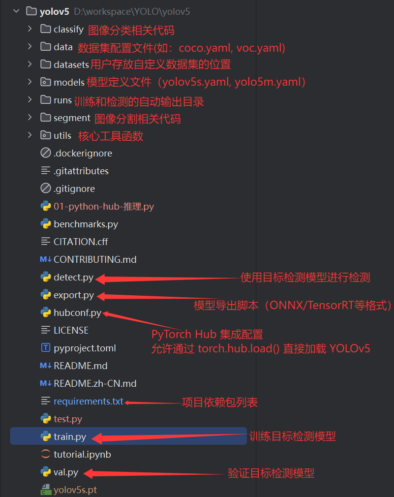

# 模型获取

[yolov5模型开源地址](https://github.com/ultralytics/yolov5)


# yolov5模型文件结构

##### 主体结构：




# 使用终端进行训练、验证和检测

## 训练

```bash
python train.py --data datasets/car/car.yaml --weights yolov5s.pt --cfg models/yolov5s.yaml --epochs 50 --batch-size 16 --workers 8 --device 0 
    
    --data：指定训练数据集配置文件的，这个配置文件中的内容就是数据集的访问位置和类别信息
    --weights：预训练模型的权重文件
        1.如果不需要使用预训练模型，从0开始训练，就不需要写
        2.如果需要使用预训练模型，就写上预训练模型的访问路径
    --cfg：模型网络结构配置文件路径，默认空
    --epochs：训练的轮次，默认 100 轮
    --batch-size：批处理大小，一般情况下 2 的倍数
    --workers：数据集加载线程数，如果显存不够，设置小一点
    --device：使用训练模型的设备，gpu（第一张显卡就是 0）、cpu
```

**训练的结果在 runs/train/exp? 中**，这个 ? 是递增的值，比如2 3 4 ....


## 验证

```bash
训练完成模型之后，手动在验证数据集上做验证，得到结果
python val.py --data datasets/car/car.yaml --weights runs/train/exp/weights/best.pt --batch-size 16 --device 0
```

**验证的结果在 runs/train/val? 中**，这个 ? 是递增的值，比如2 3 4 ....


## 检测

```bash
python detect.py --weights yolov5s.pt --source img.jpg --save-crop

	--source：可以是数字或路径
		1.数字0代表使用摄像头
		2.如果是指向一个文件夹的路径，会将这个文件夹中的所有图片都检测
		3.如果是指向一张图片的路径，就只检测这张图片
	--save-crop：这个参数后面不跟值
		加上：检测的结果就是 原图+裁剪后的目标检测结果，不保存检测后的图片
```

**检测的结果在 runs\detect\exp? 中**，这个 ? 是递增的值，比如2 3 4 ....

YOLOV5 中，摄像头推理的结果是一个视频，.mp4 格式

# 使用 torch.hub.load 加载模型进行检测

```python
import torch

# 加载模型
model = torch.hub.load("ultralytics/yolov5", "custom", path='runs/train/exp/weights/best.pt')
""" 
torch.hub.load(
     repo_or_dir: str,  # GitHub仓库路径或本地目录路径(会触发自动下载)
     model: str,        # 指定加载的模型类型("custom"：加载自定义训练的模型；"yolov5"：加载小模型)
     *,
     path: str = "",    # 本地模型路径（model="custom" 时生效）
     ) -> Any
"""

# 图片路径
img = "datasets/car/test/images/01-90_265-231&522_405&574-405&571_235&574_231&523_403&522-0_0_3_1_28_29_30_30-134-56.jpg"

# 推理
results = model(img)

# 打印结果
results.print()

# 展示检测后的图片
results.show()

# 保存检测后的图片
results.save()    

# 裁剪检测结果，返回一个列表，列表中每一个元素都是一个字典（这个方法会自动将裁剪结果保存）
# dict_keys(['box', 'conf', 'cls', 'label', 'im'])
crops = results.crop()
```

