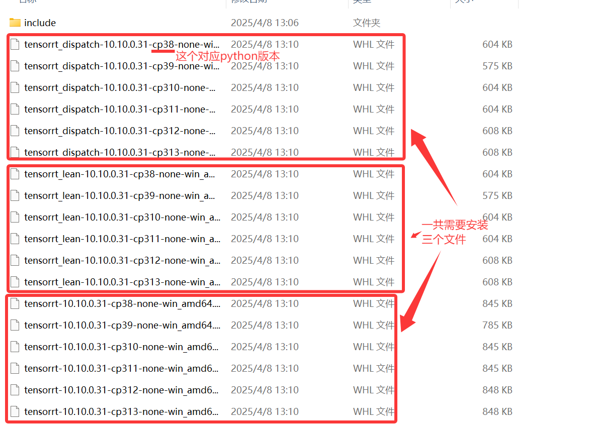
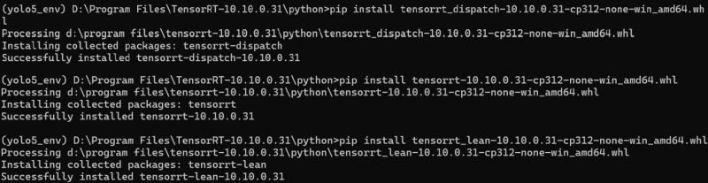
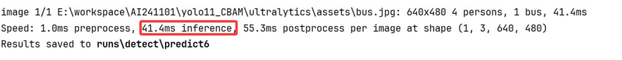
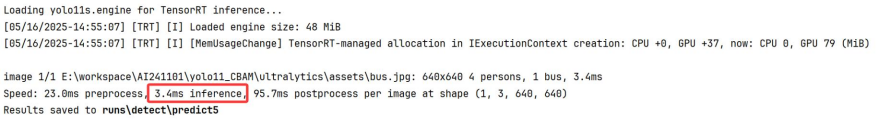
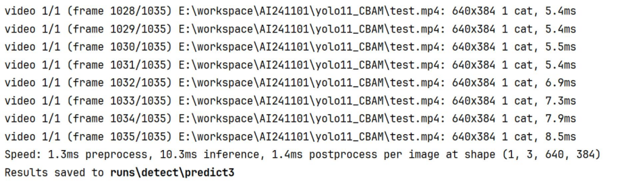
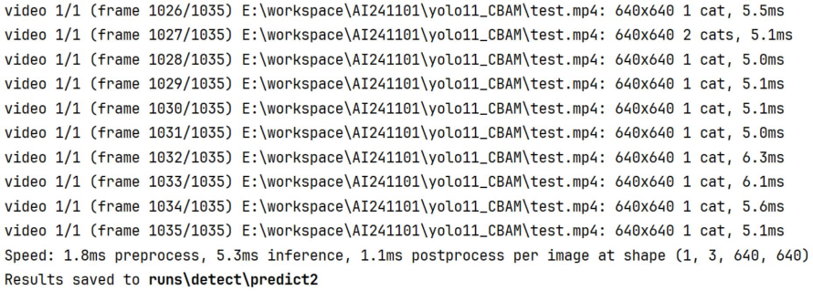

### 一、TensorRT 加速推理

- TensorRT 是由 NVIDIA 开发的一个用于高性能深度学习推理的库。它能够加速在 NVIDIA GPUs 上运行的深度学习模型，支持所有主要的深度学习框架，如 TensorFlow、Caffe2、ONNX、 PyTorch 等。

- 主要特点：
  - **高性能**：TensorRT 通过优化计算图和使用低精度计算（如 FP16 和 INT8）来提升推理速度。
  - **模型优化**：它可以自动执行一系列优化操作，包括层融合、内核自动调优等，以减少延迟并提高吞吐量。
  - **跨平台部署**：TensorRT 支持多种平台，从嵌入式设备到数据中心服务器，使得模型可以在不同的环境中高效地部署。
  - **易于集成**：提供对 C++ 和 Python 的 API 支持，可以轻松地与现有的应用程序集成。

- 工作流程：
  - **导入模型**：首先，从一个训练好的模型开始，这个模型可以从任何支持的深度学习框架中导出。
  - **优化模型**：然后， TensorRT 对模型进行优化，这包括减少计算复杂度、优化内存使用以及选择最佳的计算核。
  - **序列化**：优化完成后，可以将优化后的模型序列化为一个计划文件（Plan file），该文件可以在以后直接加载，而无需重新优化模型。
  - **部署**：最后，使用 TensorRT 的运行时环境加载序列化的模型，并执行高效的推理。

- TensorRT 广泛应用于需要实时处理的应用场景中，例如图像识别、自然语言处理、推荐系统等。对于那些寻求在其应用中利用深度学习技术同时又需要保持高性能和低延迟的开发者和公司来说， TensorRT 是一个非常强大的工具。

### 1、安装

- 下载安装 TensorRT ：【https://developer.nvidia.com/tensorrt/download/】
  - 复制 TensorRT-10.10.0.31\bin 中内容到 CUDA 安装目录 \bin。
  - 复制 TensorRT 的 include 文件夹到 CUDA 的 include 文件夹。
  - 复制 TensorRT-10.10.0.31\lib 文件夹中的 lib 文件到 CUDA 的 lib 文件夹， dll 文件到 CUDA 的 bin 文件夹。
  - 进入 conda 环境和对应的文件地址(TensorRT-10.10.0.31/python 文件夹)，安装对应python版本的 xxx.whl 文件(pip install xxx.whl) 。
  
  
  
  
  
  - 验证是否安装成功，输出对应的版本信息即表示成功：

```python
import tensorrt
print(tensorrt.__version__)
```

### 2、应用

- YOLO11 环境下安装三个库：

```bash
pip install onnxslim -i https://pypi.mirrors.ustc.edu.cn/simple/
pip install onnx -i https://pypi.mirrors.ustc.edu.cn/simple/
pip install onnxruntime-gpu -i https://pypi.mirrors.ustc.edu.cn/simple/
```

- 把 Pytorch 模型格式转为 TensorRT 格式：

```python
from ultralytics import YOLO
def tensorRT():
    model = YOLO('yolo11s.pt')
    model.export(format='engine')
if __name__ == '__main__':
    tensorRT()
```

- 使用：

```python
from ultralytics import YOLO
def tensorRT():
    model = YOLO('yolo11s.engine')
    model.predict("ultralytics/assets/bus.jpg", save=True)
def yolo11():
    model = YOLO('yolo11s.pt')
    model.predict("ultralytics/assets/bus.jpg", save=True)
if __name__ == '__main__':
    tensorRT()
    #yolo11()
```

### 3、性能验证

#### 3.1 图片

- **Pytorch 格式**



- **TensorRT 格式**



#### 3.2 视频

- **Pytorch 格式**

  

- **TensorRT 格式**


