# 一、YOLO11

- 官方文档：【https://github.com/ultralytics/ultralytics】

- 开发文档：【https://docs.ultralytics.com/】


## 1、概述	

- YOLO11 是 Ultralytics 团队在 2024 年 9 月 30 日发布的，在速度和精度上进行了改进。它采用更先进的网络结构和训练技巧，支持多种检测任务，包括目标检测和跟踪、实例分割、图像分类、姿态估计等。同时 YOLO11 优化了推理速度，在实时应用中表现更佳

### 1.1 C3K2

- **C3K2 模块** 是基于 **C2F 模块** 的一种变体，它代码中有一个设置
  - 当 `C3K2` 参数为 `False` 时，模块内部使用普通 **Bottleneck**
  - 当 `C3K2` 参数为 `True` 时，模块内部使用 **C3k** 结构

- 代码中的 C3K2 的使用：`[-1, 2, C3k2, [256, False, 0.25]]`
  - -1：该模块的输入来自哪一个模块的输出。-1 表示当前 C3k2 模块的输入 来自上一个模块的输出
  - 2：表示模块内包含 **2 个 C3k 或 Bottleneck 模块**（具体数量需要根据网络版本的深度系数进行调整）
  - C3K2：模块名称，等于搭建该模块的类的名称，用于找到该类去搭建模块
  - 256：输出通道数（实际输出通道数需要乘以宽度系数 `width`）
  - False：True 表示内部使用 C3k 模块；False 表示内部使用 Bottleneck
  - 0.25：用于控制 C3K2 模块中的通道数

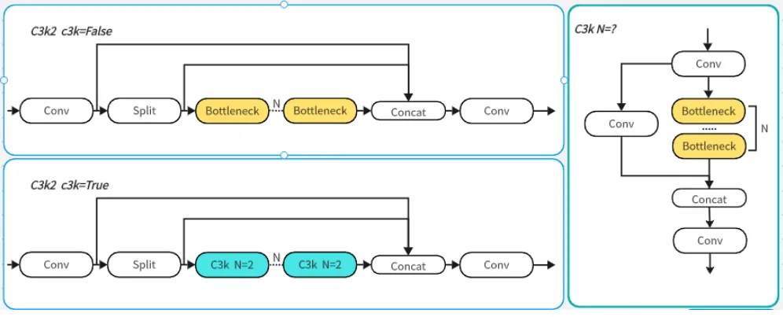

### 1.2 C2PSA

- C2PSA 是对 C2f 模块的扩展，它结合了 PSA（Pointwise Spatial Attention）块，用于增强特征提取与和注意力机制，C2PSA 实现了加入 PSA 块，实现了更强大的注意力机制，从而提高了模型对重要特征的捕捉能力
- C2PSA 模块由两部分构成：**C2f 分支结构**、**PSA（Pointwise Spatial Attention）块**
- 代码中 C2PSA 的使用：`[-1, 2, C2PSA, [1024]]`
  - -1：该模块的输入来自哪一个模块的输出。-1表示 当前 C3k2 模块的输入 来自上一个模块的输出
  - 2：模块内需要使用几个 PSA 模块（具体数量需要根据网络版本的深度系数进行调整）
  - C2PSA：模块名称
  - 1024：输出通道数（实际输出通道数需要乘以宽度系数 `width`）

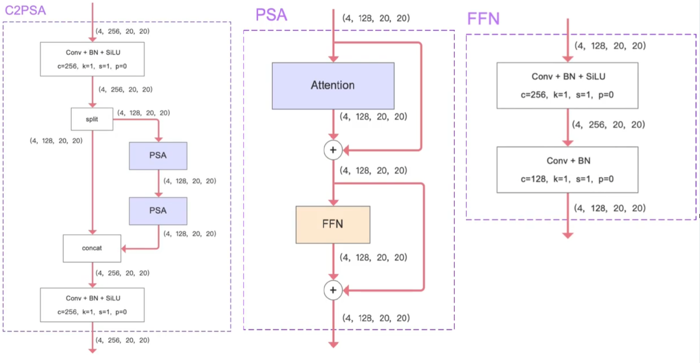

### 1.3 检测头

- YOLO11 在原先的 2 个解耦分类检测头中，进一步增加了两个**深度可分离卷积（DWConv）**，提高了模型的特征提取能力
- 代码中 C2PSA 的使用：`[[16, 19, 22], 1, Detect, [nc]]`
  - [16, 19, 22]：第16、19、22 模块的的输出，作为 Detect 检测头的输入
  - 1：模块重复次数，检测头的重复次数一般都为 1，检测头通常不重复
  - Detect：模块名称，等于搭建该模块的类的名称，用于找到该类去搭建模块
  - nc：类别数

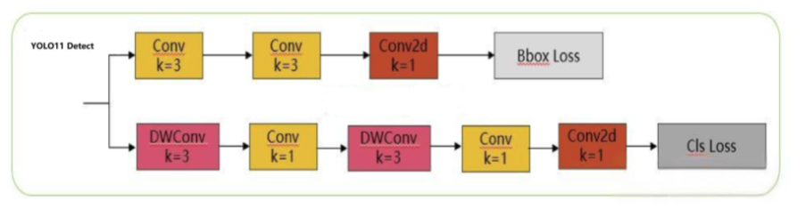

### 1.4 整体结构

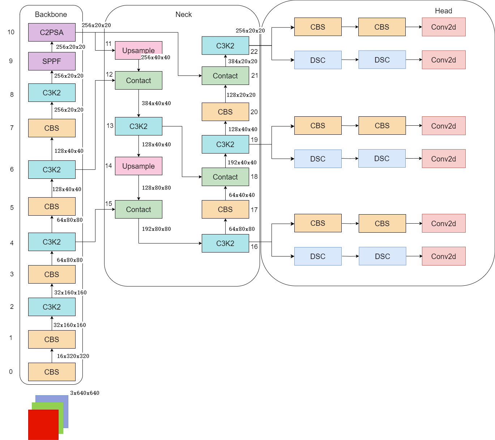

### 1.5 主要特点

- YOLO11采用改进的骨干和颈部架构，增强了特征提取能力，提高了物体检测的精确度

- 针对效率和速度优化：精细的架构设计和优化的训练流程在保持准确性和性能之间最佳平衡的同时，提供更快的处理速度

- 更少的参数，更高的准确度：YOLO11m 在 COCO 数据集上实现了比 YOLOv8m 更高的 mAP，参数减少了 22%，提高了计算效率，同时不牺牲准确度

- 跨环境的适应性：YOLO11 可以无缝部署在边缘设备、云平台和配备 NVIDIA GPU的系统上，确保最大的灵活性

- 支持广泛的任务范围：图像分类、目标检测、实例分割、姿态估计、定向对象检测 (OBB)、多目标跟踪等

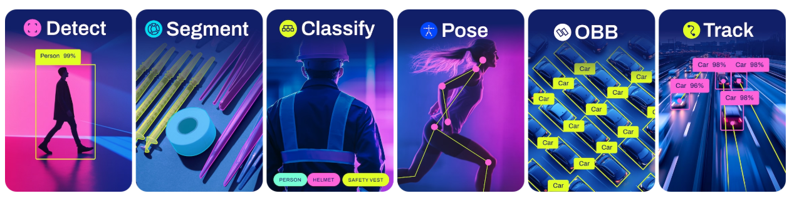

### 1.6 模型对比

- 下图是 YOLOV11 各个模型在 COCO 数据集上的表现：
  - mAP50：IOU 阈值为 0.50 时的平均精度，评估较为宽松，主要反映模型的粗略检测能力
  - mAP50-95：在不同 IOU 阈值下（从 0.50 到 0.95，步长 0.05，共 10 个值）计算 AP 的均值，是更为严谨和全面的性能指标，在报告模型性能时，mAP50-95 能够更好地衡量模型的总体表现，更具参考价值

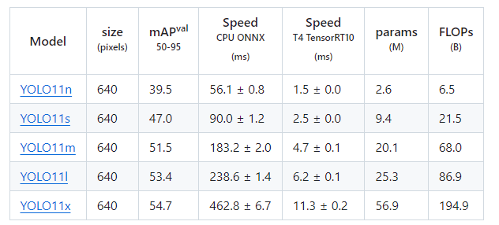

- 和其他 YOLO 版本性能对比图：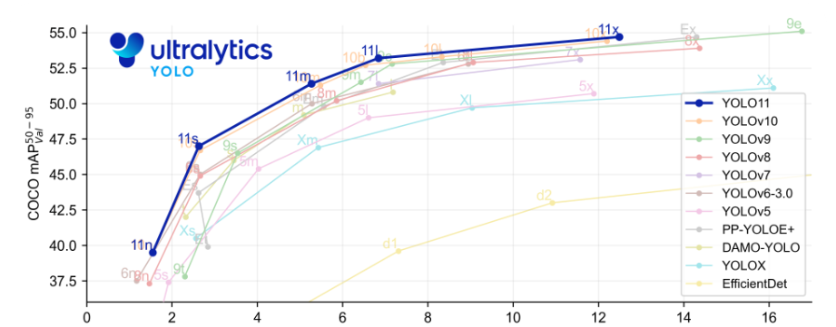

## 2、开源项目

### 2.1 项目构建

- 参考博客：【https://blog.csdn.net/2301_78753314/article/details/143951605】

- 创建虚拟环境

```bash
conda create -n yolov11_env python=3.12
```

- 激活虚拟环境

```bash
conda activate yolov11_env
```

- 在 yolov11_env 虚拟环境中安装库：

  - 在 Python≥3.8 的环境中先根据计算机是否支持 GPU 安装 Pytorch>=1.8，如果没有 GPU 可以不执行这一步【这个下载命令有的有问题，尽量选择 pip 命令下载，如果 cuda 版本太低，先去更新驱动】

  ```py
  # CUDA 12.1
  pip install torch==2.5.0 torchvision==0.20.0 torchaudio==2.5.0 --index-url https://download.pytorch.org/whl/cu121
  ```
  
  - 安装 ultralytics 包及其所有需求
  
  ```py
  pip install ultralytics -i https://pypi.tuna.tsinghua.edu.cn/simple
  ```


- 源码获取：
    - 地址：
      - GitHub：【https://github.com/ultralytics/ultralytics】
    
      - Gitee：【https://gitee.com/monkeycc/ultralytics】
    
    - 分支对比：
      - master：项目的主线，通常代表最新的稳定代码
      - releases：指定版本的稳定发布版本，例如 `v1.0`，`v2.0` 等，用于长期维护，BUG 较少

- pycharm 打开项目，配置 python 解释器为`yolov11_env`虚拟环境

### 2.2 目标检测

- 先下载 yolov11 的权重文件，选择下载一个即可，然后放入项目文件夹中

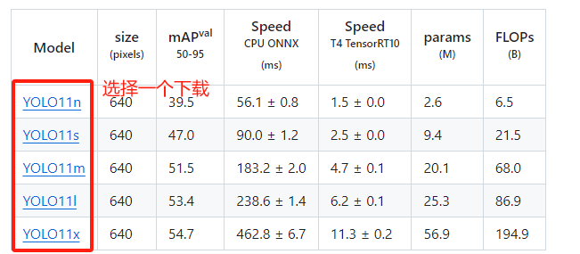

- 执行检测命令：可以选择命令方式，也可以选择代码方式，可以参考网站【https://docs.ultralytics.com/zh/modes/predict/#key-features-of-predict-mode】

```bash
yolo predict model=yolo11s.pt source=datasets/bus.jpg
```

### 2.3 语义分割

- 先下载 yolov11 的权重文件，选择下载一个即可，推荐 yolo11s-seg.pt

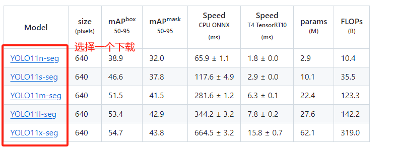

- 执行检测命令：

```bash
yolo predict model=yolo11s-seg.pt source=datasets/bus.jpg
```

### 2.4 图像分类

- 先下载 yolov11 的权重文件，选择下载一个即可，推荐 yolo11s-cls.pt

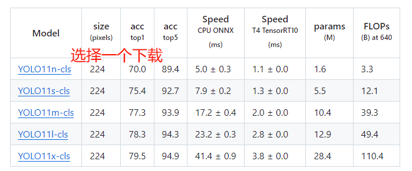

- 执行检测命令：

```bash
yolo predict model=yolo11s-cls.pt source=datasets/bus.jpg
```

## 3、训练和推理代码

### 3.1 检测文件

my_detect.py：检测文件
```py
from ultralytics import YOLO
# 加载训练好的模型，改为自己的路径
model = YOLO('yolo11s.pt')
# 修改为自己的图片路径及文件名
source = 0
# 运行推理，并附加参数
model.predict(source, show=True, save=True)
# model.predict(source,  # 图片或视频的源目录
#               conf=0.5,  # 用于检测的 对象置信阈值，只有置信度高于此阈值的对象才会被检测出来
#               iou=0.7,  # 非极大值抑制(NMS)的交并比(loU)值
#               imgsz=160,  # 输入图像尺寸
#               half=False,  # 使用半精度(FP16)
#               device=0,  # 运行设备，如device=0或device = cpu
#               max_det=300,  # 每个图像的最大检测数
#               # vid_srtide=False,# 视频帧率步长，预测试图片需要注释
#               stream_buffer=False,  # 缓冲所有流帧( True )或 返回最近的帧( Fa1se )
#               visualize=False,  # 是否可视化模型特征
#               augment=False,  # 是否对预测源应用图像增强
#               agnostic_nms=False,  # 是否使用类别不可知(无关)的非极大值抑制(NMS)
#               classes=None,  # 按类别筛选结果，即classes=0或classes=[0,2,3]
#               retina_masks=False,  # 是否使用高分辨率的分割掩膜
#               embed=None,  # 返回给定层的特征向量/嵌入
#               show=False,  # 如果环境允许，是否显示预测的图像和视频
#               save=True,  # 是否保存预测的图像和视频
#               save_frames=False,  # 是否保存预测的单个视频帧
#               save_txt=False,  # 是否将结果保存为 .txt 文件
#               save_conf=False,  # 是否将检测结果与置信度分数一起保存
#               save_crop=False,  # 是否保存裁剪的图像与结果
#               show_labels=False,  # 是否显示预测标签
#               show_conf=False,  # 是否显示预测置信度
#               show_boxes=False,  # 是否显示预测边界框
#               line_width=None,  # 边界框的线宽(如果为 None ，则缩放为图像大小)
#               )
```

### 3.2 训练文件

- my_train.py：训练代码


```py
from ultralytics import YOLO
"""
	参数	    默认值	                说明
	model	None	                用于训练的模型文件的路径
	data	None	                数据集配置文件的路径（例如 coco8.yaml)
	epochs	100	                    训练历元总数
	batch	16	                    批量大小，可调整为整数或自动模式
	imgsz	640	                    用于训练的目标图像大小
	device	None	                用于训练的计算设备，如 cpu, 0, 0,1或 mps
	save	True	                可保存训练检查点和最终模型权重
	project None                    保存训练结果的项目目录名称
"""
if __name__ == "__main__":
	# 加载模型结构和配置文件
	model = YOLO("yolo11s.pt")
	# 开始训练
	results = model.train(
		data="ultralytics/cfg/datasets/animal.yaml",
		epochs=25,
		batch=8,
		imgsz=640,
		device='0',
		project='runs',
	)
```

# 二、火灾检测

- 使用 Yolov11 训练火焰和烟雾数据集，完成多目标检测实战项目，可实时检测图像、视频、摄像头和流媒体（http/rtsp）中火焰和烟雾，后期可以加入可视化演示界面

- 做项目其中一个非常重要的目的就是把小白级别的坑先跳完，不要进到公司之后再去犯基本的错误

- 确实有难度或者零星的小白错误，别人是可以理解的，也一定会帮你


## 1、项目名称

- 基于 Yolov11 的火焰和烟雾检测系统

- 可以自定义项目


## 2、项目简介

- 本项目旨在利用 Yolov11 进行实时火焰和烟雾检测

- 项目目录构造解析：【https://blog.csdn.net/java1314777/article/details/142956985】

  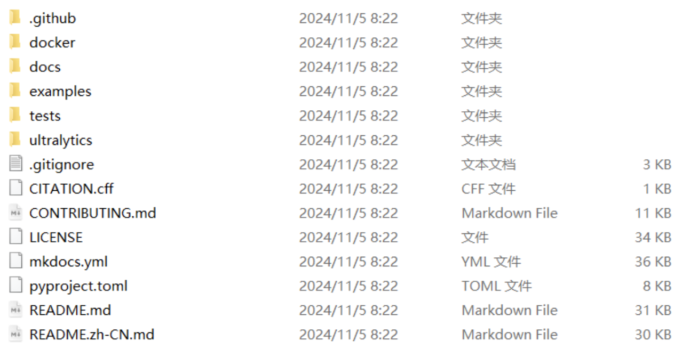

  - `.github`：这些文件共同支持项目的自动化管理，包括代码质量保证、持续集成和部署、社区互动和依赖项维护
  - `docker`：每个文件都是为不同环境或平台配置的。针对不同平台、环境的Docker配置文件，这些配置文件是用来部署用的，用户可以根据自己的需要选择合适的环境来部署和运行项目
  - `docs`：docs 目录通常用来存放文档资料，包括多语言的翻译
  - `examples`：examples 中可以找到不同编程语言和平台的 YOLOV8 实现示例
  - `tests`：tests 目录包括了项目的自动化测试脚本，每个脚本对应项目的不同部分进行测试
  - **`utlralytics`：**这个目录包含了 YOLO 所有的功能
    - `assets`：里面是 YOLO 自带的两张图片
    - **`cfg`：**包含模型配置文件，cfg 目录就是项目配置的集中地
      - `datasets`：包含数据集的配置文件，如数据路径，类别信息等
      - `models`：存放模型配置文件，定义了模型结构和训练参数等，是我们改进或就基础版的一个 yaml 文件配置的地方
      - `trackers`：用于追踪算法的配置
      - `solutions`：包含一些预定义的解决方案、案例，或者与具体应用场景相关的代码
      - `default.yaml`：项目的默认配置文件，包含了被多个模块共享的通用配置项
    - **`models`：**这个目录下面是 YOLO 仓库包含的一些模型的方法实现
    - **`nn`：**包含了模型的网络结构定义

## 3、技术架构

- **模型**：Yolov11
- **环境**：Python、OpenCV、PyTorch、Anaconda

## 4、数据集

### 4.1 数据集下载

- 地址：【https://github.com/siyuanwu/DFS-FIRE-SMOKE-Dataset】
- 百度云盘地址：【https://pan.baidu.com/s/1-kV1h78BwuNe-A86cDUuvQ】，提取码`pnxx`


### 4.2 数据集处理

- 需要把 xml 中标注的信息转换为 txt，用以适配 YOLO 需求，代码参考如下：

```python
import os
import xml.etree.ElementTree as ET

# 分类信息
classes = ['_background_', 'fire', 'other', 'smoke']


# 解析 xml 文件
def parse_xml(xml_path, txt_path):
    xml_files = os.listdir(xml_path)
    for xml_file in xml_files:
        # 文件名
        file_name = xml_file.split('.')[0]
        tree = ET.parse(os.path.join(xml_path, xml_file))
        root = tree.getroot()
        # 获取下一级的 size
        size = root.find('size')
        # 获取下一级的 height、width
        height = int(size.find('height').text)
        width = int(size.find('width').text)
        # 获取下面所有的 object
        for obj in root.findall('object'):
            name = obj.find('name').text
            bndbox = obj.find('bndbox')
            xmin = bndbox.find('xmin').text
            ymin = bndbox.find('ymin').text
            xmax = bndbox.find('xmax').text
            ymax = bndbox.find('ymax').text
            # 归一化
            x_center = (float(xmin) + float(xmax)) / (2 * width)
            y_center = (float(ymin) + float(ymax)) / (2 * height)
            w = (float(xmax) - float(xmin)) / width
            h = (float(ymax) - float(ymin)) / height
            # 写入 txt 文件
            with open(os.path.join(txt_path, file_name + '.txt'), 'a') as f:
                f.write(f'{classes.index(name)} {x_center} {y_center} {w} {h}\n')


if __name__ == '__main__':
    xml_path = r'E:\workspace\AI\ultralytics-main\datasets\fireDetectVOCfinal\Annotations'
    txt_path = r'E:\workspace\AI\ultralytics-main\datasets\fireDetectVOCfinal\labels'
    parse_xml(xml_path, txt_path)
```

## 5、模型训练

- 相关操作请参考官方文档：【https://docs.ultralytics.com/modes/train/#usage-examples】
- 不使用命令的话，可以选择 python 文件的方式
- 训练命令：


```python
# 适合从零开始训练一个全新的模型，或者当你想要自定义模型架构时
yolo detect train data=coco8.yaml model=yolo11s.yaml epochs=100 imgsz=640

# 【推荐】用于需要快速开始训练或直接进行推理的情况。这是最常见的方式，因为它避免了从头开始训练所需的时间和资源
yolo detect train data=coco8.yaml model=yolo11s.pt epochs=100 imgsz=640

# 当你有特定的模型架构需求，并且希望确保架构与预训练权重一致时使用
yolo detect train data=coco8.yaml model=yolo11n.yaml pretrained=yolo11n.pt epochs=100 imgsz=640
```

- 继续训练： 不要用 best


```python
yolo train resume model=path/to/last.pt
```

- 训练可以用下面命令：

```bash
yolo detect train data=ultralytics/cfg/datasets/fire.yaml model=yolo11s.pt epochs=10 imgsz=640
```

- python 文件的方式训练

```py
from ultralytics import YOLO


if __name__ == "__main__":
    # 加载模型结构和配置文件
    model = YOLO("yolo11s.pt")
    # 开始训练
    results = model.train(
        data="ultralytics/cfg/datasets/fire.yaml",
        epochs=10,
        batch=8,
        imgsz=640,
        device='0',
        project='runs',
    )
```

## 6、性能验证

- 相关操作请参考官方文档：【https://docs.ultralytics.com/modes/val/#key-features-of-val-mode】


```python
yolo detect val model=runs/train/weights/best.pt data=ultralytics/cfg/datasets/fire.yaml
```

- 性能结果：


```python
Class     Images  Instances    Box(P          R      mAP50  mAP50-95)
all       1958       5272      0.495      0.426      0.436      0.217
fire      1697       3013      0.559      0.631      0.637       0.34
smoke      817       1224      0.593      0.415      0.452      0.219
other      460       1035      0.334      0.234      0.217     0.0936
```

- 可以设置不同的置信度和阈值来观察效果：默认值是0.001


```python
yolo detect val model=runs/train/weights/best.pt data=ultralytics/cfg/datasets/fire.yaml conf=0.5 iou=0.6
```

- 此时的性能结果：召回率明显下降，mAP明显提升


```python
Class     Images  Instances    Box(P          R      mAP50  mAP50-95)
all       1958       5272      0.843      0.191      0.518      0.334
fire      1697       3013      0.878       0.35      0.617      0.408
smoke      817       1224      0.893      0.177      0.534      0.337
other      460       1035      0.758     0.0454      0.402      0.257
```

## 7、性能优化

- 采用各种方式对网络性能进行优化


### 7.1 增大训练图片分辨率

- 训练数据集各种尺寸都有，有些大于 1280，这里我们把 imgsz 设置到 1280，经验证效果不错


```python
yolo detect train data=cfg\datasets\fire.yaml model=cfg\models\11\yolo11s.yaml epochs=10 imgsz=1280 batch=8
```

### 7.2 数据增强设置

- ultralytics\cfg\default.yaml


```python
mosaic: 1.0 # (float) image mosaic (probability)
mixup: 0.36 # (float) image mixup (probability)
copy_paste: 0.33 # (float) segment copy-paste (probability)
```

- 命令行设置超参数：


```python
yolo detect train data=cfg\datasets\fire.yaml model=cfg\models\11\yolo11s.yaml epochs=10 imgsz=1280 batch=8 mixup=0.36 copy_paste=0.33
```

### 7.3 使用更大的网络

- 可以尝试使用 m、l 甚至 x 进行训练，有助于提升精度


### 7.4 改变置信度和IoU

- 在推理的时候设置这些参数，有助于精度的提升

### 7.5 更多优化思路

- 使用 yolo11 的m、l和大分辨率 1280 输入
- 更多超参数调整
- 添加注意力机制
