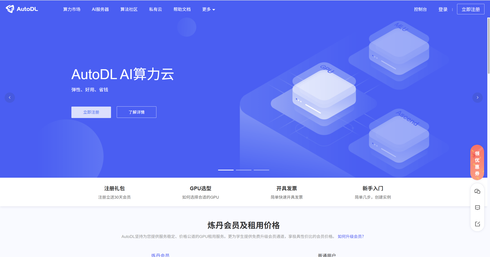
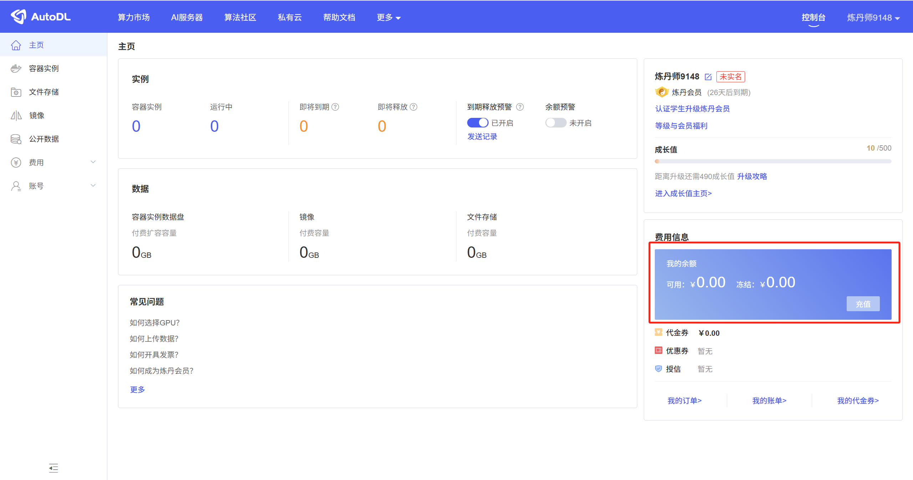
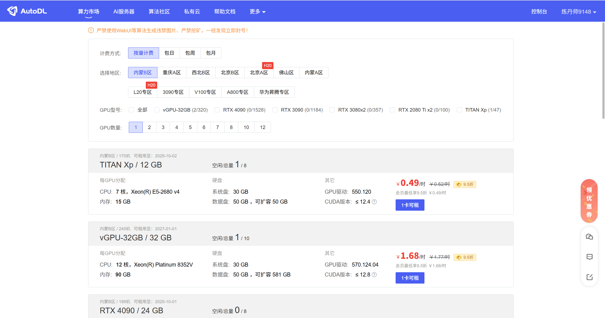
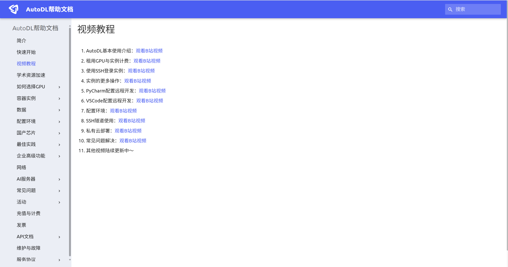

# 一、算力租赁

- 算力租赁指的是通过互联网租用计算资源（如CPU、GPU等）来执行计算密集型任务，例如人工智能模型训练、大数据分析、科学计算等

- 国内平台

  - **阿里云**：提供多种类型的云服务器和 GPU 实例

  - **腾讯云**：提供高性能的计算资源，包括 GPU 云服务器

  - **华为云**：提供可靠、安全的云计算服务，适用于企业的数字化转型

  - **算家云**：主要面向 AI 行业中小微企业和高校师生提供 GPU 算力服务

  - **潞晨云**：提供顶级 GPU 租赁服务，并有优惠活动

  - **博拉网络好易智算**：一站式 AI 服务平台，提供全球顶尖 GPU 算力资源

  - **智星云**：提供高性价比的 GPU 租用服务，适用于AI大模型训练等场景

  - **小牛云**：异构 GPU 算力平台，加速AI深度学习等多种应用

  - **厚德云**：专业的 AI 算力云平台，提供稳定可靠的 GPU 算力解决方案

  - **DeepLn算力云**：提供高性价比的算力服务
  - **AutoDL优云智算**：提供高性价比的算力服务

## 1、AutoDL

- 租赁 AutoDL 优云智算算力步骤如下：

  - 打开网站：【https://www.compshare.cn/】

  

  - 注册账号、登录（可以直接微信扫码）
  - 充值

  

  - 进入算力市场，查找可租赁算力（建议按小时租赁，划算），最好早多卡可租的

  

  - 剩余操作，可以根据官网文档来实现：【https://autodl.com/docs/video/】

  