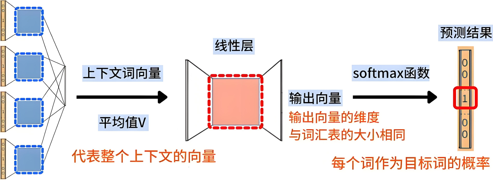

# 一、自然语言处理

## 1. NLP初识

NLP是计算机用来处理人类语言的一门学科和技术。

|  |
| :----------------------------------------------------------: |
|                  自然语言处理是一门交叉学科                  |

### 1.1 关联学科

- Machine Learning - 机器学习
- Computer  Science/IT - 计算机科学/信息技术
- ArtificialIntelligence - 人工智能
- NLP - 自然语言处理
- Deep Learning- 深度学习
- Software Development - 软件开发
- Linguistics - 语言学


### 1.2 必备基础

- 较好的计算机基础，如pyThon编程；
- 熟悉深度学习理论知识及框架，如pyTorch；
- 能考上大学的必备语言知识，如语文、英语等；
- 数学基础：3blue1grown


### 1.3 存在的困难

|  |
| :----------------------------------------------------------: |
| 货拉拉拉不拉拉布拉多这货要看拉布拉多这货在坐货拉拉的时候拉不拉粑粑~ |

- 自然语言存在歧义性和多样性；
- 需要大量的知识和推理；


## 2. 发展历史

自然语言处理的发展并不是一时兴起，而是新中国成立以来长期的沉淀和积累。

### 2.1 第一阶段

1960s，主要基于规则。

|  |
| :----------------------------------------------------------: |
|                            ELIZA                             |

**特点：**

   - NLP研究主要是基于规则的，使用手工编写的语法和语义规则。

   - 专家系统和知识库成为主流，尝试通过大量规则来处理语言。

**局限性：**

   - 规则系统难以扩展，面对大规模文本时性能下降。
   - 语言的多样性和模糊性使得手工规则难以全面覆盖。

### 2.2 第二阶段

1990s，统计方法兴起，出现了基于统计方法的自然语言处理。

|  |
| :----------------------------------------------------------: |
|                         垃圾邮件分类                         |

**特点：**

   - 通过标注数据，人工定义特征，构建机器学习系统。
   - 隐马尔可夫模型（HMM）和最大熵模型（MaxEnt）在语音识别和文本分类中得到广泛应用。
   - 主要用于垃圾邮件分类、关键信息提取、句法分析等

 **局限性：**

- 统计模型需要大量标注数据，训练成本高。

### 2.3 第三阶段

2010s，基于深度学习的自然语言处理。

   - 2010年代：深度学习技术，特别是RNN和CNN，在NLP中取得突破性进展。

   - 2013年：Word2Vec模型的提出，使得词嵌入（word embeddings）成为NLP中的标准技术。

   - 2018年：Transformer模型的提出，特别是BERT和GPT等预训练语言模型，极大提升了NLP任务的性能。

### 2.4 第四阶段

2020s，大语言模型。LLM表现出色，推动了自然语言生成和理解的发展。

- 通过构建大语言模型，结合海量无监督文本，构建智能系统。
- 常见的有GPT、DeepSeek、QWen等。
- 于是，NLP火了。

### 2.5 未来趋势

   - 多模态学习：结合文本、图像、音频等多种模态的数据进行理解和生成。
   - 可解释性和伦理：提高NLP系统的透明度和公平性，解决傲慢与偏见以及伦理问题（范式：大模型+微调+知识库）。
   - 个性化：开发能够理解和生成个性化内容的NLP系统。


## 3. 应用场景

需要理解语义的场景，都离不开NLP。

|  |
| :----------------------------------------------------------: |
|                           机器翻译                           |

1. **机器翻译**

- 场景：将一种语言自动翻译成另一种语言。
- 应用：Google翻译、DeepL等。

2. **情感分析**

- 场景：分析文本中的情感倾向（正面、负面、中性）。
- 应用：社交媒体监控、客户反馈分析。

3. **语音识别**

- 场景：将语音转换为文本。
- 应用：语音助手（如Siri、Alexa）、语音输入法。

4. **文本生成**

- 场景：自动生成连贯的文本内容。
- 应用：新闻摘要、内容创作、聊天机器人。

5. **个性化推荐**

- 场景：根据用户行为和偏好推荐内容。
- 应用：电商、流媒体平台。

6. **聊天机器人**

- 场景：模拟人类对话，提供信息或服务。
- 应用：客户服务、虚拟助手。


## 4. 任务介绍

自然语言处理NLP可以从自然语言理解和自然语言生成两个方向来分类。

### 4.1 NLU&NLG

**NLU**

- 自然语言理解，Natural Language Understanding。

- 理解语言、文本等，提取出有用的信息，供下游任务使用。
- 常见任务：情感分析、文本分类、命名实体识别、机器阅读理解、语义匹配等。

**NLG**

- 自然语言生成，Natural Language Generative。
- 根据结构化的数据、文本、图表、音频、视频等，生成人类可以理解的自然语言形式的文本。
- 常见任务：翻译、文本摘要、文本生成等。

| NLP 范式               | NLU 任务                 | NLG 任务                   |
| ---------------------- | ------------------------ | -------------------------- |
| 规则驱动范式           | 规则匹配、句法分析       | 规则模板生成、固定句式回复 |
| 统计学习范式           | 词性标注、NER、主题建模  | 统计翻译、文本生成         |
| 深度学习范式           | 语义匹配、情感分析       | 端到端翻译、文本摘要       |
| 大模型驱动范式         | 预训练模型微调、语义搜索 | GPT 文本生成、风格化写作   |
| 生成式 AI & 多模态范式 | 多模态理解、视觉问答     | 文生文、文生图、文生音     |

### 4.2 文本分类

在自然语言处理（NLP）任务中，文本分类是一个重要的应用方向。

#### 4.2.1 应用场景

- 垃圾邮件分类：诈骗的、色情的、反动的、广告的。
- 电商领域：对用户评论进行性能的、售后的、体验的、价格的正向和负向的分类。
- 机器人对话：类似智能客服，需要识别客户意图。
- 舆情监控：网络不是法外之地。


#### 4.2.2 分类形式

| 二分类                                                       | 多分类                                                       | 多标签分类                                                   |
| ------------------------------------------------------------ | ------------------------------------------------------------ | ------------------------------------------------------------ |
| 将文本分为两个互斥的类别，如“正面/负面”、“垃圾邮件/正常邮件”等。 | 将文本分为多个互斥类别（每个文本仅属于一个类别）             | 每个文本可能属于多个类别，而不是互斥的                       |
|  |  |  |
| 情感分析（好评/差评） 垃圾邮件检测（垃圾邮件/正常邮件） 诈骗检测（欺诈/正常） | 新闻分类（政治/娱乐/科技/体育） 主题检测（教育/健康/金融/游戏） 客服工单自动分类（故障/咨询/投诉） | 论文（属于“深度学习”和“计算语言学”） 音乐风格（流行+电子、摇滚+金属） 多标签情感分析（正面+惊讶，负面+愤怒） |
| **二分类常用方法**                                           | **多分类常用方法**                                           | **多标签分类常用方法**                                       |
| 逻辑回归、SVM、LSTM、TransFormer、BERT                       | 朴素贝叶斯、CNN、BERT                                        | KNN、LSTM、BERT + Sigmoid                                    |


### 4.3 命名实体识别

命名实体识别是一项信息抽取任务，用于识别文本中的特定类别的实体，如人名、地名、机构名、时间、数字等。

|  |
| :----------------------------------------------------------: |
|       命名实体识别，Named Entity Recognition，简写NER        |


NER 任务通常包括两部分：

1. 识别实体边界：Span Detection，找到文本中属于实体的片段。
2. 识别实体类别：Entity Classification，确定该实体属于哪种类别。

#### 4.3.1 应用场景

- 智能客服：自动识别客户姓名、产品名称、订单编号

- 金融分析：识别公司、股票代码、财务术语

- 医疗文本处理：知识图谱，识别疾病、药物、症状、==医疗系统==

- 法律文档分析：识别法条、法规、案件

- 搜索引擎：识别地名、人名，提高搜索结果质量

  

#### 4.3.2 实现过程

命名实体识别是一个序列标注问题。

**定义：**
$$
P(y_1, y_2, y_3, \cdots , y_n | x_1, x_2,x_3, \cdots , x_n, \; \text{Param})
$$

**思路：**

|  |  |
| :----------------------------------------------------------: | :----------------------------------------------------------: |
|                  输入序列和输出序列数量一致                  |                  序列标注就是**分词后分类**                  |

**做的较好的模型：**


### 4.4 机器翻译

机器翻译（MT）是指利用计算机算法将一种语言（源语言）翻译为另一种语言（目标语言）。专业点讲，就是将一个序列转换为另一个序列。


#### 4.4.1 使用场景

- 在线翻译
- 翻译机
- 语音同传技术
- AI眼镜
- 跨语言检索

### 4.5 阅读理解

阅读理解，Machine Reading Comprehension，简称MRC，旨在让计算机能够“理解”文本内容，并能回答与文本相关的问题。

|  |  |
| :----------------------------------------------------------: | :----------------------------------------------------------: |
|                           阅读理解                           |                           框架结构                           |

#### 4.5.1 MRC形式

阅读理解任务可以分为以下几种主要形式：

1. 多项选择式：给定一段文本和若干选项，模型需要从中选择最合适的答案。
2. 区间答案式：答案是原文中的一个子句，模型需要预测答案的起始位置和终止位置。
3. 自由回答式：不限制答案的形式，允许模型自由生成完整的语句。
4. 完形填空式：给定一段文本，其中部分单词或短语被隐藏，要求模型填入正确答案。

阅读理解任务广泛应用于**智能客服、法律文档分析、医疗问答、搜索引擎**等领域。

### 4.6 内容生成

内容生成是让机器自动生成连贯、自然、符合语境的文本，广泛应用于自动写作、新闻摘要、对话系统、代码生成等场景。

#### 4.6.1 常见类型

- 文本摘要

- 文本续写

- 会议纪要

- 代码补全

- 风格迁移


# 二、分词与词向量

分词和词向量是NLP的基础技术。

## 1. 分词

分词是将连续的文本分割成独立的词汇单元（tokens）的过程。这些单元可以是单词、符号或子词。

### 1.1 中文特性

中文句子由连续的汉字组成，没有明显的词边界：词与词之间没有分隔符

- 英文：`I love natural language processing.`
- 中文：`我喜欢自然语言处理。`
- 词是最基本的语义单元。

为了处理文本信息，须将连续的序列分割成有意义的词汇单元。


### 1.2 概念认知

大家进行下颗粒度对齐，以保证后续沟通的准确性。

#### 1.2.1 词表

词表，vocab，是指一个NLP系统中所有可能出现的词汇的集合。它是一个有限的列表，包含了模型任务中用到的所有词汇。

##### 1.2.1.1  特征

词表具备以下特征：

- **有限性**：词表的大小是有限的，通常由训练数据中的词汇决定。
- **覆盖性**：词表应尽可能覆盖任务中可能出现的词汇。
- **索引化**：每个词分配一个唯一的索引（ID），用于在模型中表示该词。

##### 1.2.1.2 作用

- 词表是词向量表示的基础。
- 词表用于将词汇映射为索引，进而转换为词向量。

##### 1.2.1.3 构建

词表通常从大规模语料库中构建，包含所有高频和常见词，并可能经过一定的**去除低频词**的处理。


#### 1.2.2 未登录词

Out-of-Vocabulary, OOV。

##### 1.2.2.1 定义

未登录词是指在测试数据或实际应用中出现，但未包含在训练词表中的词汇。这些词汇对模型来说是未知的。

##### 1.2.2.2 产生原因

1. 词表大小限制：词表大小有限，低频词可能被忽略。
2. 新词：新出现词汇（如网络用语、专有名词）可能未包含在训练数据中。
3. 数据差异：训练数据和测试数据来自不同领域或时间。

##### 1.2.2.3 处理方式

1. 特殊符号表示：用特殊符号（如`<UNK>`）表示所有未登录词。
2. 子词分割：使用子词分割方法（如Byte Pair Encoding, BPE）将未登录词分解为已知的子词。
3. 动态扩展词表：在测试或应用时动态扩展词表，将未登录词加入词表。

#### 1.2.3 词频和词频概率

词频 ≠ 词频概率，但两者密切相关。

##### 1.2.3.1 词频

词频，Frequency，指的是一个词在语料库中出现的次数，例如：

- `"研究"` 出现了5000 次
- `"生命"` 出现了3000 次

词频是一个**整数**，代表出现次数。

##### 1.2.3.2 词频概率

词频概率，Word Probability， 是基于词频计算的相对概率，即：
$$
P(w) = \frac{\text{词 w 的出现次数}}{\text{所有词的总出现次数}}
$$
==例如：==

假设所有词的总出现次数是1000万次，那么： 
$$
P("研究") = \frac{5000}{10000000} = 0.0005 \\
P("生命") = \frac{3000}{10000000} = 0.0003
$$

#####  1.2.3.3 二者对比

如果直接用词频数值（如5000、3000）来计算联合概率，会遇到**尺度不统一**的问题，导致一些高频词被过度偏好。

- 词频是一个整数，不能直接用于概率计算。
- 归一化：把词频转换成概率，使得所有词的概率和为1。

所以，更多的我们使用词频概率作为分词的参考值。

#### 1.2.4 TF-IDF

Term Frequency-Inverse Document Frequency，TF-IDF，词频-逆文档频率。

词频-逆文档频率是一种常用的文本特征提取方法，用于衡量单词在文档中的重要性，特别适用于关键词提取、搜索引擎排名、文本分类等任务。

##### 1.2.4.1 TF

词频，Term Frequency，TF，表示一个词在文档中出现的频率，公式：
$$
\text{TF}(t, d) = \frac{\text{词 } t \text{ 在文档 } d \text{ 中出现的次数}}{\text{文档 } d \text{ 中所有词的总数}}
$$

- **作用**：衡量一个词在文档中的重要性。词频越高，说明该词在文档中越重要。
- **局限性**：某些停用词（如的、是、得、地）在文档中频繁出现，但并没有实际意义，单靠TF无法准确衡量词的重要性。


##### 1.2.4.2 IDF

逆文档频率，Inverse Document Frequency，用于衡量一个词在整个语料库中的普遍重要性，公式：
$$
\text{IDF}(t, D) = \log \left( \frac{\text{语料库中文档总数}}{\text{包含词 } t \text{ 的文档数} + 1} \right)
$$

- **作用**：如果一个词在大多数文档中都出现（如停用词），它的IDF值会很低；
- **意义**：降低常见词权重，提升稀有词权重。


##### 1.2.4.3 TF-IDF
TF-IDF是TF和IDF的乘积，公式：
$$
\text{TF-IDF}(t, d, D) = \text{TF}(t, d) \times \text{IDF}(t, D)
$$

- **意义**：TF-IDF 值越高，说明该词在当前文档中越重要，同时在整个语料库中越稀有。


##### 1.2.4.4 TF-IDF应用

- 关键词提取：通过计算每个词的 TF-IDF 值，可以提取文档中最重要的关键词。
- 文本相似度计算：将文档表示为 TF-IDF 向量后，可以通过计算向量之间的余弦相似度来衡量文档的相似性。
- 文本分类：TF-IDF 可以作为特征输入到机器学习模型中，用于文本分类任务。
- 搜索引擎：搜索引擎利用 TF-IDF 计算文档的相关性，排序搜索结果
- 自动摘要：选取高 TF-IDF 词构成摘要


##### 1.2.4.5 案例助解
语料库：

```apl
文档1：我爱自然语言处理
文档2：自然语言处理很有趣
文档3：我爱编程
```

计算词“自然语言”在文档1中的 TF-IDF 值：

1. **计算 TF**：
   - 词==自然语言==在文档 $1$ 中出现了 $1$ 次。
   - 文档$1$总词数为 $4$ ==我、爱、自然语言、处理==。
   - $\text{TF} = \frac{1}{4} = 0.25$

2. **计算 IDF**：
   - 语料库中文档总数为 $3$。
   - 包含==自然语言==的文档数为 $2$  ==文档1和文档2==。
   - $\text{IDF} = \log \left( \frac{3}{2 + 1} \right) = \log(1) = 0$

3. **计算TF-IDF**：
   - $\text{TF-IDF} = 0.2 \times 0 = 0$

##### 1.2.4.6 TF-IDF优缺点
- 优点：

  - 简单有效，易于理解和实现。

  - 能够突出文档中的关键词。

  - 适用于大多数文本挖掘任务。


- 缺点：

  - 无法捕捉词与词之间的关系（如语义信息）。

  - 对短文本效果较差。

  - 无法处理一词多义和多词一义的问题。


##### 1.2.4.7 TF-IDF实现
可以使用 `sklearn` 库计算 TF-IDF：

```python
import jieba
from sklearn.feature_extraction.text import TfidfVectorizer
import pandas as pd
# 示例文档
documents = ["我爱自然语言处理", "自然语言处理很有趣", "我爱编程"]
# 自定义全模式分词函数
jieba.add_word("我爱")
def jieba_tokenizer(text):
    return " ".join(jieba.cut(text))

# 使用全模式进行分词
tokenized_documents = [jieba_tokenizer(doc) for doc in documents]
# 初始化 TF-IDF 向量化器
vectorizer = TfidfVectorizer()
# 计算 TF-IDF 值
tfidf_matrix = vectorizer.fit_transform(tokenized_documents)
# 获取词汇表
feature_names = vectorizer.get_feature_names_out()
# 打印 TF-IDF 结果
df = pd.DataFrame(tfidf_matrix.toarray(), columns=feature_names)
print(df)
```

**输出：**
```apl
        处理      我爱       有趣       编程   自然语言
0  0.577350  0.577350  0.000000  0.000000  0.577350
1  0.517856  0.000000  0.680919  0.000000  0.517856
2  0.000000  0.605349  0.000000  0.795961  0.000000
```


#### 1.2.5 有向无环图

Directed Acyclic Graph，**DAG**。

##### 1.2.5.1 DAG认知

有向无环图是图论中的一种数据结构，由顶点Vertices和边Edges组成，其中：

- 每条边都有明确的方向；
- 整个图是无环的，即图中**不存在**从一个顶点出发，经过一系列边后又回到该顶点的路径。

##### 1.2.5.2 DAG与分词


- 有向：Directed，边有方向，比如从 **起始字符** 到 **可能的下一个词**。
- 无环：Acyclic，不会形成环，保证分词时不会无限循环。
- 句子中的字符作为顶点Vertices，可能的分词作为边Edges。
- 找到所有可能的分词路径，形成一个“分词图”


##### 1.2.5.3 案例助解

假设字典中包含：`"研究"`   `"研究生"`  `"生命"` `"生"` `"命"` `"起源"`

```python
import jieba
text = "研究生命起源"
dag = jieba.get_DAG(text)  # 获取 DAG
print(dag)
```

**示例输出**：

```python
{0: [0, 1, 2], 1: [1], 2: [2, 3], 3: [3], 4: [4, 5], 5: [5]}
```

文本：`"研究生命起源"`

```asciiarmor
索引:  0   1   2   3   4   5
字符:  研  究  生   命  起   源
```

**具体解释**

👉 `0: [0, 1, 2]`

- 索引 `0` 处的 `"研"` 可以是一个单独的词 → `0 → 0` (`"研"`)
- 索引 `0` 到 `1` 形成 `"研究"` → `0 → 1` (`"研究"`)
- 索引 `0` 到 `2` 形成 `"研究生"` → `0 → 2` (`"研究生"`)

👉 `1: [1]`

- 索引 `1` 处的 `"究"` 只能单独成词 → `1 → 1` (`"究"`)

👉 `2: [2, 3]`

- 索引 `2` 处的 `"生"` 可以是一个单独的词 → `2 → 2` (`"生"`)
- 索引 `2` 到 `3` 形成 `"生命"` → `2 → 3` (`"生命"`)

👉 `3: [3]`

- 索引 `3` 处的 `"命"` 只能单独成词 → `3 → 3` (`"命"`)

👉 `4: [4, 5]`

- 索引 `4` 处的 `"起"` 可以是一个单独的词 → `4 → 4` (`"起"`)
- 索引 `4` 到 `5` 形成 `"起源"` → `4 → 5` (`"起源"`)

👉 `5: [5]`

- 索引 `5` 处的 `"源"` 只能单独成词 → `5 → 5` (`"源"`)

**可视化 DAG**

从 DAG 的角度看，可以画出一张图：

```asciiarmor
  研 → 究 → 生 → 命 → 起 → 源
  |    |    |    |    |    |
  v    v    v    v    v    v
  研   究    生   命   起   源  （单字成词）
  |____|
  研究
  |________|
  研究生
       |____|
       生命
            |____|
            起源
```

- 单个字可以独立成词
- 部分字符组合可以形成更长的词

🔹 **路径示例：**可能的分词方案

1. `["研究生", "命", "起源"]`
2. `["研究", "生命", "起源"]`
3. `["研", "究", "生命", "起源"]`


### 1.3 分词挑战

分词非常重要，但中文分词面临一些独特的挑战：

#### 1.3.1 歧义问题

中文中存在大量歧义切分问题。例如：

```javascript
“结婚的和尚未结婚的”可以切分为：
- 结婚/的/和/尚未/结婚/的
- 结婚/的/和尚/未/结婚/的
```


#### 1.3.2 未登录词问题

未登录词（Out-of-Vocabulary, OOV）是指未出现在分词词典中的词汇，如新词、专有名词、网络用语等。

**解决思路：**

- 复杂机构名通常由命名实体识别来完成。
- 新词通常由专门的新词发现工作负责。
- 专业领域的术语通常由信息抽取工作负责。
- 数词、时间词、词语的变形组合可以通过制定语法规则进行的处理。

#### 1.3.3 标准不统一

中文分词的标准尚未完全统一，不同任务可能需要不同的分词粒度。例如:

```js
“自然语言处理”可以切分为：
- 细粒度：自然/语言/处理
- 粗粒度：自然语言/处理
```


### 1.4 分词方法

分词的方法比较多，我们这里认知一下。

#### 1.4.1 基于规则的分词

采用人工设定的词典和规则进行匹配，如正向最大匹配法（FMM）、逆向最大匹配（RMM）、双向最大匹配（BMM）。

ForwardMaxMatch

|  |
| :----------------------------------------------------------: |
|                          最大匹配法                          |

==最大匹配法基本步骤如下：==

1. 从文本中选取长度为 $6-8$ 个汉字的字符串作为最大字符串。
2. 将其与词表匹配：
   - 若匹配成功，则作为一个词切分；
   - 若失败，则去掉末尾一个汉字，继续匹配，直到成功或字符串为空。
3. 重复上述过程，直到整个文本被切分完毕。

==逆向最大匹配法则是从后往前匹配：==

|  |
| :----------------------------------------------------------: |
|                        逆向最大匹配法                        |

==双向最大匹配法则是正向、逆向都做一次，选择结果比较好的那个==

##### 1.4.1.1 针对歧义问题

在减少歧义问题上，逆向最大匹配法是效果比较好的：

```js
“他是研究生物化学的”的不同的匹配法结果：
- FMM：他/是/研究生/物化/学/的
- RMM：他/是/研究/生物/化学/的
```

RMM更符合汉语的语义结构，因为汉语中心词多在词的右面。

在词典完备、没有任何其它知识的条件下，实验对比如下：

- 正向最大匹配法：1/169
- 逆向最大匹配法：1/245


##### 1.4.1.2 OOV问题

逆向最大匹配法在处理未登录词时表现更好，因为它更倾向于将未登录词切分为已知的右侧词汇。


#### 1.4.2 基于统计的分词

采用统计模型对文本进行分词，如隐马尔可夫模型（HMM）、最大熵模型（ME）。

- 优点：能适应不同领域，处理未登录词能力较强。
- 缺点：依赖于大量的标注数据进行训练。

##### 1.4.2.1 互信息认知

Mutual Information，MI

互信息衡量的是两个字符或子词**同时出现的概率**，可以理解为它们之间的“黏合度”：
$$
MI(x, y) = \log_2 \frac{P(x, y)}{P(x)P(y)}
$$
其中：

- $P(x, y)$ 表示两个字连在一起出现的概率（联合概率）。
- $P(x)$ 和 $P(y)$ 分别表示单独出现的概率（边际概率）。
- $log_2$ 让计算值更直观，通常以 $2$ 为底。

##### 1.4.2.2 互信息举例

```js
人工智能正在改变世界。
```

如果统计出的概率如下：

- P(人工) = 0.05 ：单独出现人工的情况只有一个百分点
- P(智能) = 0.04：单独出现 智能 的情况0
- P(人工智能) = 0.04

那么：
$$
MI(人工, 智能) = \log_2 \frac{P(人工智能)}{P(人工) \times P(智能)} \\
= \log_2 \frac{0.04}{0.05 \times 0.04} = \log_2 \frac{0.04}{0.002} 
= \log_2 20 \approx 4.32
$$
$MI$ 值较高（远大于 0），说明"人工智能"是一个 **高关联短语** ，应被合并成一个词。

**如果换成随机组合的字：**

- P(人工) = 0.05
- P(出错) = 0.01
- P(人工出错) = 0.0001

计算：
$$
MI(人工, 出错) = \log_2 \frac{0.0001}{0.05 \times 0.01} = \log_2 0.2 \approx -2.32
$$
$MI$ 值较小（接近0或为负），说明 “人工出错” 之间 **没有太强的联系**，不应分为一个词。


#### 1.4.3 基于深度学习的分词

采用神经网络，如LSTM/GRU+CRF、BERT等预训练模型。

- **优点**：能够自动学习特征，适应性强。
- **缺点**：计算量大，对数据要求高。


## 2. jieba分词

[Jieba](https://github.com/fxsjy/jieba) 是最流行的中文分词库之一，具有分词、词性标注、关键词抽取等功能，同时还支持自定义词典。

### 2.1 分词

Jieba 提供了 3 种分词模式：

#### 2.1.1 精确模式

精确默认是默认的分词模式，会将句子**精确切分**，适合文本分析。

```python
import jieba
text = "人工智能正在改变世界"
print(list(jieba.cut(text, cut_all=False)))
```

输出：

```css
['人工智能', '正在', '改变', '世界']
```

#### 2.1.2 全模式

扫描出所有可能的词，**不能消除歧义**，速度快但结果冗余。

```python
print(list(jieba.cut(text, cut_all=True)))
```

输出：

```css
['人工', '人工智能', '智能', '正在', '改变', '世界']
```

#### 2.1.3 搜索引擎模式

适用于搜索引擎，在精确模式基础上，对长词再进行**细粒度拆分**。

```python
print(list(jieba.cut_for_search(text)))
```

输出：

```css
['人工', '智能', '人工智能', '正在', '改变', '世界']
```

注：`jieba.lcut` 以及 `jieba.lcut_for_search` 直接返回 $list$。

### 2.2 自定义词典

Jieba词典无法覆盖所有专业领域的词汇，比如“华清远见”会被分成“华清” 和 “远见”。

- **手动添加单个词**：

  ```python
  jieba.add_word("华清远见")
  ```

- **加载自定义词典**

  你可以加载一个文件，格式：

  - 一个词占一行；
  - 每一行分三部分：词语、词频(可省略)、词性(可省略)；
  - 用空格隔开，顺序不可颠倒。

  ```js
  深度学习 10 nz
  计算机视觉 5 n
  ```

  然后用：

  ```python
  jieba.load_userdict("my_dict.txt")
  ```

- 操作总结及更多

  ```python
  jieba.load_userdict(file_name)# 载入自定义词典
  jieba.add_word(word,freq=None,tag=None)# 在程序中动态修改词典
  jieba.del_word(word)
  jieba.suggest_freq(segment, tune=True) # 调节单个词语的词频，使其能
  ```

  

### 2.3 常见词性对照表

常见的词性标注：

| 标签 | 含义     | 标签 | 含义     | 标签 | 含义     | 标签 | 含义     |
| ---- | -------- | ---- | -------- | ---- | -------- | ---- | -------- |
| n    | 普通名词 | f    | 方位名词 | s    | 处所名词 | t    | 时间     |
| nr   | 人名     | ns   | 地名     | nt   | 机构名   | nw   | 作品名   |
| nz   | 其他专名 | v    | 普通动词 | vd   | 动副词   | vn   | 名动词   |
| a    | 形容词   | ad   | 副形词   | an   | 名形词   | d    | 副词     |
| m    | 数量词   | q    | 量词     | r    | 代词     | p    | 介词     |
| c    | 连词     | u    | 助词     | xc   | 其他虚词 | w    | 标点符号 |
| PER  | 人名     | LOC  | 地名     | ORG  | 机构名   | TIME | 时间     |

### 2.4 jieba分词理论

jieba分词主要通过词典来进行分词和词性标注。

|  |
| :----------------------------------------------------------: |
|                        jieba分词流程                         |

#### 2.4.1 分词流程

jieba分词的步骤如下：

|  |  |
| :------------------------------------------------: | :------------------------------------------------: |
|                  精确模式与全模式                  |           搜索引擎模式：将长词再进行分词           |

- 首先通过对照典生成句子的**有向无环图**；
- 再根据选择的模式不同，根据词典**寻找最短路径**后对句子进行截取；
- 对于未登录词（不在词典中的词）使用**HMM**进行新词发现。

#### 2.4.2 分词算法详解

Jieba先基于词典构造DAG，之后用**动态规划**在多个路径中选择最优的分词方案，**从后至前**使得词的切割组合联合概率最大。

##### 2.4.2.1 准备工作

词典：


文本：

```rust
春雨医生你好全身红疹子
```

代码：`./user.txt` 为新增词语

```python
import jieba
jieba.load_userdict('./user.txt')
text = "春雨医生你好全身红疹子"
dag = jieba.get_DAG(text)
print(dag)
```

##### 2.4.2.2 有向无环图

DAG邻接链表如下：


```asciiarmor
{0: [0,1,3], 1: [1], 2: [2,3], 3: [3], 4: [4,5], 5: [5], 6: [6,7], 7: [7], 8: [8,9], 9: [9,10], 10: [10]}
```

DAG示意图：


- 有向边：每个词对应一条边，每个字有一条自环边。
- 邻接链表：用索引表示字符，存储可能的词组合。例如：`0:[0, 1, 3]` 表示“春”可组成 `[春, 春雨, 春雨医生]`。

##### 2.4.2.3 动态规划

基于DAG进行最优路径搜索：

- 每条路径的权重由词频概率决定；

- 寻找最优分词方案等价于DAG上求最大加权路径，使得联合概率最大，也就是：
  $$
  P(w_1, w_2, ..., w_n) = P(w_1) \times P(w_2) \times ... \times P(w_n)
  $$

- 浮点数相乘会导致数值下溢，通常转化为对数相加：
  $$
  \log P(w_1, w_2, ..., w_n) = \log P(w_1) + \log P(w_2) + ... + \log P(w_n)
  $$

- 最大化分词方案联合概率：最大对数概率路径
  $$
  \max_{所有可能的分词方案S} \sum_{w_i \in S} \log P(w_i)
  $$
  ==其中：==

  - $S$ ：一个具体的分词方案（如 `["春", "雨", "医", "生"]` 或 `["春雨", "医生"]`）；
  
  - $\sum_{w_i \in S} \log P(w_i)$： 计算该分词方案的总得分；
  
  - $⁡\max$ ：从所有可能的 $S$ 中选择最佳方案；
  
  - 不是局部贪心，而是整体最优。
  
  - 每条边的权重：
  
    - 即这个词的概率：$p=freq/total$，$freq$ 代表词频，$total$ 为所有词频之和。
  
    - 由于 $freq$ 小于 $total$，那么 $p$ 是小于 $1$ 的。
  
    - 算法代码：
  
      ```python
      def calc(self, sentence, DAG, route):
          N = len(sentence)
          route[N] = (0, 0)
          logtotal = log(self.total)
          for idx in xrange(N - 1, -1, -1):
              route[idx] = max((log(self.FREQ.get(sentence[idx:x + 1]) or 1) -
                                logtotal + route[x + 1][0], x) for x in DAG[idx])
      ```


### 2.5 分词实战

下面是基于jieba分词的实战示例，展示如何使用 jieba进行分词。

#### 2.5.1 资料准备

准备一篇小说文档，比如：==琅琊榜.txt==

```tex
    就这样，萧景睿便有了双重身份，即是宁国侯谢家的大公子，也是天泉山庄卓氏门中的二少爷。而素无往来的谢卓两家也由此变得有如亲族一般，关系紧密。两年前，卓家长子卓青遥娶了谢府大小姐谢绮为妻，两家更是亲上加亲，和睦得有如一家一般。

    “好了大哥，既然父亲在书房，我们直接过去请安吧，”谢弼说着又回头看了看梅长苏，“苏兄一起去吗？”

    梅长苏一笑道：“入府打扰，自当拜见主人。”

    兄弟二人一左一右，笑容晏晏地陪同着客人进了二门，沿途的下人一看这架式，就知道来的是个要紧的贵客，只是看来者一身白衫，容颜清素的样子，又猜不出是何来头。

    按贵族世家的常例，除非是迎接圣旨或位阶更高的人，一般不开中门不入正厅，所以两兄弟直接就引着客人到了东厅。虽然室外还有余辉，但厅内已是明烛高烧，在温黄的灯光下，有一人手执书卷，踏着光滑如镜的水磨大理石地面，正缓步慢踱，若有所思。听到有人进来的声音，他停下脚步，转过身来，颔下长须无风自动。

    这就是颇受当朝皇帝倚重，被称朝廷柱石的宁国侯谢玉。
```

准备自定义字典库，比如：==novel_dict.txt==

```te
琅琊榜 100 n
琅琊阁 80 n
琅琊榜首
江左梅郎 40 n
......
静嫔 
蔡荃 40 n
聂铎 40 n
高湛
```

#### 2.5.2 默认分词

没有导入自定义词典的分词效果观察。

```python
import jieba

if __name__ == "__main__":
    novel = []
    # 读取小说内容
    with open("./琅琊榜.txt", mode="r", encoding="utf-8") as f:
        for l in f.readlines():
            l = l.strip()
            if l:
                novel.append(l)

        print(novel[:20])

    # 开始进行分词：没有加载词典
    for i in range(20):
        res = jieba.lcut(novel[i])  # 精准切词
        print(res)
        res1 = list(jieba.cut(novel[i], cut_all=True))  # 全模式
        print(res1)
        res2 = jieba.lcut_for_search(novel[i])  # 搜索切词
        print(res2)
```

执行结果：

```asciiarmor
['《', '琅', '琊', '榜', '》', '海宴']
['《', '琅', '琊', '榜', '》', '海宴']
['《', '琅', '琊', '榜', '》', '海宴']
......
['第一', '至', '第十四章', '修改版']
['第一', '至', '第十', '第十四', '第十四章', '十四', '四章', '修改', '修改版', '改版']
['第一', '至', '第十', '十四', '四章', '第十四', '第十四章', '修改', '改版', '修改版']
```

==导入自定义词典：==

```python
    # 开始进行分词：加载词典
    jieba.load_userdict("./novel_dict.txt")
    for i in range(20):
        res = jieba.lcut(novel[i])  # 精准切词
        print(res)
        res1 = list(jieba.cut(novel[i], cut_all=True))  # 全模式
        print(res1)
        res2 = jieba.lcut_for_search(novel[i])  # 搜索切词
        print(res2)
```

分词结果：

```css
['《', '琅琊榜', '》', '海宴']
['《', '琅琊榜', '》', '海宴']
['《', '琅琊榜', '》', '海宴']
......
```


### 2.6 词性标注

可以使用 `jieba.posseg` 进行**词性标注**：

```python
import jieba.posseg as pseg

words = pseg.cut("人工智能正在改变世界")
for word, flag in words:
    print(f"{word}: {flag}")
```

**输出示例**：

```
人工智能: n
正在: d
改变: v
世界: n
```


### 2.7 关键词提取

Jieba 提供了**基于 TF-IDF 的关键词提取**：

```python
import jieba.analyse

text = "人工智能是计算机科学的一个分支，它试图理解和模拟人类智能。"
keywords = jieba.analyse.extract_tags(text, topK=3)
print(keywords)
```

**输出**：

```
['计算机科学', '人工智能', '模拟']
```


### 2.8 停用词

如果你想**去掉无意义的词（如“的”、“是”）**，可以使用**停用词表**：

```python
stopwords = set(["的", "是", "和"])
words = [w for w in jieba.cut(text) if w not in stopwords]
print(words)
```


## 3. 词嵌入

词嵌入，Word Embedding，是一种用于表示文本中单词的密集向量（dense vector）方法。通过将单词映射到高维向量空间，使得具有相似意义的词在向量空间中距离较近，从而使计算机能够更好地理解文本的语义关系。

词嵌入是所有自然语言处理任务所**必须**要经历的步骤，非常重要。

### 3.1 产生背景

|  |  |
| :----------------------------------------------------------: | :----------------------------------------------------------: |
|               独热编码：One-Hot Encoding 稀疏                |                         低维密集向量                         |

5000个词

我们为啥子需要词嵌入呢？

- **文本的数值表示**

  - 计算机无法直接理解文本的语义，需要将文本转换为数值表示。
  - 词嵌入能将离散的单词映射到连续的向量空间，使得相似的单词在向量空间中距离较近。

- **捕捉语义关系**

  - 词嵌入能够学习到单词之间的语义关系，例如：
    $$
    \text{King} - \text{Man} + \text{Woman} \approx \text{Queen}
    $$

  - 传统的独热编码（One-Hot Encoding）无法表达这种关系。

- **降低维度，提高计算效率**

  - 词嵌入使用低维密集向量（如 300 维），比独热编码的高维稀疏向量（如 50,000 维）更高效。
  - 降低了计算成本，提高了模型的训练和推理效率。


### 3.2 词袋模型

词袋模型(Bag of Words, BoW)和词嵌入(Word Embedding)，是NLP中两种不同的文本表示方法。

|  |  |
| :----------------------------------------------------------: | :----------------------------------------------------------: |
|                         Bag of Words                         |                        Word Embedding                        |

#### 3.2.1 基本定义

BoW是一种简单的文本表示方法，它将文本视为一个无序的词汇集合，忽略语法和词序，只关注词汇出现频率。

==核心思想：==

- 忽略单词顺序，只关注单词出现频率。
- 将一篇文档转换为一个固定长度的向量。

#### 3.2.2 实现步骤

1. 构建词汇表：从文本中提取所有唯一词汇。
2. 统计词频：对每个文本，统计词汇表中每个词的出现次数。
3. 生成向量：将词频统计结果表示为向量。

#### 3.2.3 案例助解

- 句子1：`I love love love natural language processing.`
- 句子2：`I enjoy working with text text data data data.`

词汇表：$[I, love, natural, language, processing, enjoy, working, with, text, data]$

词袋表示：

- 句子1：$[1, 3, 1, 1, 1, 0, 0, 0, 0, 0]$    ==love出现了3词，也就是词频是3==
- 句子2：$[1, 0, 0, 0, 0, 1, 1, 1, 2, 3]$     ==text 出现了 2 次，data出现了 3 次==

####  3.2.4 One-Hot vs. BoW

- One-Hot 编码：每个词被表示为一个高维稀疏向量，向量中只有一个位置为 $1$，其余为 $0$。
- 词袋模型：统计每个词在句子中出现次数，生成一个向量。如句子 $I \:\: love \:\: love$ 的词袋表示是 $[1, 2, 0, 0, 0, 0, 0, 0, 0, 0]$。

#### 3.2.5 优缺点

==优点==

- 简单易实现。
- 适用于小规模数据集和简单任务。

==缺点==

- 忽略词序和语法信息。
- 高维稀疏向量导致计算效率低。
- 无法捕捉语义信息。

### 3.3 词嵌入认识

|  |  |
| :---------------------------------------------: | :----------------------------------------------------------: |
|             高维稀疏的 one-hot 编码             |                       低维稠密的词嵌入                       |

词嵌入是一种将词汇映射到低维稠密向量的技术，能够捕捉词汇的语义和语法信息，是一种更为有效的文本表示方式。


#### 3.3.1 特征

词向量用一个一定维度(如128, 512)的向量来表示词典里的词。经过训练之后的词向量，能够表征词语之间的关系。

|  |  |  |
| :----------------------------------------------------------: | :----------------------------------------------------------: | :----------------------------------------------------------: |
|                          词嵌入向量                          |                     语义相近的词语更靠近                     |                           方便计算                           |

- 低维稠密：向量维度通常为几十到几百。
- 语义捕捉：语义相近的词在向量空间中距离较近。
- 上下文相关：现代词嵌入（如BERT）能够根据上下文动态调整词向量。
- 方便计算：通过多维向量表示，更方便进行计算。例如“女人“ + “漂亮” ≈ “女神”。

#### 3.3.2 表示方式

假设有词汇表：

```css
["king", "queen", "man", "woman", "apple", "banana"]
```

低维稠密的词嵌入表示：

```css
king   → [0.72, 0.85, 0.99]  
queen  → [0.69, 0.80, 0.95]  
man    → [0.55, 0.40, 0.65]  
woman  → [0.52, 0.42, 0.68]  
apple  → [0.10, 0.30, 0.80]  
banana → [0.12, 0.28, 0.78]  
```

#### 3.3.3 优点

- 低维：通常 $128$ 或 $256$ 维，而不是 $10,000$维。

- 稠密：所有元素都是实数，而不是 $0/1$。

- 可以表达语义关系，如：

  - $king - man + woman ≈ queen$
  - $apple$ 和 $banana$ 向量相似，表示相似度较高，都是水果。

- 具备通用性：可用于不同NLP任务中

  

### 3.4 BoW vs. WordEmbedding

词嵌入的优势：

| **比较维度** | **词袋模型（BoW）**               | **词嵌入（Word Embedding）** |
| ------------ | --------------------------------- | ---------------------------- |
| 表示方式     | 高维稀疏向量，如One-Hot 或 TF-IDF | 低维稠密向量                 |
| 维度大小     | 词汇表大小                        | 几十到几百维，如200维        |
| 语义信息     | 仅统计词频，无法表达语义          | 可捕捉单词之间的语义关系     |
| 上下文信息   | 忽略上下文                        | 现代词嵌入能动态调整         |
| 数据稀疏性   | 高                                | 低                           |
| 计算效率     | 维度大，计算代价高                | 维度小，计算更高效           |
| 扩展性       | 需要为每个新词创建新向量          | 预训练模型可迁移至不同任务   |
| 词的泛化能力 | 不能处理未登录词                  | 一些方法可通过子词处理 OOV   |
| 相似度计算   | 不能直接计算词语相似性            | 通过余弦相似度衡量相似度     |

那么词嵌入又是如何实现的呢？

### 3.5 词嵌入算法

Representation of Text：文本的表示方法。

|  |
| :----------------------------------------------------------: |
|         $5000 * 128$ 的矩阵，表示每个词有 $128$ 特征         |

通过特定的词嵌入算法，如word2vec、fasttext、Glove等训练一个通用嵌入矩阵，可用于不同NLP任务中。


#### 3.5.1 word2vec认知

Word2Vec是一种词嵌入技术，由Google在2013年提出。它将词汇映射到**低维稠密**向量空间，从而捕捉词汇之间的语义和语法关系。

论文地址：https://arxiv.org/pdf/1301.3781

==特征==

- 目标：学习一个**将单词映射到低维向量空间**的模型，使得语义相似的词在向量空间中距离更近。

- 方法：基于上下文信息来学习单词的语义关系。

- 能力：

  - 也叫分布式表示方法(Distributed Representation);

  - 具备更强的表达能力（Capacity）；

    |  |  |
    | :----------------------------------------------------------: | :----------------------------------------------------------: |
    |                         one-hot编码                          |                           word2Vec                           |

  - 具备更强的全局泛化能力（Global generalization）;

    |  |  |
    | :----------------------------------------------------------: | :----------------------------------------------------------: |
    |                    局部泛化能力：没有交集                    |               全局泛化能力：参数共享，全局更新               |

#### 3.5.2 上下文无关

Word2Vec是上下文无关的，这意味着：

- 训练过程中，模型会根据整个语料库统计每个单词及其上下文关系，最终得到**一个词向量**。
- 训练好的词向量是**唯一的**，即便在不同的语境下。

**比如：**

```css
- Apple：苹果，水果 或者 手机、公司
- bank：银行 或者 河岸
```

他们的词向量是固定的

#### 3.5.3 word2Vec模型

|  |  |
| :----------------------------------------------------------: | :----------------------------------------------------------: |
|                           算法图示                           |                           算法结构                           |

Word2Vec有两种训练方式：CBOW（Continuous Bag of Words）和 Skip-Gram。

- CBOW：更适合大数据集，计算更快，适用于常见词语义学习。
- Skip-Gram：在小数据集上表现好，适用于学习稀有词的表示，计算开销大。
- 选择其中一个即可，目标都是迭代出词向量字典，也就是Embeddings。

实际应用中，Skip-Gram更常见，在多数NLP中表现稳定。


### 3.6 Skip-Gram


Skip-Gram，跳字模型，是Word2Vec训练词向量的一种方法，它的目标是用中心词来预测其周围的上下文单词。

#### 3.6.1 模型初识

核心思想：给定一个中心词 $w_t$，模型尝试预测该词的上下文单词。

- **输入&输出**

  - 输入：target word，一个中心词

  - 输出：context words，中心词周围的上下文词

- **训练目标**

  在滑动窗口大小为 $c$ 的文本序列中，每个单词 $w_t$ 的上下文单词是 $w_{t-c}, ..., w_{t-1}, w_{t+1}, ..., w_{t+c}$。模型的目标是最大化中心词 $w_t$ 预测上下文词 $w_{context}$ 的概率，数学上定义为：
  $$
  J = \sum_{t=1}^{T} \sum_{-c \leq j \leq c, j \neq 0} \log P(w_{t+j} | w_t)
  $$
  ==其中：==

  - $T$：训练语料的总单词数
  - $c$：窗口大小
  - $w_t$：中心词
  - $w_{t+j}$：中心词 $w_t$ 左右 $c$ 个单词中的一个

  该模型的核心就是学习一个概率分布 $P(w_{context} | w_t)$，表示给定中心词 $w_t$ 时，某个单词 $w_{context}$ 作为上下文单词的概率。

  ```css
  The cat sat on the mat
  ```

  假设 $c=2$，那目标就是最大化前后各2个词的==概率==

#### 3.6.2 模型结构

|  |  |  |
| :----------------------------------------------------------: | :----------------------------------------------------------: | :----------------------------------------------------------: |
|                          Skip-Gram                           |                         模型结构参考                         |              线性变换，全连接，实际就是取某一行              |

Skip-Gram结构：

1. **输入层**

   - 输入是一个词的one-hot编码向量 **x**，维度为 $V\times1$，其中 $V$ 是词汇表大小。

2. **隐藏层**

   - 输入向量 **x** 与权重矩阵 $W_{V×d}$ 相乘，得到隐藏层的稠密向量 **h**。
   - $h=W^T⋅x$，维度为 $d\times1$，其中 $d$ 是词向量的维度，通常远小于 $V$。
   - 由于 **x** 是one-hot编码，**h** 实际上是 **W** 中对应词的行向量。

3. **输出层**

   - 隐藏层向量 **h** 与另一个权重矩阵 $W^′_{d×V}$ 相乘，得到输出向量 **u**。

   - **u**$ = W'^{T} h$，维度 $V×1$：每个词作为上下文词的原始得分。

   - 用 $softmax$ 将原始得分 $u_j$ 转换为概率值 $P(w_j|w_c)，$表示在给定中心词 $w_c$ 条件下，第 $j$ 个词 $w_j$ 作为上下文词的概率：
     $$
     P(w_j∣w_c)
     = \frac{\exp(u_{j})}{\sum^V_{k=1} \exp(u_k)}
     $$
     其中：

     - $u_j$：第 $j$ 个词的原始得分。
     - $\exp(u_{j})$：对 $u_{j}$ 取指数，确保结果为正。
     - $\sum^V_{k=1} \exp(u_k)$：对所有词指数得分求和，作为归一化分母。

#### 3.6.3 forward-案例助解

- 句子：

  ```css
  The cat sat on the mat
  ```

- 词汇表：大小为 $V=5$，每个词分配一个索引

  ```css
  "the": 0, "cat": 1, "sat": 2, "on": 3, "mat": 4
  ```

​		词向量维度： $d=3$ ，上下文窗口大小： $windowSize= 2$。

- 训练样本：假设中心词为 $sat$，对应one-hot编码：$[0,0,1,0,0]$

  ```css
  - 其上下文词为 ["the", "cat", "on", "mat"]
  - 输入sat，输出为上下文词 ["the", "cat", "on", "mat"]
  ```

- 隐藏层计算

  权重矩阵：每行对应一个词的词向量，维度为 $5×3$
  $$
  \mathbf{W} = \begin{bmatrix}
  0.1 & 0.2 & 0.3 \\
  0.4 & 0.5 & 0.6 \\
  0.7 & 0.8 & 0.9 \\
  1.0 & 1.1 & 1.2 \\
  1.3 & 1.4 & 1.5
  \end{bmatrix}
  $$
  隐藏层向量 **h**：通过 $h=W^Tx$ 计算隐藏层向量，由于 **x** 是 one-hot 编码，**h** 就是 **W** 中对应 "sat" 的行向量

  $h=[0.7,0.8,0.9]$

- 输出层计算：原始得分

  权重矩阵：每行对应一个词的词向量，维度为 $3×5$
  $$
  \mathbf{W'} = \begin{bmatrix}
  0.2 & 0.3 & 0.4 & 0.5 & 0.6 \\
  0.7 & 0.8 & 0.9  & 1.0 & 1.1 \\
  1.2& 1.3 & 1.4 & 1.5 & 1.6
  \end{bmatrix}
  $$
  输出向量 **u**：通过 $u=W′^Th$ 计算输出向量。
  $$
  u = 
  \begin{bmatrix}
  0.2 & 0.7 & 1.2 \\
  0.3 & 0.8 & 1.3 \\
  0.4 & 0.9 & 1.4 \\
  0.5 & 1.0 & 1.5 \\
  0.6 & 1.1 & 1.6
  \end{bmatrix} 
  \begin{bmatrix}
  0.7 \\ 0.8 \\ 0.9
  \end{bmatrix}
  
  \\
  u = 
  \begin{bmatrix}
  0.2 \cdot 0.7 + 0.7 \cdot 0.8 + 1.2 \cdot 0.9 \\
  0.3 \cdot 0.7 + 0.8 \cdot 0.8 + 1.3 \cdot 0.9 \\
  0.4 \cdot 0.7 + 0.9 \cdot 0.8 + 1.4 \cdot 0.9 \\
  0.5 \cdot 0.7 + 1.0 \cdot 0.8 + 1.5 \cdot 0.9 \\
  0.6 \cdot 0.7 + 1.1 \cdot 0.8 + 1.6 \cdot 0.9
  \end{bmatrix}
  \\
  
  u = [1.78, 2.02, 2.26, 2.5, 2.74]
  $$

- Softmax 计算

  - 计算指数得分：
    $$
    exp(1.78) = 5.93, exp(2.02) = 7.54, exp(2.26) = 9.59, exp(2.5) = 12.18, exp(2.74) = 15.49
    $$

  - 计算归一化分母
    $$
    Z = \sum_{i=1}^{5} \exp(u_i) = 5.93 + 7.54 + 9.59 + 12.18 + 15.49 = 50.73
    $$

  - 计算概率分布
    $$
    P(w_j|w_c) = \frac{\exp(u_j)}{Z} \\
    P(w_0|w_c) = \frac{5.93}{50.73} \approx 0.117 \\
    P(w_1|w_c) = \frac{7.54}{50.73} \approx 0.149 \\
    P(w_2|w_c) =  \frac{9.59}{50.73} \approx 0.189 \\
    P(w_3|w_c) =  \frac{12.18}{50.73} \approx 0.240 \\
    P(w_4|w_c) = \frac{15.49}{50.73} \approx 0.305
    $$
    最总概率分布：
    $$
    [0.117, 0.149, 0.189, 0.240, 0.305]
    $$
    

一个句子：1000 个词  一个词作为中心词

一个词表：10000 个词

计算量： 


#### 3.6.4 Softmax→Sigmoid

考虑到计算量问题，好像 $softmax$ 更合适一些。

##### 3.6.4.1 Softmax

在原始 **SG** 中，计算中心词 $w$ 预测上下文词 $c$ 的概率，采用**Softmax**归一化：
$$
P(c | w) = \frac{\exp(u_c \cdot v_w)}{\sum_{c' \in V} \exp(u_{c'} \cdot v_w)}
$$
其中：

- $v_w$：中心词的输入向量
- $u_c$ ：上下文词的输出向量
- $V$：整个词表

**问题：计算量过大！**

假设词库有 $10,000$ 个词，则 $O(|V|) = 10,000$。

```asciiarmor
假设句子有1,000个词，总计算量会达到10,000 × 1,000 = 10,000,000 次，效率极低。
```

每个训练样本都要计算整个词表中所有单词的 $Softmax$，复杂度 $O(∣V∣)$，当词表很大时，训练速度非常慢。


##### 3.6.4.2 Sigmoid

为了优化计算量，负采样（Negative Sampling）和 分层Softmax（Hierarchical Softmax）采用了 $Sigmoid$ 代替 $Softmax$。

Negative Sampling 和 Hierarchical Softmax是优化算法，我们先把流程走完，后面再具体讲。

#### 3.6.5 反向传播

SG核心思想：最大化正确上下文词的出现概率，并通过反向传播训练参数。


##### 3.6.4.1 训练目标

​	输入：语料库中的句子
​	目标：给定中心词 $w$，预测上下文词 $c$ ，窗口大小为 $k$。

- **概率建模**

  context 上下文
  
  对于一个中心词 $w$ 和它的上下文词 $c$，定义它们的共现概率：
  $$
  P(D=1 | w, c) = \frac{1}{1 + \exp(- u_c \cdot v_w )}
  $$
  其中：
  
  - $v_w$ 是中心词 $w$ 的输入向量
  - $u_c$ 是上下文词 $c$ 的输出向量
  - $\sigma(x) = \frac{1}{1 + e^{-x}}$ 是 $Sigmoid$ 函数


##### 3.6.4.2 目标函数

Skip-gram模型目标：最大化中心词 $w_i$ 预测其上下文词 $w_j$ 的概率。

也就是说模型的目标是让：==$D = 1$ 表示正确的、真实的上下文关系==
$$
P(D=1|w_i, w_j; \theta)
$$
的值尽可能接近 $1$，即中心词和上下文词的**共现概率最大化**。

- **目标函数推演**

  在考虑所有词的情况下，目标函数的初始形式是最大化所有中心词 $w$ 及其对应的上下文词 $c$ 组合的联合概率：
  $$
  \arg\max \prod_{w, c \in T} P(D=1 | w, c)
  $$
  取对数将连乘转换为求和：
  $$
  \arg\max \sum_{w, c \in T} \log P(D=1 | w, c)
  $$
  ==转换为求和的原因：==

  优化连乘形式的函数是非常不方便的，原因：

  1. 数值稳定性：如果有很多因子相乘，容易导致数值溢出。
  2. 计算效率：乘法计算比加法复杂，还容易梯度消失或者爆炸。

  这里的 $T$ 代表所有训练数据对，即中心词 $w$ 和其上下文词 $c$ 的集合，如：

  ```cm
  - "dog" → "barks"
  - "dog" → "runs"
  - "dog" → "pet"
  ```

  由于：
  $$
  P(D=1 | w, c) = \frac{1}{1 + \exp(- u_c \cdot v_w )}
  $$
  所以取对数后得到：
  $$
  \log P(D=1 | w, c) = \log \sigma( u_c \cdot v_w )
  $$
  最终目标函数转换为：
  $$
  \sum_{w, c \in T} \log \sigma( u_c \cdot v_w )
  $$

- **损失函数**

  在整个语料库 $T$ 中，我们希望最大化所有正确的 $(w, c)$ 共现概率：
  $$
  L = - \sum_{w, c \in T} \log \sigma( u_c \cdot v_w)
  $$
  这就是 负对数似然：Negative Log-Likelihood, NLL。


##### 3.6.4.3 前向传播

对于一个 $(w, c)$ 样本：

- 查找词向量

  - 从输入嵌入矩阵 $V$ 中取出中心词 $w$ 的词向量 $v_w$。
  - 从输出嵌入矩阵 $U$ 中取出上下文词 $c$ 的词向量 $u_c$。

- 计算内积
  $$
  s = u_c \cdot v_w
  $$

- 计算 $Sigmoid$ 激活值
  $$
  \hat{y} = \sigma(s) = \frac{1}{1 + e^{-s}}
  $$

- 计算损失：单个样本
  $$
  L = -\log \hat{y}
  $$
  

##### 3.6.4.4 反向传播

计算梯度：
$$
\frac{\partial L}{\partial s} = \frac{\partial L}{\partial \hat{y}} \cdot \frac{\partial \hat{y}}{\partial s} = \left(-\frac{1}{\hat{y}}\right) \cdot \hat{y}(1 - \hat{y}) = -(1 - \hat{y}) =  \hat{y} - 1
$$
继续链式对 $v_w$ 和 $u_c$：

- 对输入向量 $v_w$：
  $$
  \Delta v_w = (\hat{y} - 1) u_c
  $$
  
- 对输出向量 $u_c$：
  $$
  \Delta u_c = (\hat{y} - 1) v_w
  $$
  

**更新权重：**
$$
v_w \leftarrow v_w - \eta \cdot \Delta v_w \\ 
u_c \leftarrow u_c - \eta \cdot \Delta u_c
$$
其中 $\eta$ 是学习率。

##### 3.6.4.5 存在的问题

**问题：**计算量太大！
 对于一个中心词 $w$，要计算整个词表的上下文概率，词表通常有百万级别的单词，计算非常耗时。


#### 3.6.6 优化策略

为了提高计算效率，通常使用负采样（Negative Sampling）或 分层 Softmax（Hierarchical Softmax）来减少计算量。

##### 3.6.6.1 负采样

Negative Sampling。

负样本：错误的上下文词，也就是不满足窗口尺寸比如 $windowSize = 2$ 的样本

- **核心思想**：

  - 仅更新一小部分负样本，而不是整个词表中的所有词向量。

  - 对于每个正确的上下文词，随机选择 $K$ 个负样本进行训练。

  - 目标变为让中心词靠近真实上下文词，远离负样本。

- **目标函数变为：**
  $$
  L = \log \sigma( u_c \cdot v_w ) + \sum_{n \in N} \log \sigma(- u_n \cdot v_w )
  $$
  这里是针对单样本的，多样本自然就是求和 ：$\sum_{(w, c) \in T}$
  $$
  L = \sum_{(w, c) \in T} \left[ \log \sigma( u_c \cdot v_w ) + \sum_{n \in N} \log \sigma(- u_n \cdot v_w ) \right]
  $$
  其中：
  
  - $(w, c)$ ：正确的中心词-上下文词对
  - $N$ ：从噪声分布采样的负样本
  - 负样本 $n$ 的目标是最小化 $\sigma(- u_n \cdot v_w)$
  
- **梯度计算**：只更新少量负样本

$$
\Delta v_w = (1 - \sigma(u_c \cdot v_w)) u_c - \sum_{n \in N} (1 - \sigma(- u_n \cdot v_w)) u_n
$$

- **参数更新：**
  $$
  v_w \leftarrow v_w - \eta \frac{\partial L}{\partial v_w}
  $$
  即：
  $$
  v_w \leftarrow v_w - \eta \left[ (1 - \sigma(u_c \cdot v_w)) u_c - \sum_{n \in N} (1 - \sigma(- u_n \cdot v_w)) u_n \right]
  $$
  $u_c$ 和 $u_n$ 的更新同理。

- **优势**

  -  避免计算整个词表：只计算 $1$ 个正例 + $K$ 个负例，加速训练

    假设词库有 $10,000$ 个词，则 $O(|V|) = 10,000$。

    ```asciiarmor
    原始复杂度O(10,000)对每个中心词都要计算：
    - 假设句子有1,000个词，总计算量会达到10,000 × 1,000 = 10,000,000 次，效率极低。
    - 通过负采样（如 K=5），总计算量降为6 × 1,000 = 6,000 次，效率提升约1666倍
    ```
    优化后，模型可以高效处理大规模词库（如 |V|=100 万），而原始方法根本无法运行。

  - 控制计算复杂度：使其与词表大小无关，适用于大规模数据

- **参数更新细说**

  在负采样时，不更新整个 $W_U$ 和  $W_V$ 矩阵，**只更新涉及的几个行向量**：

  - 中心词 $v_w$ ：属于 $W_V$ 矩阵的一部分
  - 上下文词 $u_c$：属于 $W_U$ 矩阵的一部分
  - 抽取的负样本$u_n$：也是 $W_U$ 矩阵的一部分

  即：

  - 仅更新 $v_w$
  - 仅更新 $u_c$
  - 仅更新若干个 $u_n$
  - 其余部分保持不变

  相比于标准的全局更新，这样做可以显著减少计算量


##### 3.6.6.2 分层Softmax

Hierarchical Softmax

- **核心思想**
  
  - 用**二叉树**表示词表，每个词是叶子节点，训练时只需计算 **从根节点到该词的路径上的概率**，避免计算整个词表。
  
- **构造方法**

  - Huffman编码树：频率高的词路径短，计算量更少

    

  - 二分类决策：每次决策只在 $2$ 个节点间进行，计算复杂度降低到 $O(\log |V|)$

    

- **目标函数：**
  $$
  P(w|c) = \prod_{j=1}^{L_w} \sigma( b_j \cdot v_c )
  $$
  其中：

  - $L_w$ ：词 $w$ 在二叉树中的路径长度
  - $b_j$ ：路径上某个节点的权重

- **优势：** 
  - 计算复杂度降低：从 $O(∣V∣)$ 下降到 $O(\log |V|)$
  
    假设词库有 $10,000$ 个词，则 $O(|V|) = 10,000$。
  
    $log_{2}10,000≈13.29$ ⇒ 取 **13层**
  
    ```asciiarmor
    原始复杂度O(10,000)对每个中心词都要计算：
    - 假设句子有1,000个词，总计算量会达到10,000 × 1,000 = 10,000,000 次，效率极低。
    - 句子有1,000个词 ⇒ 假设生成1,000个训练样本：总计算量 = 1,000个样本 × 13次操作/样本 = 13,000次核心操作。
    ```
  
  - 适用于大规模语料
  
  - 树结构设计复杂，实现比负采样麻烦

##### 3.6.6.3  如何选择

负采样和分层 $Softmax$ 目标相同：**加速训练，降低计算复杂度**，根据情况选择其一。

| 方法             | 计算复杂度                                | 适用场景       | 适合数据类型   | 实现难度 |
| ---------------- | ----------------------------------------- | -------------- | -------------- | -------- |
| **负采样**       | $O(k)$（$k$ 是负样本数量，一般取 $5-20$） | 适合大规模数据 | 高频词、长文本 | 实现简单 |
| **分层 Softmax** | $O(\log V)$                               | 适合小数据集   | 低频词、短文本 | 实现复杂 |

- Word2Vec推荐负采样
  - 大多数 Skip-Gram 实现都默认使用负采样。
  - 负采样对高频词控制更好，计算也更高效。
- FastText默认用分层 Softmax
  - FastText 需要计算低频词概率时，HS 更高效。
- 词汇量很大（>10万），用负采样更合理；否则用分层 Softmax。


#### 3.6.7 代码实现

基础代码：

```python
import torch
import torch.nn as nn
import torch.nn.functional as F


class SkipGram(nn.Module):
    # 需要词表大小和词向量大小
    def __init__(self, vocab_size, embed_size):
        super(SkipGram, self).__init__()
        # in_embedding：用于将输入转换为词嵌入
        self.in_embedding = nn.Embedding(vocab_size, embed_size)
        # out_embedding：用于将输出转换为词嵌入
        self.out_embeddings = nn.Embedding(vocab_size, embed_size)

    # 前向传播
    def forward(self, target):
        # 将目标词转换为词向量
        in_vec = self.in_embedding(target)
        # 全部词语的词向量
        out_vec = self.out_embeddings.weight
        # 计算目标词与全部词语的余弦相似度
        out = torch.matmul(in_vec, out_vec.t())
        # 最终还是要返回概率值
        return F.softmax(out, dim=1)
```

模型使用：

```python

if __name__ == "__main__":
    # sentence:The cat sat on the mat
    word_to_idx = {"the": 0, "cat": 1, "sat": 2, "on": 3, "mat": 4}
    idx_to_word = {v: k for k, v in word_to_idx.items()}

    # 初始化skip-gram模型
    vocab_size = len(word_to_idx)  # 5
    embed_size = 3  # 词向量维度 d=3
    model = SkipGram(vocab_size, embed_size)
    # 构造输入并计算输出
    target = torch.tensor([2])  # "sat" 的索引
    log_probs = model(target)  # 计算所有词的对数概率
    print(log_probs)

    # 预测上下文词
    windowSize = 2
    top_context_indices = (
        torch.topk(log_probs, k=windowSize * 2, dim=1).indices.squeeze().tolist()
    )
    predicted_words = [idx_to_word[idx] for idx in top_context_indices]
    print("预测的上下文单词:", predicted_words)

```


### 3.7 CBOW

|  |
| :----------------------------------------------------------: |
|                      CBOW：连续词袋模型                      |

CBOW，Continuous Bag of Words，连续词袋模型，是Word2Vec的另一种训练方法。CBOW主要用于预测中心词，适用于大规模语料，计算效率较高。

#### 3.7.1 模型原理

CBOW采用上下文词（Context Words）来预测目标词（Target Word），即给定上下文窗口中的若干个词，预测中心词。如：

- 训练样本句子：

  > "The **cat** sits on the mat."

- 设定窗口大小为 2，则以 "cat" 作为目标词时，其上下文为：

  > ("The", "sits", "on") → "**cat**"

CBOW 模型的目标是最大化上下文词生成中心词的概率，即：
$$
P(w_t | w_{t-m}, ..., w_{t-1}, w_{t+1}, ..., w_{t+m})
$$
其中：

- $w_t$ ：目标词
- $w_{t-m}, ..., w_{t-1}, w_{t+1}, ..., w_{t+m}$ ：上下文词
- $m$ ：窗口大小

#### 3.7.2 模型结构

|  |  |
| :---------------------------------------------: | :----------------------------------------------------------: |
|                 神经网络结构图                  |                        结构图内部拆分                        |

CBOW 模型通常包含**输入层、隐藏层、输出层**，具体流程如下：

- 输入层

  - 取上下文词的one-hot 向量。

    ```tex
    维度：1 * N
    N：词语数量
    ```

  - 通过Embedding层（词向量矩阵，是可学习参数，懂？）查找对应的词向量。

    ```tex
    Embedding层是一个N * V的向量，其中：
    N：词语数量
    V：词语维度
    ```

    ==示意图：==

    |  |
    | ------------------------------------------------------------ |

  - 计算所有上下文词向量的平均值。

    ==示意图：==

    |  |
    | ------------------------------------------------------------ |

- 隐藏层

  - 计算得到的均值输入到隐藏层。

    ==示意图：==

    |  |
    | ------------------------------------------------------------ |

  - 隐藏层是一个线性变换：输入 $V$ 个神经元，输出 $N$ 个神经元

    ```tex
     - 不设置激活函数
     - 权重矩阵维度：V * N
     - 词向量维度：V
     - 次表中词语数量：N
    ```

- 输出层

  - 通过 Softmax 计算当前中心词的概率分布。

    |  |
    | ------------------------------------------------------------ |

- 目标是使真实的中心词概率最大化。


#### 3.7.3 优势

- 计算效率高：直接通过**均值**计算输入，不需要遍历多个上下文单词。
- 适合高频词：适用于高频词汇学习，对常见单词的表示效果较好。

#### 3.7.4 劣势

- 信息损失：通过对上下文词的平均计算可能丢失位置信息和个别单词的贡献。
- 对低频词表现较差：低频词的上下文信息可能较少，影响训练效果。

#### 3.7.5 代码实现

主要是为了清晰认识网络结构

```python
import torch
import torch.nn as nn


class CBOW(nn.Module):
    # 参数接收：词表大小以及词向量维度
    def __init__(self, vocab_size, embedding_dim):
        super(CBOW, self).__init__()
        # 使用nn.Embeding构造词嵌入层
        self.embedding = nn.Embedding(vocab_size, embedding_dim)
        # 设置线性层，输出维度为词表大小，不需要激活函数
        self.linear = nn.Linear(embedding_dim, vocab_size)

    # 前向传播：传入上下文词语的索引
    def forward(self, context_ids):
        # 词嵌入：计算每个词语对应的词向量
        embeds = self.embedding(context_ids)
        # 求和，生成一个统一的上下文表示
        # embeds = sum(embeds).view(1, -1)
        embeds = embeds.mean(dim=1)  # (batch_size, embedding_dim)
        # 线性层
        out = self.linear(embeds)
        # 输出：softmax在交叉熵损失中会自动计算
        # 做softmax处理
        # out = torch.softmax(out, dim=1)
        return out


if __name__ == "__main__":
    # 定义词汇表（vocab_size=6）和词向量维度（embedding_dim=3）
    vocab_size = 6  # 词表大小（假设只有6个词）
    embedding_dim = 3  # 每个词的嵌入向量维度
    context_size = 4  # 上下文窗口大小（总共4个词）

    # 创建模型
    model = CBOW(vocab_size, embedding_dim)

    # 构造模拟的输入（假设 batch_size = 2）
    context_ids = torch.tensor(
        [[0, 1, 2, 3], [2, 3, 4, 5]]
    )  # 上下文单词索引 (batch_size=2, context_size=4)

    # 运行前向传播
    outputs = model(context_ids)

    # 打印输出
    print("上下文索引输入：")
    print(context_ids)
    print("\n模型输出（未经过 softmax 的 logits）：")
    print(outputs)
```


### 3.8 CBOW 和 Skip-Gram 对比

|            | CBOW                 | Skip-Gram              |
| ---------- | -------------------- | ---------------------- |
| 目标       | 预测中心词           | 预测上下文词           |
| 输入       | 上下文词的均值       | 单个目标词             |
| 适用情况   | 适用于大数据、计算快 | 适用于小数据集、小语料 |
| 训练时间   | 较快                 | 较慢                   |
| 处理长尾词 | 一般                 | 更好（因为更多样本）   |


### 3.9 word2vec实战

原始word2vec算法使用C语言编写，这里使用gensim工具包来调用python封装的word2vec接口。

#### 3.9.1 gensim

gensim（https://radimrehurek.com/gensim/）是一个流行的NLP库，可用于训练和使用Word2Vec词向量，可完成词向量的近似度计算、类比推理及可视化等操作。

##### 3.9.1.1 gensim安装

安装：

```bas
pip install gensim
```

- 支持word2vec、fasttext、Glove等
- 支持词向量训练
- 有已经训练好的词向量字典
- 文档相似性分析

##### 3.9.1.2 字典下载

下载词向量字典：https://github.com/piskvorky/gensim-data

```python
import gensim.downloader as gloader

# 下载词向量字典
model = gloader.load("word2vec-google-news-300", return_path=True)
print(model)
```

##### 3.9.1.3 词向量使用

字典加载：

```python
# 导入模块，对词语进行近似度计算
import gensim.models.keyedvectors as keyedvectors
print("词向量加载中...")
model = keyedvectors.load_word2vec_format("./glove-wiki-gigaword-50.gz", binary=False)
```

**获取相似词语：**

```python
# 获取相似度最高的词语
sims = model.most_similar("women", topn=10)
print(sims)
```

执行结果：

```bash
[('men', 0.8735974431037903), ........, ('among', 0.724391520023346)]
```

**计算相似度：**

```python
# 判断两个词语的相似度
print(model.similarity("women", "men"))
```

执行结果：

```bash
0.87359744
```

**获取词向量：**

```python
# 获取指定词语的词向量
print(model["women"])
```

执行结果：

```bash
[-0.95897 ....... -0.31111  ]
```

**类比推理：**

```python
# 进行类比推理
results = model.most_similar(positive=["woman", "king"], negative=["man"], topn=3)
print(results)
```

执行结果：

```bash
[('queen', 0.8523604273796082), ('throne', 0.7664334177970886), ('prince', 0.7592144012451172)]
```

**二维坐标可视化：**

```python
import gensim.models.keyedvectors as keyedvectors
# 导入PCA降维模块
from sklearn.decomposition import PCA
import matplotlib.pyplot as plt

print("词向量加载中...")
model = keyedvectors.load_word2vec_format("./glove-wiki-gigaword-50.gz", binary=False)
# 词向量可视化
words = ["dog",......, "factory"]
word_vec300 = []
# 获取词语的词向量并保存到list
for word in words:
    word_vec300.append(model[word])

# 创建降维模块
pca = PCA(n_components=2)
# 将300维度的词向量降维到2维
word_vec2 = pca.fit_transform(word_vec300)
# 把降维后的数据保存到list
x, y = [], []
for vec in word_vec2:
    x.append(vec[0])
    y.append(vec[1])

# 使用matplotlib画出词向量
plt.figure(figsize=(10, 10))
plt.scatter(x, y)
# 添加词
for i, word in enumerate(words):
    plt.annotate(word, xy=(x[i], y[i]))
plt.show()
```


#### 3.9.2 KV和Word2Vec

KeyedVectors和Word2Vec是Gensim中两个相关但用途不同的类。

##### 3.9.2.1 核心区别
| 特性               | `KeyedVectors`                 | `Word2Vec`                               |
| ------------------ | ------------------------------ | ---------------------------------------- |
| **本质**           | 仅存储词向量（Key-Vector映射） | 完整的Word2Vec模型（包含训练逻辑和参数） |
| **是否可继续训练** | 不支持                         | 支持                                     |
| **内存占用**       | 较小（只存词向量）             | 较大（保存完整模型状态）                 |
| **典型用途**       | 词语相似度计算、下游任务嵌入   | 从头训练/增量训练词向量                  |

##### 3.9.2.2 功能对比
**KeyedVectors**

- 纯词向量容器：只包含 `单词 → 向量` 的映射
- 轻量级：剥离了训练相关的参数和方法
- 常用方法：
  ```python
  from gensim.models import KeyedVectors
  # 加载
  kv = KeyedVectors.load("word2vec.kv")  # 或 load_word2vec_format()
  # 使用
  kv["法律"]          # 获取词向量
  kv.most_similar("法院")  # 找相似词
  kv.similarity("原告", "被告")  # 计算相似度
  ```

**Word2Vec**

- 完整训练框架：包含网络结构、训练参数和词向量
- 可训练性：支持继续训练（增量学习）
- 额外功能：
  ```python
  from gensim.models import Word2Vec
  # 加载完整模型
  model = Word2Vec.load("word2vec.model")
  # 继续训练
  model.train(new_sentences, epochs=10)
  # 访问词向量
  model.wv["法律"]    # 通过.wv访问KeyedVectors对象
  ```

##### 3.9.2.3 转换关系
- 从 Word2Vec 提取 KeyedVectors
  ```python
  word_vectors = model.wv          # 直接获取内置的KeyedVectors对象
  word_vectors.save("vectors.kv")  # 单独保存词向量
  ```
- 从KeyedVectors转Word2Vec
  ```python
  # 无法直接转换（需重新训练或手动构建模型）
  ```

##### 3.9.2.4 使用场景
- 用KeyedVectors：
  - 只需要使用预训练好的词向量
  - 部署到生产环境（内存更小）
- 用Word2Vec：
  - 需要从头训练词向量
  - 要在新数据上继续训练
  - 需要调整模型超参数

##### 3.9.2.5 性能建议
- 如果只需要词向量运算，始终优先用KeyedVectors
  ```python
  # 更高效的做法（避免加载完整模型）
  kv = KeyedVectors.load("vectors.kv")  # 比加载Word2Vec模型快2-5倍
  ```

- 需要继续训练时，才使用完整Word2Vec模型

这种设计实现了**训练**和**应用**的职责分离，完美。


#### 3.9.3 词向量计算

词语的加减法基于词向量的线性运算，即使用向量加减法来捕捉语义关系。如下就是一个很常见的例子：
$$
\text{“King”} - \text{“Man”} + \text{“Woman”} \approx \text{“Queen”}
$$

##### 3.9.3.1 词向量字典

使用word2vec训练出词向量字典：字典中的每个词语都被表示为一个固定维度的词向量

|  |
| :----------------------------------------------------------: |
|                          词向量字典                          |

##### 3.9.3.2 语义关系

|  |  |  |
| :----------------------------------------------------------: | :---------------------------------------: | :----------------------------------------------------------: |
|                         几何空间表示                         |      语义关系：词向量之间的几何关系       |                            交换法                            |


### 3.10 词向量训练-Pytorch

人工智能三大核心：数据、算法、算力（训练）。

源代码：https://github.com/OlgaChernytska/word2vec-pytorch

#### 3.10.1 数据处理

需要有自己的语料库，并进行数据清洗、加载等操作。

##### 3.10.1.1 原数据

原数据可以是txt、json、xml等各种类型的数据，比如我们这里使用的是jsonl格式：


每行数据是一个对象，有用的数据是==raw_data==键。

##### 3.10.1.2 读取数据

```python
#读取数据
def read_data(self, data_path):
    data_files = os.listdir(data_path)
    resp_data = []
    i=0
    for file in data_files:
        if i>=10:break
        i+=1
        with open(os.path.join(data_path, file), encoding="utf-8") as f:
            for line in f:
                data = json.loads(line)
                content = data.get("raw_data", "")
                if content:resp_data.append(content)
                return resp_data
```


##### 3.10.1.3 构建dataloader

构建数据加载器是Pytorch训练模型的基本要求。

```python
class wordDataset(Dataset):
    def __init__(self, data_path):
        #创建5*2的数据集
        self.data = self.read_data(data_path)

    #读取数据
    def read_data(self, data_path):
        data_files = os.listdir(data_path)
        resp_data = []
        i=0
        for file in data_files:
            if i>=10:break
            i+=1
            with open(os.path.join(data_path, file), encoding="utf-8") as f:
                for line in f:
                    data = json.loads(line)
                    content = data.get("raw_data", "")
                    if content:resp_data.append(content)
        return resp_data

    #根据索引获取data和label
    def __getitem__(self,index):
        return self.data[index]

    #获取数据集的大小
    def __len__(self):
        return len(self.data)
```


##### 3.10.1.4 构建词典

目标是训练词向量，词典那是必须的。

- 构建分词器，既tokenizer；

  安装spacy模块：

  ```bash
  pip install spacy
  ```

  下载分词模块：

  ```bash
  python -m spacy download zh_core_web_sm
  ```

- 对训练语料进行分词，并统计词频；

- 按照词频，构建字典；

  ```python
  def build_vocab_from_iterator(
      iterator: Iterable,
      min_freq: int = 1,
      specials: Optional[List[str]] = None,
      special_first: bool = True,
      max_tokens: Optional[int] = None,
  ) -> Vocab:
      counter = Counter()
      for tokens in iterator:
          counter.update(tokens)
  
      specials = specials or []
  
      # First sort by descending frequency, then lexicographically
      sorted_by_freq_tuples = sorted(counter.items(), key=lambda x: (-x[1], x[0]))
  
      if max_tokens is None:
          ordered_dict = OrderedDict(sorted_by_freq_tuples)
      else:
          assert len(specials) < max_tokens, "len(specials) >= max_tokens, so the vocab will be entirely special tokens."
          ordered_dict = OrderedDict(sorted_by_freq_tuples[: max_tokens - len(specials)])
  
      word_vocab = vocab(ordered_dict, min_freq=min_freq, specials=specials, special_first=special_first)
      return word_vocab
  ```

  

#### 3.10.2 模型构建

word2vec有CBOW 和Skip-Gram两种训练模式，我们选择其一即可。

#####   3.10.2.1 CBOW

  ```python
  class CBOW_Model(nn.Module):
      """
      Implementation of CBOW model described in paper:
      https://arxiv.org/abs/1301.3781
      """
      def __init__(self, vocab_size: int):
          super(CBOW_Model, self).__init__()
          self.embeddings = nn.Embedding(
              num_embeddings=vocab_size,
              embedding_dim=EMBED_DIMENSION,
              max_norm=EMBED_MAX_NORM,
          )  #构建embedding层
          self.linear = nn.Linear(
              in_features=EMBED_DIMENSION,
              out_features=vocab_size,
          )  # 构建线性层
  
      def forward(self, inputs_):  #
          x = self.embeddings(inputs_)
          x = x.mean(axis=1)
          x = self.linear(x)
          return x
  ```

#####   3.10.2.2 Skip-Gram

  ```python
  class SkipGram_Model(nn.Module):
      """
      Implementation of Skip-Gram model described in paper:
      https://arxiv.org/abs/1301.3781
      """
      def __init__(self, vocab_size: int):
          super(SkipGram_Model, self).__init__()
          self.embeddings = nn.Embedding(
              num_embeddings=vocab_size,
              embedding_dim=EMBED_DIMENSION,
              max_norm=EMBED_MAX_NORM,
          )
          self.linear = nn.Linear(
              in_features=EMBED_DIMENSION,
              out_features=vocab_size,
          )
  
      def forward(self, inputs_):
          x = self.embeddings(inputs_)
          x = self.linear(x)
          return x
  ```

  

#### 3.10.3 训练

和常规的模型训练没有什么区别，不再赘述。

##### 3.10.3.1 训练代码

```python
def train(config):
    os.makedirs(config["model_dir"])

    # 1. 构建训练dataloader和词典
    train_dataloader, vocab = get_dataloader_and_vocab(
        model_name=config["model_name"],
        ds_name=config["dataset"],
        ds_type="train",
        data_dir=config["data_dir"],
        batch_size=config["train_batch_size"],
        shuffle=config["shuffle"],
        vocab=None,
    )
    #2. 构建验证集dataloader
    val_dataloader, _ = get_dataloader_and_vocab(
        model_name=config["model_name"],
        ds_name=config["dataset"],
        ds_type="valid",
        data_dir=config["data_dir"],
        batch_size=config["val_batch_size"],
        shuffle=config["shuffle"],
        vocab=vocab,
    )

    vocab_size = len(vocab.get_stoi())
    print(f"Vocabulary size: {vocab_size}")

    #3. 构建训练模型
    model_class = get_model_class(config["model_name"])
    model = model_class(vocab_size=vocab_size)
    # 损失函数
    criterion = nn.CrossEntropyLoss()
    # 4. 构建优化器
    optimizer_class = get_optimizer_class(config["optimizer"])
    optimizer = optimizer_class(model.parameters(), lr=config["learning_rate"])
    lr_scheduler = get_lr_scheduler(optimizer, config["epochs"], verbose=True)

    device = torch.device("cuda" if torch.cuda.is_available() else "cpu")
    #5. pytorch trainer
    trainer = Trainer(
        model=model,
        epochs=config["epochs"],
        train_dataloader=train_dataloader,
        train_steps=config["train_steps"],
        val_dataloader=val_dataloader,
        val_steps=config["val_steps"],
        criterion=criterion,
        optimizer=optimizer,
        checkpoint_frequency=config["checkpoint_frequency"],
        lr_scheduler=lr_scheduler,
        device=device,
        model_dir=config["model_dir"],
        model_name=config["model_name"],
    )
    #6.开始训练
    trainer.train()
    print("Training finished.")

    #7.保存模型和词典
    trainer.save_model()
    trainer.save_loss()
    save_vocab(vocab, config["model_dir"])
    save_config(config, config["model_dir"])
    print("Model artifacts saved to folder:", config["model_dir"])
```

#####   3.10.3.2 训练指令

```bash
python train.py --config config.yaml
```


### 3.11 词向量使用-Pytorch

这里说的是使用自己训练的词向量模型。

```python
import torch
from gensim.models import KeyedVectors
```

#### 3.11.1 导入模型

```python
# 加载完整的 PyTorch 模型
model = torch.load("./weights3/cbow_myown/model.pt")
# 查看模型结构
print(model)

# 获取 embedding 层的权重
word_vectors = model.embeddings.weight.detach().cpu().numpy()
print(word_vectors.shape)
```

#### 3.11.2 加载词典

```python
vocab = torch.load("./weights3/cbow_myown/vocab.pt")
print(type(vocab))
index_to_word = vocab.get_itos()

print("词表大小:", len(index_to_word))
print("词向量维度:", word_vectors.shape[1])
```

#### 3.11.3 格式转换

转换格式用于gensim支持：

```python
# 创建 KeyedVectors
wv = KeyedVectors(vector_size=word_vectors.shape[1])

# 添加词向量
wv.add_vectors(index_to_word, word_vectors)

# 保存为 Gensim 格式
wv.save("gensim_word2vec.kv")

print("转换完成，已保存到 gensim_word2vec.kv")
```

#### 3.11.4 gensim使用

```python
# 加载 gensim 格式的词向量
wv = KeyedVectors.load("gensim_word2vec.kv")

# 测试相似词查询
print(wv.most_similar("你好", topn=5))  # 替换为你的词
print(wv)


# 获取某个单词的词向量
word = "你好"  # 替换为你想查询的单词
if word in wv:
    vector = list(wv[word])  # 直接索引即可
    print(type(vector))
    print(f"词 '{word}' 的词向量:\n", vector[0:3] + ["..."] + vector[-3:])
else:
    print(f"单词 '{word}' 不在词汇表中！")
```


#### 3.11.5 更多格式

- 保存为 `.bin` 格式

  ```python
  wv.save_word2vec_format("gensim_word2vec.bin", binary=True)
  ```

- 保存为 `.gz` 压缩格式

  ```python
  wv.save_word2vec_format("gensim_word2vec.gz", binary=True)
  ```

  `.gz` 格式的作用是减少文件体积，同时仍然兼容 `word2vec` 读取。

- 加载 `.bin` 或 `.gz` 文件

  ```python
  # 加载 bin 格式
  wv = KeyedVectors.load_word2vec_format("gensim_word2vec.bin", binary=True)
  
  # 加载 gz 格式
  wv = KeyedVectors.load_word2vec_format("gensim_word2vec.gz", binary=True)
  
  # 测试
  print(wv.most_similar("example_word"))
  ```


### 3.12 词向量训练-gensim

这个训练就比较简单了

#### 3.12.1 训练

```python
import json
import jieba
from gensim.models import Word2Vec
from gensim.models.word2vec import LineSentence
import multiprocessing
import os
from time import time
from gensim.models.callbacks import CallbackAny2Vec


# 自定义回调类用于监控训练过程
class TrainingMonitor(CallbackAny2Vec):
    def __init__(self, total_examples):
        self.epoch = 0
        self.total_examples = total_examples
        self.start_time = time()
        self.loss_previous_step = 0

    def on_epoch_begin(self, model):
        print(f"\nEpoch #{self.epoch + 1} started")
        self.epoch_start_time = time()

    def on_epoch_end(self, model):
        # 计算并打印epoch信息
        epoch_time = time() - self.epoch_start_time
        total_time = time() - self.start_time
        loss = model.get_latest_training_loss()
        epoch_loss = loss - self.loss_previous_step
        avg_loss = epoch_loss / self.total_examples  # 计算平均损失

        self.loss_previous_step = loss

        print(f"Epoch #{self.epoch + 1} completed")
        print(f"  训练时长: {epoch_time:.2f}s (Total: {total_time:.2f}s)")
        print(f"  平均损失: {avg_loss:.6f}")
        # print(f"  Total loss so far: {loss:.2f}")

        # 示例词汇测试
        if (self.epoch + 1) % 10 == 0:  # 每10个epoch测试一次
            self.test_vocabulary(model)

        self.epoch += 1

    def test_vocabulary(self, model):
        print("\n效果验证:")
        test_words = ["法律", "订单", "一带一路", "顾客"]
        for word in test_words:
            if word in model.wv:
                try:
                    similars = model.wv.most_similar(word, topn=3)
                    print(f"  '{word}': {similars}")
                except:
                    print(f"  '{word}': (test failed)")
            else:
                print(f"  '{word}': (不在词典中)")


# 1. 准备数据
def load_and_preprocess(jsondir="./dataset/"):
    sentences = []
    # 找到目录下所有jsonl文件
    files = [jsondir + f for f in os.listdir(jsondir) if f.endswith(".jsonl")]
    for f in files:
        with open(f, "r", encoding="utf-8") as f:
            for line in f:
                data = json.loads(line)
                raw_text = data["raw_data"]
                # 使用jieba进行中文分词
                words = jieba.lcut(raw_text)
                sentences.append(words)

    return sentences


# 2. 训练Word2Vec模型
def train_word2vec(sentences, output_model_path, total_examples, epochs=100):
    # 初始化回调
    monitor = TrainingMonitor(total_examples)

    # 设置模型参数
    model = Word2Vec(
        sentences=sentences,
        vector_size=128,  # 词向量维度
        window=5,  # 上下文窗口大小
        min_count=5,  # 忽略出现次数少于5次的词
        workers=multiprocessing.cpu_count(),  # 使用所有CPU核心
        sg=1,  # 使用skip-gram模型
        hs=0,  # 使用负采样
        negative=5,  # 负采样数
        epochs=epochs,  # 训练轮次
        compute_loss=True,  # 启用损失计算
        callbacks=[monitor],  # 添加回调
    )

    # 保存模型
    model.save(output_model_path)
    return model


def compute_total_examples_optimized(sentences, window_size=5):
    total_examples = 0
    for sentence in sentences:
        n = len(sentence)
        for i in range(n):
            left = max(0, i - window_size)
            right = min(n, i + window_size + 1)
            total_examples += right - left - 1  # 减去中心词自己
    return total_examples


# 3. 主程序
if __name__ == "__main__":
    # 输入文件和输出模型路径
    dirpath = "./dataset/"  # 替换为你的JSONL文件路径
    output_model = "word2vec_model.bin"

    # 加载和预处理数据
    print("数据处理...")
    sentences = load_and_preprocess(dirpath)

    # 统计样本数量
    total_examples = compute_total_examples_optimized(sentences, window_size=5)
    print("样本数量......", total_examples)

    # # 训练模型
    print("开始训练...")
    model = train_word2vec(sentences, output_model, total_examples, epochs=100)

    # 测试模型
    print("\n训练完成，查看效果:")
    try:
        print("'法律'的近似词:", model.wv.most_similar("法律", topn=5))
        print("'文书'的近似词:", model.wv.most_similar("文书", topn=5))
    except KeyError as e:
        print(f"词典中没有该词: {e}")

    print(f"\n模型保存：{output_model}")
```

执行结果：

```bash
训练完成，查看效果:
'法律'的近似词: [('宪法', 0.6369729042053223), ..., ('立法', 0.5101379156112671)]
'文书'的近似词: [('裁判', 0.6483330726623535), ..., ('庭', 0.4657396376132965)]

模型保存：word2vec_model.bin
```

#### 3.12.2 使用

```python
from gensim.models import Word2Vec

if __name__ == "__main__":
    # 加载模型
    model = Word2Vec.load("./word2vec_model.bin")
    tw = "保护"
    # 获取词向量
    print(model.wv[tw])
    # 获取近似词
    print(model.wv.most_similar(tw, topn=5))
    # 计算两个词的近似度
    print(model.wv.similarity(tw, "安全"))
```


## 4. 语言模型

语言模型，Language Model, LM，是自然语言处理领域的核心组件，其核心任务是建模自然语言的概率分布，即预测一段文本（或序列）出现的可能性。


### 4.1 核心定义
语言模型通过计算概率描述语言序列的合理性：
- 给定一个词序列 $w_1, w_2, ..., w_n$，语言模型计算其联合概率：
  $$
  P(w_1, w_2, ..., w_n)
  $$

- 通过链式法则，可分解为条件概率的乘积：
  $$
  P(w_1, w_2, ..., w_n) = \prod_{i=1}^n P(w_i \mid w_1, ..., w_{i-1})
  $$
  

### 4.2 核心应用
- 文本生成：生成连贯的文本（如聊天机器人、故事创作）。
- 语音识别：分辨发音相近但概率不同的句子（如“识别成功” vs. “识别成公”）。
- 机器翻译：选择最合理的译句。
- 拼写纠错：修正低概率的输入序列。
- 信息检索：改进搜索结果的排序。


### 4.3 技术分类

#### 4.3.1 传统LM
- **N-gram模型**
  
  - 基于马尔可夫假设，仅依赖前 $n-1$ 个词：
    $$
    P(w_i \mid w_1, ..., w_{i-1}) \approx P(w_i \mid w_{i-n+1}, ..., w_{i-1})
    $$
  - 缺点：数据稀疏问题（需平滑技术如拉普拉斯平滑、Kneser-Ney平滑）。

#### 4.3.2 NLM

Neural LM

- 前馈神经网络（如Bengio, 2003）
  
  通过嵌入层（Embedding）将词映射为稠密向量，解决稀疏性问题。
- 循环神经网络（RNN/LSTM/GRU）
  
  处理变长序列，捕捉长距离依赖，但训练速度慢。

#### 4.3.3 预训练LM
- Transformer架构
  - 自注意力机制（Self-Attention）并行处理序列，捕获全局依赖。
- 代表性模型：
  - 自回归模型：单向，逐词生成， 如GPT系列、PaLM。
  - 自编码模型：双向，填充缺失词，如BERT、RoBERTa。
  - 混合模型：T5（编码器-解码器）、BART。

#### 4.3.4 LLM
- 基于海量数据和千亿级参数（如GPT-4、DeepSeek、QWen）。
- 特点：
  - 涌现能力：零样本/小样本学习、复杂推理，量变引起质变。
  - 多任务统一：通过Prompt适应不同任务。


### 4.4 训练与优化
- 目标函数：
  - 自回归模型：最大化对数似然（如GPT的next-token prediction）。
  - 自编码模型：掩码语言建模（如BERT的[MASK]填充）。
- 优化技术：
  - 分布式训练（数据/模型并行）、混合精度训练、梯度裁剪。
  - 微调方法：Adapter、LoRA（参数高效微调）。


### 4.5 评估指标
- 困惑度（Perplexity, PPL）：
  - 衡量模型预测不确定性的指标，越低越好：
    $$
    PPL = \exp\left(-\frac{1}{N} \sum_{i=1}^N \log P(w_i \mid w_{<i})\right)
    $$
  
- 任务特定指标：
  - 文本生成：BLEU、ROUGE、METEOR。
  - 分类任务：准确率、F1分数。


### 4.6 挑战与未来方向
- 局限性：
  - 幻觉（生成虚假信息）、偏见放大、计算资源消耗大， RAG。
- 前沿方向：
  - 更高效的架构、多模态模型、可解释性、对齐人类价值观（RLHF）。

