# 一、语言模型

语言模型，Language Model, LM，是自然语言处理领域的核心组件，其核心任务是建模自然语言的概率分布，即预测一段文本（或序列）出现的可能性。


## 1. 核心定义

语言模型通过计算概率描述语言序列的合理性：

- 给定一个词序列 $w_1, w_2, ..., w_n$，语言模型计算其联合概率：
  $$
  P(w_1, w_2, ..., w_n)
  $$

- 通过链式法则，可分解为条件概率的乘积：
  $$
  P(w_1, w_2, ..., w_n) = \prod_{i=1}^n P(w_i \mid w_1, ..., w_{i-1})
  $$

## 2. 核心应用

- 文本生成：生成连贯的文本（如聊天机器人、故事创作）。
- 语音识别：分辨发音相近但概率不同的句子（如“识别成功” vs. “识别成公”）。
- 机器翻译：选择最合理的译句。
- 拼写纠错：修正低概率的输入序列。
- 信息检索：改进搜索结果的排序。


## 3. 技术分类

### 3.1 传统LM

- **N-gram模型**

  - 基于马尔可夫假设，仅依赖前 $n-1$ 个词：
    $$
    P(w_i \mid w_1, ..., w_{i-1}) \approx P(w_i \mid w_{i-n+1}, ..., w_{i-1})
    $$

  - 缺点：数据稀疏问题（需平滑技术如拉普拉斯平滑、Kneser-Ney平滑）。

### 3.2 NLM

Neural LM

- 前馈神经网络（如Bengio, 2003）

  通过嵌入层（Embedding）将词映射为稠密向量，解决稀疏性问题。

- 循环神经网络（RNN/LSTM/GRU）

  处理变长序列，捕捉长距离依赖，但训练速度慢。

### 3.3 预训练LM

- Transformer架构
  - 自注意力机制（Self-Attention）并行处理序列，捕获全局依赖。
- 代表性模型：
  - 自回归模型：单向，逐词生成， 如GPT系列、PaLM。
  - 自编码模型：双向，填充缺失词，如BERT、RoBERTa。
  - 混合模型：T5（编码器-解码器）、BART。

### 3.4 LLM

- 基于海量数据和千亿级参数（如GPT-4、DeepSeek、QWen）。
- 特点：
  - 涌现能力：零样本/小样本学习、复杂推理，量变引起质变。
  - 多任务统一：通过Prompt适应不同任务。


## 4. 训练与优化

- 目标函数：
  - 自回归模型：最大化对数似然（如GPT的next-token prediction）。
  - 自编码模型：掩码语言建模（如BERT的[MASK]填充）。
- 优化技术：
  - 分布式训练（数据/模型并行）、混合精度训练、梯度裁剪。
  - 微调方法：Adapter、LoRA（参数高效微调）。


## 5. 评估指标

- 困惑度（Perplexity, PPL）：

  - 衡量模型预测不确定性的指标，越低越好：
    $$
    PPL = \exp\left(-\frac{1}{N} \sum_{i=1}^N \log P(w_i \mid w_{<i})\right)
    $$

- 任务特定指标：

  - 文本生成：BLEU、ROUGE、METEOR。
  - 分类任务：准确率、F1分数。


## 6. 挑战与未来方向

- 局限性：

  - 幻觉（生成虚假信息）、偏见放大、计算资源消耗大， RAG。

- 前沿方向：

  - 更高效的架构、多模态模型、可解释性、对齐人类价值观（RLHF）。

  

# 二、Tokenizer

Tokenizer，切词器，（不是分词），用于将输入的文本字符串拆分为有意义的**标记（tokens）**，这些标记可以是单词、子词、字符或符号。

## 1. Transformer输入

| 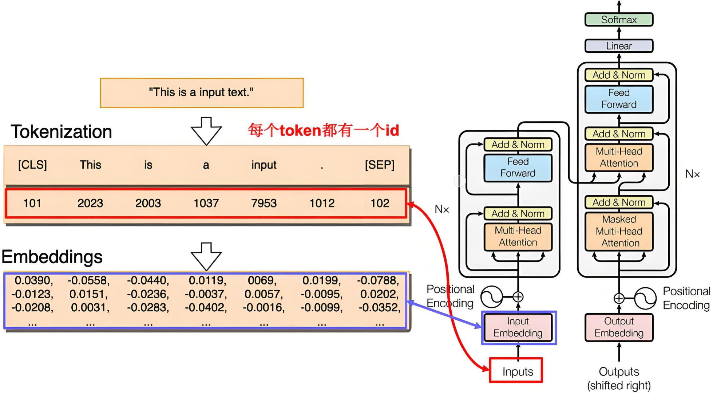 |
| :----------------------------------------------------------: |
|                 Embeddings 是通过学习得到的                  |


## 2. Tokenizer作用

Tokenizer是将输入的文本字符串拆分为有意义的**标记（tokens）**，这些标记可以是单词、子词、字符或符号。

| 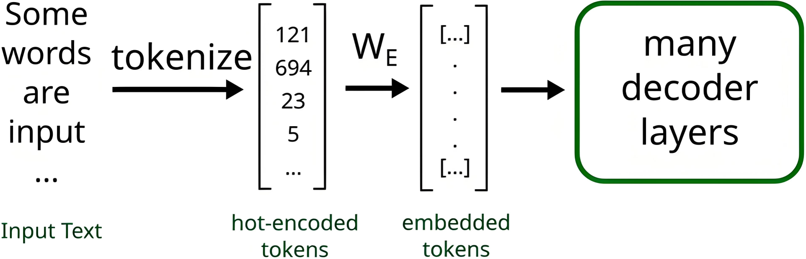 |
| :----------------------------------------------------------: |
|                            流程图                            |

**作用：**

- 将文本序列转化为数字序列，也就是==token编号==

  直观感受：https://huggingface.co/spaces/Xenova/the-tokenizer-playground

  | 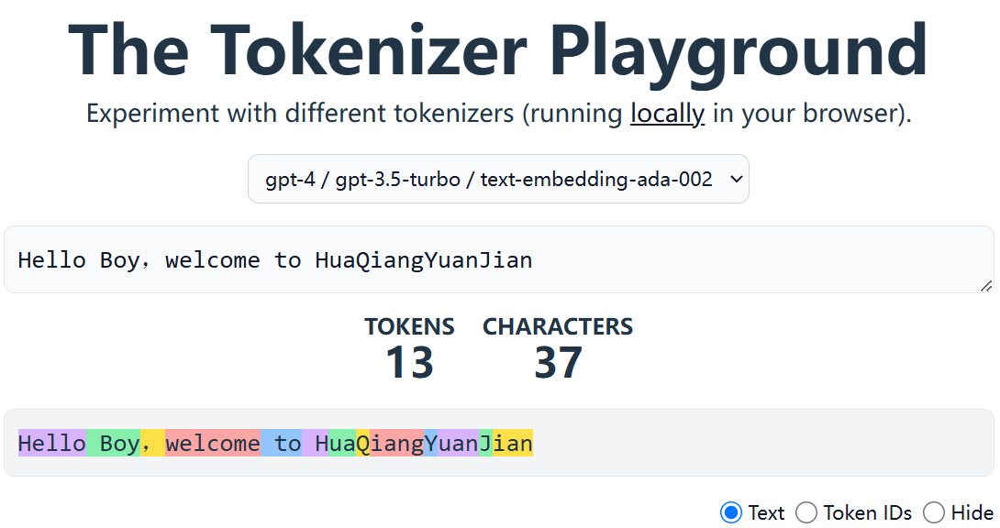 | 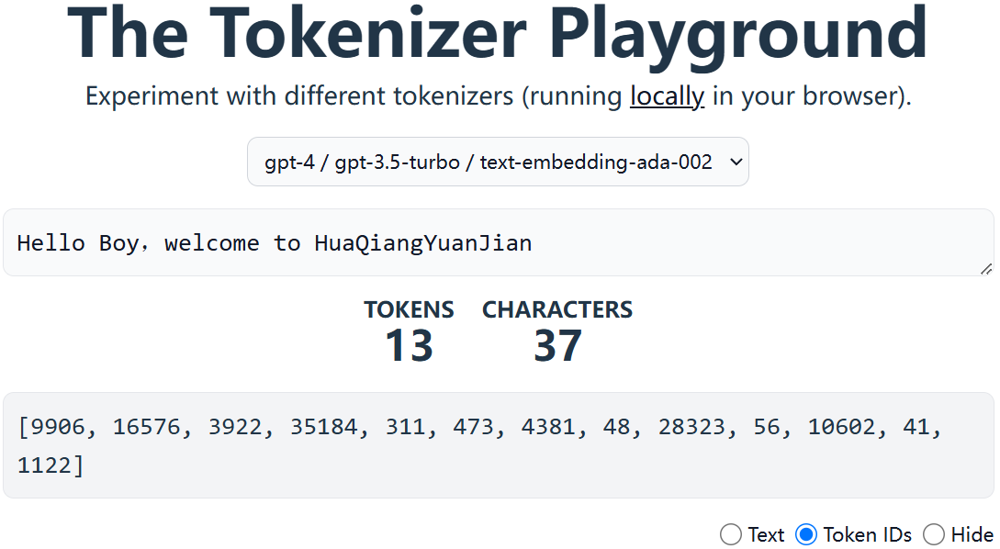 |
  | :----------------------------------------------------------: | :----------------------------------------------------------: |
  |                   Token划分结果之subwords                    |                   Token划分结果之Token编号                   |

- 不同的模型划分结果不一样

  | 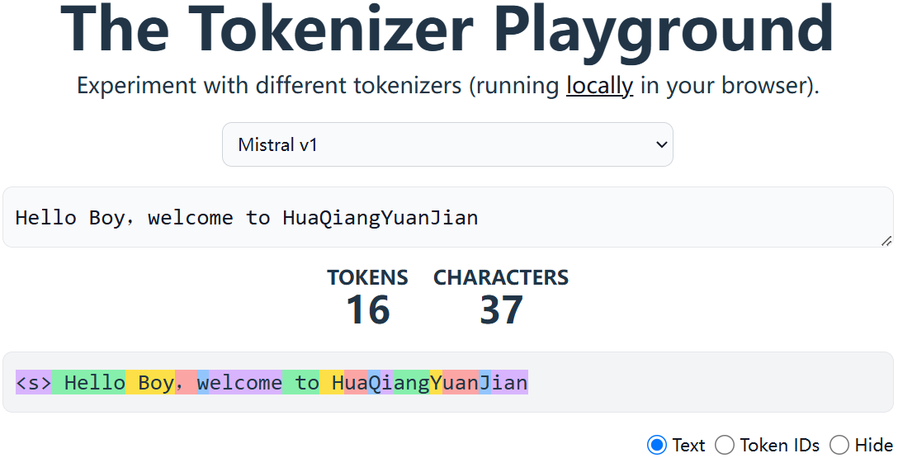 | 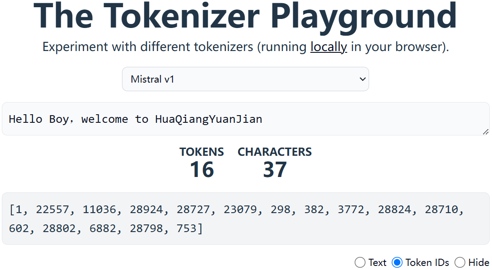 |
  | :----------------------------------------------------------: | :----------------------------------------------------------: |
  |                   Token划分结果之subwords                    |                   Token划分结果之Token编号                   |

- 是训练和微调 LLM 必不可少的一部分

  

## 3. Tokenizer实现

Tokenizer实现的颗粒度不同，同一颗粒度又有不同的具体实现方法。

### 3.1 三种颗粒度

Tokenizer的实现通常按粒度可分为三大类：Word-based、Character-based、Subword-based

#### 3.1.1 Word-based Tokenization
- 特点

  - 最小单位：完整的单词。  

  - 词汇表：需预定义固定大小的词表，包含所有可能单词。  

  - OOV处理：未登录词替换为`[UNK]`，导致信息丢失。


- 示例

  - 英文：`"I love NLP"` → `["I", "love", "NLP"]`  

  - 中文：`"我爱自然语言处理"` → `["我", "爱", "自然语言处理"]`

优点

- 符合人类认知的自然语言和直觉


- 缺点

  | 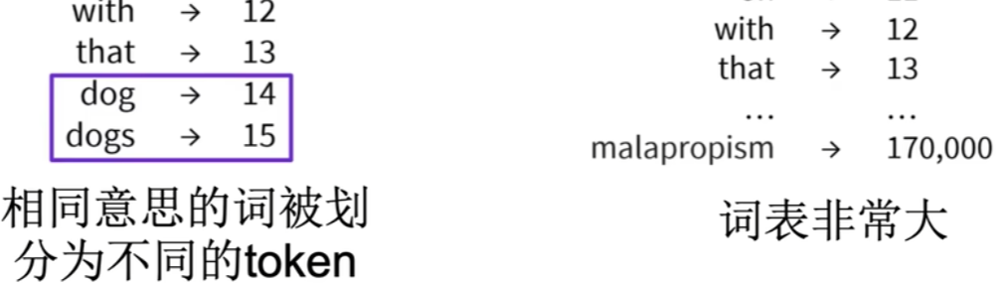 |
  | :----------------------------------------------------------: |

  - 词汇表庞大

    - 可以限制词表大小，未知词用特殊token表示

      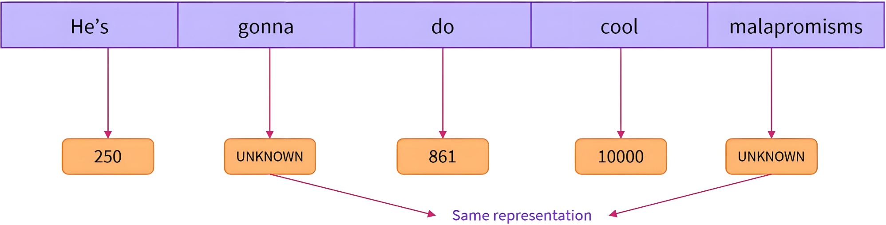

    - 问题还是明显：信息丢失，模型性能不行了。

  - OOV问题严重：Out Of Vocab

  - 相同意思的词划分为不同token

    

#### 3.1.2 Character-Based Tokenization

- 特点

  - 最小单位：单个字符（字母、标点、符号等）。  

  - 词汇表：极小（如ASCII字符集仅256个）。  

  - OOV处理：天然无OOV问题。


- 示例

  - 英文：`"hello"` → `["h", "e", "l", "l", "o"]`  

  - 中文：`"你好"` → `["你", "好"]`


- 优缺点

  | **优点**               | **缺点**                 |
  | ---------------------- | ------------------------ |
  | 词汇表极小，无OOV问题  | 序列长度剧增，计算效率低 |
  | 适合拼写纠错、语音识别 | 丢失词语级语义信息       |

  所以：

  ```asciiarmor
  常用词：不应该再被切分成更小的token或subword
  不常用词或词群：应该用子词来表示
  ```
  
  

#### 3.1.2 Subword-Based Tokenization

| 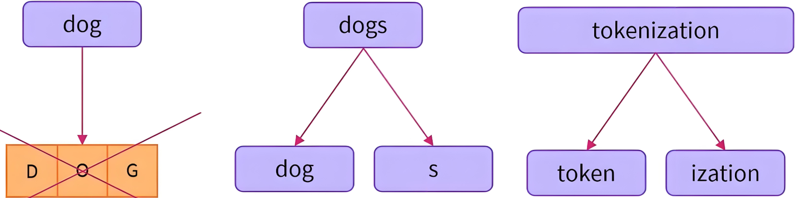 |
| :----------------------------------------------------------: |


##### 3.1.2.1 特点

| 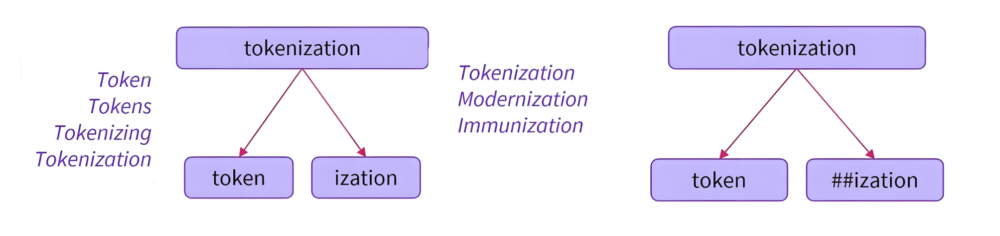 |
| :----------------------------------------------------------: |
|                      ##表示一个词的结尾                      |

- 最小单位：介于词和字符之间的子词，如词根、前缀、后缀。  

- 核心思想：将罕见词拆分为已知子词，如 $unhappy → [un, happy]$。  

- 算法：BPE（Byte-Pair Encoding）、BBPE、WordPiece、Unigram LM、SentencePiece等。

  | Subword 分词方法 | 典型模型                                      |
  | ---------------- | --------------------------------------------- |
  | BPE/BBPE         | GPT, DeepSeek, GPT-2, GPT-Neo, RoBERTa, LLaMA |
  | WordPiece        | BERT, DistilBERT, MobileBERT                  |
  | Unigram          | AIBERT, T5, mBART, XLNet                      |


## 4. Subword算法

在NLP中，Subword算法用于将单词拆分为更小的语义单元，也就是子词，以OOV和数据稀疏性问题。

### 4.1 BPE

Byte-Pair Encoding，字节对编码。  

#### 4.1.1 核心思想

BPE算法包含**词频统计**与**词表合并**两部分：通过迭代合并高频的相邻字符对来生成子词。

**步骤**：

1. 初始化词汇表为所有基础字符。
2. 统计相邻符号对的频率，合并最高频的对。
3. 重复合并直到达到预设的词汇表大小或迭代次数。


#### 4.1.2 案例助解

通过一个小小的案例帮助大家理解BPE算法过程。

- **词频统计：**

  对语料库进行词频统计：

  ```CSS
  ("hug", 10), ("pug", 5), ("pun", 12), ("bun", 4), ("hugs", 5)
  ```

- **基本词表构建：**

  基于语料库构建词表如下：

  ```css
  ['b', 'g', 'h', 'n', 'p', 's', 'u']
  ```

- **根据基本词表切词：**

  ```css
  ('h' 'u' 'g', 10), ('p' 'u' 'g', 5), ('p' 'u' 'n', 12), ('b' 'u' 'n', 4), ('h' 'u' 'g' 's', 5)
  ```

- **统计词内相邻Token组成的pair出现频率：**

  ```css
  hu:15, ug:20, pu:17, un:16, bu:4, gs: 5
  ```

- **词表合并：**

  添加最高频pair到词表：应该可以看的出来，$ug:20$ 词频最高

  合并 $ug$ 到词表，于是词表变成了：

  ```css
  ['b', 'g', 'h', 'n', 'p', 's', 'u', 'ug']
  ```

  同步语料库切词，变成了：

  ```css
  ('h' 'ug', 10), ('p' 'ug', 5), ('p' 'u' 'n', 12), ('b' 'u' 'n', 4), ('h' 'ug' 's', 5)
  ```

- **==继续==统计词内相邻Token组成的pair出现频率：**

  注意，这里就有点开始循环操作的意思了。

  ```css
  hug:15, pug:5, pu:12, un:16, bu:4, ugs:5
  ```

- **==继续==词表合并：**

  添加最高频pair到词表：应该可以看的出来，$un:16$ 词频最高

  合并 $un$ 到词表，于是词表变成了：

  ```css
  ['b', 'g', 'h', 'n', 'p', 's', 'u', 'ug', 'un']
  ```

  同步语料库切词，变成了：

  ```css
  ('h' 'ug', 10), ('p' 'ug', 5), ('p' 'un', 12), ('b' 'un', 4), ('h' 'ug' 's', 5)
  ```

- **==再继续==统计词内相邻Token组成的pair出现频率：**

  ```css
  hug:15, pug:5, pun:12, bun:4, ugs:5
  ```

- **==再继续==词表合并：**

  添加最高频pair到词表：应该可以看的出来，$hug:15$ 词频最高

  合并 $hug$ 到词表，于是词表变成了：

  ```css
  ['b', 'g', 'h', 'n', 'p', 's', 'u', 'ug', 'un', 'hug']
  ```

  同步语料库切词，变成了：

  ```css
  ('hug', 10), ('p' 'ug', 5), ('p' 'un', 12), ('b' 'un', 4), ('hug' 's', 5)
  ```

- **完成词表更新**

  当达到BPE合并次数之后，停止合并，这就是最总的Token词表。

  比如GPT的词汇表大小为40478，因为它有478个基本字符，并且在40000次合并后停止。

- **词表使用**

  ```css
  bug => ['b', 'ug']
  mug => ['<unk>', 'ug']
  hugs=>[9, 5]
  ```
  
  没在词表里面的Token用<unk>表示。

#### 4.1.3 存在的问题

- 基本词汇表需要包含所有可能的基本字符，可能相当大.
- 比如所有Unicode中文字符都被视为基本字符的话，有 $10w+$。


### 4.2 BBPE

Byte-Level Byte-Pair Encoding，BPE的字节级扩展版本，主要用于处理多语言 NLP 任务。

#### 4.2.1 BBPE vs. BPE

| 特性     | **BPE**            | **BBPE **                |
| -------- | ------------------ | ------------------------ |
| 处理单位 | 字符或子词         | 字节、UTF-8编码          |
| 适用语言 | 适用于空格分隔语言 | 适用所有语言             |
| OOV 处理 | 仍可能遇到OOV      | 几乎不会有 OOV 问题      |
| 存储开销 | 词表较小           | 词表较大，但更具泛化能力 |

#### 4.2.2 工作原理

原理和BPE一致，只是使用字节（byte）作为初始token，适用于任何文本。


#### 4.2.3 实例助解

语料：==深度学习需要一定的学习深度==

##### 4.2.3.1 预处理
首先将句子转换为UTF-8编码的字节序列，十进制表示：

```csharp
[230, 183, 177, 229, 186, 166, 229, 173, 166, 228, 185, 160, 233, 156, 128, 232, 166, 129, 228, 184, 128, 229, 174, 154, 231, 154, 132, 229, 173, 166, 228, 185, 160, 230, 183, 177, 229, 186, 166]
```

##### 4.2.3.2 初始化词汇表
初始词汇表为所有唯一的字节 $0-255$，但此处仅包含语料中出现的字节：

```csharp
{128, 129, 132, 154, 156, 166, 171, 173, 174, 177, 183, 184, 185, 186, 228, 229, 230, 231, 232, 233}
```

##### 4.2.3.3 初始分词结果

每个字节单独成词

```csharp
230 183 177 | 229 186 166 | 229 173 166 | 228 185 176 | 233 156 128 | 232 166 129 | 228 184 128 | 229 174 154 | 231 154 132 | 229 173 166 | 228 185 176 | 230 183 177 | 229 186 166
```

##### 4.2.3.4 统计字节对频率
遍历所有相邻的字节对，统计出现频率： 

| 字节对     | 频率 |
| ---------- | ---- |
| (230, 183) | 2    |
| (183, 177) | 2    |
| (229, 186) | 2    |
| (186, 166) | 2    |
| (229, 173) | 1    |
| ...        | ...  |

##### 4.2.3.5 合并最高频字节对
选择频率最高的字节对进行合并，如 $(230, 183)$。 
**合并操作**：  

- 将 $230 \:\: 183$ 替换为新符号 $230\_183$。  

- 为该符号新分配一个ID，如 $256$。

- 更新词汇表：新增 $256 = 230\_183$。

- 此时，我们可以更新分词结果了

  ```cmd
  {128, 129, 132, 154, 156, 166, 171, 173, 174, 177, 183, 184, 185, 186, 228, 229, 230, 231, 232, 233, 256, 257}
  ```
  
  
  
  ```csharp
  256 177 | 229 186 166 | 229 173 166 | 228 185 176 | 233 156 128 | 232 166 129 | 228 184 128 | 229 174 154 | 231 154 132 | 229 173 166 | 228 185 176 | 256 177 | 229 186 166
  ```

##### 4.2.3.6 迭代合并
重复统计和合并，直到达到预设的合并次数或词汇表大小。  

**第二次合并**：  

- 统计当前字节对频率，如 $(256, 177)$ 出现 $2$ 次。  

- 合并  $256 \:\: 177$  为新符号  $257 = 256\_177$。  

  更新后的分词结果：

```csharp
257 | 229 186 166 | 229 173 166 | 228 185 176 | ... | 257 | 229 186 166
```

**第三次合并**：  

- 合并 $(229, 186)$。  
- 新符号  $258 = 229\_186$。  

更新后的分词结果： 

```csharp
257 | 258 166 | 229 173 166 | 228 185 176 | ... | 257 | 258 166
```

##### 4.2.3.7 最终词汇表
经过多次合并后，词汇表会包含初始字节和常见组合：   OOV 
- 初始字节：$230, 183, 177, 229, 186, ...$  
- 合并后的符号：  
  - $256 = 230\_183$  
  - $257 = 256\_177$  
  - $258 = 229\_186$
  - $259 = 258\_166$

##### 4.2.3.8 符号的层级关系

如 $257 = 256\_177$，而 $256 = 230\_183$，因此 $257$ 实际表示 $230\_183\_177$，即完整的"深"的UTF-8字节序列。

##### 4.2.3.9 编码示例
原始句子编码为：

```csharp
257 259 | 229 173 166 | 228 185 176 | ... | 257 259
```

其中 $257$ 表示"深"，$259$ 表示"度"

当然了，$(257, 259)$ 出现 $2$ 次，下一步合并 $(257, 259)$ → 新符号 $260 = 257\_259$，即"深度"的完整Token。

所以，这怎么可能会出现 $OOV$ 的问题？


### 4.3 WordPiece

WordPiece是BPE的变种，被应用于BERT等模型中。

#### 4.3.1 基本原理

WordPiece是一种基于统计的子词分词算法，它将单词分解为更小的子词单元，主要特点包括：

- 将罕见词分解为更小的已知子词
- 保留常见词作为完整单元
- 词汇表通过训练数据学习得到

#### 4.3.2 训练过程

WordPiece是如何完成词汇表的构建的呢？

##### 4.3.2.1 初始化词汇表

- 将所有字符加入初始词汇表

- 将训练语料中的所有单词按字符拆分并统计频率

  ```css
  "low" → ["l", "o", "w"]
  ```

  并统计其频率

##### 4.3.2.2 迭代与合并

与BPE类似，但是算法略有不同：将 $pair$ 的频率除以其单个 $token$ 的频率乘积
$$
\text{pair 得分} = \frac{\text{pair 出现的次数}}{\text{token1 出现的次数} \times \text{token2 出现的次数}}
$$

- 该算法优先考虑单个 $token$ 在词表中不太频繁的 $pair$ 进行合并

- 参考一下：哪个 $pair$ 会更快的融合？

  ```asciiarmor
  "un" "##able"
  "hu" "##gging"
  ```

  

#### 4.3.3 案例助解

通过一个小小的案例帮助大家理解WordPiece算法过程。

- **词频统计：**

  对语料库进行词频统计：

  ```CSS
  ("hug", 10), ("pug", 5), ("pun", 12), ("bun", 4), ("hugs", 5)
  ```

- **基本词表构建：**

  基于语料库构建词表如下：

  ```css
  ['b', 'h', 'p', '##g', '##n',  '##s', '##u']
  ```

- **根据基本词表切词：**

  ```css
  ('h' '##u' '##g', 10), ('p' '##u' '##g', 5), ('p' '##u' '##n', 12), ('b' '##u' '##n', 4), ('h' '##u' '##g' '##s', 5)
  ```

- **统计频率：**

  - 词内相邻Token组成的pair出现频率

    ```css
    hu:15, ug:20, pu:17, un:16, bu:4, gs:5
    ```

  - 每个token出现频率

    ```css
    h:15, u:36, g:20, p:17, n:16, b:4, s:5
    ```

- **计算pair得分**

  | 符号对 | 计算公式                      | 得分（近似值） |
  | ------ | ----------------------------- | -------------- |
  | hu     | $$ \frac{15}{15 \times 36} $$ | 0.0278         |
  | ug     | $$ \frac{20}{36 \times 20} $$ | 0.0278         |
  | pu     | $$ \frac{17}{17 \times 36} $$ | 0.0278         |
  | un     | $$ \frac{16}{36 \times 16} $$ | 0.0278         |
  | bu     | $$ \frac{4}{4 \times 36} $$   | 0.0278         |
  | gs     | $$ \frac{5}{20 \times 5} $$   | **0.05**       |

- **词表合并：**

  添加概率 $pair$ 到词表：应该可以看的出来，$gs:0.05$ 词频最高

  合并 $gs$ 到词表，于是词表变成了：

  ```css
  ['b', 'h', 'p', '##g', '##n',  '##s', '##u', '##gs']
  ```

  同步语料库切词，变成了：

  ```css
  ('h' '##u' '##g', 10), ('p' '##u' '##g', 5), ('p' '##u' '##n', 12), ('b' '##u' '##n', 4), ('h' '##u' '##gs', 5)
  ```


#### 4.3.4 token过程

训练完成后，对新的单词进行分词的算法如下：

##### 4.3.4.1 贪婪模式

==贪婪最长匹配优先算法==

- 将单词拆分为字符序列作为初始子词序列
- 从词汇表中找出最长的可能子词：
   - 从单词开始位置开始
   - 找到词汇表中存在的最长子词
- 对该子词进行分割
- 对剩余部分重复上述过程
- 如果无法匹配任何子词，则将该部分标记为未知(UNK)  

##### 4.3.4.2 分词过程

设词汇表如下：

```bash
["un", "##able", "##ing", "##e", "##d", "re", "##run", "##runing", "run"]
```

分词 $unrunning$ 的过程：
- 匹配最长前缀 $un$，剩余 $running$ 。
- 匹配最长前缀 $run$，剩余 $ning$。
- 无法匹配 $ning$，回退到字符级：
   - 匹配 $n$ + $ing$ 

最终分词结果：

```css
["un", "run", "UNK", "##ing"]
```

#### 4.3.5 特殊符号

以下是常见特殊符号（Special Tokens）及其处理的总结

##### 4.3.5.1 常见符号

| **特殊符号** | **名称**              | **用途**                                    | **典型场景**                         | **示例**                                          |
| ------------ | --------------------- | ------------------------------------------- | ------------------------------------ | ------------------------------------------------- |
| [UNK]        | Unknown Token         | 表示词汇表中不存在的词                      | 当输入无法拆分为任何子词时           | "鞲韫"→ ["[UNK]"]                                 |
| [CLS]        | Classification Token  | 用于分类任务的聚合表示                      | 文本分类、句子匹配任务               | [CLS] Paris is capital [SEP]                      |
| [SEP]        | Separator Token       | 分隔句子或文本片段                          | 多句子输入任务，如推理、问答         | [CLS] How old? [SEP] I'm 20 [SEP]                 |
| [MASK]       | Mask Token            | 在预训练中遮盖部分词，让模型预测被遮盖内容  | BERT的掩码语言模型训练               | "The [MASK] sat on mat." → 模型预测[MASK]为cat。  |
| [PAD]        | Padding Token         | 将输入填充到相同长度                        | 批量训练时对齐序列长度。             | ["Hello", "world", "[PAD]", "[PAD]"]（填充长度4） |
| [BOS]        | Beginning of Sequence | 标记序列的开始                              | 自回归生成任务，如文本生成           | GPT输入：[BOS] Once upon a time...                |
| [EOS]        | End of Sequence       | 标记序列的结束                              | 文本生成终止、多轮对话结束。         | "Goodbye. [EOS]"                                  |
| [NUM]        | Number Token          | 替换数字为统一符号，减少稀疏性              | 处理数字较多的文本，如金融、科学领域 | "Age: 25" → ["Age", ":", "[NUM]"]                 |
| [URL]        | URL Token             | 替换URL链接为统一符号（部分预处理中使用）。 | 清理含链接的文本（如社交媒体数据）。 | "Visit https://example.com" → ["Visit", "[URL]"]  |


##### 4.3.5.2 关键说明
- 模型依赖性  
   - BERT类模型：主要使用 `[CLS]`, `[SEP]`, `[MASK]`, `[PAD]`。  
   - GPT类模型：常用 `[BOS]`, `[EOS]`, `[PAD]`。  
- 分词策略
   - `[UNK]` 应尽量避免，WordPiece/BPE会优先拆分子词（如 `"happiness"` → `["happy", "##ness"]`）。  
- 特殊符号的嵌入
   - 这些符号在模型中有对应的嵌入向量，与普通词同等处理，但功能不同。  

##### 4.3.5.3 存在意义
- 结构化输入：明确序列边界（如[SEP]）和任务类型（如[CLS]）。  
- 鲁棒性：处理变长输入（[PAD]）、未知词（[UNK]）。  
- 任务适配：支持分类（[CLS]）、生成（[EOS]）、预训练（[MASK]）等不同需求。


### 4.4 Unigram

Unigram是基于概率的，与 BPE和 WordPiece 不同，它通过概率模型来确定最佳子词分割，经常出现在SentencePiece中。

#### 4.4.1 基本思想

从大词汇表开始，逐步删除低概率的子词，保留最有效的组合。

| 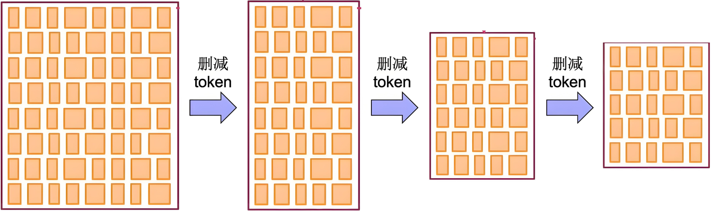 |
| :----------------------------------------------------------: |
|   初始化一个很大的词表，然后通过算法删减为较小的高质量词表   |

#### 4.4.2 初始化词表

Unigram从一个较大的初始词汇表开始，初始化方式：

- 使用所有单个字符作为初始词汇表
- 使用 BPE 算法先训练一个较大的词汇表
- 使用高频词和字符的组合

##### 4.4.2.1 预料词频统计

对语料库进行词频统计：

```CSS
("hug", 10), ("pug", 12), ("lug", 5), ("bug", 4), ("dug", 5)
```

##### 4.4.2.2 基本词表构建

基于语料库构建词表如下：

```css
['h', 'u', 'g', 'l', 'p', 'b', 'd', 'u', 'hu', 'lu', 'bu', 'ug', 'pu', 'du']
```

##### 4.4.2.3 词表token频率

```css
['h':10/180, 'u':36/180, 'g':36/180, 'l':5/180, 'p':12/180, 'b':4/180, 'd':5/180, 'ug':36/180, 'pu':12/180, 'hu':10/180, 'lu':5/180, 'du':5/180, 'bu':4/180]
```


#### 4.4.3 算法过程

在逐步压缩词表大小的过程中，Unigram使用了“最小化损失增量”进行子词筛选和删除的策略，尽量保留对模型整体分词概率贡献最大的子词。

| 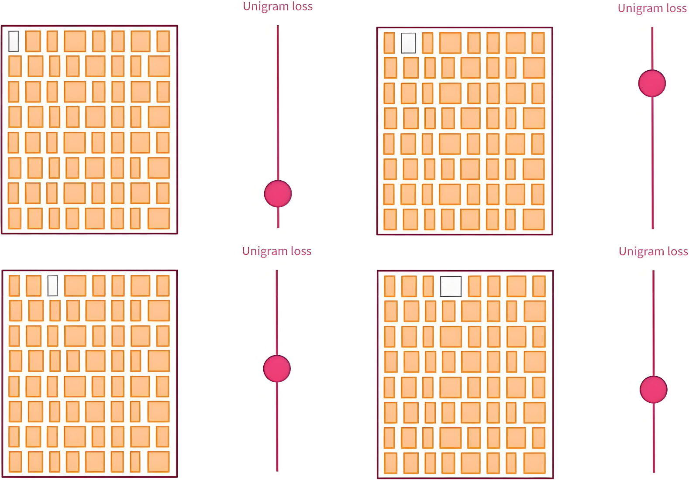 | 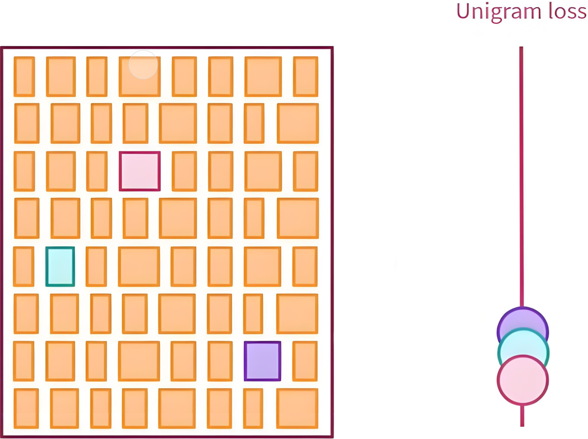 |
| :----------------------------------------------------------: | :----------------------------------------------------------: |
|            模拟删除每个Token，并计算 unigram loss            |                 删除损失增量最小的前 $10\%$                  |


##### 4.4.3.1 EM

使用EM（期望最大化）算法训练子词概率：

- unigram模型假设每个词都是独立的。

  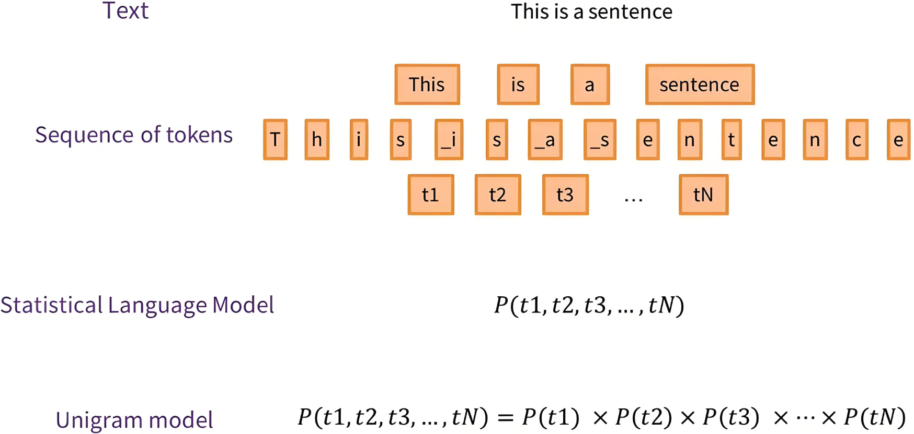

  

  **根据分词计算==hug==所有可能的概率：**
  $$
  \textbf{h \: u \:g} \: \: ： \quad \frac{10}{180} \times \frac{36}{180} \times \frac{36}{180} = 2.22 \times 10^{-3} \\
  \textbf{hu\: g} \: \: ： \quad \frac{10}{180} \times \frac{36}{180} = 1.11 \times 10^{-2} \\
  \textbf{h\: ug} \: \: ： \quad \frac{10}{180} \times \frac{36}{180} = 1.11 \times 10^{-2} \\
  \textbf{hug} \: \: ： \quad 0
  $$

- 用 Viterbi 算法（动态规划）找出最大概率路径。

$$
S^* = \arg\max_S \prod_{i=1}^{n} P(w_i)
$$

**如果遇到概率相等的则随机选一个：**

| Corpus    | Splits   | Scores       |
| --------- | -------- | ------------ |
| "hug", 10 | hu    g  | ==1.11e-02== |
| "pug", 12 | pu    g  | 1.33e-02     |
| "lug", 5  | lu     g | 5.56e-03     |
| "bug", 4  | bu    g  | 4.44e-03     |
| "dug", 5  | du    g  | 5.56e-03     |


##### 4.4.3.2 评估Loss

使用负对数最大似然，对所有可能切分路径的概率总和计算 $loss$，即：
$$
\text{Unigram loss} = - \sum_{x \in \text{Corpus}} \log P(x)
$$
其中：$P(x) = \sum_{S \in \text{All Segmentations of } x} \prod_{w_i \in S} P(w_i)$

**于是就可以评估loss了：**
$$
10 \times (-\log(1.11 \times 10^{-2})) \\
+ 12 \times (-\log(1.33 \times 10^{-2})) \\
+ 5 \times (-\log(5.56 \times 10^{-3})) \\
+ 4 \times (-\log(4.44 \times 10^{-3})) \\ 
+ 5 \times (-\log(5.56 \times 10^{-3})) \\
= \mathbf{170.4}
$$

#####  4.4.3.3 模拟删除

对于词表中每个子词 $w$，假设将其删除，评估其对整体损失的影响：

- 模拟删除 $w$，重新运行EM，并得到新的 $loss$。

- 记录该子词的 “损失增量”：
  $$
  \Delta L(w) = L_{\text{new}} - L_{\text{old}}
  $$

这是原始词表：

```css
['h':10/180, 'u':36/180, 'g':36/180, 'l':5/180, 'p':12/180, 'b':4/180, 'd':5/180, 'ug':36/180, 'pu':12/180, 'hu':10/180, 'lu':5/180, 'du':5/180, 'bu':4/180]
```

**第一次迭代：**

模拟删除   ~~=='ug':36/180==~~  ，那么 ==ug== 的概率就是 $0$，于是就有了：
$$
\textbf{h \: u \:g} \: \: ： \quad \frac{10}{180} \times \frac{36}{180} \times \frac{36}{180} = 2.22 \times 10^{-3} \\
\textbf{hu\: g} \: \: ： \quad \frac{10}{180} \times \frac{36}{180} = 1.11 \times 10^{-2} \\
\textbf{h\: ug} \: \: ： \quad \frac{10}{180} \times 0 = 0 \\
\textbf{hug} \: \: ： \quad 0
$$
最大概率路径得分：

| Corpus    | Splits   | Scores       |
| --------- | -------- | ------------ |
| "hug", 10 | hu    g  | ==1.11e-02== |
| "pug", 12 | pu    g  | 1.33e-02     |
| "lug", 5  | lu     g | 5.56e-03     |
| "bug", 4  | bu    g  | 4.44e-03     |
| "dug", 5  | du    g  | 5.56e-03     |

计算loss：
$$
10 \times (-\log(1.11 \times 10^{-2})) \\
+ 12 \times (-\log(1.33 \times 10^{-2})) \\
+ 5 \times (-\log(5.56 \times 10^{-3})) \\
+ 4 \times (-\log(4.44 \times 10^{-3})) \\ 
+ 5 \times (-\log(5.56 \times 10^{-3})) \\
= \mathbf{170.4}
$$
**继续n次迭代后得出：**

| Vocabulary            |  Loss | 损失增量 |
| --------------------- | ----: | -------- |
| With all vocabulary   | 170.4 | -        |
| **Without**  消融实验 |     - | -        |
| **ug**                | 170.4 | 0        |
| **pu**                | 170.4 | 0        |
| **hu**                | 170.4 | 0        |
| **lu**                | 170.4 | 0        |
| **du**                | 170.4 | 0        |
| **bu**                | 170.4 | 0        |

loss均无变化，那就随机删除一个，此时就不考虑百分比问题了。

##### 4.4.3.4 词表更新

这是更新后的词表：

```css
['h':10/144, 'u':36/144, 'g':36/144, 'l':5/144, 'p':12/144, 'b':4/144, 'd':5/144, 'pu':12/144, 'hu':10/144, 'lu':5/144, 'du':5/144, 'bu':4/144]
```

然后基于新词表继续模拟删除： ==hu==
$$
\textbf{h \: u \:g} \: \: ： \quad \frac{10}{144} \times \frac{36}{144} \times \frac{36}{144} = 4.34 \times 10^{-3} \\
\textbf{hu\: g} \: \: ： \quad 0 \times \frac{36}{144} = 0 \\
\textbf{h\: ug} \: \: ： \quad \frac{10}{144} \times 0 = 0 \\
\textbf{hug} \: \: ： \quad 0
$$
最大概率路径得分：

| Corpus    | Splits       | Scores       |
| --------- | ------------ | ------------ |
| "hug", 10 | h     u    g | ==4.34e-03== |
| "pug", 12 | pu    g      | 2.08e-02     |
| "lug", 5  | lu     g     | 8.68e-03     |
| "bug", 4  | bu    g      | 6.94e-03     |
| "dug", 5  | du    g      | 8.68e-03     |

计算loss：
$$
10 \times (-\log(4.34\times 10^{-3})) \\
+ 12 \times (-\log(2.08 \times 10^{-2})) \\
+ 5 \times (-\log(8.68 \times 10^{-3})) \\
+ 4 \times (-\log(6.94 \times 10^{-3})) \\ 
+ 5 \times (-\log(8.68 \times 10^{-3})) \\
= \mathbf{168.2}
$$

##### 4.4.3.5 词表剪枝

如此搞整下来，他们的增量损失就会有个排名：

- 对所有子词计算 $\Delta L(w)$，从中选择使损失增量最小的前 $40\%$ 的子词进行删除，当然比例可设定。
- 剪枝后，留下质量较高、对概率影响较小的子词。

| 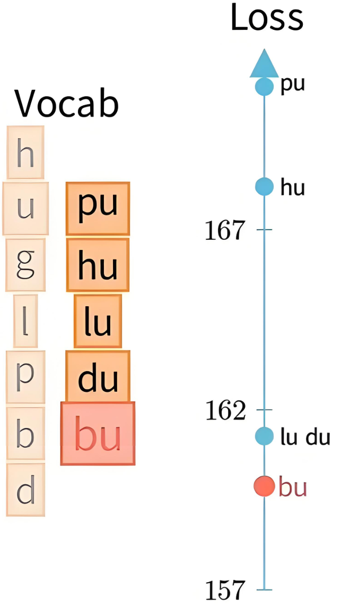 | 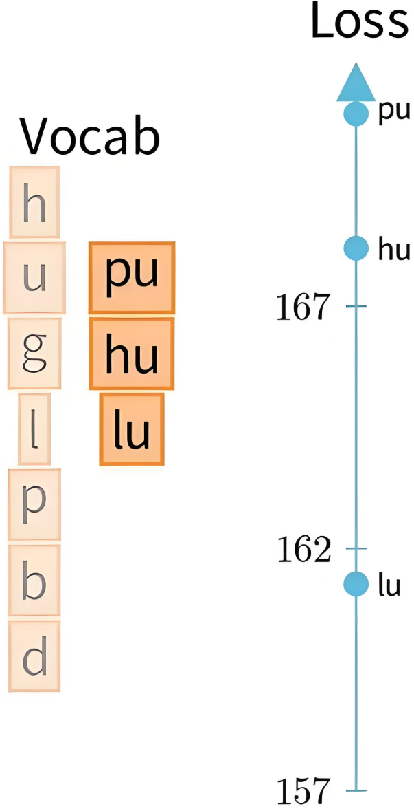 |
| :----------------------------------------------------------: | ------------------------------------------------------------ |
|                     计算模拟删除后的loss                     | 把排名后 $p\%$ 的 $token$ 从词表删除，如 $40\%$              |

==注：==不删除基础token，如26个字母和标点

##### 4.4.3.6 继续EM

- 在剪枝后的词表上重新运行 EM 迭代几轮，使概率重新收敛。
- 如此反复，直到达到目标词表大小。


### 4.5 SentencePiece

==把一个句子当成一个词来分成多个subword。==

SentencePiece是一种子词分词算法，广泛用于NLP预处理阶段，尤其适用于如BERT、T5、GPT等模型的训练数据构建。它的核心思想是：不依赖于空格等人为定义的分词边界，而是通过概率建模自动学习最优的子词单元，以提升模型对OOV和低频词的鲁棒性。

#### 4.5.1 BWU缺点

不是每个人都是好人

- BPE、WordPiece、Unigram假设输入文本使用空格来分隔，但并非所有语言都如此，如中文、韩文、日文等。
- 可以使用特定语言的pre-tokenizer分词，但每种语言都要学习一个，不太通用。

#### 4.5.2 基本思想

- 统一处理：SentencePiece将整个文本视为一个字符序列，包括空格，避免语言特有的预处理步骤。
- 学习子词：SentencePiece使用 **Unigram** 或 **BPE** 算法自动学习最优“子词”词汇表，这些子词诸如字符、常见词根、词缀等。
- 概率建模：如Unigram会学一个子词表，计算句子在不同子词组合下的概率，并保留能最大化语料可能性的子词拆分方式。
- 句子表示：训练好模型后，可将任意输入句子拆分成词表中的子词序列，这就避免了OOV问题。


#### 4.5.3 案例助解

```asciiarmor
我喜欢学习人工智能
```

##### 4.5.3.1 步骤 1

添加空格标记：在句子开头或句中适当位置加 `▁`，表示词或短语的开头。

```asciiarmor
"我喜欢学习人工智能" → "▁我喜欢学习人工智能"
```

##### 4.5.3.2 步骤 2

训练后得到的子词词表，随便假设的：

```
['▁我', '喜欢', '学习', '人工', '智能', '人工智能', '我喜欢']
```

##### 4.5.3.3 步骤 3

分词结果：根据词表拆分成概率最大的一种方式

句子：“ 我喜欢学习人工智能”

- 如果词表中有“人工智能”：

  ```css
  ['▁我', '喜欢', '学习', '人工智能']
  ```

- 如果词表中没有“人工智能”，但有“人工”和“智能”：

  ```css
  ['▁我', '喜欢', '学习', '人工', '智能']
  ```

- 如果都没有，就进一步拆分：

  ```css
  ['▁我', '喜', '欢', '学', '习', '人', '工', '智', '能']
  ```


### 4.6 如何选择
- BPE/WordPiece：适合通用场景，BPE更简单，WordPiece更注重语义。
- Unigram LM：需要概率化分词时使用。
- SentencePiece：处理非空格分隔语言（如中文）或需要端到端分词时。
