# 一、序列预测问题

序列预测问题（Sequence Prediction）是NN的重要应用之一，广泛用于自然语言处理、时间序列分析、语音识别、金融预测等领域。常见神经网络包括 RNN、LSTM、GRU和基于 Transformer 模型（如 BERT、GPT、T5）。

## 1. 应用场景

序列预测问题广泛应用于多个领域，目前在AI领域占据主导地位。

### 1.1 自然语言处理

- 机器翻译（如 Transformer）
- 文本摘要生成（如 BART）
- 语音识别（如 DeepSpeech）

### 1.2 时间序列预测

- 股票价格预测
- 交通流量预测
- 传感器数据异常检测

### 1.3 医疗诊断

- ECG 心电图分析
- 疾病进展预测

### 1.4 对话系统

- 智能客服（如 ChatGPT）
- 语音助手（如 Siri、小艺）


## 2. 序列任务分类

给定输入序列，给出预测结果，结构有Sequence-to-vector、Sequence-to-Sequence结构。

| 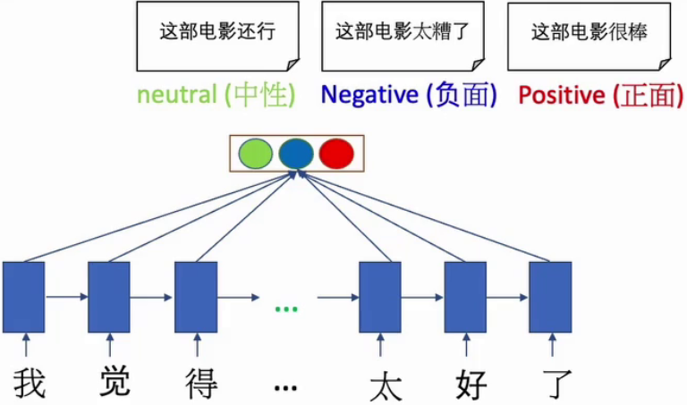 |  |  |
| :----------------------------------------------------------: | :----------------------------------------------------------: | :----------------------------------------------------------: |
|                         **情感分类**                         |                         **视频分类**                         |                         **语音分类**                         |


### 2.1 单步预测和多步预测

- **One-step Prediction**：单步预测，根据过去的输入预测下一个时间步的值。
- **Multi-step Prediction**：多步预测，预测多个未来时间步的数据，分递归预测和直接预测整个序列。


### 2.2 输入输出模式

- **One-to-One**：单对单，传统的全连接神经网络，输入和输出都是固定长度的，如图像分类。

- **One-to-Many**：单对多，一个输入生成多个输出，如图像生成文字。

- **Many-to-One**：多对一，多个输入预测一个输出，如情感分析。

- **Many-to-Many**：多对多，输入和输出都是多个，如机器翻译、视频字幕生成等。

  - **等长输入输出**：输入序列和输出序列等长。

    | 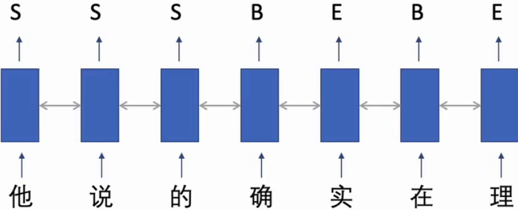 | 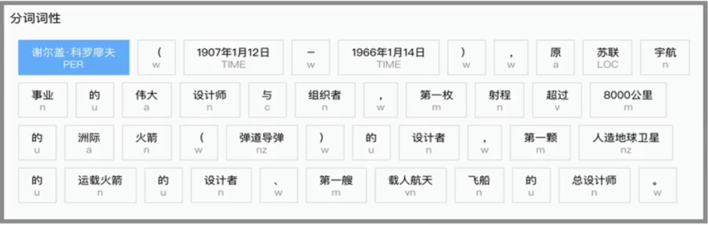 |
    | :----------------------------------------------------------: | :----------------------------------------------------------: |
    |                         **中文分词**                         |                         **词性标注**                         |

  - **不等长输入输出**：输入和输出长度不同，常采用Encode-Decode编码。

    | 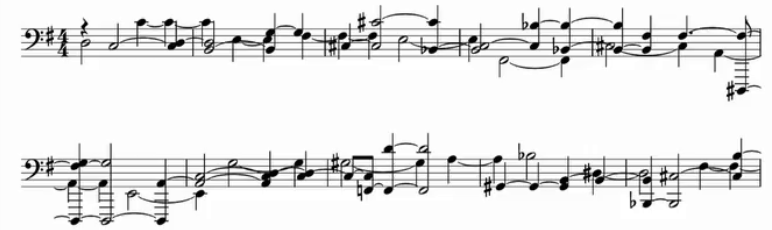 |  |  |
    | :----------------------------------------------------------: | :----------------------------------------------------------: | :----------------------------------------------------------: |
    |                         **语音生成**                         |                         **图像标注**                         |                         **文本生成**                         |

    


## 3. 常见模型

一些比较经典的序列预测模型。

### 3.1 RNN

​	Recurrent Neural Network，简称RNN，一种带自反馈的神经网络，能够处理任意长度的时序数据。

- 适用于处理时间序列或文本等连续数据。
- 由于梯度消失及爆炸问题，难以学习长期依赖关系。

### 3.2 LSTM

​	Long Short-Term Memory

- 通过 **遗忘门（Forget Gate）**、**输入门（Input Gate）** 和 **输出门（Output Gate）** 解决梯度消失问题。
- 适用于长序列任务，如文本生成、语音识别等。

### 3.3 GRU

​	Gated Recurrent Unit

- 类似 LSTM，但结构更简单，计算效率更高。
- 适用于需要较快推理速度的任务。

### 3.4 Transformer

- 采用 **自注意力机制（Self-Attention）** 处理长距离依赖关系，无需序列递归计算，提高了并行化能力。
- 代表模型有 **BERT**（用于自然语言理解）、**GPT**（用于文本生成）、**DeepSeek**（大模型任务）等。


## 4. 词嵌入

**Word Embedding**，词嵌入向量的目的是将自然语言中的离散词汇转化为连续的、高维的向量，以便计算机能够处理和理解。其背后的核心思想是通过向量表示，捕捉词之间的语义关系。

### 4.1 中文分词

```python
import jieba

if __name__ == "__main__":
    # 1.分词
    sentence = "我毕业于华清远见成都中心人工智能专业"
    # 指定词语
    jieba.add_word("华清远见")
    jieba.add_word("成都中心")

    words = jieba.cut(sentence)
    print(list(words))
```

### 4.2 词嵌入

```python
import jieba
import torch
import torch.nn as nn

if __name__ == "__main__":
    # 1.分词
    sentence = "我毕业于华清远见成都中心人工智能专业"
    # 指定词语
    jieba.add_word("华清远见")
    jieba.add_word("成都中心")

    words = list(jieba.cut(sentence))  # 分词
    vocab = list(set(words))  # 词表，根据实际数据生成，word是词表的子集
    length = len(vocab)  # 词表长度
    dim = 128  # 每个词的词向量维度
    embedding = nn.Embedding(length, dim)  # 词嵌入层
    word2index = {word: index for index, word in enumerate(vocab)}  # 创建词索引
    # 将分词后的句子转换为索引，后面也是通过词索引到词表获取词
    indexs = [word2index[word] for word in list(words)]
    print(indexs)
    # 转换为张量
    indexs = torch.LongTensor(indexs)
    embedding_out = embedding(indexs)
    print(embedding_out.shape)  # 词嵌入表示
```


# 二、RNN

Recurrent Neural Network，简称RNN，一种带自反馈的神经网络，能够处理任意长度的时序数据。。

## 1. 网络结构

网络结构如下：

| 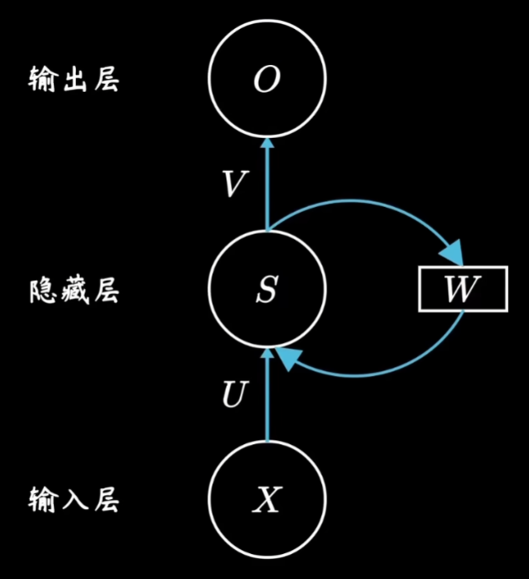 | 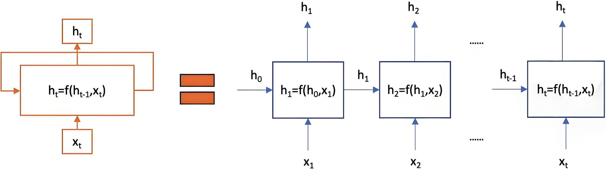 |
| :----------------------------------------------------------: | :----------------------------------------------------------: |
|                           整体来说                           |                           展开讲讲                           |

**参数说明**

- $U$： 输入 $x_t$ 权重参数。
- $W$：前一个时间步的隐藏状态 $h_{t-1}$ 的权重参数，是共享的。
- $V$：隐藏状态到最终输出的权重参数，是共享的。

输出表达式：
$$
H_t = f(U X_t + W H_{t-1} + b_t)
$$

## 2. 内部单元

进行基本的加权求和及激活操作。

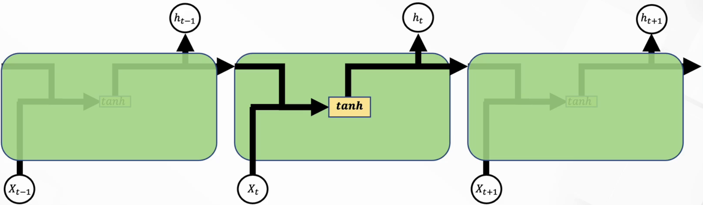

## 3. 深层RNN

RNN模型可以包含多个隐藏层，从而具备更强大的表达能力，也就是深层神经网络了。

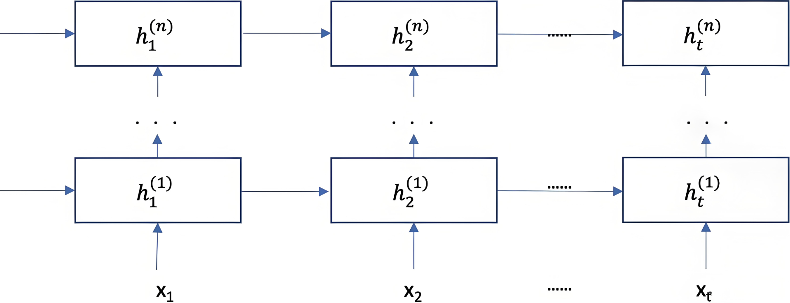

每个隐藏状态会**传递**到：

- 当前层的下一个时间步
- 当前时间步的下一层


## 4. 双向RNN

不仅包括正向过程，还包括反向的过程。

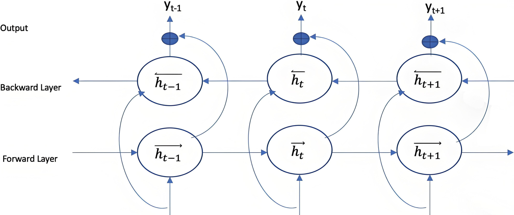

双向RNN**分别**按时间顺序和逆时间顺序处理输入序列，并将输出结合起来，从而获得更全面的上下文理解。

**使用场景：**

- **NLP**: 如文本分类、命名实体识别、机器翻译等。
- **语音识别**: 捕捉语音信号中的前后文信息。
- **生物信息学**: 如蛋白质结构预测、基因序列分析等。

**优点：**

- **上下文理解**: 能够同时利用过去和未来的信息，提供更全面的上下文理解。
- **性能提升**: 在许多序列建模任务中，双向RNN通常比单向RNN表现更好。


## 5. 参数学习

随时间反向传播算法BPTT(backpropagation through time)，误差不仅依赖于当前时刻 $t$，也依赖之前时刻 $k，0<k<t$。

$\delta_{t,k}$ 为第 $t$ 时刻的损失对第 $k$ 步隐藏神经元输入的梯度：$\delta_{t,t} = \frac{\partial L_t}{\partial h_t}$。

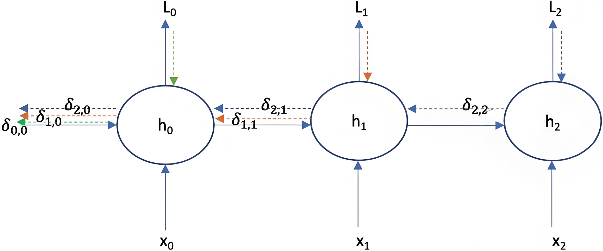


## 6. 梯度问题

存在长距离依赖问题(梯度消失或梯度爆炸)，参数更新主要依靠当前时刻的相邻状态。

### 6.1 公式推导

**在BPFT中，梯度 $\delta_{t,t}$ 通过时间步传播的公式为：**
$$
\delta_{t,t} \cdot \left( \frac{\partial h_t}{\partial h_{t-1}} \cdot \frac{\partial h_{t-1}}{\partial h_{t-2}} \cdots \frac{\partial h_2}{\partial h_1} \cdot \frac{\partial h_1}{\partial h_0} \right)
$$
我们还知道(这里的 $H$ 和上面的 $h$ 一样)：
$$
H_t = f(U X_t + W H_{t-1} + b_t)
$$
把激活函数tanh代进来：
$$
H_t = tanh(U X_t + W H_{t-1} + b_t)
$$
那么，第 $t$ 时刻隐藏状态 $h_t$ 对第 $t-1$ 时刻隐藏状态 $h_{t-1}$ 的偏导数为：
$$
\frac{\partial h_t}{\partial h_{t-1}} = W \cdot \left(1 - tanh(U X_t + W H_{t-1} + b_t)^{2}\right)
$$
如此整个BPFT连续乘下来，

$$
\delta_{t,0} = \delta_{t,t} \cdot \prod_{k=1}^{t} \left[ W \cdot \left( 1 - \tanh(U X_k + W H_{k-1} + b_k)^2 \right) \right]
$$


### 6.2 梯度消失与爆炸
该公式表明，梯度是通过时间步上的权重 $W$ 进行多次乘法传播，这会导致：
- **梯度消失**：如果 $|W| < 1$，梯度随着时间步增长会指数级缩小，导致早期时间步几乎没有梯度更新。
- **梯度爆炸**：如果 $|W| > 1$，梯度会指数级增长，影响训练稳定性。
- Tanh激活函数如果进入饱和区间，连乘后数值变得很小。


# 三、LSTM

Long Short-Term Memory，长短期记忆网络，是一种特殊的RNN，能够有效捕捉和存储长序列依赖信息，解决RNN处理长序列数据时的梯度消失和爆炸问题。

## 1. 记忆单元

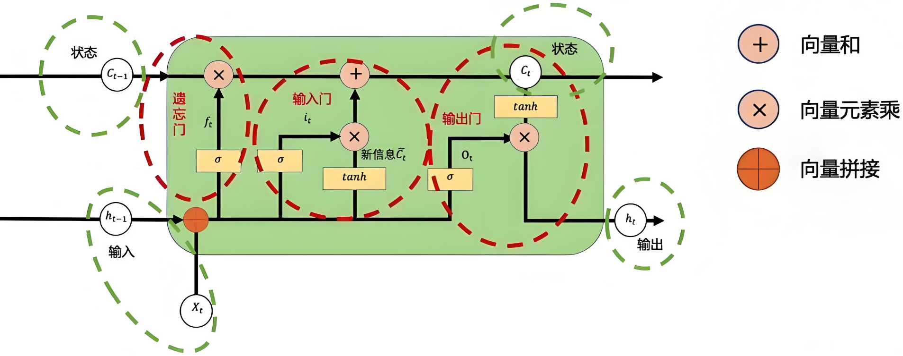

LSTM 由**多个记忆单元（memory cell）** 组成，每个单元包含三个核心门控机制：

- **遗忘门（Forget Gate, $f_t$）**：决定了要从cell state中舍弃什么信息。
- **输入门（Input Gate, $i_t$）**：决定了要往当前状态中保存什么新的信息。
- **输出门（Output Gate, $o_t$）**：决定了要从cell state中输出什么信息。

此外，LSTM 维护两个关键状态：

- **细胞状态（Cell State, $C_t$）**：负责存储长期信息，可进行线性信息传输，更新是缓慢的，从而减少梯度消失问题。
- **隐藏状态（Hidden State, $h_t$）**：影响当前时间步的输出，并传递到下一个时间步，更新是比较快的。


## 2. 门控单元计算

每个门又是怎么计算的呢？

### 2.1 遗忘门

f=forget，决定上一个状态需要遗忘的信息。
$$
f_t = \sigma(W_{xh}^{f} x_t + W_{hh}^{f} h_{t-1})
$$
其中：
- $f_t$ ：当前时间步的遗忘门激活值。
- $ W_{xh}^{f} $ ：输入 $x_t$ 到遗忘门的权重矩阵。
- $ W_{hh}^{f}$：上一时间步隐藏状态 $ h_{t-1}$ 到遗忘门的权重矩阵。

**上一个状态需要遗忘的信息：**
$$
f_t\odot C_{t-1}
$$
**作用**：
-  $f_t ≈ 0$ ：遗忘细胞状态中的信息。
- $f_t≈1$：保留细胞状态中的信息。


### 2.2 输入门

i=input，决定了要往当前状态中保存什么新的信息。
$$
i_t = \sigma(W_{xh}^{i} x_t + W_{hh}^{i} h_{t-1})
$$
**新信息：**
$$
\tilde{C}_{t} = \tanh(w^{c} _{xh} x_{t} + c_{h h} h_{t - 1})
$$
**最终状态更新如下：**
$$
C_{t} = f_t\odot C_{t-1} +\tilde{C}_{t} \odot i_t
$$
可以看的出来，遗忘门（长）和输入门（短）都起了作用。


### 2.3 输出门

o=output，决定了要从cell state中输出什么信息。
$$
O_t = \sigma(W_{xh}^{o} x_t + W_{hh}^{o} h_{t-1})
$$
**于是就有了一个最终如下的输出：**
$$
h_{t} = O_t\odot tanh(C_{t})
$$

# 四. GRU

GRU，Gated Recurrent Unit, 门控循环单元， 是LSTM的改进版。它减少了计算复杂度，使得训练更高效。

## 1. 与LSTM对比

| **对比项**     | **LSTM**                             | **GRU**                              |
| -------------- | ------------------------------------ | ------------------------------------ |
| 门控单元       | 3 个门（遗忘门、输入门、输出门）     | 2 个门（重置门、更新门）             |
| 细胞状态 $C_t$ | 细胞状态（Cell State）与隐藏状态分开 | 只使用隐藏状态（即无单独的细胞状态） |
| 计算复杂度     | 计算量较大，参数较多                 | 计算量更小，参数更少                 |
| 适用场景       | 长期依赖问题，精确控制记忆           | 计算资源有限时效果较好               |
| 训练效率       | 训练较慢                             | 训练更快                             |
| 表现           | 适用于更复杂的序列任务               | 适用于短时间依赖问题                 |


## 2. 网络结构

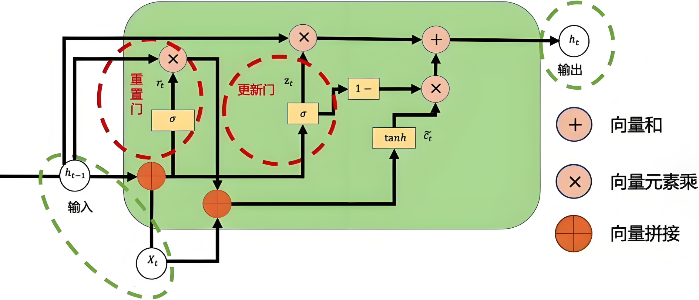

GRU使用两个门进行信息控制：

1. 更新门：$z_t$

   - 控制如何在当前时间步混合新信息与旧信息
   - 决定要从历史信息中保留多少信息
   - 捕捉长依赖关系

2. 重置门：$r_t$

   - 决定是否丢弃旧信息
   - 用于控制候选状态 $\tilde C_t$ 是否依赖于上一状态 $h_{t-1}$
   - 可以用来丢弃与预测无关的历史信息

   

## 3. 门控计算

通过数学公式进行图解。

### 3.1 更新门

控制如何在当前时间步混合新信息与旧信息。
$$
z_t = \sigma(W_{xh}^{z} x_t + W_{hh}^{z} h_{t-1})
$$

### 3.2 重置门

决定是否丢弃旧信息。
$$
r_t = \sigma(W_{xh}^{r} x_t + W_{hh}^{r} h_{t-1})
$$

### 3.3 新信息

类似LSTM的状态信息。
$$
\tilde{C}_{t} = \tanh(w^{c} _{xh} x_{t} + r_{t} h_{t - 1})
$$

### 3.4 输出信息

最终输出
$$
h_{t} = z_t\odot h_{t-1} + (1-z_t) \odot \tilde C_t
$$
**总结下：**

- 当 $z_t \approx 1$，$h_t \approx h_{t-1}$，保留旧信息，不易更新。
- 当 $z_t \approx 0$，$h_t \approx \tilde{c}_t$，更新为新信息，忘记过去。
- 通常 $z_t$ 介于 $0$ 和 $1$ 之间，由网络自己学习到底该更新多少信息。


