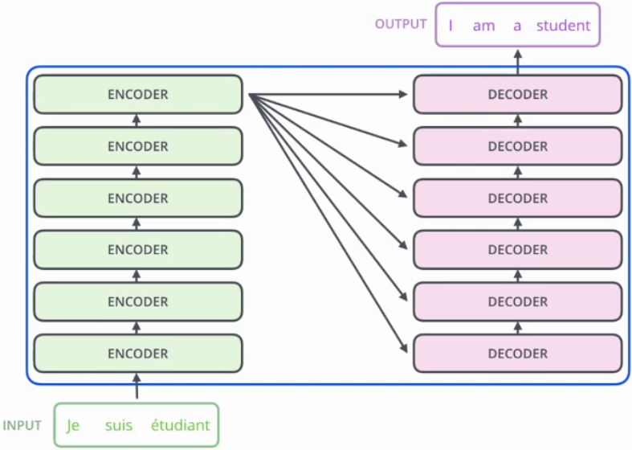

# 一、自注意力机制

Self-Attention（SA） Mechanism，自注意力机制，用于捕捉序列数据内部依赖关系的关键技术。它在NLP和CV中非常重要，尤其是Transformer。

## 1. 产生背景

自注意力机制的产生与序列建模任务（如机器翻译、文本生成等）中的挑战密切相关，比如RNN、LSTM等在处理长序列时有梯度消失（或爆炸）、计算效率低、难以并行化等诸多局限性。

### 1.1 认识seq2seq

Seq2Seq（Sequence-to-Sequence）是NLP中的经典框架，广泛应用于机器翻译、文本摘要等。其结构包括：

- **Encoder**：编码器，将输入序列编码为一个固定长度的上下文向量。
- **Decoder**：解码器，基于上下文向量生成输出序列。


### 1.2 提出问题

在自注意力机制之前，序列建模任务主要依赖于以下模型：

- RNN：循环神经网络，能够处理序列数据，但存在梯度消失/爆炸问题，难以捕捉长距离依赖。
- LSTM/GRU：通过门控机制缓解了RNN的问题，但处理长序列时难以并行化，计算效率低。

**共同问题是：**

- 长距离依赖：随着序列长度增加，模型难以有效捕捉远距离元素之间的关系。
- 计算效率：需要逐步处理序列，无法并行计算，训练速度较慢。
- 信息瓶颈：编码器会将整个输入序列压缩为一个固定长度的向量，可能导致信息丢失，灵活度太低。


### 1.3 解决问题

一开始选择的是CNN的思想，但是CNN要堆叠很多层，于是就出现了自注意力机制。

#### 1.3.1 解决并行化

使用CNN解决并行化问题。问题及解决对比：

|                          存在的问题                          |                             CNN                              |
| :----------------------------------------------------------: | :----------------------------------------------------------: |
|  |  |
|                          难以并行化                          | CNN通过层的堆叠，提高感受野，使得上层输出可以捕获长时序关系  |
|                需要逐步处理序列，训练速度较慢                |                  可并行化了，但堆叠的层过多                  |

CNN 证明了并行化在序列建模中的可行性，并为后续模型（如 Transformer）提供了灵感。


#### 1.3.2  引入自注意力机制

为了综合解决上述各种问题，提出了自注意力机制，并在Transformer中得到了广泛应用。其核心思想是：

|                          存在的问题                          |                         自注意力机制                         |
| :----------------------------------------------------------: | :----------------------------------------------------------: |
|  |  |
|                          难以并行化                          |     $b^1,b^2,b^3,b^4$ 的计算是基于整个输入的，且并行计算     |
|                需要逐步处理序列，训练速度较慢                |                     无需像CNN那样堆叠层                      |

- 长距离依赖捕获：通过计算序列中每个元素与其他元素的相关性，捕捉全局依赖关系。
- 并行计算：不依赖序列顺序，可并行处理整个序列，显著提高计算效率。
- 动态权重分配：模型可以动态地关注序列中不同位置的重要信息，不再依赖固定的上下文向量。
- 灵活性：可以处理不同长度的输入序列，不像卷积或RNN那样对输入的结构有严格要求。


### 1.4 使用场景

语言的含义是极度依赖上下文，同一个词或句子在不同的上下文中可能会有完全不同的含义。比如：货拉拉拉不拉拉布拉多要看拉布拉多在货拉拉上拉不拉baba~

比如下面这个机器人第二法则：

> 机器人第二法则
> 机器人必须遵守人类给**它**的**命令**，除非该命令违背了**第一法则**。

要想理解或处理句子中高亮的三个词语，那就必须和上下文联系起来。当模型处理这句话的时候，它必须知道：

- 「==它==」指代机器人
- 「==命令==」指代前半句话中人类给机器人下的命令，即「人类给它的命令」
- 「==第一法则==」指机器人第一法则的完整内容。

那么，此时我们就需要使用自注意力机制来理解上下文。


```
加权（） 求和。

加权求和：w1 * x1 + w2 * x2 + w3 * x3 + w4 * x4 + w5 * x5 + w6 * x6

我们的问题：权重怎么来（语义相似度【跟长度没有关系】就是权重，就是关联关系----余弦相似度------两个向量进行点乘操作-----所以我要映射出来两个向量-----Q、K），数据怎么来（映射一个V出来）。
```


### 1.5 基本概念

自注意力机制，就是找到自己和所在句子的所有的词之间的关联关系。

#### 1.5.1 核心目标

|  |
| :----------------------------------------------------------: |
|                       我是谁？我在哪？                       |

自注意力的目标是让每个位置的表示能够根据整个序列中其他位置的信息进行加权融合，从而捕获实体之间的相互关系。

自注意力机制是要回答：“**我（某个位置）应该关注谁（其他位置）？以及关注了之后该怎么融合信息？**”


#### 1.5.2 专业术语

我是鲁老师，是[华清远见]的一名老师，隶属于成都中心AI教学部。

自注意力机制通过引入**查询向量（Query）**、**键向量（Key）**、**值向量（Value）**概念来实现序列中各元素之间的信息交互和依赖建模。

- Q：Query

  表示当前**查询者**的位置，用来发出问题：“我想知道对我来说谁重要”。

- K：Key

  表示**被查询者**的身份，是所有位置给出的“介绍信”或“标签”，告诉别人自己是个啥玩意。

- V：Value

  表示**被查询者实际信息**，也就是一旦你决定“关注我了”，我就把这份信息给你。

  

#### 1.5.3 QKV的意义

序列中的每个 $Token$ 都有 $Q、K、V$ 三个角色：

- 所有位置之间需要【查询-响应】这样的互动，单一角色表达能力就太死板。
- “我该关注谁”是“我”和“他们”之间的交互过程，所以需要把“我”和“他们”分别建模（Q vs K）。
- 而最终融合的信息 $V$ 可能和你打分 $Q·K$ 的依据不完全相同，如：
  - $K$ ：强调结构特征→【位置或语法角色】
  - $V$： 强调语义内容→【单词的意义】


## 2. 实现过程

自注意力机制通过计算输入数据中每个位置与其他位置的相关性，来调整每个位置的信息表示。

### 2.1 输入序列

输入是一个序列，如词向量序列，假设：
$$
X = (x_1, x_2, \dots, x_n) \in \mathbb{R}^{n \times d}
$$
是 $n$ 个输入，$d$ 是输入维度，则自注意力的目的是捕获 $n$ 个实体之间的关系。


### 2.2 词语关系

it代表的是animal还是street呢，对我们来说简单，但对机器来说是很难判断的。self-attention就能够让机器把it和animal联系起来。


### 2.3 线性变换

自注意力机制依赖于三个核心概念：查询向量Query、键向量Key、值向量Value。他们对输入 $X$ 进行三次线性变换，得到三个矩阵。

|  |  |
| ------------------------------------------------------------ | ------------------------------------------------------------ |
| 查询向量就像便利贴；键向量是档案文件夹上贴的标签             | 这些百分比便是归一化之后的注意力得分                         |
| 文件夹里面便是值向量                                         | 根据得分计算出查询向量和其它向量的关联关系                   |


#### 2.3.1 查询向量

**Q** = Query, 是自注意力机制中的“询问者”。<u>每个输入</u>都会生成一个查询向量，表示当前词的需求。

- **作用**：用于与键向量计算相似度（通过点积方式），确定当前词与其他词的相关性。
- **生成方式**：通过一个权重矩阵将输入数据（如词向量）映射到查询空间。

$$
Q=X W_q
$$

$W_q$ 是可学习权重矩阵，维度为 $d \times d_k$，$d_k$是超参数，表示查询向量的维度。

代码参考如下：

```python
    # 随机生成自注意力机制的Query映射的权重矩阵
    Wq = torch.randn(512, 512)
    Query = torch.matmul(embedding_out, Wq)
    print(Query.shape) # torch.Size([7, 512])
```

注：映射后维度保持不变可以简化模型设计

#### 2.3.2 键向量

**K = **Key，表示其他词的信息，供查询向量匹配。<u>每个输入</u>都会生成一个键向量，表示其能够提供的信息内容。

- **作用**：与查询向量计算点积，生成注意力权重。点积越大，表示它们之间的相关性越强。
- **生成方式**：通过一个权重矩阵将输入数据（如词向量）映射到键空间。

$$
K=X W_k
$$

$W_k$ 是可学习权重矩阵，维度为 $d \times d_k$，$d_k$是超参数，表示键向量的维度。

代码参考如下：

```python
    # 随机生成自注意力机制的Key映射的权重矩阵
    Wk = torch.randn(512, 512)
    Key = torch.matmul(embedding_out, Wk)
    print(Key.shape) # torch.Size([7, 512])
```

注：映射后维度保持不变可以简化模型设计


#### 2.3.3 值向量

**V** = Value, 值向量包含了<u>每个输入</u>实际的信息内容，相关性决定了信息被聚焦的程度。

- **作用**：使用值向量基于注意力得分进行加权求和，生成最终的输出表示。
- **生成方式**：通过一个权重矩阵将输入数据（如词向量）映射到值空间。

$$
V=X W_v
$$

$W_v$ 是可学习权重矩阵，维度为 $d \times d_v$，$d_v$是超参数，表示值向量的维度。

代码参考如下：

```python
    # 随机生成自注意力机制的Value映射的权重矩阵
    Wv = torch.randn(512, 512)
    Value = torch.matmul(embedding_out, Wv)
    print(Value.shape)
```

注：$d_v$ 和 $d_k$ 通常是相等的。

#### 2.3.4 以图示意

通过线性变换得到三个向量的变化如下图所示：


### 2.4 注意力得分

使用点积来计算查询向量和键向量之间的相似度，除以缩放因子 $\sqrt{d_k}$ 来避免数值过大，使得梯度稳定更新。得到注意力得分矩阵：
$$
\text{Attention}(Q, K) = \frac{QK^T}{\sqrt{d_k}}
$$
参考代码如下：

```python
    # 计算原始的注意力得分
    score = torch.matmul(Query, Key.transpose(0, 1)) / math.sqrt(512)
    print(score)
```

输出：

```cmd
tensor([[ -178.6881,  1285.5822,   495.5278,  -599.9384,  -384.6758,  -477.1410,  131.7539],
        [ -186.2839,   687.4478,   683.4026,  -480.1666,  -681.2383,   483.9817,  135.0674],
        [  629.8547,  -542.7538,   920.4750,   120.9331,  -649.9722, -1237.3368,  -483.4400],
        [  -95.6489,   825.4144,   410.6800,   353.1750,  -582.8438,     6.5602,  766.4843],
        [  -91.9296,   830.8030,  -100.2955,    12.4473,   393.9949,  -378.9345,  -156.0786],
        [  901.4327,  -277.5199, -1051.5514,  -309.8069,   557.1041,   386.2509,  132.9100],
        [   84.0626,     1.6844,  1676.4392,  1118.7032,  -864.5373,   189.7945,  1162.9518]], grad_fn=<DivBackward0>)
```

注意力得分矩阵维度是 $n \times n$，其中 $n$ 是序列的长度。每个元素 $(i, j)$ 表示第 $i$ 个元素与第 $j$ 个元素之间的相似度。

参考示意图如下：

|  |
| :----------------------------------------------------------: |
|      $\alpha_{1,i} = \frac{q^1 \cdot k^i}{\sqrt{d_k}}$       |

### 2.5 归一化

为了将注意力得分转换为概率分布，需按行对得分矩阵进行 $softmax$ 操作，确保每行的和为 1，得到的矩阵表示每个元素对其他元素的注意力权重。是的，包括自己。
$$
\text{Attention Weight} = \text{softmax} \left( \frac{QK^T}{\sqrt{d_k}} \right)
$$

**具体到每行的公式如下：**
$$
\hat{\alpha}_{1,i} = \frac{\exp(\alpha_{1,i})}{\sum_j \exp(\alpha_{1,j})}
$$

> - $\alpha_{1,i}$ ：第 $1$ 个词语和第 $i$ 个词语之间的原始注意力得分。
> - $\hat{\alpha}_{1,i}$ ：经过归一化后的注意力得分。
>

参考代码如下：

```python
    # 注意力得分归一化
    normalized_scores = F.softmax(scores, dim=1)
    print(normalized_scores)
```

注：一行上进行归一化

### 2.6 加权求和

通过将注意力权重矩阵与值矩阵 $V$ 相乘，得到加权的值表示。
$$
\text{Output} =\text{Attention Weight} \times V = \text{softmax} \left( \frac{QK^T}{\sqrt{d_k}} \right) \times V
$$

具体计算示意图如下：

|  |
| :----------------------------------------------------------: |
| **Q**和**K**计算相似度后，经 $softmax$ 得到注意力，再乘**V**，最后相加得到包含注意力的输出 |

参考代码如下：

```python
    # 加权求和获取注意力后的结果
    attention_result = torch.matmul(normalized_scores, Value)
    print(attention_result.shape) # torch.Size([7, 512])
```

注：通过上下文来描述每一个词


### 2.7 输出

最终得到的输出是一个维度为 $n \times d_v$ 的新矩阵，其中每个元素的表示都被加权了。

```css
本质：将Query和Key分别计算相似性，然后经过softmax得到相似性概率权重即注意力，再乘以Value，最后相加即可得到包含注意力的输出
```

至此，艺术已成，我就是我，我不再是我。


## 3. 多头注意力机制

Multi-Head Attention，多头注意力机制，是对自注意力机制的扩展。

### 3.1 基本概念

多头注意力机制的核心思想是，将注意力机制中的 $Q、K、V$ 分成多个头，**每个头计算出独立的**注意力结果，然后将所有头的输出拼接起来，最后通过一个线性变换得到最终的输出。

|  |
| :----------------------------------------------------------: |
| $$q^{i}=W^{q}a^{i} \quad \quad q^{i,1}=W^{q,1}q^{i}\quad\quad q^{i,2}=W^{q,2}q^{i}$$ |

注：多头注意力机制通常先将词向量映射为Q、K、V，然后再分成多个头。

```python
    # 随机生成自注意力机制的Query映射的权重矩阵
    Wq = torch.randn(512, 512)
    Query = torch.matmul(embedding_out, Wq)

    # 随机生成自注意力机制的Key映射的权重矩阵
    Wk = torch.randn(512, 512)
    Key = torch.matmul(embedding_out, Wk)

    # 随机生成自注意力机制的Value映射的权重矩阵
    Wv = torch.randn(512, 512)
    Value = torch.matmul(embedding_out, Wv)
```


### 3.2 多头机制

|  |
| :----------------------------------------------------------: |
|                         2个头，头衔                          |


#### 3.2.1 映射权重

分头的过程是通过权重矩阵映射实现的，而不是直接切分，参考代码：

```python
    # 多头注意力层：分成4个头
    head_num = 8  # 头的数量
    d_k = dim // head_num  # 每个头维度
    # 随机生成多头注意力机制的Query映射的权重矩阵
    W_Q_list = torch.stack([torch.randn(512, d_k) for _ in range(head_num)])
    # 映射出每个头的Query
    Query_list = torch.stack(
        [torch.matmul(embedding_out, W_Q_list[i]) for i in range(head_num)]
    )
    print(Query_list.shape)
    # 随机生成多头注意力机制的Key映射的权重矩阵
    W_K_list = torch.stack([torch.randn(512, d_k) for _ in range(head_num)])
    Key_list = torch.stack(
        [torch.matmul(embedding_out, W_K_list[i]) for i in range(head_num)]
    )
    # 随机生成多头注意力机制的Value映射的权重矩阵
    W_V_list = torch.stack([torch.randn(512, d_k) for _ in range(head_num)])
    Value_list = torch.stack(
        [torch.matmul(embedding_out, W_V_list[i]) for i in range(head_num)]
    )
```


### 3.3 加权求和

每个头是独立计算的，使用自己的一套参数，得到每个头的输出：
$$
O_h = A_h V_h
$$
其中，$O_h \in \mathbb{R}^{n \times d_v}$ 是第 $h$ 个头的输出。

参考代码1：归一化的注意力得分

```python
    # 计算各自的注意力得分
    scores_list = torch.stack(
        [
            torch.matmul(Query_list[i], Key_list[i].transpose(0, 1))
            for i in range(head_num)
        ]
    )
    scores_list = torch.stack(
        [scores_list[i] / math.sqrt(d_k) for i in range(head_num)]
    )
    # 进行归一化操作
    scores_list = torch.stack(
        [F.softmax(scores_list[i], dim=-1) for i in range(head_num)]
    )
    print(scores_list)
```

参考代码2：各自的头输出

```python
    # 计算每个头的注意力结果
    Output_list = [torch.matmul(scores_list[i], Value_list[i]) for i in range(head_num)]
    print(Output_list.shape)
```


### 3.4 输出拼接

将所有头的输出进行拼接：
$$
O_{\text{concat}} = [O_1, O_2, \dots, O_h] \in \mathbb{R}^{n \times h \cdot d_v}
$$
其中，$O_{\text{concat}}$ 是所有头拼接的结果，维度是 $n \times (h \cdot d_v)$，其中 $h$ 是头的数量，$d_v$ 是每个头的值向量的维度。

参考代码：

```python
    # 对8个头进行拼接，拼接形状：(seq_len, d_k)
    Output = torch.cat(Output_list, dim=-1)
    print(Output.shape) # torch.Size([7, 512])
```


### 3.5 线性变换

拼接后通过一个线性变换矩阵 $W^O$ 映射为最终输出：
$$
\text{Output} = O_{\text{concat}} W^O
$$
其中，$W^O \in \mathbb{R}^{(h \cdot d_v) \times d}$ 是可训练的权重矩阵，$d$ 是最终输出的维度。

参考代码：

```python
    # 线性变换并最终输出
    W_O = torch.randn(dim, dim)
    Output = torch.matmul(Output, W_O)
    print(Output.shape) # torch.Size([7, 512])
```


### 3.3 表达能力

通过多个并行的头在不同的子空间中学习上下文信息，让同一个句子在不同场景下表达不同的意思，增强模型的表达能力和灵活性。


## 4. 位置关联

从上述计算中可以看出，计算过程是并行的且与输入顺序无关，只与**查询Query、键Key和值Value**的值本身有关，这是不合理的。

### 4.1 位置编码

位置编码通过为每个位置的词（或元素）生成一个唯一的向量，来编码该词的位置信息。


# 二、层归一化

层归一化，Layer Normalization。

Layer Normalizatioh和Batch Normalization都是用来规范化中间特征分布，稳定和加速神经网络训练的，但它们在处理方式、应用场景和结构上有本质区别。

## 1. 核心区别

| 特征            | BatchNorm                         | LayerNorm                          |
| --------------- | --------------------------------- | ---------------------------------- |
| 归一化维度      | 对每个特征维度在一个batch中归一化 | 对每个样本的所有特征维度归一化     |
| 应用场景        | CNN常用                           | Transformer、RNN等序列建模场景常用 |
| 依赖 batch_size | 依赖                              | 不依赖                             |
| 推理阶段        | 需要记录训练时的均值/方差         | 否，直接使用当前样本计算           |


## 2. 计算差异

从计算的角度理解二者的差异。

### 2.1 Batch Normalization

以 $2D$ 特征为例：
$$
\mu_c = \frac{1}{N \cdot H \cdot W} \sum_{n,h,w} x_{nchw}, \quad \sigma_c^2 = \frac{1}{N \cdot H \cdot W} \sum_{n,h,w} (x_{nchw} - \mu_c)^2
$$
归一化每个通道维度：
$$
\hat{x}_{nchw} = \frac{x_{nchw} - \mu_c}{\sqrt{\sigma_c^2 + \epsilon}}
$$

### 2.2 Layer Normalization

以每个样本为单位，对其所有特征维度归一化：
$$
\mu = \frac{1}{H} \sum_{i=1}^{H} x_i, \quad \sigma^2 = \frac{1}{H} \sum_{i=1}^{H} (x_i - \mu)^2
$$
归一化：
$$
\hat{x}_i = \frac{x_i - \mu}{\sqrt{\sigma^2 + \epsilon}}
$$

### 2.3 案例助解

假设你有一句话经过嵌入层后的表示是一个矩阵，形状是：

```css
[句子长度, 特征维度] = [5, 4]
```

一句 $5$ 个词，每个词用 $4$ 维向量表示：

```css
["I", "am", "a", "good", "student"]
```

经过 $embedding$ 之后得到：

```python
I        -> [1.2, -0.5, 0.3, 0.7]  
am       -> [1.0,  0.0, 0.1, 0.6]  
a        -> [0.9,  0.2, 0.4, 0.3]  
good     -> [1.3, -0.3, 0.5, 0.8]  
student  -> [1.1, -0.1, 0.2, 0.4]
```

它对每个词的 $4$ 维向量分别归一化：

对 $I = [1.2, -0.5, 0.3, 0.7]$ 这个词：

- **求均值 μ**
  $$
  \mu = \frac{1.2 + (-0.5) + 0.3 + 0.7}{4} = 0.425
  $$

- **求方差 σ²**
  $$
  \sigma^2 = \frac{(1.2 - 0.425)^2 + (-0.5 - 0.425)^2 + ...}{4} \approx 0.4319
  $$

- **归一化**： 每一维都减去均值除以标准差
  $$
  \text{LayerNorm}(x_i) = \frac{x_i - \mu}{\sqrt{\sigma^2 + \epsilon}}
  $$

最终你得到一个新的 $[1.2, -0.5, 0.3, 0.7]$ 的“归一化版本”，然后对“am”、“a”、“good”、“student”每一个词都分别做这个过程。


# 三、Transformer初识

模型Transformer在2017年由Google发布：[Attention Is All You Need](https://arxiv.org/abs/1706.03762)，主要用于处理序列数据，是NLP中最常用架构之一。它替代了RNN及LSTM，并以此为基础衍生出诸如BERT、GPT、DeepSeek等架构。

Transformer不使用卷积和循环网络，是一个**完全基于自注意力机制**的模型。

总之，牛~

## 1. 主要特点

Transformer 有三大主要特征。

### 1.1 Self-Attention

自注意力机制，Transformer的核心是自注意力机制，它允许模型在处理某个位置的输入时，能够直接与其他位置的输入交互，而不像CNN、RNN只能顺序处理数据。自注意力机制通过计算输入序列中各位置之间的相似度来决定各位置之间的影响力，从而提高了模型的表现力。

### 1.2 并行化能力

由于Transformer不依赖于序列的顺序处理，它的计算过程可以并行化，这就可以显著提高了训练效率。

### 1.3 Encoder-Decoder

Transformer 采用了典型的**编码器-解码器**架构。编码器负责处理输入序列，将其转换为上下文相关的表示；解码器则根据这些表示生成输出序列。


## 2. 模型结构

Transformer主要由编码器（Encoder）和解码器（Decoder）组成，广泛应用于自然语言处理任务，尤其是机器翻译。


## 3. Encoder-Decoder框架

|  |  |
| :----------------------------------------------------------: | :----------------------------------------------------------: |
|                   6个结构完全相同的编码器                    |                   6个结构完全相同的解码器                    |

### 3.1 编码器Encoder

Encoder由N个相同结构的编码模块堆积而成，原始的Transformer是6个。

模块组成部分：Multi-Head Attention、Feed Forward、Add&Norm。

#### 3.1.1 Multi-Head Attention

​	就是你认为的多头注意力机制


#### 3.1.2 Add&Norm

经过残差连接和层归一化处理，让训练过程更稳定。残差就是你以为的残差思想。

|  |
| :----------------------------------------------------------- |
| Layer Normalization会将每一层神经元的输入都调整成相同均值方差，可以加快收敛。 |


#### 3.1.3 Feed Forward

就是一个全连接层，用于对每个位置的输出进行非线性变换。

|  |  |
| ------------------------------------------------------------ | ------------------------------------------------------------ |

Feed Forward 层由两个全连接层组成

- $ FFN(x) = max(0,xW1 +b1)W2 +b2$
- 第一层激活函数为 ReLU，第二层不使用激活函数。
- $x$是输入，全连接层的输入和输出都是$512$维，中间隐层维度为 $2048$。

 

### 3.2 解码器Decoder

与编码器相似，由N个相同结构的解码模块堆积而成。它还引入了“掩蔽多头自注意力（Masked Multi-Head Attention）”层。

组成部分：Masked Multi-Head Attention、Add & Norm、Multi-Head Attention、Feed Forward

#### 3.2.0 自回归特性

Autoregressive Property，是指模型在生成序列时，每生成一个新的元素，只能依赖前面已经生成的元素，不能依赖未来的信息，而不是一次性生成整个序列。

1. **逐步生成**：

   - 模型一次生成一个元素，并将它作为下一次生成的输入。

2. **因果性**：

   - 自回归模型是因果的（causal），即当前时刻的输出只依赖于过去时刻的输入，而不依赖于未来的输入。
   - 这种因果性确保了模型在生成序列时不会“偷看”未来的信息。

3. **数学表示**：

   - 假设序列 $x = (x_1, x_2, \dots, x_T)$，自回归模型的目标是建模序列的联合概率分布 $P(x)$。

   - 根据概率链式法则，联合概率可以分解为条件概率的乘积：
     $$
     P(x) = P(x_1) \cdot P(x_2 | x_1) \cdot P(x_3 | x_1, x_2) \cdot \dots \cdot P(x_T | x_1, x_2, \dots, x_{T-1})
     $$

   - 自回归模型通过逐步预测每个条件概率 $ P(x_t | x_1, x_2, \dots, x_{t-1})$ 来生成序列。


简单来说，自回归特性让模型在生成序列时能够遵循时间顺序和因果关系，避免了在训练过程中“泄漏”未来信息。


#### 3.2.1 Masked Multi-Head

Masked Multi-Head Attention，用于解决序列任务的并行计算与自回归特性冲突问题。


##### 3.2.1.1 产生背景

解码采用矩阵并行计算，一步就把所有目标单词预测出来。所以我们要做到：

- 当解码第1个字时，只能与第1个字的特征计算相关性；
- 当解码第2个字时，只能与第1、2个字的特征计算相关性，依此类推。
- 在翻译的过程中是顺序翻译的，即翻译完第 $i$ 个单词，才可以翻译第 $i+1$ 个单词。
- 通过 Masked 操作可以防止第 $i$ 个单词知道 $i+1$ 个单词及其之后的信息。

于是，引入了Masked设计。


##### 3.2.1.2 内部结构

第一个Multi-Head Attention采用了Masked操作。


内部结构：


新增了Mask：先Mask，后通过 $softmax$ 得到归一化的注意力权重。
$$
Z = \text{softmax}\left( \frac{Q K^T}{\sqrt{d_q}} + M \right) V \\
M \in \mathbb{R}^{n \times n}
$$

##### 3.2.1.3 实现步骤

例子：以 $0\:1\:2\:3\:4\:5$ 分别表示 **\<Begin> I have a cat \<end>**，实现步骤如下：

**第一步：**

​	Decoder输入矩阵$X$：包含 **\<Begin>l have a cat**  (0，1，2，3，4) 五个单词的表示向量。

​	**Mask**矩阵：是一个 $5\times5$ 的上三角矩阵。


**第二步：**标准的自注意力计算中间特征，和masked无关

​	通过输入矩阵 $X$ 计算得到 $Q,K,V$ 矩阵，然后计算 $Q$ 和 $K^T$的乘积 $QK^T$


**第三步：** 计算中间特征

​	计算注意力分数，在 $Softmax$ 之前需要使用**Mask**矩阵遮挡住每个单词之后的信息。


​	其中，黑色部分表示注意力值为 $0$。

​	**Mask $ QK^T$ **每一行的和为 $1$，词 $0$ 在词 $1,2,3,4$ 上注意力值为 $0$，词 $1$ 在词 $2,3,4$ 上注意力值为 $0$，以此类推。

​	**Mask矩阵数学表示如下：**
$$
M_{ij} =  \begin{cases}  0, & \text{if } i \geq j \\ -\infty, & \text{if } i < j \end{cases}
$$
​	其中：

- $M_{ij} = 0 \quad 当 i \geq j$，即当前位置 $i$ 可以看到自己及之前的所有位置。
- $M_{ij} = -\infty \quad 当i < j$，即当前位置 $i$ 不允许看到未来的任何位置。

​	针对当前例子Masked矩阵如下：
$$
M = \begin{pmatrix} 
0 & -\infty & -\infty & -\infty & -\infty \\ 
0 & 0 & -\infty & -\infty & -\infty \\ 
0 & 0 & 0 & -\infty & -\infty \\ 
0 & 0 & 0 & 0  & -\infty
\\ 0 & 0 & 0 & 0 & 0
\end{pmatrix}
$$
**第四步：** 计算输出特征

使用注意力矩阵**Mask $ QK^T$ **与矩阵 $V$ 相乘，得到输出 $Z$，单词 $1$ 的输出向量 $Z_1$，只包含单词 $1$ 信息，单词 $2$ 的输出向量 $Z_2$，只包含单词 $1、2$ 信息，以此类推。


#### 3.2.2 Add&Norm

​	同上：代码实现的时候，先Norm后Add


#### 3.2.3 Multi-Head Attention

这是解码模块第二个Multi-Head Attention


**说明：**

- 根据Encoder的输出 $C$ 计算得到 $K，V$；
- 根据上一个 Decoder block 的输出 $Z$ 计算 $Q$；
- 如果是第一个Decoder block则使用输入矩阵 $X$ 进行计算；


#### 3.2.4 Feed Forward

​	就是以前的知识点


## 4. 输入模块

输入模块是将原始输入数据转换为适合网络处理的向量表示：单词嵌入向量 + 位置编码向量。


**词嵌入向量：**

​	可以采用 Word2Vec、Fasttext、Glove等算法预训练得到，也可以在 Transformer 中训练得到。


**位置编码向量：**

- Transformer模型没有像RNN或CNN那样的顺序信息；
- 需要显式地将位置信息加入到输入中，以让模型知道各个元素在序列中的位置；
- 位置编码通过添加一个与词嵌入同维度的向量来实现，它为每个位置提供一个唯一的表示；
- 位置编码可以是固定函数或可学习的。


### 4.1 单词输入

单词输入采用词嵌入就可以了，比较直接。

|           |  |
| :------------------------------------------------------: | :----------------------------------------------------------: |
| 每个单词嵌入为 $512$ 维的向量，此时输入即为 $3\times512$ |                 上一层的输出作为下一层的输入                 |


#### 4.1.1 向量填充

不同训练句子单词个数通常是不一样，为了确保同一batch中的序列长度一致，便于批量处理，我们需要做向量填充操作。

- 可以简单统计所有训练句子的单词个数，取最大值，如 $10$；
- 编码器输入是 $10\times512$，额外填充的512维向量可以采用固定的标志编码得到，例如$$、0。
- 如果遇到极端的特别长的，可以丢掉一部分特殊字符。
- 需要PaddingMask进行掩盖。


### 4.2 位置编码

自注意力机制无法捕捉输入元素序列的顺序，所以需要一种方法将单词的顺序合并到Transformer架构中，于是位置编码应运而生。


位置编码可以通过正弦和余弦函数生成，也可以通过学习得到。

#### 4.2.1 固定函数

给定输入序列的长度 $N$ 和词向量的维度 $d$，对于第 $i$ 个位置和第 $j$ 个维度的编码，位置编码的计算公式如下：
$$
PE(i, 2j) = \sin\left(\frac{i}{10000^{2j/d}}\right) \\

PE(i, 2j+1) = \cos\left(\frac{i}{10000^{2j/d}}\right)
$$
sentence = "<BOS>  我   喜欢  自然语言  处理"     N = 5  d = 512

**说明：**

- $i$ 是序列中位置的索引（从 $0$ 开始）。

- $j$ 是词向量的维度索引（从 $0$ 到 $d/2 - 1$）。

- $10000$ 是一个超参数，用于控制频率的衰减。

  |  |
  | :----------------------------------------------------------: |
  |              句子长度为 $5$，编码向量维数 $D=4$              |

- 计算得到的位置编码会直接加到词嵌入中。
- 所有句子共享这个位置编码矩阵。


##### 4.2.1.1 函数特点

- 连续性：通过正弦和余弦的方式，位置编码具有平滑的特性，便于捕捉位置间的连续性。
- 可区分性：每个位置编码的值都是唯一的，可以帮助模型区分不同位置。

##### 4.2.1.2 位置可控性

正弦余弦函数特征：
$$
\sin(\alpha + \beta) = \sin \alpha \cos \beta + \cos \alpha \sin \beta  \\
\cos(\alpha + \beta) = \cos \alpha \cos \beta - \sin \alpha \sin \beta
$$
基于此特性，对于固定长度的间距 $k$，$PE(pos+k)$ 可以用 $PE(pos)$ 计算得到。
$$
PE(i+k,2j)=PE(i,2j)\times PE(k,2j+1)+PE(i,2j+1)\times PE(k,2j) \\
PE(i+k,2j+1)=PE(i,2j+1)\times PE(k,2j+1)-PE(i,2j)\times PE(k,2j)
$$
那这个有啥玩意用处呢？假设k=1，那么：

- 下一个词语的位置编码向量可由前面的编码向量线性表示；
- 使模型能适应比训练集里面最长的句子更长的句子。

> 假设训练集最长的句子是 $20$ 个单词，输入长度为 $21$ 个单词的句子，则可以计算出第 $21$ 位的位置向量

##### 4.2.1.3 位置编码可视化

|  |
| :----------------------------------------------------------: |
|          $50$ 个词嵌入，维度 $512$ 的位置编码热力图          |


#### 4.2.2 可学习位置编码

也有研究者提出了可学习的位置编码。可学习的位置编码通过训练优化得到位置向量。相比之下，固定函数位置编码不需要训练，但表现有时不如学习到的位置编码。


## 5. 解码输出

解码器的最终输出通过线性变换和 $Softmax$ 函数，生成每个时间步的概率分布。

### 5.1 基本流程


**说明：**

- 编码器输出：**K** 和 **V**；

  - 通过线性变换映射出 **K** 和 **V**
  - 输入到解码器的第二个注意力模块，这就是**Cross-Attention**

- 解码器输入：
  - 第一个编码器：\<BOS> + K 和 V
  - 后续的解码器：已有解码器输出 + K 和 V

- 针对案例：
  - 输入开始解码==[\<BOS>]== ，预测 $i$
  - 输入已解码的==[\<BOS>, $i$]==，预测 $am$
  - 输入已解码的==[\<BOS>, $i, am$]==，预测 $a$，以此类推
  - 输入已解码的==[\<BOS> , $i ，am，a，student$]==，预测 \<EOS>
  - 预测结束

  

### 5.2 预测输出

解码器经线性变换后，基于 $Softmax$ 输出概率值，它表示对词汇表中每个词的概率。

|  |  |
| ------------------------------------------------------------ | ------------------------------------------------------------ |

**具体过程：**

- 解码器输出：每个时间步输出一个隐藏状态。
- 线性层：解码器的输出经**线性变换层**映射到目标词汇表，得到一个原始分数。
- $Softmax$： 经 $Softmax$后，得到一个概率分布，最大概率值对应的词就是预测结果。


### 5.3 训练与推理

在训练与推理过程中，解码器的工作机制是有差异的。

#### 5.3.1 训练阶段

- 在训练时，解码器的当前输入是真实目标序列，叫做**teacher forcing**。
- 直接使用真实标签输入，避免了错误传播，模型能更快收敛。

| 输入给解码器   | 目标标签（预测目标） |
| -------------- | -------------------- |
| `<BOS>`        | `I`                  |
| `<BOS>, I`     | `am`                 |
| `<BOS>, I, am` | `a`                  |
| …              | …                    |


#### 5.3.2 推理阶段

- 没有真实答案提供，模型只能自己一步步预测出来！

- 每一步的输出会被作为下一步的输入

  | 当前输入给解码器           | 模型预测输出      |
  | -------------------------- | ----------------- |
  | `<BOS>`                    | `I`（模型预测的） |
  | `<BOS>, I`                 | `am`（模型预测）  |
  | `<BOS>, I, am`             | `a`               |
  | `<BOS>, I, am, a`          | `student`         |
  | `<BOS>, I, am, a, student` | `<EOS>`           |

- 如前面预测错了，后面会受到影响，这就是所谓的 **暴露偏差** 问题。


## 6. 认知掩码

Padding Mask和Sequence Mask是两种常见的掩码机制。

### 6.1 PaddingMask

填充掩码。

输入的序列长度通常不同，为了进行批处理，需要对短序列进行填充，使得所有输入序列长度一致。填充符号（如 `<PAD>`）并不代表实际信息，因此需要被**掩盖**，以确保不会影响模型计算。

['我', '喜欢', <PAD>, <PAD>]

#### 6.1.1 使用场景

- 填充掩码用于自注意力计算中，避免填充部分对模型产生影响。
- 填充掩码一般用于编码器部分，也会传递到解码器部分，确保解码器不会基于填充符号做决策。

#### 6.1.2 具体实现

- 实现：填充掩码通常是一个与输入序列长度相同的向量，把填充位置标记为 $1$，其他标记为 $0$。
- 掩膜过程：在计算注意力权重时，把填充位置的注意力值设为 $-∞$，$Softmax$ 后为 $0$，从而忽略这些位置。


### 6.2 SequenceMask

序列掩码主要用于解码阶段，尤其在生成任务中，确保模型在生成每个词时只依赖已生成部分，而不会看到未来的词。

#### 6.2.1 使用场景

- 在生成任务中，解码器的自注意力机制需要被限制，以确保只使用已生成的词进行生成。
- Sequence Mask主要用于解码器的自注意力层中，防止模型在生成当前词时，看到后续词汇。

#### 6.2.2 具体实现

- 实现：序列掩码通常是一个上三角矩阵，掩码位置标记为 $-∞$，表示这些位置的词在当前步骤不可见。
- 掩膜过程：在计算解码器自注意力时，序列掩码将未来的词的注意力设为 $-∞$，确保模型只能“看到”已生成的词。


### 6.3 掩码对比

| **掩码类型**  | **使用场景**                     | **描述**                                                     |
| ------------- | -------------------------------- | ------------------------------------------------------------ |
| Padding Mask  | 输入序列存在填充符号时           | 避免填充符号对自注意力计算产生影响，确保模型只关注有效单词。 |
| Sequence Mask | 解码阶段，生成任务中的自回归生成 | 防止模型看到当前时间步之后的词，确保生成顺序的正确性。       |

- Padding Mask主要用于编码器和解码器中处理输入填充符号的问题。
- Sequence Mask主要应用于解码器，确保生成过程中模型只依赖于已经生成的部分，而不能访问未来的词。

掩码机制确保了自注意力机制能够在不同任务中正确处理输入和生成序列，保障模型的有效性和稳定性。


## 7. 搭建Transformer

让我们来逐步完成Transformer网络的搭建~

### 7.1 引入基础包

```python
# 构建transformer模型
import torch
import torch.nn as nn
import torch.nn.functional as F
import numpy as np
import math, copy
import matplotlib.pyplot as plt
```


### 7.2 整体架构

标准的Encoder-Decoder架构：编码器、解码器、输入词嵌入、目标词嵌入、输出

```python
class Transformer(nn.Module):
    """
    整体架构：标准的Encoder-Decoder框架
    共有五大块：
    Encoder：EncoderLayer × N
    Decoder：DecoderLayer × N
    Embedding：词嵌入向量
        输入词嵌入
        目标词嵌入
    Generator：线性变换，然后进行softmax
    """

    def __init__(self, encoder, decoder, src_embed, tgt_embed, generator):
        super(Transformer, self).__init__()
        # 构造的时候传入，方便管理
        self.encoder = encoder
        self.decoder = decoder

        # 输入和输出词向量，维度一样
        self.src_embed = src_embed
        self.tgt_embed = tgt_embed

        # 最周的linear和Softmax
        self.generator = generator

    def forward(self, src, tgt, src_mask, tgt_mask):
        """
        src：输入词向量
        tgt：目标句子向量
        src_mask：源句子的mask
        tgt_mask：目标句子的mask
        """
        # 输入词向量经过embedding，然后经过pos_encoder，最后经过dropout
        return self.generator(
            self.decode(self.encode(src, src_mask), src_mask, tgt, tgt_mask)
        )

    def encode(self, src, src_mask):
        """
        src：输入词向量
        src_mask：源句子的mask
        """
        return self.encoder(self.src_embed(src), src_mask)

    def decode(self, memory, src_mask, tgt, tgt_mask):
        '''
        memory：Encoder的输出
        src_mask：源句子的mask
        tgt：目标句子向量
        tgt_mask：目标句子的mask
        '''
        return self.decoder(self.tgt_embed(tgt), memory, src_mask, tgt_mask)
```


### 7.3 Generator

Generator类，负责最终的输出：最终的输出层，线性变换和 $Softmax$ 函数，根据Decoder的隐状态输出一个词。

```python
class Generator(nn.Module):
    """d_model是Decoder输出的大小，vocab是词典大小"""

    def __init__(self, d_model, vocab):
        super(Generator, self).__init__()
        # 线性变换，将decoder的输出进行线性变换，然后进行softmax
        self.proj = nn.Linear(d_model, vocab)

    def forward(self, x):
        return F.log_softmax(self.proj(x), dim=-1)
```


### 7.4 Norm

Layer Normalization：层归一化操作

```python
class LayerNorm(nn.Module):
    """
    LayerNorm层，对输入进行归一化
    nn.LayerNorm 已实现
    不过我们这里是自己实现，方便理解
    """

    def __init__(self, features, eps=1e-6):
        super(LayerNorm, self).__init__()
        self.eps = eps
        # # pytorch中各层权重的数据类型是nn.Parameter，而不是Tensor，故需要使用nn.Parameter
        self.a_2 = nn.Parameter(torch.ones(features))
        self.b_2 = nn.Parameter(torch.zeros(features))

    def forward(self, x):
        mean = x.mean(-1, keepdim=True)
        std = x.std(-1, keepdim=True)
        return self.a_2 * (x - mean) / (std + self.eps) + self.b_2
```

### 7.5 Add

Add残差连接：具体实现和论文略有不同，请注意下

```python
class SublayerConnection(nn.Module):
    """
    LayerNorm + sublayer(Self-Attenion/Dense)+ dropout + 残差连接
    这里为了简单，把LayerNorm放到了前面，这样写是为了方便理解
    并且经验证是有效的
    """

    def __init__(self, size, dropout):
        super(SublayerConnection, self).__init__()
        # 线性变换，将输入进行线性变换，然后进行归一化
        # 这里为了简单，把LayerNorm放到了前面，这样写是为了方便理解
        self.norm = LayerNorm(size)
        self.dropout = nn.Dropout(dropout)

    def forward(self, x, sublayer):
        """
        x：输入
        sublayer：残差连接前的子层，可以是Multi-Head-Attention/FFN/Masked-Multi-Head-Attention等
        """
        return x + self.dropout(sublayer(self.norm(x)))
```

### 7.6 FeedForward

Feed Forward：前馈神经网络

```python
class PositionwiseFeedForward(nn.Module):
    """
    d_model是输入、输出维度，d_ff是中间隐藏维度，dropout是dropout的概率
    """

    def __init__(self, d_model, d_ff, dropout=0.1):
        """
        d_model是输入、输出维度
        d_ff是中间隐藏维度
        dropout是dropout的概率
        """
        super(PositionwiseFeedForward, self).__init__()
        # 线性变换，将输入进行线性变换，然后进行激活函数
        self.w_1 = nn.Linear(d_model, d_ff)
        self.w_2 = nn.Linear(d_ff, d_model)
        self.dropout = nn.Dropout(dropout)

    def forward(self, x):
        return self.w_2(self.dropout(F.relu(self.w_1(x))))
```


### 7.7 自注意力

构建基本的自注意力机制模块

```python
# 构建注意力机制函数
def attention(query, key, value, mask=None, dropout=None):
    d_k = query.size(-1)  # 获取每个词的向量维度
    # 矩阵乘法：计算query和key的转秩点积，得到n × n的矩阵，然后除以根号d_k
    scores = torch.matmul(query, key.transpose(-2, -1)) / math.sqrt(d_k)
    # 掩码填充
    if mask is not None:
        scores = scores.masked_fill(mask == 0, -1e9)

    # 注意力得分归一化
    p_attn = F.softmax(scores, dim=-1)
    # dropout：随机失活，防止过拟合
    if dropout is not None:
        p_attn = dropout(p_attn)
    # 矩阵乘法，计算p_attn(维度：-1, -1, n, n)和value(维度：-1, -1, n, d_k)的乘积，输出维度(-1, -1, n, d_k)
    return torch.matmul(p_attn, value), p_attn
```


### 7.8 多头注意力机制

基于上面的基本注意力实现多头注意力~这里面的变换比较多，需要注意下

```python
class MultiHeadedAttention(nn.Module):

    def __init__(self, h, d_model, dropout=0.1):
        """
        h是head的数量，d_model是输入维度，d_k是每个head的维度，dropout是dropout的概率
        h × d_k = d_model
        """
        super(MultiHeadedAttention, self).__init__()
        assert d_model % h == 0
        # d_k是每个head的维度
        self.d_k = d_model // h  # 计算每个头的维度，如h=8，d_model=512，d_k=64
        self.h = h  # head的数量
        self.lineras = nn.ModuleList([nn.Linear(d_model, d_model) for _ in range(4)])
        self.attn = None
        self.dropout = nn.Dropout(p=dropout)

    def forward(self, query, key, value, mask=None):
        if mask is not None:
            # Same mask applied to all h heads.
            mask = mask.unsqueeze(1)

        nbatches = query.size(0)

        # 首先使用线性变换，然后进行分头：d_model = h × d_k，
        # 然后使用transpose 把维度变化为(-1, h, n, d_k)
        q, k, v = [
            li(x).view(nbatches, -1, self.h, self.d_k).transpose(1, 2)
            for li, x in zip(self.lineras, (query, key, value))
        ]
        # 使用attention函数，计算注意力得分，然后进行拼接，得到最终的输出
        # 矩阵Q的维度 = (-1, self.h, n, self.d_k)
        # 矩阵K的维度 = (-1, self.h, n, self.d_k)，不过真正相乘的时候要转秩：(-1, self.h, self.d_k, n)
        # 矩阵V的维度 = (-1, self.h, n, self.d_k)
        # 矩阵QK的维度 = (-1, self.h, n, n)
        x, self.attn = attention(q, k, v, mask=mask, dropout=self.dropout)
        # 使用多头注意力后，需要再进行合并，即把多头的维度进行合并，得到最终的输出
        x = x.transpose(1, 2).contiguous().view(nbatches, -1, self.h * self.d_k)
        # 最后一个线性变换并输出
        return self.lineras[-1](x)
```


### 7.9 编码器

编码器和解码器都是一个模块重复多次的架构

```python
# 模块复制小函数
def clones(module, N):
    """Produce N identical layers."""
    return nn.ModuleList([copy.deepcopy(module) for _ in range(N)])
```


**编码器的子模块：**

```python
# 编码器的每一个层
class EncoderLayer(nn.Module):
    """
    Encoder层，包含：
    1. 多头注意力机制
    2. 残差连接
    3. 层归一化
    4. FeedForward
    5. 残差连接
    6. 层归一化
    """

    def __init__(self, size, self_attn, feed_forward, dropout):
        super(EncoderLayer, self).__init__()
        self.self_attn = self_attn
        self.feed_forward = feed_forward
        self.sublayer = clones(SublayerConnection(size, dropout), 2)
        self.size = size

    def forward(self, x, mask):
        # x, x, x：对应的是MultiHeadAttention里面的query, key, value
        # 会通过线性变换转换为Q、K、V
        x = self.sublayer[0](x, lambda x: self.self_attn(x, x, x, mask))
        return self.sublayer[1](x, self.feed_forward)
```


**编码器整体模块：**

```python
class Encoder(nn.Module):
    """
    Encoder层，包含：
    1. 多头注意力机制
    2. 残差连接
    3. 层归一化
    4. FeedForward
    5. 残差连接
    6. 层归一化
    """

    def __init__(self, layer, N):
        super(Encoder, self).__init__()
        # clone N个Layer
        self.layers = clone(layer, N)
        # layerNormal层
        self.norm = LayerNorm(layer.size)
        
    def forward(self, x, mask):
        for layer in self.layers:
            x = layer(x, mask)
        return self.norm(x) # 层归一化
```


### 7.10 解码器

**解码器子模块：**

```python
# 解码器子模块
class DecoderLayer(nn.Module):
    """
    Decoder层，包含：
    1. 多头注意力机制
    2. 残差连接
    3. 层归一化
    4. 多头注意力机制
    5. 残差连接
    6. 层归一化
    7. FeedForward
    8. 残差连接
    9. 层归一化
    """

    def __init__(self, size, self_attn, src_attn, feed_forward, dropout):
        super(DecoderLayer, self).__init__()
        self.size = size
        self.self_attn = self_attn
        self.src_attn = src_attn
        self.feed_forward = feed_forward
        self.sublayer = clones(SublayerConnection(size, dropout), 3)

    def forward(self, x, memory, src_mask, tgt_mask):
        m = memory
        x = self.sublayer[0](x, lambda x: self.self_attn(x, x, x, tgt_mask))
        x = self.sublayer[1](x, lambda x: self.src_attn(x, m, m, src_mask))
        return self.sublayer[2](x, self.feed_forward)
```


**解码器主体模块：**

```python
class Decoder(nn.Module):
    """
    Decoder层，包含：
    1. 多头注意力机制
    2. 残差连接
    3. 层归一化
    4. 多头注意力机制
    5. 残差连接
    6. 层归一化
    7. FeedForward
    8. 残差连接
    9. 层归一化
    """

    def __init__(self, layer, N):
        super(Decoder, self).__init__()
        self.layers = clones(layer, N)
        self.norm = LayerNorm(layer.size)

    def forward(self, x, memory, src_mask, tgt_mask):
        for layer in self.layers:
            x = layer(x, memory, src_mask, tgt_mask)
        return self.norm(x)
```


### 7.11 掩码矩阵

构建上三角掩码矩阵：

```python
# 构建上三角掩膜矩阵
def subsequent_mask(size):
    "Mask out subsequent positions."
    attn_shape = (1, size, size)
    subsequent_mask = np.triu(np.ones(attn_shape), k=1).astype("uint8")
    return torch.from_numpy(subsequent_mask) == 0


# ----------绘制掩膜矩阵图------------#
plt.figure(figsize=(5, 5))
plt.imshow(subsequent_mask(6)[0])
plt.savefig("mask.png")
```


### 7.12 输入数据

**词嵌入：**

```python
# 输入转换为词向量
class Embeddings(nn.Module):
    def __init__(self, d_model, vocab):
        super(Embeddings, self).__init__()
        self.lut = nn.Embedding(vocab, d_model)
        self.d_model = d_model
        
    def forward(self, x):
        return self.lut(x) * math.sqrt(self.d_model)
```


**位置编码：**

```python
class PositionalEncoding(nn.Module):
    def __init__(self, d_model, dropout, max_len=5000):
        super(PositionalEncoding, self).__init__()
        self.dropout = nn.Dropout(p=dropout)
        # 在对数空间中计算，保证数值稳定性
        pe = torch.zeros(max_len, d_model)
        position = torch.arange(0, max_len).unsqueeze(1)
        div_term = torch.exp(
            torch.arange(0, d_model, 2) * -(math.log(10000.0) / d_model)
        )
        pe[:, 0::2] = torch.sin(position * div_term)
        pe[:, 1::2] = torch.cos(position * div_term)
        pe = pe.unsqueeze(0)
        self.register_buffer("pe", pe)

    def forward(self, x):
        x = x + self.pe[:, : x.size(1)].clone().detach()
        return self.dropout(x)
   
```

位置编码可视化：

```python

# ----------绘制位置编码图------------#
## 语句长度为100，假设d_model=20，
plt.figure(figsize=(15, 5))
pe = PositionalEncoding(20, 0)
y = pe.forward(torch.zeros(1, 100, 20))

plt.plot(np.arange(100), y[0, :, :].data.numpy())
plt.legend(
    [
        "dim %d" % p
        for p in [0, 1, 2, 3, 4, 5, 6, 7, 8, 9, 10, 11, 12, 13, 14, 15, 16, 17, 18, 19]
    ]
)

plt.savefig("positioncode.png")
```


### 7.13 构建完整网络

构建函数：

```python
def make_model(src_vocab, tgt_vocab, N=6, d_model=512, d_ff=2048, h=8, dropout=0.1):
    c = copy.deepcopy
    attn = MultiHeadedAttention(h, d_model)
    ff = PositionwiseFeedForward(d_model, d_ff, dropout)
    position = PositionalEncoding(d_model, dropout)
    model = Transformer(
        Encoder(EncoderLayer(d_model, c(attn), c(ff), dropout), N),
        Decoder(DecoderLayer(d_model, c(attn), c(attn),
                             c(ff), dropout), N),
        nn.Sequential(Embeddings(d_model, src_vocab), c(position)),
        nn.Sequential(Embeddings(d_model, tgt_vocab), c(position)),
        Generator(d_model, tgt_vocab))
    return model

# 测试一个简单模型，输入、目标语句长度分别为10，Encoder、Decoder各2层。
if __name__ == '__main__':
    model = make_model(11, 11, N=2)
    src = torch.LongTensor([[1, 2, 3, 4, 5, 6, 7, 8, 9, 10]]) # 本质上是一个索引向量
    src_mask = torch.ones(1, 1, 10)
    torch.onnx._export(model, (src, src, src_mask, src_mask), 'transformer.onnx')
    print(model)
```


## 8. 项目实战-编码器

**人工智能三大块**：数据、算法、算力。

这里完成的是情感分类的一个项目，关于电影评价的。

电商：

​		客服的分类（售前、售后、商品质量、快递、投诉、价格）

​		评论：正向的评论、负向的评论（你确实是给我五颗星，但是你说的话不太正向）

舆情监控：

​		评论、视频、新闻稿子：是否有违法行为、政治问题


### 8.1 数据

数据的一些基本操作

#### 8.1.1 数据加载

Internet Movie Database，IMDB数据集是50,000条电影评论。

数据集来自Hugging Face：https://huggingface.co/datasets/stanfordnlp/imdb 

```python
dataset = load_dataset(
    "stanfordnlp/imdb",
    name="plain_text",
    cache_dir="./datasets/stanfordnlp/imdb",
    download_mode="reuse_dataset_if_exists",  # 缓存数据集
)
```

#### 8.1.2 数据清洗

根据自己的需求对数据进行初步的处理，如特殊字符替换等

```python
# 通过string获取特殊符号
punctuation = string.punctuation
# 对特殊字符构造替换表
replacements = str.maketrans({p: "" for p in punctuation})
# 定义词表
word_vocab = []
# 通过正则的方式替换文本信息里面的特殊符号
for i in range(len(dataset)):
    text = dataset[i]["text"].translate(replacements)
    word_vocab.extend(text.split())
```

#### 8.1.3 词表构建

构建单词和ID之间的映射。

```python
word_vocab = list(set(word_vocab))
# 构建词表索引
word_vocab_dict = {word: i + 1 for i, word in enumerate(word_vocab)}
word_vocab_dict["<unk>"] = 0
print(word_vocab_dict)
```

#### 8.1.4 数据集构建

- 需要构建数据集遍历器

  ```python
  # 获取当前文件所在的目录
  CURRENT_DIR = os.path.dirname(os.path.abspath(__file__))
  # 通过string获取特殊符号
  punctuation = string.punctuation
  # 对特殊字符构造替换表
  replacements = str.maketrans({p: "" for p in punctuation})
  
  class IMDBDataset(Dataset):
      def __init__(self, split="train"):
          self.dataset = load_dataset(
              "stanfordnlp/imdb",
              name="plain_text",
              cache_dir=os.path.join(CURRENT_DIR, "datasets/stanfordnlp/imdb"),
              split=split,
              download_mode="reuse_dataset_if_exists",  # 缓存数据集
          )
  
      def __len__(self):
          return len(self.dataset)
  
      def __getitem__(self, index):
          # 返回文本和标签
          return (
              self.dataset[index]["text"].translate(replacements),
              self.dataset[index]["label"],
          )
  
  ```

- 加载数据集

  ```python
  # 加载数据集
  train_dataset = IMDBDataset(split="train")
  test_dataset = IMDBDataset(split="test")
  ```

  

#### 8.1.5 批处理

我们需要一个把一批样本打包成一个batch的函数，它负责 **对齐长度、处理 padding、转换为 tensor 等操作**，使得 Transformer 模型可以正常训练。

##### 8.1.5.1 原因分析

文本数据是变长的，不像图像那样大小一致，语言数据句子长度一定是有差异的，比如：

```python
["hello world"]
["hi"]
["this is a long sentence"]
```

把它们放进一个 batch 喂给模型时，显然需要对齐：

- Tokenize（分词/转 id）
- Pad到相同长度
- 构建 attention_mask，告诉模型哪些是 padding


默认的 $DataLoader$ 的 $collate\_fn$ 是把一个 batch 的数据 $list$ 转成 $tensor$：

```python
default_collate([x1, x2, x3]) => torch.tensor([x1, x2, x3])
```

但这在 NLP 中会直接 **报错**，因为变长的句子转不了 tensor（维度不一致）。


##### 8.1.5.2 数据整理

通常我们会这么写：

```python
# 定义批处理函数
def collate_fn(batch):
    text_list, label_list = [], []
    for text_, label_ in batch:
        # 根据词表索引将文本转换为索引向量，并添加到列表中
        text_list.append(
            torch.tensor([word_vocab_dict.get(word, 0) for word in text_.split()])
        )
        label_list.append(label_)
        # 长度对齐后返回，并把数据移到GPU上，方便后续运算
        return pad_sequence(text_list).to(device), torch.tensor(label_list).to(device)
```

#### 8.16 数据集加载器

在训练的时候，数据都是批次加载的，这是基操~

```python
train_dataLoader = DataLoader(
    train_dataset,
    batch_size=4,
    shuffle=True,
    collate_fn=collate_fn,
)
test_dataLoader = DataLoader(
    test_dataset,
    batch_size=4,
    collate_fn=collate_fn,
)
```

使用：

```python
for i, (text_batch, label_batch) in enumerate(train_dataLoader):
    print(text_batch.shape)
    if i == 2:
        break
```

结果：

```python
torch.Size([182, 4])
torch.Size([493, 4])
torch.Size([397, 4])
```


### 8.2 算法

这里我们当然使用transformer了~

位置编码：

```python
import torch
import torch.nn as nn
import math

class PositionalEncoding(nn.Module):
    def __init__(self, d_model, max_len=5000, dropout=0.1):
        super(PositionalEncoding, self).__init__()
        self.max_len = max_len
        # 防止过拟合
        self.dropout = nn.Dropout(p=dropout)
        # 生成位置信息
        position = torch.arange(0, max_len, dtype=torch.int64).unsqueeze(1)

        # 将复杂的幂次方转换为乘法运算，提高计算效率
        div_term = torch.exp(
            torch.arange(0, d_model, 2).float() * (-math.log(10000.0) / d_model)
        )
        # 创建位置编码矩阵PE
        pe = torch.zeros(max_len, 1, d_model)
        # 计算位置编码
        pe[:, 0, 0::2] = torch.sin(position * div_term)
        pe[:, 0, 1::2] = torch.cos(position * div_term)
        # 缓存位置编码矩阵
        self.register_buffer("pe", pe)

    def forward(self, x):
        x = x[: self.max_len, :, :] + self.pe[: x.size(0), :, :]
        return self.dropout(x)

```

transformer：

```python
import torch.nn as nn
from torch.nn import TransformerEncoder, TransformerEncoderLayer
from positionalEncoding import PositionalEncoding


class TransformerModel(nn.Module):
    def __init__(
        self,
        vocab_size,
        embedding_dim,
        num_layers=6,
        nhead=8,
        num_class=2,
        max_len=5000,
        dropout=0.1,
    ):
        super(TransformerModel, self).__init__()
        # 词嵌入层
        self.embedding = nn.Embedding(vocab_size, embedding_dim)
        # 位置编码层
        self.pos_embedding = PositionalEncoding(embedding_dim, max_len, dropout)
        # 编码层
        encoder_layer = TransformerEncoderLayer(
            d_model=embedding_dim,
            nhead=nhead,
        )
        # 编码器
        self.encoder = TransformerEncoder(encoder_layer, num_layers=num_layers)
        # 输出层
        self.output = nn.Linear(embedding_dim, num_class)

    def forward(self, x):
        x = self.embedding(x)
        x = self.pos_embedding(x)
        x = self.encoder(x)
        # 形状变换
        x = x[0, :, :]
        x = self.output(x)
        # softmax
        # x = nn.functional.softmax(x, dim=-1)
        return x
```


### 8.3 训练

下面是完整的代码，包括了训练及验证：

```python
from datasets import load_dataset
import string
import torch
import torch.nn as nn
from torch.utils.data import Dataset, DataLoader
from torch.nn.utils.rnn import pad_sequence
import os
from transformer import TransformerModel
from torch.optim import Adam, lr_scheduler

# 获取当前文件所在的目录
CURRENT_DIR = os.path.dirname(os.path.abspath(__file__))
# 通过string获取特殊符号
punctuation = string.punctuation
# 对特殊字符构造替换表
replacements = str.maketrans({p: "" for p in punctuation})
# 设备
device = torch.device("cuda" if torch.cuda.is_available() else "cpu")

class IMDBDataset(Dataset):
    def __init__(self, split="train"):
        self.dataset = load_dataset(
            "stanfordnlp/imdb",
            name="plain_text",
            cache_dir=os.path.join(CURRENT_DIR, "datasets/stanfordnlp/imdb"),
            split=split,
            download_mode="reuse_dataset_if_exists",  # 缓存数据集
        )

    def __len__(self):
        return len(self.dataset)

    def __getitem__(self, index):
        # 返回文本和标签
        return (
            self.dataset[index]["text"].translate(replacements),
            self.dataset[index]["label"],
        )


if __name__ == "__main__":
    dataset = load_dataset(
        "stanfordnlp/imdb",
        name="plain_text",
        cache_dir="./datasets/stanfordnlp/imdb",
        download_mode="reuse_dataset_if_exists",  # 缓存数据集
        split="train",
    )

    # 定义词表
    word_vocab = []
    # 通过正则的方式替换文本信息里面的特殊符号
    for i in range(len(dataset)):
        text = dataset[i]["text"].translate(replacements)
        word_vocab.extend(text.split())
        break

    word_vocab = list(set(word_vocab))
    # 构建词表索引
    word_vocab_dict = {word: i + 1 for i, word in enumerate(word_vocab)}
    word_vocab_dict["<unk>"] = 0

    # 加载数据集
    train_dataset = IMDBDataset(split="train")
    test_dataset = IMDBDataset(split="test")

    # 定义批处理函数
    def collate_fn(batch):
        text_list, label_list = [], []
        for text_, label_ in batch:
            # 根据词表索引将文本转换为索引向量，并添加到列表中
            text_list.append(
                torch.tensor([word_vocab_dict.get(word, 0) for word in text_.split()])
            )
            label_list.append(label_)
        # 长度对齐后返回，并把数据移到GPU上，方便后续运算
        return pad_sequence(text_list).to(device), torch.tensor(label_list).to(device)

    train_dataLoader = DataLoader(
        train_dataset,
        batch_size=4,
        shuffle=True,
        collate_fn=collate_fn,
    )
    test_dataLoader = DataLoader(
        test_dataset,
        batch_size=4,
        collate_fn=collate_fn,
    )

    # 训练相关
    vocab_size = len(word_vocab_dict)
    embedding_dim = 256
    num_layers = 2
    nhead = 2
    num_class = 2
    max_len = 1000
    dropout = 0.2
    # 模型搭建
    model = TransformerModel(
        vocab_size, embedding_dim, num_layers, nhead, num_class, max_len, dropout
    ).to(device)

    # 损失函数和优化器
    criterion = nn.CrossEntropyLoss()
    optimizer = Adam(model.parameters(), lr=0.0001)
    exp_lr_scheduler = lr_scheduler.StepLR(optimizer, step_size=60, gamma=0.1)

    # 定义训练函数
    def train(train_dataLoader):
        total_acc, total_count, total_loss = 0, 0, 0
        model.train()
        for i, (inputs, labels) in enumerate(train_dataLoader):
            inputs = inputs.to(device)
            pred_labels = model(inputs)
            # 计算损失
            loss = criterion(pred_labels, labels)
            # 梯度置零
            optimizer.zero_grad()
            loss.backward()
            # 梯度更新
            optimizer.step()

            # 数据统计
            with torch.no_grad():
                total_acc += (pred_labels.argmax(1) == labels).sum().item()
                total_count += labels.size(0)
                total_loss += loss.item() * labels.size(0)

        return total_loss / total_count, total_acc / total_count

    def test(test_loader):
        model.eval()
        total_acc, total_count, total_loss = 0, 0, 0
        with torch.no_grad():
            for i, (inputs, labels) in enumerate(train_dataLoader):
                inputs, labels = inputs.to(device), labels.to(device)
                pred_labels = model(inputs)
                loss = criterion(pred_labels, labels)
                total_acc += (pred_labels.argmax(1) == labels).sum().item()
                total_count += labels.size(0)
                total_loss += loss.item() * labels.size(0)

        return total_loss / total_count, total_acc / total_count

    def fit(epochs, train_dataLoader, test_dataLoader):
        train_loss, train_acc = [], []
        test_loss, test_acc = [], []
        for epoch in range(epochs):
            train_loss_epoch, train_acc_epoch = train(train_dataLoader)
            test_loss_epoch, test_acc_epoch = test(test_dataLoader)
            train_loss.append(train_loss_epoch)
            train_acc.append(train_acc_epoch)
            test_loss.append(test_loss_epoch)
            test_acc.append(test_acc_epoch)
            exp_lr_scheduler.step()
            print(
                "epoch:{}/{},train_loss:{:.4f},train_acc:{:.4f}%,test_loss:{:.4f},test_acc:{:.4f}%".format(
                    epoch + 1,
                    epochs,
                    train_loss_epoch,
                    train_acc_epoch * 100,
                    test_loss_epoch,
                    test_acc_epoch * 100,
                )
            )
            # 每次都保存下模型
            pt_path = os.path.join(CURRENT_DIR, "weights", f"model_{epoch}.pt")
            if not os.path.exists(os.path.join(CURRENT_DIR, "weights")):
                os.makedirs(os.path.join(CURRENT_DIR, "weights"))
            torch.save(model.state_dict(), pt_path)

        print("搞完了...")

        return train_loss_epoch, train_acc_epoch, test_loss_epoch, test_acc_epoch

    EPOCHS = 60
    train_loss_epoch, train_acc_epoch, test_loss_epoch, test_acc_epoch = fit(
        EPOCHS, train_dataLoader, test_dataLoader
    )

```

训练了几轮：

```python
epoch:1/60,train_loss:0.6884,train_acc:55.9280%,test_loss:0.6656,test_acc:59.8400%
epoch:2/60,train_loss:0.6718,train_acc:59.2640%,test_loss:0.6736,test_acc:57.7880%
epoch:3/60,train_loss:0.6657,train_acc:60.1520%,test_loss:0.6549,test_acc:61.5080%
epoch:4/60,train_loss:0.6618,train_acc:60.9280%,test_loss:0.6586,test_acc:61.5680%
epoch:5/60,train_loss:0.6591,train_acc:61.0760%,test_loss:0.6625,test_acc:59.5360%
epoch:6/60,train_loss:0.6606,train_acc:60.7040%,test_loss:0.6647,test_acc:59.9320%
epoch:7/60,train_loss:0.6560,train_acc:61.6960%,test_loss:0.6701,test_acc:60.9640%
epoch:8/60,train_loss:0.6512,train_acc:62.3680%,test_loss:0.6468,test_acc:62.6600%
```


