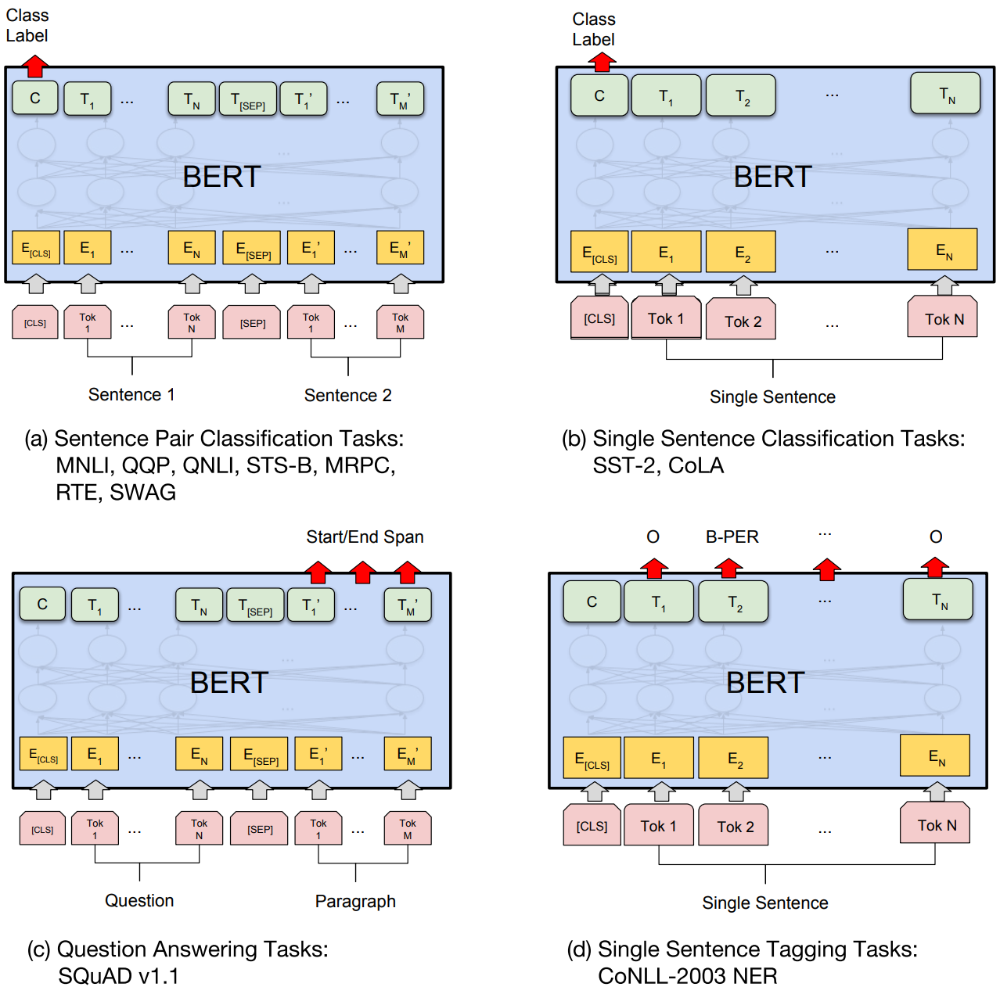

# 一、预训练模型

预训练模型是近年来深度学习领域最重要的突破之一，它通过“先学习通用知识，再迁移到具体任务”的方式，大大提升了各种任务的效率与效果。


## 1. 基本认知

先对预训练模型有个简单的认识

### 1.1 概念

Pretrained Model，预训练模型，是指在大规模数据集上提前训练好的模型，具备通用特征提取能力，可迁移到下游任务中进行微调。

### 1.2 思想

- 预训练：通过海量无监督文本数据的训练，获得语言中通用性的文法、语义和知识，得到一个基础模型。
- 微调：针对具体业务场景，通过少量语料，训练出一个具有针对性的可靠的模型。
- ==医疗、法律、编程、数学、翻译、金融等==

### 1.3 意义

- 从零开始训练代价高（数据、算力、时间）：一般的公司（1000人之下）承担不起  
- 通用知识可迁移，提升下游任务效果
- 适用于小样本学习、快速部署模型

### 1.4 发展历程

预训练的思想可以追溯到词向量模型的训练，通过无监督训练得到的词向量，学习到了大量的语义信息，最后发展到大语言模型。

| 年份 | 模型     | 关键创新点                   |
| ---- | -------- | ---------------------------- |
| 2013 | Word2Vec | 静态词向量，词义表示初步成功 |
| 2018 | ELMo     | 上下文相关词表示，基于BLSTM  |
| 2018 | BERT     | Masked LM，双向编码器  NSP   |
| 2019 | GPT-2    | 自回归建模，强文本生成能力   |
| 2020 | T5/BART  | 编码-解码结构，适配多任务    |
| 2022 | ChatGPT  | 大语言模型 LLM，支持对话交互 |

- BERT和GPT的出现，让预训练模式得到承认和发展，**预训练+Finetune**成为应用落地范式。
- LLM的出现进一步提升了该模式的效果和应用空间，具体体现为提示工程、agent思想等。

#### 1.4.1 预训练-词向量

词向量能够高效的学习到大量的语义信息，得到词汇的静态语义表征。

```bash
word2vec在语义上支持一些"线性的语义运算"，如"皇帝-皇后=男-女"
```


#### 1.4.2 预训练-ELMo

- 词向量模型属于静态表征，不能实现多义词的动态表征

- 在ELMo中，使用双向LSTM模型，达到动态表征的目的

  |  |
  | :----------------------------------------------------------: |
  |                            BiLSTM                            |

#### 1.4.3 预训练-GPT

OpenAl的GPT模型是基于Transformer的，已更新了6个版本，是预训练模型利器，在自然语言生成方面表现出众，可以说引领了AGI潮流。DeepSeek的出现则进一步激活了AGI的发展。

|  |  |
| :----------------------------------------------------------: | :----------------------------------------------------------: |
|                         开启AGI先河                          |                           完全开源                           |

#### 1.4.3 预训练-BERT

- BERT出自google，把预训练语言表示方法分为了基于特征的方法(代表ELMo)和基于微调的方法(代表OpenAIGPT)

- 使用双向语言模型作为任务，并证明其在NLP大部分的任务上效果更好。

  |  |
  | ------------------------------------------------------------ |
  | BERT模型建构                                                 |

  

### 1.5 应用场景

- NLP：文本分类、对话系统、机器翻译、问答系统
- CV：图像分类、目标检测、图像分割
- 多模态：图文检索、图文生成、视频理解
- 医疗领域：病灶检测、图像诊断
- 工业/机器人：感知与决策统一建模

### 1.6 核心技术机制

#### 1.6.1 自监督学习

Self-Supervised Learning

- 使用数据本身构造标签（如BERT的掩码语言模型）
- 无需人工标注，适合大规模训练

#### 1.6.2 微调

Fine-tuning

- 在目标任务上继续训练模型，提高效果
- 支持全量微调或参数高效微调（如LoRA）

#### 1.6.3 多模态建模
- 同时处理文本、图像、语音等多模态信息
- 示例：CLIP、GPT-4-Vision、Flamingo

### 1.7 发展趋势

- 模型规模持续扩大

   Qwen、DeepSeek、GPT-5、Grok5、Gemini、Qwen3(2350亿（220亿）、 4B)，参数超千亿

- 多模态统一模型

   图、文、音频、视频融合处理

- 推理与思维能力增强

   支持Chain-of-Thought、Tool-Use等能力

- 开源与社区驱动

   LLaMA、Mistral、BLOOM等推动学术发展

- 轻量化与个性化微调

   LoRA、QLoRA、Adapter提升部署灵活性


# 二、BERT

Bidirectional Encoder Representations from Transformers，是由Google在2018年提出的基于Transformer架构的预训练语言模型，能够生成对上下文都有深刻理解的词向量。

论文地址：https://arxiv.org/pdf/1810.04805


## 1. 核心思想

双向，预训练+微调。

### 1.1 Bidirectional

与传统单向语言模型（如GPT，left-to-right）不同，BERT通过掩码语言模型（MLM）同时利用左右两侧的上下文信息，更全面地理解单词含义。

举个例子：完形填空

``` css
“The man went to the [MASK] to buy some milk.” 
```

BERT可以从 “went to the”和“to buy some milk” 两边的信息推测出$[MASK]$是 “store”。  

### 1.2 预训练+微调


Pre-training + Fine-tuning 范式。BERT 分为两个阶段：

- 预训练：Pre-training，在大规模语料上学习通用语言表示。
- 微调：Fine-tuning，在具体任务（如情感分类、问答系统）上进行训练，只需少量数据即可获得较好效果。
- 预训练任务（如MLM和NSP）会强制模型学会两个能力：
  - 单句理解→通过MLM学习单词上下文语义。
  - 双句关系→通过NSP学习句子间逻辑。
  - 这种设计使得BERT在微调阶段能直接适配不同任务，无需修改模型结构。


## 2. 优势

- 强上下文理解能力：双向建模使得其理解力更强。
- 预训练迁移能力强：可以微调于各种NLP下游任务。
- 统一架构：一个模型可以处理分类、问答、文本蕴含等多种任务。


## 3. 模型结构

BERT完全基于**Transformer Encoder**，没有Decoder。

### 3.1 整体架构

|  |  |  |
| :----------------------------------------------------------: | :----------------------------------------------------------: | :----------------------------------------------------------: |
|                           模型结构                           |                             BASE                             |                            LARGE                             |

将多个 $encoder$ 堆叠起来，构成BERT的主体结构，加上输入和输出层，就是完整的BERT了;

### 3.2 模型参数

==主要参数如下：==

| 版本       | 层数（Layers） | 隐藏维度（Hidden Size） | 注意头数（Attention Heads） | 参数量 |
| ---------- | -------------- | ----------------------- | --------------------------- | ------ |
| BERT Base  | 12             | 768                     | 12                          | 110M   |
| BERT Large | 24             | 1024                    | 16                          | 340M   |


### 3.3 结构详解

假设这里有个具体的落地业务：范式 

|  |
| ------------------------------------------------------------ |

#### 3.3.1 输入


- 第一个输入字符是 $[CLS]$，这里的CLS表示分类，该分类token对应的最后一个Transformer层输出被用来起到聚集整个序列表征信息的作用，后面跟着序列输入。
- 通过自注意力机制，==允许它与所有其他token交互，从而能够聚合整个序列的全局信息==。
- BERT需要适应各种各样的自然语言任务。
- 模型输入的序列必须有能力包含一句话(文本情感分类，序列标注任务)或者两句话以上(文本摘要，自然语言推断，问答任务)。

#### 3.3.2 语句标识

如何让模型去区分句子A和句子B呢？这里有两种方式：


- 句子后面加入分割token $[SEP]$
- 加入可学习的分割Embedding，这样句子就是三种嵌入之和：
  - Token Embeddings：每个词（或子词）用 WordPiece 分词后转换为向量。
  - Segment Embeddings：区分句子A和句子B。
  - Position Embeddings：词的位置编码，这里是随机初始化后再学习更新。

#### 3.3.3 输出


- 有多少个输入，就有多少个输出。

- C为分类token($[CLS]$)对应最后一个Transformer的输出，$T_i$ 则代表其他token对应的最后一个Transformer输出。

  

## 4. 预训练任务

预训练任务共有MLM和NSP，两个任务是同时训练的。

### 4.1 MLM

|  |
| :----------------------------------------------------------: |
|                    Masked Language Model                     |

- 作用：帮助模型理解**词级别的上下文**，传说中的完形填空。

- 方法：随机将输入句子的 $15\%$ 词语替换为 `[MASK]`，训练模型预测这些被遮住的词。

  label:  watch

  label： surface

  label：not

  label: waiting

  label: moment

  ```txt
  Elias took the [MASK], feeling the faint vibration beneath its [MASK]. He had seen this before—too many times. It was [MASK] broken. It was locked, waiting for the right [MASK] to open a door to somewhere else.
  ```

  

- 存在的问题：

  ```asciiarmor
  由于[MASK]并不会出现在下游任务的微调（fine-tuning）阶段，因此预训练阶段和微调阶段之间产生了不匹配。
  ```

  - 80% 被 $[MASK]$

    ```css
    my dog is hairy-->my dog is [MASK]
    ```

  - 10% 被随机词

    ```css
    my dog is hairy-->my dog is apple
    ```

  - 10% 保留原词

    ```css
    my dog is hairy-->my dog is hairy
    ```

    

- 损失函数：针对被替换的 token 位置计算交叉熵损失

- 双向语言模型：前后的词都可以看到

### 4.2 NSP

|  |
| :----------------------------------------------------------: |
|                   Next Sentence Prediction                   |

- 作用：帮助模型理解**句子之间的关系**

  ```txt
  The rain had been falling all afternoon, tapping gently against the dusty windows of Elias Grey’s workshop.
  Inside, the air smelled faintly of oil and brass, and the ticking of a hundred clocks created a strange, hypnotic rhythm.
  
  Elias was not just a clockmaker—he was a guardian of time itself. Hidden behind a false panel in his workbench lay an intricate device no larger than a teacup. It hummed softly, glowing with a pale blue light.
  
  One stormy evening, a young woman named Clara entered his shop, clutching a broken pocket watch. Her eyes were wide, not with fear, but with the weight of a question she couldn’t yet ask.
  “This belonged to my father,” she said quietly. “He disappeared the night it stopped ticking.”
  
  Elias took the watch, feeling the faint vibration beneath its surface. He had seen this before—too many times. It was not broken. It was locked, waiting for the right moment to open a door to somewhere else.
  ```

  

- 方法：模型输入是两个句子
  - $50\%$ 是实际的连续句子（真实的上下文）
  - $50\%$ 是语料库中随机选的一句（非上下文）
  
- 损失函数：用 $[CLS]$ token的输出进行二分类（IsNext/NotNext）

### 4.3 总损失

任务是同时训练的，总损失是两个任务损失之和：
$$
\text {Loss\_total} = Loss\_{MLM} + Loss\_{NSP}
$$

### 4.4 案例助解

两个任务所需数据都可以从无标签的文本数据中构建(自监督性质)，无需做标注。

这里我们举2个例子，说明下输入及其对应的任务需要进行的处理。

**Input1**

```asciiarmor
[CLS]the man went to [MASK] store [SEP] he bought a gallon [MASK] milk [SEP]
Label1=lsNext
```

**Input2**

```asciiarmor
[CLS]the man [MASK] to the store [SEP] penguin [MASK] are flight ##less birds [SEP]
Label2=NotNext
```


## 5. 下游任务

BERT在预训练之后，可以被用于各种NLP下游任务，这也是他强大的地方：**一次预训练，多处应用**。

==比如：==情感分类、文本分类、命名实体识别NER、阅读理解、特征可以做下采样、分词、词性标注等




### 5.1 句子级任务

- 情感分析（Positive / Negative）
- 新闻分类
- 意图识别
- 虚假新闻识别

输入格式：

```css
[CLS] 句子 [SEP]
```

使用 $[CLS]$ 位置输出的向量接一个 **分类器（全连接层 + SoftMax）** 进行训练。


### 5.2 句对级任务

判断两个句子关系

- 自然语言推理（NLI）
- 问题匹配 / 句子相似度（如QQP）
- 问答系统中的“是不是回答了问题”任务
- 文本检索排序（ranking）

输入格式：

```css
[CLS] 句子A [SEP] 句子B [SEP]
```

模型将两个句子拼接起来，句子A和B使用不同的 Segment ID。$[CLS]$ 输出用于二分类或多分类。


### 5.3 标注级任务

序列标注

- 命名实体识别（NER）
- 词性标注（POS）
- 关键词抽取

输入格式：

```css
[CLS] 我 爱 北京 天安门 [SEP]
```

BERT 输出的是每个 token 的向量，后面接一层分类器，对每个位置输出一个标签（比如 BIO 格式）：

```
[O] [O] [B-LOC] [I-LOC]
```

### 5.4 问答类任务

抽取式

- 抽取式问答（如 SQuAD）
- 文本中找出答案所在片段

输入格式：

```css
[CLS] 问题 [SEP] 文章内容 [SEP]
```

模型输出：

- 每个 token 的起始概率和结束概率
- 选出最大概率 span 作为答案


### 5.5 文本生成类

需要配合Decoder


## 6. 使用方式

预训练后的 BERT 常见的使用方式有两种：

- Fine-tune整个模型

  在特定任务的数据上继续训练，微调所有参数

- Frozen BERT + 上层新网络

  保持 BERT 参数不变，仅训练自己新加的分类层，适用于小数据。


# 三、BERT实战

以文本分类为例展示文本分类的实现

## 1. 模型结构


基本流程如下：

- 数据预处理
- tokenizer初始化
- 模型初始化
- 优化器等初始化
- 模型训练
- 模型保存与评估

## 2. 环境准备

这里我们使用主流的transformers库。transformers库是由Hugging Face开发和维护的开源库，专注于自然语言处理（NLP）领域的预训练模型（如BERT、GPT、T5等）。

官方文档：https://huggingface.co/docs/transformers/index

```bash
pip install transformers
```


## 3. 预训练词表

预训练词表模型地址：https://huggingface.co/models

```python
import torch
from transformers import BertTokenizer

if __name__ == "__main__":
    tokenizer = BertTokenizer.from_pretrained(
        "bert-base-chinese",
        cache_dir="./chinese",
        do_lower_case=False,
    )
    print(tokenizer)

```

更多Tokenizer自行搜索即可~

### 3.1 开源tokenizer

| 模型名                    | 描述                          |
| ------------------------- | ----------------------------- |
| `bert-base-uncased`       | 英文 BERT（小写字母，最常用） |
| `bert-base-chinese`       | 中文 BERT，支持中文分词       |
| `distilbert-base-uncased` | 轻量化的 BERT                 |

### 3.2 医学领域

| 模型名                                   | 描述                                                      |
| ---------------------------------------- | --------------------------------------------------------- |
| `trueto/medbert-base-wwm-chinese`        | 基于中文医学语料训练的 BERT，适合医学问答、命名实体识别等 |
| `iioSnail/bert-base-chinese-medical-ner` | 能够识别医疗相关的实体，如疾病、药物等                    |

### 3.3 中文法律

| 模型名             | 描述                                                      |
| ------------------ | --------------------------------------------------------- |
| `thunlp/Lawformer` | 清华大学推出的法律专用 BERT，对法律条文、案件文本表现优异 |


## 4. 切词实现

有了词典就可以开始切词了

### 4.1 基本操作

官方文档：https://huggingface.co/docs/transformers/main_classes/tokenizer#transformers.PreTrainedTokenizer.__call__

```python
from transformers import BertTokenizer

if __name__ == "__main__":
    tokenizer = BertTokenizer.from_pretrained(
        "bert-base-chinese",
        cache_dir="./chinese",
        do_lower_case=False,
    )
    sentence = "新冠病毒是一种新型冠状病毒"
    token_result = tokenizer(sentence)
    print(token_result)
```

输出：

```bash
{'input_ids': [101, 3173, 1094, 4567, 3681, 3221, 671, 4905, 3173, 1798, 1094, 4307, 4567, 3681, 102], 'token_type_ids': [0, 0, 0, 0, 0, 0, 0, 0, 0, 0, 0, 0, 0, 0, 0], 'attention_mask': [1, 1, 1, 1, 1, 1, 1, 1, 1, 1, 1, 1, 1, 1, 1]}
```

- input_ids

  - 包括开始和结束标记的序列id；
  - 101 是 `[CLS]`（分类符）；

  - 102 是 `[SEP]`（分句符）；

- token_type_ids
  - 用于区分句子 A 和句子 B；
  - 适用于句对任务；
- attention_mask
  - 告诉模型哪些token是有效的、哪些是padding的；
  - 1 → 有效的token；
  - 0 →padding的token；

### 4.2 ids解码

解码ids映射的词：

```python
tokenizer.decode(token_result["input_ids"])
```

解码结果：

```bash
[CLS] 新 冠 病 毒 是 一 种 新 型 冠 状 病 毒 [SEP]
```

这样子更直观了。

### 4.3 上下句切词

Tokenizer支持一次输入两个句子，尤其是BERT模型，它本来就设计用于句对任务，如句子相似度判断、自然语言推理等。

```python
from transformers import BertTokenizer


if __name__ == "__main__":
    tokenizer = BertTokenizer.from_pretrained(
        "bert-base-chinese",
        cache_dir="./chinese",
        do_lower_case=False,
    )
    sentence = "床前明月光 疑是地上霜".split()
    result = tokenizer(text=sentence[0], text_pair=sentence[1])
    print(result)
    print(tokenizer.decode(result["input_ids"]))
```

==输出结果：==

```bash
{'input_ids': [101, 2414, 1184, 3209, 3299, 1045, 102, 4542, 3221, 1765, 677, 7458, 102], 'token_type_ids': [0, 0, 0, 0, 0, 0, 0, 1, 1, 1, 1, 1, 1], 'attention_mask': [1, 1, 1, 1, 1, 1, 1, 1, 1, 1, 1, 1, 1]}
[CLS] 床 前 明 月 光 [SEP] 疑 是 地 上 霜 [SEP]
```

### 4.5 批次切词

对多个句子进行批量切词

```python
from transformers import BertTokenizer

# 加载中文BertTokenizer
tokenizer = BertTokenizer.from_pretrained(
    "bert-base-chinese",
    cache_dir="./chinese",
    do_lower_case=False,
)

if __name__ == "__main__":
    # 中文句子示例
    sentences = [
        "今天天气真好",
        "自然语言处理是人工智能的重要领域。",
        "BERT模型在多项NLP任务中表现出色。",
        "深度学习需要大量的数据和计算资源。",
    ]
    result = tokenizer(
        sentences,
        padding=True,
        truncation=True,
        max_length=64,
        return_tensors="np", # 是否返回张量
        return_token_type_ids=True,
        return_length=True,
    )
    print(result)
    print(tokenizer.decode(result["input_ids"][0]))

```

输出：

```bash
{
	'input_ids': array([
	   [ 101,  791, 1921, 1921, 3698, 4696, 1962,  102, 0, 0, 0, 0, 0, 0, 0, 0, 0, 0, 0],
       [ 101, 5632, 4197, 6427, 6241, 1905, ......,.....,.....,.....,......,  511,  102],
       [ 101,  100, 3563, ......,.....,.....,.....,......, 5682,  511,  102,    0,    0],
       [ 101, 3918, 2428, 2110,  ......,.....,.....,.....,......, 598, 3975,  511,  102]
	]), 
	'token_type_ids': array([
		[0, 0, 0, 0, 0, 0, 0, 0, 0, 0, 0, 0, 0, 0, 0, 0, 0, 0, 0],
       	[0, 0, 0, 0, 0, 0, 0, 0, 0, 0, 0, 0, 0, 0, 0, 0, 0, 0, 0],
       	[0, 0, 0, 0, 0, 0, 0, 0, 0, 0, 0, 0, 0, 0, 0, 0, 0, 0, 0],
       	[0, 0, 0, 0, 0, 0, 0, 0, 0, 0, 0, 0, 0, 0, 0, 0, 0, 0, 0]
    ]),
	'length': array([ 8, 19, 17, 19]), 
	'attention_mask': array([
			[1, 1, 1, 1, 1, 1, 1, 1, 0, 0, 0, 0, 0, 0, 0, 0, 0, 0, 0],
       		[1, 1, 1, 1, 1, 1, 1, 1, 1, 1, 1, 1, 1, 1, 1, 1, 1, 1, 1],
       		[1, 1, 1, 1, 1, 1, 1, 1, 1, 1, 1, 1, 1, 1, 1, 1, 1, 0, 0],
       		[1, 1, 1, 1, 1, 1, 1, 1, 1, 1, 1, 1, 1, 1, 1, 1, 1, 1, 1]
     ])
}
[CLS] 今 天 天 气 真 好 [SEP] [PAD] [PAD] [PAD] [PAD] [PAD] [PAD] [PAD] [PAD] [PAD] [PAD] [PAD]
```


## 5. 词表更新

如果想加入自己的自定义词表，如一些专有名词、医学术语等，可以按照以下步骤进行扩展。

### 5.1 词表准备

假设如下词表：

```text
["新冠病毒", "高血压", "脑梗塞"]
```

### 5.2 加载tokenizer

```python
from transformers import BertTokenizer

# 加载原始 tokenizer（从本地或在线都行）
tokenizer = BertTokenizer.from_pretrained('./bert_tokenizer_local')
```

### 5.3 自定义词汇表

```python
# 自定义词汇列表
new_tokens = ["新冠病毒", "高血压", "脑梗塞"]
```

### 5.4 添加新词

```python
# 添加词汇（会自动去重）
num_added_tokens = tokenizer.add_tokens(new_tokens)
print(f"新增词数量：{num_added_tokens}")
```

可以把词表保存成一个文本文件，再统一加入：

```python
# 假设你有一个文件 custom_vocab.txt，每行一个词
with open("custom_vocab.txt", "r", encoding="utf-8") as f:
    new_tokens = [line.strip() for line in f.readlines()]
tokenizer.add_tokens(new_tokens)
```

==注：==添加完之后 `tokenizer.vocab_size` 不会变，但 `tokenizer.get_vocab()` 会变。可以用 `len(tokenizer)` 查看新词总量

### 5.5 resize模型词表

如果你用 `BertModel` 或 `BertForSequenceClassification`，要调整模型的词表大小：

```python
from transformers import BertModel

model = BertModel.from_pretrained('./bert_model_local')  # 或使用预训练模型名
model.resize_token_embeddings(len(tokenizer))  # 非常重要！
```

### 5.6 验证新词

```python
tokens = tokenizer.tokenize("新冠病毒是一种新型冠状病毒")
ids = tokenizer.convert_tokens_to_ids(tokens)
print(tokens, ids)
```

加入成功后，"新冠病毒"会被当作一个整体token，而不是被切分成字或子词。


## 6. 获取词表

```python
#查看你加的词是否真的在 vocab 中
vocab = tokenizer.get_vocab() #获取词表
print("新冠病毒" in vocab)  # True
print(vocab["新冠病毒"])    # 输出其token id
```


## 7. BERT模型

文档：https://huggingface.co/docs/transformers/main/en/model_doc/bert#transformers.BertModel.forward

```python
from transformers import BertTokenizer, BertModel
import os
import torch

CURRENT_DIR = os.path.dirname(os.path.abspath(__file__))
if __name__ == "__main__":
    tokenizer = BertTokenizer.from_pretrained(
        "bert-base-chinese",
        cache_dir="./chinese",
        do_lower_case=False,
    )
    sentence = "今天天气不错"
    token_result = tokenizer(sentence)
    print(token_result)

    # 导入预训练模型
    model = BertModel.from_pretrained(
        "bert-base-chinese",
        cache_dir=os.path.join(CURRENT_DIR, "model"),
    )

    # 输出
    out = model(
        input_ids=torch.tensor(token_result.get("input_ids")).unsqueeze(0),
        attention_mask=torch.tensor(token_result.get("attention_mask")).unsqueeze(0),
        token_type_ids=torch.tensor(token_result.get("token_type_ids")).unsqueeze(0),
    )
    print(out.last_hidden_state)

```


## 8.预训练+微调项目实战

基于BERT的情感分析项目实战

### 8.1 数据集

数据集：CSV，某外卖平台收集的用户评价，正向4000条，负向约8000条。

```python
import torch
import torch.nn as nn
import torch.nn.functional as F
from torch.optim import AdamW
from torch.utils.data import random_split, Dataset
import pandas as pd
import numpy as np
from transformers import BertTokenizer, BertModel
import os

CURRENT_DIR = os.path.dirname(os.path.abspath(__file__))


class OutSellDataset(Dataset):
    def __init__(self, filepath):
        self.dataset = pd.read_csv(filepath)

    def __len__(self):
        return len(self.dataset)

    def __getitem__(self, i):
        text = self.dataset.review[i]
        label = self.dataset.label[i]
        return text, label


if __name__ == "__main__":
    ds_path = os.path.join(CURRENT_DIR, "datasets", "waimai.csv")
    df = pd.read_csv(ds_path)
    print(df.head())
    print(df.info())
    print(df.label.view().value_counts())
    print(df.review.view())

    datasets = OutSellDataset(ds_path)
    print(datasets[0])
    # 数据集划分
    train_size = int(len(datasets) * 0.8)
    test_size = len(datasets) - train_size

    # 随机划分数据集
    generator = torch.Generator().manual_seed(666)  # 设置随机种子
    train_dataset, test_dataset = random_split(
        datasets, [train_size, test_size], generator=generator
    )
    print(len(train_dataset), len(test_dataset))

```


### 8.2 数据加载器

主要是数据整理函数 $collate\_fn$ 的定义。

#### 8.2.1 预训练词典

```python
tokenizer = BertTokenizer.from_pretrained(
    "bert-base-chinese",
    cache_dir=os.path.join(CURRENT_DIR, "chinese"),
    do_lower_case=False,
)
device = torch.device("cuda:0" if torch.cuda.is_available() else "cpu")
```

#### 8.2.2 整理函数

```python
def collate_fn(data):
    sents = [i[0] for i in data]
    labels = [i[1] for i in data]
    # 编码
    data = tokenizer(
        text=sents,
        truncation=True,
        padding="max_length",
        max_length=500,
        return_tensors="pt",
        return_length=True,
    )
    # input_ids:编码之后的数字
    # attention_mask:补零的位置是0, 其他位置是1
    input_ids = data["input_ids"]
    attention_mask = data["attention_mask"]
    token_type_ids = data["token_type_ids"]
    labels = torch.LongTensor(labels)
    # 把数据移动到计算设备上
    input_ids = input_ids.to(device)
    attention_mask = attention_mask.to(device)
    token_type_ids = token_type_ids.to(device)
    labels = labels.to(device)
    return input_ids, attention_mask, token_type_ids, labels
```

#### 8.2.3 加载器构建

```python
train_dl = DataLoader(
    dataset=train_dataset,
    batch_size=16,
    collate_fn=collate_fn,
    shuffle=True,
    drop_last=True,
)
test_dl = DataLoader(
    dataset=test_dataset,
    batch_size=16,
    collate_fn=collate_fn,
    drop_last=True,
)
```


### 8.3 模型初始化

初始化一个中文模型

#### 8.3.1 预训练模型

导入预训练模型：

```python
    # 导入预训练模型
    model = BertModel.from_pretrained(
        "bert-base-chinese",
        cache_dir=os.path.join(CURRENT_DIR, "model"),
    ).to(device)
    # 打印参数量
    print(sum(p.numel() for p in model.parameters()))
    # 输出
    out = model(
        input_ids=input_ids,
        attention_mask=attention_mask,
        token_type_ids=token_type_ids,
    )
    print(out.last_hidden_state.shape)
```

输出： [批大小, 序列长度, 隐藏维度]

```bash
torch.Size([16, 500, 768])
```


#### 8.3.2 模型冻结

```python
# 预训练模型进行冻结
for param in model.parameters():
    param.requires_grad = False
```


#### 8.3.3 创建分类模型

把[CLS]信息拿来作为分类输入

```python
class Model(nn.Module):
    def __init__(self):
        super().__init__()
        self.fc = torch.nn.Linear(768, 2)

        def forward(self, input_ids, attention_mask, token_type_ids):
            # 使用预训练模型抽取数据特征
           with torch.no_grad():
                out = model(
                    input_ids=input_ids,
                    attention_mask=attention_mask,
                    token_type_ids=token_type_ids,
                )
            # 对抽取的特征只取第1个字的结果做分类即可
            logits = self.fc(out.last_hidden_state[:, 0])
            return logits
```

使用该模型：

```python
logmodel = Model().to(device)
output = logmodel(input_ids, attention_mask, token_type_ids)
print(output)
```

输出：

```bash
tensor([[-0.0038,  0.4034],
        [ 0.1337,  0.4148],
      	......
        [ 0.2097,  0.4124],
        [ 0.1420,  0.5476]], device='cuda:0', grad_fn=<AddmmBackward0>)
```

### 8.4 模型训练

常规的模型训练

#### 8.4.1 训练代码

```python
    loss_fn = nn.CrossEntropyLoss()
    optimizer = AdamW(logmodel.parameters(), lr=2e-4, eps=1e-8)
    scheduler = torch.optim.lr_scheduler.StepLR(optimizer, step_size=10, gamma=0.5)

    def train(dataloader):
        (total_acc, total_count, total_loss) = (0, 0, 0)
        logmodel.train()
        for text, mask, type_ids, label in dataloader:
            optimizer.zero_grad()
            predicted_label = logmodel(
                text, token_type_ids=type_ids, attention_mask=mask
            )
            loss = loss_fn(predicted_label, label)
            loss.backward()
            optimizer.step()
            with torch.no_grad():
                total_acc += (predicted_label.argmax(1) == label).sum().item()
                total_count += label.size(0)
                total_loss += loss.item() * label.size(0)
        return total_loss / total_count, total_acc / total_count

    def test(dataloader):
        logmodel.eval()
        (total_acc, total_count, total_loss) = (0, 0, 0)

        with torch.no_grad():
            for text, mask, type_ids, label in dataloader:
                predicted_label = logmodel(
                    text, token_type_ids=type_ids, attention_mask=mask
                )
                loss = loss_fn(predicted_label, label)
                total_acc += (predicted_label.argmax(1) == label).sum().item()
                total_count += label.size(0)
                total_loss += loss.item() * label.size(0)
        return total_loss / total_count, total_acc / total_count

    # 开始训练
    epochs = 3

    train_loss = []
    train_acc = []
    test_loss = []
    test_acc = []

    for epoch in range(epochs):
        epoch_loss, epoch_acc = train(train_dl)
        epoch_test_loss, epoch_test_acc = test(test_dl)
        train_loss.append(epoch_loss)
        train_acc.append(epoch_acc)
        test_loss.append(epoch_test_loss)
        test_acc.append(epoch_test_acc)
        scheduler.step()
        template = (
            "epoch:{:2d}, train_loss: {:.5f}, train_acc: {:.1f}% ,"
            "test_loss: {:.5f}, test_acc: {:.1f}%"
        )
        print(
            template.format(
                epoch + 1,
                epoch_loss,
                epoch_acc * 100,
                epoch_test_loss,
                epoch_test_acc * 100,
            )
        )
    print("Done!")
```


#### 8.4.2 训练结果

还是预训练模型厉害，一下子干到80%以上，开启全微调直接干到90%以上。

```css
epoch: 8, train_loss: 0.29449, train_acc: 88.3% ,test_loss: 0.27036, test_acc: 90.3%
......
epoch:11, train_loss: 0.29377, train_acc: 88.3% ,test_loss: 0.25661, test_acc: 91.1%
epoch:12, train_loss: 0.22314, train_acc: 91.7% ,test_loss: 0.24930, test_acc: 90.9%
epoch:13, train_loss: 0.19583, train_acc: 92.7% ,test_loss: 0.24496, test_acc: 91.6%
epoch:14, train_loss: 0.16648, train_acc: 93.9% ,test_loss: 0.25752, test_acc: 91.6%
epoch:15, train_loss: 0.13599, train_acc: 95.2% ,test_loss: 0.27480, test_acc: 91.3%
epoch:16, train_loss: 0.11075, train_acc: 96.3% ,test_loss: 0.30553, test_acc: 91.2%
```


