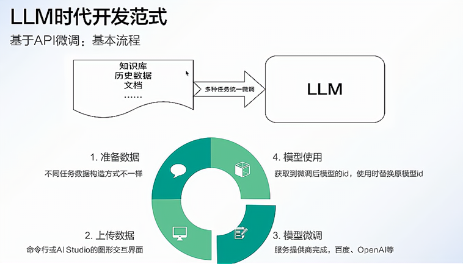
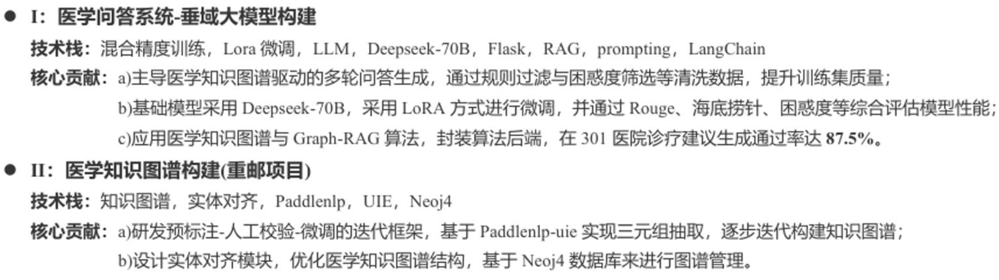
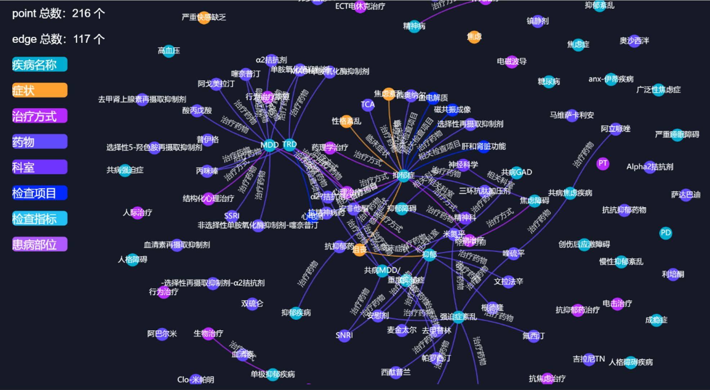
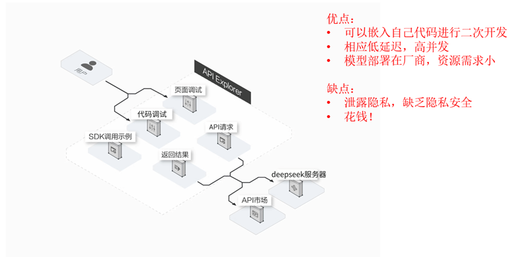
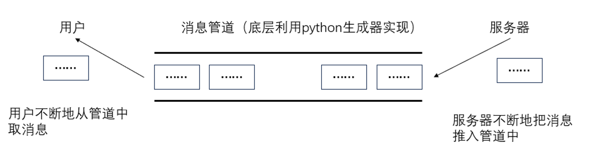
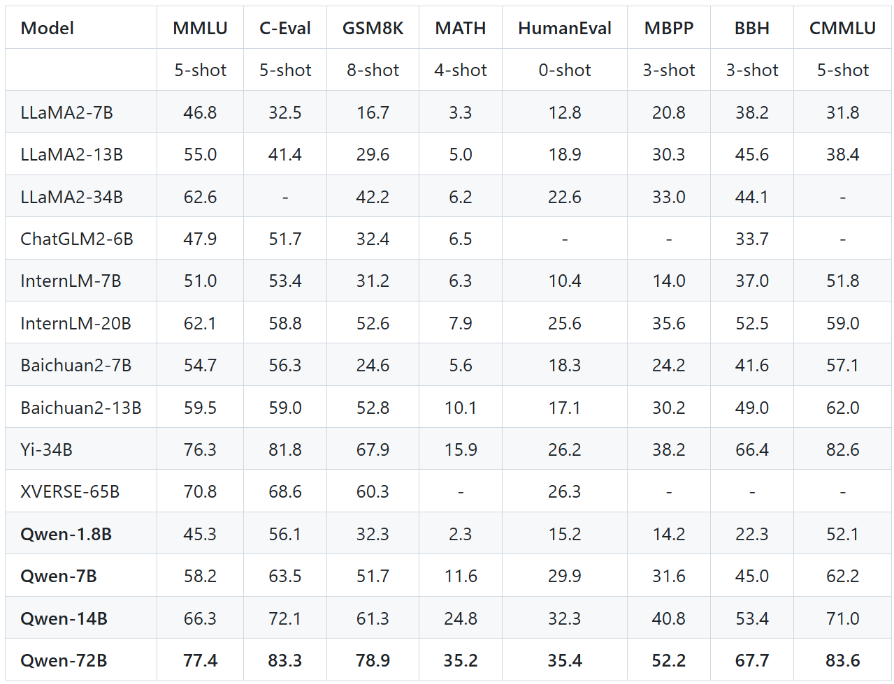
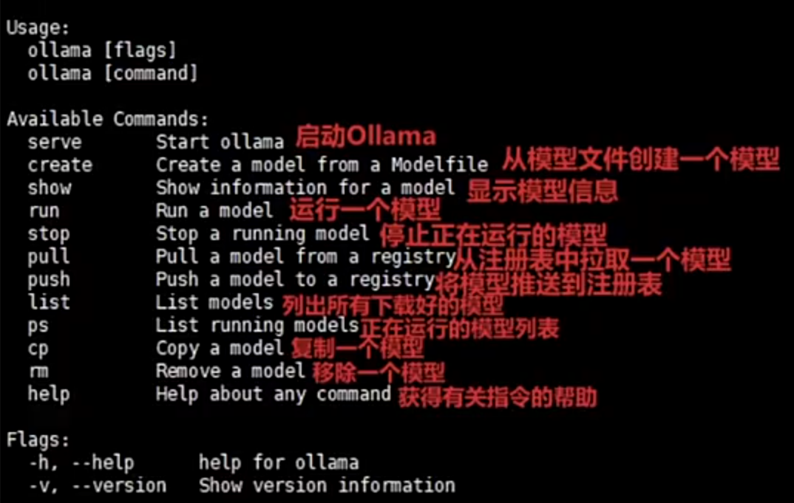
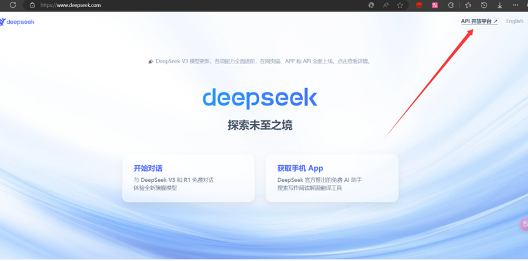
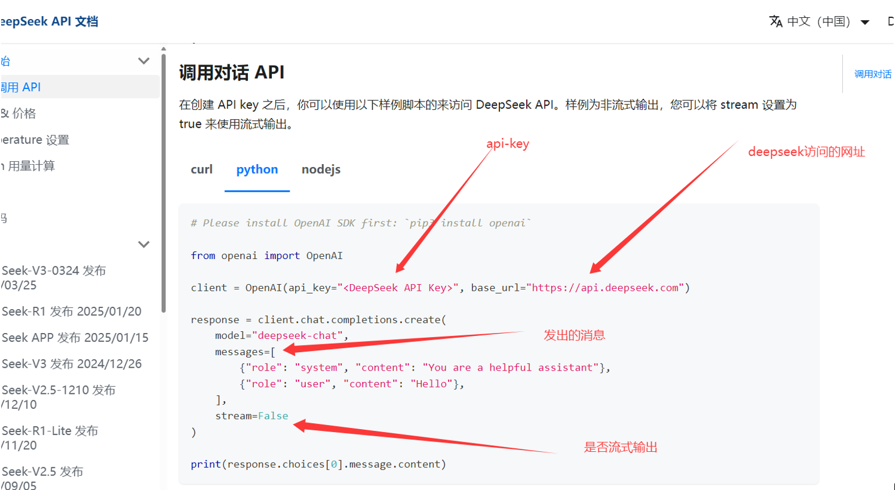

# 一、大模型

T5\BERT\GPT → Transformer的儿子→自注意力机制+神经网络

大模型， Large Model，是指参数规模庞大、训练数据量巨大、具有强泛化能力的人工智能模型，典型代表如GPT、BERT、PaLM等。它们通常基于深度神经网络，特别是Transformer架构，在自然语言处理、图像识别、代码生成等任务中表现出色。


## 1.  基本概念


大模型是指在超大规模数据集上训练、拥有数十亿到千亿以上参数的人工智能模型，具备多任务、多模态能力，并能通过少量样本甚至零样本完成新任务。

## 2. 主要特征

大模型具备以下特征：

- 参数规模大
  数亿至数千亿参数，容量决定了模型的表达与泛化能力。
- 数据训练量大
  利用海量文本、图像、音频等多模态数据训练，提升模型的通用性。
- 基于Transformer
  多数大模型采用Transformer作为基础结构，具备强大的表示学习能力。
- 强泛化与迁移能力
  一次训练，多场景复用（如ChatGPT既能对话，也能写代码、改文案）。
- 具备“涌现能力”
  模型规模突破某个阈值后，表现出超越训练目标的智能行为（如逻辑推理、复杂生成）。
- 可调优能力强
  支持微调（Fine-tuning）、提示学习（Prompt Learning）、参数高效调优（LoRA、Adapter等）。
- 多模态发展趋势
  从纯文本模型发展到图文、语音、视频等多模态大模型，如GPT-4V、DeepSeek、Grok等


## 3. 应用方向

1. **Agent智能体（AI管家）**
   - **概念**：像一个“全能私人助理”，能自己分析问题、拆解任务、调用工具解决问题。
   - **例子**：你想周末去露营，告诉它：“帮我找个离市区近、能带宠物、有烧烤区的露营地，订周六的房间，再推荐附近超市买食材。”它自动完成：搜攻略 → 筛选地点 → 查天气 → 订营地 → 生成购物清单 → 发到你手机。
   - **好处**：不用自己一步步操作，AI能“动脑子”帮你搞定复杂任务。
   - **流程**：用户输入 -> 拆解任务 -> 意图识别 -> 调用对应的函数并执行 -> 完成执行

2. **语音聊天助手（会聊天的AI）**
   - **概念**：像“升级版Siri”，能自然对话、理解语气，甚至模拟真人情感。
   - **例子**：你开车时说：“我好困啊，来点提神的音乐，再导航到最近的咖啡店。”它回答：“马上切到摇滚歌单！前方500米有星巴克，要帮你点一杯冰美式吗？”（还能学你喜欢的说话风格）
   - **好处**：不用打字，动动嘴就能聊天、查信息、控制智能家居，像有个“随身陪聊”。
   - **流程**：语音输入 -> 语音识别转文字 -> 大模型对话 -> 文本转语音 -> 完成对话

3. **医学客服（AI健康小助手）**
   - **概念**：医院的“虚拟前台”，能解答常见问题、提醒用药、分诊建议。
   - **例子**：你半夜胃疼，打开医院APP问：“吃了火锅后胃痛，该挂哪个科？现在能吃什么药缓解？”AI回答：“建议挂消化内科，暂时可服用XX药（非处方）。若呕吐加重，请立即急诊。”并推送附近24小时药店。
   - **好处**：24小时在线，快速解答小毛病，避免排队问医生，隐私问题也能匿名咨询。
   - **流程**：问题输入 -> 检索知识库 -> 问题拼接 -> 大模型对话 -> 给予回复

## 4. 开发流程



大模型开发是一个系统工程，涉及数据、模型、算力、训练、部署、安全与迭代等多个环节。

- **任务定义与需求分析**
  - 明确应用场景（如对话、写作、推荐、图像识别等）
  - 选择模型类型（NLP、CV、多模态等）
- **数据准备与预处理**
  - 收集高质量、大规模数据（文本、图像、音频等）
  - 去噪清洗、标注、格式转换、去重与分词等
- **模型设计与选择**
  - 选择合适的模型架构（如GPT、BERT、ViT、T5等）
  - 设定层数、宽度、注意力机制等结构参数
- **训练策略与资源配置**
  - 分布式训练/混合精度训练
  - 使用大规模算力资源（GPU/TPU集群）
  - 设置优化器（AdamW）、学习率调度等参数
- **评估与调优**
  - 评估指标：PPL、准确率、BLEU、ROUGE、F1等
  - 微调/指令调优（Instruction tuning）/RLHF等方法提升效果
- **推理部署与压缩优化**
  - 部署到服务器或边缘端（云部署、API服务）
  - 模型量化、裁剪、蒸馏、MoE等手段提升推理效率
- **安全机制与合规检测**
  - 防止生成有害/敏感内容
  - 对输出进行内容审查、对抗样本防御、模型水印等
- **持续迭代与生态构建**
  - 基于用户反馈持续优化
  - 构建插件系统、开发者平台等生态体系

## 5. 关键要点

- 在大模型应用开发时，不会从头开始构建一个新的模型，基于已有基座模型进行二次开发是行业主流实践。

- 选用已有的基座模型，并采用相应的技术手段优化大模型，如：微调，RAG，并行推理等。
- 选用流行且成熟的框架，通过参数调整和功能集成实现业务需求，避免重复造轮子。

## 6. 项目介绍

- 简历

  

- 项目框架

  

- 三个模块

  - 大语言模型(LLM)--实现大语言模型的对话功能：大模型的本地部署，微调训练，流式对话，多轮对话。
  - RAG技术--增强大语言模型的对话能力：文本分割，文本嵌入，知识检索
  - 知识图谱--实现数据的高效存储：neo4j数据库，三元组抽取，实体对齐

- 项目展示

  |  |
  | ------------------------------------------------------------ |
  |  |

  

# 二、LLM

开始实际案例的展示......

## 1. API调用

大模型通过API调用是目前最常见、最便捷的使用方式，用户无需训练模型，只需调用接口即可享受强大的 AI 能力，比如文本生成、翻译、图像识别、代码补全等。

### 1.1 基本流程

- **获取 API 权限**
  - 注册平台账号（如 OpenAI、DeepSeek、阿里通义、讯飞星火等）
  - 获取 `API Key` 或 `Access Token`
- **准备请求参数**
  - 选择模型
  - 设置请求体
- **发起 API 请求**
  - 使用编程语言（如 Python、JavaScript）通过 HTTP 协议调用接口
- **解析响应结果**
  - 获取模型返回内容（如文本、图片链接、结构化数据等）
  - 可与前端、应用系统集成使用

### 1.2 基本特征



大模型API调用将复杂的模型能力简化为标准化服务，核心价值在于：

- 降低使用门槛：无需本地部署千亿参数模型，节省硬件与运维成本。

- 灵活适配场景：通过参数调节和上下文学习快速满足业务需求。

- 规模化支持：依托云计算实现高可用、低延迟的企业级服务。


### 1.3 DeepSeek实操

DeepSeek作为国内优秀的LLM平台，是一个不错的选择~

#### 1.3.1 准备工作

- 访问deepseek官网，并注册账号：[DeepSeek官网](https://www.deepseek.com/)

- 注册账号并且充值

- 创建API-key

  ==仅在创建时可见可复制==

- 查看使用手册

  

#### 1.3.2 非流式输出

 等模型生成完整结果后一次性返回，适合短文本、结构化内容提取等任务。

- 特点

  - 优点：

    - 使用简单，**一次性拿到完整结果**

    - 适合分析处理、摘要抽取、短文本问答等

  - 缺点：

    - 响应时间长，特别是文本很长时

    - 体验较差，用户需要等待全部生成完才能看到内容

- 环境安装

  ```bash
  pip install openai
  ```

- 非流式输出

  ```python
  # Please install OpenAI SDK first: `pip3 install openai`
  from openai import OpenAI
  
  client = OpenAI(
      api_key="sk-f9deff6faca64899a3faaaf1f4c53d1d", base_url="https://api.deepseek.com"
  )
  
  response = client.chat.completions.create(
      model="deepseek-chat",
      messages=[
          {"role": "system", "content": "You are a helpful assistant"},
          {"role": "user", "content": "明月几时有"},
      ],
      stream=False,
  )
  
  print(response.choices[0].message.content)
  
  ```

- 输出结果

  ```bash
  “明月几时有”是苏轼《水调歌头·明月几时有》中的名句，全文如下：
  
  **《水调歌头·明月几时有》**  
  明月几时有？把酒问青天。  
  不知天上宫阙，今夕是何年。  
  我欲乘风归去，又恐琼楼玉宇，高处不胜寒。  
  起舞弄清影，何似在人间。  
  
  转朱阁，低绮户，照无眠。
  不应有恨，何事长向别时圆？
  人有悲欢离合，月有阴晴圆缺，此事古难全。
  但愿人长久，千里共婵娟。
  
  ### 赏析：
  1. **背景**：此词作于宋神宗熙宁九年（1076年）中秋，苏轼在密州（今山东诸城）任职时，怀念弟弟苏 辙而写。
  2. **情感**：以月起兴，围绕中秋明月展开想象，交织人间情怀与宇宙哲思，既有对亲人的思念，又有对 人生无常的豁达。
  3. **名句**：
     - “人有悲欢离合，月有阴晴圆缺”道出世事无常的常态。
     - “但愿人长久，千里共婵娟”成为表达远方亲友平安共勉的千古绝唱。
  
  
  ### 小知识：
  这首词被誉为“中秋词之冠”，后曾被改编为经典歌曲（如王菲演唱的《但愿人长久》）。若您想进一步探讨其文学手法或创作背景，可以随时告诉我！
  ```

  

#### 1.3.3 流式输出

 服务器将响应内容一段一段地实时返回，适合长文本、对话、写作等需要即时反馈的场景。

- 特点

  - 优点

    - **响应快**：无需等全部生成完毕，先生成先返回

    - **体验佳**：像人打字一样流畅，常用于对话机器人

    - **可中断**：用户可随时打断流式响应过程

  - 缺点

    - 编程稍复杂，需要处理数据流拼接

    - 不易直接使用普通 HTTP 请求工具（如 Postman）

- 原理

  

- 流式推理的实现—生成器

  ```python
  import time
  
  def test():  # 生成器函数
      for i in range(10):
          time.sleep(1)
          yield i  # 生成器函数，使用yield关键字返回值
  
  if __name__ == "__main__":
      aaa = test()
      print(aaa)  # aaa是一个生成器，可以想象成一个队列，每读取一次，就会执行一次函数体
      for a in aaa:
          print(a)  # 读取生成器中的值
  ```

- 流式推理代码编写：

  ```python
  from openai import OpenAI
  
  client = OpenAI(
      api_key="sk-f9deff6faca64899a3faaaf1f4c53d1d", base_url="https://api.deepseek.com"
  )
  
  response = client.chat.completions.create(
      model="deepseek-chat",
      messages=[
          {"role": "system", "content": "You are a helpful assistant"},
          {"role": "user", "content": "明月几时有"},
      ],
      stream=True,
  )
  
  # 流式输出
  out = []
  for chunk in response:
      print(chunk.choices[0].delta.content)
      out.append(chunk.choices[0].delta.content)
      print('-' * 10)
      print(''.join(out))
  
  ```


#### 1.3.4 总结对比

| 项目       | 流式输出           | 非流式输出           |
| ---------- | ------------------ | -------------------- |
| 返回方式   | 边生成边返回       | 全部生成后一次返回   |
| 响应速度   | 快                 | 慢（尤其是长文本）   |
| 使用体验   | 更自然（打字式）   | 等待过程较长         |
| 编程复杂度 | 稍复杂（需拼接）   | 简单                 |
| 适用场景   | 对话生成、直播问答 | 简短回复、结构化处理 |


#### 1.3.5 代码封装

将代码封装为类，方便其他文件调用此功能。

**非流式输出：**

```python
from openai import OpenAI

class DeepseekAPI:
    def __init__(self, api_key):  # 初始化方法
        self.api_key = api_key  # API密钥
        self.client = OpenAI(
            api_key=api_key, base_url="https://api.deepseek.com"
        )  # 实例化OpenAI客户端

    def inference(self, messages):
        response = self.client.chat.completions.create(
            model="deepseek-chat",
            messages=messages,  # 消息内容
            stream=False,  # 设置为False以获取完整响应
        )
        return response.choices[0].message.content  # 返回完整响应


# 测试代码
if __name__ == "__main__":
    api_key = "sk-f9deff6faca64899a3faaaf1f4c53d1d"  # API密钥
    messages = [
        {"role": "system", "content": "你是一名AI助手"},
        {"role": "user", "content": "请简要介绍一下你自己"},
    ]  # 定义消息内容
    stream = False  # 设置为True以获取流式输出，False以获取完整响应
    deepseek_api = DeepseekAPI(api_key)  # 实例化DeepseekAPI类
    result = deepseek_api.inference(messages)  # 调用推理方法
    print(result)  # 打印响应内容

```

**流式输出：**

```python
# 流式输出:
from openai import OpenAI

class DeepseekAPI:
    def __init__(self, api_key):  # 初始化方法
        self.api_key = api_key  # API密钥
        self.client = OpenAI(
            api_key=api_key, base_url="https://api.deepseek.com"
        )  # 实例化OpenAI客户端

    def inference(self, messages):
        response = self.client.chat.completions.create(
            model="deepseek-chat",
            messages=messages,  # 消息内容
            stream=True,  # 设置为False以获取完整响应
        )
        for chunk in response:  # 遍历响应的每个块
            if chunk.choices:  # 如果块中有返回内容
                content = chunk.choices[0].delta.content  # 获取内容
                yield content  # 逐块返回内容

# 测试代码
if __name__ == "__main__":
    api_key = "sk-f9deff6faca64899a3faaaf1f4c53d1d"  # API密钥
    messages = [
        {"role": "system", "content": "你是一名乐于助人的人工智能助手"},
        {"role": "user", "content": "请简要介绍一下你自己"},
    ]  # 定义消息内容
    stream = False  # # 设置为True以获取流式输出，False以获取完整响应
    deepseek_api = DeepseekAPI(api_key)  # 实例化DeepseekAPI类
    result = deepseek_api.inference(messages)  # 调用推理方法
    for chunk in result:  # 遍历响应的每个块
        print(chunk, end="")  # 打印每个块的内容

```


# 三、大模型本地部署

各种大模型

国内：https://modelscope.cn/

国际：https://huggingface.co/

镜像：https://hf-mirror.com/


## 1. 基本介绍

官网： https://www.aliyun.com/product/tongyi

开源：https://github.com/QwenLM/Qwen

在国产大模型领域，Qwen系列一直稳居前列，其出色的性能使其在多项评测中名列前茅。作为阿里巴巴的一项重要研发成果，Qwen系列的开源版本在业内备受瞩目，且长期以来在各大榜单上表现优异。

- **多模态能力**：部分版本支持文本、图像、音频等多模态输入与生成。
- **超长上下文**：最新模型支持高达128K tokens的上下文窗口，适合长文档处理。
- **高性能**：在权威基准（如MMLU、C-Eval）上表现优异，接近或超越国际主流模型。
- **工具调用**：支持外部API调用、代码解释器等，增强复杂任务处理能力。



这张图表展示了多个大语言模型（LLMs）在不同评估基准上的性能表现，各列的参数含义如下：

- **Model**

​		模型名称，如 MPT、Falcon、ChatGLM2、LLaMA、Qwen 等。

- **Params**

​		模型参数量（参数规模），单位是 B（Billion，十亿）。例如 `7B` 表示模型有 70 亿参数。

- **MMLU (5-shot)**

​		**Massive Multitask Language Understanding**，是一个跨学科考试题集，衡量模型的广泛知识掌握能力。

​		5-shot 表示使用 5 个示例提示（few-shot learning）进行评测。

- **C-Eval (5-shot)**

​		**C-Eval** 是面向中文的多任务评测集，涵盖中国大学考试内容等。

​		5-shot 同样表示使用 5 个示例提示。

- **GSM8K (8-shot)**

​		**Grade School Math 8K**，是一个数学问题解决数据集，适用于小学级别数学推理能力评测。

​		8-shot 表示给出 8 个示例再让模型解题。

- **MATH (4-shot)**

​		比 GSM8K 更难，是中学至大学级别的数学题数据集，评估模型在复杂数学问题上的能力。

​		4-shot 表示提供 4 个示例。

- **HumanEval (0-shot)**

​		由 OpenAI 提供的评估模型编程能力的数据集，包含 Python 编程任务。

​		0-shot 表示不提供任何提示，直接让模型生成代码。

- **MBPP (3-shot)**

​		**Mostly Basic Python Problems**，也是编程任务集合，但比 HumanEval 更基础。

​		3-shot 表示提供 3 个编程示例。

- **BBH (3-shot)**

​		**Big-Bench Hard**，是 BIG-bench 数据集中最难的子集，涵盖推理、数学、逻辑等多种任务。

​		3-shot 表示提供 3 个例题。


## 2. 线上体验

你说自己牛逼就牛逼？那不行，我要体验一下

https://huggingface.co/spaces/Qwen/Qwen2.5-Coder-7B-Instruct

https://www.aliyun.com/product/tongyi


## 3. 本地部署

各种配置方式

### 3.1 modelscope

搜索对应的模型即可~

官方指导： https://modelscope.cn/models/Qwen/Qwen3-0.6B


### 3.2 huggingface

搜索对应的模型即可~

官方指导：https://huggingface.co/Qwen/Qwen3-0.6B


### 3.3 Ollama

Ollama是一个开源工具，用于在本地计算机上快速运行、管理和部署大型语言模型（LLMs）。它支持多种开源模型（如 Llama 3、Mistral、Gemma、Qwen 等），并提供简单命令行操作，适合开发者和研究者本地测试 LLM。

官网：https://ollama.com/

支持的模型：https://ollama.com/search

#### 3.3.1 安装

下载安装即可，Ollama安装硬件要求：

- Windows：3060以上显卡+8G以上显存+16G内存，硬盘空间至少20G
- Mac：M1或M2芯片16G内存，20G以上硬盘空间


#### 3.3.2 基本命令

| 命令                   | 说明                    |
| :--------------------- | :---------------------- |
| `ollama pull <模型名>` | 下载模型（如 `llama3`） |
| `ollama run <模型名>`  | 运行模型交互式对话      |
| `ollama list`          | 查看已安装模型          |
| `ollama rm <模型名>`   | 删除模型                |



#### 3.3.3 运行模型

```
ollama pull qwen:7b           # 下载 Qwen-7B
ollama run qwen:7b            # 启动聊天
```


#### 3.3.4 适用场景

- 开发测试 – 快速验证模型效果

- 离线应用 – 无网络环境下使用 LLM

- 轻量级部署 – 替代云 API 的高成本方案


#### 3.3.5 请求示例

```css
POST http://localhost:11434/api/chat
Content-Type: application/json

{
  "model": "qwen3:0.6b",
  "messages": [
    { "role": "user", "content": "LLM是什么？" }
  ],
  "stream": true
}
```

响应：

```css
json复制编辑{
  "message": {
    "role": "assistant",
    "content": "你好！我不知道实时天气信息，但你可以查看天气预报网站获取最新天气。"
  },
  "done": true
}
```


### 3.4 vLLM


参考【Docker.md】文档


### 1.3 DeepSeek实操

DeepSeek作为国内优秀的LLM平台，是一个不错的选择~

#### 1.3.1 准备工作

- 访问deepseek官网，并注册账号：[DeepSeek官网](https://www.deepseek.com/)

  

  

- 注册账号并且充值

  

- 创建API-key

  ==仅在创建时可见可复制==

  

  ```bash
  sk-f9deff6faca64899a3faaaf1f4c53d1d
  ```

  

- 查看使用手册

  

  

#### 1.3.2 非流式输出

 等模型生成完整结果后一次性返回，适合短文本、结构化内容提取等任务。

- 特点

  - 优点：

    - 使用简单，**一次性拿到完整结果**

    - 适合分析处理、摘要抽取、短文本问答等

  - 缺点：

    - 响应时间长，特别是文本很长时

    - 体验较差，用户需要等待全部生成完才能看到内容

- 环境安装

  ```bash
  pip install openai
  ```

- 非流式输出

  ```python
  # Please install OpenAI SDK first: `pip3 install openai`
  from openai import OpenAI
  
  client = OpenAI(
      api_key="sk-f9deff6faca64899a3faaaf1f4c53d1d", base_url="https://api.deepseek.com"
  )
  
  response = client.chat.completions.create(
      model="deepseek-chat",
      messages=[
          {"role": "system", "content": "You are a helpful assistant"},
          {"role": "user", "content": "明月几时有"},
      ],
      stream=False,
  )
  
  print(response.choices[0].message.content)
  
  ```

- 输出结果

  ```bash
  “明月几时有”是苏轼《水调歌头·明月几时有》中的名句，全文如下：
  
  **《水调歌头·明月几时有》**  
  明月几时有？把酒问青天。  
  不知天上宫阙，今夕是何年。  
  我欲乘风归去，又恐琼楼玉宇，高处不胜寒。  
  起舞弄清影，何似在人间。  
  
  转朱阁，低绮户，照无眠。
  不应有恨，何事长向别时圆？
  人有悲欢离合，月有阴晴圆缺，此事古难全。
  但愿人长久，千里共婵娟。
  
  ### 赏析：
  1. **背景**：此词作于宋神宗熙宁九年（1076年）中秋，苏轼在密州（今山东诸城）任职时，怀念弟弟苏 辙而写。
  2. **情感**：以月起兴，围绕中秋明月展开想象，交织人间情怀与宇宙哲思，既有对亲人的思念，又有对 人生无常的豁达。
  3. **名句**：
     - “人有悲欢离合，月有阴晴圆缺”道出世事无常的常态。
     - “但愿人长久，千里共婵娟”成为表达远方亲友平安共勉的千古绝唱。
  
  
  ### 小知识：
  这首词被誉为“中秋词之冠”，后曾被改编为经典歌曲（如王菲演唱的《但愿人长久》）。若您想进一步探讨其文学手法或创作背景，可以随时告诉我！
  ```

  

#### 1.3.3 流式输出

 服务器将响应内容一段一段地实时返回，适合长文本、对话、写作等需要即时反馈的场景。

- 特点

  - 优点

    - **响应快**：无需等全部生成完毕，先生成先返回

    - **体验佳**：像人打字一样流畅，常用于对话机器人

    - **可中断**：用户可随时打断流式响应过程

  - 缺点

    - 编程稍复杂，需要处理数据流拼接

    - 不易直接使用普通 HTTP 请求工具（如 Postman）

- 原理

  

- 流式推理的实现—生成器

  ```python
  import time
  
  def test():  # 生成器函数
      for i in range(10):
          time.sleep(1)
          yield i  # 生成器函数，使用yield关键字返回值
  
  if __name__ == "__main__":
      aaa = test()
      print(aaa)  # aaa是一个生成器，可以想象成一个队列，每读取一次，就会执行一次函数体
      for a in aaa:
          print(a)  # 读取生成器中的值
  ```

- 流式推理代码编写：

  ```python
  from openai import OpenAI
  
  client = OpenAI(
      api_key="sk-f9deff6faca64899a3faaaf1f4c53d1d", base_url="https://api.deepseek.com"
  )
  
  response = client.chat.completions.create(
      model="deepseek-chat",
      messages=[
          {"role": "system", "content": "You are a helpful assistant"},
          {"role": "user", "content": "明月几时有"},
      ],
      stream=True,
  )
  
  # 流式输出
  out = []
  for chunk in response:
      print(chunk.choices[0].delta.content)
      out.append(chunk.choices[0].delta.content)
      print('-' * 10)
      print(''.join(out))
  
  ```


#### 1.3.4 总结对比

| 项目       | 流式输出           | 非流式输出           |
| ---------- | ------------------ | -------------------- |
| 返回方式   | 边生成边返回       | 全部生成后一次返回   |
| 响应速度   | 快                 | 慢（尤其是长文本）   |
| 使用体验   | 更自然（打字式）   | 等待过程较长         |
| 编程复杂度 | 稍复杂（需拼接）   | 简单                 |
| 适用场景   | 对话生成、直播问答 | 简短回复、结构化处理 |


#### 1.3.5 代码封装

将代码封装为类，方便其他文件调用此功能。

**非流式输出：**

```python
from openai import OpenAI

class DeepseekAPI:
    def __init__(self, api_key):  # 初始化方法
        self.api_key = api_key  # API密钥
        self.client = OpenAI(
            api_key=api_key, base_url="https://api.deepseek.com"
        )  # 实例化OpenAI客户端

    def inference(self, messages):
        response = self.client.chat.completions.create(
            model="deepseek-chat",
            messages=messages,  # 消息内容
            stream=False,  # 设置为False以获取完整响应
        )
        return response.choices[0].message.content  # 返回完整响应


# 测试代码
if __name__ == "__main__":
    api_key = "sk-f9deff6faca64899a3faaaf1f4c53d1d"  # API密钥
    messages = [
        {"role": "system", "content": "你是一名AI助手"},
        {"role": "user", "content": "请简要介绍一下你自己"},
    ]  # 定义消息内容
    stream = False  # 设置为True以获取流式输出，False以获取完整响应
    deepseek_api = DeepseekAPI(api_key)  # 实例化DeepseekAPI类
    result = deepseek_api.inference(messages)  # 调用推理方法
    print(result)  # 打印响应内容

```

**流式输出：**

```python
# 流式输出:
from openai import OpenAI

class DeepseekAPI:
    def __init__(self, api_key):  # 初始化方法
        self.api_key = api_key  # API密钥
        self.client = OpenAI(
            api_key=api_key, base_url="https://api.deepseek.com"
        )  # 实例化OpenAI客户端

    def inference(self, messages):
        response = self.client.chat.completions.create(
            model="deepseek-chat",
            messages=messages,  # 消息内容
            stream=True,  # 设置为False以获取完整响应
        )
        for chunk in response:  # 遍历响应的每个块
            if chunk.choices:  # 如果块中有返回内容
                content = chunk.choices[0].delta.content  # 获取内容
                yield content  # 逐块返回内容

# 测试代码
if __name__ == "__main__":
    api_key = "sk-f9deff6faca64899a3faaaf1f4c53d1d"  # API密钥
    messages = [
        {"role": "system", "content": "你是一名乐于助人的人工智能助手"},
        {"role": "user", "content": "请简要介绍一下你自己"},
    ]  # 定义消息内容
    stream = False  # # 设置为True以获取流式输出，False以获取完整响应
    deepseek_api = DeepseekAPI(api_key)  # 实例化DeepseekAPI类
    result = deepseek_api.inference(messages)  # 调用推理方法
    for chunk in result:  # 遍历响应的每个块
        print(chunk, end="")  # 打印每个块的内容

```


# 四.  DeepSeek-1.5B本地部署

大模型本地部署是指将大型预训练模型（如GPT、Llama、BERT等）完全部署在用户自有的硬件设备（如服务器、本地计算机）上，而非依赖云端API服务。

## 1. 特点

- 私有化：模型和数据完全存储在本地，无需通过互联网传输。
- 自主控制：用户拥有模型的完整权限，可自由修改、训练或调整推理逻辑。
- 离线运行：无需网络连接即可使用模型能力（如生成文本、分析数据）。


## 2. 功能

- 数据安全：敏感数据（如医疗记录、企业机密）无需上传第三方服务器，避免泄露风险。
- 模型微调：基于本地数据调整模型参数，适配垂直领域任务（如法律合同分析）。
- 硬件适配：针对本地GPU/CPU资源优化模型推理速度（如量化、剪枝）。
- 无需联网：在断网环境（如实验室、保密机构）中仍可使用模型能力。

## 3. 模型下载

- 从huggingface找到你要下载的模型

  

  

- 安装huggingface的下载工具(python库)：

  ```bash
  pip install huggingface_hub
  ```

- 下载模型文件

  ```bash
  set HF_ENDPOINT=https://hf-mirror.com  # 加速下载设置
  huggingface-cli download deepseek-ai/DeepSeek-R1-Distill-Qwen-1.5B --local-dir ./deepseek  # 下载模型文件
  huggingface-cli download thenlper/gte-large --local-dir ./gte-large
  huggingface-cli download BAAI/bge-base-zh --local-dir ./bge-base-zh
  
  ```


## 4. 非流式推理

利用transformer框架进行部署推理：
Transformer库的使用手册：[Transformers文档](https://huggingface.co/docs/transformers/v4.50.0/zh/quicktour)

### 4.1 参考代码

```python
from transformers import AutoTokenizer, AutoModelForCausalLM
import torch

# 一：加载模型
model_path = r"./modeldir"  # 模型路径
device = "cuda:0" if torch.cuda.is_available() else "cpu"
torch_dtype = torch.float16  # 指定模型参数类型为float16
model = AutoModelForCausalLM.from_pretrained(model_path, torch_dtype=torch_dtype).to(
    device
)  # 加载模型并移动到GPU
tokenizer = AutoTokenizer.from_pretrained(model_path)  # 加载分词器

# 二：设置生成参数和输入消息
gen_kwargs = {
    "max_length": 1024,  # 生成的最大长度
    "do_sample": True,  # 是否使用概率采样
    "top_k": 10,  # 采样时的前K个候选词，越大越随机
    "temperature": 0.7,  # 生成丰富性，越大越有创造力
    "top_p": 0.8,  # 采样时的前P个候选词，越大越随机
    "repetition_penalty": 1.2,  # 重复惩罚系数，越大越不容易重复
}
# 定义消息内容
messages = [
    {"role": "system", "content": "你是AI助手"},
    {"role": "user", "content": "明月几时有"},
]

# 三：将输入数据转换为模型可接受的格式
inputs = tokenizer.apply_chat_template(
    messages,
    add_generation_prompt=True,
    tokenize=True,
    return_tensors="pt",
    return_dict=True,
).to(
    device
)  # 将输入数据移动到GPU

# 四：生成输出
outputs = model.generate(**inputs, **gen_kwargs)  # 生成输出
outputs = outputs[:, inputs["input_ids"].shape[1] :]  # 截取生成的输出
result = tokenizer.decode(outputs[0], skip_special_tokens=True)  # 解码输出

# 五：打印结果
print(result)  # 打印结果
```

### 4.2 参数详解

1. **device**

   - 概念：指定模型运行的计算设备（CPU 或 GPU）。在 PyTorch 中通常为 "cpu" 或 "cuda:0"。
   - 设置建议：优先使用 GPU（如 device="cuda:0"），显存不足时用 CPU。

2. **torch_dtype**

   - 概念：模型张量的数据类型，如 float32（高精度）、float16 或 bfloat16（低精度，节省显存）。
   - 影响：精度越高（如 float32），结果越精确，但显存占用更大。精度越低（如 float16），显存占用少，但可能损失精度或数值不稳定。
   - 设置建议：GPU 推荐 torch.float16 或 bfloat16（兼容性需确认）；CPU 通常用 float32。

3. **max_length**

   - 概念：生成文本的最大长度（token 数量）。
   - 影响：值越大，生成内容越长，但速度越慢，且可能重复或偏离主题。值过小可能导致回答不完整。
   - 设置建议：根据任务调整：对话建议 100-300，长文本生成可设 512-1024，注意模型最大限制（如 4096）。

4. **do_sample**

   - 概念：是否启用采样策略（如 top_k, top_p）。若为 False，则使用贪心解码（确定性强）。
   - 影响：True：输出多样化，适合创意任务。False：输出确定性强，适合事实性问题。
   - 设置建议：需要多样性时设为 True，需准确性时设为 False。

5. **top_k**

   - 概念：采样时保留概率最高的前 k 个 token。

   - 影响：值越大（如 100），候选 token 多，输出多样但可能不相关。值越小（如 10），输出更确定但可能重复。

   - 设置建议：通常设为 10-50。

     | Token | 概率 |
     | ----- | ---- |
     | "猫"  | 0.30 |
     | "狗"  | 0.25 |
     | "鸟"  | 0.15 |
     | "跑"  | 0.10 |
     | "跳"  | 0.08 |
     | "飞"  | 0.07 |
     | "叫"  | 0.05 |

     `top_k=3` 采样：

     - 只保留概率最高的 **3个 token**：["猫", "狗", "鸟"]
     - 在这三个中按概率随机采样一个。

6. **temperature**

   | Token | Logits | Softmax（T=1） | Softmax（T=0.5） | Softmax（T=2） |
   | ----- | ------ | -------------- | ---------------- | -------------- |
   | "猫"  | 4.0    | 0.60           | 0.80             | 0.40           |
   | "狗"  | 3.0    | 0.25           | 0.18             | 0.30           |
   | "鸟"  | 2.0    | 0.15           | 0.02             | 0.30           |

   - 概念：控制采样随机性，调整概率分布平滑度。
   - 影响：值大（如 1.5）：输出随机性高，可能不连贯。值小（如 0.1）：输出更确定，但易重复。
   - 设置建议：平衡点常为 0.7-1.0；需创造性时调高（如 0.9），需保守时调低（如 0.3）。

7. **top_p（核采样）**

   - 概念：从累积概率超过阈值 p 的最小 token 集合中采样。

   - 影响：值大（如 0.95）：候选 token 多，输出多样。值小（如 0.5）：候选 token 少，输出更集中。

   - 设置建议：常用 0.7-0.95。

     | Token | 概率 | 累积和                  |
     | ----- | ---- | ----------------------- |
     | "猫"  | 0.25 | 0.25                    |
     | "狗"  | 0.20 | 0.45                    |
     | "鸟"  | 0.15 | 0.60                    |
     | "跑"  | 0.12 | 0.72                    |
     | "跳"  | 0.10 | 0.82                    |
     | "飞"  | 0.09 | 0.91 ： 达到 top_p 阈值 |
     | "叫"  | 0.05 | 0.96                    |

8. **repetition_penalty**

   ```python
   if token in generated_tokens:
       logits[token] /= repetition_penalty
   ```

   - 概念：惩罚重复 token 的权重（>1.0 时抑制重复，<1.0 时鼓励重复）。

   - 影响：值大（如 2.0）：减少重复，但可能生成不自然内容。值小（如 1.0）：无惩罚，默认行为。

   - 设置建议：通常设为 1.0-1.2，明显重复时可设 1.2-1.5。

     | 应用场景                   | 推荐设置                   |
     | -------------------------- | -------------------------- |
     | 正常文本生成（如聊天）     | 1.1～1.3（防止重复）       |
     | 模仿风格性强文本（如古诗） | 1.0（或略小）              |
     | 模型不断重复一句话？       | 适当增大 penalty（如 1.5） |

### 4.3 代码封装

```python
from transformers import AutoTokenizer, AutoModelForCausalLM
import torch


class DeepSeek:
    def __init__(self, model_path, device, torch_dtype):
        self.device = device  # 设定推理设备
        self.model = AutoModelForCausalLM.from_pretrained(
            model_path, torch_dtype=torch_dtype
        ).to(
            device
        )  # 加载模型并移动到GPU
        self.tokenizer = AutoTokenizer.from_pretrained(model_path)  # 加载分词器

    def inference(self, messages, gen_kwargs):
        inputs = self.tokenizer.apply_chat_template(
            messages,
            add_generation_prompt=True,
            tokenize=True,
            return_tensors="pt",
            return_dict=True,
        ).to(
            self.device
        )  # 将输入数据移动到GPU
        outputs = self.model.generate(**inputs, **gen_kwargs)  # 生成输出
        outputs = outputs[:, inputs["input_ids"].shape[1] :]  # 截取生成的输出
        result = self.tokenizer.decode(outputs[0], skip_special_tokens=True)  # 解码输出
        return result


if __name__ == "__main__":
    # 一：设定模型路径和设备，加载模型
    model_path = r"./modeldir"  # 替换为你的模型路径
    device = "cuda:0" if torch.cuda.is_available() else "cpu"
    torch_dtype = torch.float16
    deepseek = DeepSeek(model_path, device, torch_dtype)

    # 二：设定推理参数，推理消息
    gen_kwargs = {
        "max_length": 1024,  # 生成的最大长度
        "do_sample": True,  # 是否使用概率采样
        "top_k": 10,  # 采样时的前K个候选词，越大越随机
        "temperature": 0.7,  # 生成丰富性，越大越有创造力
        "top_p": 0.8,  # 采样时的前P个候选词，越大越随机
        "repetition_penalty": 1.2,
    }  # 重复惩罚系数，越大越不容易重复
    messages = [
        {"role": "system", "content": "你是一名乐于助人的人工智能助手"},
        {"role": "user", "content": "写一个js判断用户验证码代码"},
    ]  # 定义消息内容
    result = deepseek.inference(messages, gen_kwargs)  # 调用推理方法
    print(result)  # 打印结果

```

## 5. 流式推理

```python
from transformers import AutoTokenizer, AutoModelForCausalLM, TextIteratorStreamer
import torch
from threading import Thread

class DeepSeek:
    def __init__(self, model_path, device, torch_dtype):
        self.device = device  # 设定推理设备
        self.model = AutoModelForCausalLM.from_pretrained(
            model_path, torch_dtype=torch_dtype
        ).to(
            device
        )  # 加载模型并移动到GPU
        self.tokenizer = AutoTokenizer.from_pretrained(model_path)  # 加载分词器

    def inference(self, messages, gen_kwargs):
        inputs = self.tokenizer.apply_chat_template(
            messages,
            add_generation_prompt=True,
            tokenize=True,
            return_tensors="pt",
            return_dict=True,
        ).to(
            self.device
        )  # 将输入数据移动到GPU
        streamer = TextIteratorStreamer(
            self.tokenizer, skip_special_tokens=True
        )  # 创建流式输出对象
        generation_kwargs = dict(**inputs, **gen_kwargs, streamer=streamer)  # 生成参数
        thread = Thread(
            target=self.model.generate, kwargs=generation_kwargs
        )  # 创建线程
        thread.start()  # 启动线程进行生成
        generated_text = ""  # 初始化生成文本
        for new_text in streamer:  # 流式输出生成的文本
            generated_text += new_text  # 累加生成的文本
            yield new_text  # 逐步返回生成的文本


if __name__ == "__main__":
    # 一：设定模型路径和设备，加载模型
    model_path = r"./modeldir"  # 替换为你的模型路径
    device = "cuda"  # 指定推理设备为GPU
    torch_dtype = torch.float16
    deepseek = DeepSeek(model_path, device, torch_dtype)

    # 二：设定推理参数，推理消息
    gen_kwargs = {
        "max_length": 1024,  # 生成的最大长度
        "do_sample": True,  # 是否使用概率采样
        "top_k": 10,  # 采样时的前K个候选词，越大越随机
        "temperature": 0.7,  # 生成丰富性，越大越有创造力
        "top_p": 0.8,  # 采样时的前P个候选词，越大越随机
        "repetition_penalty": 1.2,
    }  # 重复惩罚系数，越大越不容易重复
    messages = [
        {"role": "system", "content": "你是一名乐于助人的人工智能助手"},
        {"role": "user", "content": "请简要介绍一下你自己"},
    ]  # 定义消息内容
    response = deepseek.inference(messages, gen_kwargs)  # 调用推理方法
    result = ""  # 初始化结果
    for chunk in response:  # 流式输出生成的文本
        result += chunk  # 累加生成的文本
        print(result)  # 打印结果

```

