# 一、大模型微调

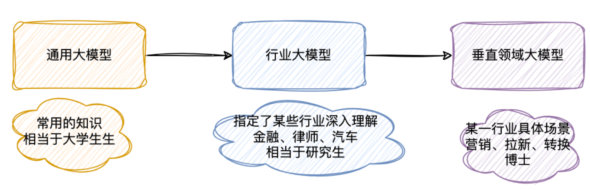

大模型微调（Large Model Fine-tuning）是指在预训练大模型（如GPT、BERT、LLaMA、Baichuan、Qwen等）基础上，使用特定下游任务的数据进行进一步训练，使模型在保留通用能力的同时，具备特定任务的专业能力。下面从原理、流程、方法与挑战等方面简要介绍。

## 1. 微调前景


大模型微调技术对于一家希望利用大模型进行创新的公司非常重要，或者说只要想用大模型好好的为一个行业领域或者公司服务，模型微调都是必不可少的一环。


## 2. 微调重要性

```
大模型的预训练让AI“有能力”，而微调则让AI“有用”。
预训练解决“会不会”的问题，微调解决“好不好用、用在哪里”的问题。
微调是大模型走向各行各业、深入千行百业的“最后一公里”。
```

- 实现行业落地的关键路径

  - 在医疗、金融、教育、法律等高专业性场景中，**只有通过微调才能将通用大模型“落地为可用产品”**。

  - 如：医疗大模型需结合真实病历问诊语料，法律大模型需掌握法条与判例。

- 提升性能和精度

  - 同一个输入，未微调模型输出可能模糊、笼统；

  - 微调后的模型则可以实现**更精准、更可信的结果输出**，提升用户体验与满意度。

  

- 满足个性化与定制化需求

  - 不同企业、客户、甚至同一组织内不同部门，都可能对AI模型有不同的语言风格、服务边界和交互逻辑。

  - 微调可以让模型具有“企业语言”和“角色定位”。

- 节省算力资源、降低推理成本

  - 利用 **轻量化微调方法（如LoRA、Adapter）**，可在小模型或低成本设备上运行。

  - 使得大模型能力“下沉”至本地部署、边缘计算，**加快响应，提升隐私安全性**。

- 数据的安全和隐私

  许多应用场景中，数据的安全性和隐私保护至关重要。使用预训练模型时，数据通常需要上传到云端进行处理，这可能带来数据泄露的风险。通过在本地进行微调，可以避免将敏感数据上传到云端，从而确保数据的安全和隐私。


## 3. 场景与案例

1. **特定任务需求**
   - **行业定制**：如医疗、金融、法律等，微调可帮助模型理解行业术语与知识。
   - **文本分类与情感分析**：提升模型在社交媒体评论等场景下的分类能力。
2. **小数据集适配**
   - 在数据量较小、任务差异较大的情况下，通过领域数据微调提升模型表现。
   - 示例：新产品反馈数据稀少时，通过微调分析用户意见。
3. **语言风格与个性化**
   - 根据需求定制输出风格，如更友好的客服语气、使用方言等。
4. **复杂业务规则学习**
   - 通过微调学习行业特有流程和规则，例如在线银行的合规审核。
5. **提升准确性与泛化能力**
   - 对现有任务表现不佳的模型引入新数据微调，提升效果。
   - 示例：在线教育系统自动评分的准确性提升。


## 4. 微调在江湖

微调和我们常说的RAG、预训练等的关系梳理。

### 4.1  微调与RAG

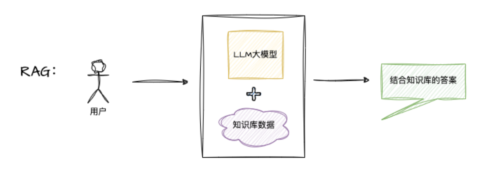

```cmd
RAG:检索增强生成，主要对知识库内容进行整合、汇总后输出。
```

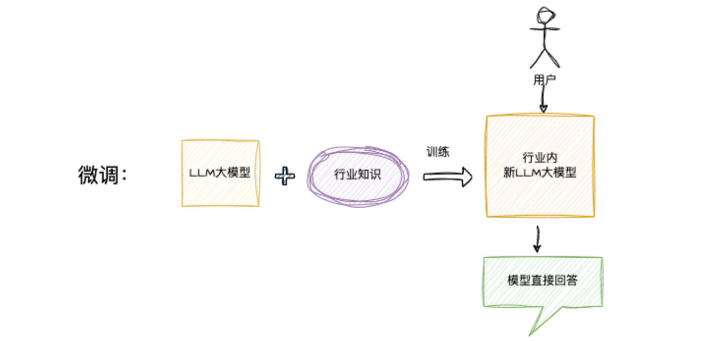

```cmd
微调：是对定制化模型的问答，是模型学习到的内容，生成一个新的模型
```

### 4.2 如何选择

| 场景             | RAG ✅ | 微调 ✅ |
| ---------------- | ----- | ------ |
| 动态数据         | ✅     |        |
| 成本             | ✅     |        |
| 可解释性         | ✅     |        |
| 场景需要通用能力 | ✅     |        |
| 特色能力         |       | ✅      |
| 延迟             |       | ✅      |
| 微智能设备       |       | ✅      |
| 模型幻觉         | ✅     | ✅      |

**案例助解：**

| 场景名称        | 任务内容                                                  | 技术手段   | 原因说明                                                     |
| --------------- | --------------------------------------------------------- | ---------- | ------------------------------------------------------------ |
| 1、医学论文整理 | 1. 了解医学领域相关知识；  2. 具备高质量整理与摘要能力；  | 微调       | 预训练大模型不熟悉专业医学术语，需通过微调注入专业知识和结构化总结能力。 |
| 2、智慧库房     | 1. 经常更新库房清单； 2. 与用户正常对话解释清单内容；     | RAG        | 清单频繁变动，适合通过RAG调用实时知识库；对话需求用RAG也可满足。 |
| 3、智慧销售     | 1. 产品数据经常更新； 2. 销售语气友好、个性化，贴近客户； | RAG + 微调 | 数据更新靠RAG；语气和风格需微调模型，以形成品牌感和话术一致性。 |


### 4.3 更多技术

| 技术阶段                      | 面向人群                         | 技术积累                                                   | 应用场景                   | 特征总结               |
| ----------------------------- | -------------------------------- | ---------------------------------------------------------- | -------------------------- | ---------------------- |
| 提示工程 (Prompt Engineering) | 终端用户                         | 对ChatGPT等应用的提示词有基本的了解和使用                  | 文本生成、机器翻译等       | 门槛低，易于上手       |
| AI智能体 (Agents)             | 大模型应用开发人员               | 了解大模型基础原理和理论，熟悉特定领域的业务逻辑和流程     | 自动客服、虚拟助手         | 侧重于交互性和用户体验 |
| 大模型微调 (Fine-tuning)      | 领域模型研发、私有化团队开发人员 | 掌握神经网络和机器学习概念，有数据处理和模型训练经验       | 语义理解、领域知识学习     | 通用性强、性价比高     |
| 预训练技术 (Pre-training)     | 大模型研究开发人员、数据科学家   | 熟悉深度学习原理和网络架构，有大规模数据处理和模型训练经验 | 多模态学习、语言模型预训练 | 前期投入大、效果显著   |


## 5. 必备条件

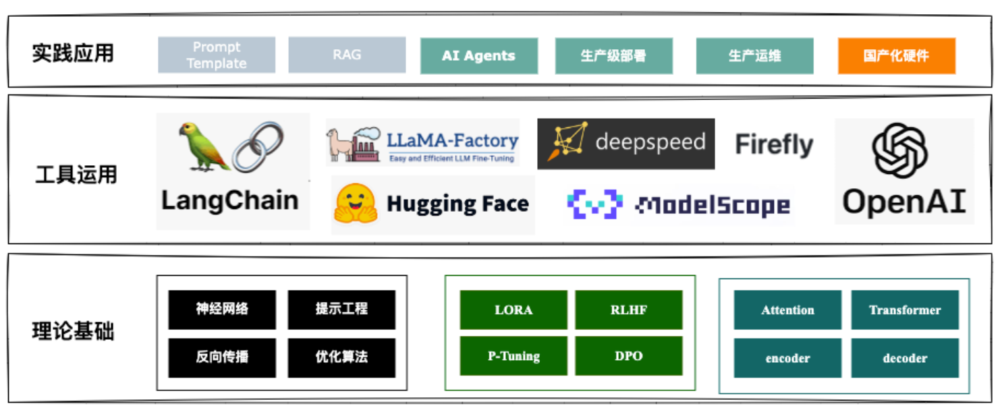


## 6. 微调流程

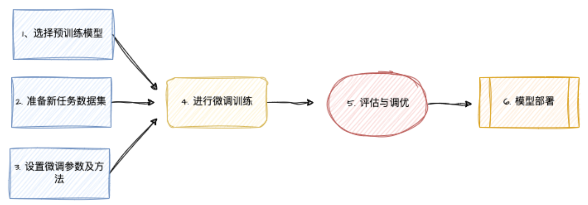


## 7. 微调分类

大模型微调分类包括**全量微调**、**高效微调**和**强化学习微调**三类

> **全量微调**打造“专业模型”，**高效微调**塑造“定制模型”，**强化学习微调**培养“懂你模型”。

### 7.1 Full Fine-tuning

全量微调是最直接的微调方式，也是一般公司不会选的方式，指对大模型的全部参数进行再训练。

**核心特点：**

- 所有模型参数都参与更新；
- 训练后模型完全“脱胎换骨”，拥有最强的适应性；
- 计算资源开销大，对显存和训练框架要求高（如需要使用FSDP或DeepSpeed等分布式训练技术）。

**优点：**

- 效果最佳，尤其适合高度复杂任务；
- 可实现模型架构级别的深入定制；
- 支持在预训练基础上继续大规模训练。

**缺点：**

- 显存需求高（如A100级别算力）；
- 训练时间长、成本高；
- 易出现过拟合风险，尤其是数据量不足时。

**适用场景：**

- 医疗、金融、法律等高可靠性需求领域；
- 企业/科研团队拥有充足GPU资源；
- 要求模型在一个新任务或语境中达到**最优性能**。


### 7.2 PEFT

Parameter-Efficient Fine-tuning，高效微调，是一种**只更新模型中一小部分参数**的微调策略，主干参数保持冻结，显著降低训练成本与存储开销，是当前主流的微调方式。

**常见方法：**

- **LoRA（Low-Rank Adaptation）**：在每层插入低秩矩阵，仅训练这些矩阵；
- **QLoRA**：结合LoRA与量化技术（如4-bit），可在消费级显卡上训练；
- **Adapter**：在Transformer结构中加入小型模块，仅训练这些模块；
- **Prompt Tuning**：仅优化提示词（soft prompt），不改模型主干结构。

**核心特点：**

- 训练参数量极少（一般 <1%）；
- 可以并行适配多个任务（一个主模型+多个LoRA/Adapter权重）；
- 模型部署更加灵活，便于多任务切换。

**优点：**

- 显存需求低，适合中小企业和教育场景；
- 训练快，可支持快速迭代；
- 在许多任务上表现接近全量微调效果。

**缺点：**

- 对复杂任务的适配能力稍弱于全量微调；
- 有时需要精心调参或挑选适合的PEFT方法。

**适用场景：**

- 快速开发原型或小型行业模型；
- 算力有限的实验教学场景；
- 多任务、多租户模型部署（通过切换轻量模块实现个性化）。


### 7.3 RLHF

Reinforcement Learning with Human Feedback，强化学习微调，是一种结合“人类偏好”与强化学习算法的微调方法，广泛用于提升大模型的**交互能力、价值观对齐和行为控制能力**。

**核心流程：**

1. **SFT阶段**：先对模型进行有监督微调（通常用指令数据集）；
2. **奖励模型训练（RM）**：基于人类标注的偏好构建奖励模型；
3. **策略优化（PPO或DPO等）**：用强化学习算法优化输出策略，使模型趋向人类偏好。

**核心特点：**

- 不追求单一任务精度，而是整体输出风格、对齐性、礼貌性、价值观一致性；
- 是ChatGPT、Claude、Gemini等大模型“安全输出”的关键技术之一。

**优点：**

- 输出内容更自然、更符合用户期望；
- 能有效降低模型幻觉、毒性等问题；
- 可微调模型的个性风格（如语气、礼貌程度、回答逻辑等）。

**缺点：**

- 人类偏好数据标注成本高；
- 奖励模型训练和策略优化技术门槛高；
- 实现复杂，一般用于模型的最终对齐阶段。

**适用场景：**

- 聊天机器人、虚拟助手；
- 需要价值观和行为控制的交互系统；
- 模型部署前的“安全最后一关”。


## 8. 微调框架

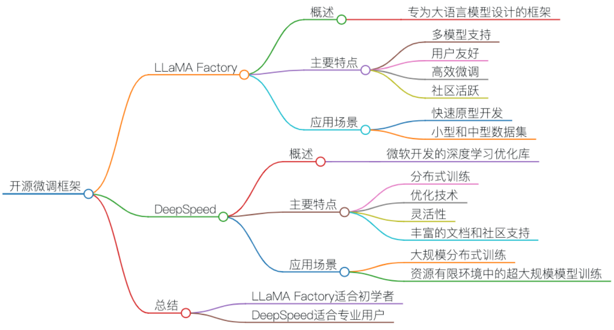


# 二、LoRA微调


LoRA（Low-Rank Adaptation）是近年在大模型微调中提出的一种高效技术，主要用于大规模预训练语言模型（如GPT、BERT等）的微调。其基本思想是在微调过程中，不直接更新整个模型的所有参数，而是引入低秩矩阵来对预训练模型进行适应，从而大幅减少训练参数量和计算开销。

论文：https://arxiv.org/pdf/2106.09685

## 1. 概念

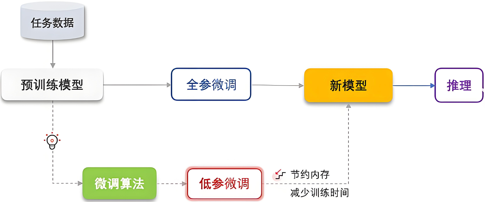

LoRA（低秩适配）是一种针对大模型的参数高效微调技术。其核心思想是通过低秩矩阵调整模型参数，而非修改整个模型，从而大幅降低训练成本。


## 2. 核心原理

- 低秩矩阵： LoRA方法在原始网络参数更新过程中，通过引入低秩矩阵近似原始权重的更新
  - 将网络的某些权重矩阵分解为两个较小的矩阵乘积，也就是低秩矩阵
  - 这些小矩阵是需要微调的参数，而原始的预训练权重则保持不变。
- 减少计算和存储需求： 只需要调整相对较少的参数，同时又能实现与完全微调大模型类似的性能效果。
- 适应性：通过低秩矩阵的引入，使得微调过程可以更高效地适应特定任务，提升任务的表现，而不需大规模参数更新。


## 3. 功能

- 节省资源：
  - 计算成本低：训练参数仅为原模型的 0.1%~1%，GPU 显存需求下降 50% 以上。
  - 训练速度快：微调时间从几天缩短到几小时。
- 保留通用能力：
  - 冻结原模型参数，避免微调后模型“遗忘”原有知识（如通用对话能力）。
- 灵活适配多任务：
  - 可同时训练多个 LoRA 模块（如医学、法律、编程），按需切换。
- 适合小数据场景：
  - 在数据量较少时（如 1 万条医学问答），仍能有效微调。


## 4. 对比传统微调

| 方法                | 训练参数数 | 显存占用 | 任务切换成本         | 适用场景             |
| ------------------- | ---------- | -------- | -------------------- | -------------------- |
| 全参数微调          | 100%       | 极高     | 高（保持多个大模型） | 数据充分、资源丰富   |
| LoRA                | 0.1%~1%    | 低       | 低（切换简单）       | 数据稀缺、多任务适应 |
| 迁移微调（Adapter） | 1%~5%      | 中       | 中                   | 中等复杂任务         |

## 5. 典型应用

- 领域适应：让通用大模型学会医学诊断、法律咨询。
- 个性化需求：为不同用户定制对应话术（如重型模型、幽默型）。
- 轻量化部署：在手机端运行较大的模型（如LoRA量化技术）。


## 6. 原理

| 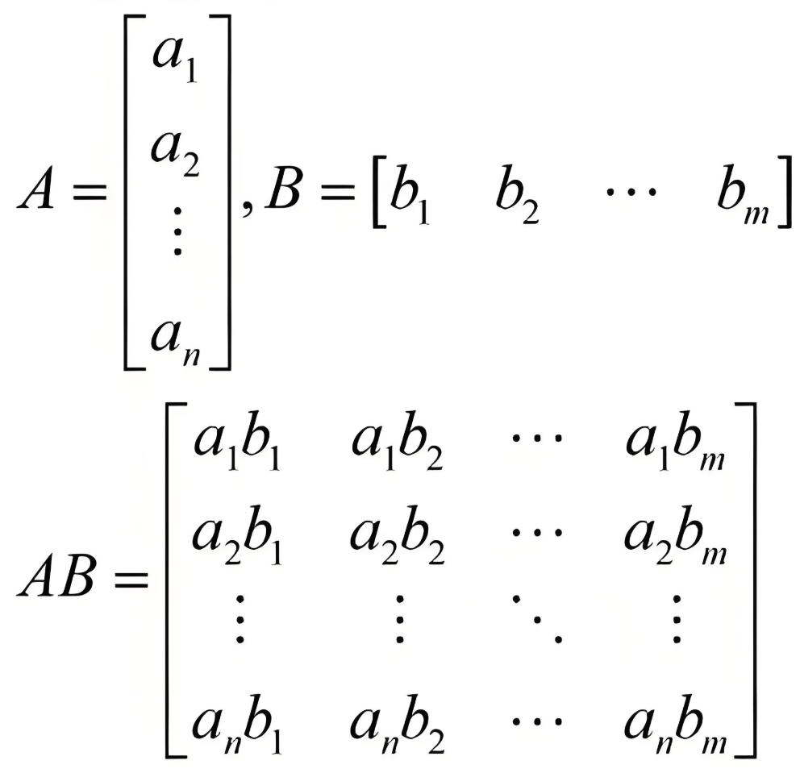 | 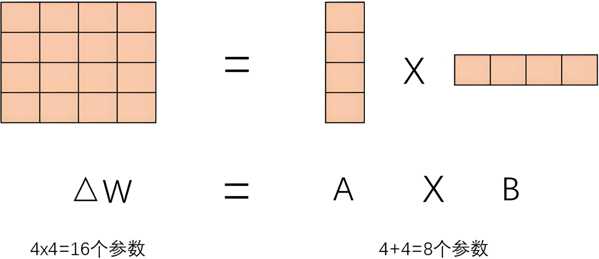 |
| ------------------------------------------------------------ | ------------------------------------------------------------ |

LoRA将网络中的某些权重矩阵分解成低秩矩阵，并且仅微调这些低秩矩阵，具体过程如下：

### 6.1 矩阵分解

在传统网络中，权重矩阵 $W$ 是维度为 $(d, k)$ 的大矩阵，直接用于NN的前向传播。LoRA的核心思想是将这个权重矩阵分解为两个较小的矩阵：

- 一个低秩矩阵 $A$ ，维度为 $(d, r)$
- 另一个低秩矩阵 $B$，维度为 $(r, k)$

其中，$r$ 是低秩的秩，通常远小于原矩阵的维度 $d$ 和 $k$。

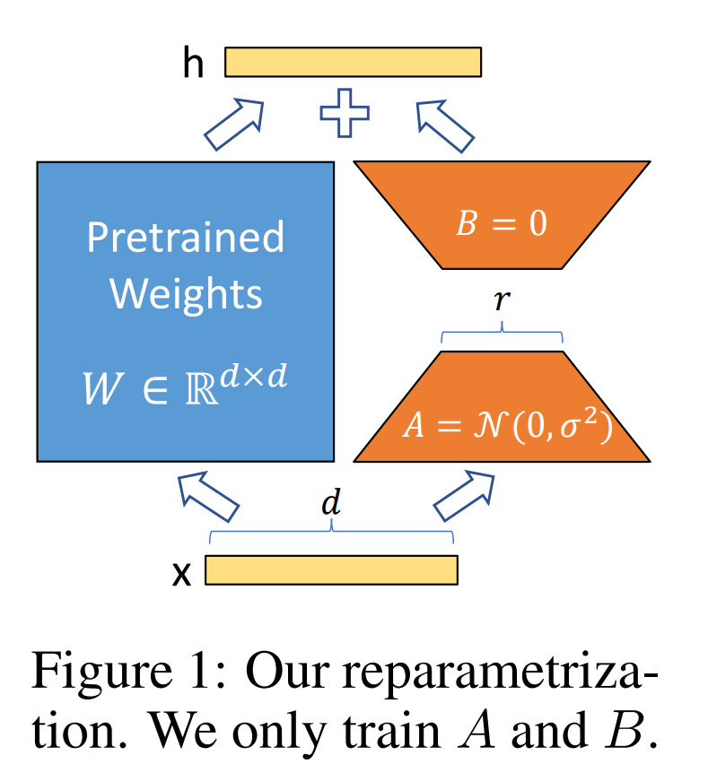

**参数初始化：**

A 矩阵初始化（正态分布）：
$$
A = \begin{bmatrix} -0.0071 & 0.0043 & \cdots & -0.0035 \\ 0.0021 & -0.0088 & \cdots & 0.0059 \\ \vdots & \vdots & \ddots & \vdots \\ 0.0045 & -0.0029 & \cdots & -0.0012 \\ \end{bmatrix} \in \mathbb{R}^{8 \times 768}, \quad A_{ij} \sim \mathcal{N}(0, 0.01^2)
$$


B 矩阵初始化（全 0）：
$$
B = \begin{bmatrix} 0 & 0 & \cdots & 0 \\ 0 & 0 & \cdots & 0 \\ \vdots & \vdots & \ddots & \vdots \\ 0 & 0 & \cdots & 0 \\ \end{bmatrix} \in \mathbb{R}^{768 \times 8}
$$
LoRA 的精髓之一：**以最小扰动介入原模型行为，助于模型稳定收敛**，并仅通过训练少量参数（`A` 和 `B`）来适配新任务。


### 6.2 网络修改

LoRA不会直接替换原始的权重矩阵，而是将低秩矩阵 $A$ 和 $B$ 加入到原始矩阵中：
$$
W_{\text{new}} = W + A \times B
$$
$A \times B$ 是在微调过程中学习的部分。


### 6.3 前向传播

在模型的前向传播过程中，权重矩阵 $W_{\text{new}} = W + A \times B$ 会被用来计算输出。原始预训练权重 $W$ 保持不变，仅通过对低秩矩阵 $A$ 和 $B$ 的微调，模型就能适应新的任务。


### 6.4 微调过程

在微调阶段，LoRA的目标是学习这两个低秩矩阵 $A$ 和 $B$。由于这些矩阵的维度 $r$ 通常比 $W$ 要小得多，因此训练时需要调整的参数远少于传统的全参数微调，从而显著减少了计算和存储的开销。


### 6.5 模型输出

在训练过程中，LoRA的更新方式类似于对原始网络的权重进行“修正”。这意味着，虽然原始权重没有被修改，但通过调整低秩矩阵 $A$ 和 $B$，模型可以灵活地适应新的任务和数据，达到与传统全参数微调相似的效果。


## 7. 消融实验

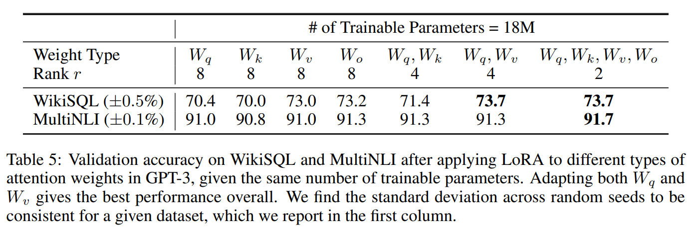

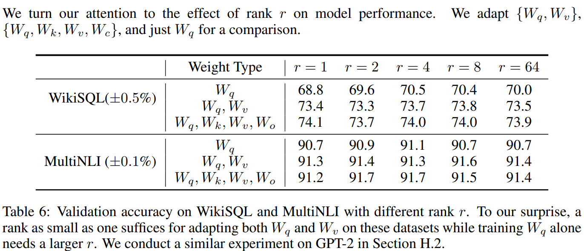


# 三、微调实战

DeepSeek-1.5B

## 1. 工具准备

不同的大模型进行LoRA微调时，需要的数据不同，且 Python 代码的编写也不同。为了能统一微调市面上所有流行的大模型，有一个团队做了一个开源工具，允许使用命令行或者 WebUI 操作的方式来微调模型，叫做 $LLaMA-Factory$。


LLaMA-Factory 工具地址： https://github.com/hiyouga/LLaMA-Factory


## 2. 工具部署

```bash
git clone --depth 1 https://github.com/hiyouga/LLaMA-Factory.git
cd LLaMA-Factory
pip install -e ".[torch,metrics]"
pip install -e ".[metrics]"
```


## 3. 安装测试

```bash
llamafactory-cli version
```

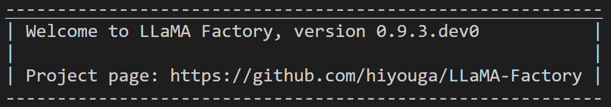


## 4. 准备数据集

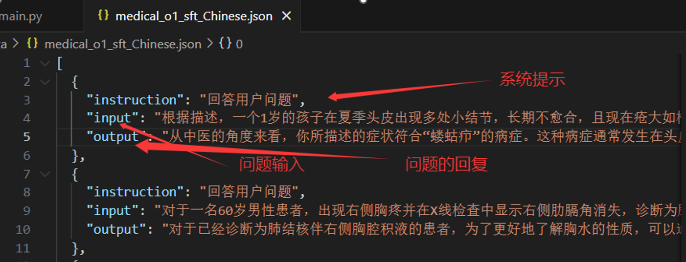

- 按照示例准备数据集，将数据集复制到 $LLaMa-Factory$ 的 $data$ 目录下。

- 数据格式：问题为训练数据，回复为标签。工具会自动处理并划分输入和输出。

- 将 JSON 数据集复制到指定路径下，并修改配置文件，进行数据集登记，确保工具能够检测到新添加的数据集。

  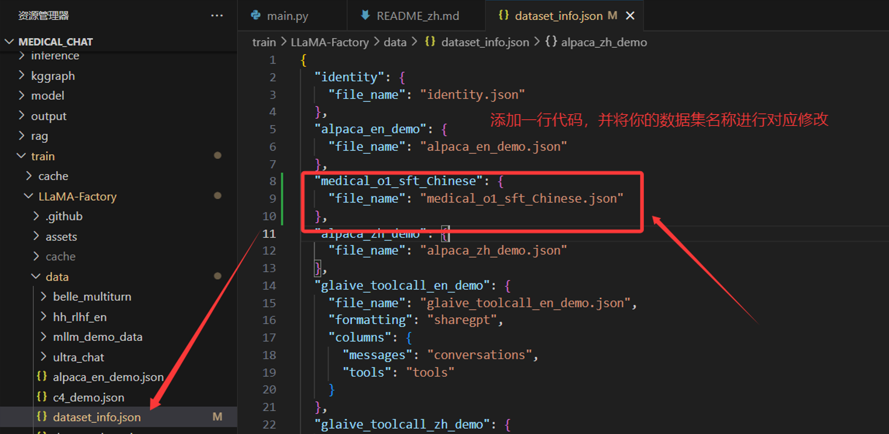

## 5. 启动工具

输入命令行启动 WebUI

```bash
llamafactory-cli webui
```


## 6. 开始训练

提供的各种数据集：https://github.com/hiyouga/LLaMA-Factory/blob/main/README_zh.md

### 6.1 训练数据

训练数据格式参考：

```cmd
instruction：任务指令，不能为空
input：任务输入，可为空。如果不为空，项目内部处理训练数据时，会将instruction、input拼接在一起作为任务的输入。
output:任务输出，不能为空。
```

参考如下：

```json
[
  {
    "instruction": "将下面这段英文翻译成中文：The future of AI is full of possibilities.",
    "input": "",
    "output": "人工智能的未来充满了无限可能。"
  },
  {
    "instruction": "请将以下数字列表从小到大排序。",
    "input": "45, 12, 78, 3, 29",
    "output": "3, 12, 29, 45, 78"
  },
  {
    "instruction": "根据下面这段话，写一个标题。",
    "input": "人工智能技术正在迅速发展，已经在医疗、教育、金融等多个领域取得了重要突破。",
    "output": "人工智能在多个领域取得突破性进展"
  },
  {
    "instruction": "请写一段话介绍你自己。",
    "input": "",
    "output": "我是一个人工智能助手，旨在通过自然语言处理技术帮助用户解决各种问题。"
  },
  {
    "instruction": "将下面这句中文翻译成英文：我正在学习用Python编写程序。",
    "input": "",
    "output": "I am learning to write programs using Python."
  },
  {
    "instruction": "请根据下列要求写一条产品宣传语：关键词是“环保、节能、智能”。",
    "input": "",
    "output": "环保节能新选择，智能生活新体验！"
  },
  {
    "instruction": "判断下面这段话的情感倾向，并输出“正面”或“负面”：",
    "input": "这款手机的续航能力太差了，一天都撑不住。",
    "output": "负面"
  },
  {
    "instruction": "写一个Python函数，实现判断一个数是否为质数。",
    "input": "",
    "output": "def is_prime(n):\n    if n <= 1:\n        return False\n    for i in range(2, int(n ** 0.5) + 1):\n        if n % i == 0:\n            return False\n    return True"
  }
]
```

可以到这里看看：https://github.com/Instruction-Tuning-with-GPT-4/GPT-4-LLM

### 6.2 数据集获取

各种数据集

国内：https://modelscope.cn/

国际：https://huggingface.co/


### 6.3 硬件需求

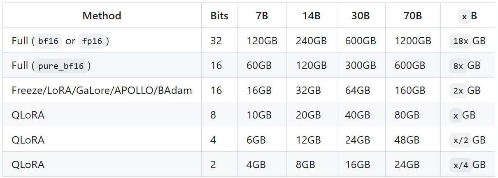


### 6.4 训练配置

- 保持参数默认值，更改模型路径和数据集路径。

  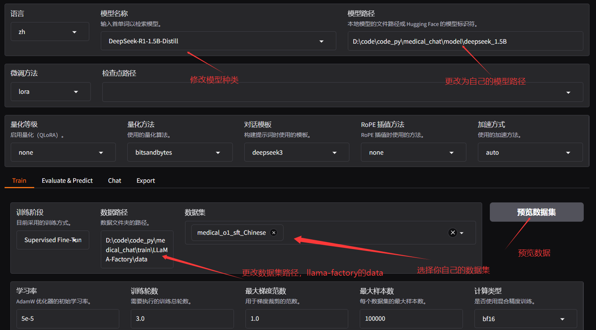

  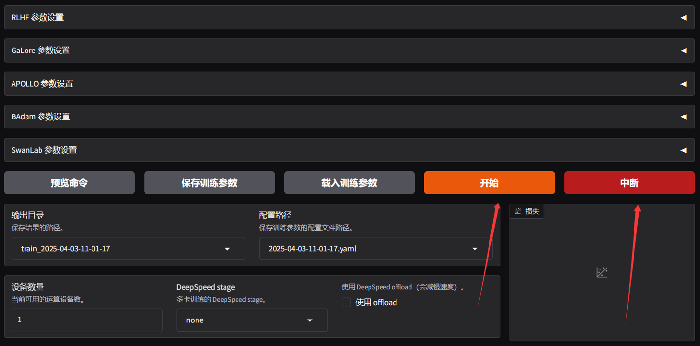

- 后台命令行出现以下信息，说明正在训练，重点关注损失值（Loss）是否降低

  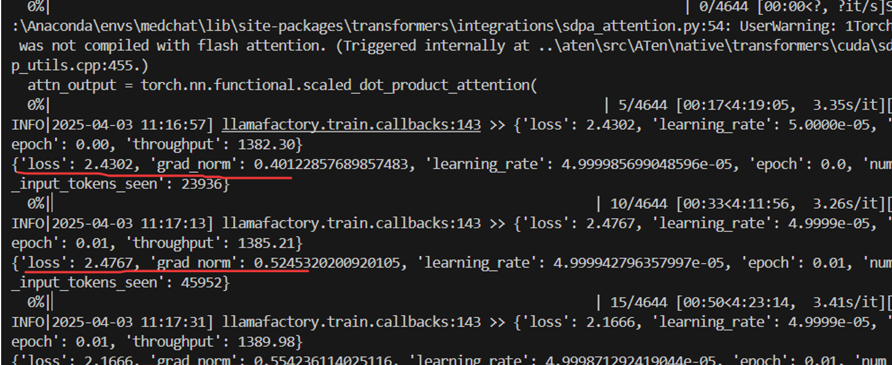

- 页面也会显示训练进度和损失变化曲线。

  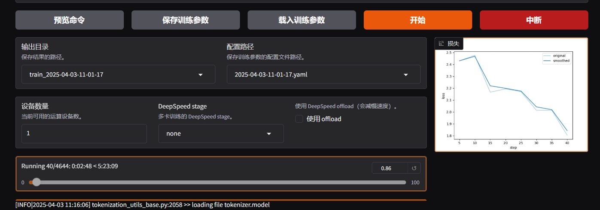


## 7. 微调参数详解

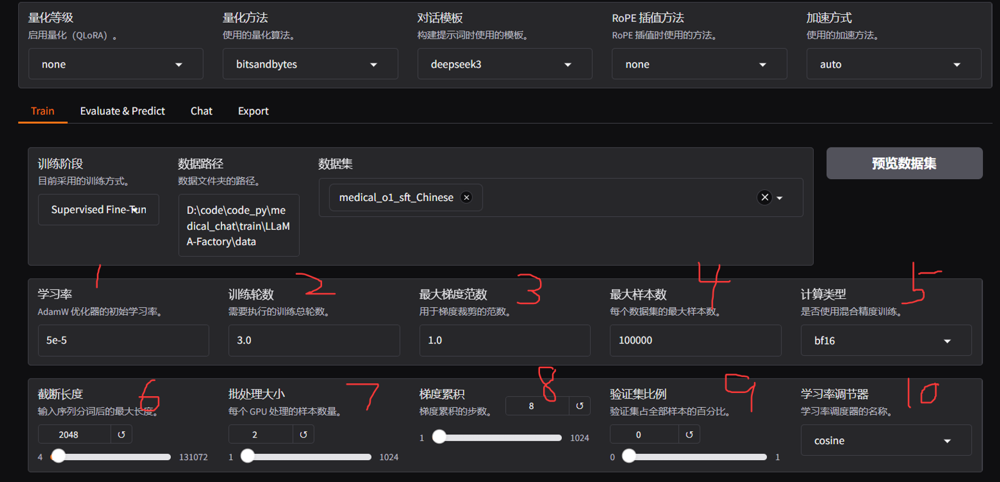

### 7.1  学习率

- **作用**：控制模型参数每次更新的步幅，是训练中最核心的超参数。
- **越大**：收敛速度加快，适合初期快速逼近最优解。但可能跳过最佳解（震荡或不收敛），训练不稳定。
- **越小**：更新更精细，容易找到更精确的局部最优解。但训练时间大幅增加，可能卡在局部次优点。
- **典型值**：1e-5 到 5e-4（大模型常用较小学习率）。

### 7.2 训练轮数

- **作用**：决定模型遍历完整训练数据的次数。
- **越大**：模型更充分学习数据特征，可能提升性能。但过拟合风险增加（尤其数据量少时），计算成本升高。
- **越小**：节省时间，适合快速验证想法。但可能欠拟合，模型未学到足够知识。
- **典型值**：50-150 轮次。

### 7.3 最大梯度范数

Max Gradient Norm

- **作用**：通过梯度裁剪限制梯度大小，防止梯度爆炸。
- **越大**：允许更大的参数更新，加快收敛。但梯度爆炸风险增加，可能导致训练崩溃（Loss 突增为 NaN）。
- **越小**：训练更稳定，适合复杂任务或大模型。但更新过于保守，收敛速度变慢。
- **典型值**：0.5 到 1.0。

### 7.4 最大样本数

Max Samples

- **作用**：限制训练时使用的数据量，用于快速测试或资源不足场景。
- **越大**：模型学到更多数据分布，性能上限高。但训练时间和内存消耗增加。
- **越小**：快速验证代码或超参数。但模型可能欠拟合，泛化能力差。
- **注意**：如果数据量本身较小，不建议设置此参数。

### 7.5 计算类型

Compute Type

- **作用**：指定训练时的数值精度，影响速度和显存占用。
- **选项**：
  - `fp32`（全精度）：数值稳定，但显存占用最大，速度最慢。
  - `fp16`（半精度）：节省显存，速度较快，但可能梯度溢出。
  - `bf16`（脑浮点16）：动态范围大，兼顾稳定性和速度（推荐 A100/H100 显卡使用）。
- **选择建议**：
  - 显存不足时优先 `fp16`，但需配合梯度缩放。
  - 高端显卡优先 `bf16`，平衡速度和稳定性。

### 7.6 截断长度

Max Sequence Length

- **作用**：将输入文本截断或填充到固定长度，影响内存和模型处理能力。
- **越大**：保留更多上下文信息，适合长文本任务（如文档摘要）。但显存占用平方级增长。
- **越小**：节省显存，允许更大批次训练。但长文本信息被切割，可能影响模型理解。
- **平衡建议**：根据任务需求选择，常用 512 或 1024。

### 7.7 批处理大小

Batch Size

- **作用**：单次训练输入的样本数量，直接影响显存和梯度更新方向。
- **越大**：梯度估计更准确，训练速度更快。但显存占用线性增加，可能超出显卡容量。
- **越小**：显存需求低，适合低配设备。但梯度噪声大，收敛不稳定。
- **调整技巧**：结合梯度累积模拟大批次。

### 7.8 梯度累积 

Gradient Accumulation

- **作用**：多次前向传播后累积梯度再更新参数，等效增大批次大小。
- **越大**：显存需求不变，但梯度更新更稳定。但训练时间增加。
- **越小**：更新频率高，适合小数据快速迭代。但等效 Batch Size 小，梯度噪声大。
- **典型值**：4 到 8（常与 Batch Size=8 配合等效 32~64）。

### 7.9 验证集比例

Validation Split

- **作用**：从训练数据中划分一部分作为验证集，用于监控过拟合。
- **越大**：验证结果更可靠，更好反映模型泛化能力。但实际训练数据减少，可能影响模型性能。
- **越小**：更多数据用于训练，适合数据稀缺场景。但验证集统计意义下降，可能误判过拟合。
- **建议**：通常设为 0.1（10% 数据用于验证）。

### 7.10 学习率调节器

LR Scheduler

- **作用**：动态调整学习率，常见类型：线性衰减、余弦退火、常数等。
- **选择建议**：cosine 余弦值降低，或者 warm_stable_decay 线性退回衰减。

## 8. LoRA 参数详解

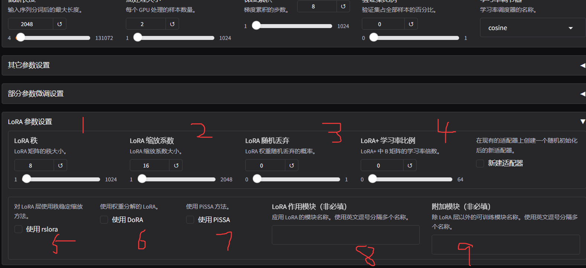

### 8.1 LoRA 秩

LoRA Rank

- **作用**：控制 LoRA 低秩矩阵的维度（秩的大小），决定 LoRA 模块的参数量和表达能力。数学形式：$ \Delta W = A_{d \times r} \times B_{r \times k} $，其中  $r $为秩。
- **越大**：参数更多，拟合能力更强，适合复杂任务。但训练速度变慢，显存占用增加，可能过拟合。
- **越小**：训练更快，显存占用低，适合简单任务或数据量少时。但模型表达能力受限，可能欠拟合。
- **典型值**：8（通用任务）、32（复杂任务）、64（多模态场景）。

### 8.2 LoRA 缩放系数

LoRA Alpha

- **作用**：调整 LoRA 权重对原始模型权重的调整幅度，公式为：$ W_{更新} = W_{原始} + {rankalpha} \times \Delta W $。
- **越大**：LoRA 对原模型的调整幅度更大，学习速度更快。但可能破坏原模型知识，训练不稳定。
- **越小**：调整更温和，适合精细微调。但收敛速度可能变慢。
- **建议**：通常与 rank 同比例设置（如 rank=8 时 alpha=16）。

### 8.3 LoRA 随机丢弃

LoRA Dropout

- **作用**：在 LoRA 模块中加入随机丢弃（Dropout），防止过拟合。原理：训练时随机将部分神经元输出置零，增强泛化能力。
- **越大**：正则化效果更强，降低过拟合风险。但模型收敛速度变慢，可能欠拟合。
- **越小**：保留更多信息，适合数据量充足时。但过拟合风险增加。
- **典型值**：0.05 到 0.2（数据量少时建议 0.1 以上）。

### 8.4 LoRA+ 学习率比例

LoRA+ LR Ratio

- **作用**：在 LoRA+ 变体中，为矩阵 \( A \) 和 \( B \) 设置不同的学习率比例。公式：学习率 \( A \) = 基础学习率 × ratio，学习率 \( B \) = 基础学习率。
- **越大**：矩阵 \( A \) 更新更快，适合快速捕捉任务特征。但可能破坏低秩分解的稳定性。
- **越小**：训练更稳定，适合精细调整。但收敛速度可能下降。
- **建议**：默认 0（即 \( A \) 的学习率是 \( B \) 的 0 倍）。

### 8.5 对 LoRA 层使用秩稳定缩放方法

RS-LoRA

- **作用**：通过调整权重初始化范围，提升训练稳定性（适用于大秩或高 alpha 场景）。
- **原理**：将 $A$ 初始化为 $N(0, \sigma^2)$，$B$ 初始化为 0，其中 $ \sigma = \frac{1}{r} $。
- **启用效果**：
  - **优点**：避免训练初期梯度爆炸，适合高秩（如 rank≥64）配置。
  - **缺点**：略微增加计算量。
- **建议**：当 rank≥32 或训练不稳定时启用。

### 8.6 使用权重分解的 LoRA

Weight-Decomposed LoRA

- **作用**：将 LoRA 权重分解为更小的子矩阵，减少显存占用。
- **原理**：将 $\Delta W = A_1 A_2 \times B_1 B_2 $，分解为多个低秩矩阵乘积。
- **启用效果**：
  - **优点**：显存占用降低，适合超大模型（如 70B+）。
  - **缺点**：增加计算复杂度，可能略微影响效果。
- **建议**：显存不足且模型极大时启用。

### 8.7 使用 PiSSA 方法

Parameter-Efficient Initialization

- **作用**：一种改进的 LoRA 初始化策略，替代传统的 Kaiming/正态分布初始化。
- **原理**：基于奇异值分解（SVD）初始化 \( A \) 和 \( B \)，使初始 \( \Delta W \) 近似原模型权重。
- **启用效果**：
  - **优点**：加速收敛，提升微调效果（尤其数据量少时）。
  - **缺点**：初始化计算量略高。
- **建议**：默认不启用。

### 8.8 LoRA 作用模块（非必填）

- **作用**：指定哪些原模型模块添加 LoRA 适配器。
- **常见选项**：`q_proj`（查询矩阵）、`v_proj`（值矩阵）、`dense`（全连接层）等。
- **填写建议**：
  - **默认空值**：框架自动选择注意力层（如 `q_proj`, `v_proj`）。
  - **手动指定**：例如 `["q_proj", "v_proj", "dense"]`，扩大作用范围提升效果，但增加参数量和训练成本。

### 8.9 附加模块（非必填）

- **作用**：在 LoRA 之外添加其他适配模块（如 Adapter、Prefix Tuning）。
- **示例**："adapter"（插入小型全连接网络）、"prefix"（可训练前缀向量）。
- **填写建议**：
  - **默认空值**：仅使用 LoRA。


## 9. 适配器

在微调场景中，“适配器”（Adapter）指的是一种**结构化参数模块**

### 9.1 适配器 vs 普通权重

| 特征         | 普通权重文件              | LoRA适配器               |
| ------------ | ------------------------- | ------------------------ |
| **内容构成** | 完整模型的全部参数        | 仅包含新增的低秩参数矩阵 |
| **独立性**   | 可直接独立使用            | 必须与基础模型结合使用   |
| **文件组成** | 单个.bin/.safetensors文件 | 包含配置文件和权重文件   |
| **功能定位** | 完整的模型参数            | 增量修改模块             |


### 9.2 核心组成

一个完整的LoRA适配器包含以下两部分：

- **结构化配置**：`adapter_config.json`

```json
{
  "peft_type": "LORA",
  "r": 8,              // 秩（Rank）
  "lora_alpha": 16,    // 缩放因子
  "target_modules": ["q_proj", "v_proj"], // 作用的目标模块
  "bias": "none"       // 偏置项配置
}
```

2. **增量参数文件** ：adapter_model.safetensors

- 仅保存低秩矩阵 $W_{down} \in \mathbb{R}^{d \times r}$ 和 $W_{up} \in \mathbb{R}^{r \times k}$
- 参数维度远小于原始模型（例如1.5B模型原始参数约3.3GB，LoRA适配器可能仅36.2MB）


### 9.3 工作机制

原始模型前向传播计算：
$$
h = Wx + b
$$
加入LoRA适配器后变为：
$$
h = Wx + \Delta Wx + b \\
\Delta W = W_{down}W_{up} \quad (\text{低秩分解})
$$

### 9.4 机制优势

- **结构依赖**：

  - 适配器需要知道作用在模型的哪些层（由`target_modules`配置指定）
  - 必须通过`PeftModel`等专用接口注入到基础模型中

- **动态计算**：

  ```python
  # 错误方式：直接加载会导致参数无法正确融合
  model.load_state_dict(torch.load("adapter_model.safetensors")) 
  
  # 正确方式：通过适配器框架处理
  from peft import PeftModel
  model = PeftModel.from_pretrained(base_model, "./lora_dir")
  ```

- **参数隔离**：

  - 基础模型参数保持冻结
  - 仅训练/更新适配器参数
  - 需要特殊机制管理参数更新范围


### 9.5 核心价值

1. **参数高效性**：

   - 微调时仅需更新0.1%-10%的参数
   - 典型场景：7B模型微调仅需56MB适配器 vs 完整微调需14GB

2. **模块化部署**：

   ```python
   # 动态切换不同适配器
   model.load_adapter("./chat_adapter", adapter_name="chat")
   model.load_adapter("./qa_adapter", adapter_name="qa")
   model.set_adapter("chat")  # 切换到对话适配器
   ```

3. **安全隔离**：

   - 基础模型始终保持原始状态
   - 避免微调过程中的灾难性遗忘

### 9.6 业务场景

我们的微调到底应该怎么用？

#### 9.6.1 多适配器

- 当需要加载多个适配器时，通过不同名称区分
- 示例：同时加载对话和代码生成适配器

```python
model.load_adapter("chat_lora_dir", adapter_name="chat")
model.load_adapter("code_lora_dir", adapter_name="coding")
```

#### 9.6.2 动态切换

```python
# 切换对话适配器
model.set_adapter("chat")
# 切换代码生成适配器
model.set_adapter("coding")
```

#### 9.6.3 参数隔离

- 确保不同适配器的参数独立存储

- 查看特定适配器参数：

  ```python
  for name, param in model.named_parameters():
      if "chat" in name:
          print(f"对话适配器参数: {name}")
  ```

  

#### 9.6.4 实际场景

- 场景1：多任务服务

  ```python
  # 初始化加载
  model.load_adapter("./medical_lora", adapter_name="medical")
  model.load_adapter("./legal_lora", adapter_name="legal")
  
  # 根据请求类型切换
  def handle_request(request_type, input_text):
      model.set_adapter(request_type)  # 切换适配器
      return model.generate(input_text)
  ```

- 场景2：A/B测试

  ```python
  # 加载新旧两个版本适配器
  model.load_adapter("./lora_v1", adapter_name="v1")
  model.load_adapter("./lora_v2", adapter_name="v2")
  
  # 随机选择版本测试
  import random
  selected_version = random.choice(["v1", "v2"])
  model.set_adapter(selected_version)
  ```

  

#### 9.6.5 名称规范

| 场景     | 推荐命名格式 | 示例            |
| -------- | ------------ | --------------- |
| 领域适配 | `领域_版本`  | `medical_v2`    |
| 任务类型 | `任务类型`   | `summarization` |
| 时间版本 | `日期戳`     | `20240520`      |
| 实验标识 | `exp_编号`   | `exp007`        |


### 9.7 常见问题

- 问题1：未激活适配器

  ```python
  # 错误现象：未调用 set_adapter() 导致使用默认适配器
  model.load_adapter("./lora_dir", adapter_name="my_lora")
  # 必须显式激活
  model.set_adapter("my_lora")  # 关键步骤！
  ```

- 问题2：名称冲突

  ```python
  # 错误示例：重复加载同名适配器
  model.load_adapter("./lora_v1", adapter_name="my_lora")
  model.load_adapter("./lora_v2", adapter_name="my_lora")  # 覆盖前一个
  
  # 正确做法：保持名称唯一性
  model.load_adapter("./lora_v1", adapter_name="v1")
  model.load_adapter("./lora_v2", adapter_name="v2")
  ```

  

### 9.8 高级用法

#### 9.8.1 组合使用适配器

```python
# 并行激活多个适配器
model.set_adapter(["medical", "emergency"])
# 需要适配器配置支持组合模式
# 在 adapter_config.json 中设置：
# "combination_strategy": "parallel"
```

#### 9.8.2 权重混合

```python
# 动态调整适配器权重
model.set_adapter("medical")
medical_output = model(...)

model.set_adapter("legal")
legal_output = model(...)

# 混合输出
final_output = 0.7 * medical_output + 0.3 * legal_output
```

**LoRA适配器是一种高度结构化的参数修改方案**，远超普通权重文件的概念。理解这种差异对于正确使用参数高效微调技术至关重要。


# 四、LoRA模型使用

LoRA适配器整合方案，分为两种常用模式：

## 1. 直接合并模型

推荐用于生产部署

```python
# 合并步骤（只需执行一次） pip install peft
from peft import PeftModel

base_model = AutoModelForCausalLM.from_pretrained("deepseek-ai/deepseek-llm-1.5b")
lora_model = PeftModel.from_pretrained(base_model, "./your_lora_dir")
merged_model = lora_model.merge_and_unload()  # 合并权重
merged_model.save_pretrained("./merged_model", safe_serialization=True)

# 修改您的初始化代码
class DeepSeek:
    def __init__(self, model_path="./merged_model", device="cuda", torch_dtype=torch.float16):
        self.model = AutoModelForCausalLM.from_pretrained(
            model_path, 
            torch_dtype=torch_dtype,
            device_map="auto"  # 自动分配设备
        )  # 无需手动.to(device)
        self.tokenizer = AutoTokenizer.from_pretrained(model_path)
```


## 2. 动态加载适配器

适合多任务切换

```python
# 修改后的类定义
from peft import PeftModel

class DeepSeek:
    def __init__(self, base_model_path, lora_path, device="cuda", torch_dtype=torch.float16):
        # 加载基础模型
        self.base_model = AutoModelForCausalLM.from_pretrained(
            base_model_path,
            torch_dtype=torch_dtype,
            device_map="auto"
        )
        
        # 加载LoRA适配器
        self.model = PeftModel.from_pretrained(
            self.base_model,
            lora_path,
            adapter_name="my_lora"
        )
        
        self.tokenizer = AutoTokenizer.from_pretrained(base_model_path)

    	# 保持原有inference方法不变
```


## 3.  部署优化建议

降低显存消耗

### 3.1 量化配置

```python
# 在__init__中修改模型加载方式
from transformers import BitsAndBytesConfig

bnb_config = BitsAndBytesConfig(
    load_in_4bit=True,
    bnb_4bit_compute_dtype=torch.float16,
    bnb_4bit_quant_type="nf4"
)

self.base_model = AutoModelForCausalLM.from_pretrained(
    base_model_path,
    quantization_config=bnb_config,
    device_map="auto"
)
```

### 3.2 生产级参数建议

```python
# 推荐生成参数
gen_config = {
    "max_new_tokens": 1024,
    "temperature": 0.7,
    "top_p": 0.9,
    "repetition_penalty": 1.1,
    "do_sample": True
}
```


### 3.3 文件结构建议

```
your_server/
├── models/
│   ├── base_model/          # 原始模型
│   └── lora_adapters/      # 各任务适配器
│       ├── task1/
│       │   ├── adapter_config.json
│       │   └── adapter_model.safetensors
│       └── task2/
├── deepseek_server.py       # 您的服务代码
└── requirements.txt
```


### 3.4 分词器兼容性

```python
# 如果微调时修改过tokenizer
self.tokenizer = AutoTokenizer.from_pretrained(lora_path)
```

### 3.5 适配器激活

```bash
# 多适配器时需要显式指定
self.model.set_adapter("my_lora")
```


# 五、量化技术

量化是将高精度浮点权重压缩为低位表示（如 8bit 或 4bit）的技术。通过将每个参数映射到预先规划好的离散浮点值表，从而大幅降低模型显存占用和计算成本，同时尽量保留原始模型的表达能力，常见的有**均值量化**和**NF4 量化**。

==下面对整个量化过程进行学习。==

## 1. 确定量化范围

量化第一步是先找到离散浮点值表的最小值和最大值。

### 1.1 均值量化

Uniform Quantization

- **方法一：全局最值**

  - **做法**：直接取权重矩阵的最大值和最小值
    $$
    x_{min} = \min(W) \\ 
    x_{max} = \max(W)
    $$

  - **优点**：简单，计算成本低

  - **缺点**：如果有少数极端值，会拉宽量化范围 → 大部分权重精度下降

- **方法二：按分布统计**

  - **做法**：取某个分位数（比如 0.01% 到 99.99%）的值作为 $min/max$

  - **优点**：减轻极端值影响 → 大多数权重映射更精确

### 1.2 NF4量化

NormalFloat4

NF4 的核心是假设权重近似正态分布（μ≈0）。

- **统计权重的标准差 σ**

  - 假设权重服从 N(0, σ²)

- **设置范围**

  - 通常取 −kσ,+kσ 作为量化范围
  - 论文里 QLoRA 选择 k ≈ 3 → 覆盖大约 99% 权重
  - 极端值之外的权重会被截断（clipping）

- **构建 NF4 离散表**

  - 根据正态分布密度设计 16 个离散值
  - 0 附近密集，尾部稀疏

### 1.3 量化示例及对比

  ==示例：==

  | 下标 (bin) | 均匀量化 (Uniform) | NF4 量化 (NormalFloat4) |
  | ---------- | ------------------ | ----------------------- |
  | 0          | -2.0               | -2.0                    |
  | 1          | -1.733             | -1.0                    |
  | 2          | -1.467             | -0.75                   |
  | 3          | -1.2               | -0.5                    |
  | 4          | -0.933             | -0.35                   |
  | 5          | -0.667             | -0.2                    |
  | 6          | -0.4               | -0.1                    |
  | 7          | -0.133             | -0.05                   |
  | 8          | 0.133              | 0.0                     |
  | 9          | 0.4                | 0.05                    |
  | 10         | 0.667              | 0.1                     |
  | 11         | 0.933              | 0.2                     |
  | 12         | 1.2                | 0.35                    |
  | 13         | 1.467              | 0.5                     |
  | 14         | 1.733              | 0.75                    |
  | 15         | 2.0                | 1.0                     |

  - **均匀量化 (Uniform)**
    - 下标对应的浮点值是等间距的，每个 bin 间隔一致
    - 精度在 $0$ 附近和极值附近一致，对 $0$ 附近细微变化不够敏感
  - **NF4 量化**
    - 下标对应的浮点值分布密度靠近 $0$，尾部稀疏
    - 保留 $0$ 附近的精度，减少对常见权重的量化误差

**总结：**

| 量化方式           | min/max 范围确定方法                    | 特点                               |
| ------------------ | --------------------------------------- | ---------------------------------- |
| 均匀量化           | 直接取矩阵/层最大值和最小值             | 简单，但极值会拉宽范围             |
| NF4 (NormalFloat4) | 根据权重分布统计标准差，范围 [-3σ, +3σ] | 贴近正态分布，尾部稀疏，0 附近密集 |


## 2. 划分区间

用 **4 bit** 表示 → 一共能表示 $2^4 = 16$ 个离散值。
 比如把 $[-1.0, 1.0]$ 这个区间均匀分成 $16$ 份。
 每一份对应一个 **int4 值（0–15）**。

例如：

- -1.0 映射为 0
- 0.0 映射为 8
- +1.0 映射为 15


## 3. 参数映射

把每个 FP32 参数映射到最接近的 int4 值

### 3.1 均匀量化映射

- 计算 步长scale
  $$
  \text{scale} = \frac{max - min}{2^b - 1}
  $$

  - 这里 $b = 4$

  - $max = 2, min = -2$
    $$
    \text{scale} = \frac{2 - (-2)}{16 - 1} = \frac{4}{15} \approx 0.2667
    $$

- 将 $FP32$ 值映射到 bin 序号（0–15）
  $$
  \text{bin} = \text{round}\left(\frac{x - min}{scale}\right)
  $$

- 例子：$x = -1.8$
  $$
  \text{bin} = \text{round}\left(\frac{-1.8 - (-2)}{0.2667}\right) = \text{round}\left(\frac{0.2}{0.2667}\right) \approx \text{round}(0.75) = 1
  $$

### 3.2 NF4量化映射

==前面已构建好16 个非均匀离散值：靠近 0 密集，尾部稀疏==

- 将 $FP32$ 值映射到 bin 序号（0–15）
  $$
  \text{bin} = \arg\min_i |x - table[i]|
  $$

- 找到最接近 $FP32$ 权重的离散值下标

- 例子：$x = 0.12$

  - 查表找到最接近的值：
    $$
    0.12\text{ 最接近 } 0.1
    $$

  - 对应下标：
    $$
    \text{bin} = 10
    $$

    ```css
    - NF4 量化查表找最接近值
    - bin = 下标，表示该FP32权重在NF4表中对应的离散浮点值
    - 训练时NF4表固定，只训练LoRA插入的小矩阵参数
    ```

## 4. 反量化

- 假设某个权重矩阵的一行参数是：
  $$
  W = [0.12, -0.95, 0.33, 1.24, -0.44]
  $$

  - 这些都是 **32 位浮点数 (FP32)** 存储。
  - 每个数占 4 个字节（32 bit） 。

- 把每个 $FP32$ 参数映射到最接近的 $int4$ 值：

  ```css
  - 0.12 → 9
  - -0.95 → 0
  - 0.33 → 11
  - 1.24 → （截断到范围上限 1.0） → 15
  - -0.44 → 6
  ```

  如此，量化后的向量为：
  $$
  W_{int4} = [9, 0, 11, 15, 6]
  $$

- 在计算时，这些 $int4$ 值会根据 $bin$ 映射回浮点数，得到的近似权重：
  $$
  \tilde{W} = [0.12, -1.0, 0.33, 1.0, -0.44]
  $$
  和原始 $FP32$ 版本相比，有少量误差，但总体形状保持一致。


## 5. 存储对比

- $FP32$：每个参数 $32 bit$

- $Int4$：每个参数 $4 bit$
   → 存储量缩小 **8 倍**
   → 再配合 Double Quantization，可进一步减少显存占用

  

# 六、QLoRA

论文：**QLoRA: Efficient Finetuning of Quantized LLMs** (2023)  

[https://arxiv.org/abs/2305.14314](https://arxiv.org/abs/2305.14314)

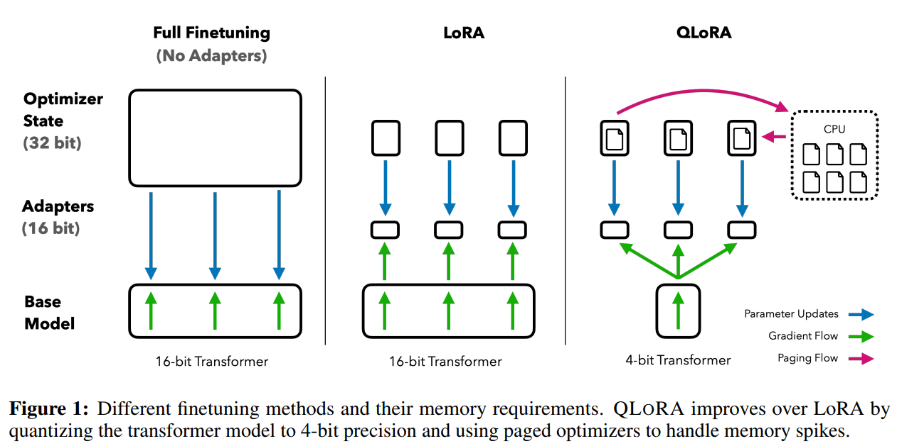

QLoRA 是一种高效微调LLM的方法，由华盛顿大学等团队在 2023 年提出。它结合了LoRA和 Quantization (量化) 技术，可在消费级GPU上对几十亿参数的LLM进行微调。

## 1. 基本认知
- QLoRA：Quantized Low-Rank Adapter。
- 技术融合：
  - Quantization：量化，把预训练模型权重压缩存储在低位精度（4-bit），减少显存占用。
  - LoRA：仅在特定权重矩阵插入低秩适配器，训练参数量大幅减少。
- 目标：在单卡消费级GPU（单张24GB显存）上对数十亿参数的 LLM 进行指令微调，效果接近全参微调。


## 2. 基本原理

量化+LoRA。

### 2.1 量化技术

量化是将高精度的浮点数(如FP32或FP16）转换为较低精度的整数（如int8或int4）表示，以减少模型的存储空间和加速推理。

- 普通浮点权重 (FP16/FP32) → 显存占用极大。
- QLoRA 采用 4-bit 量化：
  - 权重压缩为 NF4 格式，更好地保留分布特性。
  - 还引入 Double Quantization（对量化参数再次量化），进一步节省显存。


### 2.2 结合 Q + LoRA
- 将大模型参数加载为 4-bit 量化权重：冻结，不训练。
- 在目标层插入 LoRA Adapter。
- 训练过程中，只更新 LoRA 参数，不更新大模型权重。

### 2.3 QLoRA量化

QLoRA 使用更低精度，如INT4（4位整数），以更少的位数存储参数，同时通过一个量化比例保证精度的还原。

#### 2.3.1 核心原理

-   将参数范围压缩到一个有限范围，比 $-127$ 到 $127$（INT8 Qlora 8）或 $-7$ 到 $7$（INT4 Qlora4）。

-   存储参数的量化值，同时存储一个全局或局部的缩放因子，用于反量化时恢复精度。

#### 2.3.2 量化公式

==公式：==
$$
\mathbf{X}^{\text{Int8}} = \text{round}\Big(\frac{127}{\text{absmax}(\mathbf{X}^{\text{FP32}})} \cdot \mathbf{X}^{\text{FP32}}\Big) = \text{round}\big(c^{\text{FP32}} \cdot \mathbf{X}^{\text{FP32}}\big)
$$
**解释：**

- **absmax**：取整个权重矩阵的绝对值最大值
  $$
  \text{absmax}(\mathbf{X}) = \max(|X_{ij}|)
  $$
  这个值起到 **缩放因子** 的作用

- **缩放到 [-127,127]**

  - 把 FP32 权重按比例压缩到 Int8 可表示的整数范围 [-127,127]
  - 然后 round 成整数

- **回浮点值时**
  $$
  \mathbf{X}^{\text{FP32}} \approx \mathbf{X}^{\text{Int8}} / c^{\text{FP32}}
  $$
  相当于查表，表是线性的、等间隔的。

  

#### 2.3.2 案例助解

QLoRA的 int4 量化是把原始的 $FP32$ 权重映射到一个 **4位整数**表示范围。

- 这里 int4 的范围是 `[-7, 7]`，不是 `[-8,7]`：
  - 为了对称化向量，变成[-7,7]；
  - 防止边界化溢出，减少数值溢出风险；
  - 同理，int8 对应的就是[-127,127]

- 原始权重：浮点数
- 目标量化：整数 [-7, 7]

核心思想是：用一个缩放因子把浮点数映射到整数。

假设我们有一组 FP32 权重：

```css
w_fp32 = [-2.1, -0.5, 0.0, 1.2, 3.5]
```


##### 2.3.2.1 确定缩放因子

QLoRA 的 int4 量化通常使用**线性缩放**，公式：
$$
w_{int4} = \text{round}(w_{fp32} / \text{scale})
$$
`scale` = 最大绝对值 / 最大整数

- 最大整数 = 7
- 最大绝对值 = max(abs(w_fp32)) = 3.5

所以：
$$
\text{scale} = \frac{3.5}{7} = 0.5
$$


##### 2.3.2.2 量化到 int4

$$
w_{int4} = \text{round}(w_{fp32} / 0.5)
$$

逐个计算：

```css
- -2.1 / 0.5 = -4.2 → round(-4.2) = -4
- -0.5 / 0.5 = -1 → round(-1) = -1
- 0.0 / 0.5 = 0 → round(0) = 0
- 1.2 / 0.5 = 2.4 → round(2.4) = 2
- 3.5 / 0.5 = 7 → round(7) = 7
```

所以最终 int4 量化结果：

```css
w_int4 = [-4, -1, 0, 2, 7]
```

##### 2.3.2.3 反量化

在模型前向计算时，需要把 int4 转回浮点数：
$$
w_{fp32\_approx} = w_{int4} \times \text{scale}
$$
对应：

```css
- -4 × 0.5 = -2.0
- -1 × 0.5 = -0.5
- 0 × 0.5 = 0.0
- 2 × 0.5 = 1.0
- 7 × 0.5 = 3.5
```

> 注意：量化引入了小幅误差（-2.1 → -2.0，1.2 → 1.0），但通常不会显著影响性能。


##### 2.3.2.3 总结

- **FP32 → int4**：用 scale 缩放 + 四舍五入
- **int4 → FP32**：乘以 scale 反量化
- QLoRA int4 使用的范围是 `[-7,7]`，和 int8 的 [-127,127] 原理一样，只是精度更低


### 2.4 4-Normal Distribution

这是论文里一个非常核心但容易被忽略的点。

#### 2.4.1 原因分析

QLoRA 使用 4bit 量化对权重进行存储，会遇到了分布失配问题：

- 权重参数通常服从正态分布，多数权重接近 0，少量分布在尾部。
- int4 的15 个离散值 [-7,7]是等间距的，更适合均匀分布。
- 结果就是：
  - 接近 0 的权重太多，映射到相同整数 → **量化误差大**。
  - 极端大值被 scale 拉扯 → **小值精度丢失**。


#### 2.4.2 解决思路

QLoRA 提出了 **Double Quantization + 4-Normal Distribution** 来解决。

假设有权重分布（接近正态）：

```css
w = [-0.05, 0.01, 0.02, 0.03, 0.07, 0.5, 2.5, 4.0]
```

##### 2.4.2.1 普通量化

- scale = 4.0 / 7 ≈ 0.57

- 映射结果：

  ```css
  w_int4 = [0, 0, 0, 0, 0, 1, 4, 7]
  ```

- 问题：

  - 大量接近 0 的权重都映射成了 0，**信息丢失严重**。
  - 大值 4.0 独占最高档位 7。

##### 2.4.2.2 优化算法

根据正态分布的特性，把 $[-7,7]$ 的 **整数区间非均匀划分**，例如在 0 附近划分得更密集，远离 0 的区域划分得更稀疏。

```css
区间 1：权重非常接近中心（[-0.5, 0.5]）
区间 2：权重稍远（[-1.5, -0.5] 和 [0.5, 1.5]）
区间 3：极端权重（[-3, -1.5] 和 [1.5, 3]）
每个值映射到小的范围区间内，后做向量化与反向量化，转成整数。每个区间会对应自己的scaling
```

量化后：

```css
w_int4 ≈ [-1, 0, 0, 1, 2, 3, 6, 7]
```

优点：

- 接近 0 的数也能分布到多个整数区间，不会全挤到 0。
- 大值仍然有较好的表达能力。


 QLoRA 的 **4-Normal Distribution** 把权重正态分布和 int4 的均匀格子对齐，让 int4 的 15 个值在概率意义上分配得更合理，减少量化误差。

### 2.5 Double Quantization

双重量化，提升效率、降低显存的关键技术之一。

#### 2.5.1 原因分析

权重要从 $FP32$ 压缩到 $Int4$：

- 普通 int4 量化公式：
  $$
  w_{int4} = \text{round}(w_{fp32} / \text{scale})
  $$

- **问题**：

  - `scale` 本身是 $FP16$ 或 $FP32$ 浮点数，每个通道/组都要存储。
  - 对数百亿参数大模型来说，存储 scale 的开销很大，回答道几百 MB。
  - 虽然权重被压缩到 4bit，但额外关联的 **scale 张量** 还占据不少空间。


#### 2.5.2 核心思想

QLoRA 提出：缩放因子 (scale) 也做量化

1. **第1层量化**：把 FP32 权重量化到 int4，得到 `w_int4` 和 `scale1`。
2. **第2层量化**：再把这些 `scale1` 用 更低精度（如 int8）存储，而不是 FP16/FP32。

这样：

- 权重本身是 int4（极省空间）。
- 缩放因子也不是浮点数，而是再次压缩后的整数。

于是显存进一步减少。


#### 2.5.3 案例助解

假设我们有一组 FP32 权重：

```css
w = [-2.1, -0.5, 0.0, 1.2, 3.5]
```

- 普通单量化

  - 最大绝对值 = 3.5 → scale1 = 3.5/7 ≈ 0.5

  - 量化后：

    ```
    w_int4 = [-4, -1, 0, 2, 7]
    存储 = int4 权重 + FP16(0.5)
    ```

- Double Quantization

  - 第1步：和上面一样，得到 `scale1=0.5`。

  - 第2步：把所有 `scale1` 再统一存储在一个较小范围内，比如：
    - 所有 scale1 的值大约在 `[0.01, 1.0]`。
    - 对 scale1 做 **int8 量化**（比如 [-127,127]）。
    - 存储的时候不是 FP16，而是 int8。

==于是存储：==

```css
权重 w_int4 = [-4, -1, 0, 2, 7]
scale1 被量化为 int8（比如 64 表示 0.5）
```

反量化时：

```css
真实权重 ≈ (w_int4 × dequant(scale1_int8))
```


#### 2.5.4 优点

- **显存节省**：
   权重本来就 int4，每个参数 0.5 Byte；scale1 再量化成 int8，而不是 FP16。
   ⇒ 整体比普通 int4 量化要多省 40%以上显存。
- **精度保持**：
   scale1 变化范围很小（二次量化误差很有限），不会显著影响模型性能。


Double Quantization的作用：

- 第一层：权重 FP32 → int4（节省 4–8x 空间）。
- 第二层：scale FP16 → int8（再节省 40% 空间）。
- 好处：大模型（65B 参数）能在单张 48GB GPU 上微调。


### 2.6 分页机制

使用一个非常大的LLM进行训练时，无法将所有参数一次性加载到GPU显存中。通过使用分页机制，模型参数会被分成几个小块加载，这样可以有效利用有限的显存。

#### 2.6.1 背景假设

假设模型，包含 $1$ 亿个参数，$FP16$，每个参数占 $2$ 字节，一次性加载需要显存：

```css
1亿个参数×2字节=200MB
```

假设你的 GPU 显存有 8GB (8000MB)，这足够加载整个模型。

然而，上100亿参数模型训练过程中会遇到两个挑战：

- **优化器状态太大**

  - 比如用 AdamW 优化器，除了权重，还要存梯度、一阶矩、二阶矩。
  - 如果模型有 **65B 参数**，即使量化到 4bit，优化器状态也可能需要上百 GB 显存，放不下。

- **消费级 GPU 显存有限**

  - 我们通常只有单张 24GB 显存的 RTX 4060。
  - 如果不优化内存，根本没法微调大模型。

  

#### 2.6.2 分页机制

Paged Optimizers

QLoRA 提出分段加载优化器状态的机制：

- 显存当作高速缓存
- CPU内存，甚至磁盘，作为后备存储
- 在反向传播时：
  1. 只把当前需要更新的参数的优化器状态加载到 GPU 显存；
  2. 用完之后，写回 CPU 内存；
  3. 下一批参数需要更新时，再从 CPU 内存加载过来。

这样显存里只保留活跃的参数页。

#### 2.6.3 案例助解

假设你在微调一个 **65B 模型**，如果直接用 Adam：

- 参数：65B × 4bit ≈ 32GB（可以勉强放到 GPU）
- 优化器状态（m：一阶动量、v：二阶动量，各一份 FP32）：65B × 2 × 4byte ≈ **520GB** 

==有了分页机制：==

- GPU 显存里可能只放 **1GB 的活跃优化器状态**
- 其余 500GB 的状态存放在 **CPU 内存**，按需加载
- 训练时每次只更新一个 batch 的梯度，不需要一次性加载全部优化器状态

这就让 **在 24GB 消费级显卡上微调 65B 模型** 变得可能。


#### 2.6.4 效果分析

- **节省显存**：大幅降低显存需求（从几百 GB 降到几十 GB）。
- **轻微性能损失**：需要在 GPU ↔ CPU 之间拷贝数据，但 QLoRA 实验表明开销可接受。
- **通用性**：不仅能用于 QLoRA，也可以用于其他大模型优化器。


## 3. QLoRA 的优点

1. **显存占用低**  
   - LLaMA-7B 模型：普通 LoRA 需要 ~30GB 显存  
   - QLoRA (4-bit)：仅需 ~24GB 显存  
   - 13B、33B 甚至 65B 模型也能在单机 GPU 上微调。

2. **训练参数少**  
   - LoRA 参数量 < 1%，通常几百万到几千万。

3. **性能接近全参微调**  
   - 在多个任务基准上，QLoRA ≈ 全参数微调。

4. **经济高效**  
   - 消费级 GPU 即可完成大模型微调任务。


## 4. 典型流程

### 4.1 加载模型
- 使用 `bitsandbytes` 加载 4-bit 量化模型权重。

### 4.2 插入 LoRA
- 在注意力层的 `q_proj`、`v_proj` 等矩阵加上 LoRA Adapter。

### 4.3 冻结大模型参数
- 量化权重只读，不更新。

### 4.4 训练
- 优化器常用 `AdamW` 或 `AdamW8bit`。
- 训练方式可为监督微调 (SFT)、指令微调 (Instruction Tuning)、RLHF。

### 4.5 推理
- 推理时：基础模型 (4-bit) + LoRA delta 权重合并。


## 6. 实验与效果

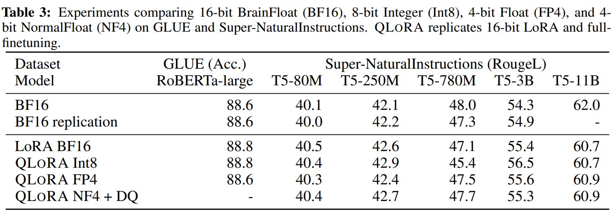

论文实验表明：LLaMA-65B + QLoRA (单机 48GB GPU)，效果接近全参微调。  

 

## 7. 总结
- **LoRA**：参数高效微调方案 → 仅更新小规模 Adapter。  
- **QLoRA**：在 LoRA 基础上引入 **4-bit 权重量化** → 显存占用更低。  
- **优势**：单机显卡即可微调超大模型，效果接近全参。  
- **场景**：指令微调、领域微调、个性化定制等。


# 七、显存占用计算

LoRA及QLoRA是如何节约显存的？也许你需要了解下显存是如何被占用的

## 1. 参数假设

  1B 参数数量：10亿个参数

-   参数精度：

  ```css
  FP32：4字节/参数
  FP16：2字节/参数
  INT4（量化）：0.5字节/参数
  ```

-  优化器状态

  ```asciiarmor
  通常需要存储 2-3 倍的模型参数（比如动量、梯度累积等）。
  ```

- LoRA 插入参数比例

  ```asciiarmor
  假设适配器权重占模型总参数的 0.1%
  ```

- QLoRA 分页机制

  ```css
  假设所有基础模型参数都存储在 CPU，而显存仅存储 LoRA 模块和部分中间梯度。
  ```

## 2. Full Finetuning

全量微调使用显存计算：

- 模型参数：FP16

  ```css
  1B×2bytes=2GB
  ```

- 优化器状态：FP16 动量+梯度等，假设 3 倍参数量

  ```css
  2GB×3=6GB
  ```

-   总内存需求

  ```css
  2GB+6GB=8GB
  ```

  

## 3. LoRA

低秩高效微调

- LoRA 微调模型参数：FP16，冻结，不更新

  ```css
  1B×2 bytes=2 GB
  ```

- LoRA 适配器参数：假设 0.1% 参数量，FP16

  ```css
  1B×0.001×2 bytes=0.002 GB (即 2MB)
  ```

- 优化器状态：仅适配器，假设 3 倍

  ```css
  0.002GB×3=0.006GB(即 6MB)
  ```

-   总内存需求

  ```css
  2GB+0.002GB+0.006GB=2.008GB
  ```

  

## 4. QLoRA

量化+LoRA

- 模型参数：INT4，存储在 CPU

  ```css
  1B ×0.5bytes=0.5GB
  ```

- LoRA 适配器参数：0.1%，FP16

  ```css
  1B×0.001×2bytes=0.002GB
  ```

- 优化器状态：仅适配器，假设 3 倍

  ```css
  0.006GB
  ```

- 中间缓存：用于分页，假设 GPU 仅加载一部分参数

  ```css
  0.5GB×10%=0.05GB
  ```

- 总显存需求（GPU 部分）：

  ```css
  0.002GB+0.006GB+0.05GB=0.058GB
  ```

- 总 CPU 存储需求：

  ```css
  0.5+0.058=0.558GB
  ```

## 5. 使用场景

| 微调方式 | 显存需求（GPU） | 适用场景 |
| --- | ---  | --- |
| Full Finetuning | 8 GB | 高性能环境，需全量更新参数。 |
| LoRA | 2.008 GB  | 中小型硬件环境，专注领域适配。 |
| QLoRA | 0.558 GB  | 极限内存优化场景（低显存机器，如 8GB 显存）。 |

  
