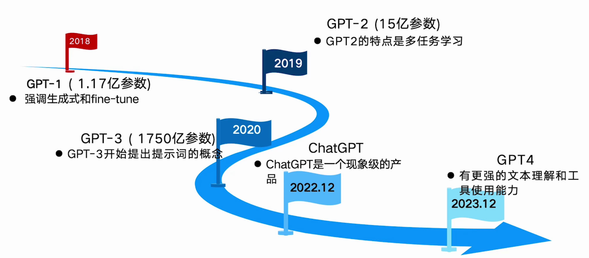
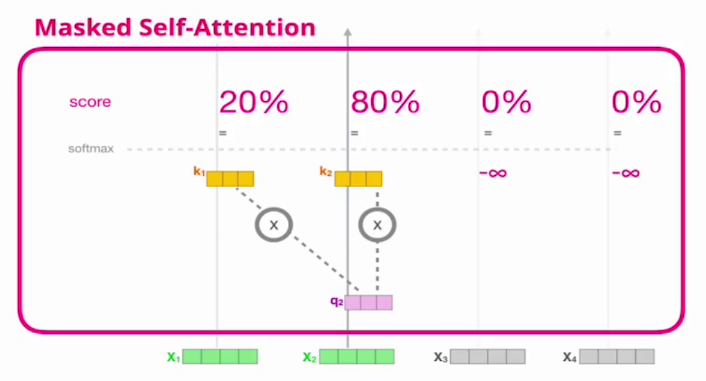
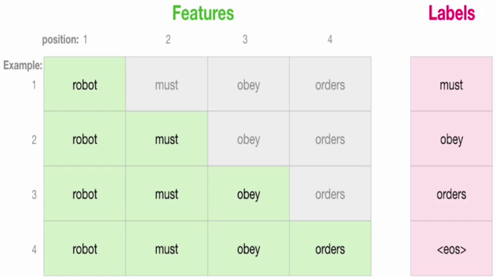
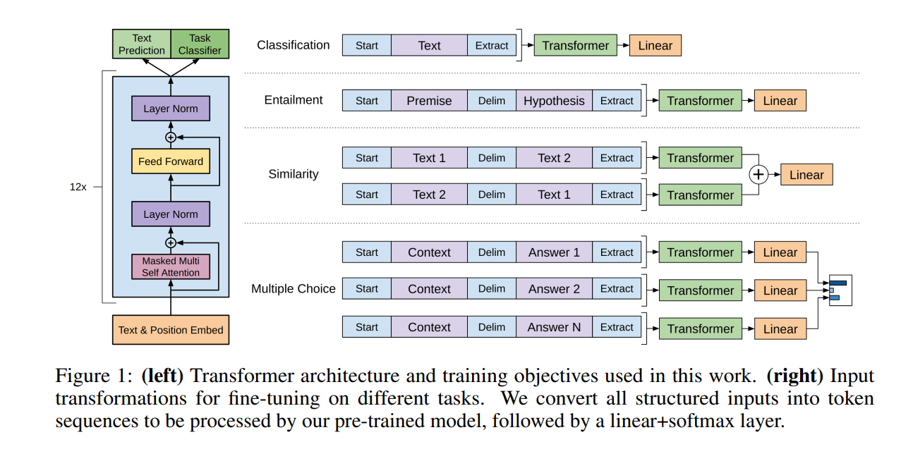
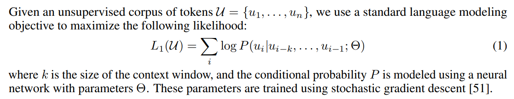
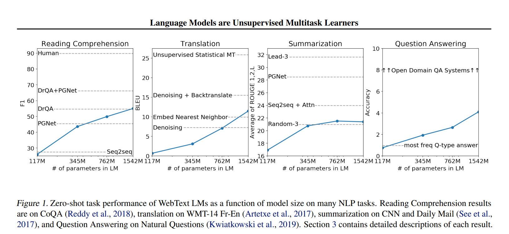
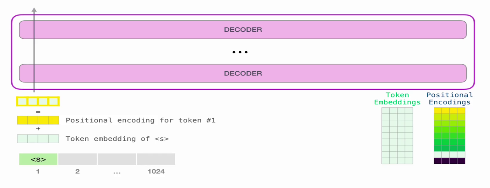
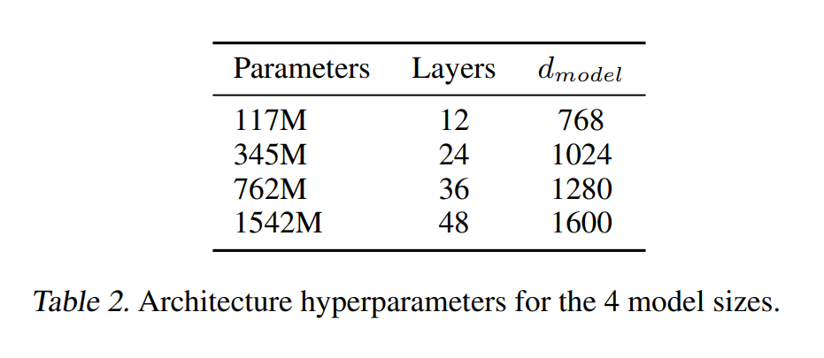
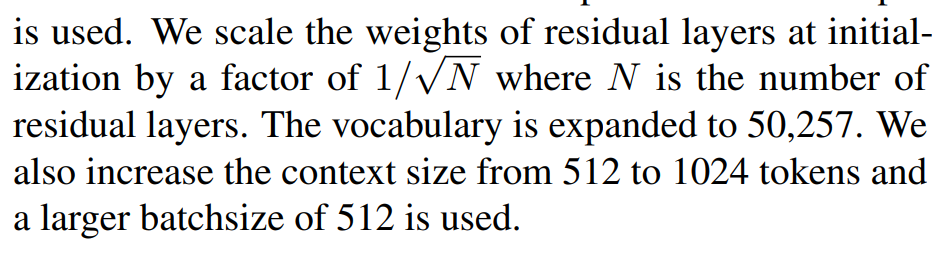
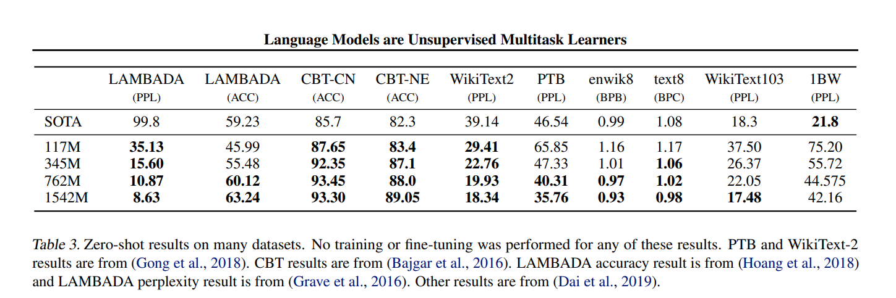

# 一、预训练大模型

HuggingFace的Transformers库提供了多种大模型，这些模型已经在大量数据上进行了预训练，并可应用于各种自然语言处理（NLP）任务，包括文本分类、情感分析、命名实体识别、机器翻译、文本生成、完形填空等。

模型查找：https://huggingface.co/models


## 1. 选择大模型

选择适合的预训练大模型通常取决于要处理的任务和数据集类型。

### 1.1 任务类型

不同的任务需要不同类型的模型。例如：

- **文本分类、情感分析、问答等**：你可以选择像BERT、RoBERTa、DistilBERT等模型，它们在这些任务中表现良好。
- **文本生成**：GPT、DeepSeek、T5、BARTk等模型适用于生成任务。
- **命名实体识别**：BERT和其变体（如BioBERT、SciBERT）在NER任务上非常有效。
- **多模态任务（如图文匹配）**：CLIP（视觉+文本模型）等模型适用于多模态任务。

### 1.2 模型大小

HuggingFace提供了多种大小的模型，模型大小会影响：

- **计算资源要求**：大型模型需要更多的计算资源和内存。
- **推理速度**：较小的模型推理速度较快，但通常精度较低。

因此，如果你有足够的计算资源，并且任务对准确性要求较高，可以选择大型模型。如果计算资源有限，或需要快速推理，选择更小型的模型可能会更合适。

### 1.3 数据集特性

如果你的数据集涉及特定领域（如医疗、法律等），使用在相关领域预训练的模型可能会更有效。例如：

- **BioBERT**：针对生物医学领域优化的BERT变体。
- **SciBERT**：针对科学文献的BERT变体。
- **LegalBERT**：针对法律文本优化的BERT变体。

### 1.4 Fine-tuning

许多大模型（如BERT、GPT等）可以进行微调以适应特定任务。


### 1.5 常见模型

1. **BERT（Bidirectional Encoder Representations from Transformers）**：
   - 用于文本分类、问答、命名实体识别等任务。
   - 有许多变体，如RoBERTa（更强的版本）和DistilBERT（轻量化版本）。
2. **GPT系列（Generative Pre-trained Transformers）**：
   - 用于文本生成任务。
   - GPT-2、GPT-3适合于更高质量的生成任务。
   - 更小的GPT变体，如GPT-Neo和GPT-J，适合资源有限的环境。
3. **T5（Text-to-Text Transfer Transformer）**：
   - 适用于各种文本任务，基于文本到文本的转换框架，特别适用于文本生成和翻译。
4. **BART（Bidirectional and Auto-Regressive Transformers）**：
   - 适用于文本生成、摘要和翻译等任务。
5. **CLIP（Contrastive Language-Image Pretraining）**：
   - 用于多模态任务，如图像和文本之间的匹配。


## 2. 使用大模型

HuggingFace的 $pipeline$ 是一个非常便捷的接口，它封装了许多常见的NLP任务，简化了大模型的使用。你只需要传入任务类型和相应输入，$pipeline$ 会自动选择合适的预训练模型进行推理。

官方文档：https://huggingface.co/docs/transformers/v4.51.3/zh/main_classes/pipelines


### 2.1 安装Transformers

首先，我们应该是安装过了：

```bash
pip install transformers
```

### 2.2 文本分类

Sentiment Analysis

文本分类任务是最常见的任务之一，比如情感分析（判断文本是正面的还是负面的）。

```python
from transformers import pipeline
# 创建pipeline对象
classifier = pipeline('sentiment-analysis')
# 输入文本
text = "I love HuggingFace! It's amazing."
# 使用pipeline进行情感分析
result = classifier(text)
print(result)
```

输出：

```python
[{'label': 'POSITIVE', 'score': 0.999876916885376}]
```

### 2.3 命名实体识别

Named Entity Recognition

命名实体识别任务用于识别文本中的特定实体（如人名、地点名等）。

```python
from transformers import pipeline

# 创建pipeline对象
ner_tagger = pipeline('ner', model='dslim/bert-base-NER')

# 输入文本
text = "HuggingFace is based in New York City."

# 使用pipeline进行NER任务
result = ner_tagger(text)

print(result)
```

输出：

```python
[
    {'word': 'HuggingFace', 'score': 0.9998430604934692, 'entity': 'I-ORG', 'start': 0, 'end': 12},
    {'word': 'New', 'score': 0.9995524883270264, 'entity': 'I-LOC', 'start': 26, 'end': 29},
    {'word': 'York', 'score': 0.9996720552444458, 'entity': 'I-LOC', 'start': 30, 'end': 34},
    {'word': 'City', 'score': 0.9996235375404358, 'entity': 'I-LOC', 'start': 35, 'end': 40}
]
```

### 2.4 文本生成 

Text Generation

文本生成任务通常使用像GPT系列这样的生成模型来基于给定的输入文本生成相关的内容。

```python
from transformers import pipeline

# 创建pipeline对象
generator = pipeline('text-generation', model='gpt-2')

# 输入文本（生成的文本会基于这个输入进行扩展）
text = "Once upon a time, in a land far away"

# 使用pipeline生成文本
result = generator(text, max_length=50)

print(result)
```

输出：

```python
[{'generated_text': 'Once upon a time, in a land far away there was a beautiful kingdom where people lived in peace and harmony. The king ruled wisely and everyone loved him. One day, a mysterious traveler arrived...'}]
```

### 2.4 文本翻译 

Translation

HuggingFace提供了预训练的翻译模型。

```python
from transformers import pipeline
# 创建pipeline对象
translator = pipeline('translation_zh_to_en', model='Helsinki-NLP/opus-mt-zh-en')
# 输入文本
text = "今天怎么开始热起来了？"
# 使用pipeline进行翻译
result = translator(text)
print(result)
```

输出：

```python
[{'translation_text': 'Why is it getting hot today?'}]
```

### 2.5 问答

Question Answering

MCR：从一个文本段落中回答用户提出的问题。

```python
from transformers import pipeline

oracle = pipeline(model="deepset/roberta-base-squad2", device=0)
re = oracle(
    question="Where do I live?", context="My name is Wolfgang and I live in Berlin"
)
print(re)
```

输出：

```python
{'score': 0.9190719127655029, 'start': 34, 'end': 40, 'answer': 'Berlin'}
```

### 2.6 填空任务

Fill-Mask

在填空任务中，模型会尝试根据上下文预测被遮掩的词。

```python
from transformers import pipeline

# 创建pipeline对象
fill_mask = pipeline('fill-mask', model='bert-base-uncased')

# 输入文本
text = "HuggingFace is creating a [MASK] platform."

# 使用pipeline进行填空
result = fill_mask(text)

print(result)
```

输出：

```python
[{'sequence': 'huggingface is creating a powerful platform.', 'score': 0.13889510905742645, 'token': 3453, 'token_str': 'powerful'},
 {'sequence': 'huggingface is creating a machine platform.', 'score': 0.12723168742656708, 'token': 3547, 'token_str': 'machine'},
 {'sequence': 'huggingface is creating a cool platform.', 'score': 0.11619173669815063, 'token': 5865, 'token_str': 'cool'},
 {'sequence': 'huggingface is creating a new platform.', 'score': 0.10033293050575256, 'token': 2091, 'token_str': 'new'},
 {'sequence': 'huggingface is creating a diverse platform.', 'score': 0.07253381520462036, 'token': 5895, 'token_str': 'diverse'}]
```


# 二、GPT系列

Transformer奠定了大模型理论基础。



## 1. GPT-1

GPT-1（Generative Pre-trained Transformer 1）是OpenAI发布的第一个基于Transformer架构的生成预训练语言模型。

### 1.1 基本认知

论文地址：https://cdn.openai.com/research-covers/language-unsupervised/language_understanding_paper.pdf

GPT-1是首个采用预训练-微调策略的Transformer生成模型，虽然规模较小，但对后续NLP发展产生了重要影响，为大规模生成模型的诞生提供了基础。

#### 1.1.1 Transformer架构

 GPT-1基于Transformer架构，是使用了解码器部分，在当时最先进的深度学习模型之一。

#### 1.1.2 无监督预训练

|  |  |
| :----------------------------------------------------------: | :----------------------------------------------------------: |
|              softmax之前把注意力得分设置为$−∞$               |           训练时采用teacher forcing，快速稳定收敛            |

自然语言理解包括各种不同的任务，如文本关联、问题解答、语义相似性评估和文本分类。虽然大量未标注的文本语料库非常丰富，但用于学习这些特定任务的标注数据却非常稀少，这使得经过监督训练的模型难以充分发挥作用。

#### 1.1.3 自回归生成模型


 GPT-1是一种自回归语言模型，意味着它根据之前的单词逐步生成下一个单词。模型的输出是每个词汇的概率分布，基于当前输入生成下一个词。 

#### 1.1.4 单一任务到多任务

GPT-1是第一个使用“预训练+微调”策略的模型，它在一个大规模的语料库上进行预训练，然后通过在特定任务（如文本分类、问答、情感分析等）上的微调，取得了不错的效果。

### 1.2 模型架构和参数

对比BERT使用transformer的编码器，GPT是Decoder-Only结构，它没有编码器，仅使用解码器：



```asciiarmor
因GPT是一个Decoder-Only的结构，它没有编码器，也就不用与所谓编码器交互了，因此，在GPT中取消中间的交互注意力层，只保留了带掩码的多头注意力层和前馈网络层。
```

- **层数（Layers）**：12层Transformer解码器。
- **隐藏层大小（Hidden size）**：768个隐藏单元。
- **头数（Attention heads）**：12个自注意力头。
- **参数量**：约1.1亿个参数。


### 1.3 预训练和微调

Pretraining + Fine-tuning是大模型基本范式。

#### 1.3.1 预训练阶段

与BERT不同，GPT采用了传统的LM方法进行预训练，即使用单词的上文来预测单词，而BERT是采用了双向上下文的信息共同来预测单词。正是因为训练方法上的区别，使得GPT更擅长处理自然语言生成任务(NLG)，而BERT更擅长处理自然语言理解任务(NLU)。

```css
简单说：GPT的预训练任务是下一个词预测，而BERT的预训练是完形填空。
```

##### 1.3.1.1 无监督学习


$$
k：表示是滑动窗口的大小，即每次预测单词时的句子长度； \\
P：表示条件概率。
$$
使用BooksCorpus数据集来训练语言模型。它包含来自各种类型的7000多本独特的未出版书籍，更重要的是，它包含长的连续文本，这允许生成模型学习长期信息。

##### 1.3.1.2 有监督微调


 GPT-1先在大规模文本数据集上进行预训练，然后再通过少量监督学习数据进行微调。这种方法大大提升了模型的性能，尤其是在各种下游任务上（如问答、情感分析、文本生成等）。

- 文本分类：有添加两个特殊符号(Start和Extract)，一个线性层。
- 蕴含理解：给一段话，提出一个假设，看看假设是否成立。将前提(premise)和假设(hypothesis)通过分隔符(Delimiter)隔开，两端加上起始和终止token。再依次通过transformer和全连接得到预测结果；
- 文本相似：断两段文字是不是相似。相似是一个对称关系，A和B相似，那么B和A也是相似的；所以参考图，先有Text1+分隔符+Text2，再有Text2+分隔符+Text1，两个序列分别经过Transformers后，各自得到输出的向量；我们把它按元素加到一起，然后送给一个线性层。这也是一个二分类问题。
- 问答：多个序列，每个序列都由相同的问题Context和不同的Answer构成。如果有N个答案，就构造N个序列。每个QA序列都各自经过Transformers和线性层，对每个答案都计算出一个标量；最后经过softmax生成一个各个答案的概率密度分布。这是N分类问题。


#### 1.3.2 微调阶段

 在预训练之后，GPT-1可以通过微调来适应具体任务。在微调阶段，模型通过任务特定的数据集进行训练，从而能够执行诸如情感分析、命名实体识别、文本生成等任务。

### 1.4 创新意义

- 预训练+微调：GPT-1展示了通过大规模无监督预训练模型，再通过少量的监督学习进行微调的策略。在当时NLP领域是一种新的思路，极大地提高了NLP任务的效果。
- 自回归生成：GPT-1通过自回归方法生成文本，推动了基于Transformer的生成模型的发展。

### 1.5 局限性

- 模型规模：GPT-1的参数量相对较小（约1.1亿个参数），因此在处理更复杂的任务时，表现上有所欠缺。相比之下，后续的GPT-2（15亿参数）和GPT-3（1750亿参数）拥有更强的能力。
- 数据限制：GPT-1虽然使用了大规模的文本数据进行训练，但仍然存在着对训练数据依赖的问题，可能会对某些罕见的语言模式或领域知识处理较差。


## 2. GPT-2

Generative Pretrained Transformer 2。

论文地址：https://cdn.openai.com/better-language-models/language_models_are_unsupervised_multitask_learners.pdf

自然语言处理任务如问答、机器翻译、阅读理解和摘要，通常通过监督学习在特定数据集上完成。而 GPT-2 论文证明，大型语言模型在大规模 WebText 数据集上训练后，能在无需监督和微调的情况下，通过 zero-shot 学习直接完成下游任务。GPT-2 基于 Transformer 架构，参数规模大幅提升，最大版本达到 15 亿参数。

### 2.1 主要特点

1. 预训练和微调：GPT-2 在大规模文本数据上进行了无监督预训练，学习语言模式和结构，之后可以通过微调来适应具体的任务，例如问答、文本生成、翻译等。
2. 文本生成：GPT-2 的强大之处在于其生成自然语言文本的能力。给定一个提示，它可以生成连贯、自然的文章段落。
3. 无监督学习：与许多传统的模型不同，GPT-2 不需要标注数据来进行训练，它通过预测下一个单词的概率来学习语言规律。
4. 能力和局限：尽管 GPT-2 能生成非常自然的文本，但它也存在局限，比如生成的信息有时不准确，或表现出偏见和不恰当的内容。


### 2.2 性能

不同尺寸的预训练GPT2在zero-shot设置下执行阅读理解、机器翻译、摘要、问答任务上取得的性能：




### 2.3 核心思想

$$
p(x) = \prod_{i=1}^{n} p(s_n | s_1, \dots, s_{n-1})
$$

一个通用系统应该能够针对具体任务并根据输入来生成输出：
$$
p(output|input, task)
$$
因此LM可以转换为用符号序列来指定任务，用输入和输出表示。
例如：

```basic
翻译任务：(translate to french, english text, french text)。
阅读理解任务：(answer the question, document, question, answer)
```


### 2.4 训练数据集

GPT2没有采用传统的文本数据集，而是创建了一个强调文档质量的网络抓虫，但是人工筛选的数据质量更高但成本也高。所以爬虫抓取了一个社交媒体平台上大量的外部链接，因为Reddit上的外链通常是用户认为比较有趣、有价值的，类似于一种启发式指标，低成本的保证了数据的质量。

基于此创建了数据集Web Text，包含了4500万个链接的文本数据。随后经过去重和数据清理后，获得了大约800万份文档，总计40GB的文本。

Web Text中删除了所有维基百科文档，因为它是其他数据集的常见数据源，可能会由于训练数据与测试评估任务的重叠而使分析复杂化。


### 2.5 输入表示

通用的语言模型应该能够处理任何字符，但是现有的语言模型通过包含各种预处理操作：lower-casing、tokenization、预设词汇表等。这些操作都会限制语言模型能够处理的字符范围。



综合考虑了OOV问题和基础词汇表过大(Unicode的全部符号）的问题后，使用经过调整的byte级的BPE算法，也就是BBPE。最终得到50257个词汇量的BPE，该方法可以表示任何Unicode字符组成的字符串，这使得可以在任何数据集上评估模型，无论预处理、标记化或词汇量的大小如何。


### 2.6 模型结构

GPT2使用了Transformer解码器架构，在GPT1模型的基础上做了一些小改动。

#### 2.6.1 层数与参数量

GPT-2 提供了多个版本，主要区别在于模型的规模（层数和参数量）：

```css
最小的模型等同于原始GPT，第二小的模型相当于BERT的最大模型。
最大的模型称之为GPT2，比GPT1的参数多一个数量级。
```




- 小型版本：12层解码器，117M参数。

- 中型版本：24层解码器，345M参数。

- 大型版本：36层解码器，762M参数。

- 超大版本：48层解码器，1542M参数。

  

#### 2.6.2 对比GPT1

- 调整Transformer的decoder，将Layer normalization移动到每个decoder子块的输入位置，并在最后一个decoder子块的自注意层后添加一个额外的Layer normalization；

- 初始化时残差层的权重乘系数；

  

- BBPE词汇量扩大到50257个，batch size大小设为512；

总体，差距不大。


### 2.7 性能

大模型评估指标及GPT2表现

#### 2.7.1 大模型评估指标

| 指标                 | 说明                           |
| -------------------- | ------------------------------ |
| 困惑度（Perplexity） | 训练时可以直接计算             |
| BLEU                 | 评估生成文本与参考答案的相似度 |
| ROUGE                | 评估生成文本与参考答案的覆盖度 |
| 人工评估             | 通常用于复杂生成任务的主观打分 |

#### 2.7.2 GPT2表现



不同的指标类型和对应的数据集：

- PPL：困惑度，是衡量语言模型预测不确定性的指标，越低越好

  困惑度衡量的是模型对下一词预测的不确定性，**数值越低表示模型越好**。

  简单理解：

  - 如果困惑度为 10，意味着模型对下一词的平均猜测有 10 种可能。
  - 如果困惑度为 2，说明模型更确定，预测能力更强。

  

- SOTA： State of the Art，即“最先进技术”或“当前最优的技术”。

- LAMBADA：是一个特定的语言建模任务，测试模型预测句子中的某个单词的能力。
  - PPL： Perplexity，困惑度，用于衡量语言模型的预测能力，值越低越好。
  
- CBT-CN 和 CBT-NE：这两个任务来自于CBT（Cloze test）数据集，分别代表不同的任务版本：
  - ACC： Accuracy，准确率，用于衡量模型预测正确答案的比例。
  
- WikiText2、PTB、enwik8、text8、WikiText103、1BW：不同的文本数据集，通常用于评估语言模型。
  - BPB： Bits per Byte，表示每字节的信息量，常用于评估压缩任务的表现，越低越好。
  - BPC： Bits per Character，表示每字符的信息量，也用于评估语言模型的效率，值越低越好。

