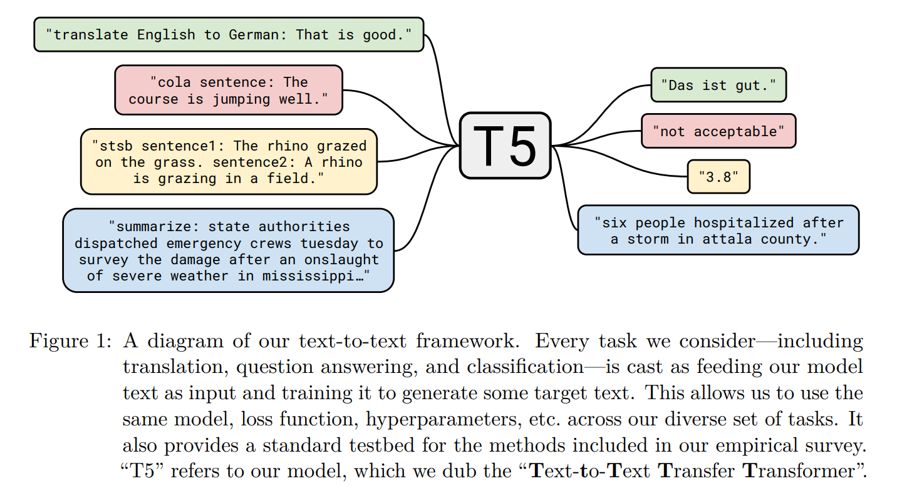
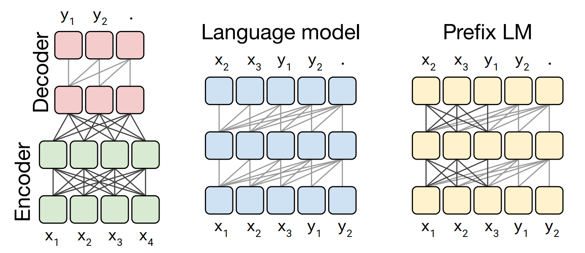
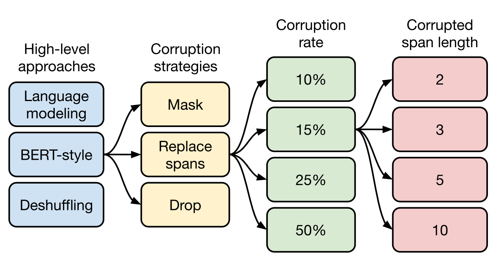
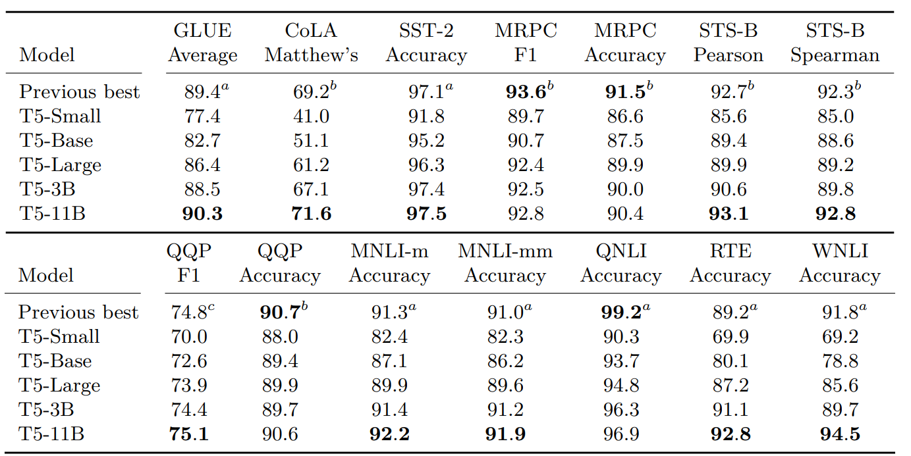

# 一、T5模型

T5 模型，全称是 **Text-To-Text Transfer Transformer**，是由 Google Research在 2020 年发布的一种强大的预训练语言模型。它的核心理念是：将所有NLP任务统一转换成文本到文本的格式。

## 1. 核心思想

T5的设计哲学是“统一”。也就是说，不管是翻译、问答、摘要还是情感分类，都转化为一个“输入文本 → 输出文本”的问题：

- 翻译任务：
  - 输入：`translate English to German: That is good.`
  - 输出：`Das ist gut.`
- 摘要任务：
  - 输入：`summarize: The quick brown fox jumps over the lazy dog.`
  - 输出：`Fox jumps over dog.`
- 分类任务：
  - 输入：`sst2 sentence: I love this movie!`
  - 输出：`positive`

这种设计向AGI迈出了重要一步。

## 2. 模型架构

T5 采用的是标准的Transformer 编码器-解码器结构，类似原始的 Transformer，但做了一些调整：

- 使用了相对位置编码（Relative Position Embedding）

- 去掉了 LayerNorm 的 bias 和 dropout 的一些细节优化

  

## 3. 训练数据

C4：Colossal Clean Crawled Corpus

T5 使用的预训练数据是从公共网页上抓取、清洗后的 **C4 数据集（750GB）**，比传统的 Wikipedia、BooksCorpus 更庞大。

**训练方法：** 强大的算力作为支撑

- ==BERT-style==式的破坏方法;
- ==Replace Span==的破坏策略;
- $15\%$ 的破坏比;
- $3$ 的破坏长度。

## 4. 模型规模

T5有不同的模型大小，只是参数不同而已 

### 4.1 规模

| 模型名   | 参数数量 | 层数（Encoder/Decoder） | 注意力头数 | 每头维度 | 隐藏层维度 (d_model) | 前馈维度 (d_ff) |
| -------- | -------- | ----------------------- | ---------- | -------- | -------------------- | --------------- |
| T5-Small | 60M      | 6 / 6                   | 8          | 64       | 512                  | 2048            |
| T5-Base  | 220M     | 12 / 12                 | 12         | 64       | 768                  | 3072            |
| T5-Large | 770M     | 24 / 24                 | 16         | 64       | 1024                 | 4096            |
| T5-3B    | 3B       | 24 / 24                 | 32         | 64       | 1024                 | 16384           |
| T5-11B   | 11B      | 24 / 24                 | 64         | 64       | 1024                 | 65536           |

### 4.2 效果

## 5. 应用任务

T5 被设计来统一所有NLP任务，它可以用于：

- 文本分类
- 文本生成（如摘要、翻译）
- 问答系统
- 对话系统
- 多轮推理（multi-hop QA）
- 数据增强

## 6. 优势

- 通用性强：一个模型多任务通吃
- 易于迁移：只需要重新设计 prompt（前缀）即可适配不同任务

# 二、项目实战

SQuAD问答系统：阅读理解的实现。

人工智能三大块：数据、算法、算力

TODO~

