# 一、大模型

T5\BERT\GPT → Transformer的儿子→自注意力机制+神经网络

大模型， Large Model，是指参数规模庞大、训练数据量巨大、具有强泛化能力的人工智能模型，典型代表如GPT、BERT、PaLM等。它们通常基于深度神经网络，特别是Transformer架构，在自然语言处理、图像识别、代码生成等任务中表现出色。


## 1.  基本概念


大模型是指在超大规模数据集上训练、拥有数十亿到千亿以上参数的人工智能模型，具备多任务、多模态能力，并能通过少量样本甚至零样本完成新任务。

## 2. 主要特征

大模型具备以下特征：

- 参数规模大
   数亿至数千亿参数，容量决定了模型的表达与泛化能力。
- 数据训练量大
   利用海量文本、图像、音频等多模态数据训练，提升模型的通用性。
- 基于Transformer
   多数大模型采用Transformer作为基础结构，具备强大的表示学习能力。
- 强泛化与迁移能力
   一次训练，多场景复用（如ChatGPT既能对话，也能写代码、改文案）。
- 具备“涌现能力”
   模型规模突破某个阈值后，表现出超越训练目标的智能行为（如逻辑推理、复杂生成）。
- 可调优能力强
   支持微调（Fine-tuning）、提示学习（Prompt Learning）、参数高效调优（LoRA、Adapter等）。
- 多模态发展趋势
   从纯文本模型发展到图文、语音、视频等多模态大模型，如GPT-4V、DeepSeek、Grok等


## 3. 应用方向
1. **Agent智能体（AI管家）**
   - **概念**：像一个“全能私人助理”，能自己分析问题、拆解任务、调用工具解决问题。
   - **例子**：你想周末去露营，告诉它：“帮我找个离市区近、能带宠物、有烧烤区的露营地，订周六的房间，再推荐附近超市买食材。”它自动完成：搜攻略 → 筛选地点 → 查天气 → 订营地 → 生成购物清单 → 发到你手机。
   - **好处**：不用自己一步步操作，AI能“动脑子”帮你搞定复杂任务。
   - **流程**：用户输入 -> 拆解任务 -> 意图识别 -> 调用对应的函数并执行 -> 完成执行

2. **语音聊天助手（会聊天的AI）**
   - **概念**：像“升级版Siri”，能自然对话、理解语气，甚至模拟真人情感。
   - **例子**：你开车时说：“我好困啊，来点提神的音乐，再导航到最近的咖啡店。”它回答：“马上切到摇滚歌单！前方500米有星巴克，要帮你点一杯冰美式吗？”（还能学你喜欢的说话风格）
   - **好处**：不用打字，动动嘴就能聊天、查信息、控制智能家居，像有个“随身陪聊”。
   - **流程**：语音输入 -> 语音识别转文字 -> 大模型对话 -> 文本转语音 -> 完成对话

3. **医学客服（AI健康小助手）**
   - **概念**：医院的“虚拟前台”，能解答常见问题、提醒用药、分诊建议。
   - **例子**：你半夜胃疼，打开医院APP问：“吃了火锅后胃痛，该挂哪个科？现在能吃什么药缓解？”AI回答：“建议挂消化内科，暂时可服用XX药（非处方）。若呕吐加重，请立即急诊。”并推送附近24小时药店。
   - **好处**：24小时在线，快速解答小毛病，避免排队问医生，隐私问题也能匿名咨询。
   - **流程**：问题输入 -> 检索知识库 -> 问题拼接 -> 大模型对话 -> 给予回复

## 4. 开发流程

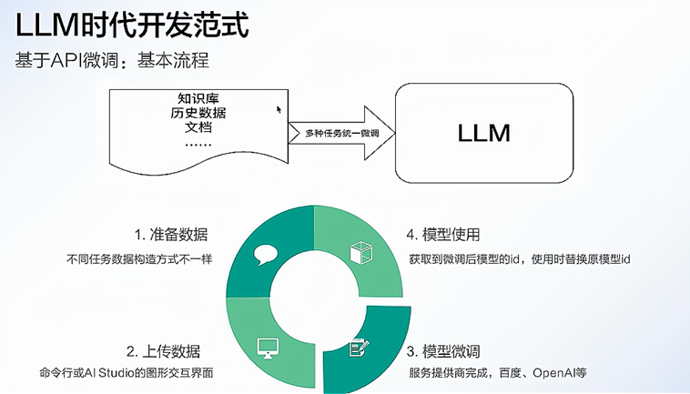

大模型开发是一个系统工程，涉及数据、模型、算力、训练、部署、安全与迭代等多个环节。

- **任务定义与需求分析**
  - 明确应用场景（如对话、写作、推荐、图像识别等）
  - 选择模型类型（NLP、CV、多模态等）
- **数据准备与预处理**
  - 收集高质量、大规模数据（文本、图像、音频等）
  - 去噪清洗、标注、格式转换、去重与分词等
- **模型设计与选择**
  - 选择合适的模型架构（如GPT、BERT、ViT、T5等）
  - 设定层数、宽度、注意力机制等结构参数
- **训练策略与资源配置**
  - 分布式训练/混合精度训练
  - 使用大规模算力资源（GPU/TPU集群）
  - 设置优化器（AdamW）、学习率调度等参数
- **评估与调优**
  - 评估指标：PPL、准确率、BLEU、ROUGE、F1等
  - 微调/指令调优（Instruction tuning）/RLHF等方法提升效果
- **推理部署与压缩优化**
  - 部署到服务器或边缘端（云部署、API服务）
  - 模型量化、裁剪、蒸馏、MoE等手段提升推理效率
- **安全机制与合规检测**
  - 防止生成有害/敏感内容
  - 对输出进行内容审查、对抗样本防御、模型水印等
- **持续迭代与生态构建**
  - 基于用户反馈持续优化
  - 构建插件系统、开发者平台等生态体系

## 5. 关键要点

- 在大模型应用开发时，不会从头开始构建一个新的模型，基于已有基座模型进行二次开发是行业主流实践。

- 选用已有的基座模型，并采用相应的技术手段优化大模型，如：微调，RAG，并行推理等。
- 选用流行且成熟的框架，通过参数调整和功能集成实现业务需求，避免重复造轮子。

## 6. 项目介绍
- 简历

  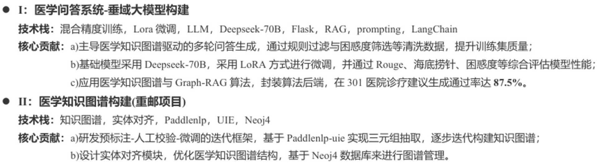

- 项目框架

  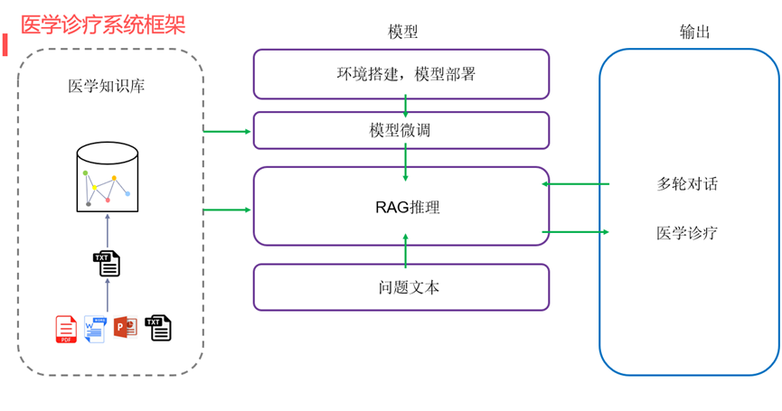

- 三个模块
   - 大语言模型(LLM)--实现大语言模型的对话功能：大模型的本地部署，微调训练，流式对话，多轮对话。
   - RAG技术--增强大语言模型的对话能力：文本分割，文本嵌入，知识检索
   - 知识图谱--实现数据的高效存储：neo4j数据库，三元组抽取，实体对齐

- 项目展示

  | 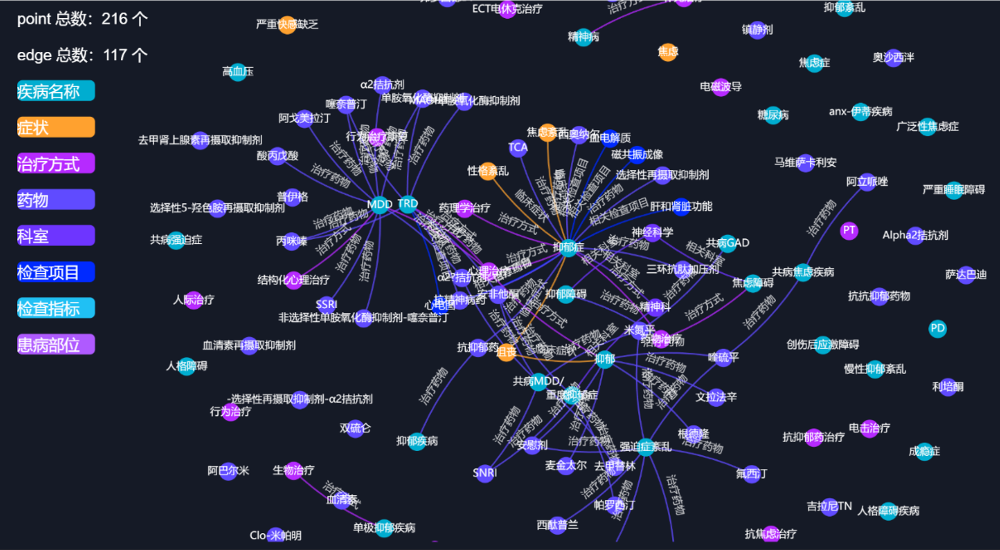 |
  | ------------------------------------------------------------ |
  | 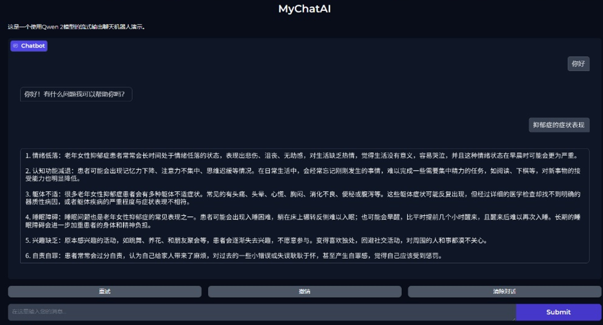 |

  

# 二、LLM

开始实际案例的展示......

## 1. API调用

大模型通过API调用是目前最常见、最便捷的使用方式，用户无需训练模型，只需调用接口即可享受强大的 AI 能力，比如文本生成、翻译、图像识别、代码补全等。

### 1.1 基本流程

- **获取 API 权限**
  - 注册平台账号（如 OpenAI、DeepSeek、阿里通义、讯飞星火等）
  - 获取 `API Key` 或 `Access Token`
- **准备请求参数**
  - 选择模型
  - 设置请求体
- **发起 API 请求**
  - 使用编程语言（如 Python、JavaScript）通过 HTTP 协议调用接口
- **解析响应结果**
  - 获取模型返回内容（如文本、图片链接、结构化数据等）
  - 可与前端、应用系统集成使用

### 1.2 基本特征

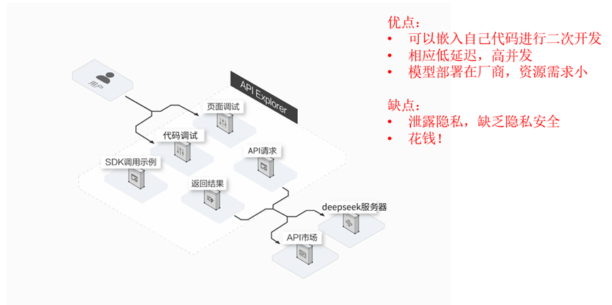

大模型API调用将复杂的模型能力简化为标准化服务，核心价值在于：

- 降低使用门槛：无需本地部署千亿参数模型，节省硬件与运维成本。

- 灵活适配场景：通过参数调节和上下文学习快速满足业务需求。

- 规模化支持：依托云计算实现高可用、低延迟的企业级服务。


### 1.3 DeepSeek实操

DeepSeek作为国内优秀的LLM平台，是一个不错的选择~

#### 1.3.1 准备工作

- 访问deepseek官网，并注册账号：[DeepSeek官网](https://www.deepseek.com/)

  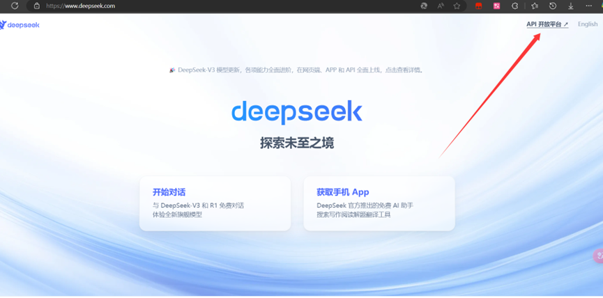

  

- 注册账号并且充值

  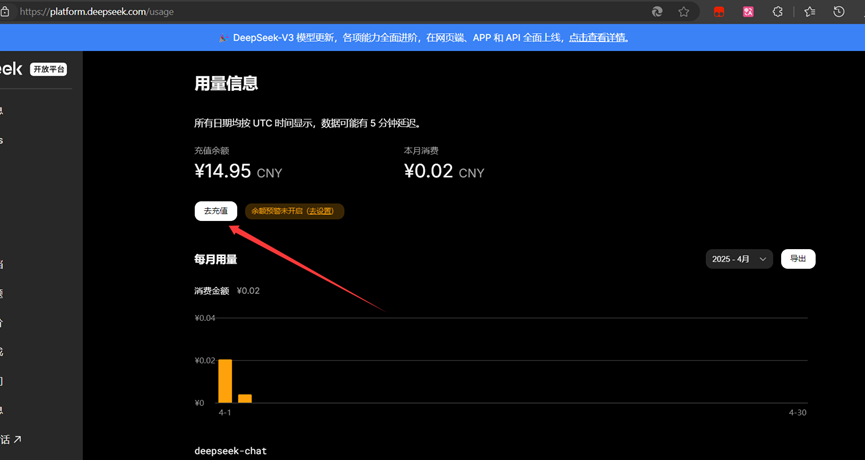

- 创建API-key

  ==仅在创建时可见可复制==

  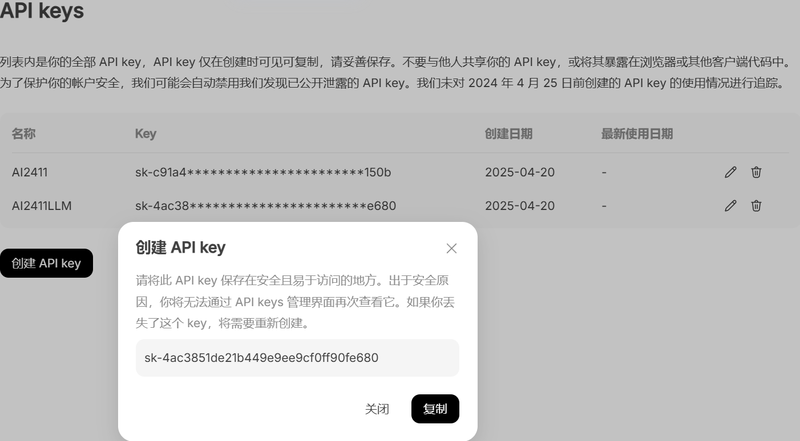

  ```bash
  sk-f9deff6faca64899a3faaaf1f4c53d1d
  ```

  

- 查看使用手册

  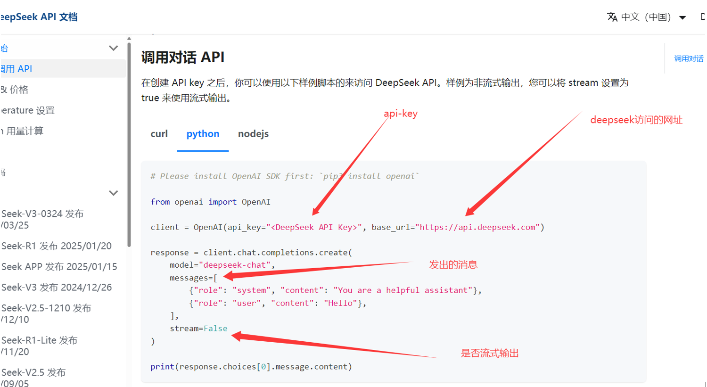

  

#### 1.3.2 非流式输出

 等模型生成完整结果后一次性返回，适合短文本、结构化内容提取等任务。

- 特点

  - 优点：

    - 使用简单，**一次性拿到完整结果**

    - 适合分析处理、摘要抽取、短文本问答等

  - 缺点：

    - 响应时间长，特别是文本很长时

    - 体验较差，用户需要等待全部生成完才能看到内容

- 环境安装
   ```bash
   pip install openai
   ```
- 非流式输出
   ```python
   # Please install OpenAI SDK first: `pip3 install openai`
   from openai import OpenAI
   
   client = OpenAI(
       api_key="sk-f9deff6faca64899a3faaaf1f4c53d1d", base_url="https://api.deepseek.com"
   )
   
   response = client.chat.completions.create(
       model="deepseek-chat",
       messages=[
           {"role": "system", "content": "You are a helpful assistant"},
           {"role": "user", "content": "明月几时有"},
       ],
       stream=False,
   )
   
   print(response.choices[0].message.content)
   
   ```

- 输出结果

  ```bash
  “明月几时有”是苏轼《水调歌头·明月几时有》中的名句，全文如下：
  
  **《水调歌头·明月几时有》**  
  明月几时有？把酒问青天。  
  不知天上宫阙，今夕是何年。  
  我欲乘风归去，又恐琼楼玉宇，高处不胜寒。  
  起舞弄清影，何似在人间。  
  
  转朱阁，低绮户，照无眠。
  不应有恨，何事长向别时圆？
  人有悲欢离合，月有阴晴圆缺，此事古难全。
  但愿人长久，千里共婵娟。
  
  ### 赏析：
  1. **背景**：此词作于宋神宗熙宁九年（1076年）中秋，苏轼在密州（今山东诸城）任职时，怀念弟弟苏 辙而写。
  2. **情感**：以月起兴，围绕中秋明月展开想象，交织人间情怀与宇宙哲思，既有对亲人的思念，又有对 人生无常的豁达。
  3. **名句**：
     - “人有悲欢离合，月有阴晴圆缺”道出世事无常的常态。
     - “但愿人长久，千里共婵娟”成为表达远方亲友平安共勉的千古绝唱。
  
  
  ### 小知识：
  这首词被誉为“中秋词之冠”，后曾被改编为经典歌曲（如王菲演唱的《但愿人长久》）。若您想进一步探讨其文学手法或创作背景，可以随时告诉我！
  ```
  
  

#### 1.3.3 流式输出

 服务器将响应内容一段一段地实时返回，适合长文本、对话、写作等需要即时反馈的场景。

- 特点

  - 优点

    - **响应快**：无需等全部生成完毕，先生成先返回

    - **体验佳**：像人打字一样流畅，常用于对话机器人

    - **可中断**：用户可随时打断流式响应过程

  - 缺点

    - 编程稍复杂，需要处理数据流拼接

    - 不易直接使用普通 HTTP 请求工具（如 Postman）

- 原理

  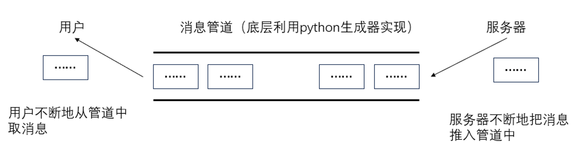

- 流式推理的实现—生成器
   ```python
   import time
   
   def test():  # 生成器函数
       for i in range(10):
           time.sleep(1)
           yield i  # 生成器函数，使用yield关键字返回值
   
   if __name__ == "__main__":
       aaa = test()
       print(aaa)  # aaa是一个生成器，可以想象成一个队列，每读取一次，就会执行一次函数体
       for a in aaa:
           print(a)  # 读取生成器中的值
   ```

- 流式推理代码编写：
   ```python
   from openai import OpenAI
   
   client = OpenAI(
       api_key="sk-f9deff6faca64899a3faaaf1f4c53d1d", base_url="https://api.deepseek.com"
   )
   
   response = client.chat.completions.create(
       model="deepseek-chat",
       messages=[
           {"role": "system", "content": "You are a helpful assistant"},
           {"role": "user", "content": "明月几时有"},
       ],
       stream=True,
   )
   
   # 流式输出
   out = []
   for chunk in response:
       print(chunk.choices[0].delta.content)
       out.append(chunk.choices[0].delta.content)
       print('-' * 10)
       print(''.join(out))
   
   ```


#### 1.3.4 总结对比

| 项目       | 流式输出           | 非流式输出           |
| ---------- | ------------------ | -------------------- |
| 返回方式   | 边生成边返回       | 全部生成后一次返回   |
| 响应速度   | 快                 | 慢（尤其是长文本）   |
| 使用体验   | 更自然（打字式）   | 等待过程较长         |
| 编程复杂度 | 稍复杂（需拼接）   | 简单                 |
| 适用场景   | 对话生成、直播问答 | 简短回复、结构化处理 |


#### 1.3.5 代码封装

将代码封装为类，方便其他文件调用此功能。

**非流式输出：**

```python
from openai import OpenAI

class DeepseekAPI:
    def __init__(self, api_key):  # 初始化方法
        self.api_key = api_key  # API密钥
        self.client = OpenAI(
            api_key=api_key, base_url="https://api.deepseek.com"
        )  # 实例化OpenAI客户端

    def inference(self, messages):
        response = self.client.chat.completions.create(
            model="deepseek-chat",
            messages=messages,  # 消息内容
            stream=False,  # 设置为False以获取完整响应
        )
        return response.choices[0].message.content  # 返回完整响应


# 测试代码
if __name__ == "__main__":
    api_key = "sk-f9deff6faca64899a3faaaf1f4c53d1d"  # API密钥
    messages = [
        {"role": "system", "content": "你是一名AI助手"},
        {"role": "user", "content": "请简要介绍一下你自己"},
    ]  # 定义消息内容
    stream = False  # 设置为True以获取流式输出，False以获取完整响应
    deepseek_api = DeepseekAPI(api_key)  # 实例化DeepseekAPI类
    result = deepseek_api.inference(messages)  # 调用推理方法
    print(result)  # 打印响应内容

```

**流式输出：**

```python
# 流式输出:
from openai import OpenAI

class DeepseekAPI:
    def __init__(self, api_key):  # 初始化方法
        self.api_key = api_key  # API密钥
        self.client = OpenAI(
            api_key=api_key, base_url="https://api.deepseek.com"
        )  # 实例化OpenAI客户端

    def inference(self, messages):
        response = self.client.chat.completions.create(
            model="deepseek-chat",
            messages=messages,  # 消息内容
            stream=True,  # 设置为False以获取完整响应
        )
        for chunk in response:  # 遍历响应的每个块
            if chunk.choices:  # 如果块中有返回内容
                content = chunk.choices[0].delta.content  # 获取内容
                yield content  # 逐块返回内容

# 测试代码
if __name__ == "__main__":
    api_key = "sk-f9deff6faca64899a3faaaf1f4c53d1d"  # API密钥
    messages = [
        {"role": "system", "content": "你是一名乐于助人的人工智能助手"},
        {"role": "user", "content": "请简要介绍一下你自己"},
    ]  # 定义消息内容
    stream = False  # # 设置为True以获取流式输出，False以获取完整响应
    deepseek_api = DeepseekAPI(api_key)  # 实例化DeepseekAPI类
    result = deepseek_api.inference(messages)  # 调用推理方法
    for chunk in result:  # 遍历响应的每个块
        print(chunk, end="")  # 打印每个块的内容

```


## 2.  DeepSeek-1.5B本地部署

大模型本地部署是指将大型预训练模型（如GPT、Llama、BERT等）完全部署在用户自有的硬件设备（如服务器、本地计算机）上，而非依赖云端API服务。

### 2.1 特点
- 私有化：模型和数据完全存储在本地，无需通过互联网传输。
- 自主控制：用户拥有模型的完整权限，可自由修改、训练或调整推理逻辑。
- 离线运行：无需网络连接即可使用模型能力（如生成文本、分析数据）。


### 2.2 功能
- 数据安全：敏感数据（如医疗记录、企业机密）无需上传第三方服务器，避免泄露风险。
- 模型微调：基于本地数据调整模型参数，适配垂直领域任务（如法律合同分析）。
- 硬件适配：针对本地GPU/CPU资源优化模型推理速度（如量化、剪枝）。
- 无需联网：在断网环境（如实验室、保密机构）中仍可使用模型能力。

### 2.3 模型下载
- 从huggingface找到你要下载的模型

  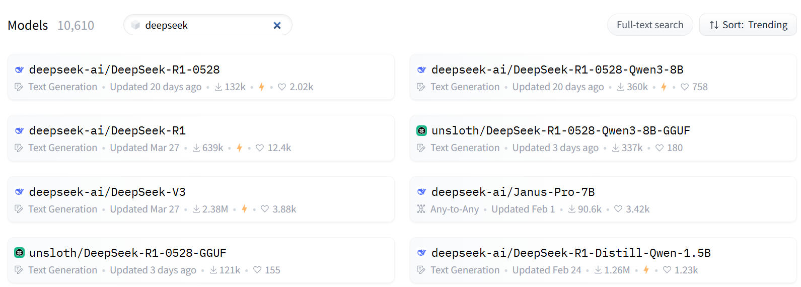

  

- 安装huggingface的下载工具(python库)：

   ```bash
   pip install huggingface_hub
   ```

- 下载模型文件

   ```bash
   set HF_ENDPOINT=https://hf-mirror.com  # 加速下载设置
   huggingface-cli download deepseek-ai/DeepSeek-R1-0528 --local-dir F:\models  # 下载模型文件
   ```


### 2.4 非流式推理

利用transformer框架进行部署推理：
Transformer库的使用手册：[Transformers文档](https://huggingface.co/docs/transformers/v4.50.0/zh/quicktour)

#### 2.4.1 参考代码

```python
from transformers import AutoTokenizer, AutoModelForCausalLM
import torch

# 一：加载模型
model_path = r"./modeldir"  # 模型路径
device = "cuda:0" if torch.cuda.is_available() else "cpu"
torch_dtype = torch.float16  # 指定模型参数类型为float16
model = AutoModelForCausalLM.from_pretrained(model_path, torch_dtype=torch_dtype).to(
    device
)  # 加载模型并移动到GPU
tokenizer = AutoTokenizer.from_pretrained(model_path)  # 加载分词器

# 二：设置生成参数和输入消息
gen_kwargs = {
    "max_length": 1024,  # 生成的最大长度
    "do_sample": True,  # 是否使用概率采样
    "top_k": 10,  # 采样时的前K个候选词，越大越随机
    "temperature": 0.7,  # 生成丰富性，越大越有创造力
    "top_p": 0.8,  # 采样时的前P个候选词，越大越随机
    "repetition_penalty": 1.2,  # 重复惩罚系数，越大越不容易重复
}
# 定义消息内容
messages = [
    {"role": "system", "content": "你是AI助手"},
    {"role": "user", "content": "明月几时有"},
]

# 三：将输入数据转换为模型可接受的格式
inputs = tokenizer.apply_chat_template(
    messages,
    add_generation_prompt=True,
    tokenize=True,
    return_tensors="pt",
    return_dict=True,
).to(
    device
)  # 将输入数据移动到GPU

# 四：生成输出
outputs = model.generate(**inputs, **gen_kwargs)  # 生成输出
outputs = outputs[:, inputs["input_ids"].shape[1] :]  # 截取生成的输出
result = tokenizer.decode(outputs[0], skip_special_tokens=True)  # 解码输出

# 五：打印结果
print(result)  # 打印结果
```

#### 2..4.2 参数详解

1. **device**
   - 概念：指定模型运行的计算设备（CPU 或 GPU）。在 PyTorch 中通常为 "cpu" 或 "cuda:0"。
   - 设置建议：优先使用 GPU（如 device="cuda:0"），显存不足时用 CPU。
2. **torch_dtype**
   - 概念：模型张量的数据类型，如 float32（高精度）、float16 或 bfloat16（低精度，节省显存）。
   - 影响：精度越高（如 float32），结果越精确，但显存占用更大。精度越低（如 float16），显存占用少，但可能损失精度或数值不稳定。
   - 设置建议：GPU 推荐 torch.float16 或 bfloat16（兼容性需确认）；CPU 通常用 float32。
3. **max_length**
   - 概念：生成文本的最大长度（token 数量）。
   - 影响：值越大，生成内容越长，但速度越慢，且可能重复或偏离主题。值过小可能导致回答不完整。
   - 设置建议：根据任务调整：对话建议 100-300，长文本生成可设 512-1024，注意模型最大限制（如 4096）。
4. **do_sample**
   - 概念：是否启用采样策略（如 top_k, top_p）。若为 False，则使用贪心解码（确定性强）。
   - 影响：True：输出多样化，适合创意任务。False：输出确定性强，适合事实性问题。
   - 设置建议：需要多样性时设为 True，需准确性时设为 False。
5. **top_k**
   - 概念：采样时保留概率最高的前 k 个 token。
   - 影响：值越大（如 100），候选 token 多，输出多样但可能不相关。值越小（如 10），输出更确定但可能重复。
   - 设置建议：通常设为 10-50。
6. **temperature**
   - 概念：控制采样随机性，调整概率分布平滑度。
   - 影响：值大（如 1.5）：输出随机性高，可能不连贯。值小（如 0.1）：输出更确定，但易重复。
   - 设置建议：平衡点常为 0.7-1.0；需创造性时调高（如 0.9），需保守时调低（如 0.3）。
7. **top_p（核采样）**
   - 概念：从累积概率超过阈值 p 的最小 token 集合中采样。
   - 影响：值大（如 0.95）：候选 token 多，输出多样。值小（如 0.5）：候选 token 少，输出更集中。
   - 设置建议：常用 0.7-0.95。
8. **repetition_penalty**
   - 概念：惩罚重复 token 的权重（>1.0 时抑制重复，<1.0 时鼓励重复）。
   - 影响：值大（如 2.0）：减少重复，但可能生成不自然内容。值小（如 1.0）：无惩罚，默认行为。
   - 设置建议：通常设为 1.0-1.2，明显重复时可设 1.2-1.5。

#### 2.4.3 代码封装
```python
from transformers import AutoTokenizer, AutoModelForCausalLM
import torch


class DeepSeek:
    def __init__(self, model_path, device, torch_dtype):
        self.device = device  # 设定推理设备
        self.model = AutoModelForCausalLM.from_pretrained(
            model_path, torch_dtype=torch_dtype
        ).to(
            device
        )  # 加载模型并移动到GPU
        self.tokenizer = AutoTokenizer.from_pretrained(model_path)  # 加载分词器

    def inference(self, messages, gen_kwargs):
        inputs = self.tokenizer.apply_chat_template(
            messages,
            add_generation_prompt=True,
            tokenize=True,
            return_tensors="pt",
            return_dict=True,
        ).to(
            self.device
        )  # 将输入数据移动到GPU
        outputs = self.model.generate(**inputs, **gen_kwargs)  # 生成输出
        outputs = outputs[:, inputs["input_ids"].shape[1] :]  # 截取生成的输出
        result = self.tokenizer.decode(outputs[0], skip_special_tokens=True)  # 解码输出
        return result


if __name__ == "__main__":
    # 一：设定模型路径和设备，加载模型
    model_path = r"./modeldir"  # 替换为你的模型路径
    device = "cuda:0" if torch.cuda.is_available() else "cpu"
    torch_dtype = torch.float16
    deepseek = DeepSeek(model_path, device, torch_dtype)

    # 二：设定推理参数，推理消息
    gen_kwargs = {
        "max_length": 1024,  # 生成的最大长度
        "do_sample": True,  # 是否使用概率采样
        "top_k": 10,  # 采样时的前K个候选词，越大越随机
        "temperature": 0.7,  # 生成丰富性，越大越有创造力
        "top_p": 0.8,  # 采样时的前P个候选词，越大越随机
        "repetition_penalty": 1.2,
    }  # 重复惩罚系数，越大越不容易重复
    messages = [
        {"role": "system", "content": "你是一名乐于助人的人工智能助手"},
        {"role": "user", "content": "写一个js判断用户验证码代码"},
    ]  # 定义消息内容
    result = deepseek.inference(messages, gen_kwargs)  # 调用推理方法
    print(result)  # 打印结果

```

### 2.5 流式推理
```python
from transformers import AutoTokenizer, AutoModelForCausalLM, TextIteratorStreamer
import torch
from threading import Thread

class DeepSeek:
    def __init__(self, model_path, device, torch_dtype):
        self.device = device  # 设定推理设备
        self.model = AutoModelForCausalLM.from_pretrained(
            model_path, torch_dtype=torch_dtype
        ).to(
            device
        )  # 加载模型并移动到GPU
        self.tokenizer = AutoTokenizer.from_pretrained(model_path)  # 加载分词器

    def inference(self, messages, gen_kwargs):
        inputs = self.tokenizer.apply_chat_template(
            messages,
            add_generation_prompt=True,
            tokenize=True,
            return_tensors="pt",
            return_dict=True,
        ).to(
            self.device
        )  # 将输入数据移动到GPU
        streamer = TextIteratorStreamer(
            self.tokenizer, skip_special_tokens=True
        )  # 创建流式输出对象
        generation_kwargs = dict(**inputs, **gen_kwargs, streamer=streamer)  # 生成参数
        thread = Thread(
            target=self.model.generate, kwargs=generation_kwargs
        )  # 创建线程
        thread.start()  # 启动线程进行生成
        generated_text = ""  # 初始化生成文本
        for new_text in streamer:  # 流式输出生成的文本
            generated_text += new_text  # 累加生成的文本
            yield new_text  # 逐步返回生成的文本


if __name__ == "__main__":
    # 一：设定模型路径和设备，加载模型
    model_path = r"./modeldir"  # 替换为你的模型路径
    device = "cuda"  # 指定推理设备为GPU
    torch_dtype = torch.float16
    deepseek = DeepSeek(model_path, device, torch_dtype)

    # 二：设定推理参数，推理消息
    gen_kwargs = {
        "max_length": 1024,  # 生成的最大长度
        "do_sample": True,  # 是否使用概率采样
        "top_k": 10,  # 采样时的前K个候选词，越大越随机
        "temperature": 0.7,  # 生成丰富性，越大越有创造力
        "top_p": 0.8,  # 采样时的前P个候选词，越大越随机
        "repetition_penalty": 1.2,
    }  # 重复惩罚系数，越大越不容易重复
    messages = [
        {"role": "system", "content": "你是一名乐于助人的人工智能助手"},
        {"role": "user", "content": "请简要介绍一下你自己"},
    ]  # 定义消息内容
    response = deepseek.inference(messages, gen_kwargs)  # 调用推理方法
    result = ""  # 初始化结果
    for chunk in response:  # 流式输出生成的文本
        result += chunk  # 累加生成的文本
        print(result)  # 打印结果

```


## 3. qwen-0.5B本地部署

Qwen是阿里巴巴公司研发的大模型，我们继续用transformer库进行推理，推理框架与deepseek一模一样。

- qwen的huggingface地址：[Hugging Face Qwen](https://huggingface.co/Qwen/Qwen2.5-0.5B)

  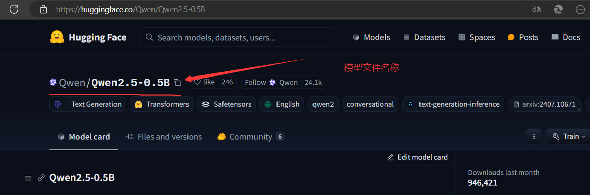

- 下载模型文件：
   ```bash
   set HF_ENDPOINT=https://hf-mirror.com  # 加速下载设置
   huggingface-cli download Qwen/Qwen2.5-0.5B --local-dir D:\code\code_py\medical_chat\qwen  # 下载模型文件
   ```

​	后续操作和DeepSeek一致~


# 三、APP开发实战

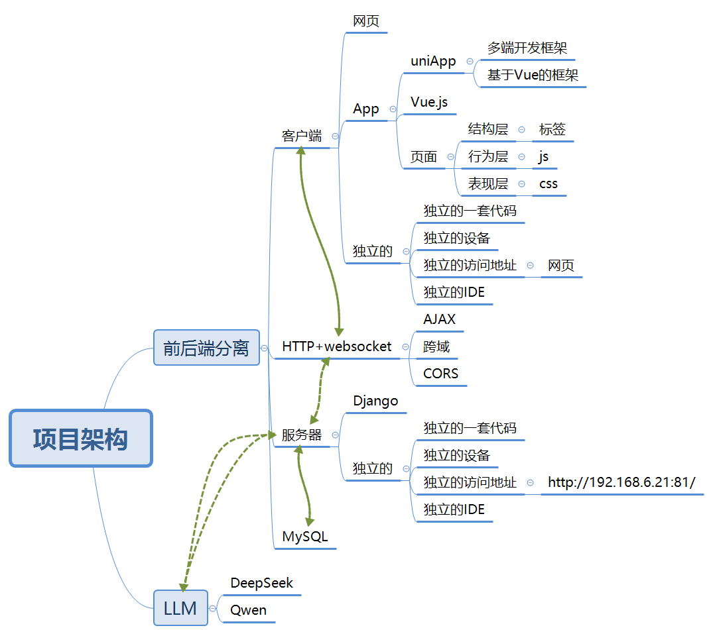

## 1. 客户端代码

验证比较好用的markdown排版插件：https://ext.dcloud.net.cn/plugin?id=9437


我们这里使用socket实时通信：https://zh.uniapp.dcloud.io/api/request/websocket.html#connectsocket

```vue
<template>
	<view class="container">
		<!-- 顶部导航 -->
		<view class="header">
			<text class="menu-icon">≡</text>
			<text class="title">新对话</text>
			<text class="plus-icon">💬+</text>
		</view>

		<!-- 主体内容 -->
		<view class="main-content">
			<image class="logo" src="/static/deepseek-logo.png" mode="aspectFit" />
			<text class="greeting">嗨！我是 <text class="deepseek-text">DeepSeek</text></text>
			<text class="desc">
				我可以帮你搜索、答疑、写作，<br />
				请把你的任务交给我吧~
			</text>
		</view>

		<view class="chat-box">
			<view class="msg" v-for="(msg, index) in messages" :key="index">
				<zero-markdown-view :markdown="msg"></zero-markdown-view>
			</view>
			<zero-markdown-view :markdown="currentLine"></zero-markdown-view>
			<!-- <view>{{currentLine}}</view> -->
		</view>

		<!-- 底部输入框 -->
		<view class="footerheight">

		</view>
		<view class="footer">
			<textarea class="input-box" v-model="inputMessage" placeholder="给 DeepSeek 发送消息" auto-height
				maxlength="200" />
			<button class="mini-btn mbtn" @click="sendMessage" type="warn" size="mini">发送</button>
		</view>
	</view>
</template>

<style>
	.container {
		display: flex;
		flex-direction: column;
	}

	.header {
		display: flex;
		justify-content: space-between;
		align-items: center;
		padding: 20rpx 30rpx;
		font-size: 34rpx;
		font-weight: bold;
		color: #000000;
	}

	.menu-icon,
	.plus-icon {
		font-size: 38rpx;
	}

	.title {
		font-size: 36rpx;
	}

	.main-content {
		flex: 1;
		display: flex;
		flex-direction: column;
		justify-content: center;
		align-items: center;
		text-align: center;
		padding-bottom: 120rpx;
		/* 预留底部空间避免内容被遮挡 */
	}

	.logo {
		width: 120rpx;
		height: 120rpx;
		margin-bottom: 40rpx;
	}

	.greeting {
		font-size: 32rpx;
		font-weight: bold;
		margin-bottom: 20rpx;
	}

	.deepseek-text {
		color: #2a5cff;
		font-weight: bold;
	}

	.desc {
		font-size: 28rpx;
		color: #666666;
		line-height: 1.8;
	}

	.footer {
		position: fixed;
		bottom: 0;
		left: 0;
		right: 0;
		background-color: #f5f5f5;
		padding: 20rpx;
		box-shadow: 0 -4rpx 10rpx rgba(0, 0, 0, 0.05);
	}

	.footerheight {
		min-height: 120rpx;
	}

	.input-box {
		width: 680rpx;
		min-height: 80rpx;
		font-size: 28rpx;
		color: #333;
		background-color: #ffffff;
		padding: 20rpx;
		border-radius: 20rpx;
	}

	.mbtn {
		margin-top: 10rpx;
	}
</style>

<script>
	import mpHtml from 'mp-html/dist/uni-app/components/mp-html/mp-html'
	export default {
		components: {
			mpHtml
		},
		data() {
			return {
				socket: null,
				inputMessage: '',
				messages: [],
				currentLine: '',
				isclose: false
			}
		},
		onLoad() {
			this.initWebSocket();
		},
		methods: {
			initWebSocket() {
				this.socketTask = uni.connectSocket({
					url: 'ws://10.71.21.8:8000/ws/chat/',
					success: () => {
						console.log("1. WebSocket 创建成功");
					}
				});

				this.socketTask.onOpen(() => {
					console.log("2. WebSocket 连接已打开");
				});

				this.socketTask.onMessage((res) => {
					const data = JSON.parse(res.data);
					if (data.type === 'start') {
						this.currentLine = data.content;
					} else if (data.type === 'stream') {
						this.currentLine += data.content;
					} else if (data.type === 'end') {
						this.messages.push(this.currentLine);
						console.log(this.messages)
						this.currentLine = '';
					}
					// 在页面方法中调用
					uni.pageScrollTo({
						scrollTop: 10000000, // 设置一个足够大的值
						duration: 300 // 动画时间
					});

				});

				this.socketTask.onClose(() => {
					console.log("3. WebSocket 已关闭");
					this.isclose = true
				});
			},

			sendMessage() {
				if (this.isclose) {
					this.initWebSocket();
					this.isclose = false
				}
				if (!this.inputMessage) return;

				this.messages.push('你：' + this.inputMessage);
				this.socketTask.send({
					data: JSON.stringify({
						message: this.inputMessage
					})
				});
				this.inputMessage = '';
			}
		}
	}
</script>
```


## 2. 服务器端代码

Django 本身不直接支持 WebSocket，因为它是为传统的 HTTP 请求-响应模型设计的。但你可以通过 **Django + ASGI + Channels** 来实现 WebSocket 通信。

### 2.1 基本组件介绍

| 组件     | 作用说明                                                |
| -------- | ------------------------------------------------------- |
| Django   | 提供基本的 MVC 框架和路由、ORM、视图等                  |
| ASGI     | 异步服务器网关接口，支持 WebSocket                      |
| Channels | Django 官方推荐的异步通信库，支持 WebSocket、后台任务等 |
| Daphne   | Channels 推荐使用的 ASGI 服务器                         |

### 2.2 依赖包安装

```bash
pip install channels
```


### 2.3 项目配置

通过修改配置，让我们的Django服务器支持socket通信。

- 修改 settings.py

  ```python
  # 指定 ASGI 应用  MyLLM：改成自己的应用
  ASGI_APPLICATION = "MyLLM.asgi.application"
  ```

- 修改 MyLLM\asgi.py

  ==MyLLM改成自己的工程名==
  
  ```python
  import os
  from channels.routing import ProtocolTypeRouter, URLRouter
  from channels.auth import AuthMiddlewareStack
  from django.core.asgi import get_asgi_application
  import myapp.routing  # 你自定义的 routing.py
  
  os.environ.setdefault("DJANGO_SETTINGS_MODULE", "MyLLM.settings")
  
  application = ProtocolTypeRouter(
      {
          "http": get_asgi_application(),
          "websocket": AuthMiddlewareStack(
              URLRouter(myapp.routing.websocket_urlpatterns)
          ),
      }
  )
  ```

### 2.4 路由定义

  当然了，这里要先==创建一个应用myapp~==

  ```python 
  # routing.py
  
  from django.urls import re_path
  from . import consumers
  
  websocket_urlpatterns = [
      re_path(r"ws/chat/$", consumers.ChatStreamConsumer.as_asgi()),
  ]
  ```

  ### 2.5 Consumer定义

用于处理websocket

  ```python
  # consumers.py
  import torch
  import os
  from .deepseek import DeepSeek
  
  CURRENT_DIR = os.path.dirname(os.path.abspath(__file__))
  # 路径根据实际情况调整以下
  model_path = os.path.join(CURRENT_DIR, "../../", "deepseekModel")
  # 一：加载模型
  device = "cuda:0" if torch.cuda.is_available() else "cpu"
  
  
  from channels.generic.websocket import AsyncWebsocketConsumer
  import json
  import asyncio
  
  
  class ChatStreamConsumer(AsyncWebsocketConsumer):
      async def connect(self):
          print("1. ebSocket连接开始")
          await self.accept()
          print("2. WebSocket连接已接收")
  
      async def disconnect(self, close_code):
          print("3. 连接断开")
  
      async def receive(self, text_data):
          print("4. 收到消息：", text_data)
          data = json.loads(text_data)
          user_message = data.get("message", "")
  
          # 模拟 AI 回复前的“AI思考中”提示
          await self.send(
              text_data=json.dumps({"type": "start", "content": "AI正在思考中...\n"})
          )
  
          # 一：设定模型路径和设备，加载模型
          torch_dtype = torch.float16
          deepseek = DeepSeek(model_path, device, torch_dtype)
  
          # 二：设定推理参数，推理消息
          gen_kwargs = {
              "max_length": 3072,  # 生成的最大长度
              "do_sample": True,  # 是否使用概率采样
              "top_k": 10,  # 采样时的前K个候选词，越大越随机
              "temperature": 0.7,  # 生成丰富性，越大越有创造力
              "top_p": 0.8,  # 采样时的前P个候选词，越大越随机
              "repetition_penalty": 1.2,
          }  # 重复惩罚系数，越大越不容易重复
          messages = [
              {"role": "system", "content": "你是一名乐于助人的人工智能助手"},
              {"role": "user", "content": user_message},
          ]  # 定义消息内容
          response = deepseek.inference(messages, gen_kwargs)  # 调用推理方法
          for chunk in response:  # 流式输出生成的文本
              await self.send(text_data=json.dumps({"type": "stream", "content": chunk}))
  
          await self.send(text_data=json.dumps({"type": "end"}))  # 表示结束
  ```

  这里用到DeepSeek类：

  ```python
  from transformers import AutoTokenizer, AutoModelForCausalLM, TextIteratorStreamer
  from threading import Thread
  class DeepSeek:
      def __init__(self, model_path, device, torch_dtype):
          self.device = device  # 设定推理设备
          self.model = AutoModelForCausalLM.from_pretrained(
              model_path, torch_dtype=torch_dtype
          ).to(
              device
          )  # 加载模型并移动到GPU
          self.tokenizer = AutoTokenizer.from_pretrained(model_path)  # 加载分词器
  
      def inference(self, messages, gen_kwargs):
          inputs = self.tokenizer.apply_chat_template(
              messages,
              add_generation_prompt=True,
              tokenize=True,
              return_tensors="pt",
              return_dict=True,
          ).to(
              self.device
          )  # 将输入数据移动到GPU
          streamer = TextIteratorStreamer(
              self.tokenizer, skip_special_tokens=False
          )  # 创建流式输出对象
          generation_kwargs = dict(**inputs, **gen_kwargs, streamer=streamer)  # 生成参数
          thread = Thread(
              target=self.model.generate, kwargs=generation_kwargs
          )  # 创建线程
          thread.start()  # 启动线程进行生成
          for new_text in streamer:  # 流式输出生成的文本
              yield new_text  # 逐步返回生成的文本
  
  ```

  

### 2.6 服务器启动

该装的包还是要装：

```bash
pip install websockets
pip install uvicorn
```

启动：这样才支持websocket

```bash
uvicorn --port 8000 --host 192.168.2.21 aiserver.asgi:application --reload
uvicorn --port 8000 --host 192.168.43.237 aiserver.asgi:application --reload
uvicorn --port 8000 --host 127.0.0.1 MyLLM.asgi:application --reload
```


## 3. 跨域处理

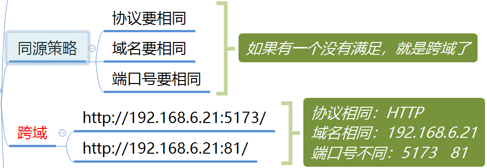

在 Django 中处理跨域问题，通常会使用 **CORS**（跨域资源共享）来解决。你可以使用 `django-cors-headers` 库来处理这个问题。以下是如何在 Django 项目中配置 CORS 的步骤：

1. **安装 `django-cors-headers` 库：**

   首先，你需要安装 `django-cors-headers` 库，可以通过 `pip` 安装：

   ```bash
   pip install django-cors-headers
   ```

2. **在 `settings.py` 中进行配置：**

   之后，需要在 Django 的 `settings.py` 中进行相关配置：

   - 将 `'corsheaders'` 添加到 `INSTALLED_APPS` 中：

     ```python
     INSTALLED_APPS = [
         # 其他 app
         'corsheaders',
     ]
     ```

   - 将 `'corsheaders.middleware.CorsMiddleware'` 添加到 `MIDDLEWARE` 中：

     ```python
     MIDDLEWARE = [
         # 其他 middleware
         'corsheaders.middleware.CorsMiddleware',
     ]
     ```

   - 设置允许跨域的源（可以允许所有域，也可以指定特定域）：

     允许所有域的跨域访问：

     ```python
     CORS_ALLOW_ALL_ORIGINS = True
     ```

     或者，指定允许跨域的域名：

     ```python
     CORS_ALLOWED_ORIGINS = [
         "http://example.com",
         "http://localhost:3000",  # 本地开发时可能需要
     ]
     ```

3. **其他配置（可选）：**

   你还可以根据需要添加更多配置，例如：

   - 允许跨域时携带认证信息（如 Cookie）：

     ```python
     CORS_ALLOW_CREDENTIALS = True
     ```

   - 允许特定的 HTTP 方法：

     ```python
     CORS_ALLOWED_METHODS = [
         'GET',
         'POST',
         'PUT',
         'DELETE',
         'PATCH',
     ]
     ```

   - 允许特定的请求头：

     ```python
     CORS_ALLOW_HEADERS = [
         'content-type',
         'authorization',
         'x-requested-with',
     ]
     ```

4. **重启服务器：**

   完成上述配置后，重启 Django 服务器，使其生效。


## 4. 手机如何访问

手机连接电脑的热点：形成一个局域网，电脑端的防火墙最好关掉


==注意：一定不要用127.0.0.1、localhost==
