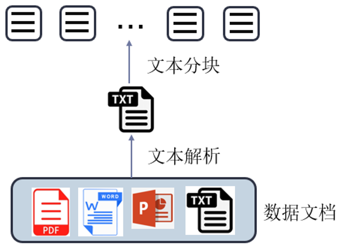

# 一、挑战及需求

大模型是很牛的，但是我们依然面临一些调整和具体的业务场景需求。

## 1. 面临的调整

- **制造虚假事实**：LLMs经常制造虚假事实，特别是在处理特定领域或高度专业化的查询时，一本正经的胡说八道。
- **知识时效性**：当所寻求的信息超出模型训练数据范围或需要最新数据时，LLMs可能无法提供准确答案。
- **不具备可解释性**：在实际生产环境中部署生成型人工智能时，单纯使用“黑盒”LLMs可能不够。


## 2. 企业的需求

- 企业业务依赖内部私有数据的支撑，确保信息来源权威且具针对性。

- 企业知识体系不断演进，需要支持动态更新与灵活扩展，以适应业务发展的变化。

- 企业面向客户的信息需具备高准确性，同时实现内容的可追溯与可解释，提升用户信任与体验。

  

# 二、RAG与思考

以上问题的解决需要用到RAG技术。

## 1. RAG认知

RAG， **Retrieval-Augmented Generation** ：

- **R：** Retrieval，检索
- **A：** Augmented，增强
- **G：** Generation，生成

RAG通过结合传统的**生成式语言模型**和**动态检索机制**，实时从外部知识库中检索信息，增强模型的生成输出：


**RAG思路：**

- **提升信息准确性与丰富性**
   通过实时检索最新相关文档，结合查询上下文生成更准确、具体的回答，适用于复杂问题或需详细解释的场景。
- **扩展知识覆盖范围**
   可动态引入训练数据之外的知识，涵盖最新事件、专业术语和冷门事实，解决传统LLM知识盲区。
- **增强适应性与灵活性**
   利用外部知识库替代频繁训练，降低更新成本，快速适应变化；支持跨行业应用，无需专门训练。
- **提升可追溯性与可信度**
   生成内容可关联原始文档，增强结果的可验证性，有助于减少偏见、提升透明度。


## 2. 需求思考

目前很多大模型支持超长上下文：百万级别token的输入

|  |  |
| :---------------------------------------------------------: | :---------------------------------------------------------: |
|      谷歌的Gemini1.5 100万输入，kimichat 支持200万输入      |                  200万Token相当于4本红楼梦                  |

既如此，我直接把整个知识库扔给大模型，那岂不是很爽？呵呵

- 自己部署：推理成本高，效率低；

- 用开源平台：企业私有数据泄露风险高；

- LLM在Long Context上的处理能力有待完善：

  |  |
  | :----------------------------------------------------------: |
  | 大海捞针实验：在一个Long Context的随机位置插入多个“针”(needles,即知识点)，看LLM能否精准检索出这些“针” |
  |  |
  |     比如把【制作完美披萨的秘密】随机插入到红楼梦内容里面     |
  |  |

  - 随着"针”的数量增加，LLM的检索与推理的正确率会下降；
  - 1K的上下文中，GPT4可以轻而易举的找到10个"针；
  - 上下文扩大10倍甚至100倍后，很显然发生了大量的丢失（红色区域）；
  - 和针的位置有关：越在上下文末尾出现的“针”，越容易被检索到；


# 三、RAG简介


## 1. RAG定义

- RAG是一种使用来自私有或专有数据源的信息来辅助文本生成的技术，它是一种结合了**检索**和**生成**两个主要组件的语言模型架构，旨在通过检索相关信息来增强模型的生成能力。

- RAG对于诸如回答问题和内容生成等任务，具有极大价值，因为它能支持生成式 AI 系统使用外部信息源生成更准确且更符合语境的回答。它会实施搜索检索方法（通常是语义搜索或混合搜索）来回应用户的意图并提供更相关的结果。


## 2. RAG原理

### 2.1 概述

RAG模型的工作可以分为两个主要步骤：

- **检索**：
  - 从知识库、数据库、外部来源等检索出与输入查询相关的文档或信息片段（chunk）。
  - 检索到的信息转化为Embedding并存储在向量数据库中。
  - 向量模型会基于与输入查询的相关性，对检索到的信息进行排序。
  - 分数最高的文档或段落会被选中，以进行进一步的处理。

- **生成**：
  - 接下来，LLM使用检索到的信息来生成文本回复。
  - 生成的文本可以再额外处理一下，以确保其语法正确，语义连贯。
  - 回复更加准确，更符合语境，因为这些回复使用了检索模型提供的补充信息。


### 2.2 工作流程

三大块：知识库、检索、LLM

|  |
| :----------------------------------------------------------: |

- **输入查询处理**：接收用户的输入查询。
- **执行检索**：利用检索器在知识库中找到相关文档。
- **信息融合**：将检索到的文档与原始查询融合作为生成模型的输入。
- **内容生成**：生成模型根据融合后的信息产生回答或文本。
- **输出结果**：向用户展示生成的内容。


## 3. RAG vs LoRA

二者是可以同时存在的！

### 3.1 关键差异

- RAG：依赖外部知识库进行动态检索，以实时更新和扩展模型的知识。
- 微调：在特定数据集上调整预训练模型的参数，以提高在特定任务上的表现，不涉及实时检索外部信息。

### 3.2 适用场景

- RAG：适用于需要访问和引入大量外部最新信息的场景，如开放域问答、实时内容生成等。
- 微调：适合于有大量标注数据且领域相对固定的任务，如情感分析、特定领域的文本分类等。

### 3.3 互补性

RAG和微调不是相互排斥的，而是相互补充，从不同层面增强模型的能力，结合这两种技术可以实现最佳的模型性能。


## 4. RAG优势

- 准确性：

  RAG通过与外部关联内容来提高准确性，减少LM幻觉问题，使生成更准确、可靠。

- 时效性：

  RAG通过关联最新信息，保持响应的时效性。

- 透明度：

  RAG通过引用来源提高答案的透明度，增加用户对模型的信任。

- 定制化能力：

  RAG可以通过索引相关语料库，为特定领域提供知识支持。

- 可扩展性：

  RAG能够处理大规模数据集而无需更新参数。

  


## 5. RAG挑战

- 准确性依赖：
  - 数据复杂多样：结构化（MySQL）、非结构化、Excel、PDF、PPT、Word。
  - 数据的整理、清洗和准确性验证是一个大工程。
  - 处理好的数据如何构建知识库：怎么分块，如何高效索引。
  - RAG增强的关键是获得和问题相关的信息，高效保质的检索是关键。
- 多上下文相关信息的处理：
  - 如何排序相关信息。
  - 如何写合适的prompt激发大模型潜能。
  - 哪种大模型合适

- 计算成本与速度：
  - RAG需要在大型知识库或网络中检索，需要计算成本。
- 集成设计与优化：
  - 要实现检索与生成部分的无缝集成，需要精心设计和优化，这在训练和部署过程中带来挑战。
- 隐私与合规问题： 
  - 在处理敏感数据时，从外部来源检索信息可能会涉及隐私问题，需要做脱敏处理(159\****7678)。
  - 需遵守隐私和法规要求，限制可访问的信息来源。
- 局限性：
  - RAG擅长处理基于事实的内容生成，不擅长创作富有想象力或虚构性质的内容。


# 四、RAG框架


## 1.  基础版RAG

基础版的RAG过程可以分为三个主要阶段，旨在通过结合检索和生成过程来提高语言模型的输出质量和相关性。


### 1.1 基本步骤

下面是对步骤的详细解释！

#### 1.1.1 建立索引

- 数据准备：提前对数据进行清理和提取，将多种格式(PDF、HTML、Word、Markdown等)转换成统一格式，以便处理和索引。
- 文本处理：对提取的文本进行分块，以小段落为单位进行处理，以便精确检索到与查询最相关的信息。
- 索引创建：使用向量数据库（如Milvus、FAISS、ElasticSearch）构建文本块索引，以支持相似性搜索。

#### 1.1.2 输入增强

- 查询转换：通过修改输入查询，使用Query2doc和HyDE生成一个伪文档，使用这个文档作为检索的关键。
- 数据增强：指在检索前提前改善数据，如去除无关信息、消除歧义、更新过时文档，合成新数据等。

#### 1.1.3 检索文档

- 问题向量化：利用编码模型将用户查询转换为向量表示，与文档块索引中的嵌入进行相似度比较。
- 文档选择：根据计算得到的相似度，选择 $TOP-K$ 个文档块作为问题的**上下文增强信息**，以供生成阶段使用。

#### 1.1.4 文本生成


- 融合上下文：将选定的问题和其相关文档块合并成一个新的输入提示，为大型语言模型提供丰富的上下文信息。
- 回答生成：基于合并后的提示，LLM生成回答。
- 在多轮对话中通过整合历史对话信息，以提升回答的连贯性和相关性。

### 1.2 挑战

革命尚未成功，同志仍需努力~

#### 1.2.1 检索质量问题

- 精度和召回率：挑战包括低精度（不是检索到的文档块都与查询严格相关，可能导致信息的断层或误导）和低召回率（未能检索到所有相关文档块，限制了语言模型获取充足上下文的能力）。
- 幻觉与不相关性：模型可能生成基于错误或不完整上下文的幻觉内容，或生成的回答与查询问题不相关。
- 有害或偏见性内容：在不适当的上下文引导下，模型可能产生有害或带有偏见的回应。

#### 1.2.2 增强过程的挑战

- 整合检索段落：有效融合检索到的段落与生成任务当前的上下文，以提高生成内容的相关性和准确性。
- 冗余与重复：处理多个检索段落中的相似或重复信息，避免在生成的回答中出现重复内容。
- 重要性评估：评估并确定哪些检索到的文档块对回答生成任务最为关键和相关。
- 风格一致性：处理不同来源文档的写作风格或语气差异，确保生成的回答在风格和语气上保持一致性。


## 2. 高级版RAG

高级版RAG引入了进阶技术和策略，专注于提升检索生成过程的效率和输出质量。它通过细化索引、优化检索过程，并采用高级后处理技术，显著提高了整体性能。

### 2.1 预检索优化

#### 2.1.1 优化数据索引

- 细粒度索引：通过更细致地分割文档和使用更丰富的元数据标注，提升索引的精确度，使得检索更准确地定位到相关信息。
- 索引结构优化：改进索引结构，如采用分层或图结构索引，以加速查询响应时间和提高检索效率。
- 元数据添加：整合额外的文档元数据（如来源、作者、发布日期、文档类型等），支持更复杂的查询需求，改善检索结果的相关性。
- 对齐优化和混合检索：结合稀疏和密集向量索引，利用不同的检索策略，提高检索的灵活性和准确性。

#### 2.1.2 嵌入和索引

- 微调嵌入：通过在特定领域或数据集上微调语言模型，生成更加精准的文档和查询嵌入，从而提升检索的相关性。
- 动态嵌入：实现基于上下文的动态词嵌入，允许模型根据查询的具体上下文调整词语的向量表示，增强模型对语义的捕捉能力。


### 2.2 检索过程优化

#### 2.2.1 重新排序

智能排序：基于排序模型，如学习排序（Learning to Rank），对初步检索结果进行再排序，确保最相关的信息优先呈现给用户。


### 2.3 生成器增强

#### 2.3.1 提示工程

专注于提高语言模型输出质量的技术，如提示压缩、活跃提示、思维链提示等，适用于RAG系统中的LLM生成器，可以通过压缩查询来加快模型推理速度，减轻不相关信息对模型的负面影响，缓解“中途迷失”现象。

#### 2.3.2 解码调整

在生成器处理过程中添加额外控制，如调整超参数以实现更大的多样性，限制输出词汇等。

#### 2.3.3 微调生成器

通过微调生成器来增强模型的领域知识或与检索器更好的匹配度。


### 2.4 特点

- 性能优化：通过高级的索引方法和精细化的检索策略，高级RAG能够更快速、更准确地定位到查询相关信息，提高了检索效率和生成内容的质量。
- 适应性强：结合多种检索技术和策略，高级RAG能够根据不同的查询需求和信息类型，灵活调整检索策略，保证了结果的相关性和丰富性。
- 动态嵌入应用：通过对嵌入模型的微调和动态调整，高级RAG在处理上下文变化时表现出更高的适应性和准确性，特别是在面对多样化和复杂查询时。
- 高级后处理：采用先进的后处理技术，如提示压缩和智能重排序，进一步优化生成内容的准确性和一致性，显著提升用户体验。


# 五、RAG核心组件

|  |
| :----------------------------------------------------------: |
|                          多模态+RAG                          |

## 1. 知识库构建

构建高效、可靠的知识库是实现RAG系统的基础。

### 1.1 文档预处理

文档解析是知识库构建的首要步骤，旨在将各种格式的文档转换为机器可读的文本格式。

#### 1.1.1 简单文本处理

==安装必要的依赖包：==

```cms
pip install langchain-community
pip install langchain-unstructured
```

简单粗暴的读取：

```python
# 从langchain导入文本加载器
from langchain_community.document_loaders import TextLoader


if __name__ == "__main__":
    # 创建加载器对象
    loader = TextLoader("./data/华清远见.txt", encoding="utf-8")
    # 加载数据
    data = loader.load()
    # 打印数据
    print(data)

```

执行结果如下：
```cms
[Document(metadata={'source': './data/华清远见.txt'}, page_content='华清远见2004年成立于北京中关村，12年来始终专 注于嵌入式及移动开发专业人才培养，“做良心教育，做专业教育，做受人尊敬的职业教育”是华清远见一直坚持的核心发展理念 。培训内容主要包括嵌入式系统开发，Android开发，物联网开发、HTML5开发、UI设计。从短期高端到长期就业课程培训，再到 产品研发，凭借专业的课程内容、强大的师资团队以及先进的研发技术受到客户和学员的好评。迄今已有超过10万名学员从华清 远见走出。\n华清远见研发实力强大。拥有10余种实训套件与智能产品，100余套自主研发实验设备。同时与众多高校进行实验室共建合作，目前已有超过1100所高校1100多个实验室选择了我们。华清远见拥有众多高端培训课程，每类课程均有独特的教学模 式。不同于其他机构，华清远见的培训课程不仅限于理论知识，还有丰富多样的实战项目贯穿其中。从研发到培训，全面提升学 员技术水平。\n华清远见拥有一支非常强大的师资团队。近200余名讲师投身于研发当中。每位讲师均是从事IT行业多年的资深人士，并有着丰富的项目开发经验。在学员培训过程中实时答疑解惑。')]
```

各种文件在langchain中找到对应的Loader：

```python
# 读取csv文件
loader = CSVLoader(
    "./data/实训答辩成绩表.csv", encoding="utf-8", csv_args={"delimiter": "\t"}
)
# 加载数据
data = loader.load()

# 读取图片内容
loader = UnstructuredImageLoader("./data/黑神话.png", languages=["zh"])
# 加载数据
data = loader.load()
```


#### 1.1.2 目录读取

==安装必要的依赖包==：你不装就是一堆错误，提示你安装

==如果提示numpy版本问题，也最好处理一下==

```cmd
pip install unstructured
pip install "unstructured[pptx]"
pip install "unstructured[image]"
pip install "unstructured[md]"
pip install "unstructured[pdf]"
pip install tesseract-ocr
conda install -c conda-forge libmagic
```

注意：需要安装 **Tesseract-OCR**（开源文字识别引擎）

https://digi.bib.uni-mannheim.de/tesseract/

中文需要安装中文包，并配置系统加载路径：chi_sim.traineddata

```cmd
语言包下载： https://github.com/tesseract-ocr/tessdata/blob/main/
存放路径： C:\Program Files\Tesseract-OCR\tessdata

chi_sim.traineddata ：用于简体中文字符识别
chi_tra.traineddata ：用于繁体中文字符识别

设置系统变量：set TESSDATA_PREFIX=c:\Program Files\Tesseract-OCR\tessdata

读取目录时默认语言支持：
languages = check_language_args(languages or ['zh'], ocr_languages)
```


#### 1.1.3 不同解析

使用`TextLoader`能够保留md的原始格式

```python
from langchain_community.document_loaders import TextLoader

if __name__ == "__main__":
    loader = TextLoader("./data/LLM多轮对话.md", encoding="utf-8")
    documents = loader.load()
    print(documents)

```


#### 1.1.4 结构化文档

需要依赖包：

```cmd
pip install jq
```

参考代码：

```python
from langchain_community.document_loaders import JSONLoader

if __name__ == "__main__":
    loader = JSONLoader(
        "./data/Chinese.json",
        jq_schema='.[] | "instruction:" +  .instruction  + " \\n " +  "input:" +  .input + " \\n " +  "output:" +  .output',
    )
    documents = loader.load()
    print(documents)

```


#### 1.1.5 网页文档解析

基本的网页获取：

```python
# 网页文档解析
from langchain.document_loaders import WebBaseLoader, UnstructuredURLLoader
from bs4 import SoupStrainer

if __name__ == "__main__":
    loader = WebBaseLoader(
        "https://hqyj.com/",
        # 只解析主题部分
        # bs_kwargs={"parse_only": SoupStrainer("body")},
        # bs_kwargs={"parse_only": SoupStrainer("title")},
        bs_kwargs={"parse_only": SoupStrainer(("title", "body"))},
    )
    documents = loader.load()
    print(documents)

    # 批量解析
    loader = UnstructuredURLLoader(urls=["https://hqyj.com/"])

```

也可以指定具体的标签：

```python
SoupStrainer("div", {"class": "main-content"})
```


#### 1.1.6 markdown

markdown的结构化信息是很重要的，大模型是可以识别出来的。

```python
# markdown文件解析
from langchain.document_loaders import UnstructuredMarkdownLoader

if __name__ == "__main__":
    loader = UnstructuredMarkdownLoader(
        "./data/阶段课程目标.md",
        mode="elements",  # 结构化信息需要保留下来
    )
    data = loader.load()
    print(data)

```


#### 1.1.7 图片内容读取

**读取文字内容：**

```python
# 读取图片内容
from langchain_community.document_loaders import UnstructuredImageLoader


if __name__ == "__main__":
    loader = UnstructuredImageLoader("./data/黑神话.png", mode="elements")
    data = loader.load()
    print(data)
```

**解析图片**：这就需要大预言模型来完成了

```python
import base64
with open(image_path, "rb") as image_file:
        base64_image = base64.b64encode(image_file.read()).decode('utf-8')

response = client.chat.completions.create(
    model="deepseek",
    messages=[
        {
            "role": "user",
            "content": [
                {
                    "type": "JSON",
                    "text": "请详细描述这张图片的内容，包括场景、人物、物品、场景、内容等，以JSON格式返回。",
                },
                {
                    "type": "image_url",
                    "image_url": {"url": f"data:image/jpeg;base64,{base64_image}"},
                },
            ],
        }
    ],
    max_tokens=300,
)
print(response.choices[0].message.content)
```


#### 1.1.8 PDF读取

- PyPDF2：用于处理PDF文件，支持提取文本、分割和合并PDF页面。适用于简单的PDF文本提取任务。

- PDF2Text：一种更专注于将PDF文档转换为纯文本的工具，强调转换质量和速度，适合大规模的PDF文本提取需求。

- GROBID：利用机器学习方法处理PDF和其他类型文档的高级解析工具。能够识别文档的结构和元数据，适用于需要高精度文档结构化信息的场景。

- OCR：
  - 文字：Paddle-OCR，Rapid-OCR

  - 表格：Camelot，Paddle-OCR，阿里追光，Table Transformer

  - 公式：Nougat，marker

选择哪个工具取决于具体的需求：对于需要高精度结构化输出的应用，GROBID是更好的选择；而对于大量PDF文本提取，PDF2Text可能更为高效。

```D
PyPDF2 : https://github.com/py-pdf/pypdf.git
GROBID : https://github.com/kermitt2/grobid.git
Paddle-OCR : https://github.com/PaddlePaddle/PaddleOCR.git
Rapid-OCR : https://github.com/RapidAI/RapidOCR.git
```

更多文件读取查查资料去完成即可！


### 1.2 向量数据库


#### 1.2.1 基本认知

向量数据库用于存储文档的向量表示，支持高效的相似度搜索。

- 提供特定的存储结构和索引算法；
- 能够高效地存储、查询和处理向量数据

#### 1.2.2 对比理解

| 功能项     | 关系型数据库 | 向量数据库              |
| ---------- | ------------ | ----------------------- |
| 持久化     | 支持本地存储 | 支持本地存储            |
| 增删改查   | 需要         | 需要（侧重在查）        |
| 相似度计算 | 无需         | 需要                    |
| 数据存储   | 表/字段      | 集合/文档 + 向量        |
| 索引       | 需要         | 需要（向量索引，IVF等） |
| 数据类型   | 多样         | 字符和数值              |

#### 1.2.3 常见向量数据库


```v
FAISS: https://github.com/facebookresearch/faiss.git
Milvus: https://github.com/milvus-io/milvus.git
ElasticSearch: https://github.com/elastic/elasticsearch.git
chroma：https://docs.trychroma.com/docs/overview/getting-started#2-create-a-chroma-client
```

- FAISS：由Meta开发，专为高效相似度搜索和密集向量聚类设计。特别适用于处理极大规模的数据集。
- Milvus：一个开源的向量数据库，支持海量向量的存储和检索，提供了灵活的索引构建和搜索能力。适用于企业级应用。
- ElasticSearch：一个开源的搜索引擎，支持全文搜索及稠密向量的搜索。适合于文本搜索与简单向量搜索的场景。
  选择向量数据库时，应考虑数据规模、检索速度和易用性。

#### 1.2.4 企业级向量数据库

- 可扩展性：当数据量增加时，是否能通过增加节点来扩展系统的容量和计算能力
- 吞吐量：当请求量和数据量增加时，系统能否在短时间内处理更多的请求(QPS)
- 稳定性：当系统故障时，数据是否丢失，是否能备份和恢复，是否有监控和日志

#### 1.2.5 相似度度量

- 欧氏距离：越小越相似
  $$
  d = \sum (A_i - B_i)^2
  $$

- 余弦相似度：越大越相似
  $$
  \cos(\theta) = \frac{\vec{A} \cdot \vec{B}}{||\vec{A}|| \, ||\vec{B}||} = \frac{\sum_{i=1}^n A_i B_i}{\sqrt{\sum_{i=1}^n A_i^2} \sqrt{\sum_{i=1}^n B_i^2}}
  $$
  

### 1.3  文本分割



如果不进行文本分割，无法直接将文档输入给模型，因为模型的输入长度是有限的。所以需要现将文档进行段落的划分。类似于书本的章节划分。

#### 1.3.1 基础分割

每段话遇到特定字符，并且（或）满足一定长度就进行裁断。

基于Langchain的分割 ：https://python.langchain.com/api_reference/text_splitters/index.html

```python
from langchain.text_splitter import RecursiveCharacterTextSplitter
import os

CURRENT_DIR = os.path.dirname(os.path.abspath(__file__))
document_path = os.path.join(CURRENT_DIR, "糖尿病.txt")
output_path = os.path.join(CURRENT_DIR, "糖尿病.seg.txt")


# 按照数目进行文本分割
def text_split_number(text, chunk=300, chunk_overlap=50):
    text_splitter = RecursiveCharacterTextSplitter(
        chunk_size=chunk,  # 分割长度
        chunk_overlap=chunk_overlap,  # 重叠长度
        length_function=len,  # 计算长度的函数
        is_separator_regex=False,  # 是否使用正则表达式
    )
    chunks = text_splitter.split_text(text)  # 分割文本
    return chunks  # 返回分割好的列表


# 按照中文标点进行文本分割
def text_split_punc(text, chunk=300, chunk_overlap=50):
    text_splitter = RecursiveCharacterTextSplitter(
        separators=[
            "。", "，", "？", "、", "：", "；", "！", "“", "”", "（",
            "）", "《", "》", "……", "——", "‘", "’", "·", "【", "】",
        ],  # 分割符号
        chunk_size=chunk,  # 分割长度
        chunk_overlap=chunk_overlap,  # 重叠长度
        length_function=len,  # 计算长度的函数
        is_separator_regex=False,  # 是否使用正则表达式
    )
    chunks = text_splitter.split_text(text)  # 分割文本
    return chunks  # 返回分割好的列表


if __name__ == "__main__":
    with open(document_path, "r", encoding="utf-8") as f:  # 打开文件
        data = f.read().replace("\n", "")  # 读取文件内容并去除换行符
        # chunks = text_split_number(data)  # 调用分割函数
        chunks = text_split_punc(data)

    with open(output_path, "w", encoding="utf-8") as f:  # 打开文件
        for chunk in chunks:  # 遍历分割好的文本
            print(len(chunk))
            print("---" * 20)
            f.write(chunk + "\n")  # 写入文件
```

#### 1.3.2 语义分割

每段话按照文本内在的语言信息进行分割，不相似的话就分割为不同的段落，需要借助其他模型来实现

魔塔开源： https://modelscope.cn/models/iic/nlp_bert_document-segmentation_chinese-base/files

安装依赖包：

```bash
pip install modelscope   
pip install addict
pip install datasets==2.16.0
pip install simplejson
pip install sortedcontainers
```

参考代码：

```python
from modelscope.outputs import OutputKeys
from modelscope.pipelines import pipeline
from modelscope.utils.constant import Tasks
import torch
import os

CURRENT_DIR = os.path.dirname(os.path.abspath(__file__))
document_path = os.path.join(CURRENT_DIR, "你构建的数据集.txt")
output_path = os.path.join(CURRENT_DIR, "保存位置.seg1.txt")
model_path = os.path.join(CURRENT_DIR, "segmodel")
device = "cuda:0" if torch.cuda.is_available() else "cpu"


# 按照语义进行分割
def text_seg_seq(text, model_path, device="cuda"):
    p = pipeline(
        task=Tasks.document_segmentation, model=model_path, device=device
    )  # 功能的调用
    chunks = p(documents=text)[OutputKeys.TEXT].split("\n")  # 调用模型进行分割
    return chunks


if __name__ == "__main__":
    with open(document_path, "r", encoding="utf-8") as f:  # 打开文件
        data = f.read().replace("\n", "")  # 读取文件内容并去除换行符
        chunks = text_seg_seq(data, model_path=model_path, device=device)

    with open(output_path, "w", encoding="utf-8") as f:  # 打开文件
        for chunk in chunks:  # 遍历分割好的文本
            print(len(chunk))
            f.write(chunk + "\n")  # 写入文件
```


### 1.4 Embedding模型选择

文本语义模型热度排行榜：https://huggingface.co/spaces/mteb/leaderboard_legacy

那应该如何选择模型呢？

#### 1.4.1 关注维度

需要从以下维度去先择适合自己的词向量模型~

- **任务**

  - MTEB 提供 classification、clustering、retrieval、summarization 等不同任务的评测。

  - RAG重点关注 retrieval（检索）任务。

- **语言支持**：中文、英文、多语言。

- **评测分数**：模型会提供排名和分数，用于对比性能。

- **模型大小和内存使用**：取决于设备资源和执行性能

- **Embedding 维度**：
  - 表示输出 embedding 向量的长度。
  - 维度高：可捕捉更复杂语义。
  - 维度低：执行效率更好，更易于存储。
  - 长度一般不需要太长，权衡语义能力与性能。

- **最大 tokens 数**：指 embedding 模型支持输入的最大 token 数，超过会截断。


### 1.5 索引写入策略

有效的索引写入策略可以提高检索的准确性和效率。

- 文本预处理：包括去除停用词、词干提取、小写化等，以减少噪声并提高向量表示的质量。
- 文本块大小调整：根据实际需求调整文本块的大小，较小的块有助于提高检索的精确度，而较大的块可能更适合概览式的搜索。
- 文本块重叠处理：通过让文本块之间有一定的重叠，可以避免重要信息被切分至不同块中而影响检索效果。


### 1.6 向量数据库实战

Chroma官网：https://docs.trychroma.com/docs/overview/getting-started

#### 1.6.1 安装和部署

粗暴安装：

```cmd
pip install chromadb
```

简单部署：服务端部署， https://docs.trychroma.com/docs/run-chroma/client-server

```cmd
chroma run --path ./db_path
chroma run --path ./chromadb --host 192.168.2.21 --port 8081
chroma run --path ./chromadb --host 192.168.43.237 --port 8081

```

更多参数说明：

```css
--path   TEXT  The path to the file or directory. [default: ./chroma_data]
--host   TEXT   The host to listen to. Default: localhost [default: localhost]
--log-path   TEXT   The path to the log file. [default: chroma.logl
--port   INTEGER   The port to run the server on.  [default: 8000]
--help   Show this message and exit.
```

#### 1.6.2 客户端使用

```python
import chromadb
chroma_client = chromadb.HttpClient(host='localhost', port=8000)
```

#### 1.6.3 创建数据集对象

```python
# 把huggingface镜像到国内
import os

os.environ["HF_ENDPOINT"] = "https://hf-mirror.com"

import chromadb

chroma_client = chromadb.HttpClient(host="localhost", port=8000)


# 构建Embedding模型
from chromadb.utils import embedding_functions

model_name = "thenlper/gte-large-zh"

em_fn = embedding_functions.SentenceTransformerEmbeddingFunction(
    model_name=model_name,
    cache_folder="./models/sentence_transformer",
)

# 创建向量集合
collection = chroma_client.create_collection(
    name="my_collection",
    metadata={"hnsw:space": "cosine"},  # 索引方式 及 相似度方法
    embedding_function=em_fn,
)

```

#### 1.6.4 添加文档块

```python
# 添加向量到数据库
documents = [
    "在向量搜索领域，我们拥有多种索引方法和向量处理技术， 它们使我们能够在召回率、响应时间和内存使用之间做出权衡。",
    "虽然单独使用特定技术如倒排文件（IVF）、乘积量化（PQ） 或分层导航小世界（HNSW）通常能够带来满意的结果",
    "GraphRAG本质上就是RAG，只不过与一般RAG相比，其检索路径上多了一个知识图谱",
]
collection.add(
    ids=["1", "2", "3"],
    documents=documents,
    metadatas=[
        {"chapter": 3, "verse": 16},
        {"chapter": 4, "verse": 5},
        {"chapter": 12, "verse": 5},
    ],
)
print(collection.count())  # 记录数
print(collection.peek())  # 预览
```

#### 1.6.5 文档检索

id检索：

```python
# 创建检索对象
get_collection = chroma_client.get_collection(
    name="my_collection_1",
    embedding_function=em_fn,
)

# 根据id检索
result = get_collection.get(
    ids=["1"],
    include=["metadatas", "documents", "embeddings"],
)
print(result)

```

相似向量检索：

```python
# 指定语句检索相似语句
result = get_collection.query(
    query_texts=["向量处理技术"],
    n_results=2,
    include=["metadatas", "documents", "embeddings", "distances"],
)
print(result)
```

#### 1.6.6 混合检索

```python
result = get_collection.query(
    query_texts=["量处理技术"],
    n_results=2,
    include=["metadatas", "documents", "embeddings", "distances"],
    where={"verse": 5},
)
print(result)
# 打印相似度分数
print(result["distances"])
```


**常见比较操作符**

| 操作符 | 描述                   | 适用数据类型         |
| ------ | ---------------------- | -------------------- |
| `$eq`  | 等于（匹配指定值）     | 字符串、整数、浮点数 |
| `$ne`  | 不等于（不匹配指定值） | 字符串、整数、浮点数 |
| `$gt`  | 大于                   | 整数、浮点数         |
| `$gte` | 大于或等于             | 整数、浮点数         |
| `$lt`  | 小于                   | 整数、浮点数         |
| `$lte` | 小于或等于             | 整数、浮点数         |

参考：

```python
result = get_collection.query(
    query_texts=["量处理技术"],
    n_results=2,
    include=["metadatas", "documents", "embeddings", "distances"],
    where={"chapter": {"$lt": 10}},
)
print(result)
# 打印相似度分数
print(result["distances"])
```

#### 1.6.7 多条件混检

```python
result = get_collection.query(
    query_texts=["量处理技术"],
    n_results=2,
    include=["metadatas", "documents", "embeddings", "distances"],
    where={
        "$and": [
            {"chapter": {"$lt": 10}},
            {"verse": {"$eq": 5}},
        ]
    },
)
print(result)
# 打印相似度分数
print(result["distances"])
```

#### 1.6.8 文档匹配检索

```python
result = get_collection.query(
    query_texts=["量处理技术"],
    n_results=2,
    include=["metadatas", "documents", "embeddings", "distances"],
    where_document={"$contains": "RAG"},
)
print(result)
# 打印相似度分数
print(result["distances"])
```


## 2. 检索器

在RAG框架中，"R"代表检索。检索器的核⼼作⽤是快速⽽准确地从庞⼤的知识库中找到与⽤户查询最相关的信 息。

检索时，**默认相信余弦相似度**，按分数取Top-K，但想让检索效果更好，还得靠**后处理、重排、过滤、甚至检索增强**来进一步提升！

### 2.1 稀疏检索→SR

SR： Sparse Retriever

稀疏检索器主要基于文档和查询的词项匹配，是一种传统且强大的信息检索技术。

- **BM25**：
  - 是稀疏检索的标准算法；
  - 通过考虑词频(TF)和逆文档频率(IDF)来评估查询和文档之间的相关性；
  - 简单有效，常被用作稀疏检索的基线模型。

- **rank-bm25**：这是BM25的一个基础实现，没有包含复杂的预处理步骤，因其易于使用，在Python社区中被广泛集成，如LangChain和Llama-index等库。
- **Pyserini BM25**：Pyserini提供了一种更高级的BM25实现，包含了词干提取和去除特定语言停用词等预处理步骤，旨在提高检索的精确度和效率。


#### 2.1.1 BM25算法

BM25是一种广泛使用的排名函数，用于信息检索中评估文档相对于给定搜索查询的相关性。BM25考虑了词频TF和逆文档频率IDF，以及文档长度对搜索查询中每个词的重要性的影响。

**BM25算法原理**

- TF：词项在文档中出现的频率。BM25对传统的TF值进行了调整，防止长文档过度放大词项的影响。

- IDF：词项的普遍重要性的度量。IDF值越高，表示词项在较少的文档中出现，因此具有更高的区分能力。

- 文档长度归一化：通过考虑文档长度与平均文档长度的比例来调整评分，以公平对待长文档和短文档。

- BM25评分公式：
  $$
  \text{score}(D, Q) = \sum_{i=1}^{n} \left[ \text{IDF}(t_i) \times \frac{\text{TF}(t_i, D) \times (k_1 + 1)}{\text{TF}(t_i, D) + k_1 \times \left(1 - b + b \times \frac{|D|}{\text{avg\_dl}} \right)} \right]
  \\  \\
  \text{IDF}(t_i) = \log\left(\frac{N - n_i + 0.5}{n_i + 0.5} + 1\right)
  $$

  其中：

  - $ D$：文档

  - $ Q $ ：查询，包含词项 $ t_i $

  - $ \text{TF}(t_i, D) $ ：词项 $t_i$ 在文档 $D$ 中的频率

  - $ |D|$：文档 $D$ 的长度

  - $ \text{avg\_dl} $ ：文档集合中文档的平均长度

  - $ \text{IDF}(t_i) $ ：词项 $ t_i$ 的逆文档频率

    在BM25中，IDF做了个小改动，主要引入了平滑因子以增强稳定性和处理极端情况：
    $$
    \text{IDF}(t_i) = \log\left(\frac{N - n_i + 0.5}{n_i + 0.5} + 1\right)
    $$
    ==平滑因子0.5==：可视为一种贝叶斯先验，假设词项至少出现在半个文档中，从而避免极端情况。

    

  - $ k_1$ 和 $b$ ：自由参数，通常$ k_1 ∈ [1.2, 2.0]$ 、 $b = 0.75$

#### 2.1.2  特点

- **优势**
  - 高效性：因其简单的匹配机制和优化过的索引结构而具有高效的检索速度，尤其适用于大规模文档集合。
  - 解释性：SR依赖于词项的显式匹配，它的检索结果通常更易于解释。用户和开发者可以直观地理解为何某个文档与查询相关。
  - 简单性：稀疏检索器的实现相对简单，不需要复杂的模型训练过程，易于部署和维护。
  - 鲁棒性：在处理包含关键词或具有明确查询意图的搜索时，稀疏检索器能够提供可靠的性能。

- **劣势**
  - 语义匹配限制：在处理语义上相关但不共享显式词项的查询和文档时性能受限，可能错过语义上相关但词项不匹配的文档。
  - 对长尾查询的处理：对于非常具体或罕见的查询，SR可能因为缺乏直接的词项匹配而难以检索到高度相关的文档。
  - 更新和维护开销：对索引的更新需要额外处理，尤其是在文档集合频繁变化的情况下。
  - 查询依赖性：稀疏检索器的性能高度依赖于查询质量，对于模糊或多义性查询，可能无法准确理解用户的真实意图。


#### 2.1.3 代码实现

逆文档计算：

```python
import math
from collections import Counter

def compute_idf(doc_list):
    """计算一组文档中每个词项的逆文档频率
    doc_list : 文档列表
    """
    # 存储每个词项的IDF得分
    idf_scores = {}
    # 文档列表中文档的总数
    total_docs = len(doc_list)
    # 计数每个词项出现的文档数（即文档频率）
    doc_freq = Counter([word for doc in doc_list for word in set(doc)])
    # 遍历doc_freq字典的每个项，word是词项，df是该词项出现的文档数。
    for word, df in doc_freq.items():
        # 根据公式计算每个词项的IDF得分
        idf_scores[word] = math.log((total_docs - df + 0.5) / (df + 0.5) + 1)
    # 返回包含所有词项及其IDF得分的字典
    return idf_scores
```

BM25算法：

```python
def bm25_score(doc, query, idf_scores, avgdl, k1=1.5, b=0.75):
    """计算给定文档相对于一个查询的BM25得分
    doc : 当前需要计算得分的文档
    query : 用户的查询
    idf_scores : 一个字典，包含每个词项的IDF得分。
    avgdl : 文档集合中文档的平均长度
    k1 和 b : BM25算法中的两个调节参数，分别有默认值1.5和0.75。
    """
    score = 0.0
    # 计算当前文档的长度，即文档中词项的数量。
    doc_len = len(doc)
    # 使用Counter统计当前文档中每个词项出现的次数。
    doc_freqs = Counter(doc)
    # 遍历查询中的每个词项
    for word in query:
        # 检查当前词项是否在idf_scores字典中，即是否计算过IDF得分。
        if word in idf_scores:
            # 获取当前词项在文档中的频率
            df = doc_freqs[word]
            # 获取当前词项的IDF得分
            idf = idf_scores[word]
            # 根据BM25的计算公式，计算每个词项对总得分的贡献，更新当前文档的得分。
            score += idf * (df * (k1 + 1)) / (df + k1 * (1 - b + b * (doc_len / avgdl)))
    # 返回计算得到的文档BM25得分
    return score

```

计算平均长度：

```python
def compute_avgdl(doc_list):
    """用于计算给定文档集合中文档的平均长度"""
    # 计算了所有文档的总长度
    total_length = sum(len(doc) for doc in doc_list)
    # 计算文档集合的平均文档长度
    avgdl = total_length / len(doc_list)
    # 返回计算出的平均文档长度
    return avgdl
```

案例展示：

```python
if __name__ == "__main__":
    doc_list = [
        ["小猫", "在", "屋顶", "上"],
        ["小狗", "和", "小猫", "是", "好朋友"],
        ["我", "喜欢", "看", "书"],
    ]

    query = ["小猫", "在哪里"]

    # 计算idf_scores和avgdl（重新使用之前定义的函数）

    idf_scores = compute_idf(doc_list)
    avgdl = compute_avgdl(doc_list)

    # 对每个文档计算BM25得分
    scores = []
    for doc in doc_list:
        score = bm25_score(doc, query, idf_scores, avgdl)
        scores.append(score)

    print(scores)
```


### 2.2 密集检索 →DR

DR： Dense  Retriever

密集检索器是一种基于深度学习的信息检索技术，旨在通过理解文档和查询的深层语义信息来提高检索的准确性和效率。

DR依赖于显式的词项匹配，密集检索器利用预训练的神经网络模型，如BERT，来学习文档和查询的密集向量表示。这些向量表示能够捕捉到文本的深层语义信息，从而实现更精确的语义匹配。


#### 2.2.1 工作原理

1. **双编码器架构**：DR通常采用双编码器架构，包括一个查询编码器和一个文档编码器。这两个编码器可以是同一个预训练模型的两个实例，也可以是不同的模型。查询编码器用于将用户查询转换为密集向量，而文档编码器将文档库中的每个文档转换为密集向量。

2. **向量相似度计算**：一旦查询和文档被转换为向量，DR通过计算查询向量与文档向量之间的相似度来检索最相关的文档。相似度通常通过余弦相似性计算，选出相似度最高的前k个文档作为检索结果。

   

3. **预训练与微调**：DR模型通常在大规模文本数据上进行预训练，以学习通用的语言表示。然后，可以通过在特定检索任务的标注数据上进行微调，来优化模型对该任务的性能，就像我们前面的【文本相似度判断】案例。


#### 2.2.2 特点

- **优势**
  - 语义匹配能力：DR能够理解查询和文档的深层语义信息，即使没有直接的词项重叠，也能检索到语义上相关的文档。
  - 可扩展性：尽管DR需要在预训练阶段处理大量数据，但一旦模型被训练和优化，检索过程相对高效，特别是通过使用近似最近邻搜索技术来加速向量搜索。
  - 适应性：通过微调，DR可以适应不同的领域和任务，从而提供更定制化的检索服务。

- **劣势**
  - 计算成本：预训练和微调密集检索器需要大量的计算资源，特别是对于大规模文档库。
  - 冷启动问题：对于新的检索任务，可能缺乏足够的标注数据来进行有效的微调。
  - 更新与维护：文档库的更新可能要求重新计算文档向量，增加了系统的维护成本。

#### 2.2.3 代码实现

- 模型准备

  ```python
  from transformers import BertTokenizer, BertModel
  import torch
  import os
  
  CURRENT_DIR = os.path.dirname(os.path.abspath(__file__))
  model_name = "bert-base-chinese"
  MODEL_DIR = os.path.join(CURRENT_DIR, "chinese")
  
  tokenizer = BertTokenizer.from_pretrained(
      model_name,
      cache_dir=MODEL_DIR,
  )
  model = BertModel.from_pretrained(
      model_name,
      cache_dir=MODEL_DIR,
  )
  ```

- 语料准备

  ```python
  documents = [
      "深度学习技术在计算机视觉领域中非常重要。",
      "使用深度学习模型可以理解文档的深层语义。",
      "密集检索器的优势通过学习文档和查询的表示来提高检索的准确率。",
  ]
  
  query = "密集检索的优势"
  ```

- 获取词向量

  ```python
  #获取向量表示小函数
  def get_embedding(text):
      # 输入预处理
      inputs = tokenizer(
          text, return_tensors="pt", padding=True, truncation=True, max_length=512
      )
      # 获取模型最后一层隐藏状态，shape : [batch_size, sequence_length, hidden_size]
      # 原因：模型的最后一层隐藏状态通常被认为是对输入文本的一个综合表示，它融合了从文本中提取的所有关键信息。
      with torch.no_grad():
          outputs = model(**inputs)
      # 使用平均池化获取句子表示
      embeddings = outputs.last_hidden_state.mean(dim=1)
      return embeddings
  ```

  获取查询向量：

  ```python
  query_embedding = get_embedding(query)
  print(query_embedding.shape)
  ```

  获取文档向量：

  ```python
  document_embeddings = torch.stack([get_embedding(doc) for doc in documents]).squeeze()
  print(document_embeddings.shape)
  ```

- 相似度计算

  ```python
  from sklearn.metrics.pairwise import cosine_similarity
  # 通过余弦相似度计算，计算查询向量和文档向量之间的相似度。
  similarity_scores = cosine_similarity(query_embedding, document_embeddings)
  for i, score in enumerate(similarity_scores[0]):
      print(f"文档 {i+1} 的相似度得分：{score:.4f}")
  ```

#### 2.2.4 平均池化

- 示例句子：==我爱自然语言处理==

  为了方便理解，我们设置为 $4$ 维向量：

  ```css
  - “我” -> [0.5, 0.1, -0.4, 0.3]
  - “爱” -> [0.4, -0.2, 0.6, 0.1]
  - “自然” -> [0.3, 0.3, -0.1, 0.2]
  - “语言” -> [-0.1, 0.4, 0.5, -0.2]
  - “处理” -> [0.2, -0.3, 0.2, 0.4]
  ```

- 平均池化的过程

  要将这些词向量合并成一个句子级别向量，使用平均池化的方法，对每个维度分别计算平均值：

  ```ba
  - 第一维度的平均值：(0.5 + 0.4 + 0.3 - 0.1 + 0.2) / 5 = 0.26
  - 第二维度的平均值：(0.1 - 0.2 + 0.3 + 0.4 - 0.3) / 5 = 0.06
  - 第三维度的平均值：(-0.4 + 0.6 - 0.1 + 0.5 + 0.2) / 5 = 0.16
  - 第四维度的平均值：(0.3 + 0.1 + 0.2 - 0.2 + 0.4) / 5 = 0.16
  ```

  通过平均池化，得到句子的向量表示 $[0.26, 0.06, 0.16, 0.16]$。

- 平均池化意义

  - **统一表示**：无论句子有多长，最终得到一个固定大小的向量表示，这样就可以使用固定大小的输入进行计算和比较。
  - **整体信息**：考虑了句子中所有词的信息，提供了一个整体的句子表示。
  - **简单有效**：操作简单，计算成本低，在许多任务中效果却意外的好。


### 2.3 生成式检索→GR

GR： Generative Retrieval

生成式检索是一种信息检索技术，它使用生成式模型来自动生成与给定查询相关的文档标识符或文本响应。生成式检索的核心思想是构建一个Seq2Seq生成模型，输入query，直接输出docID。在训练阶段，生成模型将文档内容映射到语义唯一标识符（docID）实现文档的索引；在推理阶段，生成模型将查询映射到对应的文档（docID）以完成文档检索。


#### 2.3.1 特点

- **优势**
  - 深度语义理解：GR可以理解查询的复杂语义，这使得其能够生成与查询语境相关度更高的结果。
  - 高灵活性：GR能够生成各种类型的响应，不仅仅限于数据库中预先存在的答案。
  - 可扩展性：GR通过学习语言模式可以处理各种查询，甚至是模型训练时未见过的新查询。
  - 上下文感知：利用Seq2Seq和变换器架构，GR可以在生成响应时考虑到查询的上下文。
  - 减少手动索引：GR减少了对人工创建索引的需求，因为它可以直接生成文档标识符。

- **劣势**
  - 记忆精度：对细粒度文档特征记忆精度差。
  - 记忆混淆：语料库规模增加导致记忆混淆，生成不相关或不准确的信息。
  - 更新成本：新文档带来巨大的记忆更新成本。
  - 资源密集：GR模型通常需要大量的计算资源来训练和运行。
  - 可解释性差：与传统方法相比，GR的决策过程可能不透明，缺乏可解释性。

### 2.4 生成式密集检索

GDR，Generative Dense Retriever


- **应用场景**：小规模语料库
- **工作机制**：自回归地编码相关文档标识符以响应查询
- **匹配机制**：
  - 采用粗到细的检索范式，包括群集间匹配和群集内细粒度匹配。
  - 使用有限记忆容量实现群集间匹配
  - 再进行群集内细粒度匹配

- **优势**：结合GR的深度交互优势与DR的可扩展性
- **策略**：
  - 群集识别器构建策略：促进语料库记忆
  - 群集适应性负采样策略：增强群集内映射能力


## 3. Generator

在RAG中，生成器是另一个核心组件，负责将检索到的信息转换成自然流畅的文本。与传统的语言模型相比，RAG的生成器通过利用检索到的信息来提高准确性和相关性。在RAG中，生成器的输入不仅包括传统的上下文信息，还包括通过检索器获得的相关文本段落。这使得生成器能够更好地理解问题背后的上下文，并产生更丰富信息的回应。


### 3.1 后检索处理增强

后检索处理增强涉及到在检索阶段之后，对检索到的信息进行进一步处理和优化，以提升最终结果的质量和相关性。这个过程不仅提高了信息的利用效率，还确保了生成的内容更加符合用户需求。

#### 3.1.1 信息压缩

在大规模信息处理中，即使检索器能够从庞大的数据库中提取相关信息，也存在处理和利用这些信息的挑战。当前的技术发展尽管已经允许了大型语言模型处理更长的上下文，但这些模型的性能仍受到其上下文长度限制的约束。因此，信息压缩成为了一种必要的手段，其目的在于：

- 减少噪声：通过筛选和压缩信息，去除那些对于回答用户查询不必要的细节，减少干扰信息的影响。
- 应对上下文长度限制：通过精炼文本，使其精简而不失核心信息，以适应模型的上下文长度限制。
- 增强生成效果：通过提供更加凝练和高质量的输入信息，帮助生成器产出更加准确和自然的文本。信息压缩不仅提高了数据处理的效率，还确保了生成内容的质量和相关性。


#### 3.1.2 重排

文档重排的作用是对检索到的文档集进行重新排序和优化，确保最相关的内容能够被优先处理。这一步骤对于提升检索效率和生成内容的相关性至关重要。具体而言，重排过程包括：


- 优化文档顺序：通过评估文档的相关性，将最相关的文档放在处理队列的前端，确保它们被优先考虑。
- 减少处理量：通过限制处理的文档数量，减轻了模型的负担，同时避免了因处理大量低相关性文档而导致的效率下降。
- 提升响应速度：通过快速识别和处理最关键的信息，提高了整个系统的响应速度和用户满意度。重排策略不仅解决了由于检索结果过多导致的信息过载问题，还通过优化信息的质量和相关性，显著提升了后续生成任务的效果。


### 3.2 生成器优化

在RAG模型中，生成器优化对于提高模型整体性能至关重要。生成器负责利用检索到的信息生成流畅且相关的文本回答。优化的目标是确保生成的文本不仅自然流畅，还能有效地结合检索到的内容，以更准确地满足用户的查询意图。

#### 3.2.1 模型微调

模型微调是提升生成器性能的一种关键技术。通过在特定领域的数据集上微调生成器，可以显著提高其在该领域内的文本生成质量和相关性。微调过程涉及调整生成器模型的权重，使其更好地适应与查询相关的上下文信息。这种方法可以通过以下步骤实现：

1. 数据选择：挑选与目标任务紧密相关的高质量文本数据集进行训练。
2. 微调策略：根据任务需求定制微调的参数，如学习率、批次大小和迭代次数。
3. 评估与迭代：通过与基线模型的性能比较，评估微调的效果，并根据需要进行迭代优化。

#### 3.2.2 生成控制

生成控制是调节生成器输出的另一种方法，旨在提高生成文本的多样性和相关性。通过引入特定的控制机制，可以引导生成器产生满足特定条件的文本，如风格、长度或者包含特定信息。生成控制的技术包括：

1. 温度调节：调整生成过程中的温度参数，以控制文本的创新性和多样性。
2. 最大长度和提前终止：设定生成文本的最大长度，以及在满足特定条件时提前终止生成，确保输出的紧凑性和相关性。
3. 控制词汇：通过强制包含或排除特定词汇，引导文本生成满足特定要求。
4. 条件生成：利用额外的输入信息（如问题类型或领域标签）来引导生成过程，以产生更加相关的回答。


## 4. 相似度计算

常见的有5种相似度计算方式


### 4.1 FlagEmbedding

FlagEmbedding是为检索任务专门训练、精简优化的Transformer式Embedding模型，在RAG、向量数据库中大显身手。

文档：https://github.com/FlagOpen/FlagEmbedding/blob/master/README_zh.md

#### 4.1.1 安装

```bash
pip install -U FlagEmbedding
```

#### 4.1.2 基本计算

```python
from FlagEmbedding import FlagModel
from sklearn.metrics.pairwise import cosine_similarity

# 导入相似度计算包：余弦相似度
import os

CURRENT_DIR = os.path.dirname(os.path.abspath(__file__))
model_name = "BAAI/bge-large-zh-v1.5"
MODEL_DIR = os.path.join(CURRENT_DIR, "bge")

model = FlagModel(
    model_name,
    cache_dir=MODEL_DIR,
)


if __name__ == "__main__":
    sentences_1 = [
        "这个周末我计划去海边度假，享受阳光和海浪",
        "最新研究表明，定期运动有助于提高工作效率和创造力",
    ]
    sentences_2 = [
        "我期待的假期是在沙滩上，听着海浪声放松",
        "科技公司最近发布了一款新的智能手机，引起了广泛关注",
    ]

    # 计算向量表示
    embeddings_1 = model.encode(sentences_1)
    print(embeddings_1.shape)
    embeddings_2 = model.encode(sentences_2)
    print(embeddings_2.shape)
    # 计算两个文档的余弦相似度
    similarity_scores = cosine_similarity(embeddings_1, embeddings_2)
    print(similarity_scores)

```

输出结果：

```css
[[0.69889935 0.27118214]
 [0.3414784  0.37021762]]
```

- 第一行：$sentences\_1$ 中第 $1$ 个句子与 $sentences\_2$ 中 $2$ 个句子的相似度分别为 $0.69889935$ 和 $0.27118214$。

- 第二行：$sentences\_1$ 中第 $2$ 个句子与 $sentences\_2$ 中 $2$ 个句子的相似度分别为 $0.3414784$ 和 $0.37021762$。

#### 4.1.3 有长有短

```python
    # 句子长度差距较大
    queries = ["最新的AI研究成果", "健康饮食的重要性"]
    passages = [
        "AI技术正在不断进步，最近的研究揭示了其在医疗领域的潜在应用。",
        "合理的饮食习惯对维持良好的身体健康至关重要，包括足够的蔬菜和水果。",
    ]

    query_embeddings = model.encode_queries(queries)
    passage_embeddings = model.encode(passages)
    similarity_scores = query_embeddings @ passage_embeddings.T
    print(similarity_scores)
```

输出结果：

```css
[[0.691  0.2595]
 [0.3079 0.6953]]
```


### 4.2 Sentence-Transformers

Sentence-Transformers是一套超方便的框架，把BERT改造成可直接生成高质量句子向量的工具，适合做文本检索和语义理解任务。

文档： https://github.com/UKPLab/sentence-transformers


#### 4.2.1 安装

```bash
pip install -U sentence-transformers
```

#### 4.2.2 基本使用

```python
from sentence_transformers import SentenceTransformer
from sklearn.metrics.pairwise import cosine_similarity

# 导入相似度计算包：余弦相似度
import os

CURRENT_DIR = os.path.dirname(os.path.abspath(__file__))
model_name = "BAAI/bge-large-zh-v1.5"
MODEL_DIR = os.path.join(CURRENT_DIR, "bge")

model = SentenceTransformer(
    model_name,
    cache_folder=MODEL_DIR,
)


if __name__ == "__main__":
    sentences_1 = [
        "这个周末我计划去海边度假，享受阳光和海浪",
        "最新研究表明，定期运动有助于提高工作效率和创造力",
    ]
    sentences_2 = [
        "我期待的假期是在沙滩上，听着海浪声放松",
        "科技公司最近发布了一款新的智能手机，引起了广泛关注",
    ]

    # 生成句子向量
    embeddings_1 = model.encode(sentences_1, normalize_embeddings=True)
    print(embeddings_1.shape)
    embeddings_2 = model.encode(sentences_2, normalize_embeddings=True)
    print(embeddings_2.shape)
    # 计算两个文档的余弦相似度
    similarity_scores = cosine_similarity(embeddings_1, embeddings_2)
    print(similarity_scores)

```

结果输出：

```python
[[0.69884825 0.2711424 ]
 [0.34143472 0.3702773 ]]
```

#### 4.2.3 有长有短

```python
from sentence_transformers import SentenceTransformer
from sklearn.metrics.pairwise import cosine_similarity

# 导入相似度计算包：余弦相似度
import os

CURRENT_DIR = os.path.dirname(os.path.abspath(__file__))
model_name = "BAAI/bge-large-zh-v1.5"
MODEL_DIR = os.path.join(CURRENT_DIR, "bge")

model = SentenceTransformer(
    model_name,
    cache_folder=MODEL_DIR,
)


if __name__ == "__main__":
    # 句子有长有短
    queries = ["最新的AI研究成果", "健康饮食的重要性"]
    passages = [
        "AI技术正在不断进步，最近的研究揭示了其在医疗领域的潜在应用。",
        "合理的饮食习惯对维持良好的身体健康至关重要，包括足够的蔬菜和水果。",
    ]
    # 给较短的句子加指令
    instructions = "为这个句子生成表示以用于检索相关文章："
    queries = [instructions + query for query in queries]
    # 生成句子级别的词向量
    query_embeddings = model.encode(queries)
    passage_embeddings = model.encode(passages)
    print(query_embeddings @ passage_embeddings.T)

```

输出：

```css
[[0.60462403 0.1502001 ]
 [0.25311315 0.6368614 ]]
```


### 4.3 LangChain

**LangChain** 是一个专门为**构建基于LLM的应用程序**设计的**开发框架**。
 它把 LLM 和外部世界（比如数据库、搜索引擎、文件系统、API等）连接起来，就可以很容易搭建：

- 智能问答系统
- 检索增强生成（RAG）
- 智能代理（Agent）
- 多轮对话系统（Chatbots）
- 工具使用（Tool-augmented LLM）

文档： https://www.langchain.com/


#### 4.3.1 安装

```bash
pip install -U langchain-huggingface
pip install langchain
```

#### 4.3.2 基本实现

```python
from langchain_huggingface import HuggingFaceEmbeddings

# 导入相似度计算包：余弦相似度
import os

import torch

CURRENT_DIR = os.path.dirname(os.path.abspath(__file__))
model_name = "BAAI/bge-large-zh-v1.5"
MODEL_DIR = os.path.join(CURRENT_DIR, "bge")

# 参数定义
model_kwargs = {"device": "cuda"}
encode_kwargs = {"normalize_embeddings": True}
hf = HuggingFaceEmbeddings(
    model_name=model_name,
    model_kwargs=model_kwargs,
    encode_kwargs=encode_kwargs,
    cache_folder=MODEL_DIR,
)


if __name__ == "__main__":

    # 句子有长有短
    queries = ["最新的AI研究成果", "健康饮食的重要性"]
    passages = [
        "AI技术正在不断进步，最近的研究揭示了其在医疗领域的潜在应用。",
        "合理的饮食习惯对维持良好的身体健康至关重要，包括足够的蔬菜和水果。",
    ]

    queries_embeddings = torch.vstack(
        [torch.tensor(hf.embed_query(query)) for query in queries]
    )
    print(queries_embeddings.shape)
    passages_embeddings = torch.tensor(hf.embed_documents(passages))
    print(passages_embeddings.shape)

    # 计算相似度
    similarity_scores =  queries_embeddings @ passages_embeddings.T
    print(similarity_scores)

```

输出结果：

```css
tensor([[0.6911, 0.2597],
        [0.3080, 0.6956]])
```


### 4.4 Transformers

Transformers 是由 Hugging Face 出品的一个开源 Python 库。

文档：https://huggingface.co/docs/transformers/index

#### 4.4.1 安装

```bash
pip install transformers
```


#### 4.4.2 基本使用

```python
from transformers import AutoTokenizer, AutoModel
from sklearn.metrics.pairwise import cosine_similarity

# 导入相似度计算包：余弦相似度
import os

import torch

CURRENT_DIR = os.path.dirname(os.path.abspath(__file__))
model_name = "BAAI/bge-large-zh-v1.5"
MODEL_DIR = os.path.join(CURRENT_DIR, "bge")

# 参数定义
tokenizer = AutoTokenizer.from_pretrained(
    model_name,
    cache_dir=MODEL_DIR,
)
model = AutoModel.from_pretrained(
    model_name,
    cache_dir=MODEL_DIR,
)
# 获取句向量表示


def get_embedding(text):
    inputs = tokenizer(
        text, padding=True, truncation=True, return_tensors="pt", max_length=512
    )
    with torch.no_grad():
        output = model(**inputs)
    # 从模型输出中提取句子嵌入。这里，我们取输出的第一个元素（通常是最后一层的隐藏状态），
    # 并且使用CLS令牌的嵌入作为句子的嵌入表示。CLS令牌位于每个序列的开头，经常被用作句子级任务的表示。
    embeddings = output[0][:, 0]
    # 对句子嵌入进行L2标准化
    normalized_embeddings = torch.nn.functional.normalize(embeddings, p=2, dim=1)
    return normalized_embeddings


if __name__ == "__main__":

    documents = [
        "深度学习技术在计算机视觉领域中非常重要。",
        "使用深度学习模型可以理解文档的深层语义。",
        "密集检索器的优势通过学习文档和查询的表示来提高检索的准确率。",
    ]

    query = "密集检索的优势"

    query_embedding = get_embedding(query)
    print(query_embedding.shape)
    document_embeddings = torch.stack(
        [get_embedding(doc) for doc in documents]
    ).squeeze()
    print(document_embeddings.shape)

    # 计算余弦相似度
    similarity_scores = cosine_similarity(
        query_embedding.numpy(), document_embeddings.numpy()
    )
    print(similarity_scores)
```


### 4.5 BCEmbedding

BCEmbedding是由网易有道开发的中英双语和跨语种语义表征算法模型库，其中包含 EmbeddingModel和 RerankerModel两类基础模型。EmbeddingModel专门用于生成语义向量，在语义搜索和问答中起着关键作用，而 RerankerModel擅长优化语义搜索结果和语义相关顺序精排。

**基本信息**

- 开发者: 网易有道  
- 项目名称: BCEmbedding  

**核心组成部分**

- **EmbeddingModel**  
  - 嵌入模型
  - 功能: 生成语义向量  
  - 应用场景: 语义搜索、问答系统  

- **RerankerModel**  
  - 重排模型
  - 功能: 优化搜索结果的排序和排名  

**特点**：专注于**汉语和跨语言能力**，尤其擅长**中英文之间的语义桥接**。  

**主要成就**

- 在MTEB的语义表示评估中表现优异。  
- 在LlamaIndex的RAG评估中设立了新的基准。 

**文档**：https://github.com/netease-youdao/BCEmbedding/blob/master/README_zh.md


#### 4.5.1 安装

```bash
git clone https://github.com/netease-youdao/BCEmbedding.git
cd BCEmbedding
set PYTHONUTF8=1
pip install -v -e .
```

#### 4.5.2 生成语义向量

```python
from BCEmbedding import EmbeddingModel, RerankerModel
# 导入相似度计算包：余弦相似度
import os
import torch

CURRENT_DIR = os.path.dirname(os.path.abspath(__file__))
model_name = "maidalun1020/bce-embedding-base_v1"
MODEL_DIR = os.path.join(CURRENT_DIR, "bce")

# 参数定义
model = EmbeddingModel(
    model_name,
    cache_dir=MODEL_DIR,
)
# 获取句向量表示

if __name__ == "__main__":

    sentences = ["今天天气不错哟", "明天一起去徒步"]
    embeddings = model.encode(sentences)
    print(embeddings.shape)
```


#### 4.5.3 重排模型

对句子对的相关度进行排序

```python
from BCEmbedding import EmbeddingModel, RerankerModel

# 导入相似度计算包：余弦相似度
import os

import torch

CURRENT_DIR = os.path.dirname(os.path.abspath(__file__))
model_name = "maidalun1020/bce-embedding-base_v1"
rank_model_name = "maidalun1020/bce-reranker-base_v1"
MODEL_DIR = os.path.join(CURRENT_DIR, "bce")

# 参数定义

model = EmbeddingModel(
    model_name,
    cache_dir=MODEL_DIR,
)
# 获取句向量表示
rankmodel = RerankerModel(
    rank_model_name,
    cache_dir=MODEL_DIR,
)


if __name__ == "__main__":

    sentences = ["今天天气不错哟", "明天一起去徒步"]
    embeddings = model.encode(sentences)
    print(embeddings.shape)

    # 计算相似度得分及排名
    query = "一个女人站在高崖上单腿站立，俯瞰一条河流。"

    passages = ["好的，我看下这个句子的相似度", "一个女人站在悬崖上。", "一个孩子在她的卧室里读书。"]

    # 构造语句对
    sentence_pairs = [[query, passage] for passage in passages]
    # 计算句子的相似度得分
    scores = rankmodel.compute_score(sentence_pairs)
    print(scores)
    # 计算句子的相似度排名
    ranks = rankmodel.rerank(query, passages)
    print(ranks)

```

输出：

```css
[0.3430737853050232, 0.7631346583366394, 0.3892788887023926]
{'rerank_passages': ['一个女人站在悬崖上。', '一个孩子在她的卧室里读书。', '好的，我看下这个句子的相似度'], 'rerank_scores': [0.7631346583366394, 0.3892788887023926, 0.3430737853050232], 'rerank_ids': [1, 2, 0]}
```

更多方式可参考官方文档......

#### 4.5.4 文档召回实战

基于BCE与Langchain的文档召回实战展示：需要一个独立的环境，和其他代码运行有版本冲突

##### 4.5.4.1 安装依赖包

```bash
 set PYTHONUTF8=1
 pip install unstructured-inference
 pip install opencv-python
 pip install pdfminer.six
 pip show pdfminer
 pip install pdf2image
 pip install unstructured
 pip install langchain==0.1.0
 pip install langchain-community==0.0.9
 pip install langchain-core==0.1.7
 pip install langsmith==0.0.77
 pip install pikepdf
 pip install llama-index-embeddings-huggingface
 pip install llama-index
 pip install llama-index-llms-huggingface
 pip install accelerate
 pip install pi_heif
 pip install faiss-cpu
```


# 六、RAG评估

评估RAG有效性主要采用两种方法：独立评估和端到端评估。这两种方法从不同角度检验RAG系统的效能，确保其在各个组成部分均表现出色。

## 1. 独立评估

独立评估侧重于对RAG系统中检索模块和生成模块的单独评估，以确保每个模块都能有效地完成其任务。

### 1.1 检索模块评估

检索模块的评估通常借助于度量系统（如搜索引擎、推荐系统或信息检索系统）的效能指标来进行。这些指标衡量了系统在给定查询或任务下的项目排名效能，包括命中率（Hit Rate）、平均排名倒数（MRR）、归一化折损累积增益（NDCG）、精度（Precision）等。

#### 1.1.1 命中率→Hit Rate

命中率是衡量检索系统能否返回相关结果的简单而直接的指标。它通常定义为系统返回的相关文档数量与查询的总次数的比例。命中率高意味着用户更有可能在首次查询时就获得相关结果。

- **计算方法**：
  $$
  \text{命中率} = \frac{\text{检索到相关文档的次数}}{\text{总查询次数}}
  $$

- **检索系统命中率计算示例**：

  假设我们有一个简单的检索系统和以下的查询记录：

  - 总共有10次查询。

  - 在这10次查询中，有7次查询检索到了至少一个相关的文档。


- **命中率计算公式**：

$$
命中率 = \frac{\text{查询检索到相关文档的次数}}{\text{总查询次数}}  = \frac{7}{10}  = 0.7
$$

- **结果解释**：

  在所有查询中，有 $70\%$ 的查询至少检索到了一个相关文档，显示出检索系统对用户查询有较好的响应能力。


#### 1.1.2 平均排名倒数→MRR

MRR： Mean Reciprocal Rank

**用余弦相似度排名，用人工标签对比，用排名位置算MRR。**

MRR是评估信息检索系统、问答系统性能的指标，尤其是在只关心最高排名结果的情境下。MRR是所有查询的排名倒数的平均值。

- **计算方法**：
  $$
  \text{MRR} = \frac{1}{N} \sum_{i=1}^{N} \frac{1}{\text{rank}_i}
  $$

  其中，$N$ 是查询的总数，$\text{rank}_i $ 是第 $i$ 个查询返回的第一个相关文档的排名。

  **MRR计算举例说明**

  - 假设有三个查询，它们找到第一个相关文档的排名分别是：

    - 查询1：第一个相关文档排在第1位

    - 查询2：第一个相关文档排在第3位

    - 查询3：第一个相关文档排在第2位


  - 为了计算MRR，我们首先计算每个查询的排名倒数，然后计算这些倒数的平均值：

    - 查询1的排名倒数：1/1 = 1.0

    - 查询2的排名倒数：1/3 ≈ 0.333

    - 查询3的排名倒数：1/2 = 0.5


  - 计算如下：


$$
MRR = \frac{1}{3} (1.0 + 0.333 + 0.5) ≈ 0.611
$$

#### 1.1.3 折扣累积增益→DCG

Discounted Cumulative Gain，简称DCG

DCG是一个用于信息检索领域的评估指标，用来衡量搜索结果的相关性。

DCG对每个位置的相关性得分应用了一个惩罚函数，这个惩罚函数基于对数函数，目的是给予靠前位置的高相关性得分更大的权重，从而反映出相关结果在搜索结果列表中的位置对用户体验的影响。

**DCG的数学公式**：
$$
\text{DCG@k} = \sum_{i=1}^{k} \frac{\text{rel}_i}{\log_2(i + 1)}
$$
其中，$ \text{rel}_i $ 是第 $i$ 个结果的相关性得分。

解释一下：

- $rel_i$ 是第 $i$ 个文档的相关性得分（3分、2分、1分、0分）
- $i$ 是排序位置（第几个文档）
- $\log_2(i+1)$ 是用来折扣的，比如第2个文档要除以 $\log_2(3)$

**举个简单例子**：

假设一个查询检索到了3个文档，人工标注的相关性得分如下：

| 排名位置 | 文档  | 相关性得分 $rel_i$ |
| -------- | ----- | ------------------ |
| 1        | Doc A | 3                  |
| 2        | Doc B | 2                  |
| 3        | Doc C | 1                  |
| 4        | Doc D | 3                  |

那么DCG计算就是：
$$
DCG = 3 + \frac{2}{\log_2(2+1)} + \frac{1}{\log_2(3+1)}
$$
也就是：
$$
DCG = 3 + \frac{2}{\log_2(3)} + \frac{1}{\log_2(4)}
$$
查一下对数值：
$$
\log_2(3) \approx 1.58496 \\
\log_2(4) = 2
$$
所以：
$$
DCG ≈ 3 + \frac{2}{1.58496} + \frac{1}{2}≈3+1.262+0.5=4.762
$$
**和K值有关：**


**存在的问题：**

如果查询Q1有3个结果，而查询Q2有5个结果，则不具备可比性：


#### 1.1.4 归一化折扣累积增益→NDCG

NDCG@k

NDCG是DCG的一种归一化形式，它使得跨不同查询的DCG值能够进行比较。NDCG通过将DCG除以理想情况下的DCG（即IDCG）来实现归一化。理想DCG是指将相关项按照其相关性得分的降序排列时的DCG值。

**归一化操作的公式**：
$$
\text{NDCG@k} = \frac{\text{DCG@k}}{\text{IDCG@k}}
$$

**IDCG计算过程：**

- 首先对所有相关性得分进行降序排列。
- 然后计算这些排好序的得分的DCG值，这将成为IDCG。
- 最后，将原DCG@k除以对应的IDCG@k得到NDCG@k。

**举例如下：**


**NDCG计算示例**：

理想顺序下的相关性得分是 3、3、2，那么对于DCG@3，IDCG@3将是：
$$
IDCG@3 = \frac{3}{\log_2(2)} + \frac{3}{\log_2(3)} + \frac{2}{\log_2(4)} \\ 
IDCG@3=3+1.8928+1 \\ 
IDCG@3 = 5.8928
$$
因此，对于DCG@3 = 5.7618，我们可以得到：
$$
NDCG@3 = \frac{5.7618}{5.8928}
$$
这个值将位于0和1之间，可以比较不同查询的性能。


### 1.2 生成模块评估

生成模块的评估关注于检索到的文档如何增强输入，以形成对查询的响应。与端到端评估中的最终答案/响应生成不同，这里更注重于评估过程中的上下文相关性。评估指标主要包括BLEU、ROUGE等，这些都是衡量文本生成质量的常用指标。特别是，它们能够评估生成文本的流畅度、一致性以及与原始查询问题的相关性。

#### 1.2.1 BLEU

BLEU（Bilingual Evaluation Understudy）是一个常用于机器翻译任务的自动化评估指标，也可以应用于RAG系统中，评估生成的文本与参考文本之间的相似度。


##### 1.2.1.1  基本原理

BLEU 通过计算 n-gram（1-gram、2-gram、3-gram 等，通常是1~4）匹配的精确度来评估生成文本的质量。其核心思想是衡量生成文本与一个或多个参考文本的重叠部分。其计算公式通常为：
$$
BLEU = BP \times \exp \left( \sum_{n=1}^{N} w_n \log p_n \right)
$$
其中：

- $p_n$ ：n-gram 精度，即生成文本与参考文本中 n-gram 匹配的比例。

  **n-gram 精度计算公式：**$p_n = \frac{\text{匹配的 n-gram 个数}}{\text{生成文本中的 n-gram 总数}}$

- $BP$ ：长度惩罚（Brevity Penalty），用来防止生成文本过短。

- $w_n$：加权系数，通常设为均等权重（如 1/N）。

##### 1.2.1.2 评估步骤

1. **n-gram精度计算**：

   生成文本和参考文本中各个 n-gram 的匹配度被计算出来。

2. **长度惩罚**：

   若生成文本长度比参考文本短，则会受到惩罚，避免模型生成过短的文本。

3. **加权平均**：

   对每个 n-gram 精度取对数并加权平均，得到最终的 BLEU 值。


##### 1.2.1.3 案例助解

- 用户问题：巴黎的埃菲尔铁塔有多高？

- 人工标注的真实答案：埃菲尔铁塔的高度为330米

- 模型输出：埃菲尔铁塔的高度是330米

- **计算 n-gram 匹配：** 从生成答案和参考答案中提取不同长度的 n-gram（假设计算 1-gram 和 2-gram）

  - 1-gram：单个词

    - 参考答案的 1-gram：["埃菲尔铁塔", "的", "高度", "为", "330", "米"]
    - 生成答案的 1-gram：["埃菲尔铁塔", "的", "高度", "是", "330", "米"]
    - 匹配的 1-gram 有：["埃菲尔铁塔", "的", "高度", "330", "米"]
    - 共有 5 个匹配的 1-gram（参考答案有 6 个，生成答案有 6 个）。

    **1-gram 精度**：
    $$
    p_1 = \frac{5}{6} = 0.8333
    $$

  - 2-gram：连续的两个词

    - 参考答案的 2-gram：["埃菲尔铁塔 的", "的 高度", "高度 为", "为 330", "330 米"]
    - 生成答案的 2-gram：["埃菲尔铁塔 的", "的 高度", "高度 是", "是 330", "330 米"]
    - 匹配的 2-gram 有：["埃菲尔铁塔 的", "的 高度", "330 米"]
    - 共有 3 个匹配的 2-gram（参考答案有 5 个，生成答案有 5 个）。

    **2-gram 精度**：
    $$
    p_2 = \frac{3}{5} = 0.6
    $$

- 长度惩罚：生成答案的长度为 6，参考答案的长度也是 6，长度惩罚为 1：
  $$
  BP = 1 \quad (\text{因为生成文本长度不小于参考文本长度})
  $$

- BLEU 计算：假设只计算 1-gram 和 2-gram 的精度，且每个 n-gram 的权重为 0.5
  $$
  BLEU = BP \times \exp \left( 0.5 \log p_1 + 0.5 \log p_2 \right)
  \\
  BLEU = 1 \times \exp \left( 0.5 \log 0.8333 + 0.5 \log 0.6 \right)
  $$
  计算结果为：
  $$
  BLEU \approx 1 \times \exp \left( 0.5 \times (-0.1823) + 0.5 \times (-0.2218) \right)
  \\
  BLEU \approx 1 \times \exp \left( -0.20205 \right) \approx 0.817
  $$
  因此，BLEU 分数为 **0.817**，说明生成的答案与参考答案在 n-gram 匹配上有一定的相似度，生成文本的质量较好。

##### 1.2.1.4 局限性

虽然 BLEU 在很多任务中表现良好，但它也有一些局限性：

- **词语顺序问题**：BLEU 主要依赖 n-gram 匹配，对顺序变化不敏感，可能导致生成文本在语义上与参考文本相似但在表述上有所不同，依然会被评估为低分。
- **忽略语法和语义**：BLEU 更关注表面上的精确匹配，可能无法完全反映语法正确性和语义准确性。

##### 1.2.1.5 Brevity Penalty→BP

BP 主要是为了惩罚那些生成过短的文本，避免模型为了提高 n-gram 精度而生成不自然的简短答案。

计算公式为：
$$
BP =  \begin{cases} 1 & \text{if } \text{生成文本长度} \geq \text{参考文本长度} \\ \exp\left( 1 - \frac{\text{参考文本长度}}{\text{生成文本长度}} \right) & \text{if } \text{生成文本长度} < \text{参考文本长度} \end{cases}
$$
**例子：**

- 生成文本长度 = 6，参考文本长度 = 6：**BP = 1**

- 生成文本长度 = 5**，**参考文本长度 = 6：
  $$
  BP = \exp\left( 1 - \frac{6}{5} \right) \approx \exp(-0.2) \approx 0.8187
  $$

- 生成文本长度 = 7，参考文本长度 = 6：**BP = 1**


#### 1.2.2 ROUGE

**ROUGE（Recall-Oriented Understudy for Gisting Evaluation）** 常用于NLG评估，主要用于衡量生成文本与参考文本的重叠程度。

- BLEU主要计算 n-gram 精度；
- ROUGE侧重于召回率，即生成文本与参考文本之间相同部分的比例。

ROUGE 常用的有 **ROUGE-N**、**ROUGE-L** 和 **ROUGE-W**，每种都有不同的计算方式。


##### 1.2.2.1 ROUGE-N

N-gram Recall

ROUGE-N 用于衡量生成文本与参考文本之间的 n-gram 匹配程度。常见的 ROUGE-N 有 ROUGE-1（单个词的匹配）、ROUGE-2（连续两个词的匹配）等。

- **计算公式**：
  $$
  ROUGE-N = \frac{\sum_{n-gram} \text{重叠的 n-gram 数量}}{\sum_{n-gram} \text{参考文本中出现的 n-gram 数量}}
  $$

- **ROUGE-1**：计算生成文本和参考文本中单个词的重叠数量。

- **ROUGE-2**：计算生成文本和参考文本中相邻两个词的重叠数量。

##### 1.2.2.2 ROUGE-L

Longest Common Subsequence

ROUGE-L 计算生成文本和参考文本之间的 **最长公共子序列**。LCS 是在不打乱顺序的情况下，可以从两段文本中提取出来的最长匹配词序列。ROUGE-L 主要用来评估文本的流畅性和语序。

**计算公式**：

- **精度**：Precision
  $$
  \text{Precision} = \frac{\text{LCS 长度}}{\text{生成文本长度}}
  $$

- **召回率**：Recall
  $$
  \text{Recall} = \frac{\text{LCS 长度}}{\text{参考文本长度}}
  $$

- **F1-score**：
  $$
  \text{F1-score} = \frac{2 \times \text{Precision} \times \text{Recall}}{\text{Precision} + \text{Recall}}
  $$
  LCS 考虑的是词语的顺序，因此 ROUGE-L 适合用于长文本的评估，可以反映文本生成的连贯性和顺序问题。


##### 1.2.2.3 案例助解

- **ROUGE-1 计算过程**

  ROUGE-1 主要关注 **召回率**，即生成文本中与参考文本的重叠部分占参考文本的比例。

  - 参考摘要：埃菲尔铁塔高330米，是法国巴黎的标志性建筑

  - 生成摘要：巴黎的埃菲尔铁塔有330米高，是著名的旅游景点

  - 步骤 1：获取参考文本和生成文本中的 unigram（单个词）

    - 参考文本：["埃菲尔铁塔", "高", "330", "米", "是", "法国", "巴黎", "的", "标志性", "建筑"]， 共有 **10** 个单词
    - 生成文本： ["巴黎", "的", "埃菲尔铁塔", "有", "330", "米", "高", "是", "著名", "的", "旅游", "景点"]，共有 **12** 个单词

  - 步骤 2：找出参考文本和生成文本中的重叠单个词

    - 重叠的unigram，生成文本和参考文本中的共同单词： ["巴黎", "埃菲尔铁塔", "高", "330", "米", "是"]，共有 **6** 个重叠的 unigram

  - 步骤 3：计算 ROUGE-1 召回率
    $$
    ROUGE-1 = \frac{\text{重叠的 unigram 数量}}{\text{参考文本中的 unigram 数量}} = \frac{6}{10} = 0.60
    $$
    所以，**ROUGE-1 召回率**为 **0.60**。

    

- **ROUGE-2 计算过程**

  与 **ROUGE-1** 类似，ROUGE-2 侧重于 **召回率**，它考虑连续的词对（2-gram）的重叠。

  - 参考摘要：埃菲尔铁塔高330米，是法国巴黎的标志性建筑

  - 生成摘要：巴黎的埃菲尔铁塔有330米高，是著名的旅游景点

  - 步骤 1：获取参考文本和生成文本中的 2-gram（相邻两个词）

    - 参考文本： ["埃菲尔铁塔 高", "高 330", "330 米", "米 是", "是 法国", "法国 巴黎", "巴黎 的", "的 标志性", "标志性 建筑"]
      - 参考文本总共有 **9** 个 2-gram。
    - 生成文本： ["巴黎 的", "的 埃菲尔铁塔", "埃菲尔铁塔 有", "有 330", "330 米", "米 高", "高 是", "是 著名", "著名 的", "的 旅游", "旅游 景点"]
      - 生成文本总共有 **11** 个 2-gram

  - 步骤 2：找出参考文本和生成文本中的重叠 2-gram

    - 重叠的 2-gram，生成文本和参考文本中的共同 2-gram：["330 米", "巴黎 的"]，共有 **2** 个重叠的 2-gram

  - 步骤 3：计算 ROUGE-2 召回率
    $$
    ROUGE-2 = \frac{\text{重叠的 2-gram 数量}}{\text{参考文本中的 2-gram 数量}} = \frac{2}{9} = 0.222222
    $$
    所以，**ROUGE-2 召回率**为 **0.222222**。

    

- **ROUGE-L 计算过程**

  **ROUGE-L** 通过计算生成文本和参考文本的 **最长公共子序列**（LCS）来评估文本生成质量。LCS 是在不改变顺序的情况下，从参考文本和生成文本中提取的最长公共子序列。ROUGE-L 主要用于评估文本的顺序性和连贯性。

  - **参考摘要**：埃菲尔铁塔高330米，是法国巴黎的标志性建筑

    - ["埃菲尔铁塔", "高", "330", "米", "是", "法国", "巴黎", "的", "标志性", "建筑"]  10个

  - **生成摘要**：巴黎的埃菲尔铁塔有330米高，是著名的旅游景点

    - ["巴黎", "的", "埃菲尔铁塔", "有", "330", "米", "高", "是", "著名", "的", "旅游", "景点"]   12个

  - 步骤 1：计算参考文本和生成文本的最长公共子序列（LCS）

    - LCS：["埃菲尔铁塔", "330", "米", "是", "的"]
    - CS 长度为 **5**

  - 步骤 2：计算 ROUGE-L

    - 计算**精度**：
      $$
      \text{Precision} = \frac{5}{12} = 0.416
      $$

    - 计算 **召回率**：
      $$
      \text{Recall} = \frac{5}{10} = 0.50
      $$

    - 计算 **F1-score**：
      $$
      \text{F1-score} = \frac{2 \times 0.416 \times 0.50}{0.416 + 0.50} = \frac{2 \times 0.13332}{0.7333} \approx 0.3636
      $$

## 2. 端到端评估

RAG模型通常会进行端到端的评估，以衡量其综合性能。端到端评估一般会考察以下几个方面：

1. **生成质量**：通过评估生成的文本的流畅性（压力测试）、准确性和相关性来衡量模型的输出质量。这可以使用像BLEU、ROUGE、METEOR等自动化评估指标。
2. **信息检索效果**：RAG模型依赖于检索模块，因此会评估检索质量，包括检索的准确性和召回率，检查模型是否从知识库中提取到了相关的信息。
3. **效果结合**：端到端评估还会测试检索与生成模块结合后的整体效果。一个常见的方法是评估生成文本是否结合了检索到的有效信息，从而产生了更准确和有用的回答。
4. **响应时间**：对于一些应用场景，端到端的评估还可能包括响应时间，尤其是在实时问答或对话系统中，检索和生成的延迟会影响用户体验。
5. **人工测评**

​		这些评估指标能够综合地反映RAG模型在实际应用中的性能。


# 七、RAGAS

## 1. 简介


RAGAS，**Retrieval Augmented Generation Assessment**，专为RAG系统设计，用于无需参考答案的情况下评估系统性能。它通过自动化的方式评估生成文本在三个质量维度上的表现：忠实度、答案相关性、上下文相关性。

文档：

​	https://github.com/explodinggradients/ragas

​	https://docs.ragas.io/en/latest/


## 2. 评估策略

纯粹的就是告诉你，在我们以前的认知的基础（NLU、NLG）之上在认知一个NLI

问题、参考答案、生成的答案、知识块

### 2.1 NLI认知

**Natural Language Inference**，自然语言推理，是一种判断两个句子之间语义关系的自然语言处理任务。

给定：

- **Premise**：前提句子
- **Hypothesis**：假设句子

NLI的核心目标是判断这个“假设”能否从“前提”中推断出来。

**NLI 的三类输出：**

| 判断类别              | 意思                           |
| --------------------- | ------------------------------ |
| Entailment（蕴含）    | 假设可以从前提中直接推理得出 ✅ |
| Contradiction（矛盾） | 假设和前提内容相冲突 ❌         |
| Neutral（中立）       | 假设无法从前提中确定是否为真 🤔 |

**案例助解：**

- **前提（Premise）**：
  “乔布斯于2011年10月5日去世。”
- **假设（Hypothesis）**：
  “乔布斯死于2011年。”
- NLI模型输出：Entailment（蕴含）

**在 RAG 忠实度评分中，NLI的作用：**

我们将：

- 检索到的文档作为前提Premise
- 生成回答中提取的断言作为假设Hypothesis

交给 NLI 模型判断它们是否是 Entailment，从而判断该断言是否“忠实于文档”。


### 2.2 三个质量维度

使用LLM提示全自动地测量这些质量维度：

- **忠实度**：Faithfulness，回答应基于给定上下文，避免幻觉，并确保检索上下文可以作为生成答案的依据。
- **答案相关性**：Answer Relevance，生成的答案应该针对提供的实际问题。
- **上下文相关性**：==从上下文知识块的角度去计算==，Context，检索到的上下文应该尽可能专注，包含尽可能少的无关信息。


#### 2.2.1 忠实度

如果答案 $a_s(q)$ 中的声明可以从上下文 $c(q)$ 推断出来，则称答案对上下文是忠实的。

**步骤：**

- 首先使用LLM提取一组声明 $S(a_s(q))$，目的是将较长的句子分解为更短、更聚焦的断言。
- 用于提取声明的提示：“给定一个问题和答案，从给定答案中的每个句子创建一个或多个声明。”
- 使用验证函数 $v(s_i, c(q))$ 确定 $S$ 中的 $s_i$ 是否可以从 $c(q)$ 推断出来。
- 忠实度得分 $F$ 的计算方式是 $F = \frac{|V|}{|S|}$，其中 $|V|$ 是 LLM 支持的声明数量，$|S|$ 是声明的总数。


**案例助解：**

下面将按照以上步骤，用一个例子演示从提取声明到计算最终忠实度得分 $F$ 的整个过程。

==用户问题 $q$：==

```css
乔布斯是做什么的？他什么时候去世的？
```

==模型生成的答案 $a_s(q)$：==  我们的RAG系统生成的

```css
乔布斯是苹果公司的联合创始人，同时也是皮克斯动画工作室的前CEO。他于2011年10月5日因胰腺癌去世。
```

==检索到的上下文 $c(q)$：==来自我们的RAG模块的文档片段（文本的、词向量数据库的，都可以）

```
乔布斯是苹果公司的联合创始人。他推动了iPhone、iPod和Mac的发展。乔布斯曾是皮克斯动画公司的CEO，后来被迪士尼收购。他于2011年10月5日去世，死因为胰腺神经内分泌肿瘤。
```

==计算步骤：==

- 首先，从生成的答案中提取声明 $S(a_s(q))$：使用 LLM 生成更原子化、可验证的声明

  | 序号 | 声明 $s_i$                        |
  | ---- | --------------------------------- |
  | s₁   | 乔布斯是苹果公司的联合创始人。    |
  | s₂   | 乔布斯是皮克斯动画工作室的前CEO。 |
  | s₃   | 乔布斯于2011年10月5日去世。       |
  | s₄   | 他因胰腺癌去世。                  |

  所以 $|S| = 4$。

- 其次，验证每个声明 $v(s_i, c(q))$：使用 LLM/NLI 判断每个 $s_i$ 是否可以从 $c(q)$ 推断出来

  | 声明 | 上下文中是否支持？ | 说明                                                         |
  | ---- | ------------------ | ------------------------------------------------------------ |
  | s₁   | ✅ 是               | “乔布斯是苹果公司的联合创始人。” → 直接支持                  |
  | s₂   | ✅ 是               | “乔布斯曾是皮克斯动画公司的CEO” → 表述略有不同但语义等价     |
  | s₃   | ✅ 是               | “他于2011年10月5日去世。” → 直接支持                         |
  | s₄   | ❌ 否               | 上下文说的是“胰腺神经内分泌肿瘤”，不是“胰腺癌”，细节不完全一致 |

  所以 $|V| = 3$

- 最后，计算忠实度得分 $F$

  $F = \frac{|V|}{|S|} = \frac{3}{4} = 0.75$


#### 2.2.2 答案相关性

- 答案 $a_s(q)$ 的相关性是指它是否直接以恰当的方式回答了问题 $q$。  

- 评估答案相关性不考虑事实性，但会惩罚答案不完整或包含冗余信息的情况。  

- 为了估计答案相关性，基于答案 $a_s(q)$，通过LLM生成 $n$ 个可能的问题 $q_i$，使用以下提示：“基于给定的答案生成问题：答案：[answer]”。  

- 使用嵌入模型（如`text-embedding-ada-002`） 获取所有问题的嵌入，计算 $q_i$ 与原始问题 $q$ 之间的相似性，作为余弦相似度。  

- 答案相关性得分：$AR = \frac{1}{n} \sum_{i=1}^n \text{sim}(q, q_i)$ 计算，此指标评估生成答案与初始问题对齐的程度。  


**案例助解-1：**Answer Relevance, AR

==指标特点：==

1. **高AR值**：生成的问题与原始问题高度一致 → 答案聚焦且完整。  
2. **低AR值**：生成的问题发散或冗余 → 答案需优化（如删除无关信息）。  
3. **优势**：避免人工主观判断，自动化评估答案的针对性。  

通过此方法，RAG 系统可以量化评估生成答案的质量，并针对性地改进检索或生成模块。


==用户问题$q$：==

```css
量子计算的主要优势是什么？
```

==生成的答案$a_s(q)$：== 我们的RAG系统生成的答案

```css
量子计算的主要优势包括并行性、解决复杂问题的速度远超经典计算机，以及在密码学和药物研发等领域的潜在应用。
```

==基于答案生成的问题（$q_i$）==：使用LLM生成 3 个可能的问题，这里是第三方的大模型

```css
Q1: 量子计算相比经典计算机有哪些优势？   
Q2: 为什么量子计算在密码学中有应用潜力？  
Q3: 量子计算的并行性如何提升计算速度？   
```

==计算步骤：==

- 首先，计算嵌入相似度

  对原始问题 $q$ 和生成问题 $q_i$ 进行嵌入，并计算余弦相似度：  

  - $\text{sim}(q, q_1) = 0.92$（高度相关）  

  - $\text{sim}(q, q_2) = 0.75$（部分相关，聚焦子领域）  

  - $\text{sim}(q, q_3) = 0.85$（较强相关）  


- 然后，计算答案相关性得分 

$$
AR = \frac{0.92 + 0.75 + 0.85}{3} = 0.84  
$$

该答案相关性得分为 **0.84**（满分 1.0），表明答案与问题高度相关。  


**低相关性案例助解-2**  

==生成的答案包含冗余或偏离主题：==

```css
量子计算使用量子比特。另外，人工智能最近很火，深度学习需要大量算力。
```

==生成的问题可能包括：==

```css
Q1: 量子比特是什么？
Q2: 人工智能和深度学习的关系是什么？
```


相似度计算结果：  

- $\text{sim}(q, q_1) = 0.60$  
- $\text{sim}(q, q_2) = 0.20$  

$$
AR = \frac{0.60 + 0.20}{2} = 0.40  
$$

得分 **0.40** 表明答案不完整或偏离主题。  


#### 2.2.3 上下文相关性

Context Relevance, CR

- 评估上下文相关性时，LLM会从上下文 $c(q)$ 中提取一组句子 $S_{ext}$，这些句子对回答问题 $q$ 至关重要。
- 使用的Prompt："请从提供的上下文中提取可能有助于回答以下问题的相关句子。如果没有找到相关句子，或者你认为这个问题无法从给定的上下文中得到回答，请返回短语'信息不足'。在提取候选句子时，不允许对给定上下文中的句子进行任何更改。"
- 上下文相关性得分 $CR$ 通过公式 $CR = \frac{\text{number of extracted sentences}}{\text{total number of sentences in } c(q)}$ 计算，此指标旨在惩罚包含的冗余信息。


**案例助解：**

==用户问题：==

```css
量子计算机的工作原理是什么？
```

==检索到的上下文 $c(q)$：== 包含5个句子，这里是我的RAG系统自己查的

```css
1. 量子计算机利用量子比特进行计算。
2. 传统计算机使用二进制位0和1。
3. 量子比特可以同时处于叠加态。
4. 北京是中国的首都。
5. 量子纠缠是实现量子计算的关键特性之一。
```

==指标特点：==

- 惩罚冗余信息（如天气、无关领域内容）
- 值域[0,1]，越高表示上下文越纯净
- 不考虑句子本身的正确性，仅评估相关性


==计算步骤：==

- 首先，使用LLM提取相关句子，Prompt输入 ，是RAGAS来完成

  ```css
  请从提供的上下文中提取可能有助于回答"量子计算机的工作原理是什么？"的相关句子。如果没有找到相关句子，请返回"信息不足"。
  ```

- 其次，LLM输出$S_{ext}$

  - 量子计算机利用量子比特进行计算。

  - 量子比特可以同时处于叠加态。

  - 量子纠缠是实现量子计算的关键特性之一。


- 然后，计算CR值

  - 提取的相关句子数：3
  - 上下文总句子数：5

  $$
  CR = \frac{3}{5} = 0.6
  $$

- 最后，对结果进行分析

  - 得分为 $0.6$ 表示 $60\%$ 的上下文内容与问题直接相关

  - 句子2虽然关于计算但偏传统计算机

  - 句子4完全不相关

  - 高CR值表明检索系统返回了较纯净的相关信息


该指标帮助优化RAG系统的检索模块，确保返回的上下文高度聚焦于用户问题。


## 3. RAGAS特点

- **优势**：
  1. 提高了评估效率：RAGAS可以快速评估RAG系统，不需要等待人工注释。
  2. 节省成本：自动化的评估过程比人工注释便宜得多。
  3. 高度一致性：实验表明，RAGAS的评估结果与人类评估者的判断在大多数情况下非常一致。

- **劣势**：
  1. 在评估上下文相关性时可能存在挑战：在某些情况下，特别是在上下文较长时，ChatGPT在选择关键句子方面可能会遇到困难。
  2. 对于微妙的差异可能不够敏感：在比较答案相关性时，如果两个答案候选之间的差异非常细微，可能会降低评估的一致性。
  3. 可能存在随机性：如果LLM给出相同分数的答案候选，需要随机打破平局，这可能引入一些随机性，从而影响评估的确定性。


## 4. RAGAS实战

RAGAS的安装和基本使用等

### 4.1 安装

直接安装：0.1.19

```bash
pip install ragas
```

可编辑模式安装：

```bash
git clone https://github.com/explodinggradients/ragas.git
cd ragas
pip install -e .
```


### 4.2 MDD

MDD，Metrics-Driven Development，指标驱动开发

#### 4.2.1 核心目标

Ragas通过提供一系列工具和技术，使开发者能够持续改进RAG应用，提高RAG应用的质量和用户满意度：

- **合成测试数据集生成**：自动生成多样化测试数据，全面评估应用表现。
- **基于LLM的评估指标：**利用LLM辅助评估，客观衡量应用性能。
- **生产质量监控：**使用成本较低的模型实时监控应用质量，提供可操作的见解。
- **应用迭代改进：**基于实时反馈和深入分析，持续优化产品。


#### 4.2.2 指标驱动

MDD是一种依赖数据理性做出决策的产品开发方法。这种方法涉及随时间持续监测关键指标，为应用程序的性能提供宝贵见解。

**关键功能**

- **评估**：能够以指标辅助的方式评估LLM应用程序并进行实验，确保高度的可靠性和可复制性。
- **监控**：从生产数据点中获得宝贵且可操作的见解，促进LLM应用的质量持续改进。

 

### 4.3 生成测试集

基于LLM的测试集的创建过程实现

#### 4.3.1 注册密钥

```python
# 注册秘钥
import os
os.environ["OPENAI_API_KEY"] = "sk-977d62bd5b16450e9cff415fb8d8071a"
os.environ["OPENAI_API_BASE"] = "https://api.deepseek.com"
base_model_name = "deepseek-chat"
```


#### 4.3.2 模块导入

```python
# 导入directoryloader模块
from langchain.docstore.document import Document

# 导入ragas模块
from ragas.testset.generator import TestsetGenerator
from ragas.testset.evolutions import simple, reasoning, multi_context

# 数据生成：RAGAS
from langchain_openai import ChatOpenAI
from langchain_community.embeddings import HuggingFaceEmbeddings
from torch import float16
```


#### 4.3.3 模型创建

需要生成模型、评估器以及词向量生成器等

```python
# 设置生成器LLM - 用于生成中文测试数据
generator_llm = ChatOpenAI(
    model=base_model_name,
    api_key=os.getenv("OPENAI_API_KEY"),
    base_url=os.getenv("OPENAI_API_BASE"),
    temperature=0.7,
)

# 设置评估器LLM - 用于评估中文回答
critic_llm = ChatOpenAI(
    model=base_model_name,
    temperature=0,
    max_tokens=1024,
    api_key=os.getenv("OPENAI_API_KEY"),
    base_url=os.getenv("OPENAI_API_BASE"),
)

embeddings = HuggingFaceEmbeddings(
    model_name="BAAI/bge-small-zh-v1.5",
    model_kwargs={"device": "cuda:0"},
    encode_kwargs={"normalize_embeddings": True},
    cache_folder="./bge",
)
# 转换精度为16
embeddings.client = embeddings.client.half()
```

#### 4.3.4 创建测试集

```python
if __name__ == "__main__":

    # 假设你的知识库是一行一段的文本文件
    with open("chunks.txt", "r", encoding="utf-8") as f:
        lines = f.readlines()

    # 去掉换行符并构造 Document 列表
    documents = [
        Document(page_content=line.strip(), metadata={"source": "chunks.txt"})
        for line in lines
        if line.strip()
    ]

    # 创建Genrator实例
    generator = TestsetGenerator.from_langchain(
        generator_llm=generator_llm,
        critic_llm=critic_llm,
        embeddings=embeddings,
    )

    # 基于文档生成测试集
    print(55555)
    testset = generator.generate_with_langchain_docs(
        documents,
        test_size=20,
        raise_exceptions=False,
        distributions={simple: 0.5, reasoning: 0.25, multi_context: 0.25},
    )
    print(testset)
    df = testset.to_pandas()
    print(df)
    # 保存到excel
    df.to_excel("testset.xlsx")
```


#### 4.3.4 中文模板

粗暴模式：默认是英文的，自行根据项目需求，直接修改ragas源代码的方式调整prompt模板效果是最好的

```python
from langchain_core.pydantic_v1 import BaseModel
......
question_answer_parser = RagasoutputParser(pydantic_object=AnswerFormat)
reasoning_question_prompt = Prompt(
    name="reasoning_question",
    instruction="""根据提供的......
    改写问题时需遵循以下规则：
    1. 确保改写后的问题可以完全从上下文中找到答案。
  	......
    4. 问题中不得出现"根据上下文"、"如上下文所示"等短语。""",
    examples=[
        {
            "question": "法国的首都是哪里？",
            "context": "法国是西......行政中心。",
            "output": "连接埃菲尔铁......两个特征？",
        },
        {
            "question": "Python中append()方法有什么作用？",
            "context": "在Python中，列......末尾添加单个项目。",
            "output": "如果列表表示可......加一个项目？",
        },
    ],
    input_keys=["question", "context"],
    output_key="output",
    output_type="str",
    language="chinese",
)
......
testset_prompts = [
    reasoning_question_prompt,
  	......
    evolution_elimination_prompt,
]
```


### 4.4 指标评估

各种评估指标展示

#### 4.4.1 忠实度

- 数据集来源：真实RAG系统的日志或测试输出（如从 Chroma/FAISS + LLM 系统中得到的问答记录）
- 一个好的评估数据集应该包括多样化的问题和高质量的参考答案

```python
# 注册秘钥
import os
os.environ["OPENAI_API_KEY"] = "sk-977d62bd5b16450e9cff415fb8d8071a"
os.environ["OPENAI_API_BASE"] = "https://api.deepseek.com"
base_model_name = "deepseek-reasoner"

from datasets import Dataset
from ragas.metrics import faithfulness
from ragas import evaluate

data_samples = {
    "user_input": [
        "人工智能的三个主要分支是什么？",
        "什么是向量数据库？它在RAG系统中有什么作用？",
        "解释一下大语言模型的微调过程",
    ],
    "response": [
        "人工智能的三个主要分支是机器学习、深度学习和自然语言处理。",
        "向量数据库是专门存储和检索向量嵌入的数据库系统，在RAG系统中用于高效地检索语义相似的文档。",
        "大语言模型的微调是在预训练模型的基础上，使用特定任务的数据进一步训练模型的过程。",
    ],
    "reference": [
        "人工智能的三个主要分支是机器学习、自然语言处理和计算机视觉。",
        "向量数据库是专门设计用于存储和检索向量嵌入的数据库系统。在RAG系统中，它用于存储文档的向量表示，并通过相似性搜索快速检索与查询最相关的文档。",
        "大语言模型的微调是一个过程，其中预训练的基础模型使用特定领域或任务的数据进行额外训练，以优化其在特定应用场景的性能。",
    ],
    "retrieved_contexts": [
        ["人工智能主要包括机器学习、深度学习、自然语言处理和计算机视觉等领域。"],
        [
            "向量数据库是专门用于向量数据存储和检索的系统。在RAG应用中，向量数据库存储文档嵌入，通过计算相似度快速找到匹配查询的文档。"
        ],
        [
            "大语言模型微调是在已预训练的模型基础上，使用特定数据集进行额外训练的过程，目的是使模型适应特定任务或领域。"
        ],
    ],
}

dataset = Dataset.from_dict(data_samples)

# 设置评估器LLM - 用于评估中文回答
from langchain_openai import ChatOpenAI

critic_llm = ChatOpenAI(
    model=base_model_name,
    temperature=0,
    max_tokens=1024,
    api_key=os.getenv("OPENAI_API_KEY"),
    base_url=os.getenv("OPENAI_API_BASE"),
)


from langchain_community.embeddings import HuggingFaceEmbeddings

embeddings = HuggingFaceEmbeddings(
    model_name="BAAI/bge-large-zh-v1.5",
    model_kwargs={"device": "cuda:0"},
    encode_kwargs={"normalize_embeddings": True},
    cache_folder="./bge",
)
score = evaluate(
    dataset,
    metrics=[faithfulness],
    llm=critic_llm,
    embeddings=embeddings,
)
pd = score.to_pandas()
print(pd.head())
pd.to_csv("faithfulness_score.csv")
```


#### 4.4.2 答案相关性

和上面代码一致

```python
# 注册秘钥
import os

os.environ["OPENAI_API_KEY"] = "sk-53cdce2d235744cfb4bf8cdb95011d9e"
os.environ["OPENAI_API_BASE"] = "https://dashscope.aliyuncs.com/compatible-mode/v1"
base_model_name = "qwen-plus"

from datasets import Dataset
from ragas.metrics import faithfulness, answer_relevancy
from ragas import evaluate

data_samples = {
    "user_input": [
        "人工智能的三个主要分支是什么？",
        "什么是向量数据库？它在RAG系统中有什么作用？",
        "解释一下大语言模型的微调过程",
    ],
    "response": [
        "人工智能的三个主要分支是机器学习、深度学习和自然语言处理。",
        "向量数据库是专门存储和检索向量嵌入的数据库系统，在RAG系统中用于高效地检索语义相似的文档。",
        "大语言模型的微调是在预训练模型的基础上，使用特定任务的数据进一步训练模型的过程。",
    ],
    "reference": [
        "人工智能的三个主要分支是机器学习、自然语言处理和计算机视觉。",
        "向量数据库是专门设计用于存储和检索向量嵌入的数据库系统。在RAG系统中，它用于存储文档的向量表示，并通过相似性搜索快速检索与查询最相关的文档。",
        "大语言模型的微调是一个过程，其中预训练的基础模型使用特定领域或任务的数据进行额外训练，以优化其在特定应用场景的性能。",
    ],
    "retrieved_contexts": [
        ["人工智能主要包括机器学习、深度学习、自然语言处理和计算机视觉等领域。"],
        [
            "向量数据库是专门用于向量数据存储和检索的系统。在RAG应用中，向量数据库存储文档嵌入，通过计算相似度快速找到匹配查询的文档。"
        ],
        [
            "大语言模型微调是在已预训练的模型基础上，使用特定数据集进行额外训练的过程，目的是使模型适应特定任务或领域。"
        ],
    ],
}


dataset = Dataset.from_dict(data_samples)

# 设置评估器LLM - 用于评估中文回答
from langchain_openai import ChatOpenAI

critic_llm = ChatOpenAI(
    model=base_model_name,
    temperature=0,
    max_tokens=1024,
    api_key=os.getenv("OPENAI_API_KEY"),
    base_url=os.getenv("OPENAI_API_BASE"),
    streaming=False,
)


from langchain_community.embeddings import HuggingFaceEmbeddings

embeddings = HuggingFaceEmbeddings(
    model_name="BAAI/bge-large-zh-v1.5",
    model_kwargs={"device": "cuda:0"},
    encode_kwargs={"normalize_embeddings": True},
    cache_folder="./bge",
)
score = evaluate(
    dataset,
    metrics=[faithfulness, answer_relevancy],
    llm=critic_llm,
    embeddings=embeddings,
)
pd = score.to_pandas()
print(pd.head())
pd.to_csv("faithfulness_score.csv")
```


#### 4.4.3 上下文精确度

context precision，**上下文精确度 = 检索到的上下文中，真正有用的占比。**

公式如下：
$$
\text{Context Precision} = \frac{\text{有用的（相关的）上下文数量}}{\text{总的检索上下文数量}}
$$


==计算过程演示：==

- **问题**：谁发明了电灯？

- **Ground truth（正确参考材料）**：

  - 段1：托马斯·爱迪生在1879年发明了第一款实用的电灯。
  - 段2：电灯的发展经历了多个科学家的改进过程。

- 模型实际检索到的 4 个上下文如下：

  | 编号 | 上下文内容                                    | 是否有用（支持答案） |
  | ---- | --------------------------------------------- | -------------------- |
  | A    | 爱迪生还发明了留声机。                        | ❌ 无关               |
  | B    | 电灯的发展经历了多个科学家的改进过程。        | ✅ 有用               |
  | C    | 托马斯·爱迪生在1879年发明了第一款实用的电灯。 | ✅ 有用               |
  | D    | 电动机在工业革命中扮演重要角色。              | ❌ 无关               |

- 所以：

  - 检索上下文总数：4

  - 其中有用的上下文数量：2（B 和 C）
  - $\text{Context Precision} = \frac{2}{4} = 0.5$


#### 4.4.4 上下文召回率

Context Recall，**上下文召回率 = 应该找的材料中，你到底找到了多少？**

公式如下：
$$
\text{Context Recall} = \frac{\text{成功检索到的有用上下文数量}}{\text{所有 ground truth 中的有用上下文数量}}
$$

- 分子：**找到了多少个应找的**
- 分母：**总共应该找几个有用的**

==和上下文精确度的区别==

| 指标名            | 关注点                               |
| ----------------- | ------------------------------------ |
| Context Precision | 你检索的内容中有多少是有用的         |
| Context Recall    | 所有应该检索的内容中，你找到了多少？ |

==计算演示：==

- **问题**：谁发明了电灯？

- **Ground truth（应找到的正确上下文）**共 3 段：

  - G1：托马斯·爱迪生在1879年发明了第一款实用的电灯。
  - G2：电灯的发展经历了多个科学家的改进过程。
  - G3：电灯的前身是汉弗里·戴维发明的电弧灯。

- 检索模块实际返回的上下文如下：

  | 编号 | 检索返回的上下文                              | 是否在 Ground Truth 中 |
  | ---- | --------------------------------------------- | ---------------------- |
  | A    | 爱迪生还发明了留声机。                        | ❌                      |
  | B    | 电灯的发展经历了多个科学家的改进过程。        | ✅ G2                   |
  | C    | 托马斯·爱迪生在1879年发明了第一款实用的电灯。 | ✅ G1                   |
  | D    | 电动机在工业革命中扮演重要角色。              | ❌                      |

- 计算

  - 所有 Ground Truth 共有有用段落：3 段（G1, G2, G3）

  - 实际检索到其中的：2 段（G1, G2）
  - $\text{Context Recall} = \frac{2}{3} \approx 0.6667$

==和上下文精确度的对比==

- **Context Precision** = 2 / 4 = 0.5
- **Context Recall** = 2 / 3 ≈ 0.6667


#### 4.4.5 答案语义相似性

Answer Semantic Similarity，用于衡量 **RAG 模型生成的答案** 与 **参考答案（ground truth answer）** 在**语义上是否一致**。 

==核心理念：==

- 不要求“字面完全一致”（不像字符串匹配），
- 而是看“意思是否差不多”。


==计算方法：==使用 余弦相似度
$$
\text{Answer Semantic Similarity} = \cos(\vec{a}_{gen}, \vec{a}_{true})
$$
其中：

- $\vec{a}_{gen}$：生成答案的语义向量
- $\vec{a}_{true}$：参考答案的语义向量

相似度范围：

- 1 → 语义完全一致
- 0 → 完全无关
- < 0 → 表示语义冲突（较少见）

```python
data_samples = {
    "user_input": [
        "人工智能的三个主要分支是什么？",
        "什么是向量数据库？它在RAG系统中有什么作用？",
        "解释一下大语言模型的微调过程",
    ],
    "response": [
        "人工智能的三个主要分支是机器学习、深度学习和自然语言处理。",
        "向量数据库是专门存储和检索向量嵌入的数据库系统，在RAG系统中用于高效地检索语义相似的文档。",
        "大语言模型的微调是在预训练模型的基础上，使用特定任务的数据进一步训练模型的过程。",
    ],
    "reference": [
        "人工智能的三个主要分支是机器学习、自然语言处理和计算机视觉。",
        "向量数据库是专门设计用于存储和检索向量嵌入的数据库系统。在RAG系统中，它用于存储文档的向量表示，并通过相似性搜索快速检索与查询最相关的文档。",
        "大语言模型的微调是一个过程，其中预训练的基础模型使用特定领域或任务的数据进行额外训练，以优化其在特定应用场景的性能。",
    ],
    "ground_truth": [
        "人工智能的三个主要分支是机器学习、自然语言处理和计算机视觉。",
        "向量数据库是专门设计用于存储和检索向量嵌入的数据库系统。在RAG系统中，它用于存储文档的向量表示，并通过相似性搜索快速检索与查询最相关的文档。",
        "大语言模型的微调是一个过程，其中预训练的基础模型使用特定领域或任务的数据进行额外训练，以优化其在特定应用场景的性能。",
    ],
    "retrieved_contexts": [
        ["人工智能主要包括机器学习、深度学习、自然语言处理和计算机视觉等领域。"],
        [
            "向量数据库是专门用于向量数据存储和检索的系统。在RAG应用中，向量数据库存储文档嵌入，通过计算相似度快速找到匹配查询的文档。"
        ],
        [
            "大语言模型微调是在已预训练的模型基础上，使用特定数据集进行额外训练的过程，目的是使模型适应特定任务或领域。"
        ],
    ],
}
```

#### 4.4.6 方面评判

方面评判（Aspect Critique）是对生成答案从多个维度细化打分的一种方式，通常基于 LLM 实现，可用于补充 RAGAS 的标准指标，提供更解释性和调优价值的反馈。

**Aspect Critique** 指的是：

> 从多个具体“方面”（aspect）对生成答案进行逐项评估或打分，
> 而不是只给出一个总体的语义相似度或准确率。

例如：

- 回答是否**准确**？
- 是否有**逻辑漏洞**？
- 是否回答了**核心问题点**？
- 是否语言清晰、专业？
- 是否有违法、违规、隐私、种族歧视等信息


==常见的评估“方面（aspect）”==

| 方面 (Aspect)      | 说明                                   |
| ------------------ | -------------------------------------- |
| Correctness        | 回答是否在事实层面上正确？             |
| Completeness       | 是否覆盖了所有必要信息？是否回答完整？ |
| Conciseness        | 回答是否简洁、清晰？                   |
| Relevance          | 是否切题、避免偏题或多余信息？         |
| Fluency            | 回答是否通顺、语言自然？               |
| Harmfulness/Safety | 回答是否包含危险或有害内容？           |
| Bias/Fairness      | 是否有偏见或歧视性内容？               |

==实现方式：==

在 RAGAS中，Aspect Critique 通常通过调用 LLM 来对每一方面进行打分（例如 0～1），甚至返回自然语言反馈。

==示例代码片段==

```python
aspects = ["correctness", "completeness", "conciseness"]
results = llm_critique(question, answer, ground_truth, aspects=aspects)
```

返回可能是：

```json
{
  "correctness": 0.95,
  "completeness": 0.70,
  "conciseness": 0.90,
  "comments": {
    "completeness": "缺少时间信息（例如1879年）",
    "correctness": "事实准确",
    "conciseness": "语言简洁"
  }
}
```


==示例展示：==

- 问题：谁发明了电灯？

- 生成答案：爱迪生发明了电灯

- 参考答案：托马斯·爱迪生于1879年发明了实用的白炽灯

- Aspect Critique 示例输出：

  | Aspect       | Score | 说明                       |
  | ------------ | ----- | -------------------------- |
  | Correctness  | 0.9   | 内容正确但不够精确         |
  | Completeness | 0.6   | 缺少年份和“白炽灯”关键细节 |
  | Conciseness  | 1.0   | 简洁明了                   |

==代码参考：==

```python
import os
from ragas.evaluation import evaluate
from datasets import Dataset
from ragas.metrics._aspect_critic import (
    harmfulness,
    maliciousness,
    coherence,
    correctness,
    conciseness,
)

from langchain_openai import ChatOpenAI

critic_llm = ChatOpenAI(
    model=base_model_name,
    temperature=0,
    max_tokens=1024,
    api_key=os.getenv("OPENAI_API_KEY"),
    base_url=os.getenv("OPENAI_API_BASE"),
    streaming=False,
)
if __name__ == "__main__":
    data_samples = {
        "user_input": [
            "人工智能的三个主要分支是什么？",
            "什么是向量数据库？它在RAG系统中有什么作用？",
            "解释一下大语言模型的微调过程",
        ],
        "response": [
            "人工智能的三个主要分支是机器学习、深度学习和自然语言处理。",
            "向量数据库是专门存储和检索向量嵌入的数据库系统，在RAG系统中用于高效地检索语义相似的文档。",
            "大语言模型的微调是在预训练模型的基础上，使用特定任务的数据进一步训练模型的过程。",
        ],
        "reference": [
            "人工智能的三个主要分支是机器学习、自然语言处理和计算机视觉。",
            "向量数据库是专门设计用于存储和检索向量嵌入的数据库系统。在RAG系统中，它用于存储文档的向量表示，并通过相似性搜索快速检索与查询最相关的文档。",
            "大语言模型的微调是一个过程，其中预训练的基础模型使用特定领域或任务的数据进行额外训练，以优化其在特定应用场景的性能。",
        ],
        "ground_truth": [
            "人工智能的三个主要分支是机器学习、自然语言处理和计算机视觉。",
            "向量数据库是专门设计用于存储和检索向量嵌入的数据库系统。在RAG系统中，它用于存储文档的向量表示，并通过相似性搜索快速检索与查询最相关的文档。",
            "大语言模型的微调是一个过程，其中预训练的基础模型使用特定领域或任务的数据进行额外训练，以优化其在特定应用场景的性能。",
        ],
        "retrieved_contexts": [
            ["人工智能主要包括机器学习、深度学习、自然语言处理和计算机视觉等领域。"],
            [
                "向量数据库是专门用于向量数据存储和检索的系统。在RAG应用中，向量数据库存储文档嵌入，通过计算相似度快速找到匹配查询的文档。"
            ],
            [
                "大语言模型微调是在已预训练的模型基础上，使用特定数据集进行额外训练的过程，目的是使模型适应特定任务或领域。"
            ],
        ],
    }

    dataset = Dataset.from_dict(data_samples)

    result = evaluate(
        dataset,
        metrics=[harmfulness, maliciousness, coherence, correctness, conciseness],
        llm=critic_llm,
    )
    print(result)
```


### 4.5 提示对象

在任何基于LM的系统中，Prompt 至关重要。相比普通的字符串，提示的设计需要更深入的思考与考量。

#### 4.5.1 重要性

一个精心设计的Prompt应包含清晰的任务指令，并以简洁的自然语言表述，使任何语言模型都易于理解和执行。

Prompt的核心目标在于构建具有通用性的表达形式，同时避免对特定模型状态过度拟合。众所周知，语言模型在小样本场景下往往能表现出比零样本更高的准确性。为了充分发挥这一优势，建议每条提示都配备相应的示例。

在 [ragas](https://github.com/explodinggradients/ragas) 中，提示是通过 `Prompt` 类进行定义的，主要包括以下内容：

```css
- name：提示的名称，用于保存和识别该提示。
- instruction：对语言模型执行任务的自然语言描述。
- examples：一个或多个任务示例。通过示例可将任务从零样本转换为小样本，从而提升输出的准确性。
- input_keys：标识提供给语言模型的一个或多个输入变量名。
- output_key：标识模型输出结果所对应的变量名。
- output_type：提示的输出类型，可以是 `JSON` 或字符串（`string`）。
- language：示例中使用的语言，默认值为英语（`en`）。
```

在创建 `Prompt` 类对象时，应提供相应的说明、示例和键名等参数。如果将 `output_type` 设置为 `JSON`，则会将示例值作为 JSON 字符串进行处理。系统还会对生成的提示对象进行验证，以确保其符合提示类的标准规范。

- `instruction` 是**必需字段**，不能为空字符串。
- `input_keys` 和 `output_key` 是**必需字段**：
  - `input_keys` 可接受多个输入键；
  - `output_key` 仅接受一个输出键。
- `examples` 是**可选字段**，但如果提供，必须同时包含 `input_key` 和 `output_key` 中所指定的键。
  - 示例中的输出值应与 `output_type`（字典、JSON 或字符串）相匹配。

提示对象提供如下方法，用于在评估或格式化提示对象时使用：

- `to_string(self)`：
  此方法将根据提示对象生成一个提示字符串，
  可直接用作评估任务中的格式化指令字符串。


#### 4.5.2 参考代码

```python
from ragas.llms.prompt import Prompt
reasoning_question_prompt = Prompt(
    name="reasoning_question",
    instruction="""根据提供的上下文，将给定问题改写成需要多步推理的复杂问题。
  	...
    4. 问题中不得出现"根据上下文"、"如上下文所示"等短语。""",
    examples=[
        {
            "question": "法国的首都是哪里？",
            "context": "法国是西欧的一个国家。它有...心。",
            "output": "连接埃菲尔铁塔和行政中心，哪座城市同时具备这两个特征？",
        },
        {
            "question": "Python中append()方法有什么作用？",
            "context": "在Python中，列表用于在单个变量中...",
            "output": "如果列表表示可变集合，什么方法能为其添加一个项目？",
        },
    ],
    input_keys=["question", "context"],
    output_key="output",
    output_type="str",
    language="chinese",
)
```


#### 4.5.3 语言适配


```python
# 导入LLM包装器，以便启用中文prompt
from ragas.llms.base import LangchainLLMWrapper

generator_llm = LangchainLLMWrapper(generator_llm)
critic_llm = LangchainLLMWrapper(critic_llm)
# 把提示模板适配搭配中文
from ragas.testset.prompts import testset_prompts

# 把所有prompt都适配中文
CURRENT_DIR = os.path.dirname(__file__)
cachedir = os.path.join(CURRENT_DIR, "cache")
for i1 in range(len(testset_prompts)):
    testset_prompts[i1].adapt(language="chinese", llm=generator_llm, cache_dir=cachedir)
    testset_prompts[i1].adapt(language="chinese", llm=critic_llm, cache_dir=cachedir)
```

