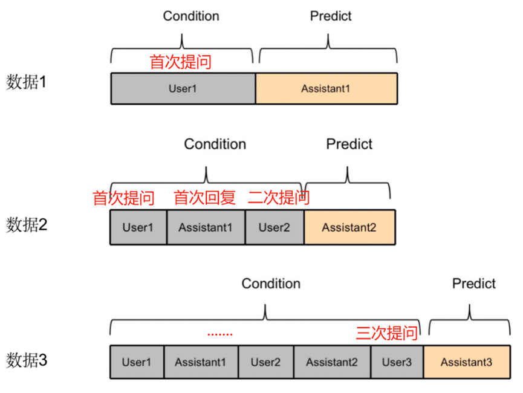

# 一、多轮对话

## 1. 概念

多轮对话就像两个人聊天一样，每次对话的内容都基于之前的交流。例如：

1. 用户问："今天天气怎么样？"
2. 助手答："晴天，28℃。"
3. 用户接着问："那适合去公园吗？"
        助手会根据之前的“晴天”回答给出建议。
        这种“你一句我一句”的连贯对话就叫多轮对话，需要程序记住上下文。

## 2. 原理

```python
[
    {"role": "user", "content": "What is the second?"}
    {"role": "assistant", "content": "The highest mountain in the world is Mount Everest."},
    {"role": "user", "content": "What is the second?"}
    {"role": "assistant", "content": "The highest mountain in the world is Mount Everest."},
    {"role": "user", "content": "What is the second?"} 
    {"role": "assistant", "content": "The highest mountain in the world is Mount Everest."},
    {"role": "user", "content": "What is the second?"} 
]
```

 

## 3. 实现

```python
# consumers.py
import torch
import os
from .deepseek import DeepSeek
from channels.generic.websocket import AsyncWebsocketConsumer
from transformers import AutoTokenizer, AutoModelForCausalLM, TextIteratorStreamer
from threading import Thread
import json
import asyncio

# 只需要运行一次
CURRENT_DIR = os.path.dirname(os.path.abspath(__file__))
# 路径根据实际情况调整以下
model_path = os.path.join(CURRENT_DIR, "../", "deepseekModelLoRA")
# 一：加载模型
device = "cuda:0" if torch.cuda.is_available() else "cpu"
torch_dtype = torch.float16
model = AutoModelForCausalLM.from_pretrained(
    model_path,
    torch_dtype=torch_dtype,
    device_map="auto",
)
tokenizer = AutoTokenizer.from_pretrained(model_path)  # 加载分词器


class ChatStreamConsumer(AsyncWebsocketConsumer):
    def __init__(self, *args, **kwargs):
        super().__init__(*args, **kwargs)
        self.dialogue_history = [
            {"role": "system", "content": "你是一名乐于助人的人工智能助手"}
        ]
        self.max_history_tokens = 3072  # 根据显存调整

    async def _truncate_history(self):
        """动态截断策略"""
        total_tokens = 0
        new_history = [self.dialogue_history[0]]  # 保留系统消息

        # 从最新对话倒序检查
        for msg in reversed(self.dialogue_history[1:]):
            msg_tokens = len(tokenizer.encode(msg["content"]))
            if total_tokens + msg_tokens > self.max_history_tokens:
                break
            new_history.insert(1, msg)  # 插入到系统消息之后
            total_tokens += msg_tokens
        self.dialogue_history = new_history

    async def connect(self):
        print("1. ebSocket连接开始")
        await self.accept()
        print("2. WebSocket连接已接收")
        self._init_system_message()

    def _init_system_message(self):
        """初始化系统消息（根据模型格式要求）"""
        self.dialogue_history = [
            {"role": "system", "content": "你是一名乐于助人的人工智能助手"}
        ]

    async def disconnect(self, close_code):
        print("3. 连接断开")

    async def receive(self, text_data):
        print("4. 收到消息：", text_data)
        data = json.loads(text_data)
        user_message = data.get("message", "")
        # 添加用户消息到历史
        self.dialogue_history.append({"role": "user", "content": user_message})

        # 自动截断过长的历史
        await self._truncate_history()

        # 模拟 AI 回复前的“AI思考中”提示
        await self.send(
            text_data=json.dumps({"type": "start", "content": "AI正在思考中...\n"})
        )

        # 二：设定推理参数，推理消息
        gen_kwargs = {
            "max_new_tokens": 512,
            "do_sample": True,  # 是否使用概率采样
            "top_k": 10,  # 采样时的前K个候选词，越大越随机
            "temperature": 0.7,  # 生成丰富性，越大越有创造力
            "top_p": 0.8,  # 采样时的前P个候选词，越大越随机
            "repetition_penalty": 1.2,
            "pad_token_id": tokenizer.eos_token_id,
        }  # 重复惩罚系数，越大越不容易重复

        # 一：设定模型路径和设备，加载模型
        streamer = TextIteratorStreamer(
            tokenizer, skip_special_tokens=False
        )  # 创建流式输出对象
        print("目前的对话列表：", self.dialogue_history)
        inputs = tokenizer.apply_chat_template(
            self.dialogue_history,
            add_generation_prompt=True,  # 添加assistant响应引导符
            tokenize=True,  # 仅格式化不tokenize
            # tokenize=True,
            return_tensors="pt",
            # return_dict=True,
        ).to(device)
        generation_kwargs = {
            "input_ids": inputs,  # 显式指定输入键
            **gen_kwargs,  # 其他生成参数
            "streamer": streamer,  # 流式输出
        }  # 生成参数
        thread = Thread(target=model.generate, kwargs=generation_kwargs)  # 创建线程

        thread.start()
        # 流式输出
        full_response = []
        for chunk in streamer:
            await self.send(json.dumps({"type": "stream", "content": chunk}))
            full_response.append(chunk)

        # 添加AI回复到历史
        self.dialogue_history.append(
            {
                "role": "assistant",
                "content": "".join(full_response).strip().replace("<think>", ""),
            }
        )

        await self.send(text_data=json.dumps({"type": "end"}))  # 表示结束

```


## 4. KV缓存

KV缓存（Key-Value Cache）适用于 Transformer 结构中，常用于加速推理或多轮对话的场景，也包含了实际应用层的视角，如 LLM 推理中的 KV 缓存机制。


### 4.1  概述

KV缓存（Key-Value Cache）是一种将Transformer中中间计算结果（尤其是注意力机制中的Key和Value）缓存起来，从而在解码时避免重复计算的加速技术。

主要应用场景：

- LLM推理加速（如DeepSeek）
- 多轮对话保持上下文效率
- 流式生成（Streaming Text Generation）


### 4.2 原理简述

#### 4.2.1 Attention机制

在自注意力机制中：
$$
Attention(Q, K, V) = softmax\left(\frac{QK^T}{\sqrt{d_k}}\right)V
$$

- `Q`：当前时间步的Query
- `K`、`V`：历史及当前的Key和Value

在生成式模型（Decoder-only）中，解码是逐token进行的，因此对于每一个新token：

- 只需要 **新增一个Query**
- 但是需要和之前的所有Key、Value计算注意力

#### 4.2.2 存在价值

若每次生成一个token都重新计算所有之前的Key和Value，会非常耗时，可以缓存历史的K/V，在下一步生成时直接复用。


### 4.3 KV缓存结构

通常按层维护：

```python
# 假设模型有 N 层，每层都有自己的 KV 缓存
kv_cache = [
    {"key": [T1, T2, ..., Tn], "value": [...]},  # Layer 1
    {"key": [T1, T2, ..., Tn], "value": [...]},  # Layer 2
    ...
]
```

更新方式：

- 每生成一个新token，将其 $K/V$ 附加到对应层的缓存中
- 缓存长度最多为上下文窗口（context length）


### 4.4 实现细节

#### 4.4.1 维度设计

对于每一层：

```
key.shape   = (batch, num_heads, seq_len, head_dim)
value.shape = (batch, num_heads, seq_len, head_dim)
```

追加操作时，需要在维度上拼接 `seq_len` 维度。

#### 4.4.2 使用方式

以 HuggingFace 的 `generate()` 流程为例：

```python
outputs = model(
    input_ids,
    past_key_values=cache,  # 传入历史缓存
    use_cache=True          # 表示要返回缓存
)
cache = outputs.past_key_values  # 获取新的缓存（含新token的K/V）
```


### 4.5 框架支持

| 框架                          | 支持 KV 缓存 | 特点                           |
| ----------------------------- | ------------ | ------------------------------ |
| HuggingFace Transformers      | ✅            | `past_key_values` 参数         |
| vLLM / FasterTransformer      | ✅            | 高性能KV缓存管理               |
| ChatGLM / Baichuan / InternLM | ✅            | 对KV缓存管理做了优化支持长文本 |


### 4.6 应用案例

- 每轮对话传入已有的 KV 缓存
- 模型仅处理新增问题部分的 Query
- 最终合并KV缓存，用于下一轮


### 4.7 注意事项

- **缓存过长**：超过最大上下文窗口需截断
- **缓存分离**：不同 batch 的缓存要单独存储
- **缓存迁移**：KV缓存不能跨模型版本、设备迁移
- **多语言模型**：KV缓存不兼容多种tokenizer混用


### 4.8 代码实现

```python
# consumers.py
from transformers import AutoTokenizer, AutoModelForCausalLM, TextIteratorStreamer
from threading import Thread
import torch
import os
from channels.generic.websocket import AsyncWebsocketConsumer
import json
import django

os.environ.setdefault("DJANGO_SETTINGS_MODULE", "MyLLM.settings")
django.setup()

from channels.generic.websocket import AsyncWebsocketConsumer
from channels.db import database_sync_to_async
from myapp.models import ConversationTopic, ConversationMessage

# 导入队列用于存储缓存
from queue import Queue


CURRENT_DIR = os.path.dirname(os.path.abspath(__file__))
# 路径根据实际情况调整以下
model_path = os.path.join(CURRENT_DIR, "../", "deepseekModelLoRA")
# 一：加载模型
torch_dtype = torch.float16
device = "cuda:0" if torch.cuda.is_available() else "cpu"
model = AutoModelForCausalLM.from_pretrained(
    model_path,
    torch_dtype=torch_dtype,
    device_map="auto",
)
tokenizer = AutoTokenizer.from_pretrained(model_path)  # 加载分词器

# 为 tokenizer 设置 pad_token
if tokenizer.pad_token is None:
    tokenizer.pad_token = "<|extra_0|>"  # Qwen 支持的特殊 token（可自定义）
    tokenizer.pad_token_id = tokenizer.convert_tokens_to_ids("<|extra_0|>")

# 为模型设置 pad_token_id（和 eos_token_id，防止为 None）
model.config.pad_token_id = tokenizer.pad_token_id
if model.config.eos_token_id is None:
    model.config.eos_token_id = tokenizer.eos_token_id or tokenizer.pad_token_id


class ChatStreamConsumer(AsyncWebsocketConsumer):
    def __init__(self, *args, **kwargs):
        super().__init__(*args, **kwargs)
        self.messages = [{"role": "system", "content": "你是一名医生"}]
        self.messages_max_length = 2048
        # 话题的主键id
        self.topid = 0
        self.cache = None

    def __trunc_msg(self):
        msg_list = [self.messages[0]]
        # 把最新的对话放进来
        for i in range(len(list(reversed(self.messages))) - 1, 0, -1):
            temp_len = len(tokenizer.encode(self.messages[i]["content"]))

            if (
                temp_len
                + sum([len(tokenizer.encode(m.get("content"))) for m in msg_list])
                > self.messages_max_length
            ):
                self.cache = None # 清空缓存
                break
            # 不能使用append，否则会改变原list的顺序 [system, '3333', '222', '000']
            msg_list.insert(1, self.messages[i])

        self.messages = msg_list

    async def connect(self):
        print("1. ebSocket连接开始")
        await self.accept()
        self.topid = 0
        print("2. WebSocket连接已接收")

    @database_sync_to_async
    def add_topic(self, title):
        return ConversationTopic.objects.create(user_id=1, title=title).topid

    @database_sync_to_async
    def add_message(self, role, message):
        return ConversationMessage.objects.create(
            topid=self.topid, role=role, message=message
        )

    async def disconnect(self, close_code):
        print("3. 连接断开")

    async def receive(self, text_data):
        print("4. 收到消息：", text_data)
        data = json.loads(text_data)
        user_message = data.get("message", "")
        # 如果是一个新的话题，就保存到数据库，并返回一个话题主键id
        if self.topid == 0:
            topid = await self.add_topic(user_message)
            # result = await ConversationTopic.objects.create(user_id=1, title=user_message)
            self.topid = topid

        # 保存对话过程的记录 add_message(self, role, message, content):
        await self.add_message(role="user", message=user_message)

        # 模拟 AI 回复前的“AI思考中”提示
        await self.send(
            text_data=json.dumps({"type": "start", "content": "AI正在思考中...\n"})
        )
        
        self.messages.append({"role": "user", "content": user_message})
        # 对输入序列进行长度处理
        self.__trunc_msg()
        # 二：设定推理参数，推理消息：因为启用了KV缓存，所以推理参数中的 past_key_values 需要使用最新的值。
        gen_kwargs = {
            "max_new_tokens": 1024,  # 生成的最大长度
            "do_sample": True,  # 是否使用概率采样
            "top_k": 10,  # 采样时的前K个候选词，越大越随机
            "temperature": 0.7,  # 生成丰富性，越大越有创造力
            "top_p": 0.8,  # 采样时的前P个候选词，越大越随机
            "repetition_penalty": 1.2,
            "pad_token_id": tokenizer.eos_token_id,  # 输出结束标志
            # "past_key_values": self.cache,  # 缓存
            # 缓存
        }  # 重复惩罚系数，越大越不容易重复
        
        # 一：设定模型路径和设备，加载模型
        inputs = tokenizer.apply_chat_template(
            self.messages,
            add_generation_prompt=True,
            tokenize=True,
            return_tensors="pt",
            return_dict=True,
        ).to(
            device
        )  # 将输入数据移动到GPU
        streamer = TextIteratorStreamer(
            tokenizer, skip_special_tokens=False
        )  # 创建流式输出对象
        generation_kwargs = dict(
            **inputs,
            **gen_kwargs,
            streamer=streamer,
            return_dict_in_generate=True,  # 返回字典
            output_hidden_states=False,  # 返回隐藏层输出
            output_scores=False,
            return_legacy_cache=True
        )  # 生成参数
        # 如果缓存存在，尝试插入
        if self.cache is not None:
            # 打印形状看
            print(f"缓存形状:{self.cache[0][0].shape}")
            print(f"输入形状:{inputs['input_ids'].shape}")
            try:
                generation_kwargs["past_key_values"] = self.cache
                # 预检查缓存是否匹配，防止直接报错
                _ = model.generate(
                    input_ids=inputs["input_ids"],
                    past_key_values=self.cache,
                    max_new_tokens=1,
                )
            except RuntimeError as e:
                print("Error:❌缓存与当前输入不兼容，已清空缓存")
                self.cache = None
                generation_kwargs.pop("past_key_values", None)
                
        # 创建queue的实例对象
        output_queue = Queue()

        # 构建多线程目标函数，这样就可以把输出放到队列中
        def generate_output(queue, **kwargs):
            output = model.generate(**kwargs)
            queue.put(output)

        # thread = Thread(target=model.generate, kwargs=generation_kwargs)  # 创建线程
        thread = Thread(
            target=generate_output, kwargs={**generation_kwargs, "queue": output_queue}
        )  # 创建线程
        thread.start()  # 启动线程进行生成
        assistant_content = []
        for new_text in streamer:  # 流式输出生成的文本
            # print('流式推导的数据：', new_text)
            # 多轮对话处理
            # if (
            #     f"<｜begin▁of▁sentence｜>{self.messages[0].get('content', '')}"
            #     in new_text
            # ):
            #     assistant_content.append("<｜begin▁of▁sentence｜>")
            # else:
            assistant_content.append(new_text)

            # 客户端正常的响应
            await self.send(
                text_data=json.dumps({"type": "stream", "content": new_text})
            )
        # '{"role": "assistant", "content": "The highest mountain in the world is Mount Everest."}'
        self.messages.append(
            {"role": "assistant", "content": "".join(assistant_content)}
        )
        # 把输出的KV缓存起来
        # 等待生成线程结束
        thread.join()
        generate_result = output_queue.get()
        self.cache = generate_result.past_key_values  # ✅ 获取 KV 缓存
        # 打印形状
        print(f"Update KV Cache Shape: {self.cache[0][0].shape}")

        # 保存推理内容
        await self.add_message(role="assistant", message="".join(assistant_content))
        # 结束
        await self.send(text_data=json.dumps({"type": "end"}))  # 表示结束

```

