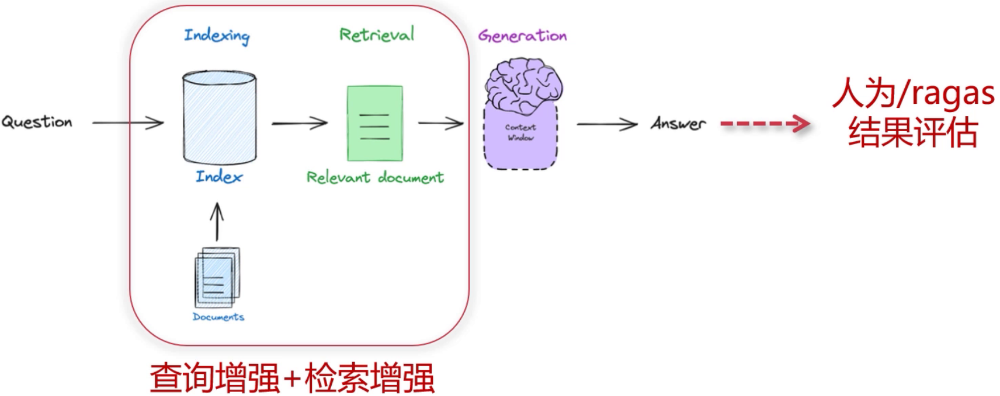
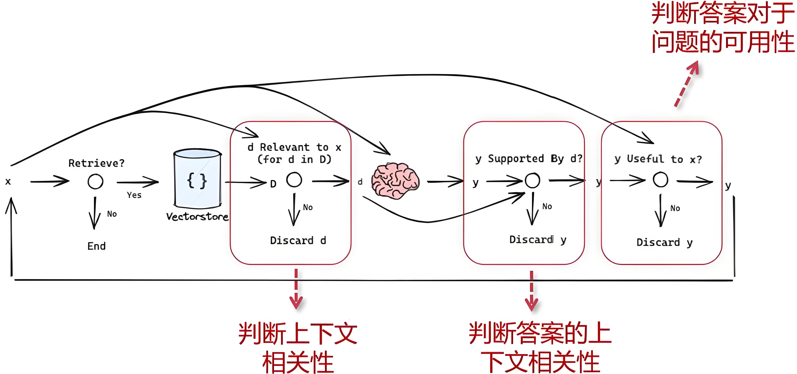

# 一、提示词工程

Prompt Engineering，也被称为“提示词设计”或“指令工程”，指的是**设计、优化和编写**输入以引导LLM生成所期望的高质量输出的技术和方法。

## 1. 提示词

提示词，Prompt，就是你输入给 AI 的文字指令。
 比如：

- 简单提示词：
   `帮我写一封道歉信。`
- 复杂提示词：
   `你现在是一个资深律师，请帮我写一份针对商业合作失败的正式道歉信，要求语气诚恳、条理清晰、长度控制在300字以内。`


## 2. 提示词工程

提示词工程是：

- 设计：如何组织、分解任务，让AI理解你要做的事。
- 优化：如何调整措辞、格式、角色定位，提升AI生成结果的质量和准确性。
- 实验：不断测试不同提示词的效果。

## 3. 核心元素

| 元素                            | 解释                           | 目的                               |
| ------------------------------- | ------------------------------ | ---------------------------------- |
| 1. 角色设定（Role）             | 明确告诉模型它现在扮演什么身份 | 影响输出的口吻、专业度、风格       |
| 2. 任务描述（Task）             | 明确告诉模型要完成什么任务     | 让模型理解你的具体需求             |
| 3. 场景背景（Context）          | 提供必要的背景信息             | 帮助模型精准理解上下文             |
| 4. 输出要求（Constraints）      | 指定格式、长度、风格、语气等   | 保证结果符合可用标准               |
| 5. 示例参考（Examples）         | 提供输入输出样例（Few-shot）   | 显著提升模型生成的准确性和一致性   |
| 6. 推理过程（Chain of Thought） | 要求逐步思考或一步步推理       | 提高复杂任务的正确率，减少思维跳跃 |
| 7. 结果验证（Evaluation）       | 多轮测试与结果质量评估         | 确保提示词设计效果稳定、优质       |

### 3.1 角色设定

让模型知道自己现在扮演谁，会极大改变输出风格和质量。

```text
你是一个高级UI设计师，请帮我设计一个适合运动APP的配色方案。
```

### 3.2 任务描述

必须清晰、具体，避免含糊。

```text
请总结这篇文章的三个重点，并用一句话概括文章主旨。
```

### 3.3 场景背景

复杂任务必须给出背景，减少模型猜测。

```text
背景：公司正在为18-25岁的年轻人推广一款环保水杯，产品主打时尚和便携。
```

### 3.4 输出要求

明确告诉模型输出什么格式、字数、风格等。

```text
请输出成表格，包含列：产品名称、特点、推荐人群，不超过150字。
```

### 3.5 示例参考

提供输入输出样例，模型更容易模仿。

```text
输入：产品：运动手环  
输出：特点：轻便、可测心率；推荐人群：运动爱好者  
输入：环保水杯  
输出：
```

### 3.6 推理过程

要求模型一步步分析，减少错误率。

```text
请一步步分析以下数学题的解题过程，不要直接给出答案。
```

### 3.7 结果验证

持续测试并对比不同提示词设计的效果，调整语气、格式、样例，找到最优解。


## 4. 完整案例

```text
你现在是一个资深人力资源专家。

背景信息：这家公司正在招聘一名Python开发工程师，主要负责数据处理和自动化脚本。

任务描述：请帮我写一份简短的招聘文案，要求突出岗位职责和核心要求。

输出要求：
- 字数控制在100字以内。
- 使用条理清晰的句式。
- 输出格式为：岗位名称：…… 岗位职责：…… 任职要求：……

请一步步思考，先列出岗位核心职责，再整理岗位要求，最后组织语言。

示例：
岗位名称：Java后端开发
岗位职责：负责系统后端开发与接口设计
任职要求：熟悉Spring，具备良好的沟通能力

现在请根据以上内容生成招聘文案。
```

## 5. 最佳实践

官方参考：https://help.openai.com/en/articles/6654000-best-practices-for-prompt-engineering-with-the-openai-api

```txt
prompt_few="根据销售记录的描述，将销售数据分类为“家具”、“电子产品”或“服装”
示例1：“橡木桌子”标签：家具
示例2：“蓝牙耳机”标签：电子产品\
示例3：“男士夏季T恤”标签：服装\
请根据提供的销售记录示例，分析下列记录属于哪个类别：'LED台灯'
```


```txt
你现在是一名商品分类专家，负责根据销售记录中的商品描述，将商品准确归类。

请将每条销售记录按照以下类别进行分类：
- 家具
- 电子产品
- 服装

分类示例：
- 销售记录：“橡木桌子” → 标签：家具
- 销售记录：“蓝牙耳机” → 标签：电子产品
- 销售记录：“男士夏季T恤” → 标签：服装

请严格按照上述示例进行分类，且只输出标签名称，不要输出其他内容。

请分类以下销售记录：
销售记录：LED台灯
```


## 6. 提示词工程师

提示词工程师是指：
 **擅长设计提示词、理解大模型工作原理、能够用提示词驱动AI高效完成复杂任务的人。**

> 一句话：懂AI的“语言设计师”。


# 二、RAG性能提升

如何逐步提升RAG性能？

## 1. 检索增强

采用各种方法完成检索增强。

### 1.1 问题多样性


### 1.2 查询增强


查询增强常见方法： **prompt + LLM**

#### 1.2.1 Query2Doc

Query2Doc是指通过Query的方式，把用户原始查询转化为更适合检索的文档式表达，从而提升召回的相关性和丰富度。

**场景一：简单问题**

==用户 Query：==

```txt
"乔布斯生平"
```

==Query2Doc 扩展：==

```txt
"请提供史蒂夫·乔布斯的详细生平，包括他的出生时间、重要经历、创办苹果公司的过程、与皮克斯的关系、被苹果公司解雇的经历以及回归苹果后的重大成就和去世时间。"
```

==效果：==

扩展后的 Query 能更好地召回包含乔布斯不同人生阶段的文档，而不是只命中“乔布斯”这个名字。


**场景二：技术问题**

==用户 Query：==

```txt
"Transformer 优势"
```

==Query2Doc 扩展：==

```txt
"请详细说明 Transformer 模型相对于 RNN 和 CNN 的优势，包括并行处理能力、自注意力机制的效果、在长序列处理中的表现以及在自然语言处理任务中的应用优势。"
```

==效果：==

检索时更容易找到对比分析和全面阐述 Transformer 优点的文档，而不仅仅是零散提及“优势”的文章。


**场景三：实际工程应用**

==用户 Query：==

"YOLOv8 小目标检测"

==Query2Doc 扩展：==

```txt
"请提供关于 YOLOv8 在小目标检测场景中的应用、优化方法、调参技巧、改进策略以及实际案例分析的相关资料。"
```

==效果：==

检索结果更可能包含优化细节、工程经验、参数调整等高质量内容。

**总结**

| 项目     | 普通 Query                   | Query2Doc 扩展             |
| -------- | ---------------------------- | -------------------------- |
| 查询表达 | 简短、关键词型               | 丰富、文档型               |
| 检索结果 | 关键词匹配为主，召回可能不足 | 语义丰富，召回全面         |
| 适用场景 | 简单搜索                     | RAG 系统中提高检索召回质量 |

**提示词模板：**

```txt
请将用户提出的简短查询，扩展为一段详细的文档式检索请求。请尽可能补充背景信息、应用场景、相关细节和可能涉及的子问题，目标是生成一段结构化且信息丰富的检索文本，以便后续检索到更加全面和高质量的文档。用户查询为：**{用户Query}**
```

**示例模板：**

```text
你是检索增强生成（RAG）系统中的查询扩展专家。请将以下简短查询转化为详细、信息丰富的文档式检索请求，目标是：
- 扩展背景信息
- 提出相关子问题
- 提供应用场景
- 包含技术细节或历史沿革（如适用）

请扩展的内容尽量包含：
- 定义或基本解释
- 相关领域应用
- 可能的争议或不同观点
- 关键人物、组织或事件（如适用）
- 具体实例或案例（如适用）

用户查询：{用户Query}

请输出详细的检索请求，不要生成答案，仅生成扩展后的检索描述。
```

- 医疗、金融、学术、工程等行业需要定制专门的模板。
- 多轮对话需要针对性设计。


#### 1.2.2 HyDE


**HyDE**： Hypothetical Document Embeddings，假设性文档向量（也可以多个假设性文档，然后词向量求均值）。

并不直接对查询进行向量化检索，而是：

- 先用LLM根据查询生成一个假设的答案文档（Hypothetical Document）。
- 再将这个假设文档向量化，作为检索的查询向量。
- 最后用该向量去检索数据库中的真实文档。

这样做的核心思想是：
 与其检索与“问题”相关的文档，不如检索与“可能的答案”相关的文档。

**HyDE 工作流程：**

==假设用户查询：==

```txt
"什么是量子计算？"
```

**使用 LLM 生成一个可能的答案（假设文档）：**

```txt
"量子计算是一种利用量子比特进行并行计算的新型计算模式，它通过量子叠加和量子纠缠..."
```

- 将这段生成的假设文档向量化。
- 用这个假设文档的向量去检索数据库，找到与这个“答案”最相似的真实文档。

**优势：**

- LLM 生成的假设文档往往比原始问题更具体，向量检索效果更好。
- 即使问题表述不清或存在长尾问题，HyDE 也能引导检索找到更相关的文档。
- 对于复杂、多步骤问题，HyDE 可以自动补充缺失背景。

**应用场景**

- RAG检索增强：显著提升检索召回质量。
- 小样本知识库问答：适合知识稀疏的场景，LLM 可以“猜出”合理答案方向。
- 多轮对话检索优化：将多轮历史生成成假设文档，检索更上下文相关。

**提示词模板：**

```text
你现在是一名知识检索助手，请根据用户的问题生成一段关于该问题的详细描述，用于向量检索，不用回答问题，只需要生成假设性的答案文本。

用户问题：{query}

假设文档：
```

生成后，将假设文档向量化并作为检索向量。


**针对多轮对话的提示词：**

==① 简单拼接法（上下文串联）==

直接将所有历史轮次（包括用户提问和 AI 回复）按时间顺序拼接起来，形成一个完整的上下文，作为生成假设性文档的输入。

**示例：**

```
对话历史：
用户：什么是量子计算？
助手：量子计算是一种利用量子比特进行并行计算的新型计算模式。

用户：它和经典计算有什么区别？

当前用户问题：
它在什么领域有应用？
```

输入给 LLM 的完整 prompt：

```text
请根据以下对话历史，生成一段假设性文档，用于向量检索：

对话历史：
用户：什么是量子计算？
助手：量子计算是一种利用量子比特进行并行计算的新型计算模式。
用户：它和经典计算有什么区别？
助手：经典计算用二进制位存储信息，而量子计算利用量子叠加和纠缠实现并行运算。

当前问题：
它在什么领域有应用？

生成假设文档：
（此处 LLM 生成的长文本，用于后续向量检索）
```

适用场景：简单任务，历史轮数较少。

**② 多轮总结法（上下文摘要）**

将历史多轮对话 **总结提炼成关键信息**，再和当前问题一起输入，生成假设文档。

```
历史对话总结：
本轮对话主要讨论了量子计算的定义、原理以及与经典计算的区别。

当前用户问题：
它在什么领域有应用？
```

输入给 LLM 的 prompt：

```text
请根据以下对话总结和当前问题，生成一段假设性文档，用于向量检索：

对话总结：
本轮对话主要讨论了量子计算的定义、原理以及与经典计算的区别。

当前问题：
它在什么领域有应用？

生成假设文档：
（此处 LLM 生成的长文本，用于后续向量检索）
```

适用场景：复杂多轮长对话（如客服、技术问答）

==历史对话如何总结？==

```txt
你是一名知识检索助手，请根据以下多轮对话历史，首先总结用户已了解的内容和当前的核心问题，然后生成一段假设性文档，用于向量检索。

【对话历史】：
{历史对话内容}

步骤一：对话总结：
（简洁总结）

步骤二：假设性文档：
（详细生成的假设文档）
```


#### 1.2.3 子问题查询

问题描述复杂，包含多个语义的问题，直接用复杂问题进行向量化检索可能会导致部分问题丢失，影响检索的性能。

**核心思路：**

对于复杂问题，直接检索相关文档可能失败，因为问题跨度大、涉及多个知识点。

解决思路：把复杂问题拆解成多个子问题，分别检索，再汇总答案。


**整体流程**

- 问题拆解

  使用 LLM 自动将复杂问题拆解为一系列子问题。

- 子问题检索

  对每个子问题分别检索相关文档，得到子问题相关的知识片段。

- 答案整合

  将所有子问题检索到的信息进行融合，输出最终答案。


**实用提示词模板**

- 子问题生成 Prompt

  ```txt
  你是一名问题分析专家，请将以下复杂问题拆解为多个可以单独查询的子问题，尽量覆盖该复杂问题的所有核心要素。
  
  复杂问题：
  {复杂问题}
  
  请拆解为子问题：
  ```

  示例

  ```txt
  复杂问题：
  为什么量子计算在密码学中具有潜在威胁？
  
  子问题：
  1. 什么是量子计算？
  2. 什么是当前主流的密码学原理？
  3. 量子计算可以如何破解现有的密码算法？
  ```

- 子问题检索 Prompt

  ```txt
  请根据以下子问题，分别生成针对每个子问题的假设性文档，用于向量检索。
  
  子问题：
  {子问题列表}
  
  请为每个子问题分别生成假设文档。
  ```

- 答案整合 Prompt

  ```
  你是一名问答整合专家，请根据以下子问题及对应的检索结果，综合生成对用户复杂问题的完整解答。
  
  用户复杂问题：
  {复杂问题}
  
  子问题及检索结果：
  1. {子问题1} → {检索结果1}
  2. {子问题2} → {检索结果2}
  ...
  
  请生成综合答案：
  ```

  

**检索策略：**

| 检索策略 | 适用场景                                   |
| -------- | ------------------------------------------ |
| 并行检索 | 子问题独立，检索时可以同时处理（提高效率） |
| 顺序检索 | 子问题依赖上一个答案（适合推理链场景）     |

**使用场景：**

- 问题跨度大，例如：

  - 涉及多个领域（医学+生物+政策）

  - 需要背景知识补充（例如历史事件）

- 多跳推理场景，例如：

  - "张三的导师的母校在哪里？"

  - "A公司CEO的博士论文研究方向是什么？"


#### 1.2.4 查询改写

Query Rewriting适合解决以下问题：

- 用户查询不清晰、过短或带有歧义
- 检索召回率低，无法覆盖关键文档
- 复杂问题缺乏足够上下文支撑

利用大语言模型的能力，根据用户问题多角度重写问题，增加额外的信息，提高检索性能

**Prompt 模板设计**

- 通用型 Prompt 模板

  ```
  你是一名专业的查询改写专家。请基于下列用户提问，生成 3 个语义等价但表达不同的问题改写，目标是：
  
  - 增强检索覆盖面
  - 提高召回率
  - 避免单一词汇表述
  
  要求：
  - 每个改写尽量使用不同的关键词或短语
  - 保持问题的核心含义不变
  
  用户问题：
  {用户原始问题}
  
  请返回改写后的问题列表：
  1.
  2.
  3.
  ```

- 场景化 Prompt 模板

  ==场景一：知识库问答==

  ```
  你是一名企业知识库查询助手。请针对以下用户提问，生成 3 个适用于文档检索的改写问题，目标是：
  
  - 使用多样化词汇和表达方式
  - 增强检索系统对相关文档的召回能力
  - 每个改写的重点词汇需尽量不同
  
  用户问题：
  {用户原始问题}
  
  请直接输出问题改写：
  1.
  2.
  3.
  ```

  ==场景二：学术文献检索==

  ```
  你是一个学术检索系统的查询优化专家。请根据用户的问题，生成 3 个适合文献检索系统的改写问题，要求：
  
  - 包含不同的学术术语、表达方式或扩展词
  - 适合用作检索关键词，提升召回率
  - 每个改写风格尽量差异化
  
  用户问题：
  {用户原始问题}
  
  请返回：
  1.
  2.
  3.
  ```

  ==场景三：多轮对话历史融合==

  ```
  你是一个多轮对话检索增强系统，当前用户提问需要结合对话历史进行问题改写。
  
  历史对话：
  {历史对话内容}
  
  用户问题：
  {当前问题}
  
  请生成 3 个基于对话上下文的改写问题，要求：
  - 充分利用历史信息补全用户当前问题
  - 改写后的问题要具备检索完整性
  - 每个改写尽量用不同句式或关键词
  
  返回格式：
  1.
  2.
  3.
  ```

  

**改写方向和风格控制**

| 标签           | 含义                           | 适用场景       |
| -------------- | ------------------------------ | -------------- |
| 【同义改写】   | 使用同义词、近义表达           | 提高检索多样性 |
| 【背景扩展】   | 在问题中补充背景信息           | 上下文不充分   |
| 【领域词替换】 | 使用行业术语或扩展词           | 专业检索       |
| 【简化表述】   | 用更口语化、更简短表达         | 面向大众用户   |
| 【复杂拆解】   | 将问题拆成更简单易检索的子问题 | 多跳检索       |

通过在 Prompt 里增加：

- 【同义改写】、【背景扩展】、【领域词替换】等标签，指定改写方向
- 【生成限制】：例如，字数范围、必须包含的关键词等

```
你是一名查询改写专家。请针对以下用户问题，按照指定标签，生成符合要求的问题改写。

改写类型标签：
1. 【同义改写】 使用不同的同义词或近义表达。
2. 【背景扩展】 补充相关背景或上下文信息。
3. 【领域词替换】 将问题改写为包含专业术语或行业关键词。

用户问题：
{用户问题}

请分别生成：
【同义改写】：
- 改写 1：
- 改写 2：

【背景扩展】：
- 改写 1：
- 改写 2：

【领域词替换】：
- 改写 1：
- 改写 2：

```


#### 1.2.5 Take A Step Back

**Take A Step Back**，退一步检索， 是指：

- 当原始问题过于复杂、专业或太细节，直接检索无法命中有效文档时，
- 我们可以主动将问题**改写为更一般性、更宏观、更基础的问题**，先获取较大范围的背景信息，再逐步推导答案。


**案例解析：**

==用户问题：==

```
“抗 PD-1 疗法在非小细胞肺癌不同分期的疗效比较如何？”
```

这个问题非常具体，可能检索不到完全匹配的文档。

==Take A Step Back 改写：==

- 一步退后的问题：

  ```
  “抗 PD-1 疗法在非小细胞肺癌中的总体疗效如何？”
  ```

- 再进一步退后：

  ```
  “抗 PD-1 疗法的基本原理是什么？”
   “非小细胞肺癌的常见治疗方法有哪些？”
  ```

  通过这种更基础、更概括的问题，我们可以先检索相关背景，再逐步深入回答原始复杂问题。


**技术流程：**

```text
用户问题 → 检索失败/低召回 → 触发 Take A Step Back → 问题泛化 → 新问题检索 → 背景文档获取 → 多步推理生成答案
```

**Prompt 示例**

```text
你是一名检索增强助手。当遇到复杂、专业、过于细节的问题时，请退一步，生成更一般性、更广泛的问题，帮助提升检索效果。

用户原始问题：
{原问题}

请改写为更泛化、更容易检索的问题：
1.
2.
3.
```

总之，Take A Step Back 是通过主动将复杂问题泛化为更基础、更宏观的问题，提升检索成功率的有效策略。


### 1.3 多索引检索增强

从检索的角度进行增强，依然属于检索前增强。

#### 1.3.1 问题分析


#### 1.3.2 父子文档 small2big


查小找大，背后逻辑：开源embedding模型对于短文本提取语义效果更好。

**背后架构：**


#### 1.3.3 总结索引


- 文档块生成总结摘要。
- 在总结摘要上做embbedding。
- 相似度查询用总结摘要。
- 返回的文档是总结摘要对应的bigchunk。

#### 1.3.4 文档假设问题


- 文档块生成假设问题（答案在文档中）
- 在假设问题上做embbedding
- 相似度查询用假设问题
- 返回的文档是假设问题对应的bigchunk
- 假设问题：用户问题和假设问题的同一层面的语义匹配


### 1.4 检索后增强

在检索后再处理一下哎。

#### 1.4.1 融合检索


也叫混合检索

**架构如下：BM25+embedding**


**分数计算：**加权倒数排名


实例参考如下：


#### 1.4.2 重排rerank


**重排基本架构：**


### 1.5 系统性查询增强

不是检索之前，也不是检索之后，称之为系统性检索增强

#### 1.5.1 迭代检索增强生成


**系统性架构：**


- 选代1：给定一个问题，检索到上下文信息
- 迭代1：模型针对问题和上下文信息，生成可能正确的答案
- 迭代2：将生成可能正确的答案再合并到问题，做为新的问题，去检索上下文问题
- 迭代2：模型再次针对问题和新的上下文信息，生成答案

**实例如下：**


### 1.6 新范式Self-Rag

|  |
| :----------------------------------------------------------: |
|                         传统RAG架构                          |

|  |
| :----------------------------------------------------------: |
|                        新范式Self-Rag                        |

- 问题：RAG流程是否自动加入判别的步骤，可以动态的选择使用哪种策略，自动迭代生成最好的答案
- 判断检索的文档是否相关：只取相关的，都不相关采用查询增强策略
- 判断生成答案是否符合上下文：不符合可以多次生成尝试
- 判断生成答案是否能回答问题：不能回答直接告知或采用新的增强策略

相关指标从RAGAS中关联过来就可以了，牛~

**下面是基于langgraf的实现流程：**


