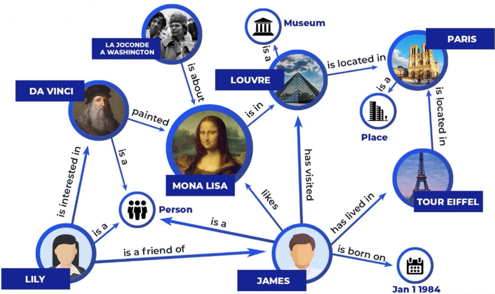
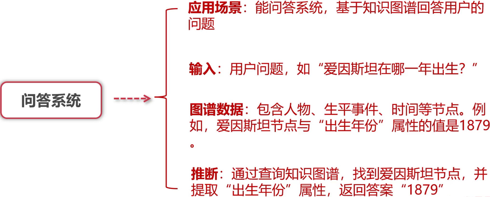
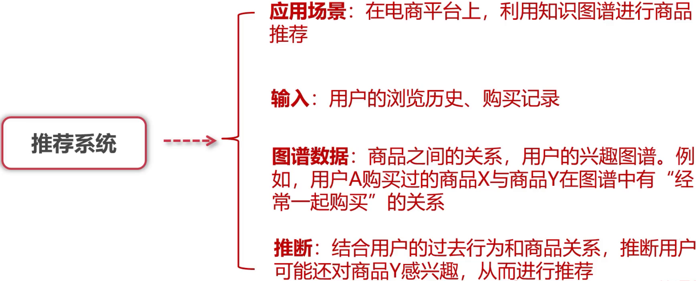
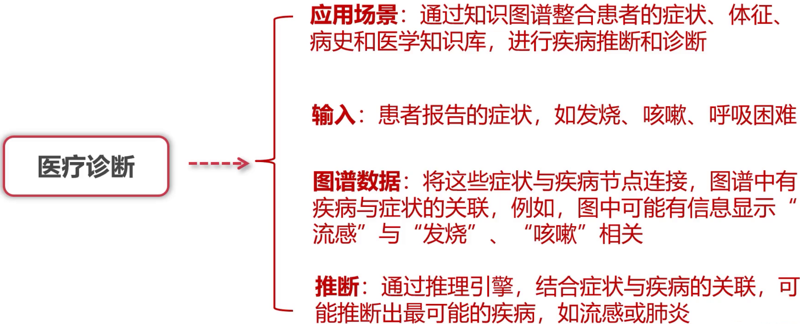
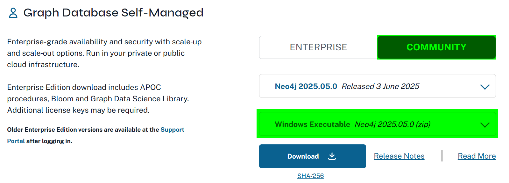
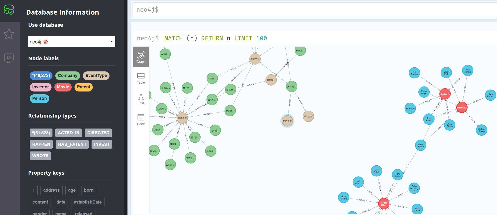

# 一、知识图谱

知识图谱，Knowledge Graph，简称 KG，是以图的形式组织和表示知识的一种结构化数据模型，它通过节点（实体）和边（关系）来描述世界中的各种事物及其相互关系。

**知识图谱 = 实体（节点） + 关系（边） + 属性（补充信息）**


## 1. 基本认知

### 1.1 实体→Entity

- 代表现实世界中的具体事物或抽象概念。
- 如：人、地点、公司、事件、书籍等。
- 举例：`马云`、`阿里巴巴`、`杭州`。

### 1.2 关系→Relation

- 描述实体之间的联系。
- 通常是有向边。
- 举例：`创办`、`位于`、`属于`。

### 1.3 属性→Attribute

- 实体或关系的补充描述信息。
- 举例：`马云`的生日是`1964年9月10日`。

### 1.4 示意图



### 1.5 特点

| 特点     | 说明                           |
| -------- | ------------------------------ |
| 结构化   | 通过图结构清晰表达实体及其关系 |
| 可扩展   | 容易新增节点、关系、属性       |
| 语义丰富 | 支持复杂查询和推理             |
| 融合性强 | 能整合多源异构数据             |


### 1.6 应用场景

- 搜索引擎

- 智能问答系统

  |  |
  | ------------------------------------------------------------ |

- 推荐系统

  |  |
  | ------------------------------------------------------------ |

- 企业知识管理

- 风险控制与反欺诈

- 法律、医疗、金融等垂直行业知识建模

  |  |
  | ------------------------------------------------------------ |

  

## 2. 核心概念

我们如何把Knowledge Graph引入到RAG系统，以提升RAG性能呢？

### 2.1 三元组→Triple

三元组是知识图谱中最基本的语义单元，用于表达主体对客体的某种语义关系。

格式为：

```plaintext
（主体，谓词，客体）
（Subject, Predicate, Object）
```


### 2.2 详细解析

三元组实际上就是图中的一条有向边：==节点（主体） --[谓词]--> 节点（客体）==

| 组成部分 | 含义                             | 例子     |
| -------- | -------------------------------- | -------- |
| 主体     | 知识描述的发起者，通常是某个实体 | 马云     |
| 谓词     | 主体与客体之间的关系、属性       | 创办     |
| 客体     | 与主体相关联的另一个实体或属性值 | 阿里巴巴 |

**如下：**

```plaintext
（马云，创办，阿里巴巴）
（阿里巴巴，总部，杭州）
（马云，出生日期，1964年9月10日）
```


### 2.3 有向和无向

实体之间的关系（谓语）是否具有方向性，直接影响图的结构、查询效率以及知识推理的能力。


#### 2.3.1 有方向

关系具有**明确的起点和终点**，信息流动是单向的。

| 主体 | 谓语 | 客体     |
| ---- | ---- | -------- |
| 马云 | 创办 | 阿里巴巴 |
| 杭州 | 位于 | 中国     |


#### 2.3.2 无方向

关系本身**没有明确方向性**，双方是对等的、互相成立的，也可以理解为双向的。

| 实体A | 关系     | 实体B |
| ----- | -------- | ----- |
| 李白  | 好友     | 杜甫  |
| 北京  | 姊妹城市 | 东京  |


## 3. 知识图谱实战

完成知识图谱的存储和操作等。


### 3.1  图数据库

图数据库，Graph Database，是一种以图结构（Graph）进行数据建模和存储的数据库。它以**节点（Node）**、**关系（Relationship）** 和 **属性（Property）** 的形式来表示和存储数据。

图数据库强调数据之间的**关系优先**，并且关系是一等公民，查询复杂关系时效率更高。

**常见图数据库：**

​	Neo4j：是一个高性能的NoSQL图形数据库，支持Cypher查询语言，适合于处理复杂的关系数据，支持千万级别以内的数据集。

​	NebulaGraph：擅长处理干亿节点万亿条边的超大数据集，同时保持毫秒级查询延时的图数据库解决方案。


#### 3.1.1 Neo4j 

Neo4j 是目前应用最广泛的图数据库之一，主要用于存储和处理图结构数据，其核心优势在于高效地管理节点（Node）和关系（Relationship），尤其擅长处理复杂关系查询。

| 概念                | 说明                                         |
| ------------------- | -------------------------------------------- |
| 节点 (Node)         | 图中的实体，例如人、公司、产品等             |
| 关系 (Relationship) | 节点之间的连接，有方向，关系本身也可以带属性 |
| 属性 (Property)     | 键值对形式，存储节点或关系的具体信息         |
| 标签 (Label)        | 节点的分类，支持多标签，方便查询             |
| 图 (Graph)          | 由节点和关系组成的数据结构                   |


#### 3.1.2 环境配置

安装文档：https://neo4j.com/docs/operations-manual/current/installation/

Neo4j底层是java，需要依赖JDK。

- 安装JDK

  https://www.oracle.com/java/technologies/downloads/#jdk21-windows

  检查：安装遇到问题？百度查一下

  ```cmd
  C:\Users\15740>java --version
  java 21.0.7 2025-04-15 LTS
  Java(TM) SE Runtime Environment (build 21.0.7+8-LTS-245)
  Java HotSpot(TM) 64-Bit Server VM (build 21.0.7+8-LTS-245, mixed mode, sharing)
  ```

  

- 安装neo4j

  https://neo4j.com/deployment-center/

  

  ```txt
  Default login is username 'neo4j' and password 'neo4j' (full installation instructions below)
  ```

  

- 部署

  **开发模式启动：**

  ```cmd
  neo4j console
  ```

  **后台模式启动：**需要先安装服务

  ```cmd
  neo4j windows-service install
  ```

  然后：

  ```cmd
  neo4j start
  neo4j stop
  ```

  

#### 3.1.3 基本操作

Cypher 查询语言：类似 SQL，但专门用于图结构查询。

- 创建节点

  ```cypher
  CREATE (p:Person {name: 'Alice', age: 30})
  ```

  表示创建一个标签为 `Person` 的节点。

- 创建关系

  ```cypher
  MATCH (a:Person {name: 'Alice'}), (b:Person {name: 'Bob'})
  CREATE (a)-[:KNOWS]->(b)
  ```

  表示创建一个 Alice 到 Bob 的 `KNOWS` 关系。

- 查询节点和关系

  ```cypher
  MATCH (a:Person)-[:KNOWS]->(b:Person)
  RETURN a, b
  ```

   

#### 3.2.4 Neo4j可视化

Neo4j 自带图形化管理工具 **Neo4j Browser**，支持图形化展示节点和关系，支持 Cypher 交互式查询。



```http
http://localhost:7474/browser/
```


### 3.2 数据集处理

中文开发知识图谱数据集：http://openkg.cn/data/

#### 3.2.1 金融数据集

- IREE：投资领域细颗粒度风险事件抽取数据集

  官网下载：http://data.openkg.cn/dataset/iree

  数据：事件描述了金融实体在市场行为、财报信息、公司运营、信用评估、公司声誉出现的一些问题，比如哪个企业发生了债务危机，裁员了等等，这些都是企业面临危机的信号。这些事件来自各大主流财经类资讯平台、传统媒体、新媒体的报导等。

  

- 企业投资数据

  官网下载：http://data.openkg.cn/dataset/invest-on-invent

  创新投资领域知识图谱，包括企业、投资机构、专利等实体类型及其关系，是实体和关系具有多类型和带属性特点，可用于对技术投资偏好进行基于知识图谱技术的挖掘，辅助进行投资决策。


#### 3.2.2 数据集基本整理

python操作neo4j需要个工具包：

```css
pip install py2neo
```

```python
# 导入neo操作使用到的包
from py2neo import Graph, Node, Relationship

# 导入进度条、打印等扩展包
from tqdm import tqdm
import json


```

连接到neo4j：==注意协议及端口==

```python
# 连接到neo4j数据库
graph = Graph("bolt://localhost:7687", auth=("neo4j", "wh840921"), name="neo4j")
print("连接成功")
```

**事件数据集**公司整理：

```python
    # 公司事件
    iree_data = []
    with open("./data/iree.json", "r", encoding="utf-8") as f:
        for line in f.readlines():
            iree_data.append(json.loads(line.strip()))
    print(iree_data[20])
    # 提取所有 事件数据  的公司名称
    company_name = {}
    # 过滤脏数据
    ignore_names = [
        "null",
        "None",
        "电器",
        "600万股",
        "公司",
        "135万元",
        "2018年",
        "新产业",
    ]
    for item in iree_data:
        for label in item["label"]:
            if "arguments" in label:
                for arg in label["arguments"]:
                    for key, value in arg.items():
                        if key == "主体":
                            if value in ignore_names:
                                continue
                            company_name[value] = 1
    print(list(company_name.keys())[:10])

```


**投资数据集**公司及专利映射关系构建：==很多地方用到公司id，需要把id和对应公司映射起来==

```python
    # 投资公司
    with open("./data/invest-on-invent-KG.json", "r", encoding="utf-8") as f:
        company_data = json.loads(f.read())

    # print(company_data["@graph"][6382])
    # print(company_data["@graph"][141764])

    # 数据处理
    obj_by_id = {}
    for obj in company_data["@graph"]:
        obj_by_id[obj["@id"]] = obj

```

投资数据集公司提取：

```python
    # 提取所有投资公司名称
    invest_company = []
    for obj in company_data["@graph"]:
        if obj["@type"] == "company":
            invest_company.append(obj["name"])

    print(invest_company[:10])
```

事件数据集和投资数据集之间公司对齐：简写映射到全称

```python
    company_name_map = {}
    for com in company_name.keys():
        for inv in invest_company:
            if com in inv:
                company_name_map.setdefault(com, []).append(inv)

    print(company_name_map["小米"])
    print(company_name_map["格力电器"])
```


#### 3.2.3 事件数据入库

```python
    for event in tqdm(iree_data):
        title = event["title"]
        content = event["content"]

        for label in event["label"]:
            event_type = label["event_type"]
            # 创建事件类型节点
            event_type_node = Node("EventType", name=event_type)
            # 没有就创建，有就合并
            graph.merge(event_type_node, "EventType", "name")

            if "arguments" in label:
                cname = ""
                temp_args = {}
                for arg in label["arguments"]:
                    for key, value in arg.items():
                        if key == "主体":
                            cname = value
                        else:
                            temp_args[key] = value
                # 通过映射关系找全名
                if cname in company_name_map:
                    for company_name in company_name_map[cname]:
                        # 构建公司节点
                        company_node = Node("Company", name=company_name)
                        # 保存公司节点到数据库
                        graph.merge(company_node, "Company", "name")

                        # 构建关系
                        relationship = Relationship(
                            company_node, "HAPPEN", event_type_node
                        )
                        # 构建关系属性
                        for key, value in temp_args.items():
                            relationship[key] = value
                        relationship["title"] = title
                        relationship["content"] = content
                        # 添加关系
                        graph.create(relationship)

```


#### 3.2.4 投资及专利数据入库

```python
    for oper in tqdm(company_data["@graph"]):
        if oper["@type"] == "company":
            # 公司节点各种属性
            name = oper["name"]
            alterNames = oper["alterNames"]
            establishDate = oper["establishDate"]
            address = oper["address"]
            applyPatent = oper["relationship"]["applyPatent"]

            com_node = Node(
                "Company", name=name, establishDate=establishDate, address=address
            )
            graph.merge(com_node, "Company", "name")
            # 把专利属性追加进来
            if len(applyPatent):
                for patent in applyPatent:
                    patent_name = obj_by_id[patent["@id"]]["name"]
                    # 创建专利节点
                    patent_node = Node("Patent", name=patent_name)
                    graph.merge(patent_node, "Patent", "name")
                    # 构建公司拥有专利的关系
                    reltionship = Relationship(com_node, "HAS_PATENT", patent_node)
                    graph.create(reltionship)

        elif oper["@type"] == "investor":
            # 创建投资者节点
            investor_node = Node("Investor", name=oper["name"])
            graph.merge(investor_node, "Investor", "name")
            # 投资者投资的公司
            invest_company = oper["relationship"]["investCompany"]
            for invest in invest_company:
                invcom_name = obj_by_id[invest["@id"]]
                # 公司节点各种属性
                name = invcom_name["name"]
                alterNames = invcom_name["alterNames"]
                establishDate = invcom_name["establishDate"]
                address = invcom_name["address"]
                applyPatent = invcom_name["relationship"]["applyPatent"]
                
                com_node = Node(
                    "Company", name=name, establishDate=establishDate, address=address
                )
                graph.merge(com_node, "Company", "name")
                
                # 建立投资者和被投资公司之间的关系
                reltionship = Relationship(investor_node, "INVEST", com_node)
                reltionship['date'] = invest['date']
                reltionship['round'] = invest['round']
                
                graph.create(reltionship)
```

导入不动就用Excel表格导入：

```python
    import csv
    from tqdm import tqdm

    # 建立 CSV 文件
    company_writer = csv.writer(open('companies.csv', 'w', newline='', encoding='utf-8'))
    company_writer.writerow(['company_id:ID', 'name', 'alterNames', 'establishDate', 'address'])

    patent_writer = csv.writer(open('patents.csv', 'w', newline='', encoding='utf-8'))
    patent_writer.writerow(['patent_id:ID', 'name'])

    investor_writer = csv.writer(open('investors.csv', 'w', newline='', encoding='utf-8'))
    investor_writer.writerow(['investor_id:ID', 'name'])

    company_patent_writer = csv.writer(open('company_patent_rels.csv', 'w', newline='', encoding='utf-8'))
    company_patent_writer.writerow([':START_ID', ':END_ID', ':TYPE'])

    investor_invest_writer = csv.writer(open('investor_invest_company_rels.csv', 'w', newline='', encoding='utf-8'))
    investor_invest_writer.writerow([':START_ID', ':END_ID', ':TYPE', 'date', 'round'])

    # 为节点创建唯一ID
    company_id_map = {}
    patent_id_map = {}
    investor_id_map = {}

    company_counter = 1
    patent_counter = 1
    investor_counter = 1

    for oper in tqdm(company_data["@graph"]):
        if oper["@type"] == "company":
            name = oper["name"]
            alterNames = oper.get("alterNames", "")
            establishDate = oper.get("establishDate", "")
            address = oper.get("address", "")
            applyPatent = oper["relationship"].get("applyPatent", [])

            if name not in company_id_map:
                company_id = f'company{company_counter}'
                company_id_map[name] = company_id
                company_counter += 1
                company_writer.writerow([company_id, name, alterNames, establishDate, address])
            else:
                company_id = company_id_map[name]

            if len(applyPatent):
                for patent in applyPatent:
                    patent_name = obj_by_id[patent["@id"]]["name"]
                    if patent_name not in patent_id_map:
                        patent_id = f'patent{patent_counter}'
                        patent_id_map[patent_name] = patent_id
                        patent_counter += 1
                        patent_writer.writerow([patent_id, patent_name])
                    else:
                        patent_id = patent_id_map[patent_name]

                    # 写公司-专利关系
                    company_patent_writer.writerow([company_id, patent_id, 'HAS_PATENT'])

        elif oper["@type"] == "investor":
            investor_name = oper["name"]
            if investor_name not in investor_id_map:
                investor_id = f'investor{investor_counter}'
                investor_id_map[investor_name] = investor_id
                investor_counter += 1
                investor_writer.writerow([investor_id, investor_name])
            else:
                investor_id = investor_id_map[investor_name]

            invest_company = oper["relationship"].get("investCompany", [])
            for invest in invest_company:
                invcom = obj_by_id[invest["@id"]]
                name = invcom["name"]
                alterNames = invcom.get("alterNames", "")
                establishDate = invcom.get("establishDate", "")
                address = invcom.get("address", "")
                applyPatent = invcom["relationship"].get("applyPatent", [])

                if name not in company_id_map:
                    company_id = f'company{company_counter}'
                    company_id_map[name] = company_id
                    company_counter += 1
                    company_writer.writerow([company_id, name, alterNames, establishDate, address])
                else:
                    company_id = company_id_map[name]

                # 写投资关系
                investor_invest_writer.writerow([
                    investor_id, company_id, 'INVEST',
                    invest.get('date', ''), invest.get('round', '')
                ])

                # 写公司-专利关系
                if len(applyPatent):
                    for patent in applyPatent:
                        patent_name = obj_by_id[patent["@id"]]["name"]
                        if patent_name not in patent_id_map:
                            patent_id = f'patent{patent_counter}'
                            patent_id_map[patent_name] = patent_id
                            patent_counter += 1
                            patent_writer.writerow([patent_id, patent_name])
                        else:
                            patent_id = patent_id_map[patent_name]

                        company_patent_writer.writerow([company_id, patent_id, 'HAS_PATENT'])

```

关闭neo4j，执行导入操作：

```cmd
neo4j-admin database import full neo4j --overwrite-destination=true --nodes=Company=F:\00.AI250201.NLP\10.day\companies.csv --nodes=Patent=F:\00.AI250201.NLP\10.day\patents.csv --nodes=Investor=F:\00.AI250201.NLP\10.day\investors.csv --relationships=HAS_PATENT=F:\00.AI250201.NLP\10.day\company_patent_rels.csv --relationships=INVEST=F:\00.AI250201.NLP\10.day\investor_invest_company_rels.csv
```

发现有重复的需要去重，可以直接Cypher操作：

```cypher
MATCH (a)-[r:INVEST]->(b)
WITH a, b, collect(r) AS rels
WHERE size(rels) > 1
FOREACH (r IN tail(rels) | DELETE r)
```


### 3.3 数据查询

各种业务场景下的知识图谱查询示例参考

#### 3.3.1 根据事件查公司

查询【收到起诉】的公司：

```python
    query = """
        MATCH (n:Company)-[r:HAPPEN]->(m:EventType {name:'收到起诉'}) 
        RETURN n,r
    """
    # 执行查询
    result = graph.run(query)
    for record in result:
        print(record["n"]["name"], ":", record["r"]["title"])
```

#### 3.3.2 根据公司查事件

查询【小米】的事件：

```python
    query = """
        MATCH (c:Company)-[r:HAPPEN]->(e)
        WHERE c.name CONTAINS '小米' 
        RETURN c.name as name, r.title as title, e.name as enenv 
    """
    result = graph.run(query)
    for record in result:
        print(dict(record))
```

#### 3.3.3 根据公司查公司

查找投资某个公司的投资者：

```python
    query = """
        MATCH (c:Investor) -[r:INVEST]->(toc:Company)
        WHERE toc.name CONTAINS '科大讯飞' 
        RETURN c.name as name
    """
    result = graph.run(query)
    for record in result:
        print(dict(record))
```


#### 3.3.4 投资的公司发生了什么

查询投资公司的投资对象，及投资对象发生了什么

```python
    query = '''
    	MATCH (invc:Investor {name:'雅弘投资'})-[r:INVEST]->(toc1:Company)-[h:HAPPEN]->(even:EventType)
        RETURN invc.name as name, toc1.name as company, even.name as event
    '''
    result = graph.run(query)
    for record in result:
        print(dict(record))
```


#### 3.3.5 公司的投资者又投了谁

查找一家公司的所有投资者又投资了哪些公司。

```python
    query = '''
        MATCH (whoc:Company)<-[:INVEST]-(invc:Investor)-[:INVEST]->(toc:Company {name:"北汽福田汽车股份有限公司"})
        RETURN whoc.name as oname, invc.name as iname, toc.name as cname
    '''
    result = graph.run(query)
    for record in result:
        print(dict(record))
```


# 二、Cypher 查询语言

Cypher 是 Neo4j 专用的图查询语言，语法类似 SQL，核心操作是 模式匹配（MATCH）。


## 1. 基础用法

基本的增删改查~

### 1.1 创建节点

```cypher
CREATE (a:Person {name: 'Alice', age: 30})
```

- `a` 是节点变量
- `Person` 是标签（相当于表名）
- `{}` 是属性


### 1.2 创建关系

```cypher
MATCH (a:Person {name: 'Alice'}), (b:Person {name: 'Bob'})
CREATE (a)-[:KNOWS {since: 2020}]->(b)
```

- `KNOWS` 是关系类型
- 关系支持方向：`(a)-[:KNOWS]->(b)` 和 `(a)<-[:KNOWS]-(b)`


### 1.3 查询节点

```cypher
MATCH (a:Person)
RETURN a.name, a.age
```

查询所有 `Person` 节点的 name 和 age。


### 1.4 查询关系

```cypher
MATCH (a:Person)-[r:KNOWS]->(b:Person)
RETURN a.name, b.name, r.since
```

查询所有认识关系及认识时间。


### 1.5 条件查询

- 支持条件判断

  ```cypher
  MATCH (a:Person) WHERE a.age > 25 RETURN a.name, a.age
  ```

  支持 `=、>、<、AND、OR` 等条件。

- 支持多条件查询：

  ```cypher
  MATCH (nineties:Movie) WHERE nineties.released > 1990 AND nineties.released < 2000 RETURN nineties.title
  ```

- 查询name是Tom Hanks的ACTED_IN的所有电影

  ```cypher
  MATCH(tom:Person {name:"Tom Hanks"})-[:ACTED_IN]->(tomHanksMovies) RETURN tom,tomHanksMovies
  ```

- Tom Hanks参演了的电影的其他演员姓名

  ```cypher
  MATCH(tom:Person {name:"Tom Hanks"})-[:ACTED_IN]->(m)<-[:ACTED_IN]-(toActor) RETURN DISTINCT toActor.name
  ```

- 查询和某个电影有关系的人及其和电影的关系

  ```cypher
  MATCH (people:Person)-[relatedTo]-(:Movie {title: "Cloud Atlas"}) RETURN people.name, Type(relatedTo), relatedTo.roles
  ```

  

### 1.6 更新节点

```cypher
MATCH (a:Person {name: 'Alice'})
SET a.age = 31
```

修改属性值。


### 1.7 删除节点或关系

```cypher
MATCH (a:Person {name: 'Alice'}) DETACH DELETE a
```

`DETACH DELETE`：删除节点及所有关系。


## 2. 进阶用法

随时用随时查就可以了~

### 2.1 创建或合并

防止重复

```cypher
MERGE (a:Person {name: 'Alice'})
```

如果不存在就创建，存在则返回已有节点。


### 2.2 返回路径

```cypher
MATCH (bacon:Person {name:"Kevin Bacon"})-[*1..2]-(hollywood)
RETURN DISTINCT hollywood,bacon
```

`*1..2`：表示路径长度 1 到 2，找到和`Kevin Bacon` 有关系的多跳路径。


### 2.3 聚合函数

```cypher
MATCH (a:Person)
RETURN count(a), avg(a.age), max(a.age)
```

支持 `count`、`avg`、`max`、`min` 等。


### 2.4 排序和分页

```cypher
MATCH (a:Person)
RETURN a.name, a.age
ORDER BY a.age DESC
SKIP 10 LIMIT 5
```

- 支持排序、跳过、分页。


### 2.5 中间结果传递

```cypher
MATCH (a:Person)-[:KNOWS]->(b:Person)
WITH a, count(b) AS friendsCount
WHERE friendsCount > 3
RETURN a.name, friendsCount
```

`WITH` 类似 SQL 的临时表，用于分组、聚合、中间过滤。

