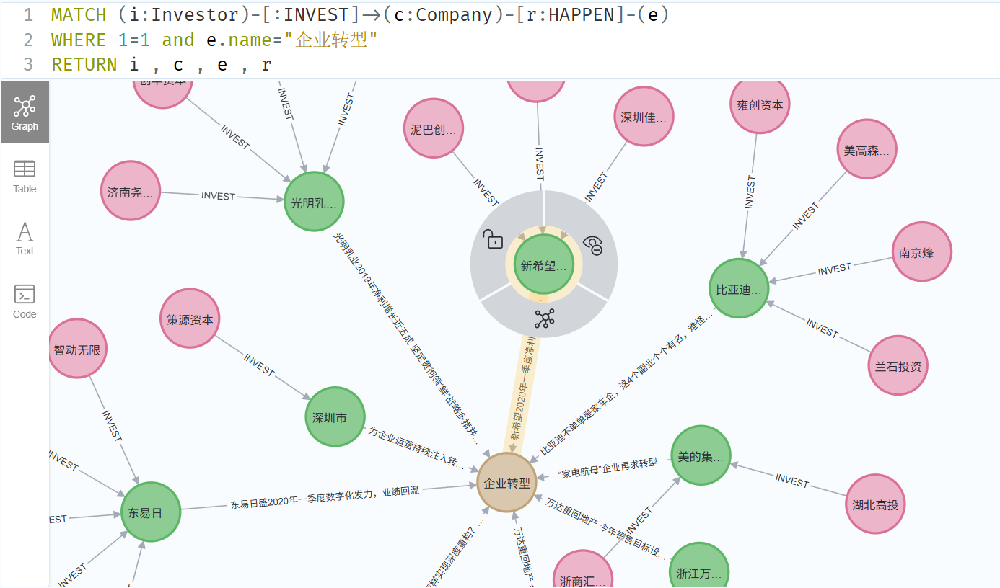

# 一、Graph+RAG

RAG到GraphRAG是目前 RAG 路线中非常重要的一次升级。

## 1. 基础概念

### 1.1 RAG

- 结构：`向量检索 + LLM生成`
- 核心流程：用户输入 → 相似文本检索（Chroma）→ 文本拼接输入 LLM → 生成回答
- 优势：接入简单、支持非结构化数据（如文档、网页）
- 局限：
  - 无法处理复杂的实体-关系推理
  - 检索粒度通常为 chunk，容易引入无关信息
  - 无法利用结构化知识（如知识图谱）

### 1.2 GraphRAG

基于图的检索增强生成

- 结构：`图数据库（Neo4j）+ 图检索 + LLM生成`
- 核心流程：用户输入 → 图查询（Cypher等）→ 精确提取相关实体、关系 → 文本拼接输入 LLM → 生成回答
- 优势：
  - 支持复杂关系推理（如路径推理）
  - 检索更精准（实体、属性、关系全结构化）
  - 支持多跳查询，能回答复杂问题（谁投资了谁，谁控股了谁，谁影响了谁）
- 局限：
  - 图构建成本高（需要数据清洗、实体对齐、关系抽取）
  - 不适合完全非结构化数据


## 2. 二者差异

| 对比项   | RAG                      | GraphRAG                   |
| -------- | ------------------------ | -------------------------- |
| 数据类型 | 非结构化文本             | 知识图谱（结构化）         |
| 检索方式 | 向量检索（语义检索）     | 图查询（如 Cypher）        |
| 推理能力 | 一般（主要依靠 LLM）     | 强（支持关系链路推理）     |
| 检索精度 | 粗粒度，容易引入冗余信息 | 精确（实体、关系精准检索） |
| 构建难度 | 低                       | 较高                       |
| 适用场景 | 通用知识问答、文档总结   | 企业知识图谱、复杂推理任务 |

## 3. 应用场景

- **用RAG：**
  - 文档问答
  - 法律、金融、医疗等大量文本检索任务
  - 快速原型搭建
- **用GraphRAG：**
  - 多跳关系查询：在xXx的同学的朋友中，谁在阿里巴巴工作？
  - 语义关联查询：哪些公司提供LLM产品，并且已经取得国家认证许可？
  - 知识推理查询：根据患者的症状和病史，推断可能的疾病并提供治疗方案
  - 涉及聚合统计查询：过去两年中大模型增加了多少，哪些公司占主导地位？
  - 时序关联查询：查询过去10年的xXx公司的投资与并购事

## 4. 未来趋势

- 从 RAG → GraphRAG 是未来的大趋势
- 多模态 GraphRAG（图 + 文本 + 图像）
- 图 + 向量联合检索（混合 RAG）


# 二、构建GraphRAG

下面是构建GraphRAG的主要步骤

## 1. 提取关键词

提取问题中的关键词信息，用户输入：

```txt
总结下哪些公司进行了企业转型
```

提取关键词：

```cypher
总结  公司  企业转型
```

### 1.1 prompt templete

````python
prompt_templete = ```
给定一些初始查询，提取最多{max_keywords}个相关关键词，考虑大小写、复数形式、常见表达等。
用'^'符号分隔所有同义词/关键词：'关键词1^关键词2^...'
注意，结果应为一行，用'^'符号分隔。
查询：{query_str}
关键词：
```
````


### 1.2 构建三元组

从文本中构建三元组：

````python
prompt_templete = ```
下面提供了一些文本。根据文本，提取最多{max_knowledge_triplets}个知识三元组,要求如下：
	1. 返回JSON格式，形式为[['主体', '谓词', '客体']]
    2. 避免使用停用词。
    3. 仅输出三元组，不要有多余解释和说明。
    4. 如果没有'客体'，就输出[['主体', '谓词', '']]

-----------------------------------------
示例：
文本：麦迪是姚明的队友。
三元组：[['麦迪'，'队友'，'姚明']]
文本：阿里巴巴是马云在1999年创立的公司
三元组：
[
    ['阿里巴巴'，'是'，'公司'],
	['阿里巴巴'，'创立于'，'1999年'],
	['马云', '创立', '阿里巴巴']
]
-----------------------------------------
文本：{text}
三元组：
```
````

参考代码：

```python

import os
from openai import 

from langchain_core.prompts import PromptTemplate
from py2neo import Graph, Node, Relationship

graph = Graph("bolt://localhost:7687", auth=("neo4j", "wh840921"), name="neo4j")
print("连接成功")

# 提示词模板
prompt = """
    你是一名知识图谱专家，请从以下文本中提取最多 {max_knowledge_triplets} 个知识三元组，输出格式为 JSON 数组，每个三元组格式如下：
    ["主语", "谓语", "宾语"]

    如果没有 "宾语"，请输出 ["主语", "谓语", ""]。

    输出要求：
    - 仅使用中文实体与中文关系。
    - 避免使用停用词（如“的”、“是”、“在”等）作为实体或关系。
    - 仅输出 JSON 数组，结果必须符合 JSON 格式，不要输出任何额外解释、标点或换行说明。

    示例：
    文本：麦迪是姚明的队友。
    输出：
    [["麦迪", "是", "姚明的队友"]]

    文本：阿里巴巴是马云在1999年创立的公司。
    输出：
    [
        ["阿里巴巴", "是", "公司"],
        ["阿里巴巴", "创立于", "马云"],
        ["阿里巴巴", "创立于", "1999年"]
    ]

    请处理下面的文本：
    {text}

    只输出 JSON 格式结果：
    """

prompt_template = PromptTemplate(
    input_variables=["text", "max_knowledge_triplets"],
    template=prompt,
)

#  大模型
api_key = os.getenv("DASHSCOPE_API_KEY")
base_url = "https://dashscope.aliyuncs.com/compatible-mode/v1"
base_model_name = "qwen-max-2025-01-25"

client = OpenAI(
    api_key=api_key,
    base_url=base_url,
)

```


## 2. 图检索

根据关键词信息检索图数据库：



```cypher
MATCH (i:Investor)-[:INVEST]->(c:Company)-[r:HAPPEN]-(e)
WHERE 1=1 and e.name="企业转型"
RETURN i.name as investor, c.name as company_name, e.name as even_type, r as relation
```

上下文检索参考代码：

```python

if __name__ == "__main__":

    def parse_query(query, max_knowledge_triplets=1):
        final_prompt = prompt_template.format(
            max_knowledge_triplets=max_knowledge_triplets, text=query
        )
        response = client.chat.completions.create(
            model=base_model_name,
            messages=[
                {
                    "role": "system",
                    "content": "你是一名neo4j的专家，擅长从一句话里面提取知识三元组",
                },
                {"role": "user", "content": final_prompt},
            ],
            stream=False,
        )

        keywords = response.choices[0].message.content
        return keywords.split("|")

    query = "格力电器有什么事情发生?"
    keywords = parse_query(query)
    print(keywords)

    query = "总结一下哪些公司进行了企业转型？"
    keywords = parse_query(query, 3)
    print(keywords)

    # 节点查询小函数
    def get_node(keyword, node_type):
        query = f"""
                    MATCH (n:{node_type})
                    where n.name CONTAINS "{keyword}"
                    RETURN n.name as name
                """
        results = graph.run(query)
        print(query)
        for record in results:
            return record["name"]
        return None

    # 测试
    print(get_node("格力电器", "Company"))

    # 通过节点来查询关联的关系和节点信息
    def gen_contexts(
        investor_condition,
        company_condition,
        even_type_condition,
        query_level=1,
        exclude_content=False,
    ):
        if query_level == 1:
            query = f"""
            MATCH (i:Investor)-[:INVEST]->(c:Company)-[r:HAPPEN]->(e)
            WHERE 1=1 {investor_condition} {company_condition} {even_type_condition}
            RETURN i.name as investor,  c.name as company_name, e.name as even_type, r as relation
            """
        else:
            query = f"""
            MATCH (c:Company)-[r:HAPPEN]->(e)
            WHERE 1=1 {company_condition} {even_type_condition}
            RETURN c.name as company_name, e.name as even_type, r as relation
            """
        print(query)
        results = graph.run(query)
        contexts = []
        for record in results:
            context = ""
            record = dict(record)
            if "investor" in record:
                context += f"{record['investor']} 投资了 {record['company_name']} \n"
            context = (
                context
                + f"{record['company_name']} 发生了 {record['even_type']} \n 详细如下："
            )
            for key, value in dict(record["relation"]).items():
                if exclude_content:
                    if key in ["title", "content"]:
                        continue
                context = context + f"\n  {key}: {value}"

            contexts.append(context)
        return contexts

    def get_even_detail(keyword, exclude_content=False):
        investor = get_node(keyword, "Investor")
        company = get_node(keyword, "Company")
        even_type = get_node(keyword, "EventType")
        

        investor_condition = ""
        company_condition = ""
        even_type_condition = ""

        if investor:
            investor_condition = f' and i.name = "{investor}"'
        if company:
            company_condition = f' and c.name = "{company}"'
        if even_type:
            even_type_condition = f' and e.name = "{even_type}"'

        print(
            f"investor={investor_condition} company={company_condition} even_type={even_type_condition}"
        )
        if investor_condition or company_condition or even_type_condition:
            contexts = gen_contexts(
                investor_condition,
                company_condition,
                even_type_condition,
                query_level=1,
                exclude_content=exclude_content,
            )
            if len(contexts) == 0:
                contexts = gen_contexts(
                    investor_condition,
                    company_condition,
                    even_type_condition,
                    query_level=2,
                    exclude_content=exclude_content,
                )
            return contexts
        else:
            return []

    print(get_even_detail("北京信达天下科技有限公司", exclude_content=True))
	print(get_even_detail("雅弘投资", exclude_content=True))

```


## 3. 信息拼接

拼接检索得到信息作为上下文，送到大语言模型来生成答案。

模板：

```python
finance_template = """
你是金融知识助手，熟悉各种金融事件，需要根据提供的上下文信息context来回答员工的提问。\
请直接回答问题，如果上下文信息context没有和问题相关的信息，请直接先回答不知道,要求用中文输出 \
问题：{question} 
上下文信息：
"{context}"
回答：
"""
```

上下信息构建：

```python
def graph_rag_pipline(query, exclude_content=True, stream=True, temperature=0.1):
    keywords = parse_query(query, max_knowledge_triplets=1)
    contexts = []
    ignore_words = ["公司", "分析", "投资"]
    for keyword in keywords:
        if keyword in ignore_words:
            continue
            contexts.extend(
                get_even_detail(keyword=keyword, exclude_content=exclude_content)
            )

            prompt = PromptTemplate(
                input_variables=["question", "context"],
                template=finance_template,
            )
            llm_prompt = prompt.format(
                question=query, context="\n========================\n".join(contexts)
            )
            print(llm_prompt)

            
query = "总结下哪些公司进行了企业转型？"
graph_rag_pipline(query, exclude_content=True)  
query = "中瑞深圳有没有投资什么公司？这些公司的状况怎么样"
graph_rag_pipline(query, exclude_content=True)
# 有了上下问，交给大模型即可......

```


