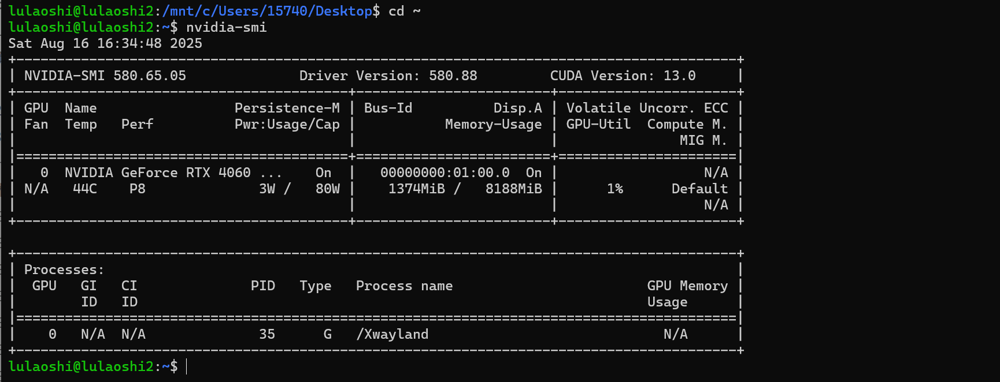

# 一、Docker

Docker是一个开源的容器化平台，允许开发者将应用及其所有依赖打包到一个轻量、可移植的容器中。通过容器，应用可以在不同环境中一致运行，避免“环境不一致”导致的问题。

## 1. 核心概念

- **镜像**
  镜像，Image，是一个只读的模板，包含应用运行所需代码、库、依赖、配置文件等。类似于虚拟机的“快照”，更轻量。
  
- **容器**
  容器，Container，是镜像的运行实例。容器在隔离的环境中运行应用，但共享宿主机的操作系统内核，启动速度快，占用资源少。
  
- **Docker引擎**
  Docker引擎，Docker Engine，是Docker的核心组件，负责镜像的管理、容器的创建和运行。
  
  

## 2. WSL2

安装并配置WSL2：https://learn.microsoft.com/zh-cn/windows/wsl/install

### 2.1 安装

- **确认Win版本**

  Windows10 2004及更高版本 或 Windows 11，才支持 WSL2。

- **安装WSL**

  搜索并以管理员权限打开$PowerShell$：

  

  执行：

  ```powershell
  # 默认装在C盘，别急下面有迁移教程，你先装
  wsl --update
  wsl --install
  ```
  
  这条命令会自动安装WSL和默认的Linux发行版（通常是Ubuntu），以及设置WSL2为默认版本。
  
  
  
  如果你之前已安装过wsl1，可以直接卸载掉：
  
  ```powershell
  wsl --uninstall
  ```
  
  

### 2.2 基本配置

- **设置密码**

  默认会自动新建一个用户：我的密码 `20250818`

  ```powershell
  Create a default Unix user account: root_2659
  ```

  以root用户进入

  ```powershell
  wsl --user root
  ```

  设置用户名和密码：==wh840921==

  ```powershell
  sudo passwd root
  ```

  设置其他用户的密码：==840921==

  ```powershell
  sudo passwd lulaoshi
  ```

    

- **确认WSL版本**：https://learn.microsoft.com/zh-cn/windows/wsl/install#check-which-version-of-wsl-you-are-running

  ```powershell
  wsl -l -v
  ```

  确保是版本2：

  ```cmd
  PS C:\WINDOWS\system32> wsl -l -v
    NAME      STATE           VERSION
  * Ubuntu    Stopped         2
  ```

  ==官方文档说==：然后重新启动计算机

**意外情况**

  |  |
  | :----------------------------------------------------------: |
  | 如果安装不成功的话，记得从BIOS里面启动虚拟化，默认是启动的，谁知道你咋回事呢 |


### 2.3 wsl迁移到D盘


```bash
wsl --update
wsl --install
```

首先确保这两行先执行，也就是先下到C盘中


```bash
# 先查看已安装的发行版名称
wsl --list --verbose

# 导出子系统的备份到D盘（假设发行版为Ubuntu）
wsl --export Ubuntu D:\WSL\ubuntu_backup.tar

# 注销装在C盘下的子系统
wsl --unregister Ubuntu  
```


```bash
# 在D盘创建目标文件夹
mkdir D:\WSL\Ubuntu

# 根据我们之前导出的备份创建子系统
wsl --import Ubuntu D:\WSL\Ubuntu D:\WSL\ubuntu_backup.tar --version 2
```


```bash
# 进入子系统
wsl -d Ubuntu

# 设置子系统启动时的默认用户（替换your_username为用户名）
echo -e "[user]\ndefault=your_username" | sudo tee -a /etc/wsl.conf
```


然后重启一下window powshell就可以了


但是输入wsl后进入的时候还是会显示C盘的路径，但是那个只是工作目录，实际上下载的各种包都会放在D盘的文件夹中，另外在所有操作完成后，可以在资源管理器中到D:\WSL\Ubuntu中去把那个压缩包删了，不然占空间，反正也不会用了


### 2.4 启动Ubuntu

==有些时候需要修改==默认启动发行版为Ubuntu：

```
wsl --setdefault Ubuntu
```

执行：

```powershell
wsl
```

界面：


感受：



清屏：

```powershell
clear
```

退出：

```powershell
exit
```


彻底释放wsl：

```bash
wsl --shutdown
```


### 2.5 宿主机挂载

`/mnt` 是 WSL2 提供的 **Windows 文件挂载点**，实现 Linux ↔ Windows 文件共享。这样就可以直接访问宿主机上的文件，包括模型、数据和脚本。对于大模型开发、调试和数据处理非常方便。

#### 2.5.1 基本概念

- WSL2（Windows Subsystem for Linux 2）是在 Windows 上运行的轻量级 Linux 虚拟机。

- 为了访问 Windows 文件系统，WSL2 将 Windows 磁盘挂载到 Linux 的 `/mnt` 目录下。

- 每个盘符对应一个子目录：

  ```
  /mnt/<盘符>
  ```

  例如：C 盘 → `/mnt/c`，D 盘 → `/mnt/d`。

#### 2.5.2 映射示例

| Windows 路径                      | WSL2 路径                             |
| --------------------------------- | ------------------------------------- |
| `C:\Users\15740\Desktop\file.txt` | `/mnt/c/Users/15740/Desktop/file.txt` |
| `D:\Projects\model`               | `/mnt/d/Projects/model`               |
| `C:\Program Files`                | `/mnt/c/Program Files`                |

#### 2.5.3 示例

假设在 Windows 下载了 Qwen 模型：

```
/mnt/c/Users/15740/Desktop/Qwen3-0.6B
```

WSL2 内运行 Python 或 vLLM 时，指向这个路径即可直接加载模型，无需再复制到 WSL2 内部。

#### 2.5.4 注意事项

WSL2 使用 Linux 风格 `/`，不能直接用 Windows 风格 `\`。


## 3. 安装Docker

基于WSL2安装 Docker Desktop 是目前Windows上运行Docker最推荐且高效的方案。

安装 Docker Desktop for Windows

- **下载 Docker Desktop**

  下载：https://docs.docker.com/desktop/setup/install/windows-install/

  

- **安装 Docker Desktop**

  运行安装程序，默认选项即可。

  

  关键点是：确保安装时选择 **“Use the WSL 2 based engine”**（使用基于WSL2的引擎）。

  

- **启动 Docker Desktop**

  安装完成后启动Docker Desktop，会自动检测WSL2环境并集成。

  
  
- **配置**

  - **磁盘镜像配置**

    - Docker Desktop在 Windows 上跑的时候，其实是用 **WSL2虚拟磁盘** 存储容器、镜像、卷等数据。

    - 这个文件会越来越大，因为所有镜像/容器都放里面，会达到几十个G

  

  

  - **`.wslconfig`配置**

    ==可选项==，配置文档：https://learn.microsoft.com/en-us/windows/wsl/wsl-config#configure-global-options-with-wslconfig
  
    文件路径：```C:\Users\<用户名>\.wslconfig```
  
    ```ini
    [wsl2]
    memory=12GB             # 分配12GB给WSL2，留4GB给Windows系统和其他程序
    processors=12           # 分配12核CPU给WSL2，避免系统卡顿
    swap=8GB                # 开启8GB交换空间，防止内存不足导致崩溃
    localhostForwarding=true
    ```
  
    超级管理员，PowerShell，执行：

    ```powershell
    wsl --shutdown
    ```

    重新打开你的 WSL 终端，配置生效。

  - **Docker Engine配置**
  
    这里还是配置下镜像加速器：国内用户常用
  
    ```ini
    {
      "registry-mirrors": [
        "https://hub-mirror.c.163.com",
        "https://mirror.ccs.tencentyun.com",
        "https://registry.docker-cn.com",
        "https://docker.mirrors.ustc.edu.cn"
      ],
      "builder": {
        "gc": {
          "defaultKeepStorage": "20GB",
          "enabled": true
        }
      },
      "experimental": false
    }
    ```
  
    

# 二、vLLM

vLLM 是一个高性能的多模型推理库，支持高效调度和流水线化执行，适合大规模大语言模型部署。通常会结合Transformers模型、CUDA环境进行加速。

## 1. 基础环境

更新软件包并安装 Python。

### 1.1 更新软件包

```bash
sudo apt update               # 更新软件包索引
sudo apt upgrade -y           # 升级已安装的软件包
```

### 1.2 更新Python

```bash
 sudo apt upgrade python3 python3-pip
```


### 1.3 验证安装

```bash
python3 --version
pip3 --version
```

如果你想使用 `python` 和 `pip` 命令来调用 Python3，可以设置别名：

```bash
echo "alias python=python3" >> ~/.bashrc
echo "alias pip=pip3" >> ~/.bashrc
source ~/.bashrc
```

这样以后在命令行输入 `python` 就是 Python3 了。

## 2. 显卡驱动

检查GPU支持：


注：下面是在powershell里面执行的检查方式

```powershell
docker pull nvidia/cuda:12.2.0-base-ubuntu20.04
docker run --gpus all nvidia/cuda:12.2.0-base-ubuntu20.04 nvidia-smi
```


## 3. 虚拟环境

和宿主机里面安装虚拟环境一样，这里我们也安装anaconda。

你完全可以安装完整的Anaconda，但是我们这里的目标只是部署大模型，所以安装Miniconda是最经济实惠的：

**下载：**

```dockerfile
wget https://repo.anaconda.com/miniconda/Miniconda3-latest-Linux-x86_64.sh
```


**运行安装脚本：**回车-----yes-----回车-----yes

```dockerfile
bash Miniconda3-latest-Linux-x86_64.sh
```


**让修改生效：**

```dockerfile
source ~/.bashrc
```

剩下的和以前操作一样~

## 4. 大模型部署-VLLM

这里使用Qwen的模型作为展示案例。


官方： https://docs.vllm.ai/en/latest/index.html

vLLM（**virtual LLM**）是由 UC Berkeley 和一些工业界开发者提出的一个 **高性能、大模型推理引擎**，旨在提高大语言模型（LLM）在**推理服务部署**过程中的吞吐、延迟和内存效率。


### 4.1 vLLM初始

vLLM 是一个用于部署大语言模型（如 DeepSeek、Qwen）进行推理服务的高性能引擎，支持高吞吐、多请求、低延迟、KV 缓存高效复用等关键优化。

它是 Hugging Face Transformers 的 drop-in 替代品，支持 OpenAI API 接口，兼容多种模型格式，适合做聊天机器人、API 服务等。


### 4.2 核心优势

| 优势                  | 描述                                                         |
| --------------------- | ------------------------------------------------------------ |
| **PagedAttention**    | 用于优化 KV cache 的内存管理，使多个请求共享同一模型时不浪费显存（是 vLLM 的核心） |
| **高吞吐**            | 比 Hugging Face Transformers 快 24 倍                        |
| **OpenAI API 兼容**   | 可以直接使用 `openai.ChatCompletion.create()` 方式调用       |
| **多模型支持**        | 支持 LLaMA, Qwen 等                                          |
| **高并发多请求调度**  | 类似调度器一样批处理多个用户请求，减少显卡空闲时间           |
| **可部署为 API 服务** | 用 Flask/FastAPI 或 CLI 模式部署                             |


### 4.3  PagedAttention

传统 Transformer 在推理时会将历史的 Key/Value 缓存在 GPU 上的 KV Cache 中。但多个请求可能生成不同长度的序列，很容易导致 **显存碎片化（fragmentation）**，从而浪费大量显存。

vLLM 提出的 **PagedAttention** 机制解决了这个问题：

- 将 KV cache 拆成“页”（类似操作系统分页）
- 用页表（page table）管理不同请求的缓存
- 实现内存复用和压缩管理，大幅提升多并发效率

📌 类比：就像虚拟内存管理一样，PagedAttention 就是“大模型推理的虚拟内存系统”。


### 4.4 安装并启动

安装 vLLM（支持 CUDA GPU），Linux系统：

```bash
pip install vllm -i 一个镜像地址要快一些
```


下载的包很多，请多点耐心，虽然我已经失去了耐心：


加载模型并启动 API 服务：最好提前下载好模型

```python
huggingface-cli download --resume-download Qwen/Qwen3-0.6B --local-dir F:/huggingface --local-dir-use-symlinks False
```

使用本地下载好的模型启动：

```powershell
# --max-gpu-memory：最大GPU使用，不设置大概率会报错
python3 -m vllm.entrypoints.openai.api_server \
    --model /mnt/d/workspace/LLM/models/models--unsloth--gemma-3-270m-it/snapshots/23cf460f6bb16954176b3ddcc8d4f250501458a9  \
    --host 0.0.0.0 \
    --port 8080 \
    --gpu-memory-utilization 0.8 \
    --max-model-len 1024 \
    --quantization int8	

```

如果GUP显存不够，必然是下面三个因素导致的：

- **模型权重内存**

- **非 PyTorch 内存**
- **PyTorch 激活峰值内存**

```powershell
--dtype	int8	# 模型参数的存储精度，影响模型权重内存
--max-num-seqs	1	# 限制单次批处理中最多能包含的序列数量，显著影响 PyTorch 激活峰值内存
```

启动效果：


**说明：**

- `--gpu-memory-utilization 0.6`

  限制 vLLM 使用 **60% GPU 显存**

- `--max-model-len 32000` 

  表示把最大序列长度从 40960 降到 32000，KV cache 占用显存会减少，不然显存不够用

- `--quantization int8`

  对模型进行 **8-bit 量化**，大幅减少显存占用

- `--host 0.0.0.0`

  允许 Windows 或局域网其他机器访问 API

- `--port 8000`

  自定义 API 端口，可根据需要修改

- `/mnt/f/huggingface/Qwen3-0.6B`

  映射 Windows F 盘下载好的模型，无需重复下载


或者自动下载：从国外下载还是比较慢的

```bash
# 不设置大概率报GPU不够用的错：设置 GPU 显存占用比例为 80%
export VLLM_GPU_MEM_FRACTION=0.8
# 启动 vLLM OpenAI API 服务
python3 -m vllm.entrypoints.openai.api_server --model Qwen/Qwen3-0.6B
```


### 4.5 API整理

首先查看WSL真实IP地址：

```cmd
wsl hostname -I
```

可以访问的地址：

```ceylon
http://172.19.246.30:8000/
http://localhost:8000/
http://127.0.0.1:8000/
```

常用API访问地址：


#### 4.5.1 文档和健康检查类

| 路由                    | 方法      | 作用                                                    |
| ----------------------- | --------- | ------------------------------------------------------- |
| `/openapi.json`         | GET, HEAD | 返回 OpenAPI 规范 JSON，可用于生成客户端 SDK 或接口文档 |
| `/docs`                 | GET, HEAD | 自动生成的 Swagger UI 文档页面                          |
| `/docs/oauth2-redirect` | GET, HEAD | OAuth2 回调 URL（通常无需修改）                         |
| `/redoc`                | GET, HEAD | ReDoc 风格文档页面                                      |
| `/health`               | GET       | 健康检查，用于确认服务是否启动正常                      |

------

#### 4.5.2 模型加载与状态检查

| 路由         | 方法      | 作用                                     |
| ------------ | --------- | ---------------------------------------- |
| `/load`      | GET       | 手动加载指定模型（如果支持动态加载）     |
| `/ping`      | GET, POST | 简单请求测试接口是否响应，可用于心跳检测 |
| `/v1/models` | GET       | 列出当前可用的模型列表                   |
| `/version`   | GET       | 返回 vLLM API 的版本信息                 |

------

#### 4.5.3 核心推理接口

OpenAI API 兼容

| 路由                                 | 方法 | 作用                            |
| ------------------------------------ | ---- | ------------------------------- |
| `/v1/responses`                      | POST | 生成通用响应（OpenAI 兼容接口） |
| `/v1/responses/{response_id}`        | GET  | 查询指定响应的状态/内容         |
| `/v1/responses/{response_id}/cancel` | POST | 取消指定响应任务                |
| `/v1/chat/completions`               | POST | Chat 生成接口（最常用）         |
| `/v1/completions`                    | POST | 文本生成接口（OpenAI 兼容）     |
| `/v1/embeddings`                     | POST | 获取文本向量表示（embedding）   |

------

#### 4.5.4 辅助与工具接口

| 路由          | 方法 | 作用                      |
| ------------- | ---- | ------------------------- |
| `/tokenize`   | POST | 将文本转为 token 序列     |
| `/detokenize` | POST | 将 token 序列还原为文本   |
| `/pooling`    | POST | 对模型输出做向量池化      |
| `/classify`   | POST | 文本分类接口              |
| `/score`      | POST | 文本评分接口              |
| `/v1/score`   | POST | OpenAI 兼容的文本评分接口 |

------

#### 4.5.5 音频接口

| 路由                       | 方法 | 作用                          |
| -------------------------- | ---- | ----------------------------- |
| `/v1/audio/transcriptions` | POST | 音频转写（语音→文本）         |
| `/v1/audio/translations`   | POST | 音频翻译（语音→目标语言文本） |

------

#### 4.5.6 高级/实验接口

| 路由                                  | 方法 | 作用                                          |
| ------------------------------------- | ---- | --------------------------------------------- |
| `/rerank`, `/v1/rerank`, `/v2/rerank` | POST | 对候选文本进行重排序（文本排序任务）          |
| `/scale_elastic_ep`                   | POST | 弹性伸缩相关接口（集群/分布式推理）           |
| `/is_scaling_elastic_ep`              | POST | 查询弹性伸缩状态                              |
| `/invocations`                        | POST | 通用任务调用接口（内部/实验用途）             |
| `/metrics`                            | GET  | 返回服务运行指标，可用于监控（Prometheus 等） |


#### 4.5.7 常用

- `/v1/chat/completions` → 聊天生成
- `/v1/completions` → 文本生成
- `/v1/embeddings` → 文本向量


### 4.6 API调用

模型部署肯定是要拿来用的，对吧~

#### 4.6.1 基于Postman


#### 4.6.2 Python代码集成

调用方式（OpenAI 风格）：通过局域网IP访问

```python
from openai import OpenAI

client = OpenAI(base_url="http://172.19.246.30:8000/v1", api_key="EMPTY")

response = client.chat.completions.create(
    model="/mnt/f/huggingface/Qwen3-0.6B",
    messages=[
        {"role": "system", "content": "You are a helpful assistant."},
    	{"role": "user", "content": "你好，请简单介绍一下人工智能。"}
    ]
)
print(response.choices[0].message.content)
```


### 4.7 性能对比

在同样显存和模型条件下：

| 系统                        | 吞吐量（tokens/s） | 延迟（平均）   |
| --------------------------- | ------------------ | -------------- |
| HF Transformers + DeepSpeed | 1500               | 200ms          |
| **vLLM**                    | **3000～4000**     | **100ms 以下** |


### 4.8 系统比较

| 项目                      | 优势                                                | 劣势                     |
| ------------------------- | --------------------------------------------------- | ------------------------ |
| **vLLM**                  | 高吞吐、低延迟、轻量部署、支持流式、兼容 OpenAI API | 不支持训练，仅推理       |
| Hugging Face Transformers | 社区丰富、训练+推理通用                             | 单请求优化差，多并发低效 |
| TensorRT-LLM              | 超高性能，适合生产                                  | 配置复杂，门槛高         |


## 5. Docker部署

**运行环境**：Docker Desktop 的 Linux 内核其实就是基于 WSL2（通常是 `docker-desktop` 的虚拟子系统）。

**特点**：

- 运行在 Docker 容器里，和你 WSL2 的 Ubuntu 子系统完全隔离（互不影响）。
- 容器里的 Python/依赖不会影响你 WSL 里的环境。
- 文件路径需要通过 **挂载卷** 映射

### 5.1 环境确认

- 打开 `Docker Desktop` → Settings → **General**
  - 勾选 **Use the WSL 2 based engine**
  - 关闭 Hyper-V 方式
- 打开 **Settings → Resources → File Sharing**
  - 添加 `F:\huggingface`（以后容器才能访问到你下载的模型目录）
- 打开 **Settings → Resources → Advanced**
  - 修改`Disk image location`下的地址（这是软件的文件保存地址）


### 5.2 拉取并运行

==标准模式==：需要临时下载模型

```powershell
docker run --gpus all -p 8000:8000 vllm/vllm-openai --model Qwen/Qwen3-0.6B
docker run --gpus all -p 8000:8000 vllm/vllm-openai --model Qwen/Qwen3-0.6B --gpu-memory-utilization 0.8
```
==高效模式==：提前下载好模型

```dockerfile
docker run -it --gpus all `
  -p 8000:8000 `
  -v D:\workspace\大模型\models\Qwen\:/data/models `
  vllm/vllm-openai `
  --model /data/models/Qwen3-0.6B `
  --max-model-len 6000 `
  --gpu-memory-utilization 0.8 `
```

效果如下：

|  |  |
| :----------------------------------------------------------: | :----------------------------------------------------------: |
|                      下载环境所有依赖包                      |                     FastAPI服务启动成功                      |

==重启模式==：使用原始参数启动

- 停止的容器 **不能修改参数**，只能 `docker start <容器ID>` 原样启动。
- 想改参数，只能用镜像 `docker run` 新建。

#### 5.2.1 参数解释

-  **`-it`** ：启动一个交互式容器，进入里面像开了个终端一样操作

  - **`-i`**  = interactive
     保持容器的标准输入（stdin）处于打开状态，这样你可以和容器里的程序进行交互。

  - **`-t`**  = tty
     分配一个伪终端（pseudo-TTY），让你在容器里像在命令行上一样运行交互式程序。
  - 如果跑一个后台服务，一般不加 `-it`，而是用 `-d`：detach，后台运行

- `--gpus all` ：启用宿主机 GPU

- `-p 8000:8000` ：把容器的 8000 端口映射到宿主机

- `-v F:\huggingface:/data/huggingface` ：把`F:\huggingface` 映射到容器 `/data/huggingface`

- `--model /data/huggingface/Qwen3-0.6B` ：告诉 Qwen 使用你本地挂载的模型目录

- `registry.modelscope.cn/qwen/qwen-inference:latest`：

  - **registry.modelscope.cn**
    - 镜像仓库地址，ModelScope的官方镜像仓库。
  - **qwen/qwen-inference**
     - 镜像名字，里面打包好了运行Qwen 模型推理需要的环境和代码。
        （比如 Python 环境、依赖库、API 启动脚本等等）。

  
  - **:latest**
    - 镜像的 **标签**，表示取“最新版本”。可以换成特定的版本号，比如 `:v1.1.0`。
  
  | 镜像                  | 特点                                                         |
  | --------------------- | ------------------------------------------------------------ |
  | `qwen/qwen-inference` | 官方 Qwen 镜像，可能自带一些优化、推理脚本，适配 Qwen 模型   |
  | `vllm/vllm-openai`    | 通用 vLLM 镜像，支持 OpenAI API 风格接口，可以挂载任何 HuggingFace 模型 |

#### 5.2.2 更多参数

```cmake
docker run -it --gpus all \
  -p 8000:8000 \
  -v F:/huggingface:/data/huggingface \
  vllm/vllm-openai \
  --model /data/huggingface/Qwen3-0.6B \
  --max-model-len 36000 \
  --gpu-memory-utilization 0.8 \
  --quantize nf4 \
  --dtype bfloat16 \
  --host 0.0.0.0 \
  --port 8000
```

- `--model <模型路径>`
   指定模型目录或 HuggingFace 仓库名，例如 `/models/Qwen3-0.6B`。

- `--gpu-memory-utilization <float>`
   设置启动时占用 GPU 内存比例，0~1 之间。
- `--device <cuda/cpu>`
   指定运行设备。

- `--max-model-len <int>`
   模型输入最大长度（token 数），例如 40960。
- `--dtype <float16/bfloat16/float32>`
   模型计算精度，影响显存占用和速度。

- `--host <ip>`
   指定监听地址，默认 `0.0.0.0`。
- `--port <port>`
   服务端口，默认 8000。
- `--quantize <mode>`
   启用量化并指定模式，常见模式有：
  - `int8` → 8-bit 整数量化，显存占用大幅降低，性能稍快，精度略降
  - `int4` → 4-bit 整数量化，更节省显存，但精度可能下降
  - `nf4` / `nf4*` → vLLM 对 LLM 模型常用的非对称 4-bit 量化，兼顾精度和显存


### 5.3 测试

用Postman和Python分别测试下~

#### 5.3.1 Postman


#### 5.3.2 Python集成

```python
from openai import OpenAI

client = OpenAI(
    base_url="http://127.0.0.1:8000/v1",
    api_key=""  # 默认不需要 key
)

response = client.chat.completions.create(
    model="/data/huggingface/Qwen3-0.6B",
    messages=[
        {"role": "system", "content": "You are a helpful assistant."},
    	{"role": "user", "content": "你好，请简单介绍一下华清远见成都中心。"}
    ]
)
print(response.choices[0].message.content)
```


### 5.4 访问地址

支持局域网IP，localhost不行：

```cmake
#postman
http://192.168.1.14:8000/v1/chat/completions
http://127.0.0.1:8000/v1/chat/completions
http://172.19.246.30:8000/v1/chat/completions

#python代码
http://127.0.0.1:8000/v1  		#局域网IP
http://192.168.1.14:8000/v1 	#宿主机IP
http://172.19.246.30:8000/v1	#WSL的IP  wsl hostname -I
```

### 5.5 更多操作

查看容器列表：

```bash
docker ps -a
```

停止容器：

```bash
docker stop 018a0895fd12
```

启动停止的容器：

```bash
docker start 018a0895fd12
```

==这些操作都可以在docker-desktop里面操作==


## 6. Docker好处

Docker更容易部署~

### 6.1 核心优势

| 优势                      | 解释                                                         | 对比 WSL/Ubuntu                                              |
| ------------------------- | ------------------------------------------------------------ | ------------------------------------------------------------ |
| **环境一致性**            | Docker 镜像里包含 OS + Python + 依赖 + 模型环境 → “一键跑起来，谁用谁一样”。 | 直接用 WSL 或 Ubuntu，环境可能因 Python 版本、库版本不同而出现兼容问题。 |
| **隔离性**                | 每个容器是独立的沙箱，互不干扰。可以同时跑多个不同版本的模型或服务。 | WSL/Ubuntu 下如果直接装多个环境，容易出现冲突（库版本、CUDA、Python 等）。 |
| **轻量化部署**            | 容器启动快，不需要完整虚拟机。相比直接在 Ubuntu 装虚拟机更省资源。 | WSL2 本身是轻量 VM，但如果你装多个不同环境，每次都需要配置依赖。 |
| **可移植性**              | 同一个 Docker 镜像可以在 Windows、Linux、Mac 甚至云端直接运行。 | WSL/Ubuntu 环境不一定能直接迁移到别的系统，迁移成本高。      |
| **版本控制 & 回滚**       | Docker 镜像可以打 tag，例如 vLLM:0.10.0 → 回滚简单。         | WSL/Ubuntu 手动安装软件，很难精确回滚到某个环境版本。        |
| **安全隔离**              | 容器进程相对隔离，可以控制访问宿主机资源。                   | 直接在 Ubuntu/WSL 下运行，进程更容易直接访问宿主机资源。     |
| **便于 CI/CD / 生产部署** | Docker 是 DevOps 标准工具，能直接在生产、云端跑服务。        | 直接 WSL/Ubuntu 更适合本地开发，不利于自动化部署。           |

------

### 6.2 部署LLM好处

- **模型环境隔离**：挂载的 `/models/Qwen3-0.6B` 在容器里，和系统环境完全隔离，不怕破坏 Windows 系统 Python 或 CUDA。
- **方便迁移**：以后换模型或换电脑，只要 Docker 镜像和挂载路径一样，环境直接复现。
- **端口映射方便**：容器里服务绑定 `0.0.0.0:8000`，宿主机直接访问，无需额外网络配置。
- **资源管理**：可以通过 `--gpus`、`--memory` 精确控制容器资源，避免影响其他任务。


### 6.3 WSL/Ubuntu使用场景

- **适合本地调试**：开发算法、写代码、跑小模型实验
- **安装方便**：直接 `apt install` 或 `pip install`
- **灵活性高**：想改什么库就改，适合学习和原型验证

### 6.4 对比

- **Docker = 可移植、安全、隔离、可控** → 适合部署和多环境管理
- **WSL/Ubuntu = 灵活、直接、适合实验** → 适合本地开发和调试


## 7. 打包和部署

快速开发 → 验证 OK → 打包 Docker 镜像 → 部署到服务器/云端

### 7.1 镜像打包

现在已经用 Docker 启动了 vLLM 服务：

可以通过以下步骤打包镜像：

#### 7.1.1 查找容器 ID

```bash
docker ps -a
```


#### 7.1.2 提交容器为镜像

```bash
docker commit 018a0895fd12 my-lulaoshi-vllm:latest
```

镜像查看：


- `my-lulaoshi-vllm:latest` 是你打包后的镜像名称和 tag。
- 这会把容器内部修改（如安装的依赖）保存为镜像。
- 无法直接在文件夹里看到镜像文件。


#### 7.1.3 保存为tar

```bash
docker save -o my-lulaoshi-vllm.tar my-lulaoshi-vllm:latest
```

- 生成 `my-lulaoshi-vllm.tar` 文件，可以拷贝到其他机器。

  

- 对方机器用：

  ```bash
  docker load -i my-lulaoshi-vllm
  ```
  就能直接使用镜像。


#### 7.1.4 模型挂载处理

- 当前用 `-v F:/huggingface:/models` 映射模型。
- 镜像里面只有**容器内已安装的软件和依赖**，**不会自动带走宿主机 F:/huggingface 的模型文件**。
- 优点：镜像小、便于分发
- 缺点：目标机器需要**重新挂载宿主机的模型路径**，或者把模型拷贝到容器内


##### 7.1.4.1 把模型打包到镜像

- **复制模型到容器内再打包**

  - 先创建目录

    ```bash
    docker exec -it 018a0895fd12 mkdir -p /models
    ```

  - 再移植模型文件

    ```bash
    docker cp F:/huggingface/Qwen3-0.6B 018a0895fd12:/models/Qwen3-0.6B
    ```

  

- 打包后的镜像就包含模型

  ```bash
  docker commit 018a0895fd12 lulaoshi-vllm-with-model:latest
  ```

  

- 镜像会变大，再保存为tar文件

  ```bash
  docker save -o my-lulaoshi-vllm-with-model.tar lulaoshi-vllm-with-model:latest
  ```

  

##### 7.1.4.2 不打包到镜像

也可以不用打包模型到镜像，后面通过挂载或者模型拷贝的方式指定模型即可，请参考后续镜像分发和部署。


### 7.2 镜像分发和部署

把打包好的镜像 `.tar` 拷贝到另一台机器，然后直接启动 vLLM 服务。

#### 7.2.1 加载镜像

拷贝了 `my-lulaoshi-vllm.tar` 到新机器某个目录，例如 `D:\docker_images\`：

```powershell
docker load -i D:\docker_images\my-lulaoshi-vllm.tar
```

这会把镜像导入 Docker，本地镜像列表里就会出现：

```powershell
docker images
```

你应该能看到：

```
REPOSITORY             TAG       IMAGE ID
my-lulaoshi-vllm       latest    de5a3418de87
```


#### 7.2.2 运行镜像

如果已经把模型打包在镜像里就不用挂载，否则仍然要指定模型：挂载模型 或者 拷贝模型到容器。

- **镜像里已经有模型**

  ```bash
  docker run -it --gpus all -p 8000:8000 my-lulaoshi-vllm-with-model:latest
  ```

  - 容器启动后，vLLM API 就监听在宿主机的 8000 端口

  - 容器内模型路径 `/models/Qwen3-0.6B` 已经存在

- **镜像不带模型，依然挂载宿主机或者拷贝模型到容器**

  假设新机器模型在 `E:\huggingface`：

  ```bash
  docker run -it --gpus all -p 8000:8000 -v E:/huggingface:/models my-lulaoshi-vllm:latest --model /models/Qwen3-0.6B
  ```

  - `-v E:/huggingface:/models` 把宿主机模型映射到容器

  - `--model /models/Qwen3-0.6B` 指定模型路径


#### 7.2.3 访问 API

- 通过 Postman 或 Python 测试：

```python
import requests

url = "http://<宿主机IP>:8000/v1/chat/completions"
data = {
    "model": "/models/Qwen3-0.6B",
    "messages": [
        {"role": "system", "content": "You are a helpful assistant."},
        {"role": "user", "content": "你好，请简单介绍一下华清远见成都中心。"}
    ]
}

r = requests.post(url, json=data)
print(r.json())
```

- 如果容器内模型已经打包在镜像里，可以直接用 `/models/Qwen3-0.6B`
- 如果用挂载的方式，需要确保宿主机路径和容器内路径一致


💡 **总结**：

1. `docker load` → 导入镜像
2. `docker run` → 启动容器
3. `-v` → 可选挂载宿主机模型
4. `-p` → 端口映射
5. 镜像里有模型就不用挂载，否则必须挂载

