# pytorch安装

建议（非常强烈的那种）用Anaconda创建一个**新的**虚拟环境，用于运行安装你的PyTorch

```python
conda create -n universal python=3.9
```

## 1. 基础认知

cuDNN（CUDA Deep Neural Network library）是 NVIDIA 开发的用于深度学习的 GPU 加速库。它专门针对深度神经网络中的常见操作（如卷积、池化、归一化等）进行了高度优化，能够显著提高深度学习模型的训练和推理速度。

cuDNN和 CUDA（Compute Unified Device Architecture）密切相关，它们共同构成了高性能 GPU计算的基础，尤其在深度学习领域。

### 1.1 CUDA

CUDA（Compute Unified Device Architecture），统一计算设备架构，是由 NVIDIA 提供的并行计算平台和编程模型。它允许开发者利用 NVIDIA GPU 的强大计算能力进行通用计算，包括‌科学计算、‌机器学习、‌图像处理和‌视频处理等。CUDA提供了GPU并行计算的底层基础，使GPU能够解决复杂的计算问题。

### 1.2 cuDNN

cuDNN是基于CUDA的深度神经网络加速库，提供了针对深度学习常见操作（如卷积、池化、归一化、激活函数等）的高度优化实现。

- **性能优化**：cuDNN 为卷积神经网络等深度学习模型的训练和推理提供了极高的性能优化。它利用 CUDA 在 GPU 上进行加速计算，充分发挥了 GPU 的并行计算能力。
- **易用性**：cuDNN 被集成在主流的深度学习框架（如 TensorFlow、PyTorch、MXNet 等）中，用户直接通过框架调用 cuDNN 的功能，无需关心底层实现细节。

### 1.3 依赖与协同

- 依赖：cuDNN是建立在CUDA之上的库，它依赖于 CUDA 提供的基础计算能力。因此，使用 cuDNN 必须先安装 CUDA。

- 协同：在深度学习框架中，CUDA 提供了底层的 GPU 计算能力，而 cuDNN 通过调用 CUDA 来优化和加速深度学习操作。这种协同工作大幅提升了深度学习模型的训练和推理速度。

### 1.4 版本兼容

**使用 cuDNN 时需要确保它与 CUDA 版本的兼容性。**

## 2. GPU驱动

如果有独立显卡，在安装PyTorch时一定要装CUDA，那如何选择CUDA版本呢？

(在安装 PyTorch 时，如果你选择了带 CUDA 支持的安装包（而非仅 CPU 版本），PyTorch 会**自动捆绑所需的 CUDA 相关库**，无需你手动单独下载和安装完整的 NVIDIA CUDA Toolkit)

### 2.1 驱动更新

打开GEFORCE


进行驱动更新(驱动版本越高，支持的cuda版本越高)


安装成功：


### 2.2 版本检查

在cmd里面，输入**nvidia-smi**查看GPU驱动程序版本：

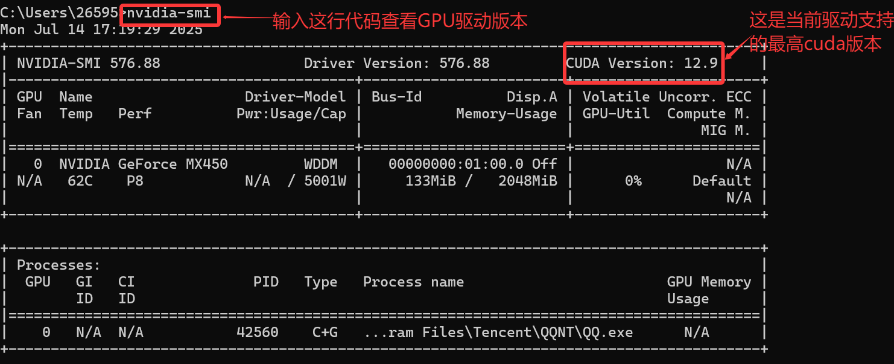

## 3. 开始安装

根据上面我们的执行结果选择适合自己电脑的cuda版本安装

### 3.1 安装CUDA

官网地址：https://developer.nvidia.com/cuda-toolkit-archive

进入官网后，选择合适的安装版本

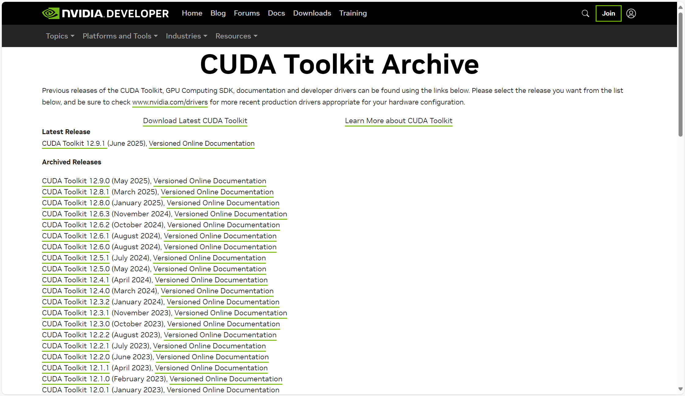


(这里选择的是12.4.1版本)

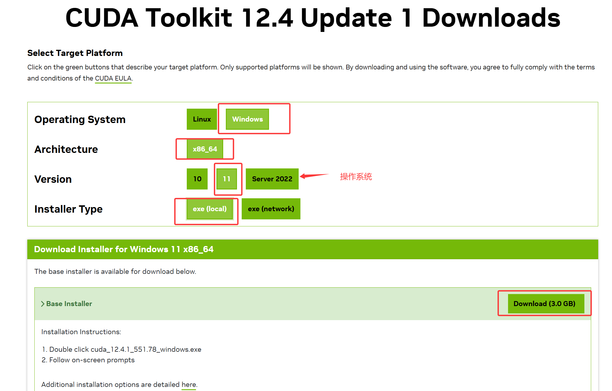)

点击下载完成

**安装：**

1. 双击下载的 `cuda_11.8.0_522.06_windows.exe`
2. 选择安装选项：
   - **安装类型** → 选择 `自定义（高级）`
   - **组件** → 确保勾选：
     - `CUDA` → `Development` + `Runtime`
     - `Driver components`（如果未安装最新NVIDIA驱动）
   - 取消勾选 `Visual Studio Integration`（除非需要VS支持）
3. 完成安装后，验证环境变量是否自动添加：
   - 检查 `PATH` 是否包含：
     `C:\Program Files\NVIDIA GPU Computing Toolkit\CUDA\v12.4\bin`

**测试**

cmd打开命令界面，输入：

```
nvcc -V
```

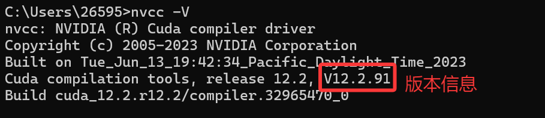'

### 3.2 安装cuDNN

官网地址：<https://developer.nvidia.com/cudnn>，需要先注册账号(使用邮箱注册即可)


进入官网

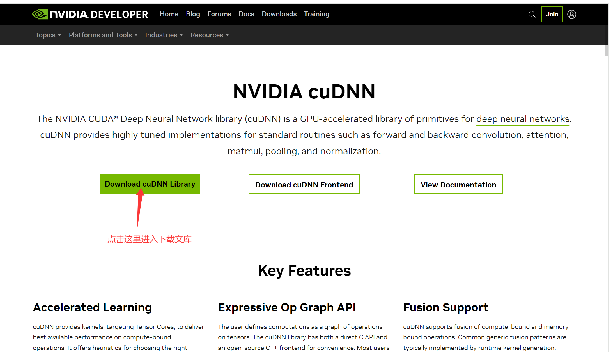


进入下载文库

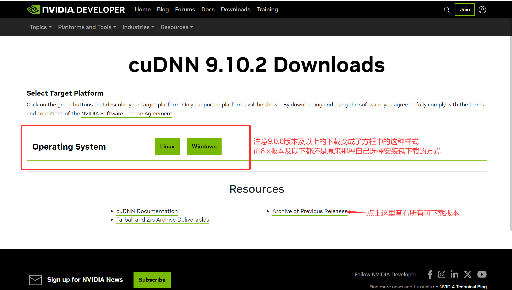


这里安装的是8.9.7版本

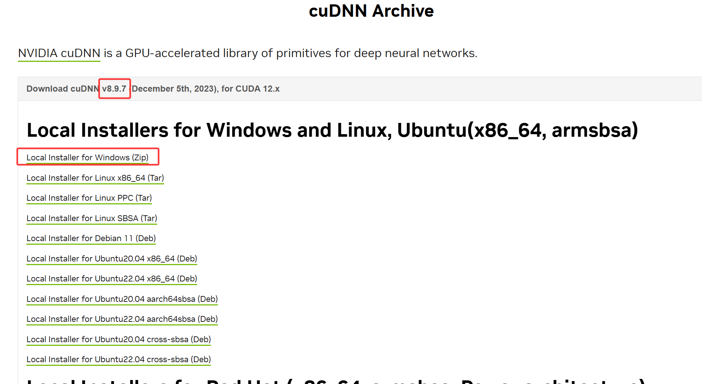

下载好之后，解压：


复制这三个文件，替换 cuda 安装文件夹下(默认地址：C:\Program Files\NVIDIA GPU Computing Toolkit\CUDA\v12.4)的对应三个文件：

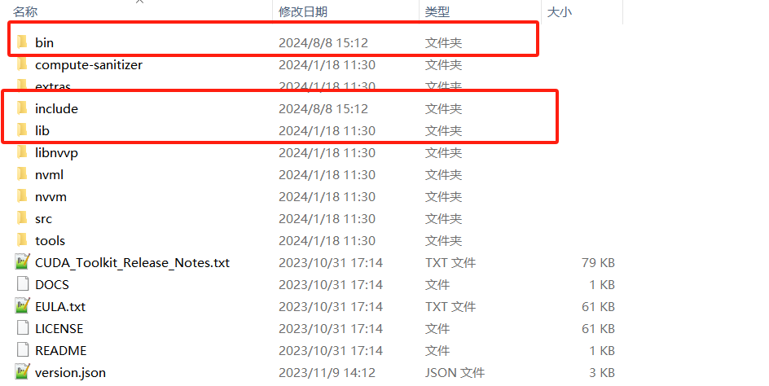

添加path环境变量：

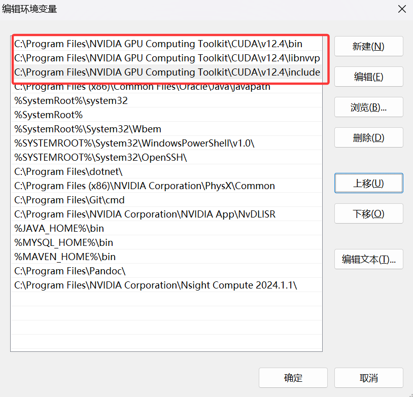

验证安装成功：

在 cuda 安装路径下，进入 extras/demo_suite，然后进入 dos 窗口，分别执行以下命令：

- deviceQuery.exe

  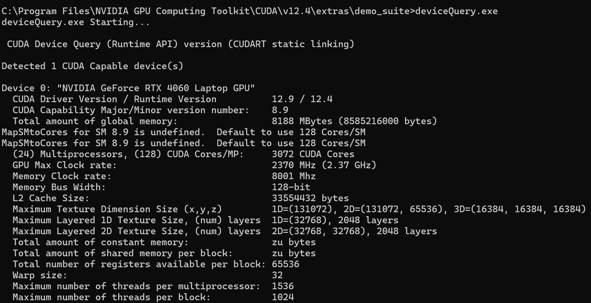

- bandwidthTest.exe

  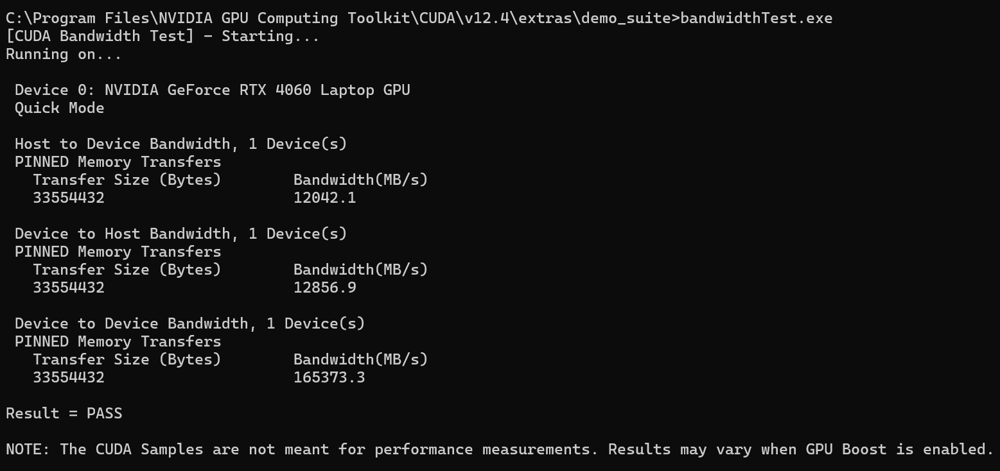

### 3.3 安装PyTorch

在官方文档里面找到适合你设备的PyTorch版本及对应的安装指令执行即可：https://pytorch.org/get-started/previous-versions/

**要保证你选择的CUDA版本号<=你的GPU驱动程序版本**

文档中的版本号仅供参考，以实际电脑环境为准

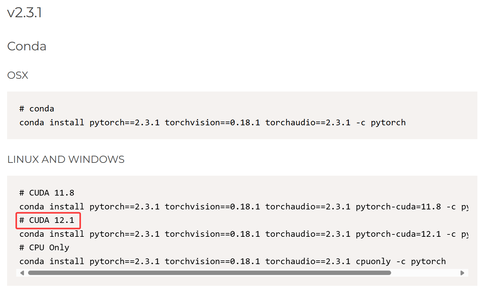

**离线安装：（以torch-2.3.1+cu121-cp310-cp310-win_amd64.whl这个包为例）**

浏览器打开链接：https://download.pytorch.org/whl/cu121

找到torch，点击进入下载页面，找到适合自己cuda版本的安装包，下载即可（使用迅雷下载比较快）

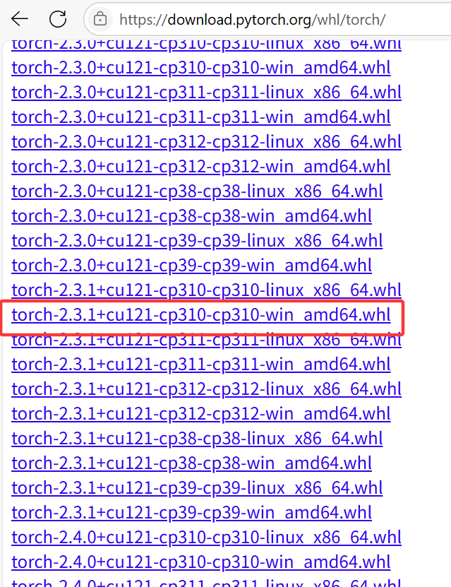

下载完成后，在Anaconda prompt界面切换到自己的虚拟环境，并将目录切换到torch安装包所在的文件夹，输入命令：

```
pip install torch-2.3.1+cu121-cp310-cp310-win_amd64.whl
```

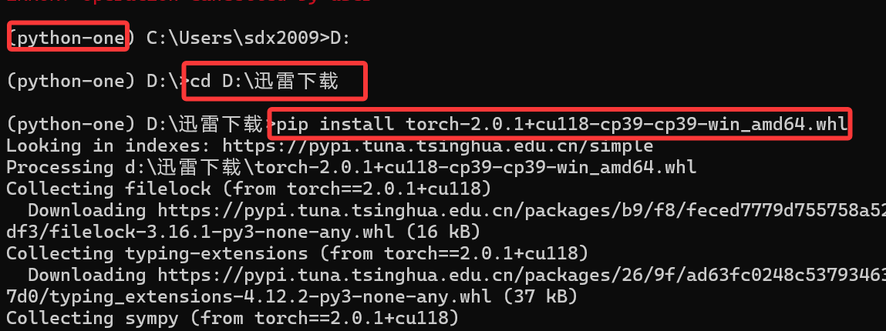

测试：

安装完成后，在pycharm中输入代码：

```python
import torch

print(torch.cuda.is_available())
print(torch.__version__)
```

然后再安装torchvision==0.15.2和torchaudio==2.0.2，版本号需要和线上安装的版本号一致

（这两个包也可以用离线安装的方式安装）

```
pip install torchvision==0.18.1 torchaudio==2.3.1 --index-url https://download.pytorch.org/whl/cu121
```

## 4. CPU版本安装

在任务管理器中查看GPU是否为NVIDIA ：

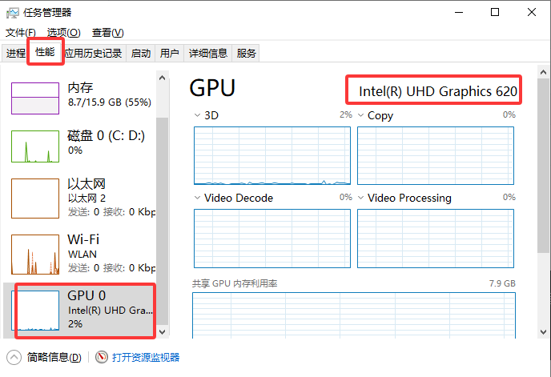

如果驱动不是NVIDIA ，说明没有CUDA，建议安装CPU版本

或者

在cmd里面，输入**nvidia-smi**查看GPU驱动程序版本：

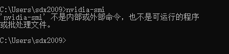

如果显示以上信息，说明没有安装NVIDIA 驱动，建议安装CPU版本

**pytorch安装**

在官方文档里面找到适合你设备的PyTorch的CPU版本及对应的安装指令执行即可：https://pytorch.org/get-started/previous-versions/，这里的版本**仅供参考**

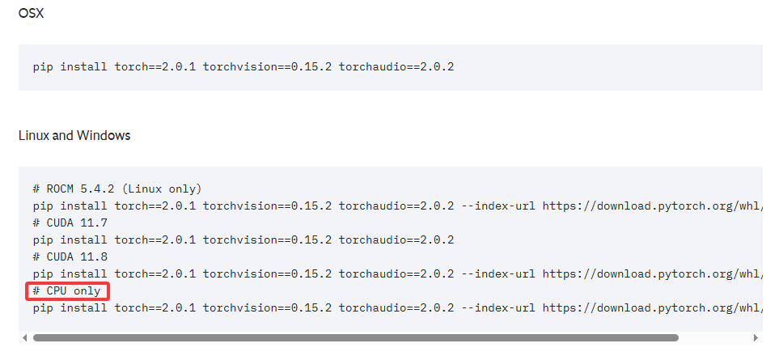

离线安装：

浏览器打开连接：https://download.pytorch.org/whl/cpu/


找到torch，点击进入下载页面，找到适合自己cuda版本的安装包，下载即可（使用迅雷下载比较快）

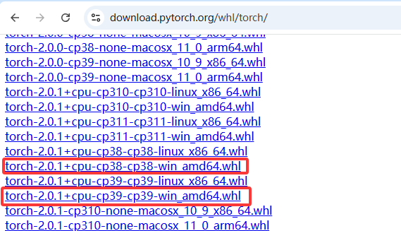


## 5.其他第三方库安装

1.numpy库

```python
pip install numpy==1.26.0 -i https://mirrors.huaweicloud.com/repository/pypi/simple
```

2.matplotlib库

```python
pip install matplotlib -i https://mirrors.huaweicloud.com/repository/pypi/simple
```

3.pandas库

```python
pip install pandas -i https://mirrors.huaweicloud.com/repository/pypi/simple
```

4.sklean库

```python
pip install scikit-learn -i https://mirrors.huaweicloud.com/repository/pypi/simple
```

5.opencv库

```
pip install opencv-python -i https://mirrors.huaweicloud.com/repository/pypi/simple
```

6.torchsummary库(可选)

```
pip install torchsummary -i https://mirrors.huaweicloud.com/repository/pypi/simple
```

