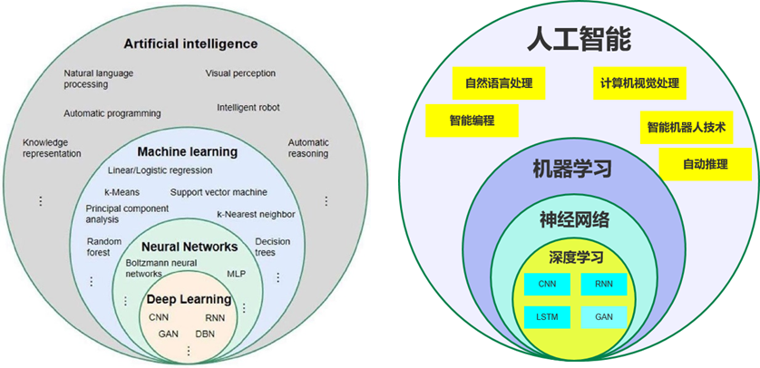
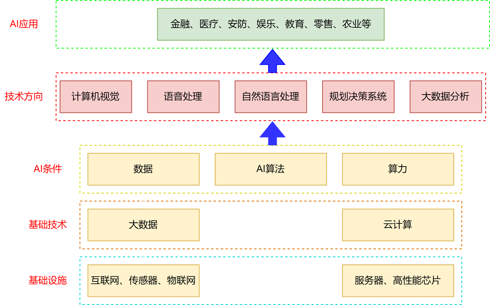
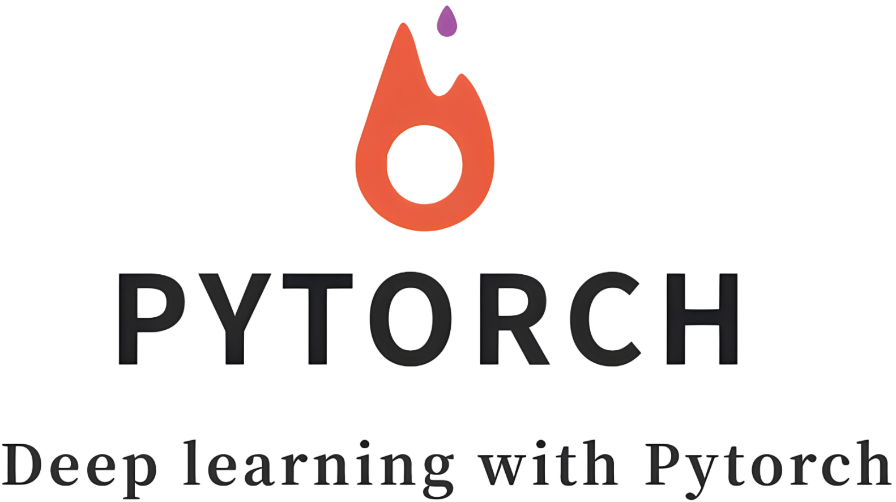

# 一、认识人工智能

大国的游戏，政府支持到位，是未来；

## 1. 人工智能是什么

**AI : Artificial Intelligence**，旨在研究、开发能够模拟、延伸和扩展人类智能的理论、方法、技术及应用系统，是一种拥有自主学习和推理能力的技术。它模仿人类大脑某些功能，包括感知、学习、理解、决策和问题解决。

- **艾伦·图灵（Alan Turing）**：1950年提出“图灵测试”和“机器能否思考”的问题，为AI奠定了哲学与理论基础，但未使用“人工智能”一词
- - **图灵测试**：
- - - 一个人类评判员通过文本（如打字）同时与**一台机器**和**一个真人**对话。
  - - 若评判员无法可靠区分机器与真人（例如正确识别率低于50%），则认为该机器通过了测试。
  - - 简言之：机器需在对话中“伪装成人”，且不被识破。
- “人工智能”这一术语的首次提出是在**1955年8月31日**的一份会议提案中，并于1956年夏季的**达特茅斯会议**上正式确立为学科名称。

**AI本质**

1. 本质是数学计算
2. 数学是理论关键
3. 计算机是实现关键：算力
4. 新的有效算法，需要更大的算力

  NLP（说话，听）、CV（眼睛）、自动驾驶、机器人（肢体动作）、大模型

## 2. 人工智能实现过程

**三要素**：数据、网络、算力

①  神经网络：找到合适的数学公式；

②  训练：用已有数据训练网络，目标是求最优解；

③  推理：用模型预测新样本；

## 3. 术语关系图





## 4. AI产业大生态




# 二、初识Torch

PyTorch，简称Torch，主流的经典的深度学习框架，如果你只想掌握一个深度学习框架，那就毫不犹豫的选择他吧！



**翻译：**用Torch进行深度学习。

通过本阶段的学习, 各位大佬将熟练掌握PyTorch的使用，为后续学习网络搭建、模型训练等打下基础。

## 1. 生涩的简介

​		PyTorch是一个基于Python的深度学习框架，它提供了一种灵活、高效、易于学习的方式来实现深度学习模型。PyTorch最初由Facebook开发，被广泛应用于计算机视觉、自然语言处理、语音识别等领域。

​		PyTorch使用张量（tensor）来表示数据，可以轻松地处理大规模数据集，且可以在GPU上加速。

​		PyTorch提供了许多高级功能，如**自动微分（automatic differentiation）、自动求导（automatic  gradients）**等，这些功能可以帮助我们更好地理解模型的训练过程，并提高模型训练效率。

## 2. 多彩的江湖

除了PyTorch，还有很多其它常见的深度学习框架：

1. TensorFlow： Google开发，广泛应用于学术界和工业界。TensorFlow提供了灵活的构建、训练和部署功能，并支持分布式计算。
2. Keras： Keras是一个高级神经网络API，已整合到TensorFlow中。
3. PaddlePaddle： PaddlePaddle（飞桨）是百度推出的开源深度学习平台，旨在为开发者提供一个易用、高效的深度学习开发框架。
4. MXNet：由亚马逊开发，具有高效的分布式训练支持和灵活的混合编程模型。
5. Caffe：具有速度快、易用性高的特点，主要用于图像分类和卷积神经网络的相关任务。
6. CNTK ：由微软开发的深度学习框架，提供了高效的训练和推理性能。CNTK支持多种语言的接口，包括Python、C++和C#等。
7. Chainer：由Preferred Networks开发的开源深度学习框架，采用动态计算图的方式。

# 三、Tensor概述

**PyTorch会将数据封装成张量（Tensor）进行计算，所谓张量就是元素为相同类型的多维矩阵。**

张量可以在 GPU 上加速运行。

## 1. 概念

张量是一个多维数组，通俗来说可以看作是扩展了标量、向量、矩阵的更高维度的数组。张量的维度决定了它的形状（Shape），例如：

- **标量** 是 0 维张量，如 `a = torch.tensor(5)`
- **向量** 是 1 维张量，如 `b = torch.tensor([1, 2, 3])`
- **矩阵** 是 2 维张量，如 `c = torch.tensor([[1, 2], [3, 4]])`
- 更高维度的张量，如3维、4维等，通常用于表示图像、视频数据等复杂结构。

## 2. 特点

- **动态计算图**：PyTorch 支持动态计算图，这意味着在每一次前向传播时，计算图是即时创建的。
- **GPU 支持**：PyTorch 张量可以通过 `.to('cuda')` 移动到 GPU 上进行加速计算。
- **自动微分**：通过 `autograd` 模块，PyTorch 可以自动计算张量运算的梯度，这对深度学习中的反向传播算法非常重要。

## 3. 数据类型

PyTorch 中的张量支持**3 大类数据类型**：浮点数(含复数)、整数和布尔值。每类根据存储位数不同又分为多种精度级别，形成丰富的数值表示体系。

> #### 为什么需要不同位数？
>
> 计算机使用二进制存储数据，位数决定了数值的**表示范围**和**精度**，直接影响计算速度、内存占用和模型效果：
>
> - **位数越多** → 可表示的范围越大，精度越高 → 计算开销和内存占用越大
> - **位数越少** → 计算速度越快，内存占用越小 → 但可能丢失精度

# 四、Tensor的创建

在Torch中张量以 "类" 的形式封装起来，对张量的一些运算、处理的方法被封装在类中，官方文档：

https://pytorch.org/docs/stable/torch.html#tensors

## 1. 基本创建方式

以下讲的创建tensor的函数中有两个有默认值的参数dtype和device, 分别代表数据类型和计算设备，可以通过属性dtype和device获取。

### 1.1 torch.tensor

注意这里的tensor是小写，该API是根据指定的数据创建张量。

```python
import torch
import numpy as np


def test001():
    # 1. 用标量创建张量
    tensor = torch.tensor(5)
    print(tensor.shape)

    # 2. 使用numpy随机一个数组创建张量
    tensor = torch.tensor(np.random.randn(3, 5))
    print(tensor)
    print(tensor.shape)

    # 3. 根据list创建tensor
    tensor = torch.tensor([[1, 2, 3], [4, 5, 6]])
    print(tensor)
    print(tensor.shape)
    print(tensor.dtype)


if __name__ == '__main__':
    test001()

```

注：如果出现如下错误：

```
UserWarning: Failed to initialize NumPy: _ARRAY_API not found
```

一般是因为numpy和pytorch版本不兼容，可以降低numpy版本，步骤如下：

1.anaconda prompt中切换虚拟环境：

```
conda activate 虚拟环境名称
```

2.卸载numpy：

```
pip uninstall numpy
```

3.安装低版本的numpy：

```
pip install numpy==1.26.0
```

### 1.2 torch.Tensor

注意这里的Tensor是大写，该API根据形状创建张量，其也可用来创建指定数据的张量。

```python
import torch
import numpy as np

def test002():
    # 1. 根据形状创建张量
    tensor1 = torch.Tensor(2, 3)
    print(tensor1)
    # 2. 也可以是具体的值
    tensor2 = torch.Tensor([[1, 2, 3], [4, 5, 6]])
    print(tensor2, tensor2.shape, tensor2.dtype)

    tensor3 = torch.Tensor([10])
    print(tensor3, tensor3.shape, tensor3.dtype)
    
    # 指定tensor数据类型
    tensor1 = torch.Tensor([1,2,3]).short()
    print(tensor1)
    
    tensor1 = torch.Tensor([1,2,3]).int()
    print(tensor1)
    
    tensor1 = torch.Tensor([1,2,3]).float()
    print(tensor1)
    
    tensor1 = torch.Tensor([1,2,3]).double()
    print(tensor1)


if __name__ == "__main__":
    test002()

```

**torch.Tensor与torch.tensor区别**

| 特性               | `torch.Tensor()`     | `torch.tensor()`            |
| :--------------- | :------------------- | :-------------------------- |
| **数据类型推断**       | 强制转为 `torch.float32` | 根据输入数据自动推断（如整数→`int64`）     |
| **显式指定 `dtype`** | 不支持                  | 支持（如 `dtype=torch.float64`） |
| **设备指定**         | 不支持                  | 支持（如 `device='cuda'`）       |
| **输入为张量时的行为**    | 创建新副本（不继承原属性）        | 默认共享数据（除非 `copy=True`）      |
| **推荐使用场景**       | 需要快速创建浮点张量           | 需要精确控制数据类型或设备               |

### 1.3 torch.IntTensor

用于创建指定类型的张量，还有诸如Torch.FloatTensor、 torch.DoubleTensor、 torch.LongTensor......等。

如果数据类型不匹配，那么在创建的过程中会进行类型转换，要尽可能避免，防止数据丢失。

```python
import torch

def test003():
    # 1. 创建指定形状的张量
    tt1 = torch.IntTensor(2, 3)
    print(tt1)

    tt2 = torch.FloatTensor(3, 3)
    print(tt2, tt2.dtype)
    tt3 = torch.DoubleTensor(3, 3)
    print(tt3, tt3.dtype)
    tt4 = torch.LongTensor(3, 3)
    print(tt4, tt4.dtype)
    tt5 = torch.ShortTensor(3, 3)
    print(tt5, tt5.dtype)


if __name__ == "__main__":
    test003()

```

## 2. 创建线性和随机张量

在 PyTorch 中，可以轻松创建线性张量和随机张量。

### 2.1 创建线性张量

使用torch.arange 和 torch.linspace 创建线性张量：

```python
import torch
import numpy as np

# 不用科学计数法打印
torch.set_printoptions(sci_mode=False)


def test004():
    # 1. 创建线性张量
    r1 = torch.arange(0, 10, 2)
    print(r1)
    # 2. 在指定空间按照元素个数生成张量：等差
    r2 = torch.linspace(3, 10, 10)
    print(r2)
    
    r2 = torch.linspace(3, 10000000, 10)
    print(r2)
    

if __name__ == "__main__":
    test004()

```

### 2.2 随机张量

使用torch.randn 创建随机张量。

####  2.2.1 随机数种子

​		随机数种子（Random Seed）是一个用于初始化随机数生成器的数值。随机数生成器是一种算法，用于生成一个**看似**随机的数列，但如果使用相同的种子进行初始化，生成器将产生相同的数列。

​	随机数种子的设置和获取：

```python
import torch


def test001():
    # 设置随机数种子
    torch.manual_seed(123)

    # 获取随机数种子
    print(torch.initial_seed())


if __name__ == "__main__":
    test001()

```

 #### 2.2.2 随机张量

​		在 PyTorch 中，种子影响所有与随机性相关的操作，包括张量的随机初始化、数据的随机打乱、模型的参数初始化等。通过设置随机数种子，可以做到模型训练和实验结果在不同的运行中进行复现。

```python
import torch


def test001():
    # 1. 设置随机数种子
    torch.manual_seed(123)

    # 2. 获取随机数种子，需要查看种子时调用
    print(torch.initial_seed())

    # 3. 生成随机张量，均匀分布（范围 [0, 1)）
    # 创建2个样本，每个样本3个特征
    print(torch.rand(2, 3))

    # 4. 生成随机张量：标准正态分布（均值 0，标准差 1）
    print(torch.randn(2, 3))

    # 5. 原生服从正态分布：均值为2， 方差为3，形状为1*4的正态分布
    print(torch.normal(mean=2, std=3, size=(1, 4)))


if __name__ == "__main__":
    test001()

```

注：不设置随机种子时，每次打印的结果不一样。

# 五、Tensor常见属性

张量有device、dtype、shape等常见属性，知道这些属性对我们认识Tensor很有帮助。

## 1. 获取属性

掌握代码调试就是掌握了一切~

```python
import torch


def test001():
    data = torch.tensor([1, 2, 3])
    print(data.dtype, data.device, data.shape)


if __name__ == "__main__":
    test001()
```

## 2. 切换设备

默认在cpu上运行，可以显式的切换到GPU：不同设备上的数据是不能相互运算的。

```python
import torch


def test001():
    data = torch.tensor([1, 2, 3])
    print(data.dtype, data.device, data.shape)

    # 把数据切换到GPU进行运算
    device = "cuda" if torch.cuda.is_available() else "cpu"
    data = data.to(device)
    print(data.device)


if __name__ == "__main__":
    test001()

```

或者使用cuda进行切换：

```python
data = data.cuda()
```

当然也可以直接创建在GPU上：

```python
# 直接在GPU上创建张量
data = torch.tensor([1, 2, 3], device='cuda')
print(data.device)
```

## 3. 类型转换

在训练模型或推理时，类型转换也是张量的基本操作，是需要掌握的。

```python
import torch


def test001():
    data = torch.tensor([1, 2, 3])
    print(data.dtype)  # torch.int64

    # 1. 使用type进行类型转换
    data = data.type(torch.float32)
    print(data.dtype)  # float32
    data = data.type(torch.float16)
    print(data.dtype)  # float16

    # 2. 使用类型方法
    data = data.float()
    print(data.dtype)  # float32
    # 16 位浮点数，torch.float16，即半精度
    data = data.half()
    print(data.dtype)  # float16
    data = data.double()
    print(data.dtype)  # float64
    data = data.long()
    print(data.dtype)  # int64
    data = data.int()
    print(data.dtype)  # int32

    #  使用dtype属性
    data = torch.tensor([1, 2, 3], dtype=torch.half)
    print(data.dtype)


if __name__ == "__main__":
    test001()

```

# 六、Tensor数据转换

## 1. Tensor与Numpy

Tensor和Numpy都是常见数据格式，惹不起~

### 1.1 张量转Numpy

此时分内存共享和内存不共享~

#### 1.1.1 浅拷贝

调用numpy()方法可以把Tensor转换为Numpy，此时内存是共享的。

```python
import torch


def test003():
    # 1. 张量转numpy
    data_tensor = torch.tensor([[1, 2, 3], [4, 5, 6]])
    data_numpy = data_tensor.numpy()
    print(type(data_tensor), type(data_numpy))
    # 2. 他们内存是共享的
    data_numpy[0, 0] = 100
    print(data_tensor, data_numpy)


if __name__ == "__main__":
    test003()

```

#### 1.1.2 深拷贝

使用copy()方法可以避免内存共享：

```python
import torch


def test003():
    # 1. 张量转numpy
    data_tensor = torch.tensor([[1, 2, 3], [4, 5, 6]])
    
    # 2. 使用copy()避免内存共享
    data_numpy = data_tensor.numpy().copy()
    print(type(data_tensor), type(data_numpy))
    
    # 3. 此时他们内存是不共享的
    data_numpy[0, 0] = 100
    print(data_tensor, data_numpy)


if __name__ == "__main__":
    test003()

```

### 1.2 Numpy转张量

也可以分为内存共享和不共享~

#### 1.2.1 浅拷贝

from_numpy方法转Tensor默认是内存共享的

```python
import numpy as np
import torch


def test006():
    # 1. numpy转张量
    data_numpy = np.array([[1, 2, 3], [4, 5, 6]])
    data_tensor = torch.from_numpy(data_numpy)
    print(type(data_tensor), type(data_numpy))

    # 2. 他们内存是共享的
    data_tensor[0, 0] = 100
    print(data_tensor, data_numpy)


if __name__ == "__main__":
    test006()

```

#### 1.2.2 深拷贝

使用传统的torch.tensor()则内存是不共享的~

```python
import numpy as np
import torch


def test006():
    # 1. numpy转张量
    data_numpy = np.array([[1, 2, 3], [4, 5, 6]])
    data_tensor = torch.tensor(data_numpy)
    print(type(data_tensor), type(data_numpy))

    # 2. 内存是不共享的
    data_tensor[0, 0] = 100
    print(data_tensor, data_numpy)


if __name__ == "__main__":
    test006()

```

# 七、Tensor常见操作

在深度学习中，Tensor是一种多维数组，用于存储和操作数据，我们需要掌握张量各种运算。

## 1. 获取元素值

我们可以把**单个元素**tensor转换为Python数值，这是非常常用的操作

```python
import torch


def test002():
    data = torch.tensor([18])
    print(data.item())
    pass


if __name__ == "__main__":
    test002()

```

注意：

- 和Tensor的维度没有关系，都可以取出来！
- **如果有多个元素则报错**；
- 仅适用于CPU张量，如果张量在GPU上，需先移动到CPU
- ```
  gpu_tensor = torch.tensor([1.0], device='cuda')
  value = gpu_tensor.cpu().item()  # 先转CPU再提取
  ```

## 2. 元素值运算

常见的加减乘除次方取反开方等各种操作，带有_的方法则会替换原始值。

```python
import torch


def test001():
    # 生成范围 [0, 10) 的 2x3 随机整数张量
    data = torch.randint(0, 10, (2, 3))
    print(data)
    # 元素级别的加减乘除：不修改原始值
    print(data.add(1))
    print(data.sub(1))
    print(data.mul(2))
    print(data.div(3))
    print(data.pow(2))

    # 元素级别的加减乘除：修改原始值
    data = data.float()
    data.add_(1)
    data.sub_(1)
    data.mul_(2)
    data.div_(3.0)
    data.pow_(2)
    print(data)


if __name__ == "__main__":
    test001()

```

## 3. 阿达玛积

阿达玛积是指两个形状相同的矩阵或张量对应位置的元素相乘。它与矩阵乘法不同，矩阵乘法是线性代数中的标准乘法，而阿达玛积是逐元素操作。假设有两个形状相同的矩阵 A和 B，它们的阿达玛积 C=A∘B定义为：
$$
C_{ij}=A_{ij}×B_{ij}
$$
其中：

- Cij 是结果矩阵 C的第 i行第 j列的元素。
- Aij和 Bij分别是矩阵 A和 B的第 i行第 j 列的元素。

在 PyTorch 中，可以使用mul函数或者*来实现；

```python
import torch


def test001():
    data1 = torch.tensor([[1, 2, 3], [4, 5, 6]])
    data2 = torch.tensor([[2, 3, 4], [2, 2, 3]])
    print(data1 * data2)


def test002():
    data1 = torch.tensor([[1, 2, 3], [4, 5, 6]])
    data2 = torch.tensor([[2, 3, 4], [2, 2, 3]])
    print(data1.mul(data2))


if __name__ == "__main__":
    test001()
    test002()

```

## 4. Tensor相乘

矩阵乘法是线性代数中的一种基本运算，用于将两个矩阵相乘，生成一个新的矩阵。

假设有两个矩阵：

- 矩阵 A的形状为 m×n（m行 n列）。
- 矩阵 B的形状为 n×p（n行 p列）。

矩阵 A和 B的乘积 C=A×B是一个形状为 m×p的矩阵，其中 C的每个元素 Cij，计算 A的第 i行与 B的第 j列的点积。计算公式为：
$$
C_{ij}=∑_{k=1}^nA_{ik}×B_{kj}
$$


矩阵乘法运算要求如果第一个矩阵的shape是 (N, M)，那么第二个矩阵 shape必须是 (M, P)，最后两个矩阵点积运算的shape为 (N, P)。

在 PyTorch 中，使用@或者matmul完成Tensor的乘法。

```python
import torch


def test006():
    data1 = torch.tensor([
        [1, 2, 3], 
        [4, 5, 6]
    ])
    data2 = torch.tensor([
        [3, 2], 
        [2, 3], 
        [5, 3]
    ])
    print(data1 @ data2)
    print(data1.matmul(data2))


if __name__ == "__main__":
    test006()

```

## 5. 形状操作

在 PyTorch 中，张量的形状操作是非常重要的，因为它允许你灵活地调整张量的维度和结构，以适应不同的计算需求。

### 5.1 reshape

可以用于将张量转换为不同的形状，但要确保转换后的形状与原始形状具有相同的元素数量。

```python
import torch


def test001():
    data = torch.randint(0, 10, (4, 3))
    print(data)
    # 1. 使用reshape改变形状
    data = data.reshape(2, 2, 3)
    print(data)

    # 2. 使用-1表示自动计算
    data = data.reshape(2, -1)
    print(data)


if __name__ == "__main__":
    test001()

```

### 5.2 view

view进行形状变换的特征：

- 张量在内存中是连续的；
- 返回的是原始张量视图，不重新分配内存，效率更高;
- 如果张量在内存中不连续，view 将无法执行，并抛出错误。

#### 5.2.1 内存连续性

张量的内存布局决定了其元素在内存中的存储顺序。对于多维张量，内存布局通常按照**最后一个维度优先**的顺序存储，即先存列，后存行。例如，对于一个二维张量 A，其形状为 (m, n)，其内存布局是先存储第 0 行的所有列元素，然后是第 1 行的所有列元素，依此类推。

如果张量的内存布局与形状完全匹配，并且没有被某些操作（如转置、索引等）打乱，那么这个张量就是**连续的**。

PyTorch 的大多数操作都是基于 C 顺序的，我们在进行变形或转置操作时，很容易造成内存的不连续性。

```python
import torch


def test001():
    tensor = torch.tensor([[1, 2, 3], [4, 5, 6]])
    print("正常情况下的张量：", tensor.is_contiguous())

    # 对张量进行转置操作
    tensor = tensor.t()
    print("转置操作的张量：", tensor.is_contiguous())
    print(tensor)
    # 此时使用view进行变形操作
    tensor = tensor.view(2, -1)
    print(tensor)


if __name__ == "__main__":
    test001()

```

执行结果：

```python
正常情况下的张量： True
转置操作的张量： False
tensor([[1, 4],
        [2, 5],
        [3, 6]])
Traceback (most recent call last):
  File "e:\01.深度学习\01.参考代码\14.PyTorch.内存连续性.py", line 20, in <module>
    test001()
  File "e:\01.深度学习\01.参考代码\14.PyTorch.内存连续性.py", line 13, in test001
    tensor = tensor.view(2, -1)
RuntimeError: view size is not compatible with input tensor's size and stride (at least one dimension spans across two contiguous subspaces). Use .reshape(...) instead.
```

#### 5.2.2 和reshape比较

**view**：高效，但需要张量在内存中是连续的；

**reshape**：更灵活，但涉及内存复制；

#### 5.2.3 view变形操作

```python
import torch


def test002():
    tensor = torch.tensor([[1, 2, 3], [4, 5, 6]])
    # 将 2x3 的张量转换为 3x2
    reshaped_tensor = tensor.view(3, 2)
    print(reshaped_tensor)

    # 自动推断一个维度
    reshaped_tensor = tensor.view(-1, 2)
    print(reshaped_tensor)


if __name__ == "__main__":
    test002()

```

### 5.3 transpose

transpose 用于交换张量的两个维度，注意，是2个维度，它返回的是原张量的视图。

```
torch.transpose(input, dim0, dim1)
```

参数

- input: 输入的张量。
- dim0: 要交换的第一个维度。
- dim1: 要交换的第二个维度。

```python
import torch


def test003():
    data = torch.randint(0, 10, (3, 4, 5))
    print(data, data.shape)
    # 使用transpose进行形状变换
    transpose_data = torch.transpose(data,0,1)
    # transpose_data = data.transpose(0, 1)
    print(transpose_data, transpose_data.shape)


if __name__ == "__main__":
    test003()

```

transpose 返回新张量，原张量不变

转置后的张量可能是非连续的（is_contiguous() 返回 False），如果需要连续内存（如某些操作要求），可调用 .contiguous()：

```python
y = x.transpose(0, 1).contiguous()
```

### 5.4 permute

它通过重新排列张量的维度来返回一个新的张量，**不改变张量的数据**，只改变维度的顺序。

```
torch.permute(input, dims)
```

**参数**

- input: 输入的张量。
- dims: 一个整数元组，表示新的维度顺序。

```python
import torch


def test004():
    data = torch.randint(0, 10, (3, 4, 5))
    print(data, data.shape)
    # 使用permute进行多维度形状变换
    permute_data = data.permute(1, 2, 0)
    print(permute_data, permute_data.shape)


if __name__ == "__main__":
    test004()

```

和 transpose 一样，permute 返回新张量，原张量不变。

重排后的张量可能是非连续的（is_contiguous() 返回 False），必要时需调用 .contiguous()：

```python
y = x.permute(2, 1, 0).contiguous()
```

**维度顺序必须合法**：dims 中的维度顺序必须包含所有原始维度，且不能重复或遗漏。例如，对于一个形状为 (2, 3, 4) 的张量，dims=(2, 0, 1) 是合法的，但 dims=(0, 1) 或 dims=(0, 1, 2, 3) 是非法的。

**与 transpose() 的对比**

| 特性       | permute()     | transpose() |
| :------- | :------------ | :---------- |
| **功能**   | 可以同时调整多个维度的顺序 | 只能交换两个维度的顺序 |
| **灵活性**  | 更灵活           | 较简单         |
| **使用场景** | 适用于多维张量       | 适用于简单的维度交换  |

### 5.5 升维和降维

在后续的网络学习中，升维和降维是常用操作，需要掌握。

- **unsqueeze**：用于在指定位置插入一个大小为 1 的新维度。

- **squeeze**：用于移除所有大小为 1 的维度，或者移除指定维度的大小为 1 的维度。

#### 5.5.1 squeeze降维

```
torch.squeeze(input, dim=None)
```

**参数**

- input: 输入的张量。
- dim (可选): 指定要移除的维度。如果指定了 dim，则只移除该维度（前提是该维度大小为 1）；如果不指定，则移除所有大小为 1 的维度。

```python
import torch


def test006():
    data = torch.randint(0, 10, (1, 4, 5, 1))
    print(data, data.shape)

    # 进行降维操作
    data1 = data.squeeze(0).squeeze(-1)
    print(data.shape)
    
    # 移除所有大小为 1 的维度
	data2 = torch.squeeze(data)
    
    # 尝试移除第 1 维（大小为 3，不为 1，不会报错，张量保持不变。）
	data3 = torch.squeeze(data, dim=1)
	print("尝试移除第 1 维后的形状:", data3.shape)


if __name__ == "__main__":
    test006()

```

#### 5.5.2 unsqueeze升维

```
torch.unsqueeze(input, dim)
```

**参数**

- input: 输入的张量。
- dim: 指定要增加维度的位置（从 0 开始索引）。

```python
import torch
 

def test007():
    data = torch.randint(0, 10, (32, 32, 3))
    print(data.shape)
    # 升维操作
    data = data.unsqueeze(0)
    print(data.shape)


if __name__ == "__main__":
    test007()

```

## 6. 广播机制

广播机制允许在对不同形状的张量进行计算，而无需显式地调整它们的形状。广播机制通过自动扩展较小维度的张量，使其与较大维度的张量兼容，从而实现按元素计算。

### 6.1 广播机制规则

广播机制需要遵循以下规则：

- 每个张量的维度至少为1
- 满足右对齐

### 6.2 广播案例

**1D和2D张量广播**

```python
import torch


def test006():
    data1d = torch.tensor([1, 2, 3])
    data2d = torch.tensor([[4], [2], [3]])
    print(data1d.shape, data2d.shape)
    # 进行计算：会自动进行广播机制
    print(data1d + data2d)


if __name__ == "__main__":
    test006()

```

输出：

```python
    torch.Size([3]) torch.Size([3, 1])
    tensor([[5, 6, 7],
            [3, 4, 5],
            [4, 5, 6]])
```

**2D 和 3D 张量广播**

广播机制会根据需要对两个张量进行形状扩展，以确保它们的形状对齐，从而能够进行逐元素运算。广播是双向奔赴的。

```python
import torch


def test001():
    # 2D 张量
    a = torch.tensor([[1, 2, 3], [4, 5, 6]])
    
    # 3D 张量
    b = torch.tensor([[[2, 3, 4]], [[5, 6, 7]]])
    print(a.shape, b.shape)
    
    # 进行运算
    result = a + b
    print(result, result.shape)


if __name__ == "__main__":
    test001()

```

执行结果：

```python
torch.Size([2, 3]) torch.Size([2, 1, 3])
tensor([[[ 3,  5,  7],
         [ 6,  8, 10]],

        [[ 6,  8, 10],
         [ 9, 11, 13]]]) torch.Size([2, 2, 3])
```

最终参与运算的a和b形式如下：

```python
# 2D 张量
a = torch.tensor([[[1, 2, 3], [4, 5, 6]],[[1, 2, 3], [4, 5, 6]]])

# 3D 张量
b = torch.tensor([[[2, 3, 4], [2, 3, 4]], [[5, 6, 7], [5, 6, 7]]])
```

# 八、自动微分

自动微分模块torch.autograd负责自动计算张量操作的梯度，具有自动求导功能。自动微分模块是构成神经网络训练的必要模块，可以实现网络权重参数的更新，使得反向传播算法的实现变得简单而高效。

## 1. 基础概念

1. **张量**

   Torch中一切皆为张量，属性requires_grad决定是否对其进行梯度计算。默认是 False，如需计算梯度则设置为True。

2. **计算图**：

   torch.autograd通过创建一个动态计算图来跟踪张量的操作，每个张量是计算图中的一个节点，节点之间的操作构成图的边。

   在 PyTorch 中，当张量的 requires_grad=True 时，PyTorch 会自动跟踪与该张量相关的所有操作，并构建计算图。每个操作都会生成一个新的张量，并记录其依赖关系。当设置为 `True` 时，表示该张量在计算图中需要参与梯度计算，即在反向传播（Backpropagation）过程中会自动计算其梯度；当设置为 `False` 时，不会计算梯度。

   例如：
   $$
   z = x * y\\loss = z.sum()
   $$
   在上述代码中，x 和 y 是输入张量，即叶子节点，z 是中间结果，loss 是最终输出。每一步操作都会记录依赖关系：

   z = x * y：z 依赖于 x 和 y。

   loss = z.sum()：loss 依赖于 z。

   这些依赖关系形成了一个动态计算图，如下所示：

   ```
   	  x       y
          \     /
           \   /
            \ /
             z
             |
             |
             v
           loss
   ```

   **叶子节点**：

   在 PyTorch 的自动微分机制中，叶子节点（leaf node） 是计算图中：

   - 由用户直接创建的张量，并且它的 requires_grad=True。
   - 这些张量是计算图的起始点，通常作为模型参数或输入变量。

   特征：

   - 没有由其他张量通过操作生成。
   - 如果参与了计算，其梯度会存储在 leaf_tensor.grad 中。
   - 默认情况下，叶子节点的梯度**不会自动清零**，需要显式调用 optimizer.zero_grad() 或 x.grad.zero_() 清除。

   **如何判断一个张量是否是叶子节点？**

   通过 tensor.is_leaf 属性，可以判断一个张量是否是叶子节点。

   ```python
   x = torch.tensor([1.0, 2.0, 3.0], requires_grad=True)  # 叶子节点
   y = x ** 2  # 非叶子节点（通过计算生成）
   z = y.sum()

   print(x.is_leaf)  # True
   print(y.is_leaf)  # False
   print(z.is_leaf)  # False
   ```

   叶子节点与非叶子节点的区别

   | **特性**         | **叶子节点**        | **非叶子节点**                          |
   | -------------- | --------------- | ---------------------------------- |
   | **创建方式**       | 用户直接创建的张量       | 通过其他张量的运算生成                        |
   | **is_leaf 属性** | True            | False                              |
   | **梯度存储**       | 梯度存储在 .grad 属性中 | 梯度不会存储在 .grad，只能通过反向传播传递           |
   | **是否参与计算图**    | 是计算图的起点         | 是计算图的中间或终点                         |
   | **删除条件**       | 默认不会被删除         | 在反向传播后，默认被释放（除非 retain_graph=True） |

   detach()：张量 x 从计算图中分离出来，返回一个新的张量，与 x 共享数据，但**不包含计算图**（即不会追踪梯度）。

   **特点**：

   - 返回的张量是一个新的张量，与原始张量共享数据。
   - 对 x.detach() 的操作不会影响原始张量的梯度计算。
   - 推荐使用 detach()，因为它更安全，且在未来版本的 PyTorch 中可能会取代 data。

   ```python
   x = torch.tensor([1.0, 2.0, 3.0], requires_grad=True)
   y = x.detach()  # y 是一个新张量，不追踪梯度

   y += 1  # 修改 y 不会影响 x 的梯度计算
   print(x)  # tensor([1., 2., 3.], requires_grad=True)
   print(y)  # tensor([2., 3., 4.])
   ```

3. **反向传播**

   使用tensor.backward()方法执行反向传播，从而计算张量的梯度。这个过程会自动计算每个张量对损失函数的梯度。例如：调用 loss.backward() 从输出节点 loss 开始，沿着计算图反向传播，计算每个节点的梯度。

4. **梯度**

   计算得到的梯度通过tensor.grad访问，这些梯度用于优化模型参数，以最小化损失函数。

## 2. 计算梯度

使用tensor.backward()方法执行反向传播，从而计算张量的梯度

### 2.1 标量梯度计算

参考代码如下：

```python
import torch


def test001():
    # 1. 创建张量：必须为浮点类型
    x = torch.tensor(1.0, requires_grad=True)


    # 2. 操作张量
    y = x ** 2

    # 3. 计算梯度，也就是反向传播
    y.backward()

    # 4. 读取梯度值
    print(x.grad)  # 输出: tensor(2.)


if __name__ == "__main__":
    test001()

```

### 2.2 向量梯度计算

案例：

```python
def test003():
    # 1. 创建张量：必须为浮点类型
    x = torch.tensor([1.0, 2.0, 3.0], requires_grad=True)

    # 2. 操作张量
    y = x ** 2

    # 3. 计算梯度，也就是反向传播
    y.backward()

    # 4. 读取梯度值
    print(x.grad)


if __name__ == "__main__":
    test003()
```

错误预警：RuntimeError: grad can be implicitly created only for scalar outputs

由于 *y* 是一个向量，我们需要提供一个与 *y* 形状相同的向量作为 backward() 的参数，这个参数通常被称为 **梯度张量**（gradient tensor），它表示 *y* 中每个元素的梯度。

```python
def test003():
    # 1. 创建张量：必须为浮点类型
    x = torch.tensor([1.0, 2.0, 3.0], requires_grad=True)

    # 2. 操作张量
    y = x ** 2

    # 3. 计算梯度，也就是反向传播
    y.backward(torch.tensor([1.0, 1.0, 1.0]))

    # 4. 读取梯度值
    print(x.grad)
    
    # 输出
    # tensor([2., 4., 6.])


if __name__ == "__main__":
    test003()
```

我们也可以将向量 *y* 通过一个标量损失函数（如 y.mean()）转换为一个标量，反向传播时就不需要提供额外的梯度向量参数了。这是因为标量的梯度是明确的，直接调用 .backward() 即可。

```python
import torch


def test002():
    # 1. 创建张量：必须为浮点类型
    x = torch.tensor([1.0, 2.0, 3.0], requires_grad=True)

    # 2. 操作张量
    y = x ** 2

    # 3. 损失函数
    loss = y.mean()

    # 4. 计算梯度，也就是反向传播
    loss.backward()

    # 5. 读取梯度值
    print(x.grad)


if __name__ == "__main__":
    test002()

```

调用 loss.backward() 从输出节点 loss 开始，沿着计算图反向传播，计算每个节点的梯度。

损失函数$$loss=mean(y)=\frac{1}{n}∑_{i=1}^ny_i$$，其中 *n*=3。

对于每个 $y_i$，其梯度为 $\frac{∂loss}{∂y_i}=\frac{1}{n}=\frac13$。

对于每个 $x_i$，其梯度为：
$$
\frac{∂loss}{∂x_i}=\frac{∂loss}{∂y_i}×\frac{∂y_i}{∂x_i}=\frac1{3}×2x_i=\frac{2x_i}3
$$
所以，x.grad 的值为：$[\frac{2×1.0}3, \frac{2×2.0}3, \frac{2×3.0}3]=[\frac23,\frac43,2]≈[0.6667,1.3333,2.0000]$

### 2.3 多标量梯度计算

参考代码如下

```python
import torch


def test003():
    # 1. 创建两个标量
    x1 = torch.tensor(5.0, requires_grad=True, dtype=torch.float64)
    x2 = torch.tensor(3.0, requires_grad=True, dtype=torch.float64)

    # 2. 构建运算公式
    y = x1**2 + 2 * x2 + 7
    
    # 3. 计算梯度，也就是反向传播
    y.backward()
    
    # 4. 读取梯度值
    print(x1.grad, x2.grad)
    
    # 输出：
    # tensor(10., dtype=torch.float64) tensor(2., dtype=torch.float64)


if __name__ == "__main__":
    test003()

```

### 2.4 多向量梯度计算

代码参考如下

```python
import torch


def test004():
    # 创建两个张量，并设置 requires_grad=True
    x = torch.tensor([1.0, 2.0, 3.0], requires_grad=True)
    y = torch.tensor([4.0, 5.0, 6.0], requires_grad=True)

    # 前向传播：计算 z = x * y
    z = x * y

    # 前向传播：计算 loss = z.sum()
    loss = z.sum()

    # 查看前向传播的结果
    print("z:", z)  # 输出: tensor([ 4., 10., 18.], grad_fn=<MulBackward0>)
    print("loss:", loss)  # 输出: tensor(32., grad_fn=<SumBackward0>)

    # 反向传播：计算梯度
    loss.backward()

    # 查看梯度
    print("x.grad:", x.grad)  # 输出: tensor([4., 5., 6.])
    print("y.grad:", y.grad)  # 输出: tensor([1., 2., 3.])


if __name__ == "__main__":
    test004()

```

## 3. 梯度上下文控制

梯度计算的上下文控制和设置对于管理计算图、内存消耗、以及计算效率至关重要。下面我们学习下Torch中与梯度计算相关的一些主要设置方式。

### 3.1 控制梯度计算

梯度计算是有性能开销的，有些时候我们只是简单的运算，并不需要梯度

```python
import torch


def test001():
    x = torch.tensor(10.5, requires_grad=True)
    print(x.requires_grad)  # True

    # 1. 默认y的requires_grad=True
    y = x**2 + 2 * x + 3
    print(y.requires_grad)  # True

    # 2. 如果不需要y计算梯度-with进行上下文管理
    with torch.no_grad():
        y = x**2 + 2 * x + 3
    print(y.requires_grad)  # False

    # 3. 如果不需要y计算梯度-使用装饰器
    @torch.no_grad()
    def y_fn(x):
        return x**2 + 2 * x + 3

    y = y_fn(x)
    print(y.requires_grad)  # False

    # 4. 如果不需要y计算梯度-全局设置，需要谨慎
    torch.set_grad_enabled(False)
    y = x**2 + 2 * x + 3
    print(y.requires_grad)  # False


if __name__ == "__main__":
    test001()

```

### 3.2 累计梯度

默认情况下，当我们重复对一个自变量进行梯度计算时，梯度是累加的

```python
import torch


def test002():
    # 1. 创建张量：必须为浮点类型
    x = torch.tensor([1.0, 2.0, 5.3], requires_grad=True)

    # 2. 累计梯度：每次计算都会累计梯度
    for i in range(3):
        y = x**2 + 2 * x + 7
        z = y.mean()
        z.backward()
        print(x.grad)


if __name__ == "__main__":
    test002()

```

输出结果：

```python
tensor([1.3333, 2.0000, 4.2000])
tensor([2.6667, 4.0000, 8.4000])
tensor([ 4.0000,  6.0000, 12.6000])
```

思考：如果把 y = x**2 + 2 * x + 7放在循环外，会是什么结果？

 会报错：

```
RuntimeError: Trying to backward through the graph a second time (or directly access saved tensors after they have already been freed). Saved intermediate values of the graph are freed when you call .backward() or autograd.grad(). Specify retain_graph=True if you need to backward through the graph a second time or if you need to access saved tensors after calling backward.
```

PyTorch 的自动求导机制在调用 `backward()` 时，会计算梯度并将中间结果存储在计算图中。默认情况下，这些中间结果在第一次调用 `backward()` 后会被释放，以节省内存。如果再次调用 `backward()`，由于中间结果已经被释放，就会抛出这个错误。

### 3.3 梯度清零

大多数情况下是不需要梯度累加的，奇葩的事情还是需要解决的~

```python
import torch


def test002():
    # 1. 创建张量：必须为浮点类型
    x = torch.tensor([1.0, 2.0, 5.3], requires_grad=True)

    # 2. 累计梯度：每次计算都会累计梯度
    for i in range(3):
        y = x**2 + 2 * x + 7
        z = y.mean()
        # 2.1 反向传播之前先对梯度进行清零
        if x.grad is not None:
            x.grad.zero_()
            
        z.backward()
        print(x.grad)


if __name__ == "__main__":
    test002()
    
# 输出：
# tensor([1.3333, 2.0000, 4.2000])
# tensor([1.3333, 2.0000, 4.2000])
# tensor([1.3333, 2.0000, 4.2000])

```

### 3.4 案例1-求函数最小值

通过梯度下降找到函数最小值

```python
import torch
from matplotlib import pyplot as plt
import numpy as np


def test01():
    x = np.linspace(-10, 10, 100)
    y = x ** 2

    plt.plot(x, y)

    plt.show()


def test02():
    # 初始化自变量X
    x = torch.tensor([3.0], requires_grad=True, dtype=torch.float)
    # 迭代轮次
    epochs = 50
    # 学习率
    lr = 0.1

    list = []
    for i in range(epochs):
        # 计算函数表达式
        y = x ** 2

        # 梯度清零
        if x.grad is not None:
            x.grad.zero_()
        # 反向传播
        y.backward()
        # 梯度下降，不需要计算梯度，为什么？
        with torch.no_grad():
            x -= lr * x.grad

        print('epoch:', i, 'x:', x.item(), 'y:', y.item())
        list.append((x.item(), y.item()))

    # 散点图，观察收敛效果
    x_list = [l[0] for l in list]
    y_list = [l[1] for l in list]

    plt.scatter(x=x_list, y=y_list)
    plt.show()


if __name__ == "__main__":
    test01()
    test02()

```

代码解释：

```python
# 梯度下降，不需要计算梯度
with torch.no_grad():
    x -= lr * x.grad
```

如果去掉梯度控制会有什么结果？

代码中去掉梯度控制会报异常：

```
RuntimeError: a leaf Variable that requires grad is being used in an in-place operation.
```

因为代码中x是叶子节点(叶子张量)，是计算图的开始节点，并且设置需要梯度。在pytorch中不允许对**需要梯度**的叶子变量进行原地操作。因为这会破坏计算图，导致梯度计算错误。

在代码中，x 是一个叶子变量（即直接定义的张量，而不是通过其他操作生成的张量），并且设置了 requires_grad=True，因此不能直接通过 -= 进行原地更新。

**解决方法**

为了避免这个错误，可以使用以下两种方法：

**方法 1**：使用 torch.no_grad() 上下文管理器

在更新参数时，使用 torch.no_grad() 禁用梯度计算，然后通过非原地操作更新参数。

```python
with torch.no_grad():
    a -= lr * a.grad
```

**方法 2**：使用 data 属性或detach()

通过 x.data 访问张量的数据部分（不涉及梯度计算），然后进行原地操作。

```python
x.data -= lr * x.grad
```

x.data返回一个与 a 共享数据的张量，但**不包含计算图**

**特点**：

- 返回的张量与原始张量共享数据。
- 对 x.data 的操作是**原地操作**（in-place），可能会影响原始张量的梯度计算。
- 不推荐使用 data，因为它可能会导致意外的行为（如梯度计算错误）。

能不能将代码修改为：

```
x = x - lr * x.grad
```

答案是不能，以上代码中=左边的x变量是由右边代码计算得出的，就不是叶子节点了，从计算图中被剥离出来后没有了梯度，报错：

```
RuntimeError: element 0 of tensors does not require grad and does not have a grad_fn
```

总结：以上方均不推荐，正确且推荐的做法是使用优化器，优化器后续会讲解。

### 3.5 案例2-函数参数求解

```python
import torch

def test02():
    # 定义数据
    x = torch.tensor([1, 2, 3, 4, 5], dtype=torch.float)
    y = torch.tensor([3, 5, 7, 9, 11], dtype=torch.float)

    # 定义模型参数 a 和 b，并初始化
    a = torch.tensor([1], dtype=torch.float, requires_grad=True)
    b = torch.tensor([1], dtype=torch.float, requires_grad=True)
    # 学习率
    lr = 0.1
    # 迭代轮次
    epochs = 100

    for epoch in range(epochs):


        # 前向传播：计算预测值 y_pred
        y_pred = a * x + b

        # 定义损失函数
        loss = ((y_pred - y) ** 2).mean()

        if a.grad is not None and b.grad is not None:
            a.grad.zero_()
            b.grad.zero_()

        # 反向传播：计算梯度
        loss.backward()

        # 梯度下降
        with torch.no_grad():
            a -= lr * a.grad
            b -= lr * b.grad

        if (epoch + 1) % 10 == 0:
            print(f'Epoch [{epoch + 1}/{epochs}], Loss: {loss.item():.4f}')

    print(f'a: {a.item()}, b: {b.item()}')


if __name__ == '__main__':
    test02()

```

**代码逻辑：**

在 PyTorch 中，所有的张量操作都会被记录在一个计算图中。对于代码：

```python
y_pred = a * x + b
loss = ((y_pred - y) ** 2).mean()
```

计算图如下：

```
a → y_pred → loss
x ↗
b ↗
```

- a 和 b 是需要计算梯度的叶子张量（requires_grad=True）。
- y_pred 是中间结果，依赖于 a 和 b。
- loss 是最终的标量输出，依赖于 y_pred。

当调用 loss.backward() 时，PyTorch 会从 loss 开始，沿着计算图反向传播，计算 loss 对每个需要梯度的张量（如 a 和 b）的梯度。

1、计算 loss 对 y_pred 的梯度：
$$
loss = ((y_pred - y)^ 2).mean()=\frac{1}{n}\Sigma_{i=1}^n(y\_pred_i - y_i)^2
$$
求损失函数关于 *y*_pred 的梯度（即偏导数组成的向量）。由于 loss 是 y_pred 的函数，我们需要对每个$y\_pred_i$求偏导数，并将它们组合成一个向量。

应用链式法则和常数求导规则，对于每个 $(y\_pred_i−y_i)^2$ 项，梯度向量的每个分量是：
$$
\frac{∂loss}{∂y\_pred_i} = \frac{2}{n} (y\_pred_i−y_i)
$$
将结果组合成一个向量，我们得到：
$$
\frac{∂loss}{∂y\_pred} = [\frac{2}{n} (y\_pred_1−y_1), \frac{2}{n} (y\_pred_2−y_2),...,\frac{2}{n} (y\_pred_n−y_n)]\\
=\frac{2}{n} (y\_pred−y)
$$
其中n=5，y_pred和y均为向量。

2、计算 y_pred 对 a 和 b 的梯度：

```
y_pred = a * x + b
```

对 a 求导：$\frac{∂y_pred}{∂a}=x$，x为向量

对 b 求导：$\frac{∂y_pred}{∂b}=1$

3、根据链式法则，loss 对 a 的梯度为：
$$
\frac{∂loss}{∂a}=\frac{∂loss}{∂y\_pred}⋅\frac{∂y\_pred}{∂a} = \frac{2}{n} (y\_pred−y)x
$$
loss 对 b 的梯度为：
$$
\frac{∂loss}{∂b}=\frac{∂loss}{∂y\_pred}⋅\frac{∂y\_pred}{∂b} = \frac{2}{n} (y\_pred−y)
$$
代码运行结果：

```python
Epoch [10/100], Loss: 3020.7896
Epoch [20/100], Loss: 1550043.3750
Epoch [30/100], Loss: 795369408.0000
Epoch [40/100], Loss: 408125767680.0000
Epoch [50/100], Loss: 209420457869312.0000
Epoch [60/100], Loss: 107459239932329984.0000
Epoch [70/100], Loss: 55140217861896667136.0000
Epoch [80/100], Loss: 28293929961149737992192.0000
Epoch [90/100], Loss: 14518387713533614273593344.0000
Epoch [100/100], Loss: 7449779870375595263567855616.0000
a: -33038608105472.0, b: -9151163924480.0
```

损失函数在训练过程中越来越大，表明模型的学习过程出现了问题。这是因为学习率（Learning Rate）过大，参数更新可能会“跳过”最优值，导致损失函数在最小值附近震荡甚至发散。

解决方法：调小学习率，将lr=0.01

代码运行结果：

```python
Epoch [10/100], Loss: 0.0965
Epoch [20/100], Loss: 0.0110
Epoch [30/100], Loss: 0.0099
Epoch [40/100], Loss: 0.0092
Epoch [50/100], Loss: 0.0086
Epoch [60/100], Loss: 0.0081
Epoch [70/100], Loss: 0.0075
Epoch [80/100], Loss: 0.0071
Epoch [90/100], Loss: 0.0066
Epoch [100/100], Loss: 0.0062
a: 1.9492162466049194, b: 1.1833451986312866
```

可以看出loss损失函数值在收敛，a接近2，b接近1

将epochs=500

代码运行结果：

```python
Epoch [440/500], Loss: 0.0006
Epoch [450/500], Loss: 0.0006
Epoch [460/500], Loss: 0.0005
Epoch [470/500], Loss: 0.0005
Epoch [480/500], Loss: 0.0005
Epoch [490/500], Loss: 0.0004
Epoch [500/500], Loss: 0.0004
a: 1.986896276473999, b: 1.0473089218139648
```

a已经无限接近2，b无限接近1	
